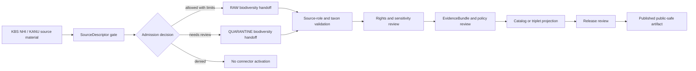

<!-- [KFM_META_BLOCK_V2]
doc_id: kfm://doc/connectors-kbs-readme
title: connectors/kbs/ — KBS Compatibility Connector Lane
type: readme
version: v0.1
status: draft
owners: OWNER_TBD — Connector steward · Kansas source steward · Biodiversity steward · Flora steward · Fauna steward · Habitat steward · Rights reviewer · Sensitivity reviewer · Validation steward · Docs steward
created: 2026-06-19
updated: 2026-06-19
policy_label: public-doctrine; compatibility-lane; noncanonical-path; biodiversity-source; rights-gated; sensitivity-gated; no-publication
proposed_path: connectors/kbs/README.md
truth_posture: CONFIRMED path exists / NONCANONICAL compatibility README / CANONICAL HOME CONFIRMED AS connectors/kansas/kbs/ BY SOURCE PROFILE
related:
  - ../README.md
  - ../kansas/README.md
  - ../kansas/kbs/README.md
  - ../kansas/kbs_herbarium/README.md
  - ../../docs/sources/catalog/kansas/kbs.md
  - ../../docs/sources/catalog/kansas/kdwp.md
  - ../../docs/sources/catalog/kansas/ku-nhm.md
  - ../../docs/sources/catalog/kansas/ku-herbarium.md
  - ../../docs/domains/flora/README.md
  - ../../docs/domains/fauna/README.md
  - ../../docs/domains/habitat/README.md
  - ../../docs/sources/SOURCE_DESCRIPTOR_STANDARD.md
  - ../../data/registry/sources/
  - ../../data/raw/flora/
  - ../../data/quarantine/flora/
  - ../../data/raw/fauna/
  - ../../data/quarantine/fauna/
  - ../../fixtures/
  - ../../schemas/contracts/v1/source/
  - ../../schemas/contracts/v1/biodiversity/
  - ../../policy/sensitivity/
  - ../../policy/rights/
  - ../../release/
tags: [kfm, connectors, kbs, kansas, biodiversity, kbs-nhi, kanu, herbarium, compatibility, authority-source, observed-source, source-admission, raw, quarantine, governance]
notes:
  - "This README fills a previously blank top-level KBS connector path."
  - "The KBS source profile explicitly says `connectors/kbs/` is not a canonical connector family and that the adapter belongs under `connectors/kansas/kbs/`."
  - "This top-level `connectors/kbs/` path is therefore a compatibility lane, not a new canonical authority root."
  - "KBS NHI (`authority`) and KANU specimen records (`observed`) must remain separate source roles."
  - "Rights, access endpoints, harvest cadence, fixtures, tests, source activation, and release classes remain NEEDS VERIFICATION."
  - "Connector output may enter RAW or QUARANTINE handoff only; downstream validation, EvidenceBundle closure, rights/sensitivity review, catalog/triplet projection, release review, publication, correction, and rollback remain outside this folder."
[/KFM_META_BLOCK_V2] -->

<a id="top"></a>

# KBS Compatibility Connector Lane

> Compatibility README for the existing top-level `connectors/kbs/` path. This path is **not** the canonical connector home; KBS connector work belongs under `connectors/kansas/kbs/` unless a later ADR or migration decision says otherwise.

<p>
  
  
  
  
  
</p>

> [!IMPORTANT]
> **Status:** compatibility / noncanonical-path README · **Owner:** `OWNER_TBD`  
> **Path:** `connectors/kbs/README.md`  
> **Truth posture:** `CONFIRMED` file exists · `NONCANONICAL` compatibility path · `CONFIRMED` source profile points canonical work to `connectors/kansas/kbs/`  
> **Boundary:** source-admission compatibility only; no public biodiversity release, no source-role collapse, no direct publication, no rights/sensitivity bypass.

**Quick jumps:** [Scope](#scope) · [Repo fit](#repo-fit) · [Accepted inputs](#accepted-inputs) · [Exclusions](#exclusions) · [Evidence ledger](#evidence-ledger) · [Lifecycle diagram](#lifecycle-diagram) · [Admission posture](#admission-posture) · [Anti-collapse rules](#anti-collapse-rules) · [Validation](#validation) · [Rollback](#rollback) · [Verification backlog](#verification-backlog)

---

## Scope

`connectors/kbs/` is retained here only as a compatibility lane because the path already exists.

The KBS source profile states that this top-level path is incorrect and that KBS belongs under the canonical Kansas connector family as `connectors/kansas/kbs/`. This README exists to prevent drift, preserve migration intent, and keep source-admission boundaries explicit.

This path must not become the canonical KBS connector home unless an ADR or migration decision explicitly changes the source-profile placement.

[Back to top ↑](#top)

---

## Repo fit

| Surface | Role | Status |
|---|---|---:|
| `connectors/kbs/` | Existing top-level compatibility path. | **CONFIRMED path / NONCANONICAL** |
| `connectors/kansas/kbs/` | Canonical KBS adapter home named by source profile. | **CONFIRMED by source profile / NEEDS VERIFICATION implementation depth** |
| `connectors/kansas/kbs_herbarium/` | KANU/herbarium-adjacent compatibility or sublane. | **CONFIRMED README path / PLACEMENT NEEDS VERIFICATION** |
| `connectors/kansas/` | Canonical Kansas connector-family lane. | **CONFIRMED** |
| `docs/sources/catalog/kansas/kbs.md` | Human-facing KBS source product page. | **CONFIRMED** |
| `data/registry/sources/` | SourceDescriptor authority. | **Outside connector / NEEDS VERIFICATION for entries** |
| `data/raw/flora/`, `data/raw/fauna/`, `data/raw/habitat/` | Candidate RAW handoff targets. | **PROPOSED / NEEDS VERIFICATION** |
| `data/quarantine/flora/`, `data/quarantine/fauna/`, `data/quarantine/habitat/` | Candidate quarantine handoff targets. | **PROPOSED / NEEDS VERIFICATION** |
| `policy/rights/` and `policy/sensitivity/` | Rights and sensitivity authority. | **Outside connector** |
| `release/` | Release and publication controls. | **Out of scope for this compatibility lane** |

[Back to top ↑](#top)

---

## Accepted inputs

Accepted content for this noncanonical compatibility path:

- README-level migration and compatibility notes;
- links to the canonical `connectors/kansas/kbs/` path;
- notes that prevent this top-level path from becoming a parallel authority;
- temporary fixture or test notes only if they are explicitly migration-bound;
- adapter notes for KBS NHI or KANU only if retained here by ADR or migration note;
- quarantine criteria for unresolved rights, source role, taxon identity, occurrence identity, natural-heritage rank meaning, geometry, sensitivity, access endpoint, or source-shape issues.

New implementation code should prefer `connectors/kansas/kbs/` unless an ADR says otherwise.

---

## Exclusions

This folder must not contain or imply authority over:

- canonical connector-family status;
- public biodiversity, occurrence, habitat, or natural-heritage release decisions;
- direct writes to `PROCESSED`, `CATALOG`, `TRIPLET`, `PUBLISHED`, proof, receipt, or release stores;
- SourceDescriptor authority records;
- policy or schema authority;
- generated summaries presented as biodiversity truth;
- source activation without SourceDescriptor, rights, sensitivity, source-role, taxonomy, geometry, provenance, and review checks.

Redirect implementation and source-family authority to `connectors/kansas/kbs/` once verified.

[Back to top ↑](#top)

---

## Evidence ledger

| Source | Status | Supports | Limits |
|---|---:|---|---|
| `connectors/kbs/README.md` | **CONFIRMED** | Target file exists and was blank before this update. | Does not prove implementation files, tests, or CI. |
| `docs/sources/catalog/kansas/kbs.md` | **CONFIRMED** | KBS source profile says `connectors/kbs/` is incorrect and KBS belongs under `connectors/kansas/kbs/`; it also requires separate KBS NHI authority and KANU observed roles. | Does not prove endpoint availability, source activation, or connector implementation. |
| `connectors/kansas/README.md` | **CONFIRMED** | Kansas connector family is the canonical source-admission lane for Kansas source products. | Does not prove KBS child implementation depth. |
| `connectors/kansas/kbs/` | **NEEDS VERIFICATION** | Named as canonical adapter home by source profile. | Actual files, code, fixtures, tests, and CI remain unverified here. |

---

## Lifecycle diagram



[Back to top ↑](#top)

---

## Admission posture

Expected behavior for KBS source-admission work:

- no live source access unless explicitly enabled and reviewed;
- no source fetch without an accepted SourceDescriptor and activation decision;
- no implicit publication from retrieved source material;
- no collapse of KBS NHI authority rankings and KANU observed specimen records;
- no conversion of KBS-derived records into public occurrence, range, habitat, or status truth without downstream review;
- no loss of source ID, source URI, institutional surface, source role, taxon fields, rank/status fields, specimen/occurrence identity, geometry/uncertainty, date/vintage, license/rights, sensitivity, review, or release-class metadata;
- unclear rights, source role, taxon identity, rank meaning, occurrence identity, geometry, sensitivity, access endpoint, freshness, or schema drift routes to quarantine or abstention.

---

## Anti-collapse rules

The KBS source profile identifies the controlling anti-collapse stack:

1. `connectors/kbs/` is compatibility-only; canonical work belongs under `connectors/kansas/kbs/`.
2. KBS NHI is an `authority` source for natural-heritage rankings.
3. KANU specimen records are `observed` source material.
4. Authority/rank context and observed/specimen occurrence material must remain separately described.
5. Restricted or sensitive taxa must fail closed into quarantine, redaction, generalization, or reviewed release workflows.
6. Public release is a governed state transition, not a connector output.
7. Derived summaries, maps, tiles, joins, and AI explanations are downstream carriers, not sovereign truth.

---

## Validation

Compatibility-lane validation should check that:

- this path is not treated as canonical without ADR/migration evidence;
- source metadata is preserved;
- SourceDescriptor references are required for activation;
- KBS NHI and KANU roles are explicit and not collapsed;
- rights and sensitivity states are explicit before promotion-track use;
- taxon identity, rank/status fields, occurrence/specimen identity, source URI, geometry/uncertainty, date/vintage, access method, source role, review, and release-class fields are explicit where available;
- malformed or incomplete records fail closed;
- records with unclear rights, unresolved sensitivity, unresolved taxon identity, unresolved source role, unresolved rank meaning, unresolved occurrence identity, or unresolved geometry route to quarantine;
- connector output is limited to RAW or QUARANTINE handoff;
- no connector run writes directly to processed, catalog, triplet, published, proof, receipt, or release stores.

Root-level validation, policy-as-code, EvidenceBundle closure, release review, public caveats, and rollback remain outside this compatibility lane.

[Back to top ↑](#top)

---

## Definition of done

This compatibility README is ready for first review when:

- [ ] KBS source profile is linked and current enough for review.
- [ ] A migration or ADR decision resolves whether to remove this top-level path, keep it as a redirect, or move implementation under `connectors/kansas/kbs/`.
- [ ] Canonical KBS implementation home is verified.
- [ ] SourceDescriptor homes and KBS/KANU source IDs are verified.
- [ ] Rights terms, access endpoints, harvest cadence, fixture strategy, and sensitivity checks are verified by source steward review.
- [ ] Live source access is disabled by default for connector code.
- [ ] Source-role, taxonomy, rank/status, occurrence/specimen identity, rights, sensitivity, geometry, and anti-collapse checks are represented in tests.
- [ ] Connector output is limited to RAW or QUARANTINE handoff.
- [ ] No public biodiversity claims are created by connector code.

---

## Rollback

Rollback is required if this README is used to justify canonical-family status, direct publication, source activation, source-role collapse, rights/sensitivity bypass, public biodiversity claims, or direct writes beyond RAW/QUARANTINE handoff.

Rollback target:

```text
commit prior to this update: SHA_TBD_AFTER_GIT_HISTORY_CHECK
```

Because the file was blank before this update, a safe rollback is to restore the blank placeholder or replace this document with a shorter redirect-only README until canonical placement is resolved.

---

## Verification backlog

| Item | Status | Needed evidence |
|---|---:|---|
| Confirm canonical `connectors/kansas/kbs/` implementation files. | **NEEDS VERIFICATION** | Repo tree or mounted workspace. |
| Confirm whether this top-level path should remain. | **NEEDS VERIFICATION** | ADR or migration decision. |
| Confirm SourceDescriptor homes and source IDs for KBS NHI and KANU. | **NEEDS VERIFICATION** | Source registry entries and accepted schemas. |
| Confirm current access endpoints, cadence, and terms. | **NEEDS VERIFICATION** | Source steward review and current source documentation. |
| Confirm rights and sensitivity handling. | **NEEDS VERIFICATION** | Rights review, sensitivity review, and policy references. |
| Confirm fixture strategy and CI wiring. | **NEEDS VERIFICATION** | Fixture registry, workflow files, and test logs. |

---

## Maintainer note

Do not build new authority here. This existing top-level path should either stay a clear compatibility pointer or be removed after migration. Implementation should converge under `connectors/kansas/kbs/` unless an ADR says otherwise.

[Back to top ↑](#top)
