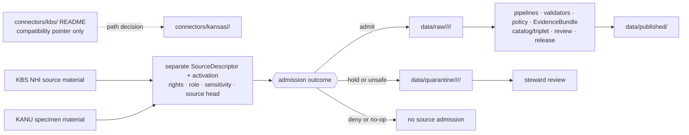

<!-- [KFM_META_BLOCK_V2]
doc_id: kfm://doc/connectors-kbs-readme
title: connectors/kbs/ — KBS Compatibility Connector Lane
type: readme
version: v0.2
status: draft
owners: OWNER_TBD — Connector steward · Kansas source steward · Biodiversity steward · Flora steward · Fauna steward · Habitat steward · Rights reviewer · Sensitivity reviewer · Validation steward · Docs steward
created: 2026-06-19
updated: 2026-07-13
policy_label: public-doctrine; compatibility-lane; noncanonical-path; path-and-role-conflict; rights-gated; sensitivity-gated; no-activation; no-publication
current_path: connectors/kbs/README.md
truth_posture: CONFIRMED current compatibility README, Kansas family parent, current KANU child README, exact absent-path probes, source profiles, schema bytes, empty authority register, and target history / CONFLICTED final KBS-KANU child topology and SourceDescriptor machine authority / PROPOSED redirect-and-migration contract / UNKNOWN connector runtimes, source activation, current rights, endpoint health, fixtures, tests, CI enforcement, and release readiness
evidence_snapshot:
  repository: bartytime4life/Kansas-Frontier-Matrix
  base_ref: main
  base_commit: 04dc59cdab3213633cf9c46622490a8675386dbe
  prior_blob: f7539e7984719ca654f72d36c5cbcaae9bd38761
  readme_introduction_commit: c4e9aa27f725cd73b6f604e881d61cad00dece49
related:
  - ../README.md
  - ../kansas/README.md
  - ../kansas/kbs_herbarium/README.md
  - ../../CONTRIBUTING.md
  - ../../.github/CODEOWNERS
  - ../../docs/doctrine/directory-rules.md
  - ../../docs/adr/ADR-0012-connector-outputs-to-data-raw-or-data-quarantine-only.md
  - ../../docs/sources/SOURCE_DESCRIPTOR_STANDARD.md
  - ../../docs/sources/catalog/kansas/kbs.md
  - ../../docs/sources/catalog/kansas/ku-herbarium.md
  - ../../schemas/contracts/v1/source/source_descriptor.schema.json
  - ../../schemas/contracts/v1/sources/source_descriptor.schema.json
  - ../../data/registry/sources/README.md
  - ../../control_plane/source_authority_register.yaml
  - ../../policy/rights/
  - ../../policy/sensitivity/
  - ../../release/
tags: [kfm, connectors, kbs, kansas, biodiversity, kbs-nhi, kanu, herbarium, compatibility, source-admission, source-role, raw, quarantine, rights, sensitivity, governance]
notes:
  - "The top-level connectors/kbs/ path is verified but remains a compatibility lane under the connectors responsibility root."
  - "The Kansas family parent and connectors/kansas/kbs_herbarium/ README are verified at the pinned base; the exact proposed connectors/kansas/kbs/ and connectors/kansas/ku-herbarium/ README paths returned Not Found."
  - "The current kbs_herbarium lane documents KANU specimen admission only and does not establish a KBS Natural Heritage Inventory connector."
  - "KBS NHI authority/ranking material and KANU specimen observations must remain separate source surfaces, descriptors, roles, rights reviews, and sensitivity decisions."
  - "SourceDescriptor authority is conflicted: the populated singular-path schema labels the plural path canonical, the plural-path schema is an empty PROPOSED scaffold, narrative and machine role vocabularies differ, and the source-authority register has no entries."
  - "Only this Markdown file is in scope. No connector code, path move, SourceDescriptor, registry entry, fixture, test, workflow, source access, receipt, proof, release object, or public artifact is created."
[/KFM_META_BLOCK_V2] -->

<a id="top"></a>

# KBS Compatibility Connector Lane

> [!IMPORTANT]
> **Document lifecycle:** `draft`  
> **Component maturity:** compatibility pointer; KBS/KANU connector runtime `UNKNOWN`  
> **Owner:** `OWNER_TBD`  
> **Truth posture:** `CONFIRMED` current compatibility path, Kansas family parent, current KANU README lane, exact absent-path probes, and cited repository evidence · `CONFLICTED` final child topology and `SourceDescriptor` machine authority · `PROPOSED` redirect-and-migration contract  
> **Boundary:** this top-level folder is not a source-family authority, connector runtime, source registry, policy surface, release surface, or publication path.

**Quick links:** [Purpose](#purpose) · [Authority level](#authority-level) · [Status](#status) · [Current snapshot](#current-repository-snapshot) · [What belongs here](#what-belongs-here) · [What does not belong here](#what-does-not-belong-here) · [Source surfaces](#kbs-and-kanu-source-surface-boundaries) · [Descriptor conflict](#sourcedescriptor-authority-conflict) · [Lifecycle](#lifecycle-and-handoff-boundary) · [Validation](#validation) · [Review burden](#review-burden) · [Evidence](#evidence-basis) · [Definition of done](#definition-of-done) · [Rollback](#rollback) · [Backlog](#verification-backlog)

---

<a id="scope"></a>

## Purpose

`connectors/kbs/` is an existing top-level compatibility path. It exists to preserve migration context and prevent a second KBS authority lane from growing at repository root.

The current repository evidence does **not** support the older sentence that implementation simply belongs in an already-present `connectors/kansas/kbs/` child. The Kansas source profile proposes that umbrella path, but the exact child README is absent at the pinned base. The only verified KBS/KANU child README beneath the Kansas family is [`connectors/kansas/kbs_herbarium/`](../kansas/kbs_herbarium/README.md), which is explicitly limited to KANU specimen admission and does not own KBS Natural Heritage Inventory rankings.

This README therefore does three things only:

1. marks the top-level path as compatibility-only;
2. points maintainers to the verified Kansas family and current KANU child;
3. records the unresolved umbrella-versus-per-surface path and source-role decisions without choosing a new canon.

Do not add connector code, fixtures, source payloads, descriptors, policies, schemas, or release artifacts here unless an accepted ADR or migration decision explicitly retains this path and defines its authority.

[Back to top](#top)

---

<a id="repo-fit"></a>

## Authority level

**Existing compatibility path; no source or publication authority.**

| Concern | Status | Evidence-bounded determination |
|---|---:|---|
| Responsibility root | **CONFIRMED** | Source-specific fetch and admission belong under `connectors/`; source doctrine, registry, policy, validation, evidence closure, release, and public delivery remain in their owning roots. |
| Kansas family parent | **CONFIRMED** | [`connectors/kansas/README.md`](../kansas/README.md) exists and coordinates Kansas-specific source admission. |
| This path | **CONFIRMED / NONCANONICAL** | `connectors/kbs/README.md` exists, but the path is retained as a compatibility pointer rather than a canonical family or product lane. |
| Proposed umbrella child | **ABSENT AT PINNED BASE** | Exact probe for `connectors/kansas/kbs/README.md` returned `Not Found`. The source profile proposes the path; the repository does not currently prove it. |
| Current KANU child | **CONFIRMED / PROVISIONAL NAME** | [`connectors/kansas/kbs_herbarium/README.md`](../kansas/kbs_herbarium/README.md) exists and documents KANU specimen admission only. |
| Proposed KANU child | **ABSENT AT PINNED BASE** | Exact probe for `connectors/kansas/ku-herbarium/README.md` returned `Not Found`. The KANU source page proposes it as a future path. |
| Final child topology | **CONFLICTED** | Repository docs propose an umbrella `kbs/` path, a per-surface `ku-herbarium/` path, and the current `kbs_herbarium/` path. No accepted path decision was found in scope. |
| Source identity and activation | **OUTSIDE THIS FOLDER** | Product descriptors, authority entries, activation, rights, sensitivity, cadence, and source-head identity belong in governed registry and control-plane surfaces. |
| Publication authority | **NONE** | A connector may hand off only to governed `RAW` or `QUARANTINE`; this compatibility README emits no data and authorizes no release. |

The current path must not be expanded merely because it exists. Path presence is not authority.

[Back to top](#top)

---

## Status

| Item | Status | Meaning |
|---|---:|---|
| This README | **DRAFT v0.2** | Reviewable compatibility and migration boundary; not implementation or KFM publication. |
| README introduction | **CONFIRMED** | Commit `c4e9aa27f725cd73b6f604e881d61cad00dece49` introduced the substantive compatibility README. |
| Current prior blob | **CONFIRMED** | Blob `f7539e7984719ca654f72d36c5cbcaae9bd38761` is the exact pre-change rollback target at base `04dc59cdab3213633cf9c46622490a8675386dbe`. |
| KBS NHI connector implementation | **UNKNOWN** | No current child README, package, client, parser, fixture suite, test suite, source activation, or emitted receipt is established by this file. |
| KANU connector implementation | **UNKNOWN** | The current child README does not prove executable connector behavior. |
| Live source access | **DISABLED BY DEFAULT** | No source may be contacted because a README or proposed path exists. |
| Source-role mapping | **CONFLICTED FOR MACHINE USE** | Narrative docs use `authority` and `observed`; the populated machine schema uses different enum values and labels its own path legacy. |
| Source-authority entries | **NONE CONFIRMED** | The inspected machine register contains `entries: []`. |
| Rights and sensitivity clearance | **NEEDS VERIFICATION** | KBS NHI and KANU require separate current terms, redistribution, attribution, locality, and restricted-taxa review. |
| Public release | **DENY BY DEFAULT** | No connector output, source profile, ranking, specimen record, map, summary, or AI explanation is public merely because it is retrieved or documented. |

[Back to top](#top)

---

## Current repository snapshot

This bounded snapshot is pinned to repository `bartytime4life/Kansas-Frontier-Matrix` at base commit `04dc59cdab3213633cf9c46622490a8675386dbe`.

```text
connectors/
├── kbs/
│   └── README.md                         # CONFIRMED; compatibility only
└── kansas/
    ├── README.md                         # CONFIRMED family coordination
    ├── kbs_herbarium/
    │   └── README.md                     # CONFIRMED; KANU specimen lane
    ├── kbs/
    │   └── README.md                     # ABSENT by exact probe
    └── ku-herbarium/
        └── README.md                     # ABSENT by exact probe
```

| Surface | What the current evidence proves | What it does not prove |
|---|---|---|
| [`../README.md`](../README.md) | Connector root owns source-specific fetch, probe, preservation, and admission support. | Complete connector inventory or runtime maturity. |
| [`../kansas/README.md`](../kansas/README.md) | Kansas family parent exists and records five directly inspected child README lanes, including `kbs_herbarium/`. | Final child names, implementation, descriptors, source activation, or rights clearance. |
| [`../kansas/kbs_herbarium/README.md`](../kansas/kbs_herbarium/README.md) | Current KANU admission documentation exists and keeps KBS NHI outside its authority. | Accepted final slug, executable client, current endpoint, terms, tests, or activation. |
| `connectors/kansas/kbs/README.md` | Exact path was checked. | No file was found; absence does not choose a replacement path. |
| `connectors/kansas/ku-herbarium/README.md` | Exact path was checked. | No file was found; absence does not ratify `kbs_herbarium/`. |

Absence claims are limited to these exact paths at the pinned commit. Differently named, unindexed, or non-README implementation remains `UNKNOWN`.

[Back to top](#top)

---

## What belongs here

Because this is a compatibility path, accepted content is deliberately narrow:

- this README;
- a future redirect or deprecation notice approved by the relevant migration decision;
- links to the current Kansas family, KANU child, source profiles, registry authority, and migration record;
- a migration receipt or supersession reference after an accepted move;
- bounded notes that prevent this folder from becoming a parallel connector, source registry, policy home, or release path.

A future accepted migration may remove this folder entirely or reduce it to a shorter redirect. That decision must preserve history and rollback.

---

## What does NOT belong here

Do not add any of the following to `connectors/kbs/` without an accepted ADR or migration that explicitly retains the path:

- KBS NHI or KANU connector runtime code;
- package metadata, source clients, parsers, watchers, or scheduled jobs;
- source payloads, downloaded archives, specimen records, natural-heritage rankings, or exact sensitive localities;
- connector-local fixtures or tests that create a second implementation lane;
- `SourceDescriptor` instances, source-role vocabularies, source-authority entries, or activation decisions;
- semantic contracts, JSON Schemas, rights policy, sensitivity policy, or release policy;
- normalized records, catalog or triplet records, proofs, receipts, release manifests, rollback cards, or published artifacts;
- direct public API, map, Evidence Drawer, Focus Mode, export, or UI behavior;
- generated taxonomic, ranking, locality, rights, or sensitivity assertions presented as evidence;
- credentials, access tokens, private endpoints, signed URLs, or source-account secrets.

Use the owning responsibility root rather than this compatibility path.

[Back to top](#top)

---

## KBS and KANU source-surface boundaries

The KBS umbrella documentation describes two related institutional surfaces with different evidentiary roles. They must not be collapsed because they share an institutional relationship or a short name.

| Surface | Narrative role in current source docs | Current repository lane | May support after governed admission | Must not be treated as |
|---|---|---|---|---|
| **KBS Natural Heritage Inventory (NHI)** | `authority` for Kansas natural-heritage ranking context | No verified KBS NHI child connector README in scope | Cited ranking or stewardship context within its verified authority, rights, time, and sensitivity scope | A specimen observation, unrestricted locality source, universal taxonomic authority, activation decision, or public-release grant |
| **KU R. L. McGregor Herbarium (KANU)** | `observed` specimen-backed material | [`connectors/kansas/kbs_herbarium/`](../kansas/kbs_herbarium/README.md) is the current documented lane | Preserved specimen evidence after identity, rights, sensitivity, geometry, and provenance checks | KBS NHI ranking authority, current-population truth, unrestricted rare-taxa locality, or final accepted nomenclature without separate authority support |

Required anti-collapse rules:

1. use separate source identities and descriptor records for KBS NHI and KANU;
2. preserve each source-native identifier and role;
3. preserve disagreement among KBS NHI, NatureServe, KDWP, specimen evidence, and other sources rather than silently selecting a winner;
4. quarantine or generalize restricted-taxa geometry before any promotion-track use;
5. never infer KBS NHI implementation from the KANU child README;
6. never infer public release from source access, retrieval success, or institutional authority;
7. keep maps, aggregates, joins, and AI explanations downstream of evidence, policy, review, and release state.

[Back to top](#top)

---

## SourceDescriptor authority conflict

This README cannot safely prescribe a machine descriptor value because the current repository contains conflicting authority surfaces.

| Surface | CONFIRMED inspected state | Consequence |
|---|---|---|
| [`docs/sources/catalog/kansas/kbs.md`](../../docs/sources/catalog/kansas/kbs.md) | Uses narrative roles `authority` for KBS NHI and `observed` for KANU; proposes separate surfaces and a future Kansas-family adapter. | Governs source meaning at document rank, but does not prove a valid machine descriptor or activation. |
| [`docs/sources/catalog/kansas/ku-herbarium.md`](../../docs/sources/catalog/kansas/ku-herbarium.md) | Proposes `connectors/kansas/ku-herbarium/` for KANU and keeps it under the KBS umbrella. | Conflicts with the current `kbs_herbarium/` slug and does not authorize a move. |
| [`schemas/contracts/v1/source/source_descriptor.schema.json`](../../schemas/contracts/v1/source/source_descriptor.schema.json) | Contains substantive validation fields, but marks `schemas/contracts/v1/sources/...` as canonical and its own path as legacy. Its machine `source_role` enum includes `authoritative_for_claim`, `observation`, and `occurrence_evidence`, not the narrative strings `authority` or `observed`. | Do not copy narrative labels directly into a machine descriptor without an accepted mapping. |
| [`schemas/contracts/v1/sources/source_descriptor.schema.json`](../../schemas/contracts/v1/sources/source_descriptor.schema.json) | Empty permissive `PROPOSED` scaffold with no enforceable properties. | Cannot validate or authorize a KBS or KANU descriptor. |
| [`data/registry/sources/README.md`](../../data/registry/sources/README.md) | Describes registry purpose but preserves proposed paths and vocabularies. | Registry doctrine does not prove product entries. |
| [`control_plane/source_authority_register.yaml`](../../control_plane/source_authority_register.yaml) | Contains `entries: []`. | No machine authority or activation entry for KBS NHI or KANU is established. |

Fail closed until an accepted schema/registry decision provides:

- one canonical schema path and validator;
- an explicit narrative-to-machine role mapping;
- separate KBS NHI and KANU source IDs;
- current rights, sensitivity, cadence, access, citation, source-head, review, and activation state;
- valid negative fixtures for rights, role, geometry, taxonomy, and restricted-taxa failures.

[Back to top](#top)

---

## Lifecycle and handoff boundary

This compatibility folder emits **no source data**. A future accepted connector lane may participate only at the source-admission edge.



The governing boundary is:

```text
external source
  -> accepted connector under connectors/kansas/
  -> RAW or QUARANTINE
  -> downstream governed lifecycle
  -> released public-safe artifact
```

This top-level compatibility path is not in the data flow. It does not write to `RAW`, `QUARANTINE`, receipts, or any later lifecycle stage.

Directory Rules govern the source-admission boundary. [`ADR-0012`](../../docs/adr/ADR-0012-connector-outputs-to-data-raw-or-data-quarantine-only.md) is a draft numbered codification and must not be represented as accepted authority until its status changes.

[Back to top](#top)

---

## Validation

### Documentation checks for this compatibility lane

A review of this README should verify that:

- the file labels `connectors/kbs/` as compatibility-only;
- the current Kansas parent and KANU child are linked;
- absent proposed paths are described as bounded exact-probe results, not global nonexistence;
- no current KBS NHI connector implementation is implied;
- no current KANU runtime, endpoint, rights, tests, or activation is implied by a README;
- KBS NHI and KANU remain separate source surfaces and roles;
- the `SourceDescriptor` schema and registry conflict is visible rather than silently resolved;
- no link points to an absent proposed child README;
- no credential, live endpoint, real sensitive locality, specimen payload, or source record is embedded;
- rollback identifies the exact pre-change blob;
- the file has one H1, balanced fences, resolvable local anchors, and a final newline.

### Future connector checks, outside this file

Before any KBS or KANU connector can be called active, the owning implementation and test roots must prove at least:

- accepted path and source identity;
- valid and invalid product-specific `SourceDescriptor` fixtures;
- source activation and fail-closed no-network defaults;
- current endpoint or access modality, terms, attribution, redistribution, and cadence;
- source-head and checksum preservation;
- taxonomy and specimen/ranking identity preservation;
- rights and restricted-taxa negative cases;
- geometry uncertainty, withheld-coordinate, and generalization behavior;
- explicit `RAW` versus `QUARANTINE` outcomes;
- no direct write to `WORK`, `PROCESSED`, `CATALOG`, `TRIPLET`, `PUBLISHED`, proof, or release stores;
- emitted receipt behavior under the accepted receipt contract;
- CI discovery that executes substantive checks rather than TODO-only steps.

[Back to top](#top)

---

## Review burden

| Change | Minimum review posture |
|---|---|
| Edit to this compatibility README | Connector or Kansas source steward plus docs review. |
| KBS/KANU path move, rename, redirect, or removal | Directory Rules migration review; accepted ADR or migration note when authority/path convention changes; link and rollback validation. |
| KBS NHI descriptor or activation | Kansas source steward, biodiversity/domain steward, rights reviewer, sensitivity reviewer, schema/registry reviewer. |
| KANU descriptor or activation | Kansas source steward, Flora steward, rights reviewer, sensitivity reviewer, schema/registry reviewer. |
| Natural-heritage or specimen role mapping | Source-authority and schema review; preserve cross-source disagreement and separate descriptors. |
| Restricted-taxa geometry or public aggregation | Sensitivity and rights review; fail closed until a public-safe transform and release decision are proven. |
| Public layer, API, Evidence Drawer, Focus Mode, or export | Evidence, policy, validation, release, correction, and rollback review outside connectors. |

Current [`CODEOWNERS`](../../.github/CODEOWNERS) supplies only a repository-wide fallback for this path; named KBS/KANU owners remain `UNKNOWN`.

[Back to top](#top)

---

## Evidence basis

| Evidence | Status | Supports | Limit |
|---|---:|---|---|
| Repository metadata and `main` at `04dc59cdab3213633cf9c46622490a8675386dbe` | **CONFIRMED** | Repository identity, default branch, and pinned read boundary. | Branch may advance after this snapshot. |
| `connectors/kbs/README.md` blob `f7539e7984719ca654f72d36c5cbcaae9bd38761` | **CONFIRMED** | Exact pre-change bytes and rollback target. | Does not prove connector implementation. |
| Introduction commit `c4e9aa27f725cd73b6f604e881d61cad00dece49` | **CONFIRMED** | The substantive compatibility README was added there. | Does not settle the current path decision. |
| [`connectors/README.md`](../README.md) | **CONFIRMED** | Connector-root authority and source-admission boundary. | Its partial tree is not a complete inventory. |
| [`connectors/kansas/README.md`](../kansas/README.md) | **CONFIRMED** | Current Kansas family parent, five direct child README paths, path conflicts, and family-wide fail-closed posture. | Does not prove child runtimes or final slugs. |
| [`connectors/kansas/kbs_herbarium/README.md`](../kansas/kbs_herbarium/README.md) | **CONFIRMED** | Current KANU documentation lane and explicit exclusion of KBS NHI authority. | Does not prove accepted naming, executable code, endpoint, rights, tests, or activation. |
| Exact probes for `connectors/kansas/kbs/README.md` and `connectors/kansas/ku-herbarium/README.md` | **CONFIRMED ABSENT AT PINNED BASE** | Those exact proposed README paths were not present. | Does not rule out differently named or non-README implementation. |
| KBS and KU Herbarium source pages | **CONFIRMED document bytes** | Umbrella/per-surface distinction, narrative roles, restricted-taxa posture, and proposed child paths. | Source pages are not machine descriptors, activation, or runtime proof. |
| Both `SourceDescriptor` schema paths | **CONFIRMED inspected bytes / CONFLICTED authority** | Substantive legacy-path schema versus empty proposed canonical-path scaffold. | Does not resolve the accepted schema or role mapping. |
| Source registry README and machine authority register | **CONFIRMED inspected bytes** | Registry purpose and current empty `entries` list. | Does not prove hidden or differently stored product descriptors. |
| [`Directory Rules`](../../docs/doctrine/directory-rules.md) | **CONFIRMED doctrine** | Responsibility-root placement, no parallel authority, lifecycle, migration, and README contract. | Specific paths still require current repo evidence. |

[Back to top](#top)

---

## Definition of done

This one-file documentation update is complete for review when:

- [x] the current path is labeled compatibility-only;
- [x] the Kansas family parent and current KANU child are distinguished from absent proposed children;
- [x] the creation-time “blank before this update” wording is replaced with current history evidence;
- [x] the rollback placeholder is replaced with the exact prior blob and pinned base;
- [x] KBS NHI and KANU source roles remain separate;
- [x] schema and source-authority conflicts are visible;
- [x] no code, path move, descriptor, registry entry, fixture, test, policy, workflow, source access, or release artifact is added;
- [ ] an accepted path/migration decision resolves the top-level compatibility folder;
- [ ] accepted child topology resolves umbrella and per-surface naming;
- [ ] canonical `SourceDescriptor` schema, role mapping, registry entries, rights, sensitivity, cadence, access, source heads, and activation are verified;
- [ ] substantive no-network connector tests and CI discovery are proven in their owning roots.

Unchecked items are deliberately outside this README-only change.

[Back to top](#top)

---

## Rollback

Before merge, leave the draft pull request unmerged and abandon the branch if the revision is rejected. Closing the pull request or deleting the branch is a separate repository action.

After merge, restore blob `f7539e7984719ca654f72d36c5cbcaae9bd38761` from base `04dc59cdab3213633cf9c46622490a8675386dbe` through a transparent revert commit or revert pull request, then rerun applicable documentation and policy checks.

Do not reset, force-push, rewrite shared history, reactivate the creation-time rollback placeholder, or use rollback to imply that the top-level path is canonical.

[Back to top](#top)

---

## Verification backlog

| Item | Status | Evidence that would settle it |
|---|---:|---|
| Final KBS/KANU child topology and slug policy | **CONFLICTED / NEEDS VERIFICATION** | Accepted ADR or migration decision plus current tree and reference update plan. |
| Whether `connectors/kbs/` remains a redirect, is removed, or is retained for a bounded compatibility period | **NEEDS VERIFICATION** | Migration note with owner, expiry or removal condition, rollback, and link checks. |
| KBS NHI connector implementation home | **UNKNOWN** | Accepted child path plus code/package/README/test evidence. |
| KANU final implementation home | **CONFLICTED** | Decision among current `kbs_herbarium/`, proposed `ku-herbarium/`, or an accepted umbrella sublane. |
| Canonical `SourceDescriptor` schema and validator | **CONFLICTED** | Accepted schema-home/migration decision and substantive validator/fixture evidence. |
| Narrative-to-machine source-role mapping | **NEEDS VERIFICATION** | Accepted vocabulary or crosswalk for KBS NHI and KANU roles. |
| KBS NHI and KANU source IDs, descriptors, authority entries, and activation | **UNKNOWN** | Valid governed registry records, reviews, and activation decisions. |
| Current access modality, endpoints, rate limits, cadence, terms, attribution, and redistribution | **NEEDS VERIFICATION** | Current source documentation and source/rights steward review. |
| KBS NHI ranking coverage and disagreement policy | **NEEDS VERIFICATION** | Source documentation, domain review, and accepted cross-source authority policy. |
| KANU archive identity, Darwin Core shape, and specimen-rights classes | **NEEDS VERIFICATION** | Current KANU distribution documentation, fixture evidence, and rights review. |
| Restricted-taxa and public-geometry behavior | **NEEDS VERIFICATION** | Policy tests, public-safe transform receipt, negative fixtures, and release review. |
| Connector package, fixtures, tests, and CI discovery | **UNKNOWN** | Current implementation inventory plus substantive successful and negative test results. |
| KBS/KANU owner and reviewer assignment | **UNKNOWN** | Accepted `CODEOWNERS` or steward register entry. |
| Publication, correction, withdrawal, and rollback behavior | **UNKNOWN** | Released artifact, proof/evidence closure, review records, release manifest, correction path, and rollback drill. |

[Back to top](#top)

---

## Maintainer note

Do not build new KBS authority in this top-level folder. Use it only to preserve compatibility and migration context until an accepted decision resolves the Kansas-family child topology.

The current KANU README is not a KBS NHI connector, and the proposed umbrella path is not current implementation proof. Narrow the claim, preserve the distinction, and let accepted path, descriptor, rights, sensitivity, validation, and release evidence carry the decision.

[Back to top](#top)
