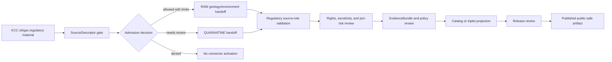

<!-- [KFM_META_BLOCK_V2]
doc_id: kfm://doc/connectors-kcc-oil-gas-reg-readme
title: connectors/kcc_oil_gas_reg/ — KCC Oil and Gas Regulatory Compatibility Connector Lane
type: readme
version: v0.1
status: draft
owners: OWNER_TBD — Connector steward · Kansas source steward · Geology steward · Environment steward · Infrastructure steward · Rights reviewer · Sensitivity reviewer · Validation steward · Docs steward
created: 2026-06-19
updated: 2026-06-19
policy_label: public-doctrine; compatibility-lane; noncanonical-path; regulatory-source; oil-gas; rights-gated; sensitivity-gated; no-publication
proposed_path: connectors/kcc_oil_gas_reg/README.md
truth_posture: CONFIRMED path exists / NONCANONICAL compatibility README / CANONICAL HOME CONFIRMED AS connectors/kansas/kcc-oil-gas-reg/ BY SOURCE PROFILE
related:
  - ../README.md
  - ../kansas/README.md
  - ../kansas/kcc-oil-gas-reg/README.md
  - ../../docs/sources/catalog/kansas/kcc-oil-gas-reg.md
  - ../../docs/sources/catalog/kansas/ksgs.md
  - ../../docs/sources/catalog/kansas/kdhe.md
  - ../../docs/domains/geology/README.md
  - ../../docs/domains/geology/SOURCES.md
  - ../../docs/domains/environment/README.md
  - ../../docs/domains/infrastructure/README.md
  - ../../docs/sources/SOURCE_DESCRIPTOR_STANDARD.md
  - ../../data/registry/sources/
  - ../../data/raw/geology/
  - ../../data/quarantine/geology/
  - ../../data/raw/environment/
  - ../../data/quarantine/environment/
  - ../../fixtures/
  - ../../schemas/contracts/v1/source/
  - ../../policy/sensitivity/
  - ../../policy/rights/
  - ../../release/
tags: [kfm, connectors, kcc, oil-gas, regulatory, kansas, geology, environment, infrastructure, compatibility, source-admission, raw, quarantine, governance]
notes:
  - "This README fills a previously blank top-level KCC oil/gas regulatory connector path."
  - "The KCC source profile explicitly says `connectors/kcc_oil_gas_reg/` is not a canonical connector family and that the adapter belongs under `connectors/kansas/kcc-oil-gas-reg/`."
  - "This top-level snake_case path is therefore a compatibility lane, not a new canonical authority root."
  - "KCC records are `regulatory` source material and must not be collapsed into KGS `authority` or `observed` geology/production truth."
  - "Rights, current endpoint/access method, cadence, filing-scope inventory, fixtures, tests, source activation, and release classes remain NEEDS VERIFICATION."
  - "Connector output may enter RAW or QUARANTINE handoff only; downstream validation, EvidenceBundle closure, rights/sensitivity review, catalog/triplet projection, release review, publication, correction, and rollback remain outside this folder."
[/KFM_META_BLOCK_V2] -->

<a id="top"></a>

# KCC Oil and Gas Regulatory Compatibility Connector Lane

> Compatibility README for the existing top-level `connectors/kcc_oil_gas_reg/` path. This path is **not** the canonical connector home; KCC oil-and-gas regulatory connector work belongs under `connectors/kansas/kcc-oil-gas-reg/` unless a later ADR or migration decision says otherwise.

<p>
  
  
  
  
  
</p>

> [!IMPORTANT]
> **Status:** compatibility / noncanonical-path README · **Owner:** `OWNER_TBD`  
> **Path:** `connectors/kcc_oil_gas_reg/README.md`  
> **Truth posture:** `CONFIRMED` file exists · `NONCANONICAL` compatibility path · `CONFIRMED` source profile points canonical work to `connectors/kansas/kcc-oil-gas-reg/`  
> **Boundary:** source-admission compatibility only; no operational decision support, no public safety advisory, no regulatory-to-geology truth collapse, no direct publication.

**Quick jumps:** [Scope](#scope) · [Repo fit](#repo-fit) · [Accepted inputs](#accepted-inputs) · [Exclusions](#exclusions) · [Evidence ledger](#evidence-ledger) · [Lifecycle diagram](#lifecycle-diagram) · [Admission posture](#admission-posture) · [Anti-collapse rules](#anti-collapse-rules) · [Validation](#validation) · [Rollback](#rollback) · [Verification backlog](#verification-backlog)

---

## Scope

`connectors/kcc_oil_gas_reg/` is retained here only as a compatibility lane because the path already exists.

The KCC source profile states that this top-level snake_case path is incorrect and that KCC oil-and-gas regulatory data belongs under the canonical Kansas connector family as `connectors/kansas/kcc-oil-gas-reg/`. This README exists to prevent drift, preserve migration intent, and keep source-admission boundaries explicit.

This path must not become the canonical KCC connector home unless an ADR or migration decision explicitly changes the source-profile placement.

[Back to top ↑](#top)

---

## Repo fit

| Surface | Role | Status |
|---|---|---:|
| `connectors/kcc_oil_gas_reg/` | Existing top-level compatibility path. | **CONFIRMED path / NONCANONICAL** |
| `connectors/kansas/kcc-oil-gas-reg/` | Canonical KCC adapter home named by source profile. | **CONFIRMED by source profile / NEEDS VERIFICATION implementation depth** |
| `connectors/kansas/` | Canonical Kansas connector-family lane. | **CONFIRMED** |
| `docs/sources/catalog/kansas/kcc-oil-gas-reg.md` | Human-facing KCC source product page. | **CONFIRMED** |
| `docs/sources/catalog/kansas/ksgs.md` | KGS peer source for geology/production truth. | **CONFIRMED** |
| `data/registry/sources/` | SourceDescriptor authority. | **Outside connector / NEEDS VERIFICATION for entries** |
| `data/raw/geology/`, `data/raw/environment/` | Candidate RAW handoff targets. | **PROPOSED / NEEDS VERIFICATION** |
| `data/quarantine/geology/`, `data/quarantine/environment/` | Candidate quarantine handoff targets. | **PROPOSED / NEEDS VERIFICATION** |
| `policy/rights/` and `policy/sensitivity/` | Rights and sensitivity authority. | **Outside connector** |
| `release/` | Release and publication controls. | **Out of scope for this compatibility lane** |

[Back to top ↑](#top)

---

## Accepted inputs

Accepted content for this noncanonical compatibility path:

- README-level migration and compatibility notes;
- links to the canonical `connectors/kansas/kcc-oil-gas-reg/` path;
- notes that prevent this top-level path from becoming a parallel authority;
- temporary fixture or test notes only if they are explicitly migration-bound;
- adapter notes for KCC permits, filings, plugging compliance, UIC permits, production reporting, or enforcement records only if retained here by ADR or migration note;
- quarantine criteria for unresolved rights, source role, filing identity, operator/lease joins, PLSS/geometry, cadence, endpoint/access method, or source-shape issues.

New implementation code should prefer `connectors/kansas/kcc-oil-gas-reg/` unless an ADR says otherwise.

---

## Exclusions

This folder must not contain or imply authority over:

- canonical connector-family status;
- operational decisions, life-safety advisories, or current hazard status;
- subsurface geology, hydrocarbon occurrence, reservoir content, or production-truth claims;
- direct writes to `PROCESSED`, `CATALOG`, `TRIPLET`, `PUBLISHED`, proof, receipt, or release stores;
- SourceDescriptor authority records;
- policy or schema authority;
- generated summaries presented as regulatory or geologic truth;
- source activation without SourceDescriptor, rights, sensitivity, source-role, filing identity, geometry, provenance, and review checks.

Redirect implementation and source-family authority to `connectors/kansas/kcc-oil-gas-reg/` once verified.

[Back to top ↑](#top)

---

## Evidence ledger

| Source | Status | Supports | Limits |
|---|---:|---|---|
| `connectors/kcc_oil_gas_reg/README.md` | **CONFIRMED** | Target file exists and was blank before this update. | Does not prove implementation files, tests, or CI. |
| `docs/sources/catalog/kansas/kcc-oil-gas-reg.md` | **CONFIRMED** | Source profile says `connectors/kcc_oil_gas_reg/` is incorrect, canonical home is `connectors/kansas/kcc-oil-gas-reg/`, and KCC is regulatory rather than geology/occurrence authority. | Does not prove endpoint availability, source activation, or connector implementation. |
| `connectors/kansas/README.md` | **CONFIRMED** | Kansas connector family is the canonical source-admission lane for Kansas source products. | Does not prove KCC child implementation depth. |
| `connectors/kansas/kcc-oil-gas-reg/` | **NEEDS VERIFICATION** | Named as canonical adapter home by source profile. | Actual files, code, fixtures, tests, and CI remain unverified here. |

---

## Lifecycle diagram



[Back to top ↑](#top)

---

## Admission posture

Expected behavior for KCC oil-and-gas regulatory source-admission work:

- no live source access unless explicitly enabled and reviewed;
- no source fetch without an accepted SourceDescriptor and activation decision;
- no implicit publication from retrieved source material;
- no use for operational decisions, public safety advisories, or current hazard status;
- no conversion of KCC permits, filings, compliance, or enforcement records into geologic occurrence or production truth;
- no collapse of KCC regulatory records into KGS authority/observed geology or production records;
- no loss of source ID, source URI, filing type, filing identity, operator/lease fields, well identifier, PLSS/geometry/uncertainty, date/vintage, license/rights, source role, review, or release-class metadata;
- unclear rights, source role, filing identity, operator/lease joins, geometry, access endpoint, cadence, freshness, or schema drift routes to quarantine or abstention.

---

## Anti-collapse rules

The KCC source profile identifies the controlling anti-collapse stack:

1. `connectors/kcc_oil_gas_reg/` is compatibility-only; canonical work belongs under `connectors/kansas/kcc-oil-gas-reg/`.
2. KCC records are `regulatory` source material.
3. KCC is not authority for subsurface geology, hydrocarbon occurrence, reservoir contents, or production truth.
4. KGS remains the peer authority/observed source family for wells, production, and subsurface geology.
5. KCC operator/lease records joined with private-land ownership, royalty-owner identity, or non-public business data cross the trust membrane and fail closed until reviewed.
6. Public release is a governed state transition, not a connector output.
7. Derived summaries, maps, tiles, joins, and AI explanations are downstream carriers, not sovereign truth.

---

## Validation

Compatibility-lane validation should check that:

- this path is not treated as canonical without ADR/migration evidence;
- source metadata is preserved;
- SourceDescriptor references are required for activation;
- KCC `regulatory` source role is explicit and not collapsed into KGS geology authority/observed records;
- rights and sensitivity states are explicit before promotion-track use;
- filing type, filing identity, operator/lease fields, well identifier, PLSS/geometry/uncertainty, source URI, date/vintage, access method, source role, review, and release-class fields are explicit where available;
- malformed or incomplete records fail closed;
- records with unclear rights, unresolved sensitivity, unresolved source role, unresolved filing identity, unresolved operator/lease join risk, or unresolved geometry route to quarantine;
- connector output is limited to RAW or QUARANTINE handoff;
- no connector run writes directly to processed, catalog, triplet, published, proof, receipt, or release stores.

Root-level validation, policy-as-code, EvidenceBundle closure, release review, public caveats, and rollback remain outside this compatibility lane.

[Back to top ↑](#top)

---

## Definition of done

This compatibility README is ready for first review when:

- [ ] KCC source profile is linked and current enough for review.
- [ ] A migration or ADR decision resolves whether to remove this top-level path, keep it as a redirect, or move implementation under `connectors/kansas/kcc-oil-gas-reg/`.
- [ ] Canonical KCC implementation home is verified.
- [ ] SourceDescriptor home and KCC source ID are verified.
- [ ] Rights terms, access endpoint, harvest cadence, filing-scope inventory, fixture strategy, and sensitivity checks are verified by source steward review.
- [ ] Live source access is disabled by default for connector code.
- [ ] Source-role, filing identity, regulatory/geology anti-collapse, geometry, rights, sensitivity, and trust-membrane join checks are represented in tests.
- [ ] Connector output is limited to RAW or QUARANTINE handoff.
- [ ] No public operational, safety, regulatory-status, or geology-production claims are created by connector code.

---

## Rollback

Rollback is required if this README is used to justify canonical-family status, direct publication, source activation, regulatory/geology source-role collapse, rights/sensitivity bypass, public operational or geology claims, or direct writes beyond RAW/QUARANTINE handoff.

Rollback target:

```text
commit prior to this update: SHA_TBD_AFTER_GIT_HISTORY_CHECK
```

Because the file was blank before this update, a safe rollback is to restore the blank placeholder or replace this document with a shorter redirect-only README until canonical placement is resolved.

---

## Verification backlog

| Item | Status | Needed evidence |
|---|---:|---|
| Confirm canonical `connectors/kansas/kcc-oil-gas-reg/` implementation files. | **NEEDS VERIFICATION** | Repo tree or mounted workspace. |
| Confirm whether this top-level path should remain. | **NEEDS VERIFICATION** | ADR or migration decision. |
| Confirm SourceDescriptor home and KCC source ID. | **NEEDS VERIFICATION** | Source registry entries and accepted schemas. |
| Confirm current endpoint/access method, cadence, filing scope, and terms. | **NEEDS VERIFICATION** | Source steward review and current source documentation. |
| Confirm rights and sensitivity handling. | **NEEDS VERIFICATION** | Rights review, sensitivity review, and policy references. |
| Confirm trust-membrane join handling for operator/lease/private-land/business data. | **NEEDS VERIFICATION** | Policy references, tests, and review notes. |
| Confirm fixture strategy and CI wiring. | **NEEDS VERIFICATION** | Fixture registry, workflow files, and test logs. |

---

## Maintainer note

Do not build new authority here. This existing top-level snake_case path should either stay a clear compatibility pointer or be removed after migration. Implementation should converge under `connectors/kansas/kcc-oil-gas-reg/` unless an ADR says otherwise.

[Back to top ↑](#top)
