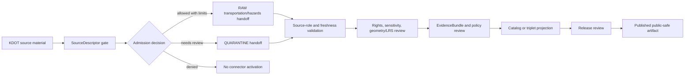

<!-- [KFM_META_BLOCK_V2]
doc_id: kfm://doc/connectors-kdot-readme
title: connectors/kdot/ — KDOT Compatibility Connector Lane
type: readme
version: v0.1
status: draft
owners: OWNER_TBD — Connector steward · Kansas source steward · Roads steward · Infrastructure steward · Hazards steward · Rights reviewer · Sensitivity reviewer · Validation steward · Docs steward
created: 2026-06-19
updated: 2026-06-19
policy_label: public-doctrine; compatibility-lane; noncanonical-path; transportation-source; mixed-source-role; no-life-safety; rights-gated; no-publication
proposed_path: connectors/kdot/README.md
truth_posture: CONFIRMED path exists / NONCANONICAL compatibility README / CANONICAL HOME CONFIRMED AS connectors/kansas/kdot/ BY SOURCE PROFILE
related:
  - ../README.md
  - ../kansas/README.md
  - ../kansas/kdot/README.md
  - ../../docs/sources/catalog/kansas/kdot.md
  - ../../docs/sources/catalog/usdot/wzdx.md
  - ../../docs/domains/roads-rail-trade-routes/README.md
  - ../../docs/domains/settlements-infrastructure/README.md
  - ../../docs/domains/hazards/README.md
  - ../../docs/standards/wzdx.md
  - ../../docs/sources/SOURCE_DESCRIPTOR_STANDARD.md
  - ../../data/registry/sources/
  - ../../data/raw/roads-rail-trade-routes/
  - ../../data/quarantine/roads-rail-trade-routes/
  - ../../data/raw/hazards/
  - ../../data/quarantine/hazards/
  - ../../fixtures/
  - ../../schemas/contracts/v1/source/
  - ../../policy/sensitivity/
  - ../../policy/rights/
  - ../../release/
tags: [kfm, connectors, kdot, kansas, transportation, roads, kandrive, kanplan, kansas-gis, wzdx, compatibility, mixed-source-role, source-admission, raw, quarantine, governance]
notes:
  - "This README fills a previously blank top-level KDOT connector path."
  - "The KDOT source profile explicitly says `connectors/kdot/` is not a canonical connector family and that the adapter belongs under `connectors/kansas/kdot/`."
  - "This top-level path is therefore a compatibility lane, not a new canonical authority root."
  - "KDOT surfaces carry mixed source roles: route designations and asset rosters as authority, KanDrive traveler information as observed, and work-zone permits/authorizations as regulatory."
  - "KanDrive-derived material is not for life-safety or emergency operational decisions and requires staleness/freshness gates before any governed public surface."
  - "Connector output may enter RAW or QUARANTINE handoff only; downstream validation, EvidenceBundle closure, rights/sensitivity review, catalog/triplet projection, release review, publication, correction, and rollback remain outside this folder."
[/KFM_META_BLOCK_V2] -->

<a id="top"></a>

# KDOT Compatibility Connector Lane

> Compatibility README for the existing top-level `connectors/kdot/` path. This path is **not** the canonical connector home; KDOT connector work belongs under `connectors/kansas/kdot/` unless a later ADR or migration decision says otherwise.

<p>
  
  
  
  
  
</p>

> [!IMPORTANT]
> **Status:** compatibility / noncanonical-path README · **Owner:** `OWNER_TBD`  
> **Path:** `connectors/kdot/README.md`  
> **Truth posture:** `CONFIRMED` file exists · `NONCANONICAL` compatibility path · `CONFIRMED` source profile points canonical work to `connectors/kansas/kdot/`  
> **Boundary:** source-admission compatibility only; no life-safety or emergency operational use, no source-role collapse, no direct publication.

**Quick jumps:** [Scope](#scope) · [Repo fit](#repo-fit) · [Accepted inputs](#accepted-inputs) · [Exclusions](#exclusions) · [Evidence ledger](#evidence-ledger) · [Lifecycle diagram](#lifecycle-diagram) · [Admission posture](#admission-posture) · [Anti-collapse rules](#anti-collapse-rules) · [Validation](#validation) · [Rollback](#rollback) · [Verification backlog](#verification-backlog)

---

## Scope

`connectors/kdot/` is retained here only as a compatibility lane because the path already exists.

The KDOT source profile states that this top-level path is incorrect and that KDOT belongs under the canonical Kansas connector family as `connectors/kansas/kdot/`. This README exists to prevent drift, preserve migration intent, and keep source-admission boundaries explicit.

This path must not become the canonical KDOT connector home unless an ADR or migration decision explicitly changes the source-profile placement.

[Back to top ↑](#top)

---

## Repo fit

| Surface | Role | Status |
|---|---|---:|
| `connectors/kdot/` | Existing top-level compatibility path. | **CONFIRMED path / NONCANONICAL** |
| `connectors/kansas/kdot/` | Canonical KDOT adapter home named by source profile. | **CONFIRMED by source profile / NEEDS VERIFICATION implementation depth** |
| `connectors/kansas/` | Canonical Kansas connector-family lane. | **CONFIRMED** |
| `docs/sources/catalog/kansas/kdot.md` | Human-facing KDOT source product page. | **CONFIRMED** |
| `docs/sources/catalog/usdot/wzdx.md` | WZDx standard/source companion for work-zone normalization. | **CONFIRMED search result / NEEDS VERIFICATION content** |
| `data/registry/sources/` | SourceDescriptor authority. | **Outside connector / NEEDS VERIFICATION for entries** |
| `data/raw/roads-rail-trade-routes/`, `data/raw/hazards/` | Candidate RAW handoff targets. | **PROPOSED / NEEDS VERIFICATION** |
| `data/quarantine/roads-rail-trade-routes/`, `data/quarantine/hazards/` | Candidate quarantine handoff targets. | **PROPOSED / NEEDS VERIFICATION** |
| `policy/rights/` and `policy/sensitivity/` | Rights and sensitivity authority. | **Outside connector** |
| `release/` | Release and publication controls. | **Out of scope for this compatibility lane** |

[Back to top ↑](#top)

---

## Accepted inputs

Accepted content for this noncanonical compatibility path:

- README-level migration and compatibility notes;
- links to the canonical `connectors/kansas/kdot/` path;
- notes that prevent this top-level path from becoming a parallel authority;
- temporary fixture or test notes only if they are explicitly migration-bound;
- adapter notes for KanPlan, KanDrive, KDOT GIS, or WZDx-aligned work-zone normalization only if retained here by ADR or migration note;
- quarantine criteria for unresolved rights, source role, route/event identity, asset identity, freshness/staleness, LRS/geometry, license, endpoint/access method, or source-shape issues.

New implementation code should prefer `connectors/kansas/kdot/` unless an ADR says otherwise.

---

## Exclusions

This folder must not contain or imply authority over:

- canonical connector-family status;
- life-safety, emergency response, live traffic control, or operational routing decisions;
- direct writes to `PROCESSED`, `CATALOG`, `TRIPLET`, `PUBLISHED`, proof, receipt, or release stores;
- SourceDescriptor authority records;
- policy or schema authority;
- generated summaries presented as current road truth;
- source activation without SourceDescriptor, rights, sensitivity, source-role, freshness/staleness, geometry/LRS, provenance, and review checks.

Redirect implementation and source-family authority to `connectors/kansas/kdot/` once verified.

[Back to top ↑](#top)

---

## Evidence ledger

| Source | Status | Supports | Limits |
|---|---:|---|---|
| `connectors/kdot/README.md` | **CONFIRMED** | Target file exists and was blank before this update. | Does not prove implementation files, tests, or CI. |
| `docs/sources/catalog/kansas/kdot.md` | **CONFIRMED** | KDOT source profile says `connectors/kdot/` is incorrect, canonical home is `connectors/kansas/kdot/`, KDOT surfaces have mixed source roles, and KanDrive is not for life-safety use. | Does not prove endpoint availability, source activation, or connector implementation. |
| `connectors/kansas/README.md` | **CONFIRMED** | Kansas connector family is the canonical source-admission lane for Kansas source products. | Does not prove KDOT child implementation depth. |
| `connectors/kansas/kdot/` | **NEEDS VERIFICATION** | Named as canonical adapter home by source profile. | Actual files, code, fixtures, tests, and CI remain unverified here. |

---

## Lifecycle diagram



[Back to top ↑](#top)

---

## Admission posture

Expected behavior for KDOT source-admission work:

- no live source access unless explicitly enabled and reviewed;
- no source fetch without an accepted SourceDescriptor and activation decision;
- no implicit publication from retrieved source material;
- no life-safety, emergency response, live traffic control, or operational routing use;
- no collapse of route/asset authority, KanDrive observed traveler information, and work-zone regulatory material into one untyped feed;
- no loss of source ID, source URI, surface ID, source role, route/event/asset identity, external IDs, geometry/LRS, timestamp/vintage, freshness/staleness metadata, license/rights, review, or release-class metadata;
- unclear rights, source role, route/event identity, asset identity, geometry/LRS, freshness/staleness, endpoint, license, or schema drift routes to quarantine or abstention.

---

## Anti-collapse rules

The KDOT source profile identifies the controlling anti-collapse stack:

1. `connectors/kdot/` is compatibility-only; canonical work belongs under `connectors/kansas/kdot/`.
2. Route designations and asset rosters may be `authority` source material.
3. KanDrive traveler-information data is `observed` source material and not for life-safety or emergency operational decisions.
4. Work-zone permits/authorizations are `regulatory` source material.
5. KDOT-to-WZDx normalization is a governed derivative lane, not proof that KDOT direct surfaces and WZDx artifacts are the same thing.
6. Public release is a governed state transition, not a connector output.
7. Derived summaries, maps, tiles, road-event artifacts, joins, and AI explanations are downstream carriers, not sovereign truth.

---

## Validation

Compatibility-lane validation should check that:

- this path is not treated as canonical without ADR/migration evidence;
- source metadata is preserved;
- SourceDescriptor references are required for activation;
- KDOT surface IDs and source roles are explicit and not collapsed;
- KanDrive-derived material carries freshness/staleness metadata and not-for-life-safety posture before any release review;
- route/event/asset identity, external IDs, geometry/LRS, timestamp/vintage, source URI, rights, surface role, review, and release-class fields are explicit where available;
- malformed or incomplete records fail closed;
- records with unclear rights, unresolved sensitivity, unresolved source role, unresolved route/event identity, unresolved geometry/LRS, or unresolved freshness state route to quarantine;
- connector output is limited to RAW or QUARANTINE handoff;
- no connector run writes directly to processed, catalog, triplet, published, proof, receipt, or release stores.

Root-level validation, policy-as-code, EvidenceBundle closure, release review, public caveats, and rollback remain outside this compatibility lane.

[Back to top ↑](#top)

---

## Definition of done

This compatibility README is ready for first review when:

- [ ] KDOT source profile is linked and current enough for review.
- [ ] A migration or ADR decision resolves whether to remove this top-level path, keep it as a redirect, or move implementation under `connectors/kansas/kdot/`.
- [ ] Canonical KDOT implementation home is verified.
- [ ] SourceDescriptor homes and KDOT surface source IDs are verified.
- [ ] Rights terms, endpoint/access methods, cadence, fixture strategy, source-role strategy, and sensitivity checks are verified by source steward review.
- [ ] Live source access is disabled by default for connector code.
- [ ] Source-role, route/event/asset identity, WZDx normalization, freshness/staleness, rights, sensitivity, geometry/LRS, and anti-collapse checks are represented in tests.
- [ ] Connector output is limited to RAW or QUARANTINE handoff.
- [ ] No public life-safety, emergency, routing, or operational claims are created by connector code.

---

## Rollback

Rollback is required if this README is used to justify canonical-family status, direct publication, source activation, source-role collapse, bypass of freshness/staleness gates, life-safety or emergency use, rights/sensitivity bypass, or direct writes beyond RAW/QUARANTINE handoff.

Rollback target:

```text
commit prior to this update: SHA_TBD_AFTER_GIT_HISTORY_CHECK
```

Because the file was blank before this update, a safe rollback is to restore the blank placeholder or replace this document with a shorter redirect-only README until canonical placement is resolved.

---

## Verification backlog

| Item | Status | Needed evidence |
|---|---:|---|
| Confirm canonical `connectors/kansas/kdot/` implementation files. | **NEEDS VERIFICATION** | Repo tree or mounted workspace. |
| Confirm whether this top-level path should remain. | **NEEDS VERIFICATION** | ADR or migration decision. |
| Confirm SourceDescriptor homes and KDOT surface IDs. | **NEEDS VERIFICATION** | Source registry entries and accepted schemas. |
| Confirm current endpoints, cadence, license terms, and surface scope. | **NEEDS VERIFICATION** | Source steward review and current source documentation. |
| Confirm WZDx normalization boundary. | **NEEDS VERIFICATION** | WZDx source doc, schemas, code, and tests. |
| Confirm rights and sensitivity handling. | **NEEDS VERIFICATION** | Rights review, sensitivity review, and policy references. |
| Confirm fixture strategy and CI wiring. | **NEEDS VERIFICATION** | Fixture registry, workflow files, and test logs. |

---

## Maintainer note

Do not build new authority here. This existing top-level path should either stay a clear compatibility pointer or be removed after migration. Implementation should converge under `connectors/kansas/kdot/` unless an ADR says otherwise.

[Back to top ↑](#top)
