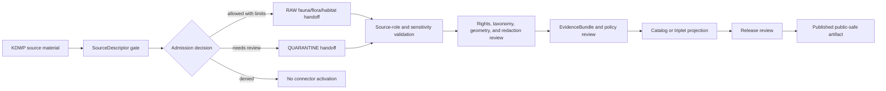

<!-- [KFM_META_BLOCK_V2]
doc_id: kfm://doc/connectors-kdwp-readme
title: connectors/kdwp/ — KDWP Compatibility Connector Lane
type: readme
version: v0.1
status: draft
owners: OWNER_TBD — Connector steward · Kansas source steward · Fauna steward · Flora steward · Habitat steward · Rights reviewer · Sensitivity reviewer · Validation steward · Docs steward
created: 2026-06-19
updated: 2026-06-19
policy_label: public-doctrine; compatibility-lane; noncanonical-path; biodiversity-source; regulatory-source; sensitivity-gated; rights-gated; no-publication
proposed_path: connectors/kdwp/README.md
truth_posture: CONFIRMED path exists / NONCANONICAL compatibility README / CANONICAL HOME CONFIRMED AS connectors/kansas/kdwp/ BY SOURCE PROFILE
related:
  - ../README.md
  - ../kansas/README.md
  - ../kansas/kdwp/README.md
  - ../kansas/kdwp_flora/README.md
  - ../kansas/kdwp_ert/README.md
  - ../../docs/sources/catalog/kansas/kdwp.md
  - ../../docs/sources/catalog/kansas/kbs.md
  - ../../docs/sources/catalog/kansas/ku-nhm.md
  - ../../docs/domains/fauna/README.md
  - ../../docs/domains/flora/README.md
  - ../../docs/domains/habitat/README.md
  - ../../docs/sources/SOURCE_DESCRIPTOR_STANDARD.md
  - ../../data/registry/sources/
  - ../../data/raw/fauna/
  - ../../data/quarantine/fauna/
  - ../../data/raw/flora/
  - ../../data/quarantine/flora/
  - ../../data/raw/habitat/
  - ../../data/quarantine/habitat/
  - ../../fixtures/
  - ../../schemas/contracts/v1/source/
  - ../../schemas/contracts/v1/biodiversity/
  - ../../policy/sensitivity/
  - ../../policy/rights/
  - ../../release/
tags: [kfm, connectors, kdwp, kansas, wildlife, parks, sinc, fauna, flora, habitat, compatibility, authority-source, regulatory-source, observed-source, source-admission, raw, quarantine, governance]
notes:
  - "This README replaces a thin greenfield stub at a top-level KDWP connector path."
  - "The KDWP source profile says the correct connector path was already `connectors/kansas/kdwp/` under the canonical `connectors/kansas/` family."
  - "This top-level `connectors/kdwp/` path is therefore a compatibility lane, not a new canonical authority root."
  - "KDWP-as-authority and KDWP-as-observation must remain separate source-role surfaces."
  - "KDWP listing/SINC/range context drives sensitivity and public-safe redaction gates; rights/current terms remain NEEDS VERIFICATION."
  - "Connector output may enter RAW or QUARANTINE handoff only; downstream validation, EvidenceBundle closure, rights/sensitivity review, catalog/triplet projection, release review, publication, correction, and rollback remain outside this folder."
[/KFM_META_BLOCK_V2] -->

<a id="top"></a>

# KDWP Compatibility Connector Lane

> Compatibility README for the existing top-level `connectors/kdwp/` path. This path is **not** the canonical connector home; KDWP connector work belongs under `connectors/kansas/kdwp/` unless a later ADR or migration decision says otherwise.

<p>
  
  
  
  
  
</p>

> [!IMPORTANT]
> **Status:** compatibility / noncanonical-path README · **Owner:** `OWNER_TBD`  
> **Path:** `connectors/kdwp/README.md`  
> **Truth posture:** `CONFIRMED` file exists · `NONCANONICAL` compatibility path · `CONFIRMED` source profile points canonical work to `connectors/kansas/kdwp/`  
> **Boundary:** source-admission compatibility only; no public sensitive-species release, no source-role collapse, no direct publication, no rights/sensitivity bypass.

**Quick jumps:** [Scope](#scope) · [Repo fit](#repo-fit) · [Accepted inputs](#accepted-inputs) · [Exclusions](#exclusions) · [Evidence ledger](#evidence-ledger) · [Lifecycle diagram](#lifecycle-diagram) · [Admission posture](#admission-posture) · [Anti-collapse rules](#anti-collapse-rules) · [Validation](#validation) · [Rollback](#rollback) · [Verification backlog](#verification-backlog)

---

## Scope

`connectors/kdwp/` is retained here only as a compatibility lane because the path already exists.

The KDWP source profile says KDWP already had the correct canonical connector home in v1: `connectors/kansas/kdwp/`, under the canonical `connectors/kansas/` family. This README exists to prevent drift, preserve migration intent, and keep source-admission boundaries explicit.

This path must not become the canonical KDWP connector home unless an ADR or migration decision explicitly changes the source-profile placement.

[Back to top ↑](#top)

---

## Repo fit

| Surface | Role | Status |
|---|---|---:|
| `connectors/kdwp/` | Existing top-level compatibility path. | **CONFIRMED path / NONCANONICAL** |
| `connectors/kansas/kdwp/` | Canonical KDWP adapter home named by source profile. | **CONFIRMED by source profile / CONFIRMED README path** |
| `connectors/kansas/kdwp_flora/` | KDWP flora/listed-species compatibility or sublane. | **CONFIRMED README path / PLACEMENT NEEDS VERIFICATION** |
| `connectors/kansas/kdwp_ert/` | KDWP Ecological Review Tool compatibility or sublane. | **CONFIRMED README path / PLACEMENT NEEDS VERIFICATION** |
| `connectors/kansas/` | Canonical Kansas connector-family lane. | **CONFIRMED** |
| `docs/sources/catalog/kansas/kdwp.md` | Human-facing KDWP source catalog entry. | **CONFIRMED** |
| `data/registry/sources/` | SourceDescriptor authority. | **Outside connector / NEEDS VERIFICATION for entries** |
| `data/raw/fauna/`, `data/raw/flora/`, `data/raw/habitat/` | Candidate RAW handoff targets. | **PROPOSED / NEEDS VERIFICATION** |
| `data/quarantine/fauna/`, `data/quarantine/flora/`, `data/quarantine/habitat/` | Candidate quarantine handoff targets. | **PROPOSED / NEEDS VERIFICATION** |
| `policy/rights/` and `policy/sensitivity/` | Rights and sensitivity authority. | **Outside connector** |
| `release/` | Release and publication controls. | **Out of scope for this compatibility lane** |

[Back to top ↑](#top)

---

## Accepted inputs

Accepted content for this noncanonical compatibility path:

- README-level migration and compatibility notes;
- links to the canonical `connectors/kansas/kdwp/` path;
- notes that prevent this top-level path from becoming a parallel authority;
- temporary fixture or test notes only if they are explicitly migration-bound;
- adapter notes for KDWP authority/regulatory/observation material only if retained here by ADR or migration note;
- quarantine criteria for unresolved rights, source role, listed-status context, SINC/sensitivity status, observation identity, geometry, access method, or source-shape issues.

New implementation code should prefer `connectors/kansas/kdwp/` unless an ADR says otherwise.

---

## Exclusions

This folder must not contain or imply authority over:

- canonical connector-family status;
- public sensitive-species locations or public listed-species release decisions;
- direct writes to `PROCESSED`, `CATALOG`, `TRIPLET`, `PUBLISHED`, proof, receipt, or release stores;
- SourceDescriptor authority records;
- policy or schema authority;
- generated summaries presented as authoritative legal status, occurrence, range, habitat, or sensitivity truth;
- source activation without SourceDescriptor, rights, sensitivity, source-role, taxonomy, geometry, provenance, and review checks.

Redirect implementation and source-family authority to `connectors/kansas/kdwp/` once verified.

[Back to top ↑](#top)

---

## Evidence ledger

| Source | Status | Supports | Limits |
|---|---:|---|---|
| `connectors/kdwp/README.md` | **CONFIRMED** | Target file exists and previously contained only a greenfield stub. | Does not prove implementation files, tests, or CI. |
| `docs/sources/catalog/kansas/kdwp.md` | **CONFIRMED** | KDWP source profile says canonical connector path is `connectors/kansas/kdwp/`, KDWP is a Kansas-first authority, and KDWP-as-authority and KDWP-as-observation must remain separate. | Does not prove current source terms, endpoint stability, activation, or implementation. |
| `connectors/kansas/kdwp/README.md` | **CONFIRMED** | Canonical KDWP adapter README exists in the Kansas connector family. | Does not prove tests or live source activation. |
| `connectors/kansas/README.md` | **CONFIRMED** | Kansas connector family is the canonical source-admission lane for Kansas source products. | Does not prove every KDWP sublane is final. |

---

## Lifecycle diagram



[Back to top ↑](#top)

---

## Admission posture

Expected behavior for KDWP source-admission work:

- no live source access unless explicitly enabled and reviewed;
- no source fetch without an accepted SourceDescriptor and activation decision;
- no implicit publication from retrieved source material;
- no collapse of KDWP-as-authority, KDWP-as-regulatory/listed-status context, and KDWP-as-observation material;
- no conversion of KDWP-derived records into public occurrence, range, habitat, legal-status, or sensitivity truth without downstream review;
- no loss of source ID, source URI, program/surface, source role, taxon identity, listing/status context, sensitivity/rank context, observation identity, geometry/uncertainty, date/vintage, license/rights, review, or release-class metadata;
- unclear rights, source role, taxon identity, listing context, sensitivity status, observation identity, geometry, access endpoint, freshness, or schema drift routes to quarantine or abstention.

---

## Anti-collapse rules

The KDWP source profile identifies the controlling anti-collapse stack:

1. `connectors/kdwp/` is compatibility-only; canonical work belongs under `connectors/kansas/kdwp/`.
2. KDWP-as-authority covers legal status, sensitivity ranking, and stewardship determinations.
3. KDWP-as-observation covers monitoring, survey, mortality, disease, or other agency observation material.
4. Mixed files must be split or admitted by role; convenience does not determine source role.
5. Sensitive taxa and sensitive ecological information fail closed into quarantine, redaction, generalization, or reviewed release workflows.
6. Public release is a governed state transition, not a connector output.
7. Derived summaries, maps, tiles, joins, and AI explanations are downstream carriers, not sovereign truth.

---

## Validation

Compatibility-lane validation should check that:

- this path is not treated as canonical without ADR/migration evidence;
- source metadata is preserved;
- SourceDescriptor references are required for activation;
- KDWP authority/regulatory/observation roles are explicit and not collapsed;
- rights and sensitivity states are explicit before promotion-track use;
- taxon identity, listing/status context, sensitivity/rank context, observation identity, source URI, geometry/uncertainty, date/vintage, access method, source role, review, and release-class fields are explicit where available;
- malformed or incomplete records fail closed;
- records with unclear rights, unresolved sensitivity, unresolved taxon identity, unresolved source role, unresolved listing context, unresolved observation identity, or unresolved geometry route to quarantine;
- connector output is limited to RAW or QUARANTINE handoff;
- no connector run writes directly to processed, catalog, triplet, published, proof, receipt, or release stores.

Root-level validation, policy-as-code, EvidenceBundle closure, release review, public caveats, and rollback remain outside this compatibility lane.

[Back to top ↑](#top)

---

## Definition of done

This compatibility README is ready for first review when:

- [ ] KDWP source profile is linked and current enough for review.
- [ ] A migration or ADR decision resolves whether to remove this top-level path, keep it as a redirect, or leave it as a compatibility note.
- [ ] Canonical KDWP implementation home is verified as `connectors/kansas/kdwp/`.
- [ ] SourceDescriptor homes and KDWP surface/source IDs are verified.
- [ ] Rights terms, access methods, cadence, fixture strategy, source-role strategy, and sensitivity checks are verified by source steward review.
- [ ] Live source access is disabled by default for connector code.
- [ ] Source-role, taxonomy, legal-status/listing context, sensitivity/rank context, observation identity, rights, geometry, and anti-collapse checks are represented in tests.
- [ ] Connector output is limited to RAW or QUARANTINE handoff.
- [ ] No public sensitive-species, listed-status, range, habitat, or occurrence claims are created by connector code.

---

## Rollback

Rollback is required if this README is used to justify canonical-family status, direct publication, source activation, source-role collapse, rights/sensitivity bypass, public sensitive-species or legal-status claims, or direct writes beyond RAW/QUARANTINE handoff.

Rollback target:

```text
commit prior to this update: SHA_TBD_AFTER_GIT_HISTORY_CHECK
```

Because the previous file was only a greenfield stub, a safe rollback is to restore that stub or replace this document with a shorter redirect-only README until canonical placement is resolved.

---

## Verification backlog

| Item | Status | Needed evidence |
|---|---:|---|
| Confirm whether this top-level path should remain. | **NEEDS VERIFICATION** | ADR or migration decision. |
| Confirm SourceDescriptor homes and KDWP surface/source IDs. | **NEEDS VERIFICATION** | Source registry entries and accepted schemas. |
| Confirm current access methods, cadence, and terms. | **NEEDS VERIFICATION** | Source steward review and current source documentation. |
| Confirm rights and sensitivity handling. | **NEEDS VERIFICATION** | Rights review, sensitivity review, and policy references. |
| Confirm fixture strategy and CI wiring. | **NEEDS VERIFICATION** | Fixture registry, workflow files, and test logs. |

---

## Maintainer note

Do not build new authority here. This existing top-level path should either stay a clear compatibility pointer or be removed after migration. Implementation should converge under `connectors/kansas/kdwp/` unless an ADR says otherwise.

[Back to top ↑](#top)
