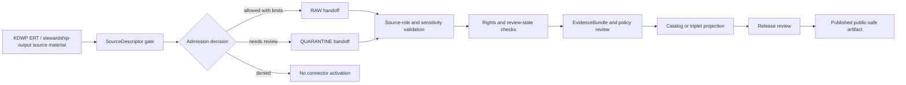

<!-- [KFM_META_BLOCK_V2]
doc_id: kfm://doc/connectors-kdwp-ert-readme
title: connectors/kdwp_ert/ — KDWP Ecological Review Tool Compatibility Connector Lane
type: readme
version: v0.1
status: draft
owners: OWNER_TBD — Connector steward · Kansas source steward · Flora steward · Fauna steward · Habitat steward · Rights reviewer · Sensitivity reviewer · Validation steward · Docs steward
created: 2026-06-19
updated: 2026-06-19
policy_label: public-doctrine; compatibility-lane; noncanonical-path; administrative-source; regulatory-source; rights-gated; sensitivity-gated; no-publication
proposed_path: connectors/kdwp_ert/README.md
truth_posture: CONFIRMED path exists / NONCANONICAL compatibility README / CANONICAL HOME NEEDS VERIFICATION UNDER connectors/kansas/kdwp/
related:
  - ../README.md
  - ../kdwp/README.md
  - ../kansas/README.md
  - ../kansas/kdwp/README.md
  - ../kansas/kdwp_ert/README.md
  - ../../docs/sources/catalog/kansas/kdwp.md
  - ../../docs/domains/flora/SOURCES.md
  - ../../docs/domains/flora/README.md
  - ../../docs/domains/fauna/README.md
  - ../../docs/domains/habitat/README.md
  - ../../docs/sources/SOURCE_DESCRIPTOR_STANDARD.md
  - ../../data/registry/sources/
  - ../../data/raw/flora/
  - ../../data/quarantine/flora/
  - ../../data/raw/fauna/
  - ../../data/quarantine/fauna/
  - ../../data/raw/habitat/
  - ../../data/quarantine/habitat/
  - ../../fixtures/
  - ../../schemas/contracts/v1/source/
  - ../../schemas/contracts/v1/biodiversity/
  - ../../policy/sensitivity/
  - ../../policy/rights/
  - ../../release/
tags: [kfm, connectors, kdwp, kdwp-ert, ecological-review-tool, kansas, flora, fauna, habitat, compatibility, administrative-source, regulatory-source, source-admission, raw, quarantine, governance]
notes:
  - "This README fills a blank top-level KDWP ERT connector path."
  - "The KDWP source profile confirms canonical KDWP work belongs under `connectors/kansas/kdwp/`; this top-level snake_case path is a compatibility lane unless an ADR says otherwise."
  - "The flora source registry names KDWP Ecological Review Tool / stewardship outputs as administrative and regulatory source material with rights and sensitivity gates."
  - "This path must not become a public review service, policy authority, release surface, or direct publication path."
  - "Connector output may enter RAW or QUARANTINE handoff only; downstream validation, EvidenceBundle closure, rights/sensitivity review, catalog/triplet projection, release review, publication, correction, and rollback remain outside this folder."
[/KFM_META_BLOCK_V2] -->

<a id="top"></a>

# KDWP Ecological Review Tool Compatibility Connector Lane

> Compatibility README for the existing top-level `connectors/kdwp_ert/` path. This path is **not** a canonical connector home; KDWP Ecological Review Tool / stewardship-output work should converge under the canonical Kansas/KDWP connector lane unless a later ADR or migration decision says otherwise.

<p>
  
  
  
  
  
</p>

> [!IMPORTANT]
> **Status:** compatibility / noncanonical-path README · **Owner:** `OWNER_TBD`  
> **Path:** `connectors/kdwp_ert/README.md`  
> **Truth posture:** `CONFIRMED` file exists · `NONCANONICAL` compatibility path · `NEEDS VERIFICATION` exact canonical ERT subpath  
> **Boundary:** source-admission compatibility only; no public review service, no policy decision authority, no direct publication, no rights/sensitivity bypass.

**Quick jumps:** [Scope](#scope) · [Repo fit](#repo-fit) · [Accepted inputs](#accepted-inputs) · [Exclusions](#exclusions) · [Evidence ledger](#evidence-ledger) · [Lifecycle diagram](#lifecycle-diagram) · [Admission posture](#admission-posture) · [Anti-collapse rules](#anti-collapse-rules) · [Validation](#validation) · [Rollback](#rollback) · [Verification backlog](#verification-backlog)

---

## Scope

`connectors/kdwp_ert/` is retained here only as a compatibility lane because the path already exists.

KDWP’s canonical connector family is under `connectors/kansas/kdwp/`. The exact canonical home for Ecological Review Tool or stewardship-output implementation remains **NEEDS VERIFICATION**: it may remain as a KDWP sublane, a documented compatibility path, or a migrated child path under `connectors/kansas/kdwp/` depending on ADR and repo convention.

This path must not become a public ecological review product, policy authority, source registry, release surface, or canonical connector root without governance evidence.

[Back to top ↑](#top)

---

## Repo fit

| Surface | Role | Status |
|---|---|---:|
| `connectors/kdwp_ert/` | Existing top-level compatibility path. | **CONFIRMED path / NONCANONICAL** |
| `connectors/kansas/kdwp/` | Canonical KDWP connector lane. | **CONFIRMED README path** |
| `connectors/kansas/kdwp_ert/` | Existing Kansas-lane ERT compatibility or sublane. | **CONFIRMED README path / PLACEMENT NEEDS VERIFICATION** |
| `connectors/kdwp/` | Top-level KDWP compatibility path. | **CONFIRMED README path / NONCANONICAL** |
| `docs/sources/catalog/kansas/kdwp.md` | Human-facing KDWP source catalog entry. | **CONFIRMED** |
| `docs/domains/flora/SOURCES.md` | Flora source registry naming KDWP ERT / stewardship outputs. | **CONFIRMED** |
| `data/registry/sources/` | SourceDescriptor authority. | **Outside connector / NEEDS VERIFICATION for entries** |
| `data/raw/flora/`, `data/raw/fauna/`, `data/raw/habitat/` | Candidate RAW handoff targets. | **PROPOSED / NEEDS VERIFICATION** |
| `data/quarantine/flora/`, `data/quarantine/fauna/`, `data/quarantine/habitat/` | Candidate quarantine handoff targets. | **PROPOSED / NEEDS VERIFICATION** |
| `release/` | Release and publication controls. | **Out of scope for this compatibility lane** |

[Back to top ↑](#top)

---

## Accepted inputs

Accepted content for this noncanonical compatibility path:

- README-level migration and compatibility notes;
- links to the canonical KDWP connector lane;
- notes that prevent this path from becoming a parallel authority;
- temporary fixture or test notes only if explicitly migration-bound;
- adapter notes for KDWP ERT or stewardship-output metadata only if retained here by ADR or migration note;
- quarantine criteria for unresolved rights, source role, review status, taxon identity, geometry, sensitivity status, access method, or source-shape issues.

New implementation code should prefer the canonical Kansas/KDWP lane once exact placement is verified.

---

## Exclusions

This folder must not contain or imply authority over:

- canonical connector-family status;
- public ecological review decisions;
- public release decisions;
- direct writes to `PROCESSED`, `CATALOG`, `TRIPLET`, `PUBLISHED`, proof, receipt, or release stores;
- SourceDescriptor authority records;
- policy or schema authority;
- generated summaries presented as regulatory, ecological, occurrence, habitat, or review truth;
- source activation without SourceDescriptor, rights, sensitivity, source-role, taxonomy, geometry, provenance, and review checks.

Redirect implementation and source-family authority to the canonical KDWP connector lane once verified.

[Back to top ↑](#top)

---

## Evidence ledger

| Source | Status | Supports | Limits |
|---|---:|---|---|
| `connectors/kdwp_ert/README.md` | **CONFIRMED** | Target file exists and was blank before this update. | Does not prove implementation files, tests, or CI. |
| `docs/sources/catalog/kansas/kdwp.md` | **CONFIRMED** | KDWP source profile identifies the canonical KDWP connector path under `connectors/kansas/kdwp/` and requires KDWP source-role separation. | Does not prove exact ERT subpath or implementation. |
| `docs/domains/flora/SOURCES.md` | **CONFIRMED** | Flora registry names KDWP ERT / stewardship outputs as administrative and regulatory source material with rights and sensitivity gates. | Does not prove endpoint availability, fixture safety, or implementation. |
| `connectors/kansas/kdwp_ert/README.md` | **CONFIRMED** | Kansas-lane ERT README exists. | Placement and final migration status remain NEEDS VERIFICATION. |

---

## Lifecycle diagram



[Back to top ↑](#top)

---

## Admission posture

Expected behavior for KDWP ERT / stewardship-output source-admission work:

- no live source access unless explicitly enabled and reviewed;
- no source fetch without an accepted SourceDescriptor and activation decision;
- no implicit publication from retrieved source material;
- no conversion of review output into public occurrence, range, habitat, regulatory, or review truth without downstream review;
- no collapse of ERT/stewardship outputs into generic KDWP observation data;
- no loss of source ID, source URI, surface identity, source role, review status, taxon context, geometry/uncertainty, date/vintage, license/rights, sensitivity state, review, or release-class metadata;
- unclear rights, source role, review status, taxon context, geometry, sensitivity state, access endpoint, freshness, or schema drift routes to quarantine or abstention.

---

## Anti-collapse rules

The ERT source lane must preserve the following controls:

1. `connectors/kdwp_ert/` is compatibility-only unless an ADR says otherwise.
2. Canonical KDWP work belongs under the Kansas connector family.
3. ERT/stewardship outputs are administrative/regulatory source material, not automatically observed occurrence truth.
4. Review outputs are source evidence, not public release approval.
5. Public release is a governed state transition, not a connector output.
6. Derived summaries, maps, tiles, joins, and AI explanations are downstream carriers, not sovereign truth.

---

## Validation

Compatibility-lane validation should check that:

- this path is not treated as canonical without ADR/migration evidence;
- source metadata is preserved;
- SourceDescriptor references are required for activation;
- source role is explicit and not collapsed;
- rights and sensitivity states are explicit before promotion-track use;
- surface identity, review status, taxon context, source URI, geometry/uncertainty, date/vintage, access method, review, and release-class fields are explicit where available;
- malformed or incomplete records fail closed;
- records with unresolved rights, sensitivity state, source role, review status, taxon context, geometry, or access method route to quarantine;
- connector output is limited to RAW or QUARANTINE handoff;
- no connector run writes directly to processed, catalog, triplet, published, proof, receipt, or release stores.

Root-level validation, policy-as-code, EvidenceBundle closure, release review, public caveats, and rollback remain outside this compatibility lane.

[Back to top ↑](#top)

---

## Definition of done

This compatibility README is ready for first review when:

- [ ] KDWP source profile and Flora source registry are linked and current enough for review.
- [ ] A migration or ADR decision resolves whether to remove this top-level path, keep it as a redirect, or migrate implementation under the canonical KDWP lane.
- [ ] Canonical ERT implementation home is verified.
- [ ] SourceDescriptor homes and ERT source IDs are verified.
- [ ] Rights terms, access methods, cadence, fixture strategy, source-role strategy, and sensitivity checks are verified by source steward review.
- [ ] Live source access is disabled by default for connector code.
- [ ] Source-role, review-state, taxonomy, rights, sensitivity, geometry, and anti-collapse checks are represented in tests.
- [ ] Connector output is limited to RAW or QUARANTINE handoff.
- [ ] No public ecological review, occurrence, range, habitat, or regulatory claims are created by connector code.

---

## Rollback

Rollback is required if this README is used to justify canonical-family status, direct publication, source activation, source-role collapse, rights/sensitivity bypass, public review claims, or direct writes beyond RAW/QUARANTINE handoff.

Rollback target:

```text
commit prior to this update: SHA_TBD_AFTER_GIT_HISTORY_CHECK
```

Because the file was blank before this update, a safe rollback is to restore the blank placeholder or replace this document with a shorter redirect-only README until canonical placement is resolved.

---

## Verification backlog

| Item | Status | Needed evidence |
|---|---:|---|
| Confirm canonical KDWP ERT implementation home. | **NEEDS VERIFICATION** | Directory Rules, ADR, migration note, or repo tree. |
| Confirm whether this top-level path should remain. | **NEEDS VERIFICATION** | ADR or migration decision. |
| Confirm SourceDescriptor homes and ERT source IDs. | **NEEDS VERIFICATION** | Source registry entries and accepted schemas. |
| Confirm current access methods, cadence, and terms. | **NEEDS VERIFICATION** | Source steward review and current source documentation. |
| Confirm rights and sensitivity handling. | **NEEDS VERIFICATION** | Rights review, sensitivity review, and policy references. |
| Confirm fixture strategy and CI wiring. | **NEEDS VERIFICATION** | Fixture registry, workflow files, and test logs. |

---

## Maintainer note

Do not build new authority here. This existing top-level path should either stay a clear compatibility pointer or be removed after migration. Implementation should converge under the canonical KDWP connector lane unless an ADR says otherwise.

[Back to top ↑](#top)
