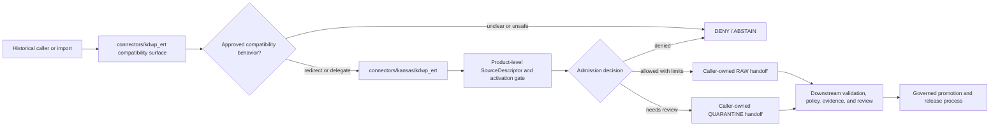

<!-- [KFM_META_BLOCK_V2]
doc_id: kfm://doc/connectors-kdwp-ert-readme
title: connectors/kdwp_ert/ — KDWP Ecological Review Tool Compatibility Lane
type: readme
version: v0.2
status: draft
owners: OWNER_TBD — Connector steward · Kansas source steward · Flora steward · Fauna steward · Habitat steward · Rights reviewer · Sensitivity reviewer · Validation steward · Docs steward
created: 2026-06-19
updated: 2026-07-13
policy_label: public-doctrine; compatibility-lane; noncanonical-path; bounded-review-output; rights-gated; sensitivity-gated; no-publication
current_path: connectors/kdwp_ert/README.md
canonical_working_lane: connectors/kansas/kdwp_ert/
institutional_family_lane: connectors/kansas/kdwp/
truth_posture: CONFIRMED current path and inspected repository evidence / NONCANONICAL compatibility lane / CONFLICTED final ERT placement and SourceDescriptor role authority / UNKNOWN runtime and source-access depth
evidence_snapshot:
  repository: bartytime4life/Kansas-Frontier-Matrix
  base_ref: main
  base_commit: e643fd599874083f74104162ed492729fc17bc7f
  prior_blob: a67c3bb595ae90cb1c210610a7e8a8e072de801c
related:
  - ../README.md
  - ../kdwp/README.md
  - ../kansas/README.md
  - ../kansas/kdwp/README.md
  - ../kansas/kdwp_ert/README.md
  - ../../CONTRIBUTING.md
  - ../../.github/CODEOWNERS
  - ../../docs/doctrine/directory-rules.md
  - ../../docs/sources/catalog/kansas/kdwp.md
  - ../../docs/sources/SOURCE_DESCRIPTOR_STANDARD.md
  - ../../docs/domains/flora/SOURCES.md
  - ../../docs/domains/fauna/SOURCES.md
  - ../../docs/domains/habitat/README.md
  - ../../contracts/source/source_descriptor.md
  - ../../schemas/contracts/v1/source/source_descriptor.schema.json
  - ../../schemas/contracts/v1/sources/source_descriptor.schema.json
  - ../../data/registry/sources/README.md
  - ../../control_plane/source_authority_register.yaml
  - ../../policy/rights/
  - ../../policy/sensitivity/
  - ../../release/
tags: [kfm, connectors, kdwp, kdwp-ert, ecological-review-tool, compatibility, kansas, flora, fauna, habitat, bounded-review, source-admission, rights, sensitivity, raw, quarantine, governance]
notes:
  - "This top-level path is retained as a compatibility and migration surface. It must not evolve as a second canonical KDWP ERT implementation."
  - "The current implementation-bearing documentation lane is `connectors/kansas/kdwp_ert/`; final sibling-versus-child placement under the institutional `connectors/kansas/kdwp/` family remains CONFLICTED / NEEDS VERIFICATION."
  - "ERT and stewardship outputs are bounded review evidence. Preserve request scope, review status, inputs, output version, expiry, limitations, correction, withdrawal, and supersession context; do not reinterpret them as legal clearance, reusable site truth, a public occurrence layer, or a KFM release decision."
  - "SourceDescriptor authority remains conflicted across narrative doctrine, the singular-path schema, the plural-path scaffold, and source-role vocabulary. This compatibility lane must not resolve that conflict."
  - "Only this README is changed. No connector code, descriptor, fixture, policy, schema, workflow, receipt, release object, source activation, path move, or public artifact is created."
[/KFM_META_BLOCK_V2] -->

<a id="top"></a>

# KDWP Ecological Review Tool Compatibility Lane

> [!IMPORTANT]
> **Document lifecycle:** `draft`  
> **Component maturity:** compatibility and migration contract; runtime `UNKNOWN`  
> **Owner:** `OWNER_TBD`  
> **Canonicality:** `NONCANONICAL` top-level path  
> **Working lane:** [`connectors/kansas/kdwp_ert/`](../kansas/kdwp_ert/)  
> **Boundary:** no source activation, public review service, legal clearance, sensitivity decision, map publication, or release authority.

This folder exists to keep older references to `connectors/kdwp_ert/` understandable and safely redirected. New implementation work should not be added here unless an accepted ADR or explicit migration plan requires a narrowly bounded compatibility adapter.

**Quick links:** [Purpose](#purpose) · [Authority and status](#authority-and-status) · [Routing](#routing) · [What belongs here](#what-belongs-here) · [What does not belong here](#what-does-not-belong-here) · [ERT meaning boundaries](#ert-record-and-meaning-boundaries) · [Lifecycle](#lifecycle-boundary) · [Validation](#validation) · [Review burden](#review-burden) · [Evidence basis](#evidence-basis) · [Definition of done](#definition-of-done) · [Rollback](#rollback) · [Verification backlog](#verification-backlog)

---

## Purpose

`connectors/kdwp_ert/` is a compatibility lane for historical or external references that still point to the top-level KDWP Ecological Review Tool path.

Its responsibilities are deliberately narrow:

1. redirect maintainers to the current Kansas-family ERT documentation lane;
2. record that this path is noncanonical;
3. preserve migration and rollback context;
4. prevent parallel connector, schema, registry, policy, or publication authority from forming here;
5. fail closed when ERT product identity, rights, sensitivity, source role, review scope, or access posture is unresolved.

The current implementation-bearing documentation lane is:

```text
connectors/kansas/kdwp_ert/
```

The institutional KDWP family lane is:

```text
connectors/kansas/kdwp/
```

Whether ERT should remain a Kansas-family sibling, become a child of `kdwp/`, or be represented only by this redirect remains **CONFLICTED / NEEDS VERIFICATION**. This README records that conflict; it does not settle it.

[Back to top](#top)

---

## Authority and status

| Concern | Status | Evidence-bounded determination |
|---|---:|---|
| Responsibility root | **CONFIRMED** | Source-specific retrieval and parsing belong under `connectors/`. |
| This top-level path | **CONFIRMED / NONCANONICAL** | The file exists, but the path is a compatibility surface rather than a second implementation authority. |
| Kansas connector family | **CONFIRMED** | KDWP connector work belongs under `connectors/kansas/`. |
| Current ERT working lane | **CONFIRMED** | `connectors/kansas/kdwp_ert/README.md` contains the current detailed admission contract. |
| Final ERT product placement | **CONFLICTED / NEEDS VERIFICATION** | No accepted path-specific ADR was verified that resolves sibling versus institutional-child placement. |
| Connector runtime | **UNKNOWN** | No live client, parser execution, fixture run, emitted receipt, source endpoint, or runtime log was verified for this top-level path. |
| Source activation | **NONE** | A README or folder cannot activate an external source. |
| Registry, schema, and policy authority | **NONE** | Those responsibilities belong to their governing roots. |
| Publication and legal-clearance authority | **NONE** | Connector output cannot authorize public release or represent legal clearance. |

> [!CAUTION]
> Repository presence is not canonicality. A compatibility path must not become a parallel authority merely because references to it still exist.

[Back to top](#top)

---

## Routing

Use the following routing rules:

| Need | Go to |
|---|---|
| Detailed ERT admission contract | [`connectors/kansas/kdwp_ert/`](../kansas/kdwp_ert/) |
| KDWP institutional connector family | [`connectors/kansas/kdwp/`](../kansas/kdwp/) |
| Kansas connector-family rules | [`connectors/kansas/`](../kansas/) |
| Top-level KDWP compatibility notes | [`connectors/kdwp/`](../kdwp/) |
| Human-readable KDWP source profile | [`docs/sources/catalog/kansas/kdwp.md`](../../docs/sources/catalog/kansas/kdwp.md) |
| Source descriptor standard | [`docs/sources/SOURCE_DESCRIPTOR_STANDARD.md`](../../docs/sources/SOURCE_DESCRIPTOR_STANDARD.md) |
| Machine source registry | [`data/registry/sources/`](../../data/registry/sources/) |
| Source authority decisions | [`control_plane/source_authority_register.yaml`](../../control_plane/source_authority_register.yaml) |
| Rights controls | [`policy/rights/`](../../policy/rights/) |
| Sensitivity controls | [`policy/sensitivity/`](../../policy/sensitivity/) |
| Release controls | [`release/`](../../release/) |

Do not duplicate the detailed ERT contract in this path. The compatibility lane should remain small enough that migration intent and authority boundaries are unmistakable.

[Back to top](#top)

---

## What belongs here

Permitted content is limited to:

- this redirect and compatibility README;
- explicit migration notes with an owner, target path, validation step, and rollback target;
- deprecation notices for historical imports or links;
- narrowly bounded adapters required to preserve compatibility during an approved migration;
- tests proving that compatibility behavior forwards, warns, or fails closed as designed;
- sunset criteria and removal evidence for any temporary compatibility code.

Any compatibility implementation must:

- avoid independent source activation;
- delegate to the accepted implementation lane rather than fork behavior;
- preserve source identity and request scope;
- emit no public artifact;
- avoid storing credentials, private requests, or sensitive payloads;
- have an explicit removal condition.

No item in this list proves that corresponding code already exists.

[Back to top](#top)

---

## What does not belong here

This folder must not own or imply authority over:

- a second KDWP ERT client, parser, fetcher, or product implementation;
- a public Ecological Review Tool or public review workflow;
- legal clearance, permitting, consultation, or release decisions;
- reusable site-level truth detached from the bounded source request;
- `SourceDescriptor` instances or source-authority registry entries;
- canonical contracts, schemas, source-role vocabularies, policies, or release rules;
- rights, sensitivity, redaction, access, or public-precision decisions;
- taxonomic-backbone or conservation-status tie-breakers;
- public occurrence points, range truth, habitat occupancy, or sensitive-location products inferred from review output;
- requester contact details, private-project material, credentials, tokens, cookies, private URLs, or private correspondence;
- direct writes to `WORK`, `PROCESSED`, `CATALOG`, `TRIPLET`, `PUBLISHED`, proof, or release stores;
- `EvidenceBundle`, proof-pack, catalog, release-manifest, correction, withdrawal, or rollback authority;
- public APIs, map layers, tiles, dashboards, summaries, exports, or AI answers;
- generated language presented as regulatory, ecological, occurrence, habitat, sensitivity, legal, or release truth.

A retrieved review result is not an admitted source. An admitted source is not validated evidence. Validated evidence is not legal clearance or a released public claim.

[Back to top](#top)

---

## ERT record and meaning boundaries

ERT or stewardship-review material must remain bounded to the source-issued request, review, result, package, and limitations.

Preserve, when the source provides them:

| Record dimension | Required treatment |
|---|---|
| Product identity | Identify the exact issuing program, product, and version; agency name alone is insufficient. |
| Request scope | Keep the source-defined spatial, temporal, taxonomic, project, and purpose boundary. |
| Review identifier | Preserve the source-native request, review, result, or package identifier. |
| Review status | Preserve preliminary, complete, expired, withdrawn, corrected, superseded, or other source-native state. |
| Inputs | Preserve references to screening layers, submitted geometry, taxon lists, or other source inputs when disclosure is permitted. |
| Output limitations | Preserve caveats, expiry, reuse restrictions, required follow-up, and non-clearance language. |
| Temporal context | Preserve source, review, effective, expiry, retrieval, correction, withdrawal, and supersession time where material. |
| Geometry | Preserve original-versus-public intent, precision, coordinate uncertainty, withholding, generalization, and sensitivity state. |
| Rights | Preserve access, attribution, redistribution, downstream-use, and retention limits. Unknown rights fail closed. |
| Source role | Use the accepted machine vocabulary. Until authority is resolved, preserve human meaning and quarantine ambiguous mixed-role records. |
| Provenance | Preserve source URI or controlled reference, source head, checksum or equivalent identity signal, retrieval context, and transform lineage. |

Do not reinterpret a bounded review output as:

- statewide occurrence truth;
- current range or occupancy truth;
- a taxonomic authority;
- a sensitivity policy decision;
- a legal clearance;
- a guarantee that no protected resource is present;
- a reusable answer for another site, time, project, or purpose;
- a KFM release decision.

[Back to top](#top)

---

## SourceDescriptor authority conflict

The repository currently exposes competing or incomplete `SourceDescriptor` authority signals:

- narrative doctrine and source catalog material;
- `contracts/source/source_descriptor.md`;
- `schemas/contracts/v1/source/source_descriptor.schema.json`;
- `schemas/contracts/v1/sources/source_descriptor.schema.json`;
- `data/registry/sources/README.md`;
- `control_plane/source_authority_register.yaml`.

The inspected Kansas-lane ERT README records the singular-path schema as legacy and the plural-path schema as an empty scaffold. Source-role descriptions also vary across narrative surfaces.

Therefore:

1. this compatibility README must not declare one schema home or role vocabulary canonical;
2. an ERT source must not be activated without an accepted product-level descriptor and authority decision;
3. ambiguous role mappings route to `QUARANTINE` or `ABSTAIN`;
4. resolving the schema-home or vocabulary conflict belongs to an accepted ADR or governing authority update, not this folder.

[Back to top](#top)

---

## Lifecycle boundary



This compatibility path may redirect or delegate. It must not independently advance source material through the lifecycle.

The KFM lifecycle remains:

```text
RAW -> WORK / QUARANTINE -> PROCESSED -> CATALOG / TRIPLET -> PUBLISHED
```

Promotion is a governed state transition, not a connector write, file move, commit, pull request, or generated summary.

[Back to top](#top)

---

## Validation

A compatibility change is acceptable only when validation shows that:

- the top-level path is visibly marked noncanonical;
- normal documentation navigation points to `connectors/kansas/kdwp_ert/`;
- no implementation fork is introduced;
- any adapter delegates to the accepted implementation lane;
- source metadata and bounded review scope are preserved;
- live access still requires an accepted product-level descriptor and activation decision;
- unresolved rights, sensitivity, source role, taxonomy, geometry, review status, product identity, or access method fail closed;
- no sensitive or private fixture data is committed;
- outputs remain limited to redirect behavior or caller-owned `RAW` / `QUARANTINE` handoff through the canonical lane;
- no direct writes target `WORK`, `PROCESSED`, `CATALOG`, `TRIPLET`, `PUBLISHED`, proof, receipt, or release stores;
- Markdown links and anchors resolve;
- the compatibility path has a documented rollback target and sunset decision.

Documentation-only validation for this change should include:

```bash
git diff --check
markdownlint connectors/kdwp_ert/README.md
```

The exact repository-supported Markdown command remains **NEEDS VERIFICATION** against current workflow and tool configuration.

[Back to top](#top)

---

## Review burden

At minimum, a material change to this lane should receive review from:

- connector steward;
- Kansas source steward;
- relevant flora, fauna, or habitat steward;
- rights reviewer;
- sensitivity reviewer;
- validation steward;
- docs steward.

Additional review is required when a change affects:

- source activation;
- schema or contract authority;
- source-role vocabulary;
- exact or sensitive geometry;
- rights or redistribution;
- public API, map, export, or AI behavior;
- release, correction, withdrawal, or rollback.

`CODEOWNERS` routing is useful operational evidence, but it does not by itself prove semantic ownership or approval.

[Back to top](#top)

---

## Evidence basis

| Evidence | Status | Supports | Does not prove |
|---|---:|---|---|
| `connectors/kdwp_ert/README.md` at base commit | **CONFIRMED** | Existing top-level compatibility documentation and prior blob for rollback. | Canonicality, runtime, or source activation. |
| `connectors/kansas/kdwp_ert/README.md` | **CONFIRMED** | Current detailed ERT admission contract, product meaning boundaries, descriptor conflict, and current working path. | Final sibling-versus-child placement or implementation maturity. |
| `connectors/kansas/kdwp/README.md` | **CONFIRMED** | Institutional KDWP family responsibilities and anti-collapse posture. | Product-specific ERT access or implementation. |
| `docs/sources/catalog/kansas/kdwp.md` | **CONFIRMED** | Human-facing KDWP source profile and Kansas-family placement. | Current official endpoint, rights, cadence, or activation. |
| `docs/doctrine/directory-rules.md` | **CONFIRMED doctrine** | Responsibility-root placement, no parallel authority, lifecycle and migration discipline. | Exact current implementation below uninspected paths. |
| Source descriptor and authority surfaces listed above | **CONFIRMED paths referenced by current lane** | Existence of multiple authority signals and the need for resolution. | An accepted canonical schema home or role vocabulary. |
| Current repository snapshot | **CONFIRMED at pinned commit** | Base commit and prior blob used for this revision. | CI success, branch protection, runtime behavior, or deployed state. |

### Evidence limits

This update does not claim that:

- a KDWP ERT connector runtime exists;
- a live endpoint is available or approved;
- current official terms or redistribution rights are known;
- an accepted ERT `SourceDescriptor` exists;
- source-role or schema-home conflicts are resolved;
- fixtures, tests, receipts, proofs, releases, or public artifacts exist;
- this compatibility path should be deleted or retained permanently.

[Back to top](#top)

---

## ADRs

No accepted path-specific ADR was verified that authorizes this top-level folder as a canonical ERT implementation home.

An ADR or equivalent accepted migration decision is required before:

- making this path canonical;
- moving ERT from its current Kansas-family sibling position;
- creating a second implementation;
- changing schema-home authority;
- establishing a new source-role vocabulary;
- creating a parallel registry, policy, receipt, proof, or release home.

A future placement decision should record:

1. current and target paths;
2. responsibility owner;
3. compatibility period;
4. import and documentation migration;
5. validation and no-duplicate-authority checks;
6. rollback target;
7. deletion or retention criteria.

[Back to top](#top)

---

## Definition of done

This compatibility lane is ready for review when:

- [x] The top-level path is explicitly marked noncanonical.
- [x] The current Kansas-family ERT lane is linked.
- [x] ERT review output is bounded and not represented as legal clearance or reusable site truth.
- [x] Source activation, registry, schema, policy, and publication authority are excluded.
- [x] The current base commit and prior blob are recorded for rollback.
- [ ] An accepted placement decision resolves sibling, child, redirect-only, or removal status.
- [ ] Canonical `SourceDescriptor` schema and source-role authority are resolved.
- [ ] Product-level ERT descriptor, rights, sensitivity, access, cadence, and fixture posture are verified.
- [ ] Any compatibility code has tests, a removal condition, and no independent source behavior.
- [ ] Repository-supported Markdown and link checks pass in CI.
- [ ] Owners and required reviewers are assigned.

[Back to top](#top)

---

## Rollback

**Rollback target**

```text
base commit: e643fd599874083f74104162ed492729fc17bc7f
prior blob: a67c3bb595ae90cb1c210610a7e8a8e072de801c
path: connectors/kdwp_ert/README.md
```

Rollback is appropriate if this revision:

- breaks repository navigation;
- incorrectly identifies the working lane;
- conflicts with an accepted ADR or newer migration decision;
- obscures rather than clarifies the compatibility boundary;
- is used to justify source activation, legal clearance, direct publication, or parallel authority.

A rollback restores the prior blob at the recorded base. It does not decide the long-term fate of the path.

[Back to top](#top)

---

## Verification backlog

| Item | Status | Evidence needed |
|---|---:|---|
| Resolve final ERT placement: Kansas-family sibling, child under `kdwp/`, redirect-only path, or removal. | **CONFLICTED / NEEDS VERIFICATION** | Accepted ADR, migration decision, and repository-wide reference scan. |
| Confirm the current authoritative `SourceDescriptor` schema home. | **CONFLICTED** | Accepted schema-home ADR and populated canonical schema. |
| Confirm the accepted source-role vocabulary for bounded review outputs. | **CONFLICTED** | Machine contract, registry rule, policy mapping, and fixtures. |
| Verify an ERT product-level descriptor and source authority record. | **NOT VERIFIED** | Registry entry and accepted activation decision. |
| Verify official product identity, fields, access method, cadence, and source-head signal. | **NEEDS VERIFICATION** | Current official source documentation and source-steward review. |
| Verify rights, attribution, redistribution, retention, and account requirements. | **NEEDS VERIFICATION** | Rights review and recorded terms snapshot. |
| Verify sensitivity, geometry, private-project, rare-taxon, cultural, and facility controls. | **NEEDS VERIFICATION** | Policy review, redaction/generalization tests, and safe fixtures. |
| Scan repository references to `connectors/kdwp_ert/`. | **NEEDS VERIFICATION** | Complete code and documentation search at the migration commit. |
| Confirm whether compatibility code exists below this path. | **UNKNOWN** | Recursive tree inspection and tests. |
| Assign semantic owners and reviewers. | **UNKNOWN** | Steward decision plus CODEOWNERS or governance update. |
| Confirm Markdown lint and link-check commands. | **NEEDS VERIFICATION** | Current workflow and tool configuration. |
| Define removal or long-term retention criteria. | **PROPOSED** | Migration plan with validation and rollback evidence. |

[Back to top](#top)

---

## Maintainer summary

Treat `connectors/kdwp_ert/` as a signpost, not a second connector.

```text
historical reference
  -> compatibility redirect
  -> connectors/kansas/kdwp_ert/
  -> product-level source admission
  -> RAW or QUARANTINE handoff
  -> downstream evidence, policy, validation, release, correction, and rollback
```

When evidence is incomplete, preserve the bounded source meaning and choose `QUARANTINE`, `DENY`, or `ABSTAIN` rather than inventing authority.
