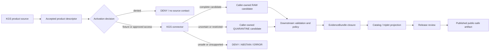

<!-- [KFM_META_BLOCK_V2]
doc_id: kfm://doc/connectors-kgs-readme
title: connectors/kgs/ — KGS Source-First Compatibility and Migration Boundary
type: readme
version: v0.2
status: draft
owners: OWNER_TBD — Connector steward · Package maintainer · KGS source steward · Geology steward · Hydrology steward · Hazards steward · Rights reviewer · Privacy/sensitivity reviewer · Security reviewer · Validation steward · Test steward · Docs steward
created: 2026-06-19
updated: 2026-07-13
policy_label: public-doctrine; source-first-connector; documentation-only; compatibility-path; path-and-slug-conflict; product-and-role-separation; rights-fail-closed; sensitive-location-fail-closed; no-network; no-activation; no-publication
current_path: connectors/kgs/README.md
truth_posture: CONFIRMED README-only source-first candidate at connectors/kgs, live non-operational 0.0.0 scaffold at connectors/ksgs, documentation-only pointer at connectors/geology/kgs, product-specific compatibility READMEs, absent named package/test children below connectors/kgs, absent catalog-proposed connectors/kansas/kgs child, empty source-authority register, conflicted SourceDescriptor schema authority, and TODO-only connector workflows / CONFLICTED final connector path, kgs-versus-ksgs distribution and import identity, package migration, product decomposition, descriptor authority, role mapping, registry placement, fixture routing, and test ownership / PROPOSED fail-closed compatibility and migration contract / UNKNOWN differently named files, package runtime, live source access, current rights and terms, activation, substantive CI, deployment, and release readiness
evidence_snapshot:
  repository: bartytime4life/Kansas-Frontier-Matrix
  base_ref: main
  base_commit: b047eef221136e0efe59a9983f1aae1340c23b70
  prior_blob: aaa879834da8229cba83a6bb9e8ee40295759a76
  readme_introduction_commit: ae21a43aba405d3f86a31931e1d5fe94a2435174
related:
  - ../README.md
  - ../ksgs/README.md
  - ../ksgs/pyproject.toml
  - ../ksgs/src/README.md
  - ../ksgs/src/ksgs/README.md
  - ../ksgs/src/ksgs/descriptor.yaml
  - ../ksgs/tests/README.md
  - ../geology/kgs/README.md
  - ../kansas/README.md
  - ../kgs_surficial/README.md
  - ../kgs_bedrock/README.md
  - ../kgs_oil_gas_wells/README.md
  - ../kgs_kdhe_wwc5/README.md
  - ../kgs_las/README.md
  - ../../CONTRIBUTING.md
  - ../../.github/CODEOWNERS
  - ../../.github/workflows/connector-gate.yml
  - ../../.github/workflows/source-descriptor-validate.yml
  - ../../docs/doctrine/directory-rules.md
  - ../../docs/adr/ADR-0001-schema-home--schemas-contracts-v1-is-canonical.md
  - ../../docs/adr/ADR-0012-connector-outputs-to-data-raw-or-data-quarantine-only.md
  - ../../docs/sources/catalog/kansas/ksgs.md
  - ../../docs/sources/catalog/kansas/kcc-oil-gas-reg.md
  - ../../docs/sources/catalog/kansas/kdhe.md
  - ../../docs/domains/geology/README.md
  - ../../docs/domains/geology/CANONICAL_PATHS.md
  - ../../docs/domains/geology/SOURCES.md
  - ../../docs/domains/hydrology/README.md
  - ../../contracts/source/source_descriptor.md
  - ../../schemas/contracts/v1/source/source_descriptor.schema.json
  - ../../schemas/contracts/v1/sources/source_descriptor.schema.json
  - ../../control_plane/source_authority_register.yaml
  - ../../data/registry/sources/README.md
  - ../../policy/rights/README.md
  - ../../policy/sensitivity/README.md
  - ../../tests/README.md
  - ../../fixtures/README.md
  - ../../release/
tags: [kfm, connectors, kgs, ksgs, kansas, geology, hydrology, hazards, wells, surficial, bedrock, oil-gas, wwc5, las, geoportal, compatibility, migration, source-admission, source-role, rights, sensitivity, no-network, raw, quarantine, no-publication]
notes:
  - "Direct reads at the pinned base confirm connectors/kgs/README.md and exact Not Found responses for connectors/kgs/pyproject.toml, connectors/kgs/src/README.md, and connectors/kgs/tests/README.md. The current path is documentation-only at those named probes."
  - "The sole live package-shaped KGS scaffold is connectors/ksgs/: kfm-connector-ksgs version 0.0.0, an empty initializer, comment-only fetch.py and admit.py, a four-field nonconforming descriptor, and README-only named test lane."
  - "The catalog-proposed connectors/kansas/kgs/README.md path was absent at the pinned base. The newer connectors/geology/kgs/README.md explicitly rejects domain-scoped implementation and records the final source-first path as conflicted."
  - "Product-specific top-level KGS READMEs exist for surficial, bedrock, oil-and-gas wells, WWC5, and LAS. Their presence is migration and product-scope evidence, not proof of executable connectors or activation."
  - "KGS publisher, product, dataset, file, well, log, curve, picked-top, map-unit, completion, production, regulatory, and modeled identities must remain distinct. KGS records must not collapse into KCC regulatory determinations, KDHE environmental conclusions, or generated truth."
  - "Only this Markdown file is in scope. No path, package, code, descriptor, registry record, fixture, test, workflow, schema, contract, policy, source payload, credential, lifecycle artifact, evidence object, release object, or public artifact is created or changed."
[/KFM_META_BLOCK_V2] -->

<a id="top"></a>

# KGS Source-First Compatibility and Migration Boundary

> Repository-grounded boundary for `connectors/kgs/`. The path is a **README-only source-first candidate**, not an operational connector. KGS implementation placement is unresolved among this path, the live `connectors/ksgs/` scaffold, the catalog-proposed but absent `connectors/kansas/kgs/` child, and product-specific compatibility lanes.

**Document lifecycle:** `draft v0.2`  
**Current maturity:** `CONFIRMED` documentation-only at this path; executable KGS connector behavior is not established  
**Owner:** `OWNER_TBD`  
**Authority:** compatibility and migration documentation only; no source, schema, policy, lifecycle, evidence, release, or publication authority  
**Default posture:** no network · no activation · fail closed · no lifecycle writes · no publication

> [!IMPORTANT]
> `connectors/kgs/` currently contains this README at the named inspected paths. No `pyproject.toml`, `src/README.md`, or `tests/README.md` was found below it. Do not infer a package, client, parser, descriptor, fixture set, test suite, command, or runtime from this directory name.

> [!CAUTION]
> The repository has not accepted a final KGS connector path or `kgs` versus `ksgs` identity. Do not create runtime behavior, aliases, product dispatch, descriptors, fixtures, or lifecycle writers here merely because this source-first name is attractive. Placement and migration require an accepted ADR or explicit migration plan.

**Quick links:** [Purpose](#purpose) · [Authority](#authority-level) · [Current state](#current-repository-state) · [Placement conflict](#placement-package-and-slug-conflict) · [What belongs](#what-belongs-here) · [Exclusions](#what-does-not-belong-here) · [Products](#kgs-product-and-record-boundaries) · [Roles](#source-role-and-authority-anti-collapse) · [Descriptor conflict](#descriptor-registry-and-activation-boundary) · [Rights and sensitivity](#rights-sensitivity-privacy-and-location-boundary) · [Inputs](#inputs) · [Outputs](#outputs) · [Failure contract](#failure-contract) · [Lifecycle](#lifecycle-and-publication-boundary) · [Validation](#validation) · [Evidence](#evidence-basis) · [Review and migration](#review-migration-and-rollback) · [Definition of done](#definition-of-done) · [Backlog](#verification-backlog)

---

## Purpose

`connectors/kgs/` exists today as a documentation and migration surface under the canonical `connectors/` responsibility root.

Its narrow purpose is to:

- record the current KGS path, package, slug, and product conflicts without selecting a winner by convenience;
- prevent this README-only path from being mistaken for executable implementation;
- preserve a source-first candidate name while an accepted migration decision is pending;
- route maintainers to the live `connectors/ksgs/` scaffold and the product-specific compatibility documents for evidence;
- keep KGS publisher, product, dataset, file, record, feature, well, log, curve, top, map-unit, and model identities distinct;
- preserve rights, sensitivity, geometry, scale, datum, depth, unit, time, uncertainty, disclaimer, and provenance requirements;
- prevent KGS material from being collapsed into KCC regulatory findings, KDHE environmental conclusions, KDA-DWR authorities, USGS records, production forecasts, or generated summaries;
- define the review, validation, migration, and rollback burden for a future accepted KGS connector.

This README does not activate a source, establish a package API, approve an endpoint, select a source role, grant rights, set a public sensitivity floor, create an EvidenceBundle, or authorize release.

[Back to top](#top)

---

## Authority level

**Documentation-only compatibility and migration boundary.**

| Concern | Status | Evidence-bounded determination |
|---|---:|---|
| Responsibility root | **CONFIRMED** | Directory Rules assign source-specific fetch, probe, preservation, parsing, packaging, and admission support to `connectors/`. |
| Current path | **CONFIRMED** | `connectors/kgs/README.md` exists at the pinned base. |
| Package below this path | **NOT FOUND AT NAMED PROBES / OTHERWISE UNKNOWN** | Exact reads for `pyproject.toml`, `src/README.md`, and `tests/README.md` returned `Not Found`. |
| Live KGS-shaped scaffold | **CONFIRMED ELSEWHERE** | `connectors/ksgs/` contains a `0.0.0` distribution/import scaffold and documentation-only test lane. |
| Final connector path | **CONFLICTED** | Current candidates include `connectors/kgs/`, `connectors/ksgs/`, proposed-but-absent `connectors/kansas/kgs/`, and documentation-only `connectors/geology/kgs/`. |
| Product lanes | **CONFIRMED READMES / IMPLEMENTATION UNKNOWN** | Surficial, bedrock, oil-and-gas wells, WWC5, and LAS compatibility READMEs exist. |
| SourceDescriptor authority | **CONFLICTED / NOT ESTABLISHED FOR KGS** | The populated singular schema calls the plural path canonical; the plural schema is an empty scaffold; the machine source-authority register has no entries. |
| Source activation | **DENIED / NOT VERIFIED** | No accepted product descriptor, source head, rights/sensitivity review, activation decision, or substantive connector gate was verified. |
| Public release | **NONE** | This folder cannot create a public map, API response, evidence object, regulatory finding, engineering conclusion, or release. |

Path presence and documentation do not grant authority. Any executable implementation must remain subordinate to accepted source identity, contracts, schemas, registries, policy, lifecycle, testing, evidence, and release surfaces.

[Back to top](#top)

---

## Current repository state

### Bounded snapshot

The following snapshot is bounded to repository `bartytime4life/Kansas-Frontier-Matrix` at base commit `b047eef221136e0efe59a9983f1aae1340c23b70` and the named paths inspected for this revision:

```text
connectors/
├── kgs/
│   └── README.md                         # this documentation boundary
├── ksgs/
│   ├── README.md                         # greenfield scaffold boundary
│   ├── pyproject.toml                    # kfm-connector-ksgs, version 0.0.0
│   ├── src/
│   │   ├── README.md                     # source-layout boundary
│   │   └── ksgs/
│   │       ├── README.md                 # package scaffold boundary
│   │       ├── __init__.py               # empty
│   │       ├── fetch.py                  # comment-only placeholder
│   │       ├── admit.py                  # comment-only placeholder
│   │       └── descriptor.yaml           # nonconforming four-field placeholder
│   └── tests/
│       └── README.md                     # documentation contract
├── geology/
│   └── kgs/
│       └── README.md                     # domain-scoped compatibility pointer
├── kansas/
│   └── README.md                         # Kansas-family coordination root
├── kgs_surficial/
│   └── README.md                         # product compatibility boundary
├── kgs_bedrock/
│   └── README.md                         # product compatibility boundary
├── kgs_oil_gas_wells/
│   └── README.md                         # product compatibility boundary
├── kgs_kdhe_wwc5/
│   └── README.md                         # joint-program compatibility boundary
└── kgs_las/
    └── README.md                         # well-log compatibility boundary
```

Exact probes returned `Not Found` for:

```text
connectors/kgs/pyproject.toml
connectors/kgs/src/README.md
connectors/kgs/tests/README.md
connectors/kansas/kgs/README.md
```

These absence statements are limited to the pinned commit and named paths. Differently named, generated, unindexed, or later-added files remain `UNKNOWN` until directly inspected.

### Current maturity table

| Surface | Confirmed state | Safe conclusion |
|---|---|---|
| `connectors/kgs/` | README-only at named probes. | Documentation and migration boundary; no executable behavior. |
| `connectors/ksgs/` | `0.0.0` package-shaped scaffold. | Package presence only; buildability, imports, runtime, and activation are unproved. |
| `connectors/ksgs/src/ksgs/__init__.py` | Empty. | No public import API or initialization behavior. |
| `fetch.py` / `admit.py` | Comment-only. | No transport, parsing, validation, decision, receipt, or handoff behavior. |
| Local `descriptor.yaml` | `name: ksgs`, `role: TBD`, `rights: TBD`, `sensitivity_floor: public`. | Invalid as source authority, activation, rights clearance, sensitivity clearance, or release evidence. |
| Connector-local tests | README-only at conventional named probes documented by the sibling lane. | Discovery count, coverage, pass state, and negative-case enforcement are unknown. |
| Connector workflows | TODO echo steps. | Green completion proves workflow execution only, not connector behavior. |

[Back to top](#top)

---

## Placement, package, and slug conflict

The current evidence supports a firm responsibility decision but not a final path decision:

> **KGS source access belongs under one accepted source-first or source-family connector lane. The winning path has not been ratified.**

| Candidate surface | Current posture | Safe action |
|---|---|---|
| `connectors/kgs/` | README-only source-first candidate; named by Geology path doctrine but self-documented as compatibility in v0.1. | Keep documentation-only until ADR/migration acceptance. |
| `connectors/ksgs/` | Only live package-shaped scaffold; distribution/import use `ksgs`; own v0.2 docs mark final placement conflicted. | Do not add operational behavior merely because a scaffold exists. |
| `connectors/kansas/kgs/` | Proposed by the draft source catalog; exact README probe was absent. | Do not describe as implemented or migrated. |
| `connectors/geology/kgs/` | README-only pointer; current doctrine rejects domain-scoped connector implementation. | Retain only as compatibility/navigation documentation if needed. |
| `connectors/kgs_*` | Product-specific README lanes. | Treat as product and migration evidence, not independent connector authorities. |
| `docs/sources/catalog/kansas/ksgs.md` | Human-facing publisher catalog with preserved `ksgs` slug and proposed `kgs` connector path. | Use as orientation, not registry, activation, or implementation proof. |

### Decision requirements

An accepted ADR or migration plan must decide at least:

1. final connector directory;
2. distribution name and import package;
3. publisher, source-family, product, dataset, and record identifiers;
4. whether `ksgs` survives as a compatibility alias and for how long;
5. whether product-specific lanes become children, dispatch modules, redirects, or retired compatibility documents;
6. descriptor, registry, fixture, and connector-local test routing;
7. import and configuration compatibility;
8. source-head, receipt, provenance, correction, and supersession continuity;
9. deprecation warnings, sunset criteria, rollback, and backlink repair;
10. CODEOWNERS, review burden, and release gating.

A silent alias, folder copy, package rename, or README edit is not a migration.

[Back to top](#top)

---

## What belongs here

Until placement is accepted, this path should contain only narrow compatibility and migration documentation such as:

- current-state inventory and evidence snapshots;
- path, package, slug, and product conflict records;
- links to the live `ksgs` scaffold and product-specific boundaries;
- deprecation, redirect, or compatibility-import design notes after acceptance;
- migration requirements for source IDs, descriptors, fixtures, tests, receipts, and provenance;
- explicit warnings that no source is active and no public output is authorized;
- correction notes for stale claims that `connectors/kansas/kgs/` already exists or is conclusively canonical;
- rollback targets and verification backlogs.

After an accepted migration makes this the retained implementation home, it may contain one governed distribution boundary, one import package, source-specific code, and connector-local tests—but only in the same change sequence that establishes accepted identity, descriptors, policy gates, fixtures, tests, and migration evidence.

[Back to top](#top)

---

## What does not belong here

This directory must not contain or imply authority over:

- a second or parallel KGS implementation while `connectors/ksgs/` remains live;
- a silent `kgs`/`ksgs` alias or duplicate package;
- publisher-wide activation or one descriptor for every KGS product;
- authoritative `SourceDescriptor` instances or source-authority register entries;
- canonical contracts, schemas, source-role vocabulary, rights rules, sensitivity rules, or release policy;
- live credentials, cookies, API keys, authorization headers, signed URLs, private endpoints, or account details;
- bulk KGS downloads, LAS archives, database exports, map caches, production payload corpora, or unreviewed upstream samples;
- exact private wells, boreholes, samples, proprietary logs, owner/parcel joins, sensitive subsurface sites, critical infrastructure, or harmful location joins in fixtures, logs, snapshots, or examples;
- network access on import, installation, default tests, or documentation rendering;
- direct writes to `data/raw/`, `data/quarantine/`, `data/receipts/`, `data/work/`, `data/processed/`, `data/catalog/`, `data/triplets/`, `data/proofs/`, `data/published/`, or `release/`;
- EvidenceBundle closure, proof generation, lifecycle promotion, correction, withdrawal, supersession, rollback execution, or publication;
- public APIs, map layers, tiles, reserve estimates, drilling advice, engineering guidance, water-supply conclusions, site-safety decisions, or AI narratives presented as KGS truth.

Public availability upstream is not equivalent to KFM rights clearance, sensitivity clearance, evidence closure, or release approval.

[Back to top](#top)

---

## KGS product and record boundaries

KGS is a publisher family, not one homogeneous dataset or one universal source role.

| Product or record family | Required identity and lineage | Denied collapse |
|---|---|---|
| Surficial geologic maps | Product, edition, map/unit identity, compilation method, scale, CRS/datum, geometry, source URI, vintage, disclaimer. | Map compilation presented as direct observation, current site condition, or exact engineering truth. |
| Bedrock geologic maps | Product, unit/formation identity, scale, interpretation method, source edition, geometry, uncertainty, citation. | Interpreted regional geology presented as measured site-specific subsurface condition. |
| Oil-and-gas well records | Well, API or source identifier, record type, location derivation, operator/field context, source role, vintage. | KGS record presented as KCC regulatory determination, compliance finding, reserve statement, or current operational status. |
| Production aggregates | Lease/field/well scope, reporting period, units, aggregation level, correction state, source vintage. | Aggregate presented as individual-well fact, forecast, reserve estimate, or current production truth. |
| WWC5 water-well records | Joint-program identity, well/completion identity, PLSS derivation, coordinate precision, construction/completion fields, disclaimer, vintage. | Completion record presented as current water quality, aquifer condition, safe supply, ownership truth, or exact public location by default. |
| LAS well logs | Well/log/file/curve identity, mnemonic, units, depth index, reference/datum, null encoding, sampling interval, checksum, source head. | Recorded curve presented as picked top, interpreted formation, canonical geology, or drilling recommendation. |
| Picked well tops | Well/top/formation identity, interpreter or method, source-log references, depth reference, confidence, uncertainty, vintage, supersession. | Interpreted top presented as raw measured curve or uncontested subsurface truth. |
| Derived surfaces and cross-section inputs | Model/run identity, source observations, method, parameters, resolution, uncertainty, vintage, supersession. | Modeled surface presented as exact observation, reserve truth, or site-specific engineering condition. |
| Geoportal resources | Resource-specific identity, access surface, schema, role, rights, cadence, scale, geometry, source head. | Mixed portal resources admitted under one publisher-wide descriptor or role. |

### Identity preservation rule

A future connector must preserve, where applicable:

- publisher identity;
- product and program identity;
- dataset/release identity;
- file and checksum identity;
- well, borehole, sample, log, curve, top, formation, map-unit, lease, field, completion, and model identities;
- source-native record identifiers;
- source, observation, effective/valid, retrieval, correction, and supersession time;
- coordinate source, CRS, datum, PLSS derivation, precision, uncertainty, and withholding state;
- depth index, reference, datum, units, null encoding, and sampling interval;
- interpretation method, source observations, confidence, and uncertainty;
- rights, attribution, disclaimer, access, sensitivity, review, and release-class context.

[Back to top](#top)

---

## Source-role and authority anti-collapse

Source role must be assigned per product and, when necessary, per record. It must not be inferred from publisher name, file extension, portal location, or implementation convenience.

Required distinctions include:

1. **KGS publisher authority** is not a single role for every product.
2. **Observed or recorded material** is not interpreted or modeled material.
3. **Interpreted tops, units, surfaces, and compilations** are not raw measurements.
4. **KGS well or production records** are not KCC regulatory determinations.
5. **WWC5 completion information** is not KDHE water-quality or environmental compliance truth.
6. **KGS/KDHE joint-program identity** does not merge agency responsibilities or review authority.
7. **Production aggregates** are not per-well operational facts, reserves, or forecasts.
8. **Public portal availability** is not rights, sensitivity, or release clearance.
9. **A generated summary, map, tile, graph edge, embedding, or AI answer** is a downstream carrier, not sovereign truth.
10. **One successful test or workflow** is not source activation, evidence closure, or publication approval.

When a source artifact mixes roles, the future connector must preserve the mixed provenance and route records through accepted product/record-specific role mapping. Convenience does not justify role collapse.

[Back to top](#top)

---

## Descriptor, registry, and activation boundary

The live connector-local placeholder under `connectors/ksgs/src/ksgs/descriptor.yaml` is not a conforming or authoritative `SourceDescriptor`:

```yaml
name: ksgs
role: TBD
rights: TBD
sensitivity_floor: public
```

| Placeholder field | Current problem | Required posture |
|---|---|---|
| `name` | Not the required stable `source_id`; also embeds the unresolved `ksgs` slug. | Resolve publisher/product identity through accepted registry conventions. |
| `role` | `TBD` is not an accepted role; one publisher-wide role would collapse product meaning. | Assign reviewed product/record-specific roles using the accepted machine vocabulary. |
| `rights` | Unresolved scalar placeholder. | Unknown rights fail closed; require reviewed attribution, redistribution, derivative-use, and access terms. |
| `sensitivity_floor` | Legacy/minimal alias with an unsafe permissive value. | Never treat `public` as clearance while product, geometry, rights, review, and release state are unresolved. |

The populated singular-path schema requires a richer closed object, but its metadata declares the plural path canonical. The plural-path schema is currently an empty permissive scaffold. The machine source-authority register is `PROPOSED` with `entries: []`.

Therefore:

- do not load package-local YAML as source authority;
- do not activate KGS from a catalog page, directory name, package import, or local descriptor;
- do not mint a local replacement schema, registry, policy, or activation record;
- do not assume narrative role labels map directly to current machine enums;
- require a product-specific, reviewed descriptor reference and explicit activation state before any source contact;
- deny or hold when descriptor authority, role mapping, rights, sensitivity, source head, or review state is unresolved.

[Back to top](#top)

---

## Rights, sensitivity, privacy, and location boundary

KGS material may be publicly reachable upstream while still requiring KFM review for redistribution, derivatives, attribution, exact-location exposure, joins, and public release.

### Fail-closed classes

Treat the following as restricted, generalized, quarantined, or denied until reviewed:

- exact private wells, boreholes, cores, samples, and owner-linked records;
- proprietary or restricted logs and interpretations;
- parcel, owner, contact, permit, or living-person joins;
- sensitive subsurface infrastructure or facility-adjacent locations;
- records whose PLSS-to-coordinate derivation or positional uncertainty is absent;
- source payloads with unclear license, terms, redistribution, or derivative-use rights;
- records whose public geometry differs from source/private geometry without a recorded transform;
- joins that create greater sensitivity than any input alone;
- stale, superseded, corrected, or incomplete records presented without state;
- maps or summaries that could be misused for drilling, extraction, trespass, targeting, or infrastructure discovery.

### Geometry requirements

Preserve:

- original coordinate representation;
- CRS and datum;
- PLSS description and derivation method;
- precision and positional uncertainty;
- public/generalized geometry separately from precise/restricted geometry;
- transform rule and version;
- withholding, embargo, access, and review state;
- source and correction vintage.

A connector may preserve sensitivity inputs and candidate restrictions. It must not make the final public-precision or release decision.

[Back to top](#top)

---

## Inputs

### Current

None. This README-only path declares no supported function, class, command, configuration contract, endpoint, credential variable, descriptor contract, fixture shape, or runner.

### Future admissible inputs

After placement, descriptor, activation, and review gates are accepted, a retained connector may consume:

- a conforming, reviewed, product-specific `SourceDescriptor` reference;
- an explicit activation decision for the exact operation mode;
- reviewed source configuration and access surface;
- caller-supplied bytes, files, metadata, or transport results;
- product, dataset, file, record, feature, well, log, curve, top, map-unit, and model identities;
- source-head evidence, checksum, release/vintage, retrieval time, and run identity;
- rights, attribution, disclaimer, redistribution, sensitivity, geometry, scale, datum, depth, units, uncertainty, and review context;
- an explicit fixture-only, restricted, or approved-live mode;
- caller-owned temporary storage and candidate sinks.

Inputs must never imply that the connector owns the registry, policy, lifecycle, or release decision.

[Back to top](#top)

---

## Outputs

### Current

None. This path emits no payload, parsed record, validation result, candidate envelope, receipt, lifecycle write, EvidenceBundle, map artifact, API payload, or public claim.

### Future bounded outputs

A retained connector may return in-memory, caller-owned:

1. parsed source-native records with preserved identity and metadata;
2. validation findings and structured warnings;
3. an **admit candidate** suitable for caller-owned `RAW` handoff consideration;
4. a **hold or quarantine candidate** with explicit reasons;
5. a deterministic **deny**, **abstain**, **no-op**, **rate-limit**, or **error** outcome;
6. a process-memory retrieval or denial receipt candidate if an accepted receipt contract exists.

The exact DTOs, enums, reason codes, sink protocol, idempotency rules, and receipt types remain **PROPOSED / NEEDS VERIFICATION**. This README does not mint them.

A connector must not emit processed truth, an EvidenceBundle, a catalog item, a triplet, a release manifest, a public map, a public API answer, or a publication decision.

[Back to top](#top)

---

## Failure contract

Until executable contracts are accepted, use these semantic outcomes as design constraints rather than claimed machine enums:

| Condition | Required semantic outcome |
|---|---|
| Final connector path or package identity unresolved | `DENY` implementation expansion or `HOLD` migration work. |
| Missing or nonconforming product descriptor | `DENY` source activation. |
| Missing activation decision | `DENY` source contact. |
| Unknown rights or terms | `HOLD` / `QUARANTINE` / `ABSTAIN`. |
| Unknown product or source role | `HOLD` / `QUARANTINE`; never infer by publisher or filename. |
| Sensitive exact location without approved handling | `HOLD` / `QUARANTINE` / `DENY` public output. |
| Missing CRS, datum, depth reference, units, or positional uncertainty where material | `HOLD` / `QUARANTINE`. |
| Raw curve mixed with picked top or model output | `DENY` collapsed interpretation. |
| KGS material presented as KCC or KDHE determination | `DENY` authority collapse. |
| Live network attempted during import or default tests | `ERROR` and fail the test. |
| Output attempts a lifecycle or release write from package code | `ERROR` and fail closed. |
| Upstream source unchanged under an accepted source-head contract | Deterministic `NO_OP` with evidence. |
| Rate limit or upstream temporary failure | Bounded `RATE_LIMIT` or retryable `ERROR`; no fabricated data. |
| Unsupported payload or schema drift | `HOLD` / `QUARANTINE` / `ERROR` with preserved source evidence. |

Failures must not leak credentials, private URLs, exact sensitive coordinates, proprietary payloads, or owner-linked information through logs, snapshots, exceptions, or generated reports.

[Back to top](#top)

---

## Lifecycle and publication boundary

KFM's lifecycle invariant remains:

```text
RAW → WORK / QUARANTINE → PROCESSED → CATALOG / TRIPLET → PUBLISHED
```

A future connector participates only at the source-admission edge. It may prepare caller-owned candidates for `RAW` or `QUARANTINE`; it does not promote data.



The connector must not:

- write directly to `WORK`, `PROCESSED`, `CATALOG`, `TRIPLET`, `PUBLISHED`, proof, or release stores;
- approve rights, sensitivity, redaction, evidence closure, or release;
- expose a public route, map layer, tile set, dashboard, or AI answer;
- treat a retrieval receipt as an EvidenceBundle or release proof;
- turn a file move, commit, workflow, or merge into a promotion decision.

[Back to top](#top)

---

## Validation

### Documentation validation for this revision

- [x] One H1.
- [x] Current path and prior blob recorded.
- [x] Base commit pinned.
- [x] Named absent paths stated as bounded probes, not universal absence claims.
- [x] Stale blank-file and placeholder rollback claims removed.
- [x] No external badge or image dependency added.
- [x] No real source payload, endpoint, credential, private identifier, well coordinate, or proprietary record included.
- [x] No new canonical path selected.
- [x] No implementation, descriptor, fixture, policy, schema, registry, lifecycle, or release authority created.

### Required future package validation

A retained implementation must prove:

- [ ] installation and import are deterministic and side-effect-free;
- [ ] import and default tests perform no network access;
- [ ] credentials are caller-supplied through approved secret handling and never logged;
- [ ] transport has explicit host, timeout, retry, redirect, content-type, response-size, pagination, caching, and rate-limit controls;
- [ ] product dispatch preserves product identity and rejects ambiguous publisher-wide handling;
- [ ] descriptor and activation references are required before source contact;
- [ ] package-local placeholders are rejected as authority;
- [ ] source-role and agency-authority anti-collapse cases fail closed;
- [ ] raw, interpreted, modeled, regulatory, administrative, and aggregate records remain distinct;
- [ ] geometry, PLSS derivation, CRS, datum, depth reference, units, precision, uncertainty, vintage, and correction state are preserved;
- [ ] unknown rights, sensitivity, role, identity, or review state yields deterministic hold/deny outcomes;
- [ ] exact sensitive locations and harmful joins cannot leak through fixtures, logs, snapshots, errors, or generated outputs;
- [ ] outputs are caller-owned candidates and no package code selects or writes lifecycle sinks;
- [ ] no EvidenceBundle, proof, catalog, release, or public artifact is emitted;
- [ ] zero-test discovery and unexpected skips fail CI;
- [ ] workflows execute substantive commands rather than TODO echo steps;
- [ ] replay produces deterministic identity, checksum, findings, and reason codes for fixed inputs.

A green workflow is not sufficient unless the executed jobs and logs prove the relevant behavior.

[Back to top](#top)

---

## Evidence basis

| Evidence | Status | Supports | Limits |
|---|---:|---|---|
| `connectors/kgs/README.md` at base `b047eef…` | **CONFIRMED** | Current v0.1 content, prior blob, stale canonicality and rollback claims. | README does not prove implementation. |
| Exact probes below `connectors/kgs/` | **CONFIRMED NAMED ABSENCE** | No named `pyproject.toml`, `src/README.md`, or `tests/README.md` at the pinned base. | Differently named or later-added files remain unknown. |
| `connectors/ksgs/` files and v0.2 READMEs | **CONFIRMED** | Live `0.0.0` scaffold, empty/comment-only package files, local placeholder descriptor, README-only named tests, path conflict. | Does not prove buildability, source access, or accepted migration. |
| `connectors/geology/kgs/README.md` | **CONFIRMED** | Domain-scoped implementation is rejected; source-first final path remains conflicted. | Documentation decision, not executable enforcement. |
| Product-specific KGS READMEs | **CONFIRMED PATHS** | Surficial, bedrock, oil/gas wells, WWC5, and LAS boundaries exist. | No product implementation or activation follows from README presence. |
| `docs/sources/catalog/kansas/ksgs.md` | **CONFIRMED DRAFT DOC** | Publisher and product orientation; preserved `ksgs` slug; proposed Kansas-family path. | Explicitly does not prove paths, descriptors, activation, rights, or release. |
| Directory Rules | **CONFIRMED DOCTRINE** | `connectors/` owns source-specific fetch/admission; tests and fixtures are canonical proof roots; connectors do not publish. | Does not select the final KGS child path. |
| `control_plane/source_authority_register.yaml` | **CONFIRMED** | Register is `PROPOSED` with `entries: []`. | No KGS source authority or activation established. |
| Singular SourceDescriptor schema | **CONFIRMED** | Rich required contract and metadata declaring plural canonical/this path legacy. | Its own authority metadata conflicts with the plural scaffold. |
| Plural SourceDescriptor schema | **CONFIRMED** | Empty permissive `PROPOSED` scaffold. | Not sufficient for governed source validation. |
| Connector workflows | **CONFIRMED TODO-ONLY** | Current named workflows execute placeholder echo steps. | Green status cannot prove connector behavior. |

When documents conflict, current-session direct file reads and newer repository-grounded boundaries constrain claims about present implementation. An accepted ADR is still required to settle architecture.

[Back to top](#top)

---

## Review, migration, and rollback

### Review burden

At minimum, a path or implementation change requires:

- connector steward;
- package maintainer;
- KGS source steward;
- Geology steward;
- Hydrology steward for WWC5 and groundwater-related products;
- Hazards or Environment steward where products are routed there;
- rights reviewer;
- privacy/sensitivity reviewer;
- security reviewer for network and credential behavior;
- validation/test steward;
- docs steward;
- release reviewer before any public-use claim.

KCC, KDHE, KDA-DWR, or other agency stewards are required when cross-agency roles, joint programs, regulatory context, or authority boundaries are affected.

### ADR or migration triggers

An ADR or explicit migration plan is required before:

- selecting `connectors/kgs/`, `connectors/ksgs/`, or `connectors/kansas/kgs/` as final;
- renaming the distribution or import package;
- retaining or removing a `ksgs` compatibility alias;
- moving product-specific lanes;
- changing source/product IDs or descriptor homes;
- creating a second package or parallel source registry;
- changing canonical fixture or test routing;
- enabling live source access;
- allowing direct persistence or changing lifecycle ownership;
- exposing public routes, maps, or operational outputs.

### Rollback

Before merge, close the draft PR if the revision is rejected.

After merge, restore prior blob:

```text
aaa879834da8229cba83a6bb9e8ee40295759a76
```

Use a transparent revert commit or revert PR. Do not reset, force-push, or rewrite shared history. Re-run applicable documentation, link, boundary, policy, and rollback checks after the revert.

Rollback is required if this README is used to justify implementation expansion without migration approval, source activation, rights/sensitivity bypass, exact-location exposure, authority collapse, lifecycle writes, operational advice, or publication.

[Back to top](#top)

---

## Definition of done

This compatibility boundary is ready for architecture review when:

- [x] Current README-only path and live scaffold are distinguished.
- [x] Named absent paths are verified at a pinned base.
- [x] Final path, package, slug, product, descriptor, fixture, and test decisions remain visibly conflicted.
- [x] Product and source-role anti-collapse rules are documented.
- [x] Rights, sensitivity, geometry, privacy, and harmful-join risks are fail closed.
- [x] Current inputs, outputs, and runtime are stated as none.
- [x] Future outputs are bounded to caller-owned candidates.
- [x] Lifecycle, evidence, release, and public-delivery authority remain outside the connector.
- [x] Exact rollback target is recorded.

An executable KGS connector is not ready until:

- [ ] an accepted ADR or migration plan selects the final path, distribution, import name, compatibility strategy, and product layout;
- [ ] product-specific source IDs and conforming descriptors are accepted;
- [ ] registry and activation authority are operational;
- [ ] current source surfaces, terms, attribution, redistribution, cadence, and source-head strategies are reviewed;
- [ ] rights and sensitivity policy is executable for KGS product classes;
- [ ] safe synthetic or reviewed fixtures exist in the accepted fixture home;
- [ ] package-local and root-level tests execute substantive negative and positive cases;
- [ ] connector workflows run observable enforcement rather than TODO stubs;
- [ ] deterministic finite outcomes and reason codes are accepted;
- [ ] lifecycle candidate and receipt contracts are accepted;
- [ ] migration, deprecation, correction, supersession, and rollback drills pass;
- [ ] no public output is enabled until evidence, policy, review, release, and correction paths close.

[Back to top](#top)

---

## Verification backlog

| Item | Status | Needed evidence |
|---|---:|---|
| Select final KGS connector path. | **CONFLICTED** | Accepted ADR or migration plan. |
| Resolve `kgs` versus `ksgs` distribution/import/source-ID naming. | **CONFLICTED** | Naming ADR, package migration plan, compatibility window, and tests. |
| Decide fate of product-specific `kgs_*` lanes. | **NEEDS VERIFICATION** | Product topology and migration decision. |
| Verify complete recursive inventory below all KGS candidate paths. | **NEEDS VERIFICATION** | Commit-pinned tree or mounted repository inspection. |
| Establish canonical SourceDescriptor schema and role mapping. | **CONFLICTED** | Accepted schema authority, validator, role crosswalk, fixtures, and tests. |
| Create reviewed product-specific source descriptors. | **NOT ESTABLISHED** | Registry records, source heads, rights/sensitivity reviews, activation decisions. |
| Verify current KGS access surfaces, formats, terms, cadence, and attribution. | **NEEDS VERIFICATION** | Current source-steward and rights review. |
| Verify KCC, KDHE, KDA-DWR, and KGS cross-agency role boundaries. | **NEEDS VERIFICATION** | Source-role matrix, contracts, descriptors, policy tests, steward review. |
| Establish safe fixture strategy. | **NEEDS VERIFICATION** | Fixture home decision, provenance/rights/sensitivity records, negative fixtures. |
| Establish executable package tests and root trust-spine tests. | **NOT FOUND / UNKNOWN** | Test files, runner, collection logs, coverage, and observed CI. |
| Replace connector workflow TODO steps with substantive gates. | **PROPOSED** | Workflow implementation, commands, logs, and failure evidence. |
| Verify geometry, PLSS, depth, units, uncertainty, and sensitive-location transforms. | **NEEDS VERIFICATION** | Contracts, validators, fixtures, policy decisions, review records. |
| Define finite connector outcomes and receipt candidates. | **PROPOSED** | Accepted contract/schema, reason-code registry, tests, orchestration integration. |
| Assign owners and CODEOWNERS coverage. | **UNKNOWN** | Maintainer and governance decision. |
| Prove release, correction, supersession, and rollback integration. | **UNKNOWN** | End-to-end tests, receipts/proofs, release records, and rollback drill. |

---

## Maintainer note

Do not turn path cleanup into source activation. First settle identity and migration; then implement the smallest offline, negative-first slice; then prove source, policy, lifecycle, evidence, and release boundaries independently. Until those gates close, `connectors/kgs/` remains documentation-only.

[Back to top](#top)
