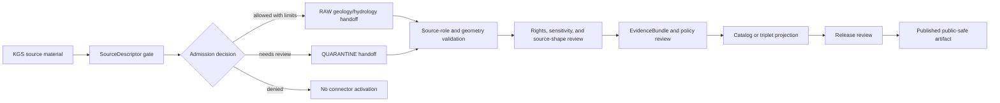

<!-- [KFM_META_BLOCK_V2]
doc_id: kfm://doc/connectors-kgs-readme
title: connectors/kgs/ — KGS Compatibility Connector Lane
type: readme
version: v0.1
status: draft
owners: OWNER_TBD — Connector steward · Kansas source steward · Geology steward · Hydrology steward · Environment steward · Rights reviewer · Sensitivity reviewer · Validation steward · Docs steward
created: 2026-06-19
updated: 2026-06-19
policy_label: public-doctrine; compatibility-lane; noncanonical-path; geology-source; hydrology-source; rights-gated; sensitivity-gated; no-publication
proposed_path: connectors/kgs/README.md
truth_posture: CONFIRMED path exists / NONCANONICAL compatibility README / CANONICAL HOME CONFIRMED AS connectors/kansas/kgs/ BY SOURCE PROFILE
related:
  - ../README.md
  - ../kansas/README.md
  - ../kansas/kgs/README.md
  - ../../docs/sources/catalog/kansas/ksgs.md
  - ../../docs/sources/catalog/kansas/kcc-oil-gas-reg.md
  - ../../docs/sources/catalog/kansas/kdhe.md
  - ../../docs/domains/geology/README.md
  - ../../docs/domains/geology/SOURCES.md
  - ../../docs/domains/hydrology/README.md
  - ../../docs/domains/environment/README.md
  - ../../docs/sources/SOURCE_DESCRIPTOR_STANDARD.md
  - ../../control_plane/source_authority_register.yaml
  - ../../data/registry/sources/
  - ../../data/raw/geology/
  - ../../data/quarantine/geology/
  - ../../data/raw/hydrology/
  - ../../data/quarantine/hydrology/
  - ../../fixtures/
  - ../../schemas/contracts/v1/source/
  - ../../policy/sensitivity/
  - ../../policy/rights/
  - ../../release/
tags: [kfm, connectors, kgs, ksgs, kansas, geology, hydrology, oil-gas, wwc5, las, geoportal, compatibility, authority-source, observed-source, source-admission, raw, quarantine, governance]
notes:
  - "This README fills a previously blank top-level KGS connector path."
  - "The KGS source profile says the correct connector path was already `connectors/kansas/kgs/` under the canonical `connectors/kansas/` family."
  - "This top-level `connectors/kgs/` path is therefore a compatibility lane, not a new canonical authority root."
  - "The source profile preserves a slug discrepancy: source catalog file uses `ksgs.md`, while connector path uses `kgs/`; reconciliation is deferred to OPEN-KSGS-13 or a later ADR/repo convention."
  - "KGS sub-products carry per-descriptor source roles; KGS geology/production source material must not be collapsed into KCC regulatory records or KDHE environmental records."
  - "Connector output may enter RAW or QUARANTINE handoff only; downstream validation, EvidenceBundle closure, rights/sensitivity review, catalog/triplet projection, release review, publication, correction, and rollback remain outside this folder."
[/KFM_META_BLOCK_V2] -->

<a id="top"></a>

# KGS Compatibility Connector Lane

> Compatibility README for the existing top-level `connectors/kgs/` path. This path is **not** the canonical connector home; KGS connector work belongs under `connectors/kansas/kgs/` unless a later ADR or migration decision says otherwise.

<p>
  
  
  
  
  
</p>

> [!IMPORTANT]
> **Status:** compatibility / noncanonical-path README · **Owner:** `OWNER_TBD`  
> **Path:** `connectors/kgs/README.md`  
> **Truth posture:** `CONFIRMED` file exists · `NONCANONICAL` compatibility path · `CONFIRMED` source profile points canonical work to `connectors/kansas/kgs/`  
> **Boundary:** source-admission compatibility only; no public geologic or hydrologic release, no source-role collapse, no direct publication, no rights/sensitivity bypass.

**Quick jumps:** [Scope](#scope) · [Repo fit](#repo-fit) · [Accepted inputs](#accepted-inputs) · [Exclusions](#exclusions) · [Evidence ledger](#evidence-ledger) · [Lifecycle diagram](#lifecycle-diagram) · [Admission posture](#admission-posture) · [Anti-collapse rules](#anti-collapse-rules) · [Validation](#validation) · [Rollback](#rollback) · [Verification backlog](#verification-backlog)

---

## Scope

`connectors/kgs/` is retained here only as a compatibility lane because the path already exists.

The KGS source profile says the canonical connector home was already `connectors/kansas/kgs/`, under the canonical `connectors/kansas/` family. The catalog file uses the preserved `ksgs.md` slug while the connector path uses `kgs/`; that slug discrepancy remains a governance item for ADR or repo-convention review.

This path must not become the canonical KGS connector home unless an ADR or migration decision explicitly changes the source-profile placement.

[Back to top ↑](#top)

---

## Repo fit

| Surface | Role | Status |
|---|---|---:|
| `connectors/kgs/` | Existing top-level compatibility path. | **CONFIRMED path / NONCANONICAL** |
| `connectors/kansas/kgs/` | Canonical KGS adapter home named by source profile. | **CONFIRMED by source profile / NEEDS VERIFICATION implementation depth** |
| `connectors/kansas/` | Canonical Kansas connector-family lane. | **CONFIRMED** |
| `docs/sources/catalog/kansas/ksgs.md` | Human-facing KGS source catalog entry. | **CONFIRMED** |
| `docs/sources/catalog/kansas/kcc-oil-gas-reg.md` | KCC peer source for regulatory oil/gas records. | **CONFIRMED** |
| `control_plane/source_authority_register.yaml` | Machine-readable source authority register. | **Referenced by source profile / NEEDS VERIFICATION current contents** |
| `data/registry/sources/` | SourceDescriptor authority. | **Outside connector / NEEDS VERIFICATION for entries** |
| `data/raw/geology/`, `data/raw/hydrology/` | Candidate RAW handoff targets. | **PROPOSED / NEEDS VERIFICATION** |
| `data/quarantine/geology/`, `data/quarantine/hydrology/` | Candidate quarantine handoff targets. | **PROPOSED / NEEDS VERIFICATION** |
| `policy/rights/` and `policy/sensitivity/` | Rights and sensitivity authority. | **Outside connector** |
| `release/` | Release and publication controls. | **Out of scope for this compatibility lane** |

[Back to top ↑](#top)

---

## Accepted inputs

Accepted content for this noncanonical compatibility path:

- README-level migration and compatibility notes;
- links to the canonical `connectors/kansas/kgs/` path;
- notes that prevent this top-level path from becoming a parallel authority;
- temporary fixture or test notes only if they are explicitly migration-bound;
- adapter notes for KGS source material only if retained here by ADR or migration note;
- quarantine criteria for unresolved rights, source role, sub-product identity, geometry, well/log identity, cadence, endpoint/access method, or source-shape issues.

New implementation code should prefer `connectors/kansas/kgs/` unless an ADR says otherwise.

---

## Exclusions

This folder must not contain or imply authority over:

- canonical connector-family status;
- public release decisions;
- operational engineering, drilling, water-supply, safety, or field-use decisions;
- direct writes to `PROCESSED`, `CATALOG`, `TRIPLET`, `PUBLISHED`, proof, receipt, or release stores;
- SourceDescriptor authority records;
- policy or schema authority;
- generated summaries presented as authoritative geology, hydrocarbon, hydrology, or infrastructure truth;
- source activation without SourceDescriptor, rights, sensitivity, source-role, geometry, provenance, and review checks.

Redirect implementation and source-family authority to `connectors/kansas/kgs/` once verified.

[Back to top ↑](#top)

---

## Evidence ledger

| Source | Status | Supports | Limits |
|---|---:|---|---|
| `connectors/kgs/README.md` | **CONFIRMED** | Target file exists and was blank before this update. | Does not prove implementation files, tests, or CI. |
| `docs/sources/catalog/kansas/ksgs.md` | **CONFIRMED** | KGS source profile says canonical connector path is `connectors/kansas/kgs/`, preserves the `ksgs.md`/`kgs/` slug discrepancy, and identifies KGS as a Kansas-first geology/hydrology source family. | Does not prove current source terms, endpoint stability, activation, or implementation. |
| `connectors/kansas/README.md` | **CONFIRMED** | Kansas connector family is the canonical source-admission lane for Kansas source products. | Does not prove KGS child implementation depth. |
| `connectors/kansas/kgs/` | **NEEDS VERIFICATION** | Named as canonical adapter home by source profile. | Actual files, code, fixtures, tests, and CI remain unverified here. |

---

## Lifecycle diagram



[Back to top ↑](#top)

---

## Admission posture

Expected behavior for KGS source-admission work:

- no live source access unless explicitly enabled and reviewed;
- no source fetch without an accepted SourceDescriptor and activation decision;
- no implicit publication from retrieved source material;
- no operational engineering, drilling, water-supply, safety, or field-use use;
- no collapse of KGS geology/production/well-log/water-well material into KCC regulatory records or KDHE environmental records;
- no loss of source ID, source URI, sub-product identity, source role, well/log/formation or map-unit identity, geometry/uncertainty, date/vintage, license/rights, review, or release-class metadata;
- unclear rights, source role, sub-product identity, geometry, endpoint, cadence, freshness, or schema drift routes to quarantine or abstention.

---

## Anti-collapse rules

The KGS source profile identifies the controlling anti-collapse stack:

1. `connectors/kgs/` is compatibility-only; canonical work belongs under `connectors/kansas/kgs/`.
2. `docs/sources/catalog/kansas/ksgs.md` preserves a catalog slug that differs from the connector path; that discrepancy requires ADR or repo-convention ratification.
3. KGS sub-products must be admitted per SourceDescriptor and source role.
4. KGS geology, wells, production, WWC5, LAS, and Geoportal material must not be collapsed into KCC regulatory records, KDHE environmental records, or generated summaries.
5. Public release is a governed state transition, not a connector output.
6. Derived summaries, maps, tiles, joins, analyses, and AI explanations are downstream carriers, not sovereign truth.

---

## Validation

Compatibility-lane validation should check that:

- this path is not treated as canonical without ADR/migration evidence;
- source metadata is preserved;
- SourceDescriptor references are required for activation;
- source role is explicit and not collapsed across KGS sub-products;
- rights and sensitivity states are explicit before promotion-track use;
- sub-product identity, source URI, well/log/map-unit identity, geometry/uncertainty, date/vintage, access method, review, and release-class fields are explicit where available;
- malformed or incomplete records fail closed;
- records with unresolved rights, sensitivity state, source role, sub-product identity, geometry, or access method route to quarantine;
- connector output is limited to RAW or QUARANTINE handoff;
- no connector run writes directly to processed, catalog, triplet, published, proof, receipt, or release stores.

Root-level validation, policy-as-code, EvidenceBundle closure, release review, public caveats, and rollback remain outside this compatibility lane.

[Back to top ↑](#top)

---

## Definition of done

This compatibility README is ready for first review when:

- [ ] KGS source profile is linked and current enough for review.
- [ ] A migration or ADR decision resolves whether to remove this top-level path, keep it as a redirect, or leave it as a compatibility note.
- [ ] Canonical KGS implementation home is verified as `connectors/kansas/kgs/`.
- [ ] The `ksgs.md` versus `kgs/` slug discrepancy is resolved or explicitly retained by ADR/repo convention.
- [ ] SourceDescriptor homes and KGS sub-product IDs are verified.
- [ ] Rights terms, access methods, cadence, fixture strategy, source-role strategy, and sensitivity checks are verified by source steward review.
- [ ] Live source access is disabled by default for connector code.
- [ ] Source-role, sub-product identity, geometry, rights, sensitivity, and anti-collapse checks are represented in tests.
- [ ] Connector output is limited to RAW or QUARANTINE handoff.
- [ ] No public operational, engineering, safety, hydrology, or geology claims are created by connector code.

---

## Rollback

Rollback is required if this README is used to justify canonical-family status, direct publication, source activation, source-role collapse, rights/sensitivity bypass, public operational claims, or direct writes beyond RAW/QUARANTINE handoff.

Rollback target:

```text
commit prior to this update: SHA_TBD_AFTER_GIT_HISTORY_CHECK
```

Because the file was blank before this update, a safe rollback is to restore the blank placeholder or replace this document with a shorter redirect-only README until canonical placement is resolved.

---

## Verification backlog

| Item | Status | Needed evidence |
|---|---:|---|
| Confirm canonical `connectors/kansas/kgs/` implementation files. | **NEEDS VERIFICATION** | Repo tree or mounted workspace. |
| Confirm whether this top-level path should remain. | **NEEDS VERIFICATION** | ADR or migration decision. |
| Resolve or retain `ksgs.md` versus `kgs/` slug discrepancy. | **NEEDS VERIFICATION** | ADR or repo convention. |
| Confirm SourceDescriptor homes and KGS sub-product IDs. | **NEEDS VERIFICATION** | Source registry entries and accepted schemas. |
| Confirm current access methods, cadence, and terms. | **NEEDS VERIFICATION** | Source steward review and current source documentation. |
| Confirm rights and sensitivity handling. | **NEEDS VERIFICATION** | Rights review, sensitivity review, and policy references. |
| Confirm fixture strategy and CI wiring. | **NEEDS VERIFICATION** | Fixture registry, workflow files, and test logs. |

---

## Maintainer note

Do not build new authority here. This existing top-level path should either stay a clear compatibility pointer or be removed after migration. Implementation should converge under `connectors/kansas/kgs/` unless an ADR says otherwise.

[Back to top ↑](#top)
