<!-- [KFM_META_BLOCK_V2]
doc_id: kfm://doc/connectors-kgs-bedrock-readme
title: connectors/kgs_bedrock/ — KGS Bedrock Compatibility and Migration Lane
type: readme
version: v0.2
status: draft
owners: OWNER_TBD — Connector steward · KGS source steward · Geology steward · Hydrology steward · Rights reviewer · Privacy/sensitivity reviewer · Security reviewer · Validation steward · Docs steward
created: 2026-06-19
updated: 2026-07-13
policy_label: public-doctrine; compatibility-lane; documentation-only; noncanonical-product-path; path-and-slug-conflict; bedrock-geology-source; source-admission; rights-gated; fail-closed; no-activation; no-publication
current_path: connectors/kgs_bedrock/README.md
truth_posture: CONFIRMED current README and named repository probes / NONCANONICAL product compatibility path / CONFLICTED final KGS connector, package, slug, product-dispatch, descriptor, registry, fixture, and test placement / PROPOSED bedrock admission and migration contract / UNKNOWN runtime, source access, rights clearance, activation, CI depth, and owners
evidence_snapshot:
  repository: bartytime4life/Kansas-Frontier-Matrix
  base_ref: main
  base_commit: a05b61a289cf5c87fb9d9173103c6d597a0c459d
  prior_blob: dff2a7073b758960a11e2e7f1e68d9c26d1d610b
related:
  - ../README.md
  - ../kgs/README.md
  - ../ksgs/README.md
  - ../geology/kgs/README.md
  - ../kgs_surficial/README.md
  - ../kgs_oil_gas_wells/README.md
  - ../kgs_kdhe_wwc5/README.md
  - ../kgs_las/README.md
  - ../kansas/README.md
  - ../../CONTRIBUTING.md
  - ../../.github/CODEOWNERS
  - ../../docs/doctrine/directory-rules.md
  - ../../docs/domains/geology/README.md
  - ../../docs/domains/geology/CANONICAL_PATHS.md
  - ../../docs/domains/geology/SOURCES.md
  - ../../docs/domains/geology/DATA_LIFECYCLE.md
  - ../../docs/sources/catalog/kansas/ksgs.md
  - ../../docs/sources/SOURCE_DESCRIPTOR_STANDARD.md
  - ../../contracts/source/source_descriptor.md
  - ../../schemas/contracts/v1/source/source_descriptor.schema.json
  - ../../schemas/contracts/v1/sources/source_descriptor.schema.json
  - ../../control_plane/source_authority_register.yaml
  - ../../data/registry/sources/README.md
  - ../../policy/rights/README.md
  - ../../policy/sensitivity/README.md
  - ../../release/
tags: [kfm, connectors, kgs, ksgs, kansas, bedrock, geology, stratigraphy, map-units, compatibility, migration, path-conflict, source-admission, rights, scale, geometry, uncertainty, raw, quarantine, governance]
notes:
  - "This top-level bedrock path is retained as a compatibility and migration surface. It must not evolve as an independent KGS connector, product registry, schema authority, or publication lane."
  - "Current repository evidence is conflicted: the KGS source catalog proposes `connectors/kansas/kgs/`; the Geology compatibility pointer records source-first doctrine and a `connectors/kgs/` candidate; the live `connectors/ksgs/` path contains a non-operational 0.0.0 scaffold; and this product path is README-only at the named probes."
  - "Bedrock products require product-specific SourceDescriptors, source roles, rights, cadence, geometry, scale, datum, uncertainty, vintage, attribution, fixtures, tests, and activation decisions. Agency identity alone is insufficient."
  - "Bedrock map units and contacts are interpreted representations at a stated scale and vintage. They must not be collapsed into surficial geology, borehole observations, geotechnical advice, legal boundaries, resource estimates, or current field truth."
  - "Only this Markdown file is changed. No code, package metadata, descriptor, registry record, schema, contract, policy, fixture, test, workflow, source activation, path move, receipt, release object, or public artifact is created."
[/KFM_META_BLOCK_V2] -->

<a id="top"></a>

# KGS Bedrock Compatibility and Migration Lane

> [!IMPORTANT]
> **Document lifecycle:** `draft v0.2`  
> **Component maturity:** documentation-only compatibility path; connector runtime `UNKNOWN`  
> **Canonicality:** `NONCANONICAL` product path  
> **Placement posture:** final KGS connector, package, slug, and product-dispatch home `CONFLICTED`  
> **Boundary:** no source activation, network access, lifecycle persistence, public geology claim, operational advice, or release authority.

<p>
  
  
  
  
  
  
  
</p>

`connectors/kgs_bedrock/` exists to keep historical, generated, or external references to a top-level KGS bedrock connector understandable while KFM resolves the KGS path and package conflict. It is not an independent implementation lane merely because the directory exists.

**Quick links:** [Purpose](#purpose) · [Authority](#authority-and-status) · [Verified state](#verified-repository-state) · [Placement conflict](#placement-and-migration-conflict) · [Routing](#routing) · [What belongs here](#what-belongs-here) · [What does not belong here](#what-does-not-belong-here) · [Bedrock meaning](#bedrock-record-and-meaning-boundaries) · [Source-role rules](#source-role-and-anti-collapse-rules) · [Inputs](#inputs) · [Outputs](#outputs) · [Lifecycle](#lifecycle-boundary) · [Validation](#validation) · [Evidence](#evidence-basis) · [Review burden](#review-burden) · [ADRs](#adr-and-migration-triggers) · [Definition of done](#definition-of-done) · [Rollback](#rollback) · [Backlog](#verification-backlog)

---

## Purpose

This README has five responsibilities:

1. mark `connectors/kgs_bedrock/` as a compatibility and migration surface;
2. prevent a product-specific top-level path from becoming a second KGS implementation authority;
3. preserve bedrock-specific source meaning, scale, geometry, uncertainty, vintage, rights, and provenance requirements;
4. route future work toward one accepted KGS connector and product-dispatch topology;
5. fail closed while path, descriptor, registry, rights, activation, and runtime evidence remain unresolved.

This file does not choose the winning KGS path. Current repository evidence supports several incompatible claims:

- the KGS source catalog proposes `connectors/kansas/kgs/`;
- Geology path doctrine is source-first, while the Geology KGS pointer records `connectors/kgs/` as one candidate;
- `connectors/ksgs/` is the only implementation-shaped live scaffold, but it is version `0.0.0`, non-operational, and documented as noncanonical;
- top-level product paths such as this one exist as compatibility READMEs;
- `connectors/geology/kgs/` is explicitly documentation-only and not an implementation home.

The smallest sound change is therefore to preserve this path as a redirect and governance boundary, not to invent a canonical destination.

[Back to top](#top)

---

## Authority and status

| Concern | Status | Evidence-bounded determination |
|---|---:|---|
| Owning responsibility root | **CONFIRMED** | Source-specific retrieval, parsing, source-head preservation, and admission mechanics belong under `connectors/`. |
| This path | **CONFIRMED / NONCANONICAL** | `connectors/kgs_bedrock/README.md` exists. The path is a product compatibility surface, not established connector authority. |
| Runtime below this path | **NOT ESTABLISHED** | Exact probes found no `pyproject.toml`, `src/README.md`, or `tests/README.md` below this folder at the pinned base. Differently named or unindexed files remain `UNKNOWN`. |
| Final KGS connector path | **CONFLICTED** | Current candidates and references include `connectors/kgs/`, `connectors/ksgs/`, proposed `connectors/kansas/kgs/`, and product compatibility paths. |
| KGS distribution/import name | **CONFLICTED** | The live scaffold uses distribution `kfm-connector-ksgs` and import `ksgs`; KFM publisher terminology uses `KGS`; catalog and path slugs disagree. |
| Bedrock product dispatcher home | **NEEDS VERIFICATION** | No accepted ADR or migration plan was verified that places bedrock dispatch under one retained KGS package. |
| Product-level `SourceDescriptor` | **NOT VERIFIED** | No accepted bedrock descriptor, source ID, activation record, or machine authority entry was verified here. |
| Rights and redistribution | **NEEDS VERIFICATION** | Public source availability, attribution language, download access, and reuse terms must be reviewed per product and source version. |
| Sensitivity posture | **FAIL CLOSED** | Bedrock polygons may be broadly public, but associated boreholes, samples, private sites, infrastructure joins, or precise subsurface records require separate review. |
| Public release | **NONE** | This folder cannot publish maps, tiles, APIs, claims, evidence bundles, proofs, or release artifacts. |
| Owners | **UNKNOWN** | Path-specific ownership was not established by current evidence. |

> [!CAUTION]
> A source catalog row, generated folder, package stub, README, public web map, or successful download does not establish canonical placement, source activation, rights clearance, evidence closure, or publication authority.

[Back to top](#top)

---

## Verified repository state

The following state is confirmed at the evidence snapshot recorded in the meta block:

```text
connectors/
├── geology/
│   └── kgs/
│       └── README.md              # documentation-only KGS compatibility pointer
├── kgs/
│   └── README.md                  # top-level KGS compatibility lane
├── ksgs/
│   ├── README.md                  # greenfield scaffold boundary
│   ├── pyproject.toml             # kfm-connector-ksgs, version 0.0.0
│   ├── src/
│   │   └── ksgs/                  # placeholder package surface
│   └── tests/
│       └── README.md              # documentation contract
├── kgs_bedrock/
│   └── README.md                  # this product compatibility lane
├── kgs_surficial/
│   └── README.md                  # related product compatibility lane
├── kgs_oil_gas_wells/
│   └── README.md                  # related product compatibility lane
├── kgs_kdhe_wwc5/
│   └── README.md                  # related joint-program compatibility lane
└── kgs_las/
    └── README.md                  # related product compatibility lane
```

The KGS source catalog proposes this path:

```text
connectors/kansas/kgs/
```

The current inspected documentation reports that proposed child as absent. No accepted path-specific ADR was verified that reconciles the catalog proposal, Geology source-first path doctrine, the live `ksgs` scaffold, and the product compatibility paths.

Exact named probes for this path returned `Not Found`:

```text
connectors/kgs_bedrock/pyproject.toml
connectors/kgs_bedrock/src/README.md
connectors/kgs_bedrock/tests/README.md
```

These are bounded absence statements. They do not prove that no differently named, unindexed, or later-added file exists.

[Back to top](#top)

---

## Placement and migration conflict

The final KGS topology must be resolved before executable bedrock work is added.

| Candidate surface | Current posture | Safe use now |
|---|---:|---|
| `connectors/kgs_bedrock/` | **NONCANONICAL product compatibility path** | Redirects, migration notes, deprecation state, and bedrock-specific guardrails only. |
| `connectors/kgs/` | **COMPATIBILITY / claimed candidate** | Do not treat as canonical without accepted reconciliation. |
| `connectors/ksgs/` | **LIVE 0.0.0 SCAFFOLD / NONCANONICAL** | Preserve fail-closed placeholder state; do not infer supported runtime behavior. |
| `connectors/kansas/kgs/` | **PROPOSED BY CATALOG / ABSENT IN INSPECTED STATE** | Do not claim current implementation or create a parallel package without migration authority. |
| `connectors/geology/kgs/` | **DOCUMENTATION-ONLY / FORBIDDEN IMPLEMENTATION HOME** | Domain routing and compatibility explanation only. |
| One future accepted KGS package | **PROPOSED** | May host product dispatch only after path, package, descriptor, tests, and migration decisions are accepted. |

A migration decision must cover at least:

- canonical connector path;
- distribution and import name;
- publisher and product source IDs;
- product-dispatch boundaries;
- compatibility aliases and sunset dates;
- SourceDescriptor and activation references;
- fixture and test homes;
- credentials and no-network defaults;
- receipts and provenance continuity;
- backlinks and documentation updates;
- deprecation, correction, and rollback.

Presence is not authority. Convenience is not an ADR.

[Back to top](#top)

---

## Routing

Until the path conflict is resolved:

| Need | Route |
|---|---|
| KGS publisher and product orientation | [`docs/sources/catalog/kansas/ksgs.md`](../../docs/sources/catalog/kansas/ksgs.md) |
| Geology domain meaning | [`docs/domains/geology/README.md`](../../docs/domains/geology/README.md) |
| Geology placement doctrine | [`docs/domains/geology/CANONICAL_PATHS.md`](../../docs/domains/geology/CANONICAL_PATHS.md) |
| Current KGS scaffold evidence | [`connectors/ksgs/README.md`](../ksgs/README.md) |
| KGS path-conflict overview | [`connectors/geology/kgs/README.md`](../geology/kgs/README.md) |
| Top-level KGS compatibility note | [`connectors/kgs/README.md`](../kgs/README.md) |
| Bedrock-specific compatibility guidance | This README |
| Source identity and product admission | Governing source registry and control-plane surfaces |
| Contracts and machine schemas | Governing `contracts/` and `schemas/` roots |
| Rights and sensitivity decisions | Governing `policy/rights/` and `policy/sensitivity/` roots |
| Lifecycle persistence and publication | Orchestration, data lifecycle, evidence, proof, and `release/` owners |

Do not add executable code here merely because a future canonical destination is unresolved.

[Back to top](#top)

---

## What belongs here

This compatibility path may contain only narrowly bounded material such as:

- this README;
- links to the current KGS scaffold, catalog, domain, and path-conflict documents;
- explicit migration, deprecation, redirect, and sunset notes;
- a compatibility adapter only when an accepted ADR or migration plan names its owner, behavior, tests, warning surface, sunset condition, and rollback;
- bedrock-specific preservation requirements for product identity, map units, stratigraphy, geometry, scale, uncertainty, vintage, rights, attribution, and source role;
- quarantine criteria for ambiguous or incomplete bedrock records;
- documentation of negative states such as `not-activated`, `descriptor-missing`, `rights-unknown`, `scale-unsupported`, `geometry-invalid`, or `source-head-unresolved`.

No item in this list proves that implementation exists or that a source may be contacted.

## What does not belong here

This folder must not contain or imply authority over:

- an independent KGS client, parser, downloader, crawler, service, or package;
- a second product registry or source-authority register;
- SourceDescriptor instances, source activation decisions, or role-vocabulary authority;
- canonical contracts, schemas, policies, release objects, or evidence objects;
- bulk KGS downloads, production map caches, tile archives, database dumps, borehole collections, well logs, or real source payload corpora;
- credentials, API keys, cookies, authorization headers, private URLs, or account details;
- direct writes to `RAW`, `WORK`, `QUARANTINE`, `PROCESSED`, `CATALOG`, `TRIPLET`, `PUBLISHED`, proof, receipt, or release stores;
- public bedrock layers, tiles, APIs, dashboards, summaries, or AI answers;
- geotechnical, drilling, excavation, engineering, groundwater, resource, safety, or hazard advice;
- public exact locations for sensitive boreholes, samples, private sites, protected resources, or harmful infrastructure joins;
- generated text presented as KGS, stratigraphic, map-unit, or field truth.

A connector can prepare a caller-owned candidate. It cannot select a lifecycle sink, close evidence, approve release, or create authoritative public truth.

[Back to top](#top)

---

## Bedrock record and meaning boundaries

A bedrock source record is not meaningful without its representation context.

| Meaning dimension | Required preservation |
|---|---|
| Publisher and product | Exact publisher, source product, edition, layer, service, archive, or map-series identity. |
| Map-unit identity | Source-native unit code, label, name, description, hierarchy, and crosswalk status. |
| Stratigraphy | Formation, member, group, age, lithology, correlation, and nomenclatural authority where supplied. |
| Feature type | Polygon, contact, fault, fold, point, annotation, legend entry, raster class, or other source-native type. |
| Observation character | Distinguish mapped observation, interpretation, compilation, inference, model, generalized representation, and derived product. |
| Scale and resolution | Nominal map scale, source resolution, minimum mapping unit, generalization, and fitness-for-use limits. |
| Geometry | Source CRS, datum, coordinate precision, topology, geometry type, clipping, simplification, and transformation lineage. |
| Uncertainty | Positional, classification, temporal, interpretive, and crosswalk uncertainty where material. |
| Time | Publication date, edition, source vintage, revision, retrieval time, correction, withdrawal, and supersession context. |
| Rights and attribution | License or terms, required attribution, redistribution limits, derivative-use limits, and access constraints. |
| Provenance | Source URI or file identity, checksum or source-head signal, retrieval method, run identity, and transformation chain. |
| Release posture | Internal candidate, quarantine, reviewed derivative, restricted, generalized, or released public-safe state. |

A bedrock map is a representation made at a scale and time. It is not a parcel survey, excavation guarantee, site investigation, subsurface certainty statement, or automatically current field condition.

[Back to top](#top)

---

## Source-role and anti-collapse rules

The bedrock lane must preserve these distinctions:

1. **Bedrock versus surficial geology.** Bedrock units must not be silently merged with unconsolidated surficial deposits.
2. **Mapped unit versus borehole observation.** A polygon interpretation is not a measured core, log, sample, or well observation.
3. **Observation versus interpretation.** Contacts, faults, ages, and unit boundaries may be observed, inferred, concealed, approximate, or compiled; preserve the source character.
4. **Publisher authority versus KFM release authority.** KGS authorship may establish source authority for a product; it does not grant KFM publication approval.
5. **KGS versus KCC.** Geologic or production data must not be reinterpreted as regulatory findings, permits, compliance status, or legal determinations.
6. **Bedrock geology versus hazards.** Faults, karst, mines, subsidence, or seismic context may inform hazards, but the bedrock connector does not issue hazard guidance.
7. **Bedrock geology versus resources.** Geologic occurrence or lithology is not a reserve estimate, ownership claim, economic viability determination, or extraction authorization.
8. **Source map versus derived map.** Reprojection, simplification, crosswalks, generalized tiles, and summaries are downstream derivatives and require provenance and release review.
9. **Current path versus canonical path.** This folder's existence does not make it the accepted KGS implementation home.
10. **Generated language versus evidence.** AI summaries remain interpretive carriers and must resolve to released evidence or abstain.

Mixed-role or ambiguous records should be split, preserved with explicit role metadata, or routed to quarantine. Do not choose a role for convenience.

[Back to top](#top)

---

## Inputs

A future retained KGS implementation may process bedrock material only after the following inputs are resolved through the accepted package and governing roots:

| Input | Required posture |
|---|---|
| Product identity | Exact bedrock product, layer, map series, edition, service, archive, or snapshot. Agency name alone is insufficient. |
| SourceDescriptor reference | Accepted descriptor for the exact product and version. |
| Activation state | Explicit fixture-only, restricted, manual-snapshot, or live operation decision. |
| Access method | Reviewed URL, file, archive, API, service, or manual acquisition procedure. |
| Source head | Version, release date, checksum, `ETag`, `Last-Modified`, item ID, or other reproducible signal. |
| Role mapping | Accepted machine role plus preserved human meaning. Ambiguous mixed roles fail closed. |
| Rights state | Current terms, attribution, redistribution, derivative-use, access, and retention limits. |
| Sensitivity state | Dataset- and record-level constraints, including precise subsurface or private-site records. |
| Spatial context | CRS, datum, scale, geometry, precision, topology, generalization, and uncertainty. |
| Temporal context | Publication, edition, valid/effective, retrieval, correction, withdrawal, and supersession times as applicable. |
| Fixture posture | Synthetic, minimized, redacted, generalized, or explicitly rights-cleared no-network fixture. |
| Caller-owned handoff | Explicit interfaces for candidate bytes, parsed records, validation findings, and finite admission outcomes. |

Exact DTO names, field names, machine enums, and command interfaces remain **PROPOSED / NEEDS VERIFICATION**.

[Back to top](#top)

---

## Outputs

This path currently emits nothing.

A future accepted KGS package may return only caller-owned, in-memory or explicitly handed-off candidates such as:

- retrieved bytes plus source-head metadata;
- parsed source-native records;
- validation findings;
- a proposed bedrock candidate envelope;
- deterministic finite outcomes;
- receipt candidates that conform to an accepted contract.

Recommended finite outcomes:

| Outcome | Meaning |
|---|---|
| `admit-candidate` | Product and record passed connector-local checks; downstream admission is still required. |
| `hold/quarantine-candidate` | Material is preserved but unresolved rights, role, geometry, scale, identity, or sensitivity blocks use. |
| `deny` | Policy, terms, product identity, or source posture forbids the operation. |
| `abstain` | Evidence is insufficient to classify safely. |
| `no-op` | Source head matches the accepted retained state and no new candidate is needed. |
| `rate-limit` | Upstream or local controls require bounded retry outside this execution. |
| `error` | Transport, parsing, validation, integrity, or configuration failed. |

A connector outcome is not a promotion decision. Persistence, evidence closure, catalog projection, release, correction, and rollback remain downstream.

[Back to top](#top)

---

## Lifecycle boundary

```mermaid
flowchart LR
    A[KGS bedrock product] --> B{Accepted product descriptor<br/>and activation?}
    B -->|No| D[DENY or ABSTAIN]
    B -->|Yes| C[Explicit source access or fixture]
    C --> E[Preserve source head, bytes, rights,<br/>scale, geometry, role, and time]
    E --> F{Connector-local validation}
    F -->|Incomplete or unsafe| Q[QUARANTINE candidate]
    F -->|Pass| R[RAW candidate]
    R --> O[Caller-owned orchestration]
    Q --> O
    O --> V[Downstream validation and policy]
    V --> EB[EvidenceBundle closure]
    EB --> CP[Catalog or triplet projection]
    CP --> RR[Release review]
    RR --> P[Published public-safe derivative]

    classDef blocked fill:#f8d7da,stroke:#842029,color:#000;
    classDef candidate fill:#fff3cd,stroke:#664d03,color:#000;
    classDef governed fill:#d1e7dd,stroke:#0f5132,color:#000;
    class D,Q,R blocked;
    class C,E,F,O candidate;
    class V,EB,CP,RR,P governed;
```



This README does not authorize any arrow in the diagram. It documents the required separation of duties.

[Back to top](#top)

---

## Rights, sensitivity, scale, and geometry posture

- Rights and attribution must be reviewed for the exact bedrock product and version. Do not infer terms from another KGS product.
- Public web access does not prove bulk-download, redistribution, derivative, archival, or commercial-use permission.
- Preserve source attribution through every derivative and release object.
- Map scale is part of the claim. Do not imply site-level precision from regional or statewide mapping.
- Preserve source geometry and transformation lineage. Reprojection and simplification must be deterministic and reviewable.
- Keep source-native topology findings separate from downstream repair or generalization.
- Associated boreholes, samples, wells, private lands, protected resources, and sensitive infrastructure joins may require restriction or generalization even when a bedrock layer is public.
- Exact source geometry must not be exposed merely because a public-safe derivative exists.
- Unsupported scale, CRS, datum, geometry, or uncertainty must produce quarantine or abstention rather than silent coercion.

[Back to top](#top)

---

## Validation

README-level and future connector validation should require:

### Placement and authority

- this path remains compatibility-only unless an accepted ADR or migration record changes it;
- one KGS connector package and one product-dispatch authority are selected;
- no parallel SourceDescriptor, registry, schema, policy, fixture, test, or release authority forms here;
- compatibility references point toward the accepted lane and carry deprecation or sunset state.

### Product and provenance

- exact publisher, product, edition, layer, service, or snapshot identity;
- reproducible source-head evidence;
- preserved source URI or file identity;
- retrieval time, run identity, checksum, and transformation lineage;
- no network access on import, installation, default tests, or documentation rendering.

### Bedrock semantics

- source-native map-unit and stratigraphic identities are preserved;
- bedrock and surficial products remain distinct;
- observed, interpreted, inferred, generalized, and derived features remain distinguishable;
- scale, CRS, datum, geometry, precision, topology, and uncertainty are explicit;
- source vintage, revision, correction, withdrawal, and supersession context are retained.

### Rights and safety

- rights, attribution, redistribution, derivative-use, and access states are explicit;
- sensitive associated records fail closed;
- fixtures contain no credentials, private requests, harmful exact locations, or unreviewed production payloads;
- operational, engineering, drilling, excavation, hazard, groundwater, or resource claims are prohibited.

### Lifecycle

- allowed output is a caller-owned candidate or finite outcome;
- connector code does not choose lifecycle destinations;
- no direct write occurs to processed, catalog, triplet, proof, release, or published surfaces;
- no public claim appears without EvidenceBundle closure, policy review, release state, correction path, and rollback target.

No current executable test result is claimed for this compatibility path.

[Back to top](#top)

---

## Evidence basis

| Evidence | Status | Supports | Does not prove |
|---|---:|---|---|
| `connectors/kgs_bedrock/README.md` prior blob | **CONFIRMED** | Target existed as v0.1 compatibility documentation. | Runtime, fixtures, tests, activation, or publication. |
| Named probes below `connectors/kgs_bedrock/` | **CONFIRMED bounded absence** | No `pyproject.toml`, `src/README.md`, or `tests/README.md` at the pinned base. | Absence of every possible differently named file. |
| `connectors/ksgs/README.md` | **CONFIRMED** | Live `0.0.0` scaffold, placeholder package state, TODO-only workflow concerns, and unresolved path/package/schema/registry authority. | Supported connector behavior or canonicality. |
| `connectors/geology/kgs/README.md` | **CONFIRMED** | Domain-scoped path is documentation-only; final KGS path is conflicted; product paths are compatibility surfaces. | Accepted migration destination. |
| `docs/sources/catalog/kansas/ksgs.md` | **CONFIRMED catalog doctrine** | Publisher and product families; proposed `connectors/kansas/kgs/`; preserved `ksgs.md`/`kgs/` discrepancy; per-product source roles. | Current path presence, activation, rights, endpoint stability, or runtime. |
| `docs/domains/geology/CANONICAL_PATHS.md` | **CONFIRMED doctrine-adjacent** | Responsibility-root and source-first placement discipline; lifecycle and schema-home boundaries. | Resolution of the current KGS path conflict. |
| Directory Rules | **CONFIRMED doctrine** | Placement by responsibility root, no parallel authority, ADR and drift discipline. | Which current KGS candidate should win without repository and ADR reconciliation. |
| Geology architecture corpus | **CONFIRMED design lineage / PROPOSED implementation** | Bedrock object, source-role, public-safe geometry, evidence, validation, and release boundaries. | Current implementation depth or source activation. |

Where documents conflict, this README records the conflict and narrows behavior. It does not silently promote one draft document into repository authority.

[Back to top](#top)

---

## Review burden

A future implementation or migration review must include, at minimum:

| Reviewer role | Required review |
|---|---|
| Connector steward | Package, path, transport, no-network defaults, finite outcomes, and migration mechanics. |
| KGS source steward | Product identity, source head, access method, cadence, publisher meaning, and attribution. |
| Geology steward | Bedrock semantics, unit identity, stratigraphy, scale, geometry, uncertainty, and cross-domain boundaries. |
| Rights reviewer | Terms, redistribution, derivative use, retention, and attribution. |
| Privacy/sensitivity reviewer | Sensitive associated records, exact locations, private sites, harmful joins, and fixture safety. |
| Security reviewer | Credentials, URL handling, archive safety, decompression limits, SSRF/path traversal, and logging. |
| Validation steward | Offline fixtures, deterministic checks, failure cases, replay, and CI command coverage. |
| Docs steward | Path language, truth labels, links, migration notes, changelog, and rollback clarity. |

Separation of duties should increase before source activation or public release. The author of a connector change should not unilaterally approve rights, sensitivity, evidence closure, and release.

[Back to top](#top)

---

## ADR and migration triggers

An accepted ADR or equivalent governed migration record is required before:

- choosing one canonical KGS connector path from the current candidates;
- changing the `KGS`/`KSGS` distribution, import, publisher, or source-ID convention;
- moving product compatibility paths into or beneath a retained package;
- creating aliases that could become permanent parallel APIs;
- creating a second schema, descriptor, registry, policy, fixture, test, receipt, or release home;
- activating network access or a live source;
- changing lifecycle ownership;
- treating this top-level product path as implementation-bearing.

The decision record should name alternatives, consequences, compatibility window, migration order, validation, rollback, and documentation updates.

[Back to top](#top)

---

## Definition of done

This compatibility README is ready to leave draft only when:

- [ ] The final KGS connector path and package/import identity are accepted.
- [ ] The `KGS` versus `KSGS` slug and source-ID policy is resolved or explicitly retained.
- [ ] The bedrock product dispatcher home is accepted.
- [ ] This path's future is recorded as redirect-only, migration adapter, deprecated path, or removed path.
- [ ] Product-specific bedrock SourceDescriptor records and activation states are accepted.
- [ ] Current access methods, source heads, cadence, rights, attribution, and redistribution terms are verified.
- [ ] Bedrock scale, unit, stratigraphic, geometry, datum, uncertainty, and temporal preservation rules are represented in contracts or tests.
- [ ] No-network, parser, integrity, archive-safety, fixture, negative-case, and finite-outcome tests are executable.
- [ ] CI runs substantive commands rather than TODO placeholders.
- [ ] Sensitive associated records and fixtures have reviewed fail-closed handling.
- [ ] Connector output is caller-owned and cannot bypass lifecycle orchestration.
- [ ] No public geology, hazard, engineering, drilling, excavation, groundwater, or resource claim is created by connector code.
- [ ] Migration, deprecation, correction, and rollback paths are tested and documented.

Until then, the correct posture is documentation-only compatibility with no activation.

[Back to top](#top)

---

## Rollback

Rollback this README if it is used to justify:

- canonical KGS path status;
- an independent bedrock package;
- source activation;
- unreviewed network access;
- direct lifecycle writes;
- rights or sensitivity bypass;
- source-role collapse;
- unsupported scale or geometry claims;
- operational or public geology advice;
- release without evidence and rollback.

Repository rollback target:

```text
base commit: a05b61a289cf5c87fb9d9173103c6d597a0c459d
prior blob:  dff2a7073b758960a11e2e7f1e68d9c26d1d610b
```

Restoring the prior blob reverses this documentation change. It does not resolve the underlying path conflict.

[Back to top](#top)

---

## Verification backlog

| Item | Status | Needed evidence |
|---|---:|---|
| Select the final KGS connector path. | **CONFLICTED** | Accepted ADR or migration record reconciling catalog, Geology doctrine, live scaffold, and compatibility paths. |
| Resolve `KGS` versus `KSGS` slug, distribution, import, and source IDs. | **CONFLICTED** | Namespace decision, migration inventory, compatibility policy, and tests. |
| Decide the future of `connectors/kgs_bedrock/`. | **NEEDS VERIFICATION** | Redirect, deprecation, migration-adapter, or removal decision. |
| Verify bedrock product identities and source IDs. | **NEEDS VERIFICATION** | Product inventory and accepted SourceDescriptors. |
| Verify current access methods and source heads. | **NEEDS VERIFICATION** | Source steward review and reproducible source metadata. |
| Verify rights, terms, and attribution. | **NEEDS VERIFICATION** | Product-specific current terms and rights review. |
| Verify scale and fitness-for-use limits. | **NEEDS VERIFICATION** | Source metadata, map-series documentation, and Geology steward review. |
| Verify geometry, CRS, datum, topology, and uncertainty handling. | **NEEDS VERIFICATION** | Fixtures, parser behavior, transformations, and tests. |
| Verify bedrock versus surficial and observation-versus-interpretation handling. | **NEEDS VERIFICATION** | Product models, source-role policy, and negative fixtures. |
| Verify fixture home and safety. | **NEEDS VERIFICATION** | Accepted path, rights-cleared or synthetic fixtures, and sensitivity review. |
| Verify executable connector tests. | **UNKNOWN / NOT FOUND HERE** | Test inventory and observed runner output. |
| Replace TODO-only connector CI with substantive checks. | **NEEDS VERIFICATION** | Workflow changes and observed passing runs. |
| Verify source-authority and activation records. | **NOT ESTABLISHED** | Machine registry entries and governed activation decisions. |
| Verify owners and reviewers. | **UNKNOWN** | CODEOWNERS or accepted ownership record. |
| Verify correction, withdrawal, supersession, and rollback behavior. | **NEEDS VERIFICATION** | Contracts, fixtures, tests, receipts, and release drills. |

[Back to top](#top)

---

## Maintainer note

This README is intentionally stricter than a product overview. Its purpose is to prevent a plausible-looking bedrock connector path from accumulating code, source authority, or publication meaning before KFM resolves the KGS naming and placement conflict.

The next smallest safe change is not to add a downloader here. It is to accept one KGS connector and product-dispatch migration decision, then update the affected compatibility READMEs, descriptors, tests, and rollback references together.

[Back to top](#top)
