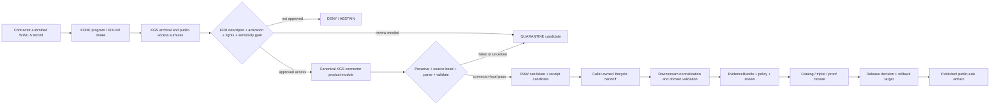

<!-- [KFM_META_BLOCK_V2]
doc_id: kfm://doc/connectors-kgs-kdhe-wwc5-readme
title: connectors/kgs_kdhe_wwc5/ — KGS/KDHE WWC5 Product Compatibility and Admission Boundary
type: readme
version: v0.2
status: draft
owners: OWNER_TBD — Connector steward · KGS source steward · KDHE Water Well Program steward · Geology steward · Hydrology steward · Rights reviewer · Privacy/sensitivity reviewer · Security reviewer · Validation steward · Docs steward
created: 2026-06-19
updated: 2026-07-13
policy_label: public-doctrine; compatibility-product-lane; readme-only; noncanonical-path; path-and-slug-conflict; joint-program-source; raw-unverified-records; private-well-sensitive; no-network; no-activation; no-publication
current_path: connectors/kgs_kdhe_wwc5/README.md
truth_posture: CONFIRMED README-only path at named probes, current official WWC5 public surfaces, continuous upstream additions, July 10 2026 archive snapshot, raw/unverified disclaimer, and empty source-authority register / CONFLICTED final KGS connector path, package slug, SourceDescriptor schema authority, product descriptor role, and migration topology / PROPOSED fail-closed product-admission boundary / UNKNOWN executable connector, activation, source terms clearance, fixtures, tests, CI, runtime, release, and owners
evidence_snapshot:
  repository: bartytime4life/Kansas-Frontier-Matrix
  base_ref: main
  base_commit: a05b61a289cf5c87fb9d9173103c6d597a0c459d
  prior_blob: e460c0940dd30b2b169e7ff32373a04d0b2a5e07
  readme_introduction_commit: 2ce79b2117e30d577be15d5ebb0be3bad30eec2c
external_snapshot:
  observed_at: 2026-07-13
  statewide_archive_vintage: 2026-07-10
  official_surfaces:
    - https://www.kgs.ku.edu/Magellan/WaterWell/index.html
    - https://www.kgs.ku.edu/Magellan/WaterWell/file_format.html
    - https://www.kgs.ku.edu/Magellan/WaterWell/wwc5_fgdc.html
    - https://www.kgs.ku.edu/Magellan/WaterWell/disclaim.html
    - https://maps.kgs.ku.edu/wwc5/index.html?t=wwc5
    - https://www.kdhe.ks.gov/347/Water-Well-Program
related:
  - ../README.md
  - ../kansas/README.md
  - ../kgs/README.md
  - ../ksgs/README.md
  - ../geology/kgs/README.md
  - ../kgs_surficial/README.md
  - ../kgs_bedrock/README.md
  - ../kgs_oil_gas_wells/README.md
  - ../kgs_las/README.md
  - ../../docs/doctrine/directory-rules.md
  - ../../docs/sources/catalog/kansas/ksgs.md
  - ../../docs/domains/geology/README.md
  - ../../docs/domains/geology/SOURCES.md
  - ../../docs/domains/hydrology/README.md
  - ../../contracts/source/source_descriptor.md
  - ../../schemas/contracts/v1/source/source_descriptor.schema.json
  - ../../schemas/contracts/v1/sources/source_descriptor.schema.json
  - ../../control_plane/source_authority_register.yaml
  - ../../data/registry/sources/
  - ../../policy/rights/
  - ../../policy/sensitivity/
  - ../../release/
tags: [kfm, connectors, kgs, kdhe, wwc5, water-well, kansas, geology, hydrology, groundwater, well-completion, plss, nad27, nad83, privacy, sensitivity, source-admission, raw, quarantine, compatibility, governance]
notes:
  - "Current named-path inspection confirms this folder's README, while pyproject.toml, src/README.md, src/kgs_kdhe_wwc5/README.md, tests/README.md, and descriptor.yaml were not found. This is a bounded absence statement, not a complete recursive tree proof."
  - "Canonical placement is unresolved: connectors/kgs/ is README-only compatibility; connectors/ksgs/ is a non-operational 0.0.0 scaffold; connectors/geology/kgs/ is a compatibility pointer; and the catalog-proposed connectors/kansas/kgs/ README is absent."
  - "The official KGS WWC5 page states that data are added continuously and offered through query, map, and downloadable archive surfaces. The statewide archives visible on 2026-07-13 were dated 2026-07-10."
  - "WWC5 data originate from contractor-submitted forms administered by KDHE and archived for public access by KGS. Official metadata describes the database as raw and unverified, with limited quality control and no water-quality data."
  - "Only this Markdown file is in scope. No connector code, descriptor, registry entry, schema, contract, policy, fixture, test, workflow, source activation, lifecycle write, release object, or public artifact is created."
[/KFM_META_BLOCK_V2] -->

<a id="top"></a>

# KGS/KDHE WWC5 Product Compatibility and Admission Boundary

> [!IMPORTANT]
> **Document lifecycle:** `draft v0.2`  
> **Component maturity:** repository-present README only; no supported client, parser, package, descriptor, fixture suite, tests, workflow, activation, lifecycle handoff, or public output  
> **Path posture:** this top-level product path is compatibility-only; the final KGS connector and WWC5 product-module home are `CONFLICTED`  
> **Authority:** documentation for a source-admission boundary only; no source, schema, policy, evidence, lifecycle, release, operational-water, or publication authority.

> [!WARNING]
> WWC5 is not a verified groundwater-truth database. Official KGS metadata describes it as raw, unverified contractor-submitted information; it contains no water-quality data, and most quality control is limited to checking whether the submitted PLSS description falls within the named county. A public upstream record is not automatically safe, current, precise, or admissible for a KFM claim.

<p>
  
  
  
  
  
  
  
  
</p>

**Quick links:** [Purpose](#purpose) · [Authority](#authority-level) · [Current state](#current-repository-state) · [Placement conflict](#placement-package-and-slug-conflict) · [Official source snapshot](#official-source-chain-and-current-snapshot) · [Product boundaries](#wwc5-product-and-source-role-boundaries) · [Field semantics](#field-temporal-and-spatial-semantics) · [Privacy and sensitivity](#privacy-rights-and-sensitivity) · [Inputs and outputs](#inputs-and-outputs) · [Access posture](#access-network-and-archive-posture) · [Finite outcomes](#finite-outcomes-and-reason-codes) · [Lifecycle](#lifecycle-and-publication-boundary) · [Validation](#validation-and-fixture-contract) · [Evidence](#evidence-basis) · [Migration](#migration-adr-and-deprecation) · [Definition of done](#definition-of-done) · [Rollback](#rollback) · [Backlog](#verification-backlog)

---

## Purpose

`connectors/kgs_kdhe_wwc5/` documents the repository's existing top-level WWC5 product path while preventing that path from becoming an accidental second KGS package, a parallel source registry, a water-well truth store, or a publication shortcut.

Its current responsibilities are to:

- preserve the joint KGS/KDHE source chain and the contractor-submitted nature of WWC-5 records;
- record the current repository and upstream evidence boundary;
- keep source role, disclaimer, time, coordinate origin, datum, uncertainty, privacy, rights, and sensitivity visible;
- separate source-native completion records, KGS-entered lithology, KGS-interpreted lithology, scanned forms, map views, and downstream KFM derivatives;
- define a no-network, fail-closed admission posture for any future implementation;
- expose the unresolved path, package, descriptor, registry, fixture, test, and migration decisions;
- prevent one-time completion values from becoming current groundwater conditions, well status, water quality, or engineering advice.

This directory does not prove that the path is canonical, that an executable WWC5 connector exists, that KGS or KDHE terms permit redistribution, that exact private-well data are safe to expose, or that any WWC5-derived claim is released.

[Back to top](#top)

---

## Authority level

| Concern | Status | Evidence-bounded determination |
|---|---:|---|
| Owning responsibility root | **CONFIRMED** | Source-specific fetch, preservation, parsing, source-head capture, and admission mechanics belong under `connectors/`. |
| Current product path | **CONFIRMED** | This README exists at `connectors/kgs_kdhe_wwc5/README.md`. |
| Current implementation here | **ABSENT AT NAMED PROBES / OTHERWISE UNKNOWN** | No package metadata, source-layout README, package README, test README, or local descriptor was found at the exact conventional paths inspected. |
| Final KGS connector path | **CONFLICTED** | Repository surfaces disagree among `connectors/kgs/`, `connectors/ksgs/`, `connectors/geology/kgs/`, proposed-but-absent `connectors/kansas/kgs/`, and top-level product paths. |
| WWC5 module placement | **NEEDS VERIFICATION** | It may become a product module within one accepted KGS connector, or remain a redirect-only compatibility path. An ADR or migration decision must choose. |
| SourceDescriptor authority | **CONFLICTED / NOT ESTABLISHED** | The populated singular schema points to a plural canonical path, while the plural schema is an empty permissive scaffold; the machine authority register has `entries: []`. |
| Source activation | **DENIED / NOT VERIFIED** | No reviewed WWC5 descriptor, rights decision, sensitivity decision, access approval, source-head policy, or activation decision was verified. |
| Upstream source role | **PER PRODUCT / UNRESOLVED** | Contractor-submitted forms, archived records, KGS-calculated coordinates, KGS-entered lithology, interpreted logs, scanned forms, and delivery views must not share one undifferentiated role. |
| Public output | **NONE** | This folder emits no API payload, map layer, EvidenceBundle, proof, release, publication, or operational conclusion. |

Editing this README does not ratify the current path, the `KGS`/`kgs`/`ksgs` naming choice, a product source role, a rights posture, a sensitivity tier, or an activation state.

[Back to top](#top)

---

## Current repository state

### Bounded snapshot

```text
connectors/
├── kgs_kdhe_wwc5/
│   └── README.md                         # this compatibility boundary
├── kgs/
│   └── README.md                         # top-level compatibility README
├── ksgs/
│   ├── README.md                         # 0.0.0 greenfield scaffold boundary
│   ├── pyproject.toml                    # distribution scaffold
│   ├── src/ksgs/                         # placeholder package
│   └── tests/README.md                   # documentation-only test boundary
├── geology/kgs/
│   └── README.md                         # domain-scoped compatibility pointer
└── kansas/
    └── README.md                         # Kansas family coordination; KGS child absent
```

The following exact target-path probes returned `Not Found` at the pinned base:

```text
connectors/kgs_kdhe_wwc5/pyproject.toml
connectors/kgs_kdhe_wwc5/src/README.md
connectors/kgs_kdhe_wwc5/src/kgs_kdhe_wwc5/README.md
connectors/kgs_kdhe_wwc5/tests/README.md
connectors/kgs_kdhe_wwc5/descriptor.yaml
connectors/kansas/kgs/README.md
docs/sources/catalog/kansas/kdhe.md
```

These are bounded absence statements for named paths. They do not prove a complete recursive inventory or rule out differently named, unindexed, generated, or future files.

| Surface | Confirmed state | Safe conclusion |
|---|---|---:|
| This folder | README at named probes | **DOCUMENTATION-ONLY / NONCANONICAL** |
| `connectors/kgs/` | Compatibility README | **NO IMPLEMENTATION EVIDENCE** |
| `connectors/ksgs/` | `0.0.0` placeholder scaffold with unresolved descriptor and TODO-only CI posture documented by its README | **NON-OPERATIONAL** |
| `connectors/geology/kgs/` | README-only compatibility pointer | **NOT AN IMPLEMENTATION HOME** |
| `connectors/kansas/kgs/` | Proposed in older catalog guidance, absent at direct README probe | **PROPOSED / NOT PRESENT** |
| Source authority register | `entries: []` | **NO MACHINE WWC5 AUTHORITY RECORD** |
| Singular SourceDescriptor schema | Rich populated schema that self-identifies as legacy | **IMPLEMENTATION-SHAPED / AUTHORITY CONFLICT** |
| Plural SourceDescriptor schema | Empty permissive scaffold | **NOT SAFE FOR WWC5 ACTIVATION** |

[Back to top](#top)

---

## Placement, package, and slug conflict

The responsibility root is settled; the child topology is not.

> **CONFIRMED placement rule:** WWC5 source-access mechanics belong somewhere under `connectors/`, not under a domain truth root, schema root, policy root, registry root, lifecycle-data root, or release root.

> **UNRESOLVED implementation decision:** the repository has not established which source-first KGS package owns WWC5 product dispatch.

| Candidate surface | Current evidence | Safe posture |
|---|---|---|
| `connectors/kgs_kdhe_wwc5/` | README-only product compatibility path | Do not add a separate package or activate source access here without an accepted migration. |
| `connectors/kgs/` | README labels itself compatibility-only | Do not treat as canonical merely because the slug matches KGS. |
| `connectors/ksgs/` | Live `0.0.0` placeholder scaffold | Do not treat package shape as authority; runtime, descriptor, fixtures, and tests are not established. |
| `connectors/geology/kgs/` | Source-first doctrine rejects a consumer-domain implementation home | Keep documentation-only. |
| `connectors/kansas/kgs/` | Proposed by source-catalog history, but absent at the direct probe | Do not create or migrate into it without reconciling current Kansas-family and KGS path evidence. |
| Top-level `connectors/kgs_*` paths | Product compatibility READMEs | Do not let each product become an independent source authority or package by convenience. |

A valid path decision must cover:

1. one canonical connector package and import identity;
2. one product-dispatch model for WWC5, bedrock, surficial geology, oil-and-gas wells, LAS, and Geoportal products;
3. descriptor and source-ID migration;
4. package imports and compatibility shims;
5. fixtures, tests, workflows, source-head logic, and receipts;
6. credentials and network policy;
7. data lineage, backlinks, deprecation, correction, and rollback;
8. `KGS` versus `kgs` versus `ksgs` naming and citation behavior.

Until that decision is accepted, this folder remains documentation-only.

[Back to top](#top)

---

## Official source chain and current snapshot

### Source chain

The current official source chain is:

```text
licensed Kansas water-well contractor
  → WWC-5 / WWC-5P submission to KDHE Water Well Program
  → KDHE program administration and contractor regulation
  → KGS archival/index/database and public-access surfaces
  → KFM source-admission candidate
  → downstream validation, evidence, policy, review, and release
```

The [KDHE Water Well Program](https://www.kdhe.ks.gov/347/Water-Well-Program) states that licensed contractors must file well records for wells constructed, reconstructed, or plugged. It identifies KOLAR as the electronic reporting system. KOLAR is an upstream operational submission surface; this README does **not** authorize KFM access, automation, credentials, or scraping against it.

The [KGS WWC5 index](https://www.kgs.ku.edu/Magellan/WaterWell/index.html) states that KDHE sends water-well records to KGS for archival and public access. The public KGS surface currently exposes form queries, an interactive map, statewide archives, lithology archives, interpreted-log tables, date-based searches, metadata, and a disclaimer.

### External snapshot observed 2026-07-13

| Official surface | Observed fact | KFM consequence |
|---|---|---|
| KGS WWC5 index | Data are added continuously. | Every run needs retrieval time and source-head evidence; a static archive is not permanently current. |
| Statewide standard archive | `wwc5_wells.zip` was shown with a `2026-07-10` vintage and described as roughly 290,000 wells. | Prefer bounded queries; a statewide archive requires explicit size, cadence, and change-control approval. |
| Statewide full archive | `wwc5_wells_full.zip` was shown with the same date and extra construction columns whose population is sparse. | Full and standard shapes are separate products or profiles; sparse optional columns require tests. |
| Lithology archive | `wwc5_lith_log.zip` was shown with the same date; KGS states lithology has been entered for about 78% of wells. | Missing lithology is expected; absence must not be interpreted as no lithology. |
| Interpreted logs | Separate interpreted tables are described from an August 3, 2020 snapshot. | Interpreted logs are a distinct derived/modelled product, not the same source role or freshness as current core records. |
| File-format page | Core fields include KGS ID, PLSS, NAD27 and NAD83 coordinates, coordinate-source type, owner, well use, completion date, status, depth, static depth, estimated yield, driller, scanned-form flag, and contractor license number. | Preserve source field provenance and block unsafe exposure; do not silently normalize away coordinate origin or event-time meaning. |
| FGDC metadata and disclaimer | Data are raw/unverified; no water-quality data are provided; KGS/KDHE disclaim accuracy, completeness, fitness, and decisions based on the data. | Disclaimer preservation and prohibited-claim tests are mandatory. |

Current page dates do not modernize every linked artifact: the disclaimer page is dated 1999, file-format page 2019, FGDC metadata 2003, interpreted-log tables 2020, and statewide archives 2026. A connector must record the exact product and vintage rather than invent one dataset-wide version.

[Back to top](#top)

---

## WWC5 product and source-role boundaries

WWC5 is a source family, not one homogeneous object.

| Product or surface | Source character | Required anti-collapse rule |
|---|---|---|
| Contractor-submitted WWC-5 record | Source-submitted administrative/completion record; final KFM role **NEEDS VERIFICATION** | Do not label as KGS field observation, current well condition, verified engineering fact, or water-quality result. |
| KGS index row | Archived/indexed representation of submitted content | Preserve KGS record ID, upstream form lineage, ingestion vintage, and disclaimer. |
| KGS-calculated coordinates | Derived from legal description unless marked GPS | Preserve `LONG_LAT_TYPE`, source datum, transformation receipt, and positional uncertainty. |
| Scanned WWC-5 form | Source document image | Treat as a separate document asset with rights, privacy, malware, OCR, and release review; never use real scans as default fixtures. |
| Full construction columns | Sparse extended record profile | Do not treat missing casing, screen, grout, or gravel-pack values as negative facts. |
| KGS-entered lithology | Transcribed/entered lithologic intervals | Keep transcription provenance and completeness state separate from the core completion record. |
| KGS interpreted logs | Standardized interpretive derivative | Use a modeled/interpretive role with method/version provenance; never relabel as source-submitted lithology. |
| Interactive map | Delivery and discovery surface | Do not scrape or treat the map rendering as canonical evidence. |
| KOLAR | KDHE/KGS operational submission system | Not a public-ingestion endpoint; access requires separate authority, terms, credentials, and security review. |
| KFM map, summary, graph, or AI answer | Downstream carrier | Must resolve released evidence, policy, review, citation, disclaimer, correction, and rollback state. |

### Prohibited claim collapses

A future WWC5 adapter must deny or abstain from transformations that imply:

- **water quality** from WWC5 core records;
- **current well status** from a status recorded as of the completion event;
- **current aquifer level** from static depth recorded at completion;
- **current production capacity** from estimated yield at completion;
- **survey-grade precision** from PLSS-derived coordinates;
- **verified ownership** or current parcel association from the owner field on a historical form;
- **regulatory approval** from KGS archival presence;
- **KDHE enforcement or compliance status** from a WWC5 database row;
- **observed geology** from KGS interpreted lithology;
- **complete construction detail** from sparse optional columns;
- **absence of a well or lithology** from archive incompleteness or query failure.

[Back to top](#top)

---

## Field, temporal, and spatial semantics

A parser may normalize names and types, but it must not erase meaning.

| Semantic group | Fields or examples | Required handling |
|---|---|---|
| Record identity | KGS `WELL_ID`, WWC5/form links, other IDs | Preserve the source-native ID and dataset/product version; deterministic KFM IDs remain downstream. |
| Legal location | county, township, range, section, quarter calls, directions | Preserve raw PLSS text and parsed components separately; invalid or county-inconsistent values route to hold/quarantine. |
| Coordinate origin | NAD27 longitude/latitude, NAD83 longitude/latitude, `LONG_LAT_TYPE` | Do not infer GPS quality. Record datum, derivation, transformation, precision, and uncertainty. |
| Event time | completion date | Treat as construction/reconstruction/plugging event time, not retrieval time, current-state time, or release time. |
| Status | constructed, reconstructed, or plugged as of completion date | Do not project forward as present-day operational status without newer evidence. |
| One-time measurements | static depth, estimated yield, elevation, well depth | Preserve units and event context; do not treat as live observations. |
| Parties and directions | owner, driller, contractor license number, written directions | Classify for privacy and sensitivity; do not expose by default in fixtures, logs, maps, or public APIs. |
| Water-right reference | DWR number when known | Treat as a cross-authority reference, not a KDA-DWR determination or complete water-right record. |
| Scanned-form state | scanned flag and record URL | Preserve document availability without automatically retrieving or publishing the scan. |
| Sparse construction detail | casing, screen, grout, gravel pack, and related fields | Retain null/unknown distinctions and profile version; no false completeness. |

Coordinate transforms must be auditable. A NAD27-to-NAD83 or projected-coordinate transform requires the source fields, transformation method, library/version, output CRS, precision policy, and receipt. A transformation must not convert PLSS-derived uncertainty into false GPS precision.

[Back to top](#top)

---

## Privacy, rights, and sensitivity

Public upstream access does not settle KFM rights, privacy, or public-safety posture.

### Sensitive or review-bearing content

- owner names and other person-linked attributes;
- written directions and street-level locator text;
- exact coordinates for private domestic wells, monitoring wells, public water-supply wells, remediation wells, injection-related records, and other harm-sensitive uses;
- scanned forms that may contain signatures, contact details, parcel context, annotations, or additional personal information;
- driller identity and license references when unnecessary for the public claim;
- joins to parcels, landowners, facilities, contamination records, critical infrastructure, or living-person profiles;
- historical coordinates whose uncertainty is not captured;
- exact locations combined with lithology, depth, water level, or construction attributes.

### Default controls

1. **Deny exact public release** until the product descriptor, rights review, privacy/sensitivity policy, geometry policy, and release class are accepted.
2. **Do not place real owner names, directions, exact coordinates, source scans, or production payloads in fixtures, examples, logs, snapshots, issues, or PR descriptions.**
3. **Use synthetic or explicitly rights-cleared fixtures.** Synthetic coordinates must not resolve to real private wells.
4. **Separate private canonical precision from public-safe geometry.** Any generalization, aggregation, suppression, or field removal requires a versioned transform and receipt outside this connector.
5. **Preserve disclaimers and attribution.** A derivative may not omit the upstream limitations merely because fields were normalized.
6. **Fail closed on rights ambiguity.** The current repository does not establish WWC5 redistribution, bulk-download, scan-reuse, or derivative-publication terms for KFM.
7. **Block harmful joins.** Source admission does not authorize correlation with owner, parcel, contamination, infrastructure, or other sensitive datasets.

[Back to top](#top)

---

## What belongs here

Under the current path-conflict posture, this directory should contain only:

- this compatibility and admission-boundary README;
- a migration pointer or deprecation notice accepted through review;
- no-code path-resolution notes tied to an ADR;
- references to the eventual accepted KGS product module.

After an accepted migration decision, WWC5 implementation may live in the chosen canonical KGS package and may include:

- explicit opt-in HTTP/file clients with no network on import or default tests;
- query/archive source-head capture, checksums, bounded retries, and rate-limit behavior;
- safe ZIP and delimited-text readers;
- source-native parsers for separately versioned WWC5 products;
- deterministic validation findings and finite outcomes;
- candidate-envelope builders that preserve raw fields, product identity, disclaimer, time, datum, coordinate origin, uncertainty, rights, and sensitivity;
- caller-owned RAW or QUARANTINE candidate returns;
- offline synthetic fixtures and executable tests.

The accepted implementation should use one package and one product-dispatch model, not a new independent distribution for every KGS product.

## What does not belong here

This directory must not contain or imply authority over:

- SourceDescriptor or source-authority records;
- activation decisions, credentials, secrets, or account instructions;
- canonical contracts, schemas, rights rules, privacy rules, sensitivity rules, or release policy;
- copied statewide archives, scans, map caches, production payloads, or live source samples;
- real owner names, exact private-well coordinates, written directions, scanned forms, or sensitive joins;
- canonical geology, hydrology, groundwater, water-quality, regulatory, ownership, or infrastructure truth;
- direct writes to `data/raw/`, `data/quarantine/`, `data/processed/`, `data/catalog/`, `data/triplets/`, `data/proofs/`, `data/published/`, or `release/`;
- EvidenceBundle closure, proof generation, promotion, correction, withdrawal, rollback, or publication;
- public maps, public APIs, drilling recommendations, water-supply conclusions, contamination conclusions, engineering advice, regulatory advice, or AI narratives presented as authoritative.

[Back to top](#top)

---

## Inputs and outputs

### Current state

This folder declares no supported function, class, command, configuration, endpoint, credential variable, parser contract, fixture format, runner, or lifecycle sink. It emits nothing.

### Future admissible inputs

Only after path, descriptor, activation, rights, sensitivity, and access review, a retained WWC5 product module may consume:

- a conforming product-specific SourceDescriptor reference;
- an explicit activation decision and approved access mode;
- caller-supplied response bytes, file handles, or reviewed transport results;
- a bounded query specification or approved archive resource;
- source-head evidence such as URL, retrieval time, archive label, ETag, Last-Modified, content length, and checksum where available;
- run identity, product/profile identity, and destination intent;
- rights, attribution, disclaimer, redistribution, sensitivity, field-removal, and geometry-handling context;
- synthetic or explicitly rights-cleared fixtures.

### Future allowed outputs

A retained module may return in-memory, caller-owned:

- preserved source envelopes;
- parsed source-native records;
- validation findings;
- product/version metadata;
- source-head observations;
- explicit finite outcomes;
- RAW-candidate, QUARANTINE-candidate, or receipt-candidate objects.

Orchestration—not this module—selects persistence and lifecycle destinations. No connector result is `PROCESSED`, cataloged, released, or published merely because parsing succeeded.

[Back to top](#top)

---

## Access, network, and archive posture

### Default posture

- no network access during import, installation, tests, documentation rendering, or ordinary linting;
- no live source request without an accepted descriptor, activation, and explicit runtime opt-in;
- no KOLAR access or credential handling without separate written authority and security review;
- no interactive-map scraping as a substitute for a documented data interface;
- no implicit statewide archive download;
- no automatic scan retrieval;
- no credentials, cookies, tokens, signed URLs, or session state in source, fixtures, logs, exceptions, or receipts.

### Query-first rule

The KGS index itself recommends queries for the most up-to-date and manageable data. A future client should prefer bounded, reproducible query retrieval when the reviewed interface permits it. Query manifests must preserve all parameters, normalization, ordering, response profile, and source-head evidence.

### Archive rule

A statewide archive fetch requires explicit approval and must enforce:

- URL allowlisting and HTTPS expectations;
- response-status and content-type checks;
- maximum compressed and expanded size;
- compression-ratio and member-count limits;
- ZIP path-traversal and unsafe-member rejection;
- temporary-file isolation;
- checksum and source-head capture;
- deterministic extraction and parser versioning;
- cancellation, timeout, bounded retry, and backoff;
- no partial success promoted as complete;
- no archive date inferred from local retrieval time.

A changed filename, page date, ETag, Last-Modified value, content length, checksum, field set, or member list is a drift event—not automatic permission to overwrite prior evidence.

[Back to top](#top)

---

## Finite outcomes and reason codes

A future adapter should return explicit, deterministic outcomes rather than booleans or best-effort fallbacks.

| Outcome | Meaning |
|---|---|
| `ADMIT_CANDIDATE` | Source bytes and metadata passed connector-local preservation and parsing checks; downstream admission is still required. |
| `HOLD_QUARANTINE_CANDIDATE` | Material is preserved for review because role, rights, sensitivity, identity, shape, completeness, geometry, or disclaimer state is unresolved. |
| `DENY` | Policy, security, source-authority, or access conditions prohibit the operation. |
| `ABSTAIN` | The connector cannot make a supported determination from available source evidence. |
| `NO_OP` | Source head is unchanged or the requested work is already represented. |
| `RATE_LIMIT` | Upstream limits or a governed budget prevent the request. |
| `ERROR` | Transport, archive, parse, integrity, or internal failure occurred; no unsafe fallback is permitted. |

Proposed stable reason-code families:

```text
PATH_UNRESOLVED
DESCRIPTOR_MISSING
ACTIVATION_MISSING
NETWORK_DISABLED
ACCESS_METHOD_UNAPPROVED
RIGHTS_UNKNOWN
SENSITIVITY_UNREVIEWED
SOURCE_HEAD_MISSING
DISCLAIMER_MISSING
UPSTREAM_SCHEMA_DRIFT
UPSTREAM_PARTIAL_RESPONSE
ARCHIVE_TOO_LARGE
ARCHIVE_UNSAFE
CHECKSUM_MISMATCH
PRODUCT_PROFILE_UNKNOWN
RECORD_ID_MISSING
LOCATION_SOURCE_UNKNOWN
LOCATION_UNCERTAINTY_MISSING
DATUM_UNKNOWN
OWNER_FIELD_UNREDACTED
ROLE_COLLAPSE
WATER_QUALITY_INFERENCE_PROHIBITED
CURRENT_STATUS_INFERENCE_PROHIBITED
CURRENT_WATER_LEVEL_INFERENCE_PROHIBITED
INTERPRETED_AS_OBSERVED_PROHIBITED
```

These names are **PROPOSED** until a shared connector outcome contract is verified. Unknown reason codes must fail closed rather than map silently to allow.

[Back to top](#top)

---

## Lifecycle and publication boundary



The connector boundary ends before lifecycle ownership. It may return candidates; it must not select or write canonical lifecycle locations.

Public clients, maps, and AI surfaces may consume only governed released artifacts. They must not read live WWC5 responses, connector caches, raw archives, scans, RAW, WORK, QUARANTINE, or unpublished candidates directly.

[Back to top](#top)

---

## Validation and fixture contract

### Minimum offline fixture families

All default fixtures must be synthetic or explicitly rights-cleared and must avoid real owners, directions, scans, or exact private-well locations.

| Fixture family | Cases to cover |
|---|---|
| Core standard record | Valid minimal record, missing optional fields, unknown codes, unusual characters, duplicate source ID, malformed date, invalid units. |
| Legal location | Valid PLSS, county mismatch, incomplete quarter calls, impossible section/range, raw-text preservation. |
| Coordinate origin | GPS-marked record, PLSS-derived record, NAD27-only, NAD83-only, both datums, conflicting coordinates, missing `LONG_LAT_TYPE`. |
| Event semantics | Constructed, reconstructed, and plugged events; old completion date; retrieval/release times kept separate. |
| One-time measurements | Static depth and estimated yield with units, nulls, zeros, outliers, and event-time caveats. |
| Sensitive fields | Fake owner, directions, contractor and license fields; redaction/deny findings without logging values. |
| Full-profile fields | Sparse casing, screen, grout, and gravel-pack columns; unknown-versus-empty distinctions. |
| Lithology | No lithology, entered intervals, malformed depth sequence, duplicate intervals, profile linkage. |
| Interpreted logs | Separate product identity, method/version, 2020-vintage fixture, no role collapse into source-submitted lithology. |
| Archive safety | Path traversal, duplicate members, excessive expansion ratio, unsupported encoding, truncated ZIP, checksum mismatch. |
| Drift | Added/removed/renamed columns, changed order, changed delimiter, changed archive members, changed disclaimer/source head. |

### Required test surfaces

A future implementation must prove:

- import causes no network or filesystem side effect;
- default tests are offline and deterministic;
- descriptor and activation are required before transport;
- query and archive modes are explicit and separately tested;
- source bytes and source-head metadata can be preserved before parsing;
- archive extraction is safe and bounded;
- parsing preserves raw values alongside normalized values;
- datum, coordinate source, transformation, and uncertainty are not lost;
- event time is not collapsed into current-state time;
- water-quality, current-status, current-water-level, and engineering inferences are denied;
- owner and directions values never appear in logs, exceptions, snapshots, or public candidates;
- scanned forms are not fetched implicitly;
- interpreted logs remain a distinct product and role;
- malformed, incomplete, or drifted records route to explicit hold/deny/error outcomes;
- connector outputs remain caller-owned candidates and never write lifecycle or release roots;
- every substantive workflow runs real commands rather than TODO-only echo steps.

Green CI without these commands is not implementation evidence.

[Back to top](#top)

---

## Security, observability, and failure posture

A future adapter must be inspectable without leaking source content.

### Safe observability fields

- run ID and product/profile ID;
- source ID and descriptor version;
- activation-decision reference;
- source-head method and non-sensitive digest metadata;
- retrieval start/end time and bounded duration;
- HTTP status class, retry count, bytes, archive-member count, and parser version;
- record counts by finite outcome and reason code;
- schema-drift summary without row contents;
- coordinate-source counts and missing-uncertainty counts;
- redacted sensitive-field presence counts;
- receipt-candidate ID.

### Never log

- owner names, written directions, scanned-form content, exact coordinates, raw rows, credentials, cookies, authorization headers, signed URLs, account identifiers, or sensitive joins.

### Failure rule

- transport failure does not authorize stale silent success;
- partial archive extraction does not become complete input;
- parser drift does not become permissive ingestion;
- missing disclaimer or rights state does not become public permission;
- missing coordinate-source metadata does not become GPS precision;
- unknown source role does not become `observed`;
- error handling must not include source rows or secrets in exceptions.

[Back to top](#top)

---

## Evidence basis

### Repository evidence

| Source | Status | Supports | Limits |
|---|---:|---|---|
| This target README and direct probes | **CONFIRMED** | Current README blob and absence at named conventional child paths. | Not a complete recursive tree proof. |
| [`../kansas/README.md`](../kansas/README.md) | **CONFIRMED** | Kansas family exists; KGS child path is absent/conflicted; source-family activation and descriptor authority remain outside connectors. | Does not decide final KGS package. |
| [`../ksgs/README.md`](../ksgs/README.md) | **CONFIRMED** | Live `0.0.0` scaffold is non-operational; path, package, descriptor, registry, fixtures, tests, and CI are unresolved. | Does not prove final migration destination. |
| [`../geology/kgs/README.md`](../geology/kgs/README.md) | **CONFIRMED** | Domain-scoped KGS path is compatibility-only and source-first placement is required. | Does not choose among source-first candidates. |
| [`../kgs/README.md`](../kgs/README.md) | **CONFIRMED** | Top-level `kgs/` path labels itself compatibility-only. | Earlier canonical-path claims are superseded by current conflict evidence. |
| [`../../docs/sources/catalog/kansas/ksgs.md`](../../docs/sources/catalog/kansas/ksgs.md) | **CONFIRMED document / STALE PATH CLAIMS** | KGS/WWC5 source-family doctrine, product distinctions, sensitivity, disclaimer, and proposed descriptor surfaces. | Its assertion that `connectors/kansas/kgs/` was already correct conflicts with current direct path evidence. |
| [`../../control_plane/source_authority_register.yaml`](../../control_plane/source_authority_register.yaml) | **CONFIRMED** | Current machine register is `PROPOSED` with `entries: []`. | Establishes no WWC5 authority or activation. |
| Singular and plural SourceDescriptor schemas | **CONFIRMED conflict** | Rich singular schema self-declares legacy; plural path is empty permissive scaffold. | Neither conflict nor schema presence activates WWC5. |
| Directory Rules | **CONFIRMED doctrine** | `connectors/` owns source-specific admission mechanics; public lifecycle and authority remain elsewhere. | Does not choose the final child package without ADR/repo reconciliation. |

### Official external evidence checked 2026-07-13

| Source | Status | Supports | Limits |
|---|---:|---|---|
| [KGS WWC5 index](https://www.kgs.ku.edu/Magellan/WaterWell/index.html) | **CONFIRMED current public page** | Source chain, query/map/archive surfaces, continuous additions, archive labels and dates. | Does not grant KFM rights or define a stable API. |
| [KGS file format](https://www.kgs.ku.edu/Magellan/WaterWell/file_format.html) | **CONFIRMED official page** | Field names, datums, coordinate-source flag, event and party fields. | Page updated 2019; live shape still requires drift checks. |
| [KGS FGDC metadata](https://www.kgs.ku.edu/Magellan/WaterWell/wwc5_fgdc.html) | **CONFIRMED official metadata** | Raw/unverified posture, no water-quality data, limited QA, temporal coverage, source lineage. | Metadata date is old; verify current operational shape. |
| [KGS disclaimer](https://www.kgs.ku.edu/Magellan/WaterWell/disclaim.html) | **CONFIRMED official disclaimer** | Error/inaccuracy and decision-use disclaimer. | Page update date is 1999; preserve but verify current terms. |
| [KGS interactive map](https://maps.kgs.ku.edu/wwc5/index.html?t=wwc5) | **CONFIRMED public delivery surface** | Discovery/map availability. | Rendering is not a documented bulk API or canonical evidence shape. |
| [KDHE Water Well Program](https://www.kdhe.ks.gov/347/Water-Well-Program) | **CONFIRMED current program page** | Contractor licensing, WWC-5 filing, construction/reconstruction/plugging scope, KOLAR submission context. | Does not authorize KFM operational-system access. |

[Back to top](#top)

---

## Migration, ADR, and deprecation

No path move or package creation is authorized by this README.

An accepted decision must answer:

- Which source-first KGS connector path and Python package are canonical?
- Is WWC5 a submodule/profile within that package, or a separately versioned package with justified ownership?
- How do `KGS`, `kgs`, and `ksgs` map across publisher name, path, distribution, import, source IDs, and citations?
- Which existing product paths become redirects, compatibility shims, deprecated docs, or removals?
- Which SourceDescriptor schema path is authoritative?
- How are product-specific descriptors represented for core, full, lithology, interpreted-log, scan, and map surfaces?
- How are joint publishers and stewards represented for KGS/KDHE?
- What access methods are approved, and is KOLAR explicitly out of scope?
- How are imports, source IDs, fixtures, tests, workflow history, receipts, backlinks, data lineage, and rollback preserved?

Migration steps must be serialized and reversible:

1. record the decision and affected paths;
2. create or repair authoritative descriptor/schema/registry surfaces;
3. add offline fixtures and executable tests before live access;
4. implement one product profile behind explicit activation;
5. migrate references and compatibility shims with warnings;
6. verify no duplicate network clients or source IDs remain;
7. preserve old-path correction/deprecation records;
8. prove rollback from the new package and path topology.

[Back to top](#top)

---

## Review burden

Material WWC5 implementation or activation requires review from:

- connector/package steward;
- KGS source steward;
- KDHE Water Well Program or joint-program steward;
- Hydrology and Geology domain stewards;
- rights/terms reviewer;
- privacy and sensitivity reviewer;
- security reviewer;
- validation/fixture steward;
- release steward for any public derivative;
- docs steward for path, source-chain, disclaimer, and user-facing caveat changes.

A README review alone cannot satisfy source activation or public release.

[Back to top](#top)

---

## Definition of done

This documentation revision is reviewable when:

- [x] Current target README and named conventional child paths are inspected.
- [x] Current KGS path/package conflicts are documented without choosing a winner by convenience.
- [x] Current machine source-authority register and SourceDescriptor schema conflict are recorded.
- [x] Official KGS and KDHE WWC5 surfaces are checked and linked.
- [x] Raw/unverified, no-water-quality, limited-QA, continuous-update, archive-vintage, coordinate-origin, and disclaimer boundaries are preserved.
- [x] Sensitive fields, scanned forms, exact coordinates, and harmful joins fail closed in the documentation contract.
- [x] Connector, lifecycle, evidence, policy, release, and public-surface responsibilities are separated.

A future executable implementation is **not done** until:

- [ ] An ADR or migration decision selects one canonical KGS connector/package and WWC5 module home.
- [ ] The SourceDescriptor schema authority conflict is resolved.
- [ ] Product-specific WWC5 descriptors and stable source IDs are reviewed and entered in the machine authority register.
- [ ] Current rights, attribution, redistribution, bulk-download, scan-reuse, disclaimer, and derivative-publication terms are verified.
- [ ] Approved access methods, cadence, source-head strategy, query/archive limits, and KOLAR exclusion or authorization are documented.
- [ ] Privacy/sensitivity, coordinate uncertainty, field-removal, public-geometry, and scan-handling policies have executable fixtures.
- [ ] Synthetic offline fixtures cover every supported product profile and negative case.
- [ ] Real parser, archive-safety, drift, no-network, no-log-leak, role, temporal, spatial, and lifecycle-boundary tests pass.
- [ ] CI executes substantive commands and cannot pass on TODO-only steps.
- [ ] Source activation is explicit, reviewable, reversible, and disabled by default.
- [ ] Connector output is candidate-only; no direct lifecycle or release writes exist.
- [ ] Public release, if ever proposed, has EvidenceBundle closure, policy, review, citation, disclaimer, transform receipts, correction path, and rollback target.

[Back to top](#top)

---

## Rollback

Rollback this README revision if it is used to justify:

- canonical-path status;
- live source access or KOLAR access;
- a separate WWC5 package without ADR;
- SourceDescriptor authority;
- rights or sensitivity clearance;
- exact private-well exposure;
- role collapse;
- water-quality, current-status, current-water-level, engineering, or regulatory claims;
- direct lifecycle writes or publication.

Repository rollback target:

```text
restore prior blob: e460c0940dd30b2b169e7ff32373a04d0b2a5e07
readme introduction commit: 2ce79b2117e30d577be15d5ebb0be3bad30eec2c
```

A safe rollback may restore the prior v0.1 README or replace this file with a minimal redirect-only compatibility notice. Rollback of documentation does not authorize deletion of evidence, source records, receipts, corrections, or migration history.

[Back to top](#top)

---

## Verification backlog

| ID | Item | Status | Evidence needed |
|---|---|---:|---|
| WWC5-01 | Select canonical KGS connector, distribution, import, and WWC5 product-module home. | **CONFLICTED** | Accepted ADR or migration decision plus repo patch. |
| WWC5-02 | Decide `KGS` / `kgs` / `ksgs` naming across path, package, source IDs, registry, and citation. | **CONFLICTED** | Naming ADR and migration crosswalk. |
| WWC5-03 | Resolve SourceDescriptor singular/plural schema authority. | **CONFLICTED** | Accepted schema decision, validator, fixtures, and CI. |
| WWC5-04 | Define product-specific descriptors for core, full, lithology, interpreted logs, scans, map, and date-query surfaces. | **NEEDS VERIFICATION** | Reviewed descriptors and source-authority entries. |
| WWC5-05 | Choose final source role vocabulary for contractor submissions, KGS archive rows, KGS-entered lithology, and interpreted logs. | **NEEDS VERIFICATION** | Contract-compatible role decision and anti-collapse tests. |
| WWC5-06 | Verify current KGS/KDHE rights, attribution, redistribution, archive-download, scan-reuse, and derivative-publication terms. | **NEEDS VERIFICATION** | Source steward and rights review with dated official references. |
| WWC5-07 | Verify current supported query/archive interfaces, response formats, headers, limits, and stability. | **NEEDS VERIFICATION** | Approved technical probe and source-head receipt. |
| WWC5-08 | Decide whether KOLAR is permanently out of scope or available only under separate operational agreement. | **DENY UNTIL VERIFIED** | Written authority, terms, security review, credential design, and threat model. |
| WWC5-09 | Define source-head and freshness rules for continuous queries, dated archives, old metadata, and interpreted-log snapshots. | **NEEDS VERIFICATION** | RunReceipt/source-head contract and drift fixtures. |
| WWC5-10 | Define NAD27/NAD83, GPS/PLSS, coordinate transform, precision, and uncertainty policy. | **NEEDS VERIFICATION** | Spatial policy, transform receipt, synthetic fixtures, and validation tests. |
| WWC5-11 | Define privacy and public-safety handling for owner, directions, exact coordinates, well use, scans, and sensitive joins. | **DENY UNTIL VERIFIED** | Privacy/sensitivity policy and negative fixtures. |
| WWC5-12 | Verify standard/full/lithology archive schemas and missingness semantics against a reviewed, rights-cleared sample. | **NEEDS VERIFICATION** | Schema snapshots, checksums, parser tests, and review record. |
| WWC5-13 | Define scanned-form retrieval, malware scanning, OCR, metadata extraction, and publication boundary. | **DENY UNTIL VERIFIED** | Document-ingest design, rights/privacy review, and fixture plan. |
| WWC5-14 | Define disclaimer preservation in candidate, EvidenceBundle, catalog, API, map, export, and AI surfaces. | **NEEDS VERIFICATION** | Contract fields, render tests, and release validation. |
| WWC5-15 | Create synthetic offline fixtures and executable connector tests. | **NOT IMPLEMENTED** | Fixture files, tests, and observed CI logs. |
| WWC5-16 | Replace TODO-only connector/descriptor workflow behavior with substantive commands for the accepted package. | **NOT IMPLEMENTED** | Workflow diff and successful run logs. |
| WWC5-17 | Assign owners and separation-of-duties reviewers. | **UNKNOWN** | CODEOWNERS or accepted ownership record. |
| WWC5-18 | Create or locate the missing KDHE source catalog entry and reconcile joint-program citation/ownership. | **NEEDS VERIFICATION** | Reviewed `kdhe` source profile or accepted alternative. |
| WWC5-19 | Confirm the complete current directory inventory beyond named probes. | **NEEDS VERIFICATION** | Recursive tree or mounted-repo inspection at a pinned commit. |
| WWC5-20 | Decide deprecation and rollback treatment for every top-level KGS product compatibility path. | **NEEDS VERIFICATION** | Migration manifest, warnings, backlinks, sunset criteria, and rollback test. |

[Back to top](#top)

---

## Last reviewed

- **Repository evidence:** 2026-07-13, base `main` at `a05b61a289cf5c87fb9d9173103c6d597a0c459d`.
- **Official external evidence:** 2026-07-13; statewide archive labels observed as `2026-07-10`.
- **Implementation status:** README-only at named target probes; executable behavior remains unknown/absent.
- **Next required decision:** canonical KGS connector/package and WWC5 product-module migration ADR.

[Back to top](#top)
