<!-- [KFM_META_BLOCK_V2]
doc_id: kfm://doc/connectors-kgs-surficial-readme
title: connectors/kgs_surficial/ — KGS Surficial Geology Compatibility and Migration Lane
type: readme
version: v0.2
status: draft
owners: OWNER_TBD — Connector steward · KGS source steward · Geology steward · Soil liaison · Hydrology liaison · Agriculture liaison · Rights reviewer · Privacy/sensitivity reviewer · Security reviewer · Validation steward · Docs steward
created: 2026-06-19
updated: 2026-07-13
policy_label: public-doctrine; compatibility-lane; documentation-only; noncanonical-product-path; path-and-slug-conflict; surficial-geology-source; parent-material-context; source-admission; rights-gated; fail-closed; no-activation; no-publication
current_path: connectors/kgs_surficial/README.md
truth_posture: CONFIRMED current README, named repository probes, surficial-domain doctrine, sibling KGS compatibility boundaries, and published-lane documentation / NONCANONICAL product compatibility path / CONFLICTED final KGS connector, package, slug, product-dispatch, SourceDescriptor, object-family, registry, fixture, and test placement / PROPOSED surficial admission and migration contract / UNKNOWN runtime, source access, rights clearance, activation, substantive CI, released artifacts, and owners
evidence_snapshot:
  repository: bartytime4life/Kansas-Frontier-Matrix
  base_ref: main
  base_commit: 926c2548d18e4d78d1957a565ba5c8560a196feb
  prior_blob: f6d2cb82da27fdf9864886e5edfa098fa2821dea
related:
  - ../README.md
  - ../kgs/README.md
  - ../ksgs/README.md
  - ../geology/kgs/README.md
  - ../kgs_bedrock/README.md
  - ../kgs_oil_gas_wells/README.md
  - ../kgs_kdhe_wwc5/README.md
  - ../kgs_las/README.md
  - ../kansas/README.md
  - ../../CONTRIBUTING.md
  - ../../.github/CODEOWNERS
  - ../../docs/doctrine/directory-rules.md
  - ../../docs/domains/geology/README.md
  - ../../docs/domains/geology/surficial.md
  - ../../docs/domains/geology/CANONICAL_PATHS.md
  - ../../docs/domains/geology/SOURCES.md
  - ../../docs/domains/geology/DATA_LIFECYCLE.md
  - ../../docs/domains/geology/SENSITIVITY.md
  - ../../docs/domains/soil/README.md
  - ../../docs/domains/hydrology/README.md
  - ../../docs/domains/agriculture/README.md
  - ../../docs/sources/catalog/kansas/ksgs.md
  - ../../docs/sources/SOURCE_DESCRIPTOR_STANDARD.md
  - ../../contracts/source/source_descriptor.md
  - ../../schemas/contracts/v1/source/source_descriptor.schema.json
  - ../../schemas/contracts/v1/sources/source_descriptor.schema.json
  - ../../control_plane/source_authority_register.yaml
  - ../../data/registry/sources/README.md
  - ../../data/published/layers/geology/surficial/README.md
  - ../../policy/rights/README.md
  - ../../policy/sensitivity/README.md
  - ../../release/
tags: [kfm, connectors, kgs, ksgs, kansas, surficial-geology, quaternary, unconsolidated-cover, alluvium, loess, glacial, colluvium, residuum, geomorphology, parent-material, soil-context, compatibility, migration, path-conflict, source-admission, rights, scale, geometry, uncertainty, raw, quarantine, governance]
notes:
  - "This top-level surficial path is retained as a compatibility and migration surface. It must not evolve as an independent KGS connector, product registry, schema authority, soil authority, or publication lane."
  - "Current KGS repository evidence remains conflicted across `connectors/kgs/`, the live non-operational `connectors/ksgs/` scaffold, proposed `connectors/kansas/kgs/`, `connectors/geology/kgs/`, and product-specific compatibility paths."
  - "Surficial geology means unconsolidated cover such as alluvium, loess, glacial deposits, colluvium, and residuum. The split from bedrock is material/consolidation, not whether a unit is exposed at the ground surface."
  - "The surficial lane supplies parent-material context to Soil and advisory context to Hydrology and Agriculture. It must not be republished as soil classification, soil properties, hydrology measurements, agricultural suitability, or hazard guidance."
  - "`SurficialUnit` object-family status is conflicted between a distinct family and a subtype of `GeologicUnit`; this compatibility README does not resolve that contract question."
  - "Only this Markdown file is changed. No connector code, package metadata, descriptor, registry record, schema, contract, policy, fixture, test, workflow, source activation, path move, receipt, release object, or public artifact is created."
[/KFM_META_BLOCK_V2] -->

<a id="top"></a>

# KGS Surficial Geology Compatibility and Migration Lane

> [!IMPORTANT]
> **Document lifecycle:** `draft v0.2`  
> **Component maturity:** documentation-only compatibility path; connector runtime `UNKNOWN`  
> **Canonicality:** `NONCANONICAL` product path  
> **Placement posture:** final KGS connector, package, slug, and surficial product-dispatch home `CONFLICTED`  
> **Boundary:** no source activation, network access, lifecycle persistence, soil-truth substitution, hydrology measurement, agricultural recommendation, hazard guidance, public layer release, or publication authority.

<p>
  
  
  
  
  
  
  
  
</p>

`connectors/kgs_surficial/` exists to keep historical, generated, or external references to a top-level KGS surficial-geology connector understandable while KFM resolves the KGS path, package, product-dispatch, and object-family conflicts. Directory presence does not make this an implementation authority.

**Quick links:** [Purpose](#purpose) · [Authority](#authority-and-status) · [Verified state](#verified-repository-state) · [Placement conflict](#placement-and-migration-conflict) · [Routing](#routing) · [What belongs here](#what-belongs-here) · [What does not belong here](#what-does-not-belong-here) · [Surficial meaning](#surficial-record-and-meaning-boundaries) · [Cross-lane boundaries](#cross-lane-and-anti-collapse-rules) · [Object-family conflict](#surficialunit-object-family-conflict) · [Inputs](#inputs) · [Outputs](#outputs) · [Lifecycle](#lifecycle-boundary) · [Validation](#validation) · [Evidence](#evidence-basis) · [Review burden](#review-burden) · [ADRs](#adr-and-migration-triggers) · [Definition of done](#definition-of-done) · [Rollback](#rollback) · [Backlog](#verification-backlog)

---

## Purpose

This README has six responsibilities:

1. mark `connectors/kgs_surficial/` as a compatibility and migration surface;
2. prevent a product-specific top-level path from becoming a second KGS implementation authority;
3. preserve surficial-specific product identity, map-unit meaning, geomorphic context, scale, geometry, uncertainty, vintage, rights, and provenance;
4. preserve the boundary between unconsolidated cover and bedrock;
5. preserve the advisory parent-material relationship to Soil and context relationships to Hydrology and Agriculture without replacing those lanes' truth;
6. fail closed while path, descriptor, object-family, registry, rights, activation, fixture, test, and runtime evidence remain unresolved.

This file does not choose the winning KGS path. Current repository evidence supports incompatible claims:

- the KGS source catalog proposes `connectors/kansas/kgs/`;
- Geology path doctrine is source-first, while the Geology KGS pointer records `connectors/kgs/` as one candidate;
- `connectors/ksgs/` is the only implementation-shaped live scaffold, but it is version `0.0.0`, non-operational, and documented as noncanonical;
- top-level product paths such as this one, `connectors/kgs_bedrock/`, and `connectors/kgs_oil_gas_wells/` exist as compatibility or migration READMEs;
- `connectors/geology/kgs/` is documentation-only and not an implementation home.

The smallest sound change is to keep this path as a redirect and governance boundary until one KGS package and product-dispatch topology is accepted.

[Back to top](#top)

---

## Authority and status

| Concern | Status | Evidence-bounded determination |
|---|---:|---|
| Owning responsibility root | **CONFIRMED** | Source-specific retrieval, parsing, source-head preservation, and admission mechanics belong under `connectors/`. |
| This path | **CONFIRMED / NONCANONICAL** | `connectors/kgs_surficial/README.md` exists. It is a product compatibility surface, not established connector authority. |
| Runtime below this path | **NOT ESTABLISHED** | Exact probes found no `pyproject.toml`, `src/README.md`, or `tests/README.md` below this folder at the pinned base. Differently named or unindexed files remain `UNKNOWN`. |
| Final KGS connector path | **CONFLICTED** | Candidates and references include `connectors/kgs/`, `connectors/ksgs/`, proposed `connectors/kansas/kgs/`, and product compatibility paths. |
| KGS distribution/import name | **CONFLICTED** | The live scaffold uses distribution `kfm-connector-ksgs` and import `ksgs`; publisher terminology uses `KGS`; catalog and path slugs disagree. |
| Surficial product dispatcher home | **NEEDS VERIFICATION** | No accepted ADR or migration plan was verified that places the surficial product under one retained KGS package. |
| `SurficialUnit` contract status | **CONFLICTED** | Domain doctrine records `SurficialUnit`, but whether it is an independently owned family or a subtype of `GeologicUnit` is unresolved. |
| Product-level `SourceDescriptor` | **NOT VERIFIED** | No accepted surficial product descriptor, source ID, activation record, or machine authority entry was verified here. |
| Rights and redistribution | **NEEDS VERIFICATION** | Terms must be checked for the exact source product, edition, service, archive, or snapshot. |
| Default sensitivity | **MOSTLY T0 / RELEASE STILL GOVERNED** | Routine surficial polygons are generally public-safe, but source rights, scale, cross-lane labels, attached records, and harmful joins still require review. |
| Published-layer path | **CONFIRMED DOCUMENTATION / RELEASE CONTENT UNKNOWN** | `data/published/layers/geology/surficial/README.md` documents a release lane; its existence does not prove a released artifact, manifest, proof, digest, or rollback target. |
| Public release | **NONE FROM THIS FOLDER** | This folder cannot publish maps, tiles, APIs, claims, EvidenceBundles, proofs, or release artifacts. |
| Owners | **UNKNOWN** | Path-specific ownership was not established by current evidence. |

> [!CAUTION]
> A mostly public-safe subject is not an auto-publication rule. Source access, rights, scale, lineage, cross-lane meaning, evidence closure, and release state must still be governed.

[Back to top](#top)

---

## Verified repository state

The following state is confirmed at the evidence snapshot recorded in the meta block:

```text
connectors/
├── geology/
│   └── kgs/
│       └── README.md              # documentation-only KGS compatibility pointer
├── kgs/
│   └── README.md                  # top-level KGS compatibility lane
├── ksgs/
│   ├── README.md                  # greenfield scaffold boundary
│   ├── pyproject.toml             # kfm-connector-ksgs, version 0.0.0
│   ├── src/
│   │   └── ksgs/                  # placeholder package surface
│   └── tests/
│       └── README.md              # documentation contract
├── kgs_bedrock/
│   └── README.md                  # bedrock compatibility and migration lane
├── kgs_surficial/
│   └── README.md                  # this product compatibility lane
├── kgs_oil_gas_wells/
│   └── README.md                  # related product compatibility lane
├── kgs_kdhe_wwc5/
│   └── README.md                  # related joint-program compatibility lane
└── kgs_las/
    └── README.md                  # related product compatibility lane
```

The KGS source catalog proposes:

```text
connectors/kansas/kgs/
```

Current inspected documentation reports that child as absent. No accepted path-specific ADR was verified that reconciles the catalog proposal, source-first Geology doctrine, the live `ksgs` scaffold, and the product compatibility paths.

Exact named probes for this path returned `Not Found`:

```text
connectors/kgs_surficial/pyproject.toml
connectors/kgs_surficial/src/README.md
connectors/kgs_surficial/tests/README.md
```

These are bounded absence statements. They do not prove that no differently named, unindexed, or later-added file exists.

Confirmed supporting documentation includes:

```text
docs/domains/geology/surficial.md
data/published/layers/geology/surficial/README.md
```

Those files establish doctrine and release-lane expectations. They do not establish a connector runtime or a released public layer.

[Back to top](#top)

---

## Placement and migration conflict

Executable surficial work must not be added until the KGS topology is resolved.

| Candidate surface | Current posture | Safe use now |
|---|---:|---|
| `connectors/kgs_surficial/` | **NONCANONICAL product compatibility path** | Redirects, migration notes, deprecation state, and surficial-specific guardrails only. |
| `connectors/kgs/` | **COMPATIBILITY / claimed candidate** | Do not treat as canonical without accepted reconciliation. |
| `connectors/ksgs/` | **LIVE 0.0.0 SCAFFOLD / NONCANONICAL** | Preserve fail-closed placeholder state; do not infer supported runtime behavior. |
| `connectors/kansas/kgs/` | **PROPOSED BY CATALOG / ABSENT IN INSPECTED STATE** | Do not claim current implementation or create a parallel package without migration authority. |
| `connectors/geology/kgs/` | **DOCUMENTATION-ONLY / FORBIDDEN IMPLEMENTATION HOME** | Domain routing and compatibility explanation only. |
| One future accepted KGS package | **PROPOSED** | May host surficial product dispatch after path, package, descriptor, tests, and migration decisions are accepted. |
| `data/published/layers/geology/surficial/` | **PUBLISHED DATA LANE, NOT CONNECTOR HOME** | Released public-safe artifacts only after manifests, proofs, receipts, policy, and rollback exist. |

A migration decision must cover:

- canonical connector path;
- distribution and import name;
- publisher and product source IDs;
- surficial product dispatch and parser ownership;
- bedrock/surficial separation;
- `SurficialUnit` object-family resolution or compatibility mapping;
- aliases, warnings, and sunset dates;
- SourceDescriptor and activation references;
- fixture and test homes;
- credentials and no-network defaults;
- receipts and provenance continuity;
- backlinks and documentation updates;
- deprecation, correction, and rollback.

Presence is not authority. A public-facing map is not a connector contract.

[Back to top](#top)

---

## Routing

Until the path conflict is resolved:

| Need | Route |
|---|---|
| KGS publisher and product orientation | [`docs/sources/catalog/kansas/ksgs.md`](../../docs/sources/catalog/kansas/ksgs.md) |
| Surficial domain meaning and cross-lane boundaries | [`docs/domains/geology/surficial.md`](../../docs/domains/geology/surficial.md) |
| Geology domain meaning | [`docs/domains/geology/README.md`](../../docs/domains/geology/README.md) |
| Geology placement doctrine | [`docs/domains/geology/CANONICAL_PATHS.md`](../../docs/domains/geology/CANONICAL_PATHS.md) |
| Current KGS scaffold evidence | [`connectors/ksgs/README.md`](../ksgs/README.md) |
| KGS path-conflict overview | [`connectors/geology/kgs/README.md`](../geology/kgs/README.md) |
| Bedrock compatibility boundary | [`connectors/kgs_bedrock/README.md`](../kgs_bedrock/README.md) |
| Surficial compatibility boundary | This README |
| Soil meaning and ownership | [`docs/domains/soil/README.md`](../../docs/domains/soil/README.md) |
| Released surficial layer artifacts | [`data/published/layers/geology/surficial/README.md`](../../data/published/layers/geology/surficial/README.md) |
| Source identity and product admission | Governing source registry and control-plane surfaces |
| Contracts and machine schemas | Governing `contracts/` and `schemas/` roots |
| Rights and sensitivity decisions | Governing `policy/rights/` and `policy/sensitivity/` roots |
| Lifecycle persistence and publication | Orchestration, data lifecycle, evidence, proof, and `release/` owners |

Do not add executable code here merely because the accepted destination is unresolved.

[Back to top](#top)

---

## What belongs here

This compatibility path may contain only narrowly bounded material such as:

- this README;
- links to the current KGS scaffold, catalog, domain, and path-conflict documents;
- explicit migration, deprecation, redirect, and sunset notes;
- a compatibility adapter only when an accepted ADR or migration plan names its owner, behavior, tests, warning surface, sunset condition, and rollback;
- surficial-specific preservation requirements for product identity, unit identity, lithology, age, geomorphic context, geometry, scale, uncertainty, vintage, rights, attribution, source role, and provenance;
- cross-lane warnings that prevent parent-material context from becoming Soil, Hydrology, Agriculture, or Hazards truth;
- quarantine criteria for ambiguous or incomplete surficial records;
- negative-state documentation such as `not-activated`, `descriptor-missing`, `rights-unknown`, `scale-unsupported`, `geometry-invalid`, `unit-type-ambiguous`, or `source-head-unresolved`.

No item in this list proves that implementation exists or that a source may be contacted.

## What does not belong here

This folder must not contain or imply authority over:

- an independent KGS client, parser, downloader, crawler, service, or package;
- a second product registry or source-authority register;
- SourceDescriptor instances, source activation decisions, or role-vocabulary authority;
- resolution of the `SurficialUnit` versus `GeologicUnit` contract question;
- canonical contracts, schemas, policies, release objects, or EvidenceBundles;
- bulk KGS downloads, production map caches, tile archives, database dumps, or real source payload corpora;
- credentials, API keys, cookies, authorization headers, private URLs, or account details;
- direct writes to `RAW`, `WORK`, `QUARANTINE`, `PROCESSED`, `CATALOG`, `TRIPLET`, `PUBLISHED`, proof, receipt, or release stores;
- public surficial layers, tiles, APIs, dashboards, summaries, or AI answers;
- soil map units, soil classifications, horizons, properties, interpretations, or productivity claims;
- hydrology measurements, groundwater levels, water-quality claims, or aquifer determinations;
- agricultural suitability, recommendation, compliance, or regulatory claims;
- engineering, excavation, construction, foundation, drainage, erosion, landslide, flood, or hazard advice;
- generated text presented as KGS, map-unit, geomorphic, Soil, Hydrology, Agriculture, or Hazards truth.

A connector may prepare a caller-owned candidate. It cannot select a lifecycle sink, close evidence, approve release, or create authoritative public truth.

[Back to top](#top)

---

## Surficial record and meaning boundaries

Surficial geology is the mapped unconsolidated cover that overlies the bedrock framework.

> [!NOTE]
> **Surficial does not mean simply “visible at the surface.”** A bedrock unit may crop out and remain bedrock content. The governing distinction is material and consolidation: unconsolidated alluvium, loess, glacial deposits, colluvium, residuum, and comparable cover belong to the surficial sublane.

| Meaning dimension | Required preservation |
|---|---|
| Publisher and product | Exact publisher, source product, edition, layer, service, archive, map series, or snapshot identity. |
| Surficial unit identity | Source-native unit code, label, name, description, hierarchy, material class, and crosswalk status. |
| Material and lithology | Sand, silt, clay, gravel, diamicton, loess, alluvium, colluvium, residuum, or other source-native description. |
| Geomorphic context | Landform, depositional environment, process context, landscape position, and source terminology where supplied. |
| Age and stratigraphy | Quaternary or other age interval, named deposit or stratigraphic interval, ordering, and uncertainty. |
| Feature type | Polygon, boundary, contact, point, annotation, raster class, legend entry, geomorphic feature, or other source-native type. |
| Knowledge character | Distinguish observation, interpretation, compilation, inference, generalized representation, terrain-derived context, and downstream model. |
| Scale and resolution | Nominal map scale, source resolution, minimum mapping unit, generalization, and fitness-for-use limits. |
| Geometry | Source CRS, datum, precision, topology, geometry type, clipping, simplification, and transformation lineage. |
| Uncertainty | Positional, classification, age, interpretive, completeness, temporal, and crosswalk uncertainty. |
| Time | Publication date, edition, source vintage, revision, retrieval, correction, withdrawal, and supersession context. |
| Rights and attribution | Terms, required attribution, redistribution limits, derivative-use limits, and access constraints. |
| Provenance | Source URI or file identity, checksum or source-head signal, retrieval method, run identity, and transformation chain. |
| Release posture | Internal candidate, quarantine, reviewed derivative, restricted, generalized, or released public-safe state. |

A surficial map is a representation at a stated scale and vintage. It is not a soil survey, site investigation, excavation guarantee, engineering report, hydrology measurement, or automatically current field condition.

[Back to top](#top)

---

## Cross-lane and anti-collapse rules

The surficial lane must preserve these distinctions:

1. **Surficial versus bedrock.** Unconsolidated cover must not be silently merged with consolidated bedrock merely because both can appear at the ground surface.
2. **Parent material versus soil.** Surficial material may explain what soil formed in; it does not establish a `SoilMapUnit`, horizon, classification, property, interpretation, limitation, or productivity rating.
3. **Groundwater context versus Hydrology.** Surficial units may provide advisory shallow-groundwater context; they do not restate water levels, flow, quality, aquifer tests, or monitoring observations.
4. **Context versus Agriculture.** Parent-material context may inform downstream analysis; it does not become crop suitability, recommendation, regulation, or aggregate agricultural truth.
5. **Geology versus Hazards.** Deposits and geomorphology may inform floodplain, erosion, landslide, subsidence, or other hazard analysis; this connector does not issue hazard guidance.
6. **Mapped unit versus point observation.** A polygon compilation is not a borehole, sample, field observation, core, or well log.
7. **Observation versus interpretation.** Unit boundaries and classes may be observed, inferred, compiled, modeled, or generalized; preserve the source character.
8. **KGS authority versus KFM release authority.** KGS authorship may support publisher authority; it does not grant KFM release approval.
9. **Source map versus derived map.** Reprojection, simplification, terrain overlays, crosswalks, generalized tiles, and summaries are downstream derivatives with separate provenance and review.
10. **Current path versus canonical path.** This folder's existence does not make it the accepted KGS implementation home.
11. **Generated language versus evidence.** AI summaries remain interpretive carriers and must resolve to released evidence or abstain.

Cross-lane relationships must be explicit and advisory:

| Direction | Permitted relation | Prohibited collapse |
|---|---|---|
| Geology → Soil | Parent-material and surficial context | Surficial unit presented as soil map unit, horizon, property, or classification |
| Soil → Geology | Reference to source lithology or parent material | Soil restating or overwriting geology's source-native material identity |
| Geology → Hydrology | Advisory groundwater and permeability context | Surficial context presented as water-level, flow, quality, or aquifer measurement |
| Geology → Agriculture | Advisory parent-material or resource context | Recommendation, suitability, compliance, or aggregate agricultural truth |
| Geology → Hazards | Input context with separate hazard evidence | Direct hazard classification or public safety guidance from connector output |

Mixed-role or ambiguous records should be split, preserved with explicit role metadata, or routed to quarantine. Do not choose a role or owning lane for convenience.

[Back to top](#top)

---

## `SurficialUnit` object-family conflict

Current domain documentation identifies `SurficialUnit` as the core surficial object while also recording that the owning-list may treat it as a subtype of `GeologicUnit`.

This README therefore applies the following rule:

> Preserve the source-native surficial meaning and avoid inventing a final canonical object type until the owning contract and schema are accepted.

A future parser may produce a neutral candidate carrying source-native fields and a proposed mapping. It must not create a second canonical contract under this connector path.

Resolution requires:

- domain-steward decision on distinct family versus subtype;
- contract and schema alignment;
- deterministic compatibility or migration mapping;
- fixture and negative-case coverage;
- catalog, graph, API, map-layer, and EvidenceBundle impact review;
- correction and rollback handling for existing derivatives.

[Back to top](#top)

---

## Inputs

A future retained KGS implementation may process surficial material only after these inputs are resolved through the accepted package and governing roots:

| Input | Required posture |
|---|---|
| Product identity | Exact surficial product, layer, map series, edition, service, archive, or snapshot. Agency name alone is insufficient. |
| SourceDescriptor reference | Accepted descriptor for the exact product and version. |
| Activation state | Explicit fixture-only, restricted, manual-snapshot, or live operation decision. |
| Access method | Reviewed URL, file, archive, API, service, or manual acquisition procedure. |
| Source head | Version, release date, checksum, `ETag`, `Last-Modified`, item ID, or another reproducible signal. |
| Role mapping | Accepted machine role plus preserved human meaning; ambiguous mixed roles fail closed. |
| Object mapping | Accepted target contract or explicit unresolved candidate mapping for `SurficialUnit`/`GeologicUnit`. |
| Rights state | Current terms, attribution, redistribution, derivative-use, access, and retention limits. |
| Sensitivity state | Dataset- and record-level constraints, including linked exact points, private sites, or harmful joins. |
| Spatial context | CRS, datum, scale, geometry, precision, topology, generalization, and uncertainty. |
| Temporal context | Publication, edition, valid/effective, retrieval, correction, withdrawal, and supersession times as applicable. |
| Cross-lane intent | Explicitly identifies whether the material is for Geology truth, Soil context, Hydrology context, Agriculture context, or another reviewed derivative. |
| Fixture posture | Synthetic, minimized, redacted, generalized, or explicitly rights-cleared no-network fixture. |
| Caller-owned handoff | Explicit interfaces for candidate bytes, parsed records, validation findings, and finite admission outcomes. |

Exact DTO names, field names, machine enums, and commands remain **PROPOSED / NEEDS VERIFICATION**.

[Back to top](#top)

---

## Outputs

This path currently emits nothing.

A future accepted KGS package may return only caller-owned, in-memory or explicitly handed-off candidates such as:

- retrieved bytes plus source-head metadata;
- parsed source-native surficial records;
- validation findings;
- a proposed surficial candidate envelope;
- deterministic finite outcomes;
- receipt candidates conforming to an accepted contract.

Recommended finite outcomes:

| Outcome | Meaning |
|---|---|
| `admit-candidate` | Product and record passed connector-local checks; downstream admission remains required. |
| `hold/quarantine-candidate` | Material is preserved but rights, role, geometry, scale, identity, object mapping, or cross-lane meaning blocks use. |
| `deny` | Policy, terms, product identity, source posture, or prohibited cross-lane use forbids the operation. |
| `abstain` | Evidence is insufficient to classify or map safely. |
| `no-op` | Source head matches the accepted retained state and no new candidate is needed. |
| `rate-limit` | Upstream or local controls require bounded retry outside this execution. |
| `error` | Transport, parsing, validation, integrity, or configuration failed. |

A connector outcome is not a promotion decision. Persistence, evidence closure, catalog projection, layer construction, release, correction, and rollback remain downstream.

[Back to top](#top)

---

## Lifecycle boundary

```mermaid
flowchart LR
    A[KGS surficial product] --> B{Accepted product descriptor<br/>and activation?}
    B -->|No| D[DENY or ABSTAIN]
    B -->|Yes| C[Explicit source access or fixture]
    C --> E[Preserve source head, rights,<br/>unit meaning, scale, geometry, role, and time]
    E --> F{Connector-local validation}
    F -->|Incomplete, ambiguous, or unsafe| Q[QUARANTINE candidate]
    F -->|Pass| R[RAW candidate]
    R --> O[Caller-owned orchestration]
    Q --> O
    O --> V[Downstream semantic, policy,<br/>rights, and cross-lane validation]
    V --> EB[EvidenceBundle closure]
    EB --> CP[Catalog or triplet projection]
    CP --> LR[Layer build and release review]
    LR --> P[Published public-safe derivative]

    classDef blocked fill:#f8d7da,stroke:#842029,color:#000;
    classDef candidate fill:#fff3cd,stroke:#664d03,color:#000;
    classDef governed fill:#d1e7dd,stroke:#0f5132,color:#000;
    class D,Q,R blocked;
    class C,E,F,O candidate;
    class V,EB,CP,LR,P governed;
```



This README does not authorize any arrow in the diagram. It documents separation of duties.

The normal public layer path is downstream:

```text
released surficial artifact
→ layer registry entry
→ ReleaseManifest and PromotionDecision
→ governed API / resolver
→ MapLibre shell
→ Evidence Drawer / citation surface
```

The forbidden shortcut is:

```text
source map, connector candidate, or work geometry
→ direct public map layer
```

[Back to top](#top)

---

## Rights, sensitivity, scale, and geometry posture

- Rights and attribution must be reviewed for the exact surficial product and version; do not infer terms from another KGS product.
- Public web access does not prove bulk-download, redistribution, derivative, archival, or commercial-use permission.
- Preserve attribution through every derivative and release object.
- Routine surficial polygons may be mostly T0, but release still requires rights, source-role, scale, lineage, evidence, and rollback checks.
- Map scale is part of the claim; do not imply parcel- or site-level precision from regional or statewide mapping.
- Preserve source geometry and transformation lineage; reprojection and simplification must be deterministic and reviewable.
- Keep source-native topology findings separate from downstream repair or generalization.
- Linked boreholes, samples, private lands, protected resources, cultural sites, and sensitive infrastructure joins may require restriction even when the base polygon layer is public.
- Cross-lane labels and derived attributes may be more consequential than the geometry itself; a public surficial polygon must not carry unreviewed soil, hydrology, agriculture, or hazard claims.
- Unsupported scale, CRS, datum, geometry, object mapping, or uncertainty must produce quarantine or abstention rather than silent coercion.

[Back to top](#top)

---

## Validation

README-level and future connector validation should require:

### Placement and authority

- this path remains compatibility-only unless an accepted ADR or migration record changes it;
- one KGS connector package and one surficial product-dispatch authority are selected;
- no parallel SourceDescriptor, registry, schema, policy, fixture, test, receipt, or release authority forms here;
- compatibility references point toward the accepted lane and carry deprecation or sunset state.

### Product and provenance

- exact publisher, product, edition, layer, service, or snapshot identity;
- reproducible source-head evidence;
- preserved source URI or file identity;
- retrieval time, run identity, checksum, and transformation lineage;
- no network access on import, installation, default tests, or documentation rendering.

### Surficial semantics

- unconsolidated surficial material remains distinct from bedrock;
- source-native unit, lithology, age, geomorphic, and knowledge-character fields are preserved;
- observed, interpreted, inferred, compiled, generalized, terrain-derived, and modeled surfaces remain distinguishable;
- scale, CRS, datum, geometry, precision, topology, completeness, and uncertainty are explicit;
- source vintage, revision, correction, withdrawal, and supersession context are retained;
- unresolved `SurficialUnit` target mapping remains explicit rather than being silently normalized.

### Cross-lane controls

- parent-material context does not become Soil truth;
- groundwater context does not become Hydrology measurement truth;
- resource or parent-material context does not become Agriculture recommendation or regulation;
- geomorphic or material context does not become hazard classification or public safety guidance;
- cross-lane relations retain source role, evidence references, temporal scope, uncertainty, and owning-lane identity.

### Rights and safety

- rights, attribution, redistribution, derivative-use, and access states are explicit;
- sensitive associated records and harmful joins fail closed;
- fixtures contain no credentials, private requests, harmful exact locations, or unreviewed production payloads;
- operational, engineering, excavation, construction, hazard, groundwater, soil, or agriculture claims are prohibited.

### Lifecycle

- allowed output is a caller-owned candidate or finite outcome;
- connector code does not choose lifecycle destinations;
- no direct write occurs to processed, catalog, triplet, proof, release, published, or layer-registry surfaces;
- no public claim appears without EvidenceBundle closure, policy review, release state, correction path, and rollback target.

No current executable test result is claimed for this compatibility path.

[Back to top](#top)

---

## Evidence basis

| Evidence | Status | Supports | Does not prove |
|---|---:|---|---|
| `connectors/kgs_surficial/README.md` prior blob | **CONFIRMED** | Target existed as v0.1 compatibility documentation. | Runtime, fixtures, tests, activation, or publication. |
| Named probes below `connectors/kgs_surficial/` | **CONFIRMED bounded absence** | No `pyproject.toml`, `src/README.md`, or `tests/README.md` at the pinned base. | Absence of every differently named file. |
| `connectors/kgs_bedrock/README.md` v0.2 | **CONFIRMED sibling boundary** | Current KGS path/package conflict and bedrock/surficial separation pattern. | Surficial implementation or canonical placement. |
| `connectors/ksgs/README.md` | **CONFIRMED** | Live `0.0.0` scaffold, placeholder state, TODO-only workflow concerns, and unresolved path/package/schema/registry authority. | Supported connector behavior or canonicality. |
| `connectors/geology/kgs/README.md` | **CONFIRMED** | Domain-scoped path is documentation-only; final KGS path is conflicted; product paths are compatibility surfaces. | Accepted migration destination. |
| `docs/domains/geology/surficial.md` | **CONFIRMED doctrine-adjacent** | Unconsolidated-cover definition, bedrock split, parent-material edge, mostly-T0 posture, source families, and `SurficialUnit` naming conflict. | Current connector runtime, accepted object contract, or released artifact. |
| `docs/sources/catalog/kansas/ksgs.md` | **CONFIRMED catalog doctrine** | KGS product families, proposed `connectors/kansas/kgs/`, slug discrepancy, and per-product roles. | Current path presence, activation, rights, endpoint stability, or runtime. |
| `data/published/layers/geology/surficial/README.md` | **CONFIRMED release-lane documentation** | Public-layer boundary, scale/lineage requirements, anti-collapse rules, manifests, evidence, and rollback expectations. | Presence of actual released bytes or valid release state. |
| Directory Rules | **CONFIRMED doctrine** | Placement by responsibility root, no parallel authority, ADR and drift discipline. | Which KGS path should win without repository and ADR reconciliation. |
| Geology architecture corpus | **CONFIRMED design lineage / PROPOSED implementation** | Surficial objects, source roles, public-safe geometry, validation, and publication boundaries. | Current implementation depth or source activation. |

Where documents conflict, this README records the conflict and narrows behavior. It does not silently promote one draft document into repository authority.

[Back to top](#top)

---

## Review burden

A future implementation or migration review must include, at minimum:

| Reviewer role | Required review |
|---|---|
| Connector steward | Package, path, transport, no-network defaults, finite outcomes, and migration mechanics. |
| KGS source steward | Product identity, source head, access method, cadence, publisher meaning, and attribution. |
| Geology steward | Surficial definition, unit identity, lithology, geomorphology, age, scale, geometry, uncertainty, and bedrock boundary. |
| Soil liaison | Parent-material relationship and prohibition on soil-truth substitution. |
| Hydrology liaison | Advisory groundwater context and prohibition on measurement or aquifer truth. |
| Agriculture liaison | Advisory context and prohibition on recommendations, compliance, or aggregate claims. |
| Rights reviewer | Terms, redistribution, derivative use, retention, and attribution. |
| Privacy/sensitivity reviewer | Sensitive associated records, private sites, harmful joins, and fixture safety. |
| Security reviewer | Credentials, URL handling, archive safety, decompression limits, SSRF/path traversal, and logging. |
| Validation steward | Offline fixtures, deterministic checks, failure cases, cross-lane negatives, replay, and CI coverage. |
| Docs steward | Path language, truth labels, links, migration notes, changelog, and rollback clarity. |

Separation of duties should increase before source activation or public release. The author of connector work should not unilaterally approve object mapping, rights, cross-lane meaning, evidence closure, and release.

[Back to top](#top)

---

## ADR and migration triggers

An accepted ADR or equivalent governed migration record is required before:

- choosing one canonical KGS connector path from the current candidates;
- changing the `KGS`/`KSGS` distribution, import, publisher, or source-ID convention;
- choosing the surficial product-dispatch home;
- resolving `SurficialUnit` as a distinct object family or `GeologicUnit` subtype;
- moving product compatibility paths into or beneath a retained package;
- creating aliases that could become permanent parallel APIs;
- creating a second schema, descriptor, registry, policy, fixture, test, receipt, or release home;
- activating network access or a live source;
- changing lifecycle ownership;
- treating this top-level product path as implementation-bearing.

The decision record should name alternatives, consequences, compatibility window, migration order, validation, rollback, and documentation updates.

[Back to top](#top)

---

## Definition of done

This compatibility README is ready to leave draft only when:

- [ ] The final KGS connector path and package/import identity are accepted.
- [ ] The `KGS` versus `KSGS` slug and source-ID policy is resolved or explicitly retained.
- [ ] The surficial product-dispatch home is accepted.
- [ ] `SurficialUnit` contract and schema authority are resolved or a governed compatibility mapping is accepted.
- [ ] This path's future is recorded as redirect-only, migration adapter, deprecated path, or removed path.
- [ ] Product-specific surficial SourceDescriptor records and activation states are accepted.
- [ ] Current access methods, source heads, cadence, rights, attribution, and redistribution terms are verified.
- [ ] Unit identity, lithology, geomorphic, age, scale, geometry, datum, uncertainty, and temporal rules are represented in contracts or tests.
- [ ] Bedrock-versus-surficial and all cross-lane anti-collapse rules have positive and negative fixtures.
- [ ] No-network, parser, integrity, archive-safety, fixture, negative-case, and finite-outcome tests are executable.
- [ ] CI runs substantive commands rather than TODO placeholders.
- [ ] Sensitive associated records and fixtures have reviewed fail-closed handling.
- [ ] Connector output is caller-owned and cannot bypass lifecycle orchestration.
- [ ] No public soil, hydrology, agriculture, hazard, engineering, excavation, or geology claim is created by connector code.
- [ ] Any published layer resolves to manifests, evidence, proof, receipts, release state, correction, and rollback.
- [ ] Migration, deprecation, correction, and rollback paths are tested and documented.

Until then, the correct posture is documentation-only compatibility with no activation.

[Back to top](#top)

---

## Rollback

Rollback this README if it is used to justify:

- canonical KGS path status;
- an independent surficial package;
- source activation;
- unreviewed network access;
- direct lifecycle or public-layer writes;
- rights or sensitivity bypass;
- bedrock/surficial collapse;
- soil, hydrology, agriculture, or hazard truth substitution;
- unsupported scale, object mapping, or geometry claims;
- release without evidence, correction, and rollback.

Repository rollback target:

```text
base commit: 926c2548d18e4d78d1957a565ba5c8560a196feb
prior blob:  f6d2cb82da27fdf9864886e5edfa098fa2821dea
```

Restoring the prior blob reverses this documentation change. It does not resolve the underlying KGS path, package, product, or object-family conflicts.

[Back to top](#top)

---

## Verification backlog

| Item | Status | Needed evidence |
|---|---:|---|
| Select the final KGS connector path. | **CONFLICTED** | Accepted ADR or migration record reconciling catalog, Geology doctrine, live scaffold, and compatibility paths. |
| Resolve `KGS` versus `KSGS` slug, distribution, import, and source IDs. | **CONFLICTED** | Namespace decision, migration inventory, compatibility policy, and tests. |
| Decide the future of `connectors/kgs_surficial/`. | **NEEDS VERIFICATION** | Redirect, deprecation, migration-adapter, or removal decision. |
| Resolve `SurficialUnit` versus `GeologicUnit` mapping. | **CONFLICTED** | Domain contract, schema, migration mapping, and tests. |
| Verify surficial product identities and source IDs. | **NEEDS VERIFICATION** | Product inventory and accepted SourceDescriptors. |
| Verify current access methods and source heads. | **NEEDS VERIFICATION** | Source steward review and reproducible source metadata. |
| Verify rights, terms, and attribution. | **NEEDS VERIFICATION** | Product-specific current terms and rights review. |
| Verify scale and fitness-for-use limits. | **NEEDS VERIFICATION** | Source metadata, map-series documentation, and Geology steward review. |
| Verify unit, lithology, geomorphic, age, and knowledge-character mappings. | **NEEDS VERIFICATION** | Product models, fixtures, contracts, and negative cases. |
| Verify geometry, CRS, datum, topology, completeness, and uncertainty handling. | **NEEDS VERIFICATION** | Fixtures, parser behavior, transformations, and tests. |
| Verify bedrock/surficial separation. | **NEEDS VERIFICATION** | Cross-product fixtures and domain validation. |
| Verify Soil parent-material edge without soil-truth substitution. | **NEEDS VERIFICATION** | Cross-lane contract, Soil review, fixtures, and policy tests. |
| Verify Hydrology, Agriculture, and Hazards advisory boundaries. | **NEEDS VERIFICATION** | Cross-lane relations, negative fixtures, and reviewer approval. |
| Verify fixture home and safety. | **NEEDS VERIFICATION** | Accepted path, rights-cleared or synthetic fixtures, and sensitivity review. |
| Verify executable connector tests. | **UNKNOWN / NOT FOUND HERE** | Test inventory and observed runner output. |
| Replace TODO-only connector CI with substantive checks. | **NEEDS VERIFICATION** | Workflow changes and observed passing runs. |
| Verify source-authority and activation records. | **NOT ESTABLISHED** | Machine registry entries and governed activation decisions. |
| Verify any released surficial artifacts. | **UNKNOWN** | ReleaseManifest, PromotionDecision, digest, proof pack, receipts, layer registry entry, and rollback target. |
| Verify owners and reviewers. | **UNKNOWN** | CODEOWNERS or accepted ownership record. |
| Verify correction, withdrawal, supersession, and rollback behavior. | **NEEDS VERIFICATION** | Contracts, fixtures, tests, receipts, and release drills. |

[Back to top](#top)

---

## Maintainer note

This README is intentionally stricter than a source-product overview. Surficial geology is usually public-safe, but its main governance risk is semantic collapse at the surface where Geology, Soil, Hydrology, Agriculture, and Hazards meet.

The next smallest safe change is not to add a downloader here. It is to accept one KGS connector and product-dispatch migration decision, resolve the surficial object mapping, and then update compatibility READMEs, descriptors, fixtures, tests, and rollback references together.

[Back to top](#top)
