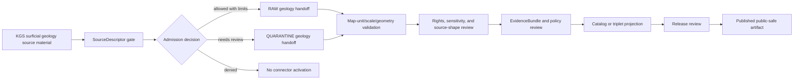

<!-- [KFM_META_BLOCK_V2]
doc_id: kfm://doc/connectors-kgs-surficial-readme
title: connectors/kgs_surficial/ — KGS Surficial Geology Compatibility Connector Lane
type: readme
version: v0.1
status: draft
owners: OWNER_TBD — Connector steward · Kansas source steward · Geology steward · Hydrology steward · Soil liaison · Rights reviewer · Sensitivity reviewer · Validation steward · Docs steward
created: 2026-06-19
updated: 2026-06-19
policy_label: public-doctrine; compatibility-lane; noncanonical-path; surficial-geology-source; rights-gated; sensitivity-gated; no-publication
proposed_path: connectors/kgs_surficial/README.md
truth_posture: CONFIRMED path exists / NONCANONICAL compatibility README / CANONICAL HOME CONFIRMED AS connectors/kansas/kgs/ BY SOURCE PROFILE
related:
  - ../README.md
  - ../kgs/README.md
  - ../kgs_bedrock/README.md
  - ../kansas/README.md
  - ../kansas/kgs/README.md
  - ../../docs/sources/catalog/kansas/ksgs.md
  - ../../docs/domains/geology/README.md
  - ../../docs/domains/geology/SOURCES.md
  - ../../docs/domains/hydrology/README.md
  - ../../docs/domains/soil/README.md
  - ../../docs/sources/SOURCE_DESCRIPTOR_STANDARD.md
  - ../../control_plane/source_authority_register.yaml
  - ../../data/registry/sources/
  - ../../data/raw/geology/
  - ../../data/quarantine/geology/
  - ../../data/raw/hydrology/
  - ../../data/quarantine/hydrology/
  - ../../fixtures/
  - ../../schemas/contracts/v1/source/
  - ../../policy/sensitivity/
  - ../../policy/rights/
  - ../../release/
tags: [kfm, connectors, kgs, ksgs, surficial-geology, geologic-maps, geomorphology, geology, hydrology, soil, kansas, compatibility, source-admission, raw, quarantine, governance]
notes:
  - "This README fills a previously blank top-level KGS surficial geology connector path."
  - "The KGS source profile says canonical KGS connector work belongs under `connectors/kansas/kgs/` and identifies KGS surficial geology and geologic maps as a KGS source-family row."
  - "This top-level `connectors/kgs_surficial/` path is therefore a compatibility sublane, not a new canonical authority root."
  - "Surficial geology source material must preserve map-unit identity, geomorphic context, scale, geometry/uncertainty, source vintage, source role, and rights/sensitivity state."
  - "Connector output may enter RAW or QUARANTINE handoff only; downstream validation, EvidenceBundle closure, rights/sensitivity review, catalog/triplet projection, release review, publication, correction, and rollback remain outside this folder."
[/KFM_META_BLOCK_V2] -->

<a id="top"></a>

# KGS Surficial Geology Compatibility Connector Lane

> Compatibility README for the existing top-level `connectors/kgs_surficial/` path. This path is **not** the canonical connector home; KGS surficial geology and geologic-map work should converge under the canonical KGS connector lane, `connectors/kansas/kgs/`, unless a later ADR or migration decision says otherwise.

<p>
  
  
  
  
  
</p>

> [!IMPORTANT]
> **Status:** compatibility / noncanonical-path README · **Owner:** `OWNER_TBD`  
> **Path:** `connectors/kgs_surficial/README.md`  
> **Truth posture:** `CONFIRMED` file exists · `NONCANONICAL` compatibility path · `CONFIRMED` KGS source profile points canonical KGS work to `connectors/kansas/kgs/`  
> **Boundary:** source-admission compatibility only; no operational engineering, soil-truth replacement, hazard, public geology, or direct publication use.

**Quick jumps:** [Scope](#scope) · [Repo fit](#repo-fit) · [Accepted inputs](#accepted-inputs) · [Exclusions](#exclusions) · [Evidence ledger](#evidence-ledger) · [Lifecycle diagram](#lifecycle-diagram) · [Admission posture](#admission-posture) · [Anti-collapse rules](#anti-collapse-rules) · [Validation](#validation) · [Rollback](#rollback) · [Verification backlog](#verification-backlog)

---

## Scope

`connectors/kgs_surficial/` is retained here only as a compatibility sublane because the path already exists.

The KGS source profile names KGS surficial geology and geologic maps as a KGS source-family row and says the canonical KGS connector home was already `connectors/kansas/kgs/`, under the canonical `connectors/kansas/` family. Surficial-specific implementation should therefore converge under the canonical KGS connector lane unless a later ADR or migration note explicitly keeps this sublane.

This path must not become a separate KGS authority root, surficial-truth store, soil-truth store, schema root, source registry, release root, or publication surface.

[Back to top ↑](#top)

---

## Repo fit

| Surface | Role | Status |
|---|---|---:|
| `connectors/kgs_surficial/` | Existing top-level surficial compatibility path. | **CONFIRMED path / NONCANONICAL** |
| `connectors/kgs/` | Existing top-level KGS compatibility path. | **CONFIRMED README path / NONCANONICAL** |
| `connectors/kgs_bedrock/` | Existing top-level KGS bedrock compatibility path. | **CONFIRMED README path / NONCANONICAL** |
| `connectors/kansas/kgs/` | Canonical KGS adapter home named by source profile. | **CONFIRMED by source profile / NEEDS VERIFICATION implementation depth** |
| `connectors/kansas/` | Canonical Kansas connector-family lane. | **CONFIRMED** |
| `docs/sources/catalog/kansas/ksgs.md` | Human-facing KGS source catalog entry. | **CONFIRMED** |
| `data/registry/sources/` | SourceDescriptor authority. | **Outside connector / NEEDS VERIFICATION for entries** |
| `data/raw/geology/`, `data/raw/hydrology/` | Candidate RAW handoff targets. | **PROPOSED / NEEDS VERIFICATION** |
| `data/quarantine/geology/`, `data/quarantine/hydrology/` | Candidate quarantine handoff targets. | **PROPOSED / NEEDS VERIFICATION** |
| `policy/rights/` and `policy/sensitivity/` | Rights and sensitivity authority. | **Outside connector** |
| `release/` | Release and publication controls. | **Out of scope for this compatibility lane** |

[Back to top ↑](#top)

---

## Accepted inputs

Accepted content for this noncanonical compatibility path:

- README-level migration and compatibility notes;
- links to the canonical `connectors/kansas/kgs/` path;
- notes that prevent this top-level path from becoming a parallel authority;
- temporary fixture or test notes only if they are explicitly migration-bound;
- adapter notes for KGS surficial map and map-unit metadata only if retained here by ADR or migration note;
- quarantine criteria for unresolved rights, source role, map-unit identity, geomorphic context, scale, geometry, source vintage, endpoint/access method, or source-shape issues.

New implementation code should prefer `connectors/kansas/kgs/` unless an ADR says otherwise.

---

## Exclusions

This folder must not contain or imply authority over:

- canonical connector-family status;
- public release decisions;
- operational engineering, excavation, hazard, construction, soil-truth replacement, or field-use decisions;
- direct writes to `PROCESSED`, `CATALOG`, `TRIPLET`, `PUBLISHED`, proof, receipt, or release stores;
- SourceDescriptor authority records;
- policy or schema authority;
- generated summaries presented as authoritative surficial geology, hazard, soil, or hydrology truth;
- source activation without SourceDescriptor, rights, sensitivity, source-role, scale, geometry, provenance, and review checks.

Redirect implementation and source-family authority to `connectors/kansas/kgs/` once verified.

[Back to top ↑](#top)

---

## Evidence ledger

| Source | Status | Supports | Limits |
|---|---:|---|---|
| `connectors/kgs_surficial/README.md` | **CONFIRMED** | Target file exists and was blank before this update. | Does not prove implementation files, tests, or CI. |
| `docs/sources/catalog/kansas/ksgs.md` | **CONFIRMED** | KGS source profile says canonical connector path is `connectors/kansas/kgs/` and identifies KGS surficial geology and geologic maps as a KGS source-family row. | Does not prove current source terms, endpoint stability, activation, or implementation. |
| `connectors/kgs/README.md` | **CONFIRMED** | Top-level KGS path is documented as noncanonical compatibility. | Does not prove surficial implementation depth. |
| `connectors/kgs_bedrock/README.md` | **CONFIRMED** | Bedrock path is a sibling compatibility sublane, not a replacement for surficial identity. | Does not prove implementation depth. |
| `connectors/kansas/kgs/` | **NEEDS VERIFICATION** | Named as canonical adapter home by source profile. | Actual files, code, fixtures, tests, and CI remain unverified here. |

---

## Lifecycle diagram



[Back to top ↑](#top)

---

## Admission posture

Expected behavior for KGS surficial geology source-admission work:

- no live source access unless explicitly enabled and reviewed;
- no source fetch without an accepted SourceDescriptor and activation decision;
- no implicit publication from retrieved source material;
- no operational engineering, excavation, hazard, construction, soil-truth replacement, or field-use use;
- no conversion of surficial map units or geomorphic context into public geology, hazard, soil, or hydrology truth without downstream review;
- no collapse of surficial geology into KGS bedrock products, NRCS/SSURGO soils, hazards, hydrology measurements, or generated summaries;
- no loss of source ID, source URI, source role, map-unit identity, geomorphic context, scale, geometry/uncertainty, date/vintage, license/rights, review, or release-class metadata;
- unclear rights, source role, map-unit identity, geomorphic context, scale, geometry, endpoint, vintage, or schema drift routes to quarantine or abstention.

---

## Anti-collapse rules

The KGS surficial lane must preserve the following controls:

1. `connectors/kgs_surficial/` is compatibility-only unless an ADR says otherwise.
2. Canonical KGS work belongs under `connectors/kansas/kgs/`.
3. Surficial map-unit identity, geomorphic context, map scale, geometry, and source vintage must remain explicit.
4. Surficial geology must not be collapsed into bedrock geology, NRCS/SSURGO soil truth, hydrology measurements, hazards, or generated summaries.
5. Public release is a governed state transition, not a connector output.
6. Derived summaries, maps, tiles, joins, analyses, and AI explanations are downstream carriers, not sovereign truth.

---

## Validation

Compatibility-lane validation should check that:

- this path is not treated as canonical without ADR/migration evidence;
- source metadata is preserved;
- SourceDescriptor references are required for activation;
- source role, map-unit identity, geomorphic context, scale, geometry, and source vintage are explicit where available;
- rights and sensitivity states are explicit before promotion-track use;
- malformed or incomplete records fail closed;
- records with unresolved rights, sensitivity state, source role, map-unit identity, geomorphic context, scale, geometry, or access method route to quarantine;
- connector output is limited to RAW or QUARANTINE handoff;
- no connector run writes directly to processed, catalog, triplet, published, proof, receipt, or release stores.

Root-level validation, policy-as-code, EvidenceBundle closure, release review, public caveats, and rollback remain outside this compatibility lane.

[Back to top ↑](#top)

---

## Definition of done

This compatibility README is ready for first review when:

- [ ] KGS source profile is linked and current enough for review.
- [ ] A migration or ADR decision resolves whether to remove this top-level path, keep it as a redirect, or migrate implementation under `connectors/kansas/kgs/`.
- [ ] Canonical KGS surficial implementation home is verified.
- [ ] SourceDescriptor homes and surficial sub-product IDs are verified.
- [ ] Rights terms, access methods, cadence, fixture strategy, source-role strategy, and sensitivity checks are verified by source steward review.
- [ ] Live source access is disabled by default for connector code.
- [ ] Source-role, map-unit identity, geomorphic context, geometry, scale, vintage, rights, sensitivity, and anti-collapse checks are represented in tests.
- [ ] Connector output is limited to RAW or QUARANTINE handoff.
- [ ] No public operational, engineering, excavation, hazard, soil, hydrology, or geology claims are created by connector code.

---

## Rollback

Rollback is required if this README is used to justify canonical-family status, direct publication, source activation, source-role collapse, rights/sensitivity bypass, public operational claims, or direct writes beyond RAW/QUARANTINE handoff.

Rollback target:

```text
commit prior to this update: SHA_TBD_AFTER_GIT_HISTORY_CHECK
```

Because the file was blank before this update, a safe rollback is to restore the blank placeholder or replace this document with a shorter redirect-only README until canonical placement is resolved.

---

## Verification backlog

| Item | Status | Needed evidence |
|---|---:|---|
| Confirm canonical KGS surficial implementation home. | **NEEDS VERIFICATION** | Directory Rules, ADR, migration note, or repo tree. |
| Confirm whether this top-level path should remain. | **NEEDS VERIFICATION** | ADR or migration decision. |
| Confirm SourceDescriptor homes and surficial sub-product IDs. | **NEEDS VERIFICATION** | Source registry entries and accepted schemas. |
| Confirm current access methods, cadence, and terms. | **NEEDS VERIFICATION** | Source steward review and current source documentation. |
| Confirm surficial/bedrock/soils/hazards anti-collapse tests. | **NEEDS VERIFICATION** | Tests, fixtures, and source-role policy references. |
| Confirm rights and sensitivity handling. | **NEEDS VERIFICATION** | Rights review, sensitivity review, and policy references. |
| Confirm scale and release-generalization policy. | **NEEDS VERIFICATION** | Policy references, code, fixtures, and review notes. |
| Confirm fixture strategy and CI wiring. | **NEEDS VERIFICATION** | Fixture registry, workflow files, and test logs. |

---

## Maintainer note

Do not build new authority here. This existing top-level path should either stay a clear compatibility pointer or be removed after migration. Implementation should converge under `connectors/kansas/kgs/` unless an ADR says otherwise.

[Back to top ↑](#top)
