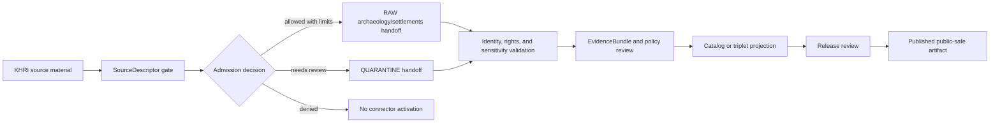

<!-- [KFM_META_BLOCK_V2]
doc_id: kfm://doc/connectors-khri-readme
title: connectors/khri/ — KHRI Compatibility Connector Lane
type: readme
version: v0.1
status: draft
owners: OWNER_TBD — Connector steward · Kansas source steward · KSHS/archives liaison · Archaeology steward · Settlements steward · Rights reviewer · Sensitivity reviewer · Validation steward · Docs steward
created: 2026-06-19
updated: 2026-06-19
policy_label: public-doctrine; compatibility-lane; noncanonical-path; kshs-surface; cultural-resource-source; rights-gated; sensitivity-gated; no-publication
proposed_path: connectors/khri/README.md
truth_posture: CONFIRMED path exists / NONCANONICAL compatibility README / CANONICAL HOME CONFIRMED AS connectors/kansas/khri/ BY SOURCE PROFILE
related:
  - ../README.md
  - ../kansas/README.md
  - ../kansas/khri/README.md
  - ../kansas_state_archives/README.md
  - ../../docs/sources/catalog/kansas/khri.md
  - ../../docs/sources/catalog/kansas/kansas-state-archives.md
  - ../../docs/sources/catalog/kansas/kansas-memory.md
  - ../../docs/domains/archaeology/README.md
  - ../../docs/domains/settlements-infrastructure/README.md
  - ../../docs/domains/people-dna-land/README.md
  - ../../docs/sources/SOURCE_DESCRIPTOR_STANDARD.md
  - ../../data/registry/sources/
  - ../../data/raw/archaeology/
  - ../../data/quarantine/archaeology/
  - ../../data/raw/settlements-infrastructure/
  - ../../data/quarantine/settlements-infrastructure/
  - ../../fixtures/
  - ../../schemas/contracts/v1/source/
  - ../../policy/sensitivity/
  - ../../policy/rights/
  - ../../release/
tags: [kfm, connectors, khri, kshs, kansas, historic-resources, archaeology, settlements, cultural-resources, compatibility, source-admission, raw, quarantine, governance]
notes:
  - "This README replaces the greenfield stub in the top-level KHRI connector path."
  - "The KHRI source dossier says the correct connector path was already `connectors/kansas/khri/` under the canonical `connectors/kansas/` family."
  - "This top-level `connectors/khri/` path is therefore a compatibility lane, not a new canonical authority root."
  - "KHRI is a KSHS-operated per-surface product page under the KSHS umbrella brief; the umbrella does not replace the KHRI-specific descriptor."
  - "Connector output may enter RAW or QUARANTINE handoff only; downstream validation, EvidenceBundle closure, rights/sensitivity review, catalog/triplet projection, release review, publication, correction, and rollback remain outside this folder."
[/KFM_META_BLOCK_V2] -->

<a id="top"></a>

# KHRI Compatibility Connector Lane

> Compatibility README for the existing top-level `connectors/khri/` path. This path is **not** the canonical connector home; KHRI connector work belongs under `connectors/kansas/khri/` unless a later ADR or migration decision says otherwise.

<p>
  
  
  
  
  
</p>

> [!IMPORTANT]
> **Status:** compatibility / noncanonical-path README · **Owner:** `OWNER_TBD`  
> **Path:** `connectors/khri/README.md`  
> **Truth posture:** `CONFIRMED` file exists · `NONCANONICAL` compatibility path · `CONFIRMED` source profile points canonical work to `connectors/kansas/khri/`  
> **Boundary:** source-admission compatibility only; no public cultural-resource release, no policy decision authority, no direct publication, no rights/sensitivity bypass.

**Quick jumps:** [Scope](#scope) · [Repo fit](#repo-fit) · [Accepted inputs](#accepted-inputs) · [Exclusions](#exclusions) · [Evidence ledger](#evidence-ledger) · [Lifecycle diagram](#lifecycle-diagram) · [Admission posture](#admission-posture) · [Anti-collapse rules](#anti-collapse-rules) · [Validation](#validation) · [Rollback](#rollback) · [Verification backlog](#verification-backlog)

---

## Scope

`connectors/khri/` is retained here only as a compatibility lane because the path already exists.

The KHRI source dossier states that its connector path was already correct as `connectors/kansas/khri/` under the canonical `connectors/kansas/` family. New implementation should therefore use the canonical Kansas/KHRI lane unless an ADR or migration note explicitly keeps this top-level path.

This path must not become a separate KSHS authority root, KHRI truth store, source registry, policy root, schema root, release root, or publication surface.

[Back to top ↑](#top)

---

## Repo fit

| Surface | Role | Status |
|---|---|---:|
| `connectors/khri/` | Existing top-level compatibility path. | **CONFIRMED path / NONCANONICAL** |
| `connectors/kansas/khri/` | Canonical KHRI connector path named by source dossier. | **CONFIRMED by source profile / NEEDS VERIFICATION implementation depth** |
| `connectors/kansas/` | Canonical Kansas connector-family lane. | **CONFIRMED** |
| `docs/sources/catalog/kansas/khri.md` | KHRI per-surface source dossier. | **CONFIRMED** |
| `docs/sources/catalog/kansas/kansas-state-archives.md` | KSHS umbrella source-family brief. | **CONFIRMED** |
| `data/registry/sources/` | SourceDescriptor authority. | **Outside connector / NEEDS VERIFICATION for entries** |
| `data/raw/archaeology/`, `data/raw/settlements-infrastructure/` | Candidate RAW handoff targets. | **PROPOSED / NEEDS VERIFICATION** |
| `data/quarantine/archaeology/`, `data/quarantine/settlements-infrastructure/` | Candidate quarantine handoff targets. | **PROPOSED / NEEDS VERIFICATION** |
| `policy/rights/` and `policy/sensitivity/` | Rights and sensitivity authority. | **Outside connector** |
| `release/` | Release and publication controls. | **Out of scope for this compatibility lane** |

[Back to top ↑](#top)

---

## Accepted inputs

Accepted content for this noncanonical compatibility path:

- README-level migration and compatibility notes;
- links to the canonical `connectors/kansas/khri/` path;
- notes that prevent this top-level path from becoming a parallel authority;
- temporary fixture or test notes only if explicitly migration-bound;
- adapter notes for KHRI source metadata only if retained here by ADR or migration note;
- quarantine criteria for unresolved rights, source role, inventory identity, resource type, geometry precision, review state, cultural-resource sensitivity, access method, or source-shape issues.

New implementation code should prefer `connectors/kansas/khri/` unless an ADR says otherwise.

---

## Exclusions

This folder must not contain or imply authority over:

- canonical connector-family status;
- public release decisions;
- public cultural-resource, archaeology, eligibility, designation, owner, occupant, or parcel claims;
- direct writes to `PROCESSED`, `CATALOG`, `TRIPLET`, `PUBLISHED`, proof, receipt, or release stores;
- SourceDescriptor authority records;
- policy or schema authority;
- generated summaries presented as authoritative historic-resource truth;
- source activation without SourceDescriptor, rights, sensitivity, source-role, geometry, provenance, and review checks.

Redirect implementation and source-family authority to `connectors/kansas/khri/` once verified.

[Back to top ↑](#top)

---

## Evidence ledger

| Source | Status | Supports | Limits |
|---|---:|---|---|
| `connectors/khri/README.md` | **CONFIRMED** | Target file existed as a greenfield stub before this update. | Does not prove implementation files, tests, or CI. |
| `docs/sources/catalog/kansas/khri.md` | **CONFIRMED** | KHRI dossier says the connector path was already correct as `connectors/kansas/khri/` and frames KHRI as a KSHS-operated per-surface product page. | Does not prove endpoint availability, rights clearance, activation, or implementation. |
| `docs/sources/catalog/kansas/kansas-state-archives.md` | **CONFIRMED** | KSHS umbrella brief lists KHRI as a per-surface product page and says the umbrella is not a substitute for per-surface descriptors. | Does not replace KHRI-specific admission detail. |
| `connectors/kansas/khri/` | **NEEDS VERIFICATION** | Named as canonical adapter home by source dossier. | Actual files, code, fixtures, tests, and CI remain unverified here. |

---

## Lifecycle diagram



[Back to top ↑](#top)

---

## Admission posture

Expected behavior for KHRI source-admission work:

- no live source access unless explicitly enabled and reviewed;
- no source fetch without an accepted SourceDescriptor and activation decision;
- no implicit publication from retrieved source material;
- no conversion of KHRI records into public archaeology, eligibility, designation, owner, occupant, parcel, or historic-resource claims without downstream review;
- no collapse of KHRI into Kansas Memory, KSHS State Archives proper, county society holdings, GNIS, parcel records, archaeology records, or generated summaries;
- no loss of source ID, source URI, KSHS/KHRI surface identity, source role, inventory identity, resource type, geometry/uncertainty, date/vintage, rights, review state, sensitivity state, or release-class metadata;
- unclear rights, source role, identity, geometry precision, sensitivity state, access method, or schema drift routes to quarantine or abstention.

---

## Anti-collapse rules

The KHRI lane must preserve the following controls:

1. `connectors/khri/` is compatibility-only unless an ADR says otherwise.
2. Canonical KHRI connector work belongs under `connectors/kansas/khri/`.
3. KHRI is a KSHS-operated per-surface product page; the KSHS umbrella brief does not replace the KHRI-specific descriptor.
4. KHRI records must not be collapsed into Kansas Memory, KSHS State Archives proper, archaeology truth, parcel/person records, or generated summaries.
5. Public release is a governed state transition, not a connector output.
6. Derived summaries, maps, tiles, joins, analyses, and AI explanations are downstream carriers, not sovereign truth.

---

## Validation

Compatibility-lane validation should check that:

- this path is not treated as canonical without ADR/migration evidence;
- source metadata is preserved;
- SourceDescriptor references are required for activation;
- source role, KSHS/KHRI surface identity, inventory identity, resource type, geometry, vintage, rights, review state, and sensitivity state are explicit where available;
- malformed or incomplete records fail closed;
- records with unresolved rights, sensitivity state, source role, identity, geometry precision, review state, or access method route to quarantine;
- connector output is limited to RAW or QUARANTINE handoff;
- no connector run writes directly to processed, catalog, triplet, published, proof, receipt, or release stores.

Root-level validation, policy-as-code, EvidenceBundle closure, release review, public caveats, and rollback remain outside this compatibility lane.

[Back to top ↑](#top)

---

## Definition of done

This compatibility README is ready for first review when:

- [ ] KHRI and KSHS umbrella source profiles are linked and current enough for review.
- [ ] A migration or ADR decision resolves whether to remove this top-level path, keep it as a redirect, or migrate implementation under `connectors/kansas/khri/`.
- [ ] Canonical KHRI implementation home is verified.
- [ ] SourceDescriptor homes and KHRI source IDs are verified.
- [ ] Rights terms, access method, cadence, fixture strategy, source-role strategy, and sensitivity checks are verified by source steward review.
- [ ] Live source access is disabled by default for connector code.
- [ ] Source-role, surface identity, resource identity, geometry precision, rights, sensitivity, and anti-collapse checks are represented in tests.
- [ ] Connector output is limited to RAW or QUARANTINE handoff.
- [ ] No public cultural-resource, archaeology, person, parcel, or release claims are created by connector code.

---

## Rollback

Rollback is required if this README is used to justify canonical-family status, direct publication, source activation, source-role collapse, rights/sensitivity bypass, public cultural-resource exposure, or direct writes beyond RAW/QUARANTINE handoff.

Rollback target:

```text
commit prior to this update: SHA_TBD_AFTER_GIT_HISTORY_CHECK
```

A safe rollback is to restore the prior greenfield stub or replace this document with a shorter redirect-only README until canonical placement is resolved.

---

## Verification backlog

| Item | Status | Needed evidence |
|---|---:|---|
| Confirm canonical `connectors/kansas/khri/` implementation files. | **NEEDS VERIFICATION** | Repo tree or mounted workspace. |
| Confirm whether this top-level path should remain. | **NEEDS VERIFICATION** | ADR or migration decision. |
| Confirm SourceDescriptor homes and KHRI source IDs. | **NEEDS VERIFICATION** | Source registry entries and accepted schemas. |
| Confirm current access method, cadence, and terms. | **NEEDS VERIFICATION** | Source steward review and current source documentation. |
| Confirm rights and sensitivity handling. | **NEEDS VERIFICATION** | Rights review, sensitivity review, policy references, and tests. |
| Confirm fixture strategy and CI wiring. | **NEEDS VERIFICATION** | Fixture registry, workflow files, and test logs. |

---

## Maintainer note

Do not build new authority here. This existing top-level path should either stay a clear compatibility pointer or be removed after migration. Implementation should converge under `connectors/kansas/khri/` unless an ADR says otherwise.

[Back to top ↑](#top)
