<!-- [KFM_META_BLOCK_V2]
doc_id: kfm://doc/connectors-ku-herbarium-readme
title: connectors/ku_herbarium/ — KU Herbarium Compatibility and Migration Lane
type: readme
version: v0.2
status: draft
owners: OWNER_TBD — Connector steward · Kansas source steward · Flora steward · Biodiversity steward · Rights reviewer · Privacy/sensitivity reviewer · Security reviewer · Validation steward · Docs steward
created: 2026-06-19
updated: 2026-07-13
policy_label: public-doctrine; compatibility-lane; documentation-only; noncanonical-path; snake-case-compatibility; path-and-role-conflict; flora-source; specimen-source; rights-gated; sensitivity-gated; fail-closed; no-activation; no-publication
current_path: connectors/ku_herbarium/README.md
truth_posture: CONFIRMED current compatibility README, Kansas family parent, current KANU admission README, exact absent-path probes, source profiles, and named package/test probes / NONCANONICAL top-level snake_case path / CONFLICTED final KBS-KANU child topology and SourceDescriptor machine authority / PROPOSED redirect-and-migration contract / UNKNOWN connector runtime, source activation, current endpoint, rights, fixtures, tests, CI enforcement, and release readiness
evidence_snapshot:
  repository: bartytime4life/Kansas-Frontier-Matrix
  base_ref: main
  base_commit: 84f46a1625d218ae5ceb52ff955e3179fe1458e2
  prior_blob: ee0033317dff021ecd8e7c20c7103287bba21f92
related:
  - ../README.md
  - ../kbs/README.md
  - ../kansas/README.md
  - ../kansas/kbs_herbarium/README.md
  - ../kansas/kbs/README.md
  - ../kansas/ku-herbarium/README.md
  - ../../CONTRIBUTING.md
  - ../../.github/CODEOWNERS
  - ../../docs/doctrine/directory-rules.md
  - ../../docs/adr/ADR-0012-connector-outputs-to-data-raw-or-data-quarantine-only.md
  - ../../docs/sources/SOURCE_DESCRIPTOR_STANDARD.md
  - ../../docs/sources/catalog/kansas/kbs.md
  - ../../docs/sources/catalog/kansas/ku-herbarium.md
  - ../../docs/sources/catalog/kansas/ku-nhm.md
  - ../../docs/standards/Darwin_Core.md
  - ../../docs/domains/flora/README.md
  - ../../docs/domains/flora/OBJECT_FAMILIES.md
  - ../../docs/domains/fauna/README.md
  - ../../contracts/source/source_descriptor.md
  - ../../schemas/contracts/v1/source/source_descriptor.schema.json
  - ../../schemas/contracts/v1/sources/source_descriptor.schema.json
  - ../../data/registry/sources/README.md
  - ../../control_plane/source_authority_register.yaml
  - ../../policy/rights/
  - ../../policy/sensitivity/
  - ../../release/
tags: [kfm, connectors, ku, kanu, herbarium, mcgregor-herbarium, kbs, kansas, flora, biodiversity, specimen, darwin-core, dwca, ipt, compatibility, migration, source-admission, source-role, rights, sensitivity, raw, quarantine, governance]
notes:
  - "This top-level snake_case path is retained as a compatibility and migration surface. It must not become a second KANU connector, source registry, schema authority, policy authority, or publication lane."
  - "The verified Kansas-family KANU documentation lane is `connectors/kansas/kbs_herbarium/`; the source catalog proposes `connectors/kansas/ku-herbarium/`; the KBS umbrella proposes `connectors/kansas/kbs/`; both proposed README paths were absent at the pinned base."
  - "KANU specimen observations and KBS Natural Heritage Inventory authority/ranking material are related institutional surfaces with distinct source roles, descriptors, rights, sensitivity, and release burdens."
  - "Specimen records preserve source-native identity, recorded determinations, event and collection context, geometry uncertainty, rights, archive identity, and provenance. They do not become nomenclature, conservation-status, current-population, range, habitat, or release authority."
  - "SourceDescriptor machine authority remains conflicted across narrative doctrine, the populated singular-path legacy schema, the empty plural-path scaffold, and differing source-role vocabularies. This compatibility lane does not resolve that conflict."
  - "Only this Markdown file is changed. No code, package metadata, path move, descriptor, registry entry, fixture, test, schema, contract, policy, workflow, source activation, receipt, proof, release object, or public artifact is created."
[/KFM_META_BLOCK_V2] -->

<a id="top"></a>

# KU Herbarium Compatibility and Migration Lane

> [!IMPORTANT]
> **Document lifecycle:** `draft v0.2`  
> **Component maturity:** documentation-only compatibility path; KANU connector runtime `UNKNOWN`  
> **Canonicality:** `NONCANONICAL` top-level snake_case path  
> **Current KANU documentation lane:** [`connectors/kansas/kbs_herbarium/`](../kansas/kbs_herbarium/)  
> **Path posture:** final KBS/KANU child topology and machine source-role authority `CONFLICTED`  
> **Boundary:** no source activation, live harvesting, lifecycle persistence, taxonomic correction authority, sensitive-location release, public specimen layer, or publication authority.

<p>
  
  
  
  
  
  
  
  
</p>

`connectors/ku_herbarium/` exists to keep historical, generated, or external references to the older top-level snake_case KU Herbarium path understandable while KFM resolves the final KBS/KANU connector topology. The folder's existence does not make it an implementation authority.

**Quick links:** [Purpose](#purpose) · [Authority](#authority-and-status) · [Verified state](#verified-repository-state) · [Path conflict](#path-and-migration-conflict) · [Routing](#routing) · [What belongs here](#what-belongs-here) · [What does not belong here](#what-does-not-belong-here) · [Specimen meaning](#specimen-record-and-meaning-boundaries) · [Source-role boundaries](#source-role-and-anti-collapse-rules) · [Inputs](#inputs) · [Outputs](#outputs) · [Lifecycle](#lifecycle-boundary) · [Rights and sensitivity](#rights-sensitivity-and-locality-posture) · [Validation](#validation) · [Evidence](#evidence-basis) · [Review burden](#review-burden) · [ADRs](#adr-and-migration-triggers) · [Definition of done](#definition-of-done) · [Rollback](#rollback) · [Backlog](#verification-backlog)

---

## Purpose

This README has six responsibilities:

1. mark `connectors/ku_herbarium/` as compatibility-only;
2. redirect maintainers to the current Kansas-family KANU admission documentation;
3. record the unresolved relationship among the current `kbs_herbarium/` child and proposed `kbs/` and `ku-herbarium/` children;
4. preserve KANU specimen identity, rights, sensitivity, taxonomy, locality, archive, and provenance requirements;
5. prevent KANU specimen observations from collapsing into KBS NHI authority rankings, KU NHM collections, aggregate portals, nomenclature authorities, or generated summaries;
6. fail closed while descriptor, path, endpoint, rights, activation, fixture, test, and runtime evidence remain unresolved.

The current repository supports one safe operational statement:

> **Do not add a second KANU implementation under this top-level path.**

The verified KANU documentation lane is:

```text
connectors/kansas/kbs_herbarium/
```

The source catalog proposes:

```text
connectors/kansas/ku-herbarium/
```

The KBS umbrella documentation also proposes:

```text
connectors/kansas/kbs/
```

The two proposed README paths were absent at the pinned base. The current `kbs_herbarium/` path is explicitly provisional. This README records the conflict rather than choosing a winner by convenience.

[Back to top](#top)

---

## Authority and status

| Concern | Status | Evidence-bounded determination |
|---|---:|---|
| Owning responsibility root | **CONFIRMED** | Source-specific retrieval, source-head checks, parsing, provenance capture, and admission mechanics belong under `connectors/`. |
| This top-level path | **CONFIRMED / NONCANONICAL** | `connectors/ku_herbarium/README.md` exists as an older snake_case compatibility surface. |
| Runtime below this path | **NOT ESTABLISHED** | Exact probes found no `pyproject.toml`, `src/README.md`, or `tests/README.md` below this folder at the pinned base. Differently named or unindexed files remain `UNKNOWN`. |
| Current Kansas-family KANU lane | **CONFIRMED / PROVISIONAL NAME** | `connectors/kansas/kbs_herbarium/README.md` exists and documents KANU specimen admission only. |
| Runtime below current KANU lane | **NOT ESTABLISHED AT NAMED PROBES** | Exact probes found no `pyproject.toml`, `src/README.md`, or `tests/README.md` beneath `connectors/kansas/kbs_herbarium/` at the pinned base. |
| Proposed KANU child | **ABSENT AT PINNED BASE** | Exact probe for `connectors/kansas/ku-herbarium/README.md` returned `Not Found`; the source page proposes the path. |
| Proposed KBS umbrella child | **ABSENT AT PINNED BASE** | Exact probe for `connectors/kansas/kbs/README.md` returned `Not Found`; the umbrella source page proposes the path. |
| Final child topology | **CONFLICTED** | Current and proposed names disagree; no accepted path decision was verified in scope. |
| SourceDescriptor authority | **CONFLICTED FOR MACHINE USE** | Narrative and machine role vocabularies differ; the populated singular-path schema labels itself legacy, while the plural-path scaffold is empty. |
| Product-level KANU descriptor | **NOT VERIFIED** | No accepted KANU descriptor, machine authority entry, activation record, or source-head record was verified here. |
| Rights and redistribution | **NEEDS VERIFICATION** | Current endpoint terms, archive license, record-level rights, attribution, and redistribution must be reviewed before access or reuse. |
| Sensitive locality posture | **DENY BY DEFAULT** | Exact restricted-taxa and other sensitive localities must not become public through connector output, fixtures, logs, or examples. |
| Publication authority | **NONE** | Neither this README nor connector retrieval can create a released public claim, layer, API response, EvidenceBundle, proof, or release decision. |
| Owners | **UNKNOWN** | `OWNER_TBD` is deliberate until path-specific ownership is accepted. |

> [!CAUTION]
> A source profile, proposed path, public archive, DwC-A package, specimen record, or successful download is not source activation, rights clearance, sensitivity clearance, evidence closure, or public-release approval.

[Back to top](#top)

---

## Verified repository state

The bounded repository state at the evidence snapshot is:

```text
connectors/
├── kbs/
│   └── README.md                         # top-level KBS compatibility lane
├── ku_herbarium/
│   └── README.md                         # this top-level compatibility lane
└── kansas/
    ├── README.md                         # Kansas family coordination
    ├── kbs_herbarium/
    │   └── README.md                     # current KANU admission documentation
    ├── kbs/
    │   └── README.md                     # absent by exact probe
    └── ku-herbarium/
        └── README.md                     # absent by exact probe
```

Exact named probes for this top-level path returned `Not Found`:

```text
connectors/ku_herbarium/pyproject.toml
connectors/ku_herbarium/src/README.md
connectors/ku_herbarium/tests/README.md
```

Exact named probes for the current Kansas-family KANU path returned `Not Found`:

```text
connectors/kansas/kbs_herbarium/pyproject.toml
connectors/kansas/kbs_herbarium/src/README.md
connectors/kansas/kbs_herbarium/tests/README.md
```

These are bounded absence statements. They do not prove that no differently named, unindexed, or later-added file exists.

| Surface | Confirmed state | Safe conclusion |
|---|---|---|
| `connectors/ku_herbarium/README.md` | v0.1 compatibility documentation before this update | Keep as redirect/migration boundary; no new implementation authority. |
| `connectors/kbs/README.md` | v0.2 top-level compatibility and topology-conflict documentation | KBS NHI and KANU surfaces must remain separate; proposed children are absent. |
| `connectors/kansas/kbs_herbarium/README.md` | v0.2 KANU admission contract | Current documentation lane, provisional path; not runtime proof. |
| `docs/sources/catalog/kansas/ku-herbarium.md` | KANU source-profile doctrine and proposed path | Product orientation and source semantics; not path presence or activation. |
| `docs/sources/catalog/kansas/kbs.md` | KBS umbrella doctrine | Institutional relationship and NHI/KANU role split; not a combined descriptor or connector. |

[Back to top](#top)

---

## Path and migration conflict

The final connector topology must be resolved before executable work is added or moved.

| Candidate surface | Current posture | Safe use now |
|---|---:|---|
| `connectors/ku_herbarium/` | **NONCANONICAL top-level compatibility path** | Redirect, migration note, deprecation state, rollback reference, and anti-collapse guardrails only. |
| `connectors/kansas/kbs_herbarium/` | **CURRENT DOCUMENTATION LANE / PROVISIONAL NAME** | KANU admission contract and future retained implementation only if an accepted path decision keeps it. |
| `connectors/kansas/ku-herbarium/` | **PROPOSED BY KANU PROFILE / ABSENT** | Do not claim implementation or create a parallel package without migration authority. |
| `connectors/kansas/kbs/` | **PROPOSED BY KBS PROFILE / ABSENT** | Do not collapse KBS NHI and KANU into one adapter by default. |
| `connectors/kbs/` | **TOP-LEVEL COMPATIBILITY** | Umbrella migration context only; no runtime or source authority. |
| One future accepted KANU package | **PROPOSED** | May host KANU product access only after naming, descriptor, tests, rights, sensitivity, and migration decisions are accepted. |

A migration decision must cover at least:

- final connector path and package/import name;
- relationship to the KBS umbrella and KBS NHI surface;
- KANU publisher, institution, collection, dataset, and source IDs;
- SourceDescriptor and activation references;
- fixture and test homes;
- DwC-A/IPT transport and source-head strategy;
- credentials and no-network defaults;
- rights, attribution, retention, and redistribution;
- restricted-taxa and locality handling;
- compatibility aliases, warnings, and sunset dates;
- receipts and provenance continuity;
- backlinks, documentation updates, correction, and rollback.

Directory presence is not authority. Shared institutional context is not one source role.

[Back to top](#top)

---

## Routing

Until topology and machine authority are resolved:

| Need | Route |
|---|---|
| Current KANU admission documentation | [`connectors/kansas/kbs_herbarium/README.md`](../kansas/kbs_herbarium/README.md) |
| KBS/KANU topology conflict | [`connectors/kbs/README.md`](../kbs/README.md) |
| Kansas connector-family coordination | [`connectors/kansas/README.md`](../kansas/README.md) |
| KANU source-product orientation | [`docs/sources/catalog/kansas/ku-herbarium.md`](../../docs/sources/catalog/kansas/ku-herbarium.md) |
| KBS umbrella and NHI/KANU role split | [`docs/sources/catalog/kansas/kbs.md`](../../docs/sources/catalog/kansas/kbs.md) |
| Flora domain meaning | [`docs/domains/flora/README.md`](../../docs/domains/flora/README.md) |
| Darwin Core reference | [`docs/standards/Darwin_Core.md`](../../docs/standards/Darwin_Core.md) |
| Source identity and activation | Governing source registry and control-plane surfaces |
| Semantic contracts and machine schemas | Governing `contracts/` and `schemas/` roots |
| Rights and sensitivity decisions | Governing `policy/rights/` and `policy/sensitivity/` roots |
| Lifecycle persistence, evidence, and release | Orchestration, data, proof, receipt, and `release/` owners |

Do not add code here because the future destination is unresolved. Resolve the migration first.

[Back to top](#top)

---

## What belongs here

Accepted content is deliberately narrow:

- this compatibility README;
- links to the current KANU lane, KBS compatibility lane, source profiles, standards, and governing roots;
- explicit migration, deprecation, redirect, warning, sunset, correction, and rollback notes;
- a compatibility adapter only when an accepted ADR or migration record names its owner, behavior, tests, warning surface, sunset criteria, and rollback;
- KANU-specific preservation requirements for specimen identity, archive identity, taxonomy, event context, geometry, rights, sensitivity, and provenance;
- quarantine criteria and finite negative states such as `descriptor-missing`, `rights-unknown`, `restricted-locality`, `taxonomy-ambiguous`, `archive-invalid`, or `source-head-unresolved`.

No item in this list establishes implementation, source activation, or publication readiness.

## What does not belong here

This folder must not contain or imply authority over:

- a second KANU package, client, downloader, crawler, watcher, parser, or scheduler;
- KBS Natural Heritage Inventory rankings or authority records;
- KU Natural History Museum zoological, paleontological, or other non-KANU collection surfaces;
- aggregate iDigBio or GBIF portal data treated as KANU source truth;
- USDA PLANTS, ITIS, GBIF Backbone, or another nomenclature authority copied into specimen truth;
- `SourceDescriptor` instances, source-authority entries, activation decisions, or source-role vocabulary decisions;
- canonical contracts, JSON Schemas, rights policy, sensitivity policy, or release policy;
- bulk DwC-A archives, production source payloads, database dumps, image corpora, or caches;
- credentials, cookies, tokens, authorization headers, private URLs, signed URLs, or account details;
- real exact restricted-taxa locations, private locality data, collector contact details, or unsafe living-person data in fixtures, examples, logs, or documentation;
- direct writes to `RAW`, `WORK`, `QUARANTINE`, `PROCESSED`, `CATALOG`, `TRIPLET`, `PUBLISHED`, proof, receipt, or release stores;
- public occurrence layers, tiles, APIs, dashboards, exports, Evidence Drawer payloads, Focus Mode answers, or AI summaries;
- generated taxonomic, locality, rights, sensitivity, conservation-status, range, habitat, or population assertions presented as evidence;
- silent overwriting of source-native determinations, coordinates, dates, rights statements, or identifiers.

A compatibility lane can preserve a redirect. It cannot select a lifecycle sink, alter source meaning, close evidence, or approve public release.

[Back to top](#top)

---

## Specimen record and meaning boundaries

A specimen-backed record remains interpretable only when source-native identity and lineage survive.

| Meaning dimension | Required preservation |
|---|---|
| Institution and collection | `institutionCode`, `collectionCode`, full collection identity, and source surface where supplied. |
| Specimen identity | `catalogNumber`, `occurrenceID`, `recordedBy` or collector reference, `basisOfRecord`, and duplicate/cross-source status. |
| Source archive | Dataset or archive identity, IPT/resource identity where applicable, source version, checksum or source-head signal, and retrieval time. |
| Recorded determination | Source scientific name, identification history, determiner, date identified, qualifiers, and verbatim values where supplied. |
| Name crosswalk | Accepted-name or taxonomic-backbone match as a separate, versioned derivative; never overwrite the recorded determination. |
| Collection event | `eventDate`, locality, habitat or occurrence remarks, sampling context, and source uncertainty. |
| Geometry | Coordinates, datum, georeference protocol, coordinate uncertainty, withheld status, original-versus-public geometry intent, and transform lineage. |
| Rights | `license`, `rightsHolder`, access limits, image/media rights, attribution, redistribution, and derivative-use constraints. |
| Sensitivity | Restricted-taxa state, locality withholding, generalization, record-level review, and public-release class. |
| Temporal context | Collection date, identification date, source publication or archive date, retrieval time, correction, withdrawal, and supersession time. |
| Provenance | Source URI or archive identity, run identity, checksums, parser version, and transformation chain. |

A specimen record is evidence that a preserved object and associated label or digital record exist within a documented institutional and temporal context. It is not automatically proof of current occurrence, present population, complete distribution, legal status, habitat occupancy, or safe public locality.

[Back to top](#top)

---

## Source-role and anti-collapse rules

The KANU compatibility boundary must preserve these distinctions:

1. **KANU specimen observation versus KBS NHI authority.** KANU records are specimen-backed observations; KBS NHI rankings and stewardship determinations are authority context. They require separate descriptors and roles.
2. **Specimen identity versus accepted nomenclature.** Preserve the recorded determination. A later taxonomic crosswalk is derivative and versioned.
3. **KANU versus KU NHM.** Institutional proximity does not collapse botanical herbarium records into zoological, paleontological, or other museum collections.
4. **Primary source versus aggregator.** iDigBio or GBIF may redistribute or index records; the aggregator record is not silently substituted for the KANU source record.
5. **Occurrence evidence versus current presence.** A historical specimen does not prove a species remains present at the locality or time of query.
6. **Locality evidence versus public geometry.** Exact source coordinates may be withheld, generalized, or denied even when the specimen record can be cited.
7. **Collector metadata versus unrestricted personal data.** Living-person and contact details require review and minimization.
8. **Source retrieval versus public release.** A valid DwC-A archive and successful parse do not constitute evidence closure or release approval.
9. **Current path versus final path.** The top-level snake_case folder and provisional child do not become canonical merely through use.
10. **Generated language versus evidence.** AI-generated taxonomy, distribution, sensitivity, or locality claims must resolve to governed evidence or abstain.

Ambiguous mixed-role records should be split, explicitly labeled, or routed to quarantine. Do not choose a role for convenience.

[Back to top](#top)

---

## Inputs

A future accepted KANU implementation may process source material only after these inputs are resolved through the retained package and governing roots:

| Input | Required posture |
|---|---|
| Product identity | Exact KANU collection, dataset, IPT resource, archive, image service, or reviewed snapshot. Institutional name alone is insufficient. |
| SourceDescriptor reference | Accepted descriptor for the exact product and version. |
| Activation state | Explicit fixture-only, restricted, manual-snapshot, or live operation decision. |
| Access method | Reviewed archive, URL, API, service, or manual acquisition method. |
| Source head | Archive version, checksum, `ETag`, `Last-Modified`, publication date, resource ID, or other reproducible signal. |
| Role mapping | Accepted machine role plus preserved human meaning; do not copy a narrative role into an unresolved enum. |
| Rights state | Current archive and record-level terms, attribution, redistribution, derivative-use, image/media, and retention limits. |
| Sensitivity state | Restricted taxa, exact locality, private land, collector/living-person, cultural, and other record-level constraints. |
| Taxonomy posture | Recorded determinations preserved; accepted-name crosswalk authority and version supplied separately. |
| Fixture posture | Synthetic, minimized, redacted, generalized, or explicitly rights-cleared no-network fixture. |
| Caller-owned handoff | Explicit interfaces for bytes, parsed records, validation findings, and finite admission outcomes. |

Exact DTO names, field names, enums, reason codes, and command interfaces remain **PROPOSED / NEEDS VERIFICATION**.

[Back to top](#top)

---

## Outputs

This compatibility path currently emits nothing.

A future accepted KANU package may return only caller-owned, in-memory or explicitly handed-off candidates such as:

- retrieved archive bytes and source-head metadata;
- parsed source-native specimen records;
- validation findings;
- a proposed specimen candidate envelope;
- a deterministic admission outcome;
- receipt candidates conforming to an accepted contract.

Recommended finite outcomes:

| Outcome | Meaning |
|---|---|
| `admit-candidate` | Product and record passed connector-local checks; downstream admission is still required. |
| `hold/quarantine-candidate` | Material is preserved but unresolved rights, identity, taxonomy, locality, sensitivity, or archive state blocks use. |
| `deny` | Terms, policy, product identity, or access posture forbids the operation. |
| `abstain` | Evidence is insufficient to classify safely. |
| `no-op` | Source head matches the accepted retained state and no new candidate is needed. |
| `rate-limit` | Upstream or local controls require bounded retry outside this execution. |
| `error` | Transport, archive, parsing, integrity, validation, or configuration failed. |

A connector outcome is not a promotion decision. Orchestration chooses persistence; downstream systems own evidence closure, cataloging, release, correction, and rollback.

[Back to top](#top)

---

## Lifecycle boundary

```mermaid
flowchart LR
    A[KANU source product] --> B{Accepted product descriptor<br/>and activation?}
    B -->|No| D[DENY or ABSTAIN]
    B -->|Yes| C[Explicit archive access or fixture]
    C --> E[Preserve archive identity, bytes,<br/>rights, taxonomy, locality, and time]
    E --> F{Connector-local validation}
    F -->|Incomplete or unsafe| Q[QUARANTINE candidate]
    F -->|Pass| R[RAW candidate]
    R --> O[Caller-owned orchestration]
    Q --> O
    O --> V[Downstream taxonomy, rights,<br/>sensitivity, and evidence validation]
    V --> EB[EvidenceBundle closure]
    EB --> CP[Catalog or triplet projection]
    CP --> RR[Release review]
    RR --> P[Published public-safe derivative]

    classDef blocked fill:#f8d7da,stroke:#842029,color:#000;
    classDef candidate fill:#fff3cd,stroke:#664d03,color:#000;
    classDef governed fill:#d1e7dd,stroke:#0f5132,color:#000;
    class D,Q,R blocked;
    class C,E,F,O candidate;
    class V,EB,CP,RR,P governed;
```



The connector may prepare a candidate for caller-owned `RAW` or `QUARANTINE` handoff. It must not directly write later lifecycle phases or select publication status.

[Back to top](#top)

---

## Rights, sensitivity, and locality posture

- Verify current terms for the exact KANU resource, archive, record, and media product. Do not infer rights from another KU or KBS surface.
- Preserve record-level `license`, `rightsHolder`, access rights, and attribution when present.
- Public portal access does not prove bulk reuse, redistribution, image reuse, long-term retention, or derivative-publication permission.
- Restricted-taxa locations fail closed. Preserve source withholding and coordinate uncertainty; do not reverse obfuscation.
- Store original and public-safe geometry intent separately. A generalized release does not authorize exposure of exact source coordinates.
- Minimize living-person and collector contact data in fixtures, logs, examples, and public outputs.
- Treat missing, conflicting, implausible, or withheld coordinates as explicit states—not values to infer silently.
- Preserve georeference method, datum, coordinate uncertainty, and transform lineage.
- Do not publish a taxon-location join merely because each component is separately public.
- Unclear rights, locality safety, living-person exposure, or source-role state routes to quarantine, denial, or abstention.

[Back to top](#top)

---

## Validation

README-level and future connector validation should require:

### Placement and authority

- this path remains compatibility-only unless an accepted migration record changes it;
- one KANU connector package and one product-dispatch authority are selected;
- KBS NHI and KANU remain distinct source surfaces, descriptors, roles, rights reviews, and sensitivity decisions;
- no parallel registry, schema, policy, fixture, test, receipt, or release authority forms here;
- compatibility references carry deprecation, warning, sunset, correction, and rollback state.

### Archive and provenance

- exact institution, collection, dataset, resource, archive, and source-head identity;
- deterministic archive integrity checks and safe decompression limits;
- preserved source URI, retrieval time, run identity, checksum, and parser version;
- no network access on import, installation, default tests, or documentation rendering;
- explicit handling of archive schema drift and missing extensions.

### Specimen semantics

- stable use of institution, collection, catalog, occurrence, and basis-of-record identifiers;
- recorded determinations preserved without silent replacement;
- taxonomic crosswalks versioned and separated from source-native fields;
- event dates, locality text, coordinate uncertainty, datum, and georeference fields preserved where lawful;
- duplicate and cross-source matches recorded rather than destructively merged;
- missing, withheld, conflicting, or sensitive values remain explicit.

### Rights and safety

- archive-level and record-level rights, attribution, redistribution, and media-use states are explicit;
- restricted-taxa and exact-location negative cases fail closed;
- fixtures contain no credentials, private endpoints, unsafe exact localities, unreviewed personal data, or unreviewed production archives;
- generated taxonomy, range, habitat, locality, sensitivity, or conservation claims are prohibited as source evidence.

### Lifecycle

- allowed output is a caller-owned candidate or finite outcome;
- connector code cannot choose lifecycle destinations;
- no direct write occurs to processed, catalog, triplet, proof, release, or published surfaces;
- no public claim appears without EvidenceBundle closure, policy review, release state, correction path, and rollback target.

No current executable test result is claimed for this top-level compatibility path or the current provisional KANU child at the named probes.

[Back to top](#top)

---

## Evidence basis

| Evidence | Status | Supports | Does not prove |
|---|---:|---|---|
| `connectors/ku_herbarium/README.md` prior blob | **CONFIRMED** | Target existed as v0.1 top-level compatibility documentation. | Runtime, fixtures, tests, activation, or publication. |
| Named probes below `connectors/ku_herbarium/` | **CONFIRMED bounded absence** | No `pyproject.toml`, `src/README.md`, or `tests/README.md` at the pinned base. | Absence of every possible differently named file. |
| `connectors/kansas/kbs_herbarium/README.md` | **CONFIRMED** | Current KANU admission documentation, provisional path, specimen fields, role boundaries, descriptor conflict, and lifecycle limits. | Accepted final slug or executable connector behavior. |
| Named probes below current KANU child | **CONFIRMED bounded absence** | No `pyproject.toml`, `src/README.md`, or `tests/README.md` at exact paths. | Absence of differently named code or tests. |
| `connectors/kbs/README.md` | **CONFIRMED** | Topology conflict; KBS NHI/KANU source-surface separation; proposed `kbs/` and `ku-herbarium/` children absent. | Accepted migration decision or activation. |
| `docs/sources/catalog/kansas/ku-herbarium.md` | **CONFIRMED catalog doctrine** | KANU per-surface identity, specimen-backed posture, DwC-A/IPT design lineage, proposed path, rights and restricted-taxa gates. | Current endpoint health, terms, path presence, or runtime. |
| `docs/sources/catalog/kansas/kbs.md` | **CONFIRMED umbrella doctrine** | Institutional grouping and distinct NHI/KANU roles. | A combined descriptor or adapter. |
| Directory Rules | **CONFIRMED doctrine** | Placement by responsibility root, no parallel authority, migration, ADR, drift, and rollback discipline. | Which child name should win without accepted reconciliation. |

Where repository documents conflict, this README records the conflict and narrows behavior. It does not silently promote a proposed path into implementation fact.

[Back to top](#top)

---

## Review burden

A future implementation or migration review must include, at minimum:

| Reviewer role | Required review |
|---|---|
| Connector steward | Final path, package, archive transport, no-network defaults, finite outcomes, migration, and rollback. |
| KANU/KU source steward | Institution and collection identity, endpoint/resource identity, cadence, archive versioning, and attribution. |
| Flora steward | Specimen semantics, plant occurrence evidence, taxonomy boundaries, restricted taxa, and downstream claim limits. |
| Biodiversity steward | Cross-source identity, Darwin Core interpretation, aggregators, and evidence interoperability. |
| Rights reviewer | Archive, record, image/media, redistribution, retention, derivative-use, and attribution terms. |
| Privacy/sensitivity reviewer | Exact localities, restricted taxa, living-person data, harmful joins, fixtures, and public-safe transforms. |
| Security reviewer | URL handling, credentials, archive/decompression safety, path traversal, SSRF, logging, and resource limits. |
| Validation steward | Offline fixtures, identity, archive, taxonomy, geometry, rights, negative cases, replay, and CI command coverage. |
| Docs steward | Truth labels, path language, links, migration notes, changelog, deprecation, and rollback clarity. |

Separation of duties should increase before live activation or public release. Connector authors must not unilaterally approve rights, sensitivity, evidence closure, and publication.

[Back to top](#top)

---

## ADR and migration triggers

An accepted ADR or equivalent governed migration record is required before:

- selecting the final KBS/KANU child topology;
- renaming or moving `kbs_herbarium/`, creating `ku-herbarium/`, or retaining the top-level `ku_herbarium/` path as implementation-bearing;
- combining KBS NHI and KANU in one adapter, descriptor, registry record, or machine role;
- changing KANU publisher, institution, collection, dataset, source-ID, distribution, or import naming;
- creating compatibility aliases that could become permanent parallel APIs;
- creating a second descriptor, registry, schema, policy, fixture, test, receipt, proof, or release home;
- activating live network access;
- changing lifecycle ownership or publication behavior.

The decision record should identify alternatives, consequences, compatibility window, migration order, validation, documentation updates, sunset criteria, and rollback.

[Back to top](#top)

---

## Definition of done

This compatibility README is ready to leave draft only when:

- [ ] The final KANU connector path and package/import identity are accepted.
- [ ] The relationship among KBS umbrella, KBS NHI, and KANU product lanes is accepted without role collapse.
- [ ] The future of `connectors/ku_herbarium/` is recorded as redirect-only, migration adapter, deprecated path, or removal.
- [ ] Product-specific KANU SourceDescriptor and activation records are accepted.
- [ ] Machine source-role vocabulary and schema authority are resolved.
- [ ] Current endpoint/resource identity, source-head strategy, cadence, rights, attribution, redistribution, and media terms are verified.
- [ ] Darwin Core archive, identity, taxonomy, geometry, locality, rights, sensitivity, and provenance rules are represented in contracts or tests.
- [ ] No-network, archive-integrity, decompression-safety, parser, fixture, negative-case, idempotency, and finite-outcome tests are executable.
- [ ] Restricted-taxa, exact-location, living-person, and harmful-join cases have reviewed fail-closed handling.
- [ ] CI runs substantive commands rather than TODO placeholders.
- [ ] Connector output is caller-owned and cannot bypass lifecycle orchestration.
- [ ] No public occurrence, range, habitat, current-population, conservation-status, or taxonomic-authority claim is created by connector code.
- [ ] Migration, deprecation, correction, withdrawal, supersession, and rollback paths are tested and documented.

Until then, the correct posture is compatibility-only with no activation.

[Back to top](#top)

---

## Rollback

Rollback this README if it is used to justify:

- canonical path status;
- a second KANU implementation;
- KBS NHI/KANU role collapse;
- live source activation;
- unreviewed network access;
- direct lifecycle writes;
- rights or sensitivity bypass;
- exact restricted-locality exposure;
- silent taxonomic replacement;
- public occurrence or distribution claims;
- release without evidence, correction, and rollback.

Repository rollback target:

```text
base commit: 84f46a1625d218ae5ceb52ff955e3179fe1458e2
prior blob:  ee0033317dff021ecd8e7c20c7103287bba21f92
```

Restoring the prior blob reverses this documentation change. It does not resolve the underlying path, descriptor, rights, or activation conflicts.

[Back to top](#top)

---

## Verification backlog

| Item | Status | Needed evidence |
|---|---:|---|
| Select the final KANU connector path. | **CONFLICTED** | Accepted ADR or migration record reconciling current and proposed children. |
| Decide the future of `connectors/ku_herbarium/`. | **NEEDS VERIFICATION** | Redirect, deprecation, migration-adapter, or removal decision. |
| Resolve KBS umbrella versus KANU surface topology. | **CONFLICTED** | Source identity and adapter-boundary decision preserving separate roles. |
| Resolve SourceDescriptor schema and machine role vocabulary. | **CONFLICTED** | Accepted schema authority, enum mapping, migration, validators, and tests. |
| Verify KANU product, resource, archive, collection, and source IDs. | **NEEDS VERIFICATION** | Source steward review and accepted descriptor. |
| Verify current endpoint, source head, cadence, and archive behavior. | **NEEDS VERIFICATION** | Reproducible endpoint/source metadata and observed access behavior. |
| Verify rights, redistribution, attribution, and media terms. | **NEEDS VERIFICATION** | Current product and record-level rights review. |
| Verify restricted-taxa and public-locality transforms. | **NEEDS VERIFICATION** | Policy, fixtures, validators, receipts, and release tests. |
| Verify taxonomic recorded-determination and accepted-name handling. | **NEEDS VERIFICATION** | Object contracts, crosswalk policy, fixtures, and negative tests. |
| Verify fixture home and safety. | **NEEDS VERIFICATION** | Accepted path, synthetic or rights-cleared fixtures, and sensitivity review. |
| Verify executable connector tests. | **UNKNOWN / NOT FOUND AT NAMED PROBES** | Test inventory and observed runner output. |
| Verify substantive connector CI. | **NEEDS VERIFICATION** | Workflow commands and observed passing runs. |
| Verify machine source-authority and activation records. | **NOT ESTABLISHED** | Registry entries and governed activation decisions. |
| Verify owners and reviewers. | **UNKNOWN** | CODEOWNERS or accepted ownership record. |
| Verify correction, withdrawal, supersession, and rollback. | **NEEDS VERIFICATION** | Contracts, fixtures, receipts, release drills, and observed behavior. |

[Back to top](#top)

---

## Maintainer note

This README is intentionally a compatibility boundary rather than a product overview. Its purpose is to prevent the older snake_case path from accumulating code or authority while the repository already has a provisional Kansas-family KANU lane and conflicting proposed names.

The next smallest safe change is not to add a downloader here. It is to accept the KBS/KANU connector topology and SourceDescriptor authority, then update the affected compatibility READMEs, registry records, fixtures, tests, CI, migration warnings, and rollback references together.

[Back to top](#top)
