<!-- [KFM_META_BLOCK_V2]
doc_id: kfm://doc/connectors-lf-readme
title: connectors/lf/ — LANDFIRE Short-Code Compatibility and Migration Lane
type: readme
version: v0.2
status: draft
owners: OWNER_TBD — Connector steward · LANDFIRE source steward · Habitat steward · Flora steward · Fauna steward · Hazards steward · Rights reviewer · Privacy/sensitivity reviewer · Security reviewer · Validation steward · Docs steward
created: 2026-06-19
updated: 2026-07-13
policy_label: public-doctrine; compatibility-lane; documentation-only; noncanonical-path; short-code-compatibility; placement-conflict; landfire-source; native-classification-preservation; rights-gated; sensitivity-gated; fail-closed; no-activation; no-publication
current_path: connectors/lf/README.md
truth_posture: CONFIRMED current README, named absence probes, LANDFIRE catalog doctrine, Habitat connector index, generated registry placeholder, and empty source-authority register / NONCANONICAL short-code compatibility path / CONFLICTED final LANDFIRE connector-family placement and SourceDescriptor machine authority / PROPOSED redirect-and-migration contract / UNKNOWN connector runtime, source activation, current endpoints, product descriptors, fixtures, tests, CI enforcement, rights clearance, and release readiness
evidence_snapshot:
  repository: bartytime4life/Kansas-Frontier-Matrix
  base_ref: main
  base_commit: b047eef221136e0efe59a9983f1aae1340c23b70
  prior_blob: 73a5a77d10a4924727b5a022d911c720161c9360
related:
  - ../README.md
  - ../habitat/README.md
  - ../usgs/README.md
  - ../nlcd/README.md
  - ../usgs/nlcd/README.md
  - ../landfire/README.md
  - ../../CONTRIBUTING.md
  - ../../.github/CODEOWNERS
  - ../../docs/doctrine/directory-rules.md
  - ../../docs/adr/README.md
  - ../../docs/sources/SOURCE_DESCRIPTOR_STANDARD.md
  - ../../docs/sources/catalog/README.md
  - ../../docs/sources/catalog/OPEN-QUESTIONS.md
  - ../../docs/sources/catalog/landfire/README.md
  - ../../docs/sources/catalog/landfire/landfire.md
  - ../../docs/sources/catalog/landfire/evt.md
  - ../../docs/sources/catalog/landfire/ldist.md
  - ../../docs/sources/catalog/landfire/fuels.md
  - ../../docs/sources/catalog/landfire/disturbance.md
  - ../../docs/sources/catalog/usda/usda-nass-cdl.md
  - ../../docs/domains/habitat/README.md
  - ../../docs/domains/habitat/CANONICAL_PATHS.md
  - ../../docs/domains/habitat/SOURCE_FAMILIES.md
  - ../../docs/domains/habitat/MODEL_VS_OBSERVATION.md
  - ../../docs/domains/habitat/DATA_LIFECYCLE.md
  - ../../docs/domains/flora/README.md
  - ../../docs/domains/fauna/README.md
  - ../../docs/domains/hazards/README.md
  - ../../contracts/source/source_descriptor.md
  - ../../contracts/domains/habitat/land_cover/crosswalk.md
  - ../../contracts/domains/habitat/land_cover/uncertainty.md
  - ../../schemas/contracts/v1/source/source_descriptor.schema.json
  - ../../schemas/contracts/v1/sources/source_descriptor.schema.json
  - ../../data/registry/sources/README.md
  - ../../data/registry/sources/habitat/gap_landfire.yaml
  - ../../control_plane/source_authority_register.yaml
  - ../../policy/rights/
  - ../../policy/sensitivity/
  - ../../release/
tags: [kfm, connectors, lf, landfire, usgs, usfs, land-cover, vegetation, fuels, fire, evt, ldist, disturbance, usnvc, nvc-code, raster, cog, pmtiles, habitat, flora, fauna, hazards, compatibility, migration, source-admission, native-classification, rights, sensitivity, raw, quarantine, governance]
notes:
  - "The current `connectors/lf/` path is a README-only short-code compatibility surface at the named probes. It must not become a second LANDFIRE implementation, registry, schema, policy, lifecycle, or publication authority."
  - "The LANDFIRE catalog docs propose `connectors/landfire/`, but the exact `connectors/landfire/README.md` path was not found at the pinned base. Catalog doctrine also records LANDFIRE placement as beyond the established connector-family list pending OPEN-DSC-14 or another accepted migration decision."
  - "The Habitat registry file `data/registry/sources/habitat/gap_landfire.yaml` is a seven-line `PROPOSED` placeholder generated from documentation inventory; the machine source-authority register contains `entries: []`. Neither can activate LANDFIRE or assign product roles, rights, sensitivity, or release state."
  - "LANDFIRE is an umbrella program with multiple product families. EVT, LDist, fuels, disturbance, and other products require distinct product identity, version, class map, source role, rights, cadence, geometry, uncertainty, fixtures, tests, and activation decisions."
  - "Native LANDFIRE classifications must remain intact. Crosswalks to USNVC or common land-cover vocabularies are derived and potentially lossy; they must remain advisory, versioned, evidence-backed, and reversible."
  - "Only this Markdown file is changed. No connector code, package metadata, path move, SourceDescriptor, registry entry, fixture, test, schema, contract, policy, workflow, source activation, receipt, proof, release object, or public artifact is created."
[/KFM_META_BLOCK_V2] -->

<a id="top"></a>

# LANDFIRE Short-Code Compatibility and Migration Lane

> [!IMPORTANT]
> **Document lifecycle:** `draft v0.2`  
> **Component maturity:** documentation-only compatibility path; LANDFIRE connector runtime `UNKNOWN`  
> **Canonicality:** `NONCANONICAL` two-letter short-code path  
> **Placement posture:** proposed full-name path and final source-family placement `CONFLICTED / NEEDS VERIFICATION`  
> **Boundary:** no source activation, live retrieval, lifecycle persistence, class-crosswalk authority, hazard prediction, operational fire guidance, public layer release, or publication authority.

<p>
  
  
  
  
  
  
  
  
</p>

`connectors/lf/` exists to keep historical, generated, or external references to the two-letter LANDFIRE connector path understandable while KFM resolves final source-family placement. Directory presence does not make this path canonical, executable, activated, or publishable.

**Quick links:** [Purpose](#purpose) · [Authority](#authority-and-status) · [Verified state](#verified-repository-state) · [Placement conflict](#placement-and-migration-conflict) · [Routing](#routing) · [What belongs here](#what-belongs-here) · [What does not belong here](#what-does-not-belong-here) · [Product boundaries](#landfire-product-boundaries) · [Meaning preservation](#record-and-meaning-preservation) · [Anti-collapse rules](#source-role-and-anti-collapse-rules) · [Crosswalks](#native-classifications-and-crosswalks) · [Inputs](#inputs) · [Outputs](#outputs) · [Lifecycle](#lifecycle-boundary) · [Rights and sensitivity](#rights-sensitivity-and-public-safety) · [Validation](#validation) · [Evidence](#evidence-basis) · [Review burden](#review-burden) · [ADRs](#adr-and-migration-triggers) · [Definition of done](#definition-of-done) · [Rollback](#rollback) · [Backlog](#verification-backlog)

---

## Purpose

This README has seven responsibilities:

1. mark `connectors/lf/` as a compatibility and migration surface;
2. prevent the short code `lf` from becoming an independent LANDFIRE package or authority root;
3. record that `connectors/landfire/` is proposed in catalog documentation but not established by the inspected repository state;
4. preserve product-specific LANDFIRE identity, classification, version, geometry, time, rights, uncertainty, and provenance requirements;
5. prevent vegetation, fuels, disturbance, land-cover, habitat, and hazard meanings from collapsing into one another;
6. preserve native classifications while keeping crosswalks explicitly derived and advisory;
7. fail closed while placement, descriptor, source-role, access, rights, activation, fixture, test, and runtime evidence remain unresolved.

The current evidence supports one safe implementation statement:

> **Do not add executable LANDFIRE behavior under `connectors/lf/`.**

Catalog doctrine proposes a full-name lane:

```text
connectors/landfire/
```

However, the exact `connectors/landfire/README.md` path was not found at the pinned base, and catalog documentation itself records the final family placement as unresolved. Current documented alternatives include:

- retaining a full-name top-level `connectors/landfire/` family after ADR ratification;
- nesting LANDFIRE beneath a reviewed producer family such as `connectors/usgs/landfire/`;
- another source-first placement selected through an accepted ADR or migration record;
- leaving `connectors/lf/` as a temporary redirect and removing it after migration.

This README records those alternatives without choosing a winner by convenience.

[Back to top](#top)

---

## Authority and status

| Concern | Status | Evidence-bounded determination |
|---|---:|---|
| Owning responsibility root | **CONFIRMED** | Source-specific retrieval, source-head checks, parsing, provenance capture, and admission mechanics belong under `connectors/`. |
| This short-code path | **CONFIRMED / NONCANONICAL** | `connectors/lf/README.md` exists; the path is a compatibility surface, not established connector authority. |
| Runtime below `connectors/lf/` | **NOT ESTABLISHED** | Exact probes found no `pyproject.toml`, `src/README.md`, or `tests/README.md` at the pinned base. Differently named or unindexed files remain `UNKNOWN`. |
| Proposed full-name README | **ABSENT AT PINNED BASE** | Exact probe for `connectors/landfire/README.md` returned `Not Found`. This does not prove every possible child or later file is absent. |
| Final LANDFIRE family placement | **CONFLICTED / OPEN** | Catalog docs propose a full-name family while also documenting unresolved placement beyond the established connector-family set. |
| Product-dispatch home | **NEEDS VERIFICATION** | No accepted package or dispatcher was verified for EVT, LDist, fuels, disturbance, or other LANDFIRE products. |
| Product-level SourceDescriptors | **NOT ESTABLISHED** | The source-authority register has `entries: []`; the inspected GAP/LANDFIRE registry YAML is a generated `PROPOSED` placeholder. |
| Source-role vocabulary | **CONFLICTED FOR MACHINE USE** | Narrative documents and available schema surfaces do not provide one verified, accepted machine vocabulary for every LANDFIRE product and derivative. |
| Live source access | **DENIED BY DEFAULT** | No reviewed endpoint, source head, product descriptor, activation decision, rights decision, or no-network fixture suite was verified. |
| Rights and redistribution | **NEEDS VERIFICATION** | Federal-program provenance does not replace product-specific terms, attribution, redistribution, derivative-use, and access review. |
| Public sensitivity | **GENERALLY LOW FOR SOURCE RASTERS / DERIVED RISK STILL GOVERNED** | Broad public land-cover rasters may be low sensitivity, but exact joins, restricted overlays, infrastructure context, or unreleased derivatives can raise risk. |
| Publication authority | **NONE** | Neither this README nor successful retrieval can create a public layer, API response, claim, EvidenceBundle, proof, release decision, or rollback record. |
| Owners | **UNKNOWN** | Path-specific stewardship remains `OWNER_TBD`. |

> [!CAUTION]
> A source catalog page, a public download, a proposed path, a generated registry placeholder, or a valid raster is not source activation, machine authority, evidence closure, or public-release approval.

[Back to top](#top)

---

## Verified repository state

The bounded repository state at the evidence snapshot includes:

```text
connectors/
├── lf/
│   └── README.md                         # this short-code compatibility lane
├── habitat/
│   └── README.md                         # Habitat compatibility index; points to lf drift
├── usgs/
│   └── README.md                         # producer-family lane; no LANDFIRE child proved here
├── nlcd/
│   └── README.md                         # peer land-cover path candidate
└── landfire/
    └── README.md                         # absent by exact probe
```

Exact named probes below this path returned `Not Found`:

```text
connectors/lf/pyproject.toml
connectors/lf/src/README.md
connectors/lf/tests/README.md
```

Exact named probe for the proposed replacement returned `Not Found`:

```text
connectors/landfire/README.md
```

Confirmed source and governance documentation includes:

```text
docs/sources/catalog/landfire/README.md
docs/sources/catalog/landfire/landfire.md
docs/sources/catalog/OPEN-QUESTIONS.md
connectors/habitat/README.md
data/registry/sources/habitat/gap_landfire.yaml
control_plane/source_authority_register.yaml
```

The inspected registry and authority files establish negative evidence:

```yaml
# data/registry/sources/habitat/gap_landfire.yaml
status: PROPOSED
notes:
  - Placeholder created from docs/domains markdown inventory.
```

```yaml
# control_plane/source_authority_register.yaml
entries: []
```

The LANDFIRE umbrella catalog references proposed per-product pages for EVT, LDist, fuels, and disturbance. Exact probes for these named pages returned `Not Found` at the evidence snapshot:

```text
docs/sources/catalog/landfire/evt.md
docs/sources/catalog/landfire/ldist.md
docs/sources/catalog/landfire/fuels.md
docs/sources/catalog/landfire/disturbance.md
```

These are bounded absence statements. They do not prove that no differently named, unindexed, or later-added implementation or product document exists.

[Back to top](#top)

---

## Placement and migration conflict

The final LANDFIRE topology must be resolved before executable work is added.

| Candidate surface | Current posture | Safe use now |
|---|---:|---|
| `connectors/lf/` | **NONCANONICAL short-code compatibility path** | Redirect, migration note, deprecation state, rollback reference, and guardrails only. |
| `connectors/landfire/` | **PROPOSED BY CATALOG / README ABSENT** | Do not claim current implementation or create authority without accepted placement and migration evidence. |
| `connectors/usgs/landfire/` | **PROPOSED ALTERNATIVE** | Potential producer-family nesting discussed in catalog doctrine; not established by this README. |
| Another source-first lane | **PROPOSED ALTERNATIVE** | Requires an accepted ADR with ownership, source identity, migration, tests, and rollback. |
| `connectors/habitat/landfire/` | **NOT A SAFE DEFAULT** | Habitat is a consuming domain; source access should not be duplicated beneath a consumer-domain hierarchy absent an ADR. |
| One future accepted LANDFIRE package | **PROPOSED** | May host product dispatch only after path, package, descriptor, source-role, fixture, test, and migration decisions are accepted. |

A migration decision must cover at least:

- canonical connector path and owning source family;
- distribution and import name;
- LANDFIRE umbrella source ID and product IDs;
- EVT, LDist, fuels, disturbance, and other product-dispatch boundaries;
- aliases, deprecation warnings, and sunset dates for `lf`;
- SourceDescriptor and activation references;
- current endpoints, access modes, rate limits, archive/service identity, and source-head strategy;
- fixture and test homes;
- no-network defaults and credential posture;
- native classification and class-map preservation;
- crosswalk ownership and versioning;
- receipt and provenance continuity;
- backlinks and documentation updates;
- correction, withdrawal, supersession, and rollback.

Presence is not authority. A shorter slug is not a stable identity decision.

[Back to top](#top)

---

## Routing

Until placement is resolved:

| Need | Route |
|---|---|
| LANDFIRE family orientation | [`docs/sources/catalog/landfire/README.md`](../../docs/sources/catalog/landfire/README.md) |
| LANDFIRE umbrella product semantics | [`docs/sources/catalog/landfire/landfire.md`](../../docs/sources/catalog/landfire/landfire.md) |
| Connector-family open questions | [`docs/sources/catalog/OPEN-QUESTIONS.md`](../../docs/sources/catalog/OPEN-QUESTIONS.md) |
| Habitat source-topology boundary | [`connectors/habitat/README.md`](../habitat/README.md) |
| Current short-code compatibility | This README |
| Proposed full-name connector | `connectors/landfire/` after accepted placement and implementation evidence |
| Product identity and activation | Governing source registry and control-plane surfaces |
| SourceDescriptor meaning and validation | Governing `contracts/`, `schemas/`, and source-standard surfaces |
| Land-cover crosswalk meaning | Habitat land-cover contracts and reviewed crosswalk registries |
| Rights and sensitivity decisions | Governing `policy/rights/` and `policy/sensitivity/` roots |
| Lifecycle persistence | Caller-owned orchestration and `data/{raw,quarantine,...}` responsibility lanes |
| Evidence closure | EvidenceBundle and proof owners, not connector code |
| Public layers and APIs | Governed release, registry, API, and publication surfaces |

Do not add runtime behavior here merely because the proposed full-name destination is absent.

[Back to top](#top)

---

## What belongs here

Accepted content is deliberately narrow:

- this README;
- links to the LANDFIRE catalog, Habitat source index, source registry, and placement decision;
- a future redirect or deprecation notice approved by an accepted migration;
- migration receipts, supersession references, and sunset criteria after a governed move;
- bounded warnings about product identity, classification, version, geometry, rights, uncertainty, and crosswalk semantics;
- compatibility code only when an accepted ADR names its owner, exact behavior, warning surface, tests, sunset date, and rollback;
- negative-state documentation such as `placement-unresolved`, `descriptor-missing`, `product-unknown`, `class-map-unresolved`, `rights-unknown`, or `source-head-unresolved`.

No item in this list proves source activation or authorizes network access.

## What does not belong here

Do not add or imply authority over:

- a LANDFIRE source client, downloader, crawler, raster reader, archive service, watcher, or product dispatcher;
- package metadata, import modules, credentials, configuration secrets, signed URLs, or private endpoints;
- product-level SourceDescriptors or source-activation decisions;
- a second source registry, class registry, crosswalk authority, schema home, policy home, or release home;
- downloaded LANDFIRE rasters, archives, tiles, service caches, production payloads, or bulk source corpora;
- direct writes to `RAW`, `WORK`, `QUARANTINE`, `PROCESSED`, `CATALOG`, `TRIPLET`, `PUBLISHED`, proof, receipt, or release stores;
- public COGs, PMTiles, MVT, APIs, dashboards, county summaries, map styles, or AI narratives;
- authoritative fire behavior, fire risk, fire spread, evacuation, suppression, prescribed-burn, or operational planning guidance;
- habitat suitability, species presence, vegetation condition, restoration success, legal status, or management prescriptions asserted solely from a LANDFIRE class;
- silently rewritten native classes or unversioned crosswalk results;
- derived summaries presented as source-native LANDFIRE truth;
- credentials, access tokens, cookies, account details, or secrets in examples, logs, fixtures, or docs.

A connector may prepare a caller-owned candidate. It cannot select lifecycle destinations, close evidence, approve release, or create public truth.

[Back to top](#top)

---

## LANDFIRE product boundaries

LANDFIRE is an umbrella program, not one homogeneous dataset. Product-level decisions must remain separate.

| Product family | Typical meaning | Required separation |
|---|---|---|
| Existing Vegetation Type (EVT) | Classified existing vegetation type, often linked to ecological systems or USNVC concepts. | Not a species occurrence record, field inventory, habitat suitability result, or nomenclatural authority. |
| Existing Vegetation Cover (EVC) | Vegetation-cover class or percentage category. | Not automatically canopy truth at parcel scale or current field condition beyond the source vintage. |
| Existing Vegetation Height (EVH) | Vegetation-height class or modeled/mapped category. | Not a direct measurement for a specific tree, stand, or structure unless source evidence says so. |
| Biophysical Settings (BpS) | Reference vegetation and disturbance-regime interpretation. | Not current vegetation, current fire probability, or a regulatory baseline. |
| Fire Behavior Fuel Models | Fuel-model classes used in fire-behavior contexts. | Not real-time fuel moisture, ignition probability, spread prediction, or operational fire guidance. |
| Limited Disturbance (LDist) | Early or limited disturbance product family with time-bounded status. | Must preserve early-release, cadence, version, completeness, and correction state. |
| Historical disturbance | Mapped or inferred disturbance history. | Not an incident report, legal finding, or complete event inventory. |
| Derived county summaries | Area or class summaries calculated by KFM. | Aggregate derivatives requiring source lineage, crosswalk version, uncertainty, and release review. |
| COG, PMTiles, or MVT derivatives | Delivery artifacts generated from reviewed source material. | Carriers only; not source authority, EvidenceBundle, or release decision. |

Each activated product requires its own accepted identity, source role, source head, rights state, cadence, fixture coverage, validation profile, release posture, and correction path.

[Back to top](#top)

---

## Record and meaning preservation

A LANDFIRE candidate is not meaningful without its product and representation context.

| Meaning dimension | Required preservation |
|---|---|
| Program and producer | LANDFIRE program identity plus the responsible upstream producer, host, or service identity where supplied. |
| Product identity | Exact product family, product code, layer name, service item, archive, edition, or release. |
| Product version | Release/version string, source date, class-map version, early-release status, revision, and supersession state. |
| Thematic role | Vegetation type, cover, height, fuel model, biophysical setting, disturbance, condition, or derivative summary. |
| Source role | Accepted product-level machine role plus preserved human meaning; umbrella-level assumptions are insufficient. |
| Native classification | Original class code, label, hierarchy, legend, class-map version, and unmapped/unknown values. |
| Crosswalk state | Target vocabulary, crosswalk version, method, confidence, unmapped values, many-to-many relationships, and reviewer state. |
| Raster/vector form | Source format, data type, bands, nodata, masks, tiling, compression, overview, vectorization, and transformation lineage. |
| Spatial context | CRS, datum, cell size, scale, extent, alignment, resampling, geometry, precision, and topology as applicable. |
| Uncertainty and quality | Source quality notes, confidence, modeled/observed character, completeness, omission/commission concerns, and known limitations. |
| Time | Source vintage, valid/effective interval, retrieval time, release time, correction, withdrawal, and supersession time. |
| Rights and attribution | Terms, public-domain assertion status, required attribution, redistribution, derivative-use, and access restrictions. |
| Provenance | Source URI or item ID, source-head signal, checksum, retrieval method, run identity, and transformation chain. |
| Release posture | Internal candidate, quarantined, restricted, reviewed derivative, or released public-safe artifact. |

Unknown, withheld, unmapped, or unsupported values must remain explicit. Do not invent classes, dates, confidence, or source roles.

[Back to top](#top)

---

## Source-role and anti-collapse rules

The LANDFIRE lane must preserve these distinctions:

1. **LANDFIRE versus NLCD.** LANDFIRE is fire- and vegetation-focused; NLCD is a distinct broad land-cover source with its own classes, versions, and roles.
2. **LANDFIRE versus CDL.** CDL is crop-focused and annual; LANDFIRE classes must not be converted into crop classifications or agricultural statistics.
3. **LANDFIRE versus GAP.** GAP is biodiversity-focused and may use different ecological-system semantics; shared classes do not make the products interchangeable.
4. **Native class versus crosswalk class.** A USNVC or common-vocabulary mapping is derived, potentially lossy, and versioned.
5. **Vegetation class versus occurrence evidence.** A mapped vegetation class is not proof that a particular species is present.
6. **Fuel model versus fire prediction.** A fuel class is an input to governed analysis, not a prediction of ignition, spread, intensity, evacuation need, or suppression outcome.
7. **Disturbance class versus event record.** A mapped disturbance is not an authoritative incident, cause, legal, or damage record.
8. **Raster cell versus parcel or field truth.** Resolution, generalization, alignment, and vintage limit local interpretation.
9. **Source product versus KFM derivative.** County summaries, vectors, COGs, tiles, confidence metrics, and AI explanations are downstream carriers.
10. **Public source versus public release.** Public availability upstream does not bypass KFM rights, evidence, policy, review, release, correction, or rollback gates.
11. **Habitat context versus habitat truth.** LANDFIRE may inform Habitat interpretation but does not independently establish habitat suitability, occupancy, or restoration outcome.
12. **Generated language versus evidence.** Generated summaries must resolve to released evidence or abstain.

When roles or meanings are ambiguous, split the records, preserve multiple explicit interpretations, quarantine, or abstain. Do not smooth the conflict into one convenient class.

[Back to top](#top)

---

## Native classifications and crosswalks

Native classification preservation is mandatory.

A crosswalk must never overwrite the source class. It should carry at least:

- source product ID and version;
- source class code and label;
- source hierarchy and class-map version;
- target vocabulary and target version;
- mapping type such as exact, broader, narrower, partial, many-to-many, unmapped, or unknown;
- method and rule version;
- confidence or review state;
- evidence references;
- transformation time and run identity;
- reviewer or approval state where required;
- rollback or supersession reference.

Unsafe crosswalk behavior includes:

- replacing the source code with a target code;
- treating many-to-many relationships as exact;
- hiding unmapped or unknown classes;
- mixing product versions under one crosswalk version;
- comparing areas across vintages without time and class-map controls;
- using a crosswalk as a release decision;
- presenting an AI-selected class mapping as evidence.

Crosswalks are advisory unless an accepted contract, validation profile, evidence record, and release decision say otherwise.

[Back to top](#top)

---

## Inputs

A future accepted LANDFIRE implementation may process material only when these inputs are resolvable through the accepted package and governing roots:

| Input | Required posture |
|---|---|
| Product identity | Exact product, layer, edition, service item, archive, release, or snapshot. Program name alone is insufficient. |
| SourceDescriptor reference | Accepted, product-specific descriptor with a machine-valid role and activation state. |
| Activation mode | Explicit disabled, fixture-only, manual snapshot, restricted, or live decision. |
| Access method | Reviewed file, archive, API, image service, catalog item, STAC-like item, or manual acquisition procedure. |
| Source head | Product version, release date, checksum, item ID, `ETag`, `Last-Modified`, or equivalent reproducible signal. |
| Class-map identity | Native legend, class hierarchy, class-map version, nodata semantics, and unknown/unmapped treatment. |
| Rights state | Current terms, attribution, redistribution, derivative-use, access, and retention constraints. |
| Sensitivity state | Dataset- and derivative-level constraints, including risky joins or unreleased products. |
| Spatial context | CRS, datum, resolution, scale, extent, grid alignment, masks, nodata, and uncertainty. |
| Temporal context | Source vintage, valid interval, release state, retrieval, correction, withdrawal, and supersession times. |
| Fixture posture | Synthetic, minimized, public-safe, rights-safe, no-network fixture with positive and negative cases. |
| Caller-owned handoff | Explicit interface for bytes, metadata, validation findings, candidate records, and finite outcomes. |

Exact DTO names, command names, field names, and reason-code enums remain **PROPOSED / NEEDS VERIFICATION**.

[Back to top](#top)

---

## Outputs

This compatibility path currently emits nothing.

A future accepted LANDFIRE package may return caller-owned candidates such as:

- retrieved bytes or references plus source-head metadata;
- preserved source-native product metadata;
- validated raster/vector metadata;
- native class tables and class-map identity;
- explicit crosswalk candidates that retain source classes;
- validation findings;
- receipt candidates conforming to an accepted contract;
- deterministic finite outcomes.

Recommended finite outcomes:

| Outcome | Meaning |
|---|---|
| `admit-candidate` | Product passed connector-local checks; downstream admission remains required. |
| `hold/quarantine-candidate` | Material is preserved but placement, rights, role, product, class-map, geometry, integrity, or sensitivity remains unresolved. |
| `deny` | Policy, terms, activation, product identity, or access posture forbids the operation. |
| `abstain` | Evidence is insufficient to classify or proceed safely. |
| `no-op` | Source head matches the accepted retained state and no new candidate is needed. |
| `rate-limit` | Upstream or local controls require bounded retry outside this execution. |
| `error` | Transport, archive, parsing, raster, integrity, validation, or configuration failed. |

Retrieval success is not promotion. A candidate is not processed, cataloged, evidence-closed, released, or published merely because it was downloaded or parsed.

[Back to top](#top)

---

## Lifecycle boundary

```mermaid
flowchart LR
    A[LANDFIRE product or fixture] --> B{Accepted product descriptor<br/>and activation?}
    B -->|No| D[DENY or ABSTAIN]
    B -->|Yes| C[Explicit source access]
    C --> E[Preserve product version, source head,<br/>native classes, rights, space, and time]
    E --> F{Connector-local validation}
    F -->|Incomplete or unsafe| Q[QUARANTINE candidate]
    F -->|Pass| R[RAW candidate]
    R --> O[Caller-owned orchestration]
    Q --> O
    O --> V[Downstream validation, policy,<br/>crosswalk, and domain interpretation]
    V --> EB[EvidenceBundle closure]
    EB --> CP[Catalog or triplet projection]
    CP --> RR[Release review and rollback target]
    RR --> P[Published public-safe derivative]

    classDef blocked fill:#f8d7da,stroke:#842029,color:#000;
    classDef candidate fill:#fff3cd,stroke:#664d03,color:#000;
    classDef governed fill:#d1e7dd,stroke:#0f5132,color:#000;
    class D,Q,R blocked;
    class C,E,F,O candidate;
    class V,EB,CP,RR,P governed;
```



This README does not authorize any transition. It documents the separation of duties.

Forbidden shortcut:

```text
LANDFIRE download or service response
→ hand-built crosswalk or tile
→ public map / API / AI answer
```

Required posture:

```text
source identity + activation
→ connector candidate
→ RAW or QUARANTINE orchestration
→ validation + native-class preservation
→ policy + EvidenceBundle
→ release decision + rollback
→ governed public delivery
```

[Back to top](#top)

---

## Rights, sensitivity, and public safety

- Verify rights and attribution for the exact product, service, release, and derivative use. Do not infer all LANDFIRE products share one immutable terms statement.
- Preserve producer, program, product, version, and attribution through every derivative.
- Public federal distribution does not prove that every mirror, service, archive, early-release product, embedded dependency, or derivative has identical terms.
- Broad source rasters are usually lower sensitivity than occurrence records, but sensitivity can arise through joins, unreleased products, critical infrastructure, private holdings, exact restricted overlays, or operational context.
- Do not expose credentials, signed URLs, private service details, account identifiers, or internal access configuration.
- Do not publish exact sensitive overlays merely because the underlying LANDFIRE raster is public.
- Do not present LANDFIRE fuels or disturbance classes as real-time public-safety guidance.
- Public derivatives require field/band allowlists, source scale and vintage notes, class-map lineage, evidence references, release manifests, digests, correction paths, and rollback targets.

When rights, product status, or derived sensitivity is unclear, quarantine, generalize, restrict, delay, deny, or abstain.

[Back to top](#top)

---

## Validation

README-level and future connector validation should require:

### Placement and authority

- `connectors/lf/` remains compatibility-only unless an accepted ADR explicitly retains it;
- one LANDFIRE connector package and product-dispatch authority are selected;
- the full-name or producer-family destination is verified before migration;
- no parallel SourceDescriptor, registry, schema, policy, fixture, test, receipt, or release authority forms here;
- redirects and aliases include warning, sunset, migration, and rollback behavior.

### Product and source head

- exact product family, release, version, layer, item, archive, or service identity;
- reproducible source-head evidence;
- preserved source URI, item ID, checksum, retrieval time, and run identity;
- explicit early-release, provisional, corrected, withdrawn, or superseded states;
- no network access on import, installation, default tests, or documentation rendering.

### Raster, vector, and class semantics

- CRS, datum, resolution, scale, extent, grid alignment, data type, bands, nodata, masks, and overviews are explicit;
- native class codes, labels, hierarchy, legend, class-map version, and unknown values are preserved;
- crosswalks never overwrite source-native classes;
- resampling, reprojection, clipping, mosaicking, vectorization, summarization, and tile generation are deterministic and recorded;
- geometry, area, and confidence calculations preserve units and uncertainty;
- source product and KFM derivative remain distinguishable.

### Source-role and anti-collapse

- LANDFIRE remains distinct from NLCD, CDL, GAP, field observations, occurrence data, incident records, and regulatory records;
- vegetation, fuel, disturbance, and derived aggregate meanings remain separate;
- fuel classes cannot be interpreted as operational fire predictions;
- land-cover classes cannot be interpreted as species presence or habitat suitability without downstream evidence;
- generated summaries cannot become source evidence.

### Rights, safety, and fixtures

- rights, attribution, redistribution, derivative-use, and access states are explicit;
- sensitive joins and unreleased products fail closed;
- fixtures contain no credentials, private requests, harmful exact overlays, or unreviewed production payloads;
- positive, quarantine, deny, abstain, no-op, integrity-failure, schema-drift, and class-map-drift cases are covered;
- archives and rasters are bounded against decompression, size, path traversal, malformed metadata, and resource-exhaustion risks.

### Lifecycle

- output is caller-owned and limited to candidates or finite outcomes;
- connector code cannot choose lifecycle destinations;
- no direct write occurs to processed, catalog, triplet, proof, release, or published surfaces;
- no public claim appears without evidence closure, policy review, release state, correction path, and rollback target.

No executable test result is claimed for `connectors/lf/` in this update.

[Back to top](#top)

---

## Evidence basis

| Evidence | Status | Supports | Does not prove |
|---|---:|---|---|
| `connectors/lf/README.md` prior blob | **CONFIRMED** | The target existed as v0.1 short-code compatibility documentation. | Runtime, tests, activation, or canonicality. |
| Named probes below `connectors/lf/` | **CONFIRMED bounded absence** | No `pyproject.toml`, `src/README.md`, or `tests/README.md` at the pinned base. | Absence of every possible differently named file. |
| Exact `connectors/landfire/README.md` probe | **CONFIRMED bounded absence** | The proposed replacement README was not found. | Complete absence of the directory or future implementation. |
| `docs/sources/catalog/landfire/README.md` | **CONFIRMED catalog doctrine** | LANDFIRE family meaning, short-code correction, native-class preservation, and unresolved placement posture. | Accepted connector path, endpoint, rights, descriptor, or activation. |
| `docs/sources/catalog/landfire/landfire.md` | **CONFIRMED catalog doctrine** | Umbrella/product decomposition and product-specific SourceDescriptor intent. | Existence of per-product pages, machine descriptors, or runtime. |
| Named per-product catalog probes | **CONFIRMED bounded absence** | `evt.md`, `ldist.md`, `fuels.md`, and `disturbance.md` were not found at the named paths. | Absence of all product documentation under other names. |
| `connectors/habitat/README.md` | **CONFIRMED repository analysis** | Source-first posture, `lf` drift, generated Habitat registry placeholders, and anti-collapse requirements. | Final LANDFIRE family decision. |
| `data/registry/sources/habitat/gap_landfire.yaml` | **CONFIRMED placeholder** | File is `PROPOSED` and generated from docs inventory. | Source authority, rights, role, activation, or admissibility. |
| `control_plane/source_authority_register.yaml` | **CONFIRMED empty register** | The inspected register contains `entries: []`. | That no other source authority mechanism exists elsewhere. |
| Directory Rules and source-catalog open questions | **CONFIRMED doctrine/register context** | Placement must be governed, conflicts surfaced, and parallel authority avoided. | Automatic selection among current placement alternatives. |

Where documents and repository state differ, this README records the conflict and narrows behavior. It does not convert a proposal into implementation fact.

[Back to top](#top)

---

## Review burden

A future implementation or migration review must include:

| Reviewer role | Required review |
|---|---|
| Connector steward | Path, package, transport, no-network defaults, product dispatch, finite outcomes, and migration mechanics. |
| LANDFIRE source steward | Program/product identity, current endpoints, source head, cadence, release status, terms, and attribution. |
| Habitat steward | Land-cover meaning, ecological-system boundaries, model-versus-observation, and crosswalk use. |
| Flora and Fauna stewards | Prevention of class-to-occurrence, class-to-range, or class-to-habitat overclaiming. |
| Hazards steward | Fuel/disturbance boundaries and prohibition on operational fire guidance. |
| Rights reviewer | Current terms, public-domain assertions, redistribution, derivative use, retention, and attribution. |
| Privacy/sensitivity reviewer | Sensitive joins, unreleased products, infrastructure context, and fixture safety. |
| Security reviewer | URL handling, credentials, archive safety, raster bombs, decompression limits, path traversal, SSRF, and logging. |
| Validation steward | Offline fixtures, deterministic parsing, class-map drift, geometry, transformations, replay, and CI commands. |
| Docs steward | Truth labels, links, open-question references, migration notes, changelog, and rollback clarity. |

Source activation and public release should involve separate approval duties. Connector authors must not unilaterally approve rights, sensitivity, evidence closure, and release.

[Back to top](#top)

---

## ADR and migration triggers

An accepted ADR or equivalent governed migration record is required before:

- retaining `connectors/lf/` as an implementation-bearing path;
- creating or declaring `connectors/landfire/` canonical;
- nesting LANDFIRE beneath USGS or another producer family;
- choosing distribution, import, source-ID, and product-ID conventions;
- implementing umbrella/product dispatch;
- creating aliases that could become permanent parallel APIs;
- creating a second schema, descriptor, registry, class-map, crosswalk, policy, fixture, test, receipt, or release home;
- activating live source access;
- changing lifecycle ownership;
- removing the `lf` path without preserving backlinks, history, correction, and rollback.

The decision record should name:

- alternatives considered;
- responsibility-root basis;
- owner and reviewer roles;
- package and path consequences;
- source and product identity migration;
- compatibility window and sunset date;
- descriptor, fixture, test, workflow, and documentation changes;
- validation and observed checks;
- correction and rollback plan.

[Back to top](#top)

---

## Definition of done

This compatibility README is ready to leave draft only when:

- [ ] Final LANDFIRE connector-family placement is accepted.
- [ ] The `lf` path is classified as redirect-only, migration adapter, deprecated path, retained implementation, or removed path.
- [ ] Distribution, import, umbrella source ID, and product ID conventions are accepted.
- [ ] EVT, LDist, fuels, disturbance, and other product-dispatch boundaries are documented and implemented in one accepted package.
- [ ] Product-specific SourceDescriptors and activation states are accepted by the machine authority surface.
- [ ] Narrative and machine source-role vocabularies are reconciled.
- [ ] Current endpoints, source-head strategy, cadence, rights, attribution, and redistribution terms are verified.
- [ ] Native class, class-map, raster/vector, spatial, temporal, uncertainty, and provenance requirements are represented in contracts and tests.
- [ ] Crosswalks preserve source-native classes and carry version, confidence, evidence, and rollback.
- [ ] No-network, archive, raster, integrity, class-drift, geometry, fixture, and negative-case tests are executable.
- [ ] CI runs substantive validation rather than placeholder steps.
- [ ] Connector output is caller-owned and cannot bypass lifecycle orchestration.
- [ ] No operational fire guidance, species-presence claim, habitat-suitability claim, or public-release claim is created by connector code.
- [ ] Migration, deprecation, correction, withdrawal, supersession, and rollback behavior are documented and tested.

Until then, the correct posture is compatibility-only, no activation, and no publication.

[Back to top](#top)

---

## Rollback

Rollback this README if it is used to justify:

- canonical LANDFIRE path status;
- a live connector under `lf`;
- source activation without accepted descriptors and reviews;
- unreviewed network access;
- native-class overwriting;
- unversioned or authoritative crosswalk claims;
- direct lifecycle writes;
- rights or sensitivity bypass;
- operational fire or hazard advice;
- habitat, occurrence, or land-cover overclaims;
- public release without evidence, correction, and rollback.

Repository rollback target:

```text
base commit: b047eef221136e0efe59a9983f1aae1340c23b70
prior blob:  73a5a77d10a4924727b5a022d911c720161c9360
```

Restoring the prior blob reverses this documentation change. It does not resolve the underlying placement, descriptor, or activation conflicts.

[Back to top](#top)

---

## Verification backlog

| Item | Status | Needed evidence |
|---|---:|---|
| Select final LANDFIRE connector-family placement. | **CONFLICTED / OPEN** | Accepted ADR reconciling the short-code path, full-name proposal, producer-family alternative, and Directory Rules. |
| Decide the future of `connectors/lf/`. | **NEEDS VERIFICATION** | Redirect, migration-adapter, deprecation, retention, or removal decision. |
| Verify whether any `connectors/landfire/` implementation exists under another file name. | **UNKNOWN** | Full repository tree and package inventory. |
| Resolve umbrella and product source IDs. | **NEEDS VERIFICATION** | Accepted identity convention and migration inventory. |
| Create or verify product-specific catalog pages. | **NEEDS VERIFICATION** | EVT, LDist, fuels, disturbance, and other reviewed product pages. |
| Create or verify product-specific SourceDescriptors. | **NOT ESTABLISHED** | Accepted machine registry records and schema-valid descriptors. |
| Reconcile SourceDescriptor schema and role vocabulary. | **CONFLICTED** | Accepted schema authority, role mapping, migration, and validator tests. |
| Verify current endpoints and access modes. | **NEEDS VERIFICATION** | Source steward review and reproducible endpoint/source-head evidence. |
| Verify product cadence and release status. | **NEEDS VERIFICATION** | Product-specific current documentation and watcher policy. |
| Verify rights, attribution, and redistribution. | **NEEDS VERIFICATION** | Current product/service terms and rights review. |
| Verify native class maps and legends. | **NEEDS VERIFICATION** | Versioned upstream class metadata and fixtures. |
| Verify crosswalk authority and versioning. | **NEEDS VERIFICATION** | Accepted contract, registry, evidence, tests, and rollback. |
| Verify raster/vector transformations. | **NEEDS VERIFICATION** | Deterministic implementation, fixtures, receipts, and tests. |
| Verify fixture home and safety. | **NEEDS VERIFICATION** | Accepted path, minimized rights-safe fixtures, and security review. |
| Verify executable connector tests. | **UNKNOWN / NOT FOUND HERE** | Test inventory and observed runner output. |
| Verify substantive CI. | **NEEDS VERIFICATION** | Workflow commands and observed successful runs. |
| Verify source-authority entries and activation decisions. | **NOT ESTABLISHED** | Populated machine authority register and governed activation records. |
| Verify owners and reviewers. | **UNKNOWN** | CODEOWNERS or accepted ownership record. |
| Verify public release, correction, withdrawal, and rollback. | **NEEDS VERIFICATION** | Release manifests, proofs, receipts, tests, and drill evidence. |

[Back to top](#top)

---

## Maintainer note

This README is intentionally stricter than a source overview. The `lf` abbreviation is easy to copy into code, scripts, paths, and generated documentation. Without an accepted placement decision, that convenience could harden into a parallel connector authority.

The next smallest safe change is not to add a downloader here. It is to resolve LANDFIRE placement and product identity through a governed ADR, then update connector paths, source descriptors, fixtures, tests, workflows, catalog pages, backlinks, deprecation warnings, and rollback references together.

[Back to top](#top)
