<!-- [KFM_META_BLOCK_V2]
doc_id: kfm://doc/connectors-loc-readme
title: connectors/loc/ — Library of Congress Greenfield Connector Family Boundary
type: readme
version: v0.2
status: draft
owners: OWNER_TBD — Connector steward · Package maintainer · LOC source steward · Archives steward · People-DNA-Land steward · Genealogy steward · Settlements steward · Archaeology steward · Rights reviewer · Privacy/sensitivity reviewer · CARE/cultural review steward · Security reviewer · Validation steward · Docs steward
created: 2026-06-19
updated: 2026-07-13
policy_label: public-doctrine; connector-family-boundary; greenfield-scaffold; candidate-family; beyond-directory-rules-7-3; open-dsc-10; multi-surface-source; source-admission; no-network; rights-fail-closed; sensitivity-fail-closed; care-review; no-activation; no-publication
current_path: connectors/loc/README.md
truth_posture: CONFIRMED repository-present LOC root, 0.0.0 project metadata, merged v0.2 source-layout package and test boundaries, empty initializer, comment-only fetch and admit modules, nonconforming four-field local descriptor, absent named conventional tests, TODO-only connector workflows, empty source-authority register, LOC source-family documentation, and canonical OPEN-DSC-10 placement question / CONFLICTED final LOC family placement, distribution and import identity, product-module topology, SourceDescriptor schema authority, machine source-role vocabulary, source-page naming, fixture placement, test topology, and product activation / PROPOSED family-wide admission and migration contract / UNKNOWN buildability, supported imports, runtime, current endpoints, current rights, product descriptors, source activation, substantive CI, deployment, and release readiness
evidence_snapshot:
  repository: bartytime4life/Kansas-Frontier-Matrix
  base_ref: main
  base_commit: 72d9f1b8d5adf0bd60357e647caa3021abceb775
  prior_blob: c8613916568c306b177e4e4cd01b094c44aa3cc5
related:
  - ../README.md
  - ./pyproject.toml
  - ./src/README.md
  - ./src/loc/README.md
  - ./src/loc/__init__.py
  - ./src/loc/fetch.py
  - ./src/loc/admit.py
  - ./src/loc/descriptor.yaml
  - ./tests/README.md
  - ../../CONTRIBUTING.md
  - ../../.github/CODEOWNERS
  - ../../.github/workflows/connector-gate.yml
  - ../../.github/workflows/source-descriptor-validate.yml
  - ../../docs/doctrine/directory-rules.md
  - ../../docs/adr/ADR-0001-schema-home--schemas-contracts-v1-is-canonical.md
  - ../../docs/adr/ADR-0012-connector-outputs-to-data-raw-or-data-quarantine-only.md
  - ../../docs/sources/SOURCE_DESCRIPTOR_STANDARD.md
  - ../../docs/sources/catalog/OPEN-QUESTIONS.md
  - ../../docs/sources/catalog/loc/README.md
  - ../../docs/sources/catalog/loc/loc-iiif-presentations.md
  - ../../docs/sources/catalog/loc/loc-historic-maps.md
  - ../../docs/sources/catalog/loc/lcnaf-name-authority.md
  - ../../docs/sources/catalog/loc/lcsh-subject-headings.md
  - ../../docs/sources/catalog/loc/chronicling-america.md
  - ../../docs/domains/archaeology/README.md
  - ../../docs/domains/people-dna-land/README.md
  - ../../docs/domains/genealogy/README.md
  - ../../docs/domains/settlements/README.md
  - ../../contracts/source/source_descriptor.md
  - ../../schemas/contracts/v1/source/source_descriptor.schema.json
  - ../../schemas/contracts/v1/sources/source_descriptor.schema.json
  - ../../data/registry/sources/README.md
  - ../../control_plane/source_authority_register.yaml
  - ../../fixtures/README.md
  - ../../tests/fixtures/README.md
  - ../../policy/rights/README.md
  - ../../policy/sensitivity/README.md
  - ../../policy/sources/
  - ../../release/
tags: [kfm, connectors, loc, library-of-congress, archives, lcnaf, lcsh, iiif, historic-maps, chronicling-america, linked-data, ocr, georeferencing, authority-control, source-admission, rights, sensitivity, care, no-network, raw, quarantine, governance]
notes:
  - "Direct repository reads confirm a 0.0.0 greenfield connector scaffold with one loc package, an empty initializer, comment-only fetch and admit modules, a nonconforming four-field descriptor, and a README-only named test lane. These files establish no supported connector behavior."
  - "The canonical source-catalog open-question register assigns LOC family placement to OPEN-DSC-10, not OPEN-DSC-14. OPEN-DSC-10 is deferred pending an ADR per archival or genealogy family plus CARE and sensitivity review."
  - "LOC is a multi-surface source family. LCNAF identity authority, LCSH subject authority, IIIF manifests and images, historic maps and georeferencing annotations, Chronicling America page images and OCR, and id.loc.gov linked data require separate product identity, roles, rights, uncertainty, fixtures, tests, and activation decisions."
  - "The package-local descriptor cannot serve as SourceDescriptor authority, activation, rights clearance, sensitivity classification, CARE decision, or release evidence. The source-authority register is empty and the available SourceDescriptor schema surfaces remain conflicted."
  - "The connector-gate and source-descriptor-validate workflows execute TODO echo steps. Green workflow completion is not evidence that LOC package, descriptor, rights, lifecycle, or release rules were enforced."
  - "Only this Markdown file is changed. No code, project metadata, descriptor, registry entry, fixture, test, schema, contract, policy, workflow, source access, activation decision, lifecycle object, receipt, proof, release object, path move, or public artifact is created or changed."
[/KFM_META_BLOCK_V2] -->

<a id="top"></a>

# Library of Congress Greenfield Connector Family Boundary

> [!IMPORTANT]
> **Document lifecycle:** `draft v0.2`  
> **Current maturity:** repository-present `0.0.0` greenfield scaffold; no supported fetch, admission, lifecycle, or public behavior  
> **Family posture:** candidate family beyond the established Directory Rules §7.3 set; disposition `DEFERRED` under `OPEN-DSC-10`  
> **Authority:** family-wide connector coordination and documentation only; no descriptor, schema, policy, lifecycle, evidence, release, or publication authority  
> **Boundary:** no network by default, no source activation, no direct lifecycle persistence, no truth upgrade, no public delivery, and no publication.

> [!WARNING]
> A directory, package name, `0.0.0` version, local YAML file, source-catalog page, public endpoint, successful response, mocked test, or green TODO-only workflow is not implementation evidence, source authority, rights clearance, CARE review, activation, EvidenceBundle closure, or release approval.

<p>
  
  
  
  
  
  
  
  
</p>

**Quick links:** [Purpose](#purpose) · [Authority](#authority-level) · [Current state](#current-repository-state) · [Family placement](#loc-family-placement-and-open-dsc-10) · [Responsibility map](#responsibility-map) · [What belongs](#what-belongs-here) · [Exclusions](#what-does-not-belong-here) · [Source surfaces](#loc-source-surface-boundaries) · [Source roles](#source-role-and-authority-boundaries) · [Inputs](#inputs) · [Outputs](#outputs) · [Descriptor boundary](#descriptor-registry-and-policy-boundary) · [Rights and CARE](#rights-sensitivity-care-and-cultural-review) · [Uncertainty](#ocr-georeferencing-identity-and-crosswalk-uncertainty) · [Runtime](#runtime-network-and-security-posture) · [Lifecycle](#lifecycle-and-publication-boundary) · [Validation](#validation) · [Testing](#testing-and-ci-boundary) · [Evidence](#evidence-basis) · [Review](#review-burden) · [ADRs](#adr-and-migration-triggers) · [Definition of done](#definition-of-done) · [Rollback](#rollback) · [Backlog](#verification-backlog)

---

## Purpose

`connectors/loc/` is the repository-present coordination root for a proposed Library of Congress source family.

This README has nine responsibilities:

1. describe the exact repository state without presenting placeholders as implementation;
2. preserve LOC as a multi-surface source family rather than one undifferentiated endpoint;
3. keep family placement visibly deferred under `OPEN-DSC-10`;
4. coordinate the root, source layout, package, and test boundaries without duplicating their responsibilities;
5. define family-wide source-admission constraints for future product-specific code;
6. preserve rights, sensitivity, CARE, cultural, living-person, uncertainty, and provenance obligations;
7. prevent source material and derived outputs from becoming authoritative claims through retrieval alone;
8. prevent package-local files from becoming parallel descriptor, schema, policy, fixture, lifecycle, evidence, or release authorities;
9. preserve migration, correction, withdrawal, replay, and rollback visibility.

This README does **not** prove that:

- `connectors/loc/` is a canonical connector family;
- the `loc` project or import name is final;
- the package is buildable, installable, or importable in a supported environment;
- any LOC endpoint is approved for access;
- any LOC product has an accepted `SourceDescriptor` or activation decision;
- current terms, attribution, redistribution, caching, or derivative-use rights have been reviewed;
- any connector-local fixture or executable test exists;
- any workflow substantively validates the package;
- any retrieved LOC record is processed, evidence-closed, released, or public-safe.

The public unit of value remains a governed, evidence-backed, policy-reviewed, released claim. This connector family can only prepare source-preserving candidates for downstream orchestration.

[Back to top](#top)

---

## Authority level

**Repository-present greenfield scaffold inside a deferred candidate connector family.**

| Concern | Status | Evidence-bounded determination |
|---|---:|---|
| Responsibility root | **CONFIRMED** | Source-specific retrieval, parsing, source-head preservation, and admission mechanics belong under `connectors/`. |
| Family path | **CONFIRMED / NOT CANONICAL** | `connectors/loc/` exists. Presence does not ratify §7.3 family status. |
| Project metadata | **CONFIRMED SCAFFOLD** | `pyproject.toml` declares `kfm-connector-loc` version `0.0.0` only. |
| Buildability | **NOT ESTABLISHED** | No build backend, Python constraint, dependency set, package-discovery rule, entry point, or command is declared. |
| Package API | **NONE** | `src/loc/__init__.py` is empty. |
| Retrieval implementation | **ABSENT** | `src/loc/fetch.py` is comment-only. |
| Admission implementation | **ABSENT** | `src/loc/admit.py` is comment-only. |
| Local descriptor | **NONCONFORMING / DENY FOR AUTHORITY USE** | Four unresolved fields cannot activate a source or establish role, rights, sensitivity, CARE, or release state. |
| Executable tests | **NOT ESTABLISHED AT NAMED PROBES** | The test lane has a README; conventional `conftest.py` and named test modules were not found. |
| CI enforcement | **TODO-ONLY** | Current connector and descriptor workflows execute echo commands. |
| Machine source authority | **NOT ESTABLISHED** | The inspected source-authority register contains `entries: []`. |
| SourceDescriptor schema authority | **CONFLICTED** | The populated singular-path schema calls the plural path canonical; the plural-path schema is an empty scaffold. |
| Final LOC family placement | **DEFERRED / CONFLICTED** | `OPEN-DSC-10` requires a family ADR plus CARE and sensitivity review. |
| Product topology | **NEEDS VERIFICATION** | No accepted module, subpackage, dispatcher, or separate connector topology exists for LOC products. |
| Live source access | **DENIED BY DEFAULT** | No accepted descriptor, activation state, current rights review, fixture suite, tests, or observed runtime was verified. |
| Lifecycle persistence | **NONE AUTHORIZED HERE** | Connector code must not select or directly write lifecycle destinations. |
| Publication authority | **NONE** | This family cannot publish maps, authority records, OCR claims, events, APIs, EvidenceBundles, proofs, or release objects. |
| Owners | **UNKNOWN** | `OWNER_TBD` remains deliberate until family-, product-, rights-, CARE-, security-, and release-specific ownership is accepted. |

Editing this README does not ratify the family, package identity, product structure, source roles, descriptors, endpoints, or release posture.

[Back to top](#top)

---

## Current repository state

The following bounded tree is confirmed at the evidence snapshot:

```text
connectors/loc/
├── README.md                         # this family-wide boundary
├── pyproject.toml                    # kfm-connector-loc, version 0.0.0 only
├── src/
│   ├── README.md                     # v0.2 source-layout boundary
│   └── loc/
│       ├── README.md                 # v0.2 package boundary
│       ├── __init__.py               # empty
│       ├── fetch.py                  # comment-only placeholder
│       ├── admit.py                  # comment-only placeholder
│       └── descriptor.yaml           # four-field nonconforming placeholder
└── tests/
    └── README.md                     # v0.2 README-only test boundary
```

Project metadata:

```toml
# connectors/loc pyproject — greenfield placeholder
[project]
name = "kfm-connector-loc"
version = "0.0.0"
```

Package-local descriptor:

```yaml
# loc source descriptor — greenfield placeholder
name: loc
role: TBD
rights: TBD
sensitivity_floor: public
```

This descriptor is not a passing source record. In particular, `sensitivity_floor: public` is not a reviewed sensitivity decision and cannot override unknown rights, cultural authority, living-person risk, exact-location risk, or product-specific restrictions.

Exact named test probes returned `Not Found` at the evidence snapshot:

```text
connectors/loc/tests/conftest.py
connectors/loc/tests/test_fetch.py
connectors/loc/tests/test_admit.py
connectors/loc/tests/test_descriptor.py
```

These are bounded absence statements. Differently named, generated, external, or later-added tests remain `UNKNOWN`.

Current workflow behavior is also bounded:

```text
.github/workflows/connector-gate.yml
  echo TODO connector-output-gate
  echo TODO ingest-receipt-presence

.github/workflows/source-descriptor-validate.yml
  echo TODO validate-descriptors
  echo TODO rights-presence
```

A green run of these workflow stubs proves only that the echo commands ran.

[Back to top](#top)

---

## LOC family placement and `OPEN-DSC-10`

The canonical source-catalog open-question register assigns LOC to:

```text
OPEN-DSC-10 — candidate families: archival and genealogy
```

The register asks whether Library of Congress, FamilySearch, AHGP, and Newspapers should be promoted to §7.3 families. Its status is `DEFERRED`, and its resolution path requires an ADR per family, with archival and genealogy sources additionally gated on CARE and sensitivity review.

The prior root README incorrectly cited `OPEN-DSC-14`. In the canonical register, `OPEN-DSC-14` concerns a different second-wave group: NASA, USDA, USDOT, OpenAQ, HIFLD, ISRIC, the U.S. Drought Monitor, and LANDFIRE.

| Question | Current safe determination |
|---|---|
| Is `connectors/loc/` canonical? | **No.** It is a candidate family awaiting a governed decision. |
| May current documentation remain here? | **Yes.** It documents repository state without ratifying long-term placement. |
| May live code be enabled because the folder exists? | **No.** Activation requires product identity, accepted descriptor, rights, CARE, tests, and review. |
| Does LOC have an obvious existing-family parent? | **UNKNOWN / unresolved.** Do not choose one by convenience. |
| May the family be split or moved later? | **Yes, through an accepted migration with history, source-ID continuity, tests, backlinks, receipts, correction, and rollback.** |

Until `OPEN-DSC-10` is resolved, changes should remain narrow, reversible, no-network by default, and explicit about candidate status.

[Back to top](#top)

---

## Responsibility map

| Surface | Owns | Does not own |
|---|---|---|
| `connectors/loc/README.md` | Family-wide orientation, candidate-family posture, source-surface separation, common admission constraints, routing, migration, and review expectations. | Package implementation, descriptor authority, policy decisions, lifecycle state, evidence closure, release, or publication. |
| `connectors/loc/src/README.md` | Package-directory organization, sibling-package constraints, source-layout migration, and layout review. | Package API, source behavior, descriptor authority, or release. |
| `connectors/loc/src/loc/README.md` | Current package scaffold state and future package-local retrieval/admission boundaries. | Final family placement, registry, canonical schema, policy, orchestration, or release. |
| `connectors/loc/tests/README.md` | Test posture, negative cases, fixture safety, coverage honesty, and CI expectations. | Proof that tests exist or pass; policy or release authority. |
| `connectors/loc/pyproject.toml` | Future package build metadata if retained. | Source identity, rights, sensitivity, CARE, activation, or release. |
| `docs/sources/catalog/loc/` | Human-facing source-family and product orientation. | Connector runtime, descriptor instances, activation, or publication. |
| `data/registry/sources/` | Accepted source identity and product-level descriptor records. | Connector implementation or public delivery. |
| `contracts/` and `schemas/` | Semantic obligations and machine-checkable shapes. | Source activation, rights decisions, or release decisions. |
| `policy/` | Rights, sensitivity, CARE, source, redaction, and release decisions. | Source retrieval implementation. |
| lifecycle roots under `data/` | RAW, WORK, QUARANTINE, PROCESSED, CATALOG/TRIPLET, proofs, receipts, and PUBLISHED state. | Connector-family documentation. |
| `release/` | Promotion decisions, manifests, corrections, withdrawal, and rollback. | Source retrieval or package organization. |

The root README coordinates these boundaries; it does not absorb them.

[Back to top](#top)

---

## What belongs here

Material may belong under `connectors/loc/` only when it is source-specific, narrowly scoped, and supported by the family-placement decision or a bounded candidate-family exception.

Potential future responsibilities include:

- product-specific source clients after explicit activation;
- manifest, RDF, JSON, image-metadata, OCR-metadata, and map-metadata parsing;
- source-head and integrity preservation;
- upstream identifier and representation preservation;
- product-specific rights and attribution extraction without deciding policy;
- source-native uncertainty preservation;
- caller-owned RAW or QUARANTINE candidate construction;
- finite outcomes and stable reason codes;
- no-network fixtures and negative test support;
- compatibility adapters required by an accepted migration.

Each product requires its own reviewed identity, descriptor, source role, endpoint, format, rights, cadence, source-head strategy, uncertainty model, fixture set, tests, and activation state.

[Back to top](#top)

---

## What does not belong here

Do not place or imply any of the following under this connector family:

- canonical `SourceDescriptor` instances or source-authority records;
- a second SourceDescriptor schema or role vocabulary;
- rights, sensitivity, CARE, cultural, privacy, redaction, or release policy;
- canonical identity, ontology, graph, catalog, or triplet truth;
- RAW payload storage, work products, quarantine payloads, processed objects, catalog records, proofs, receipts, release manifests, or published artifacts;
- credentials, access tokens, cookies, private URLs, signed URLs, or account secrets;
- public API routes, map layers, viewer payloads, or direct UI data access;
- bulk LOC dumps or fixture corpora committed for convenience;
- exact sensitive locations, living-person relationships, private annotations, or restricted archival details in examples or logs;
- AI-generated identity, OCR, locality, subject, rights, sensitivity, or historical-event claims treated as evidence;
- direct writes to `data/processed/`, `data/catalog/`, triplet/graph stores, proof stores, receipt stores, `release/`, or `data/published/`;
- a watcher or scheduler that can publish;
- a combined generic parser that erases product identity or source role;
- operational, legal, genealogical, archaeological, or historical conclusions derived solely from retrieved source material.

Use the owning responsibility root and preserve the trust membrane.

[Back to top](#top)

---

## LOC source-surface boundaries

LOC is an institutional umbrella, not one evidentiary role.

| Source surface | Primary material | Safe role posture | Must not become |
|---|---|---|---|
| **LCNAF** | Personal and corporate-body authority records | Identity authority and anchor candidate, subject to accepted machine vocabulary | Biographical truth, living/deceased status, relationship proof, or automatic person merge |
| **LCSH** | Subject headings and vocabulary relationships | Subject authority and source-native concept reference | KFM’s canonical ontology, culturally neutral truth, or silent modern terminology replacement |
| **LOC IIIF presentations** | IIIF manifests, canvases, images, metadata, rights statements | Archival/image discovery and source-manifest evidence | Released image rights, current geometry, verified historical claim, or public map layer by retrieval alone |
| **Historic maps** | Source map images, metadata, scale, edition, annotations | Historical cartographic source evidence | Current parcel, road, boundary, feature, or legal geometry |
| **Georeferencing annotations** | Control points, transformations, residuals, warped derivatives | Derived interpretive alignment with explicit uncertainty | Original map content, canonical geometry, or hidden transformation authority |
| **Chronicling America** | Newspaper page images, OCR, metadata, issue/page identity | Archival image and OCR candidate evidence | Verified transcription, named-entity truth, confirmed event, or person identity without corroboration |
| **id.loc.gov linked data** | Authority and vocabulary representations, redirects, relations | Linked-data representation and crosswalk candidate | Automatic identity merge, source-role upgrade, or proof of a domain claim |

Product pages in `docs/sources/catalog/loc/` are documentation surfaces. Their existence does not authorize package children, module dispatch branches, descriptors, or live access.

The repository also exhibits source-page naming drift: family documentation references short page names such as `lcnaf.md` and `iiif.md`, while repository-present pages use longer names such as `lcnaf-name-authority.md` and `loc-iiif-presentations.md`. This README records the drift and does not choose a naming canon.

[Back to top](#top)

---

## Source-role and authority boundaries

The exact machine `source_role` values remain conflicted across narrative doctrine and schema surfaces. Until resolved:

- preserve the upstream product identity separately from any role assignment;
- do not copy narrative words such as `authority`, `observed`, or `aggregate` into machine records without accepted mapping;
- do not let one institutional publisher imply one role for every product;
- do not treat a role label as a rights, sensitivity, quality, evidence, or release grant;
- fail closed when machine role, authority rank, admissibility limits, or public-release state is unresolved.

Family-wide anti-collapse rules:

1. publisher identity is not product identity;
2. product identity is not source role;
3. source role is not claim truth;
4. source availability is not rights clearance;
5. rights clearance is not sensitivity clearance;
6. sensitivity clearance is not CARE or cultural-authority clearance;
7. descriptor acceptance is not source activation;
8. retrieval success is not admission;
9. admission is not processing;
10. processing is not evidence closure;
11. evidence closure is not release;
12. release is not permanent correctness;
13. generated language is not evidence;
14. public clients do not read connector outputs directly.

[Back to top](#top)

---

## Inputs

A future LOC product operation may accept source configuration only when all relevant items are resolvable:

- accepted product-level `SourceDescriptor` reference and version;
- explicit activation state and requested mode;
- exact LOC product or service identity;
- reviewed endpoint and representation format;
- current rights, attribution, redistribution, derivative, caching, and retention posture;
- sensitivity, privacy, CARE, cultural, archaeological, and living-person posture;
- cadence and source-head strategy;
- source role and authority mapping;
- expected content type, encoding, size, compression, redirects, and rate constraints;
- validated no-network fixture or explicitly approved live mode;
- caller-owned run identity, correlation identity, and cancellation controls;
- downstream candidate interface that does not grant the connector persistence authority.

Missing or conflicting values must not be guessed. The operation should deny, abstain, quarantine, or return a structured error.

[Back to top](#top)

---

## Outputs

No implemented output DTO is established. A future implementation may return only caller-owned candidate material and finite outcomes.

**PROPOSED outcome classes**—not verified enums or APIs—include:

| Outcome class | Meaning |
|---|---|
| `raw-candidate` | Source bytes and metadata passed connector-local checks and are offered to orchestration for governed RAW handling. |
| `quarantine-candidate` | Material is preserved with explicit reasons for downstream quarantine handling. |
| `deny` | Access or admission is prohibited under the current configuration or policy posture. |
| `abstain` | Evidence is insufficient to make the requested admission decision. |
| `no-op` | Source head or idempotency state indicates no new candidate work. |
| `rate-limit` | Upstream constraints block the operation without unsafe retry. |
| `error` | A bounded operational failure occurred; no implicit fallback or truth upgrade follows. |

A candidate should carry or resolve, where applicable:

- source, product, descriptor, activation, run, and retrieval identifiers;
- exact source URI and representation identity;
- retrieval time and source-provided times;
- response metadata and content identity;
- checksum and source-head information;
- upstream record, manifest, page, canvas, authority, vocabulary, or map identifiers;
- rights and attribution statements exactly as received;
- sensitivity, CARE, cultural, and review state references;
- source role and authority mapping references;
- OCR, georeferencing, identity-match, and crosswalk uncertainty;
- finite outcome and stable reason information;
- candidate payload reference owned by orchestration.

The connector must not label its output processed, cataloged, evidence-closed, released, or published.

[Back to top](#top)

---

## Descriptor registry and policy boundary

The local file `src/loc/descriptor.yaml` is a placeholder, not authority.

An accepted product descriptor must satisfy the governed SourceDescriptor contract and include, at minimum, the required identity, version, publisher, steward, role, authority, rights, sensitivity, cadence, access, citation, source-head, admissibility, review, release, and lifecycle fields.

Current conflict:

- `schemas/contracts/v1/source/source_descriptor.schema.json` contains a rich proposed contract and labels itself the legacy path while pointing to the plural path as canonical;
- `schemas/contracts/v1/sources/source_descriptor.schema.json` is an empty `PROPOSED` scaffold;
- narrative source-role words and enforceable machine vocabulary are not reconciled;
- `control_plane/source_authority_register.yaml` contains `entries: []`.

Therefore this family must not:

- select schema authority by convenience;
- generate passing descriptors from the four-field local YAML;
- activate a product because catalog documentation exists;
- infer public release from a generic sensitivity floor;
- place descriptor, activation, or policy authority under the connector package.

[Back to top](#top)

---

## Rights sensitivity CARE and cultural review

LOC institutional identity does not create one rights posture for all materials.

Every product and asset must preserve and review:

- source-provided rights URI or statement;
- rights holder and attribution language;
- access, download, caching, redistribution, derivative, and retention conditions;
- image-service or manifest-specific terms;
- collection-, item-, page-, canvas-, or asset-level restrictions;
- donor, archive, community, cultural, or sovereignty constraints;
- living-person, family-history, private-correspondence, and harmful-join risks;
- archaeological, sacred-site, culturally sensitive, or exact-location risks;
- public, generalized, redacted, restricted, embargoed, delayed, or denied release class;
- reviewer, decision, reason, version, and correction path.

Fail closed when rights or sensitivity are absent, contradictory, stale, or product-inappropriate.

Publicly accessible source bytes are not automatically safe for bulk reuse, derivative publication, exact-location exposure, identity joining, or AI-generated interpretation.

CARE and cultural review are not decorative metadata. Where applicable, they can require narrowed scope, community review, redaction, generalization, staged access, delayed publication, or denial.

[Back to top](#top)

---

## OCR georeferencing identity and crosswalk uncertainty

### OCR

- preserve page-image identity separately from OCR text;
- preserve OCR engine or upstream OCR identity, confidence, language, layout, and version where available;
- do not silently correct OCR and overwrite the source text;
- preserve corrections as derived, reviewable layers;
- do not treat extracted names, places, dates, or events as verified claims without evidence and review.

### Historic maps and georeferencing

- preserve original map, edition, date, scale, projection, and source metadata;
- preserve georeferencing annotation identity separately from the source map;
- record control points, transformation method, residual/error metrics, reviewer, and version;
- preserve derivative digest and provenance;
- never promote a historic-map overlay into current canonical geometry.

### Identity authority

- preserve LCNAF, VIAF, ISNI, Wikidata, SNAC, EAC-CPF, and local identifiers distinctly;
- preserve source heading, variants, status, dates, match method, confidence, disagreement, and review state;
- do not merge persons or organizations solely from string similarity or one linked-data edge;
- treat living-person and family-history joins as heightened privacy and sensitivity cases.

### Subject and vocabulary crosswalks

- preserve LCSH and source-native concept identity;
- version crosswalks to KFM or contemporary terms;
- preserve contested, outdated, harmful, or culturally significant source terminology with context;
- control public presentation through policy rather than destructive source rewriting;
- keep crosswalk confidence, disagreements, reviewer, and rollback target visible.

[Back to top](#top)

---

## Runtime network and security posture

### Current

No supported runtime exists. The package initializer is empty and the fetch and admission modules contain comments only.

### Future minimum posture

- import, installation, default tests, and documentation rendering are no-network;
- live access is explicit opt-in and requires accepted descriptor plus activation state;
- configuration is caller-supplied, validated, and secret-safe;
- credentials and private URLs never enter committed files, fixtures, exceptions, logs, snapshots, or receipts;
- HTTP behavior uses timeouts, bounded retries, response-size limits, safe redirects, content-type checks, rate controls, and cancellation;
- URL handling denies unsupported schemes, loopback, link-local, private-network, credential-bearing, and unsafe redirect targets unless an explicitly reviewed mode allows them;
- archive and compressed-content handling enforces decompression limits and path-traversal protections;
- parsers enforce depth, object-count, string-length, canvas/page/member-count, and payload limits;
- content identity, encoding, checksum, and source-head metadata are verified;
- deterministic fixture bytes and configuration produce deterministic candidates or outcomes;
- failures use finite outcomes and stable reasons, not implicit fallback;
- package code never selects a lifecycle sink or public route;
- product clients remain distinct enough to preserve product identity, role, rights, and uncertainty.

Exact APIs, classes, commands, configuration keys, DTOs, reason codes, and retry contracts remain **PROPOSED / NEEDS VERIFICATION**.

[Back to top](#top)

---

## Lifecycle and publication boundary

```mermaid
flowchart LR
    A[Reviewed LOC product configuration] --> B{Accepted descriptor<br/>and activation?}
    B -->|No| D[DENY or ABSTAIN]
    B -->|Yes| C[Explicit fixture or source access]
    C --> P[Preserve source bytes, source head,<br/>rights, identity, time, and uncertainty]
    P --> V{Connector-local validation}
    V -->|Incomplete or unsafe| Q[QUARANTINE candidate]
    V -->|Pass| R[RAW candidate]
    Q --> O[Caller-owned orchestration]
    R --> O
    O --> W[WORK / normalization]
    W --> G{Schema, policy, rights,<br/>sensitivity, CARE, evidence gates}
    G -->|Fail| QQ[QUARANTINE / deny]
    G -->|Pass| PR[PROCESSED]
    PR --> CT[CATALOG / TRIPLET projection]
    CT --> EB[EvidenceBundle / proof closure]
    EB --> RR[Release review and manifest]
    RR --> PUB[PUBLISHED public-safe artifact]
```



The connector family owns, at most, product-specific access and connector-local candidate preparation after activation. It does not own:

- lifecycle persistence;
- normalization or canonical domain identity;
- catalog or graph projection;
- policy decisions;
- EvidenceBundle or proof closure;
- release manifests or promotion decisions;
- public APIs, tiles, exports, or viewer payloads;
- correction, withdrawal, supersession, or rollback execution.

Public clients and normal UI surfaces consume governed released interfaces—not this connector, RAW bytes, work products, quarantine material, or direct model output.

[Back to top](#top)

---

## Validation

Before implementation or activation can be claimed, validation must cover at least:

### Family and package

- accepted LOC family disposition or explicitly bounded candidate exception;
- one distribution and import boundary;
- no silent alias or parallel package;
- supported Python, build backend, discovery, dependencies, and entry points;
- no package-local descriptor, registry, policy, fixture, receipt, proof, or release authority.

### Product identity and source head

- exact LOC product or service identity;
- stable upstream identifiers and representation format;
- reviewed endpoint and access mode;
- checksum, `ETag`, `Last-Modified`, revision, manifest ID, or equivalent source-head evidence;
- retrieval time, run identity, and idempotency behavior;
- no silent product switching or fallback.

### Rights sensitivity and CARE

- current rights and attribution preserved;
- redistribution, derivative, caching, and retention limits explicit;
- living-person, family-history, cultural, archaeological, exact-location, and harmful-join risks fail closed;
- restricted, generalized, redacted, embargoed, and denied states remain distinguishable;
- fixtures are synthetic, minimized, public-safe, or explicitly rights-cleared.

### Semantics and uncertainty

- LOC products remain distinct;
- OCR remains distinct from images, metadata, and verified transcription;
- historic maps remain distinct from georeferenced derivatives and current geometry;
- identity authority remains distinct from biography and automatic merge;
- subject authority remains distinct from canonical ontology;
- uncertainty, confidence, disagreement, withheld values, and corrections are explicit;
- source-native statements are preserved without silent truth upgrade.

### Lifecycle

- connector returns caller-owned candidates or finite outcomes;
- no direct write to lifecycle, catalog, triplet, proof, receipt, release, or published roots;
- retrieval success is never labeled admitted, processed, evidence-closed, or released;
- correction, replay, source-head no-op, withdrawal, and supersession are representable downstream;
- public output requires evidence, policy, manifest, digest, citation, correction, and rollback references.

[Back to top](#top)

---

## Testing and CI boundary

The merged test README documents a README-only test lane at the named probes. It does not prove executable coverage.

Minimum future suites include:

1. packaging and import tests;
2. no-network import and default-test tests;
3. descriptor and activation denial tests;
4. product identity and dispatch tests;
5. source-head, checksum, idempotency, and no-op tests;
6. rights, sensitivity, privacy, CARE, and cultural fail-closed tests;
7. LCNAF identity-authority and non-auto-merge tests;
8. LCSH source-vocabulary and crosswalk-lineage tests;
9. IIIF manifest, canvas, image, rights, redirect, and integrity tests;
10. historic-map scale, control-point, transformation, and uncertainty tests;
11. Chronicling America page-image, OCR, confidence, and event-abstention tests;
12. id.loc.gov representation, redirect, identity, and crosswalk tests;
13. malformed, oversized, decompression, traversal, redirect, SSRF, encoding, and parser-limit tests;
14. finite-outcome and stable-reason tests;
15. RAW/QUARANTINE candidate-boundary tests;
16. denial of processed, catalog, triplet, proof, receipt, release, and published writes;
17. replay, correction, withdrawal, supersession, and migration tests.

Coverage reporting must distinguish `PASS`, `FAIL`, `SKIP`, `XFAIL`, `MOCKED`, `FIXTURE`, `LIVE`, and `NOT RUN`. Skipped, xfailed, or mocked tests do not prove live behavior.

Substantive CI must run real package, fixture, descriptor, security, policy-boundary, lifecycle, and documentation checks. TODO echo workflows are not enforcement.

[Back to top](#top)

---

## Evidence basis

| Evidence | Status | Supports | Does not prove |
|---|---:|---|---|
| `connectors/loc/README.md` prior blob | **CONFIRMED** | v0.1 family-candidate documentation and rollback target. | Current implementation, activation, or release. |
| `connectors/loc/pyproject.toml` | **CONFIRMED** | Project name and `0.0.0` version. | Buildability, dependencies, entry points, or supported Python. |
| `connectors/loc/src/README.md` | **CONFIRMED v0.2** | Current source-layout inventory and boundaries. | Runtime or activation. |
| `connectors/loc/src/loc/README.md` | **CONFIRMED v0.2** | Package scaffold state and product-specific constraints. | Implemented fetch or admission. |
| `__init__.py` | **CONFIRMED empty** | No package API or initialization behavior. | Absence of all external tooling. |
| `fetch.py` | **CONFIRMED comment-only** | No implemented retrieval behavior. | Future client design. |
| `admit.py` | **CONFIRMED comment-only** | No implemented admission behavior. | Future candidate contract. |
| `descriptor.yaml` | **CONFIRMED placeholder** | Four unresolved local fields. | Descriptor conformance, authority, rights, sensitivity, CARE, or activation. |
| `connectors/loc/tests/README.md` and probes | **CONFIRMED v0.2 / bounded absence** | Named conventional tests are not established. | Absence of every differently named test. |
| `docs/sources/catalog/OPEN-QUESTIONS.md` | **CONFIRMED register** | LOC belongs under deferred `OPEN-DSC-10`. | Final placement decision. |
| `docs/sources/catalog/loc/README.md` | **CONFIRMED doctrine** | LOC source family and multi-surface semantics. | Current endpoint health, rights, implementation, or activation. |
| LOC product pages | **CONFIRMED mixed draft documentation** | Product-specific meaning and uncertainty requirements. | Accepted descriptors, code, or production behavior. |
| Singular SourceDescriptor schema | **CONFIRMED rich PROPOSED / self-declared legacy** | Required field set and claimed canonical plural path. | Final schema authority. |
| Plural SourceDescriptor schema | **CONFIRMED empty PROPOSED scaffold** | Path exists. | Enforceable validation. |
| Source-authority register | **CONFIRMED empty** | No current machine authority entries in that register. | Absence of every source record elsewhere. |
| Connector workflows | **CONFIRMED TODO-only** | Workflow names and triggers exist. | Package, descriptor, rights, lifecycle, or release enforcement. |

When repository evidence conflicts, this README records the conflict and narrows claims. It does not silently select a path, role, schema, endpoint, fixture home, or release state.

[Back to top](#top)

---

## Review burden

A future implementation, activation, or migration requires at least:

| Reviewer role | Required review |
|---|---|
| Connector steward | Family boundary, product clients, configuration, finite outcomes, no-network defaults, and lifecycle separation. |
| Package maintainer | Packaging, import API, dependencies, product topology, typing, errors, and compatibility. |
| LOC source steward | Product identity, endpoints, representations, source heads, cadence, attribution, and source semantics. |
| Archives steward | Collection context, archival description, provenance, correction, and source-role boundaries. |
| People-DNA-Land and Genealogy stewards | Identity joins, family-history use, living-person implications, authority ladders, and sensitive relationships. |
| Settlements and Archaeology stewards | Historic place interpretation, map use, exact locations, cultural resources, and current-geometry separation. |
| Rights reviewer | Source- and asset-level rights, redistribution, derivative use, retention, caching, and attribution. |
| Privacy/sensitivity reviewer | Living-person data, exact locations, harmful joins, private annotations, and release minimization. |
| CARE/cultural reviewer | Cultural authority, sovereignty, community governance, contested terminology, and staged access. |
| Security reviewer | URL handling, redirects, SSRF, archive safety, decompression, parser limits, secrets, response limits, and logging. |
| Validation/test steward | Fixtures, determinism, negative cases, replay, correction, migration, and substantive CI. |
| Docs steward | Truth labels, path language, open-question IDs, links, migration notes, and rollback clarity. |

Connector authors must not approve source activation, rights, sensitivity, CARE, evidence closure, and release by themselves.

[Back to top](#top)

---

## ADR and migration triggers

An accepted ADR or equivalent governed decision is required before:

- promoting, nesting, splitting, or relocating the LOC family;
- treating `kfm-connector-loc` or import `loc` as retained canonical identities;
- creating product subpackages, aliases, or dispatchers that may harden into parallel APIs;
- selecting one SourceDescriptor schema or source-role vocabulary as machine authority;
- creating product descriptors or source-authority entries;
- enabling live access;
- selecting a fixture home or introducing source-derived fixtures;
- writing connector outputs directly to lifecycle roots;
- moving registry, policy, schema, fixture, receipt, proof, or release authority into the connector;
- publishing authority, OCR, map, event, archival, or linked-data claims;
- weakening CARE, cultural, living-person, archaeological, exact-location, or rights safeguards.

The decision should record alternatives, rationale, ownership, source IDs, package identity, product topology, migration inventory, compatibility period, test plan, descriptor and receipt continuity, documentation updates, correction behavior, and rollback.

[Back to top](#top)

---

## Definition of done

This connector family may leave greenfield status only when:

- [ ] `OPEN-DSC-10` is resolved for LOC or an accepted bounded exception exists.
- [ ] Family path, distribution name, import name, and product topology are accepted.
- [ ] Supported Python, build backend, discovery, dependencies, and entry points are declared.
- [ ] Product-specific source identities and `SourceDescriptor` records are accepted.
- [ ] SourceDescriptor schema authority and machine source-role vocabulary are resolved.
- [ ] Machine source-authority entries and activation records exist where required.
- [ ] Current endpoints, representations, rate limits, source heads, and cadence are verified per product.
- [ ] Rights, attribution, redistribution, derivative, caching, and retention terms are reviewed per product and asset.
- [ ] Privacy, sensitivity, CARE, cultural, living-person, archaeological, and harmful-join risks are reviewed.
- [ ] No-network, parsing, integrity, uncertainty, rights, security, finite-outcome, lifecycle-boundary, replay, correction, and migration tests are executable.
- [ ] Fixtures are synthetic, minimized, redacted, public-safe, or explicitly rights-cleared.
- [ ] CI runs substantive commands rather than TODO echoes.
- [ ] Connector outputs are caller-owned candidates and cannot bypass orchestration.
- [ ] Evidence, policy, release, correction, withdrawal, and rollback references are resolvable.
- [ ] Public clients consume only governed released interfaces.
- [ ] No connector behavior creates public identity, archival, OCR, map, event, or linked-data truth by retrieval alone.

Until those conditions are met, the correct posture is a `0.0.0` greenfield candidate family with source access disabled.

[Back to top](#top)

---

## Rollback

Rollback is required if this README is used to justify:

- canonical family status;
- a supported runtime or package API;
- live source access or activation;
- descriptor, rights, sensitivity, CARE, or policy authority;
- product or source-role collapse;
- exact sensitive or living-person publication;
- direct lifecycle writes;
- EvidenceBundle or proof closure;
- public release;
- CI maturity from TODO-only workflows.

Rollback target:

```text
base commit: 72d9f1b8d5adf0bd60357e647caa3021abceb775
prior blob:  c8613916568c306b177e4e4cd01b094c44aa3cc5
```

Restoring the prior blob reverses this documentation change only. It does not revert package, source-layout, test, schema, registry, policy, workflow, or release state.

[Back to top](#top)

---

## Verification backlog

| Item | Status | Needed evidence |
|---|---:|---|
| Resolve LOC family placement under `OPEN-DSC-10`. | **DEFERRED** | Accepted ADR plus CARE and sensitivity review. |
| Confirm retained distribution and import identity. | **NEEDS VERIFICATION** | Packaging decision and migration plan. |
| Resolve product package or dispatcher topology. | **NEEDS VERIFICATION** | Accepted design, source identities, and tests. |
| Resolve SourceDescriptor schema authority. | **CONFLICTED** | Schema/contract decision and migration validation. |
| Resolve machine source-role vocabulary. | **CONFLICTED** | Accepted enum and narrative-to-machine mapping. |
| Create product-specific descriptors. | **NOT ESTABLISHED** | Accepted registry records for each activated LOC surface. |
| Create source-authority and activation entries. | **NOT ESTABLISHED** | Machine records and review evidence. |
| Verify current LOC endpoints and formats. | **NEEDS VERIFICATION** | Source-steward review and pinned source-head strategy. |
| Verify current rights and attribution. | **NEEDS VERIFICATION** | Product- and asset-specific rights review. |
| Resolve fixture home and fixture inventory. | **CONFLICTED / UNKNOWN** | Directory Rules review, fixture registry, rights and sensitivity metadata. |
| Implement executable package tests. | **NOT ESTABLISHED** | Test files, dependencies, fixtures, and observed runs. |
| Replace TODO-only connector workflows. | **NOT ESTABLISHED** | Substantive CI commands and logs. |
| Resolve source-page naming drift. | **NEEDS VERIFICATION** | Catalog naming decision and coordinated link updates. |
| Verify lifecycle candidate interface. | **NEEDS VERIFICATION** | Contract, schema, orchestration integration, and tests. |
| Verify correction withdrawal and rollback flow. | **NEEDS VERIFICATION** | Receipts, release records, drills, and observed outputs. |
| Assign owners. | **UNKNOWN** | CODEOWNERS or accepted stewardship record. |

[Back to top](#top)

---

## Maintainer note

Keep the LOC connector family narrow, source-preserving, no-network by default, and visibly greenfield. Do not turn catalog detail into package structure, public availability into rights clearance, authority data into biography, OCR into verified text, historic maps into current geometry, linked data into automatic identity, or connector candidates into published truth.

[Back to top](#top)
