<!-- [KFM_META_BLOCK_V2]
doc_id: kfm://doc/connectors-loc-src-readme
title: connectors/loc/src/ — Library of Congress Greenfield Connector Source Layout Boundary
type: readme
version: v0.2
status: draft
owners: OWNER_TBD — Connector steward · Package maintainer · LOC source steward · Archives steward · People-DNA-Land steward · Genealogy steward · Rights reviewer · Privacy/sensitivity reviewer · CARE/cultural review steward · Security reviewer · Validation steward · Docs steward
created: 2026-06-19
updated: 2026-07-13
policy_label: public-doctrine; src-layout-boundary; greenfield-scaffold; candidate-family; beyond-directory-rules-7-3; open-dsc-10; package-organization; source-admission; no-network; rights-fail-closed; sensitivity-fail-closed; care-review; no-activation; no-publication
current_path: connectors/loc/src/README.md
truth_posture: CONFIRMED repository-present source layout, one loc package directory, merged v0.2 package boundary, 0.0.0 project metadata, empty initializer, comment-only fetch and admit modules, four-field local descriptor, README-only named test lane, TODO-only connector workflows, empty source-authority register, and LOC family documentation / CONFLICTED final LOC connector-family placement, package and product-module topology, SourceDescriptor schema authority, machine source-role vocabulary, source-page naming, fixture placement, and test topology / PROPOSED bounded source-layout and future migration contract / UNKNOWN buildability, supported imports, runtime, source access, activation, current endpoints, current rights, fixtures, executable tests, substantive CI, deployment, and release readiness
evidence_snapshot:
  repository: bartytime4life/Kansas-Frontier-Matrix
  base_ref: main
  base_commit: 8f5e5c3704dc43f5a212c47a663f56b6b9a19052
  prior_blob: 38c5d0b5f2a16de1bf97a0d67537b4c31733306e
related:
  - ../README.md
  - ../pyproject.toml
  - ../tests/README.md
  - ./loc/README.md
  - ./loc/__init__.py
  - ./loc/fetch.py
  - ./loc/admit.py
  - ./loc/descriptor.yaml
  - ../../../CONTRIBUTING.md
  - ../../../.github/CODEOWNERS
  - ../../../.github/workflows/connector-gate.yml
  - ../../../.github/workflows/source-descriptor-validate.yml
  - ../../../docs/doctrine/directory-rules.md
  - ../../../docs/adr/ADR-0001-schema-home--schemas-contracts-v1-is-canonical.md
  - ../../../docs/adr/ADR-0012-connector-outputs-to-data-raw-or-data-quarantine-only.md
  - ../../../docs/sources/SOURCE_DESCRIPTOR_STANDARD.md
  - ../../../docs/sources/catalog/OPEN-QUESTIONS.md
  - ../../../docs/sources/catalog/loc/README.md
  - ../../../docs/sources/catalog/loc/loc-iiif-presentations.md
  - ../../../docs/sources/catalog/loc/loc-historic-maps.md
  - ../../../docs/sources/catalog/loc/lcnaf-name-authority.md
  - ../../../docs/sources/catalog/loc/lcsh-subject-headings.md
  - ../../../docs/sources/catalog/loc/chronicling-america.md
  - ../../../contracts/source/source_descriptor.md
  - ../../../schemas/contracts/v1/source/source_descriptor.schema.json
  - ../../../schemas/contracts/v1/sources/source_descriptor.schema.json
  - ../../../data/registry/sources/README.md
  - ../../../control_plane/source_authority_register.yaml
  - ../../../policy/rights/README.md
  - ../../../policy/sensitivity/README.md
  - ../../../policy/sources/
  - ../../../release/
tags: [kfm, connectors, loc, library-of-congress, src, source-layout, python, greenfield, candidate-family, archives, lcnaf, lcsh, iiif, historic-maps, chronicling-america, linked-data, ocr, georeferencing, authority-control, source-admission, rights, sensitivity, care, no-network, raw, quarantine, governance]
notes:
  - "Direct repository reads confirm that this source layout contains one `loc/` package directory with a v0.2 package README, an empty initializer, comment-only fetch and admit modules, and a four-field descriptor placeholder. The enclosing project is version 0.0.0."
  - "The canonical source-catalog open-question register assigns LOC family placement to OPEN-DSC-10, not OPEN-DSC-14. OPEN-DSC-10 is deferred pending an ADR per archival/genealogy family plus CARE and sensitivity review."
  - "The source layout organizes implementation code only. It does not own SourceDescriptor records, schema authority, rights or sensitivity decisions, CARE review, lifecycle destinations, EvidenceBundle closure, release, or publication."
  - "LOC source surfaces are semantically distinct. LCNAF, LCSH, IIIF, historic maps, Chronicling America, and id.loc.gov must not become package children or dispatch branches merely because catalog pages exist; topology requires an accepted design and tests."
  - "Only this Markdown file is changed. No package code, metadata, descriptor, registry entry, fixture, test, schema, contract, policy, workflow, source access, activation decision, lifecycle object, receipt, proof, release object, path move, or public artifact is created or changed."
[/KFM_META_BLOCK_V2] -->

<a id="top"></a>

# Library of Congress Greenfield Connector Source Layout Boundary

> [!IMPORTANT]
> **Document lifecycle:** `draft v0.2`  
> **Current layout maturity:** repository-present source layout containing one `loc` greenfield package scaffold  
> **Family posture:** `connectors/loc/` is a candidate family beyond the established §7.3 set; disposition is `DEFERRED` under `OPEN-DSC-10`  
> **Authority:** package-organization documentation only; no source, descriptor, schema, policy, lifecycle, evidence, release, or publication authority  
> **Boundary:** no default network, no source activation, no direct lifecycle persistence, no package-local governance authority, no public delivery, and no publication.

> [!WARNING]
> Directory presence, a `src/` layout, a `0.0.0` project, placeholder modules, a local YAML file, a source-catalog page, or a green TODO-only workflow is not implementation evidence, source authority, rights clearance, CARE review, test coverage, activation, or release approval.

**Quick links:** [Purpose](#purpose) · [Authority](#authority-level) · [Current layout](#current-source-layout) · [Parent and child boundaries](#parent-layout-and-child-package-boundaries) · [Family placement](#loc-family-placement-and-open-dsc-10) · [What belongs](#what-belongs-under-src) · [Exclusions](#what-does-not-belong-under-src) · [Product topology](#package-and-product-topology) · [Source surfaces](#loc-source-surface-separation) · [Descriptor boundary](#descriptor-registry-and-policy-boundary) · [Runtime](#runtime-and-configuration-posture) · [Inputs and outputs](#inputs-and-outputs) · [Lifecycle](#lifecycle-and-publication-boundary) · [Validation](#validation) · [Testing](#testing-and-ci-boundary) · [Evidence](#evidence-basis) · [Review](#review-burden) · [ADRs](#adr-and-migration-triggers) · [Definition of done](#definition-of-done) · [Rollback](#rollback) · [Backlog](#verification-backlog)

---

## Purpose

`connectors/loc/src/` is the source-layout container for the current Library of Congress connector-family scaffold.

Its responsibilities are limited to:

- organizing the Python package namespace that is present in the repository;
- making the current package inventory visible and reviewable;
- preventing placeholder files from being mistaken for implemented connector behavior;
- keeping package organization separate from source identity, policy, lifecycle, evidence, and release authority;
- preserving the distinction among LOC source surfaces and their evidentiary roles;
- exposing unresolved family placement, product dispatch, schema authority, fixture, test, and CI decisions;
- defining constraints for any future package or subpackage added beneath this layout;
- preserving reversible migration while LOC remains a deferred candidate family.

This layout does **not** prove that:

- `connectors/loc/` is a canonical connector family;
- the `loc` distribution or import name is final;
- the project is installable or buildable;
- any LOC endpoint may be contacted;
- any LOC source surface has an accepted descriptor or activation decision;
- one package should implement every LOC product;
- the current package has supported imports, functions, classes, commands, or configuration;
- any connector-local test exists or passes;
- any LOC-derived record is released or public-safe.

The durable public unit remains an evidence-backed, policy-reviewed, released claim. Code below `src/` may only prepare source-preserving candidates for governed downstream handling.

[Back to top](#top)

---

## Authority level

**Source-layout container inside a deferred candidate connector family.**

| Concern | Status | Evidence-bounded determination |
|---|---:|---|
| Responsibility root | **CONFIRMED** | Source-specific retrieval, parsing, source-head preservation, and admission mechanics belong under `connectors/`. |
| Source-layout path | **CONFIRMED** | `connectors/loc/src/` exists at the pinned evidence snapshot. |
| Child package count | **CONFIRMED AT SNAPSHOT** | One package directory, `loc/`, is directly evidenced beneath this layout. |
| Project identity | **CONFIRMED SCAFFOLD / NOT RATIFIED** | Parent metadata declares `kfm-connector-loc` version `0.0.0`; no build backend, dependency set, Python constraint, discovery rule, entry point, or command is declared. |
| Package implementation | **GREENFIELD PLACEHOLDER** | The child package has an empty initializer, comment-only fetch and admission modules, and a nonconforming local descriptor. |
| Final LOC family placement | **DEFERRED / CONFLICTED** | The canonical open-question register assigns LOC to `OPEN-DSC-10`; an ADR plus CARE and sensitivity review is required. |
| Product-module topology | **NEEDS VERIFICATION** | No accepted package, subpackage, dispatcher, or module structure was verified for LCNAF, LCSH, IIIF, maps, Chronicling America, or id.loc.gov. |
| SourceDescriptor authority | **CONFLICTED / OUTSIDE THIS LAYOUT** | The populated singular-path schema calls the plural path canonical; the plural-path schema is an empty scaffold; narrative and machine role vocabularies remain unsettled. |
| Machine source authority | **NOT ESTABLISHED** | The inspected source-authority register contains `entries: []`. |
| Executable tests | **NOT FOUND AT NAMED PROBES / OTHERWISE UNKNOWN** | The connector-local tests README exists; conventional test modules and `conftest.py` were absent at the package evidence snapshot. |
| Connector CI | **TODO-ONLY** | Current connector and descriptor workflows execute `echo TODO ...`; green completion cannot prove package behavior or descriptor validity. |
| Source access and activation | **DENIED / NOT VERIFIED** | No accepted product descriptor, activation decision, current rights review, source head, fixtures, tests, or observed runtime was verified. |
| Lifecycle persistence | **NONE AUTHORIZED HERE** | Code below this layout must not select or directly write lifecycle destinations. |
| Public output | **NONE** | This layout emits no released authority record, map, OCR claim, API response, EvidenceBundle, proof, release object, or public artifact. |
| Owners | **UNKNOWN** | `OWNER_TBD` remains deliberate until family-, package-, and product-specific ownership is accepted. |

Editing this README does not ratify the family, project name, import name, package topology, descriptors, source roles, endpoints, or release posture.

[Back to top](#top)

---

## Current source layout

The following bounded tree is confirmed at repository `bartytime4life/Kansas-Frontier-Matrix`, base commit `8f5e5c3704dc43f5a212c47a663f56b6b9a19052`:

```text
connectors/loc/
├── README.md                         # candidate-family documentation; separate update scope
├── pyproject.toml                    # kfm-connector-loc, version 0.0.0 only
├── src/
│   ├── README.md                     # this source-layout boundary
│   └── loc/
│       ├── README.md                 # v0.2 package boundary
│       ├── __init__.py               # empty
│       ├── fetch.py                  # comment-only placeholder
│       ├── admit.py                  # comment-only placeholder
│       └── descriptor.yaml           # four-field placeholder
└── tests/
    └── README.md                     # documentation contract
```

Project metadata:

```toml
# connectors/loc pyproject — greenfield placeholder
[project]
name = "kfm-connector-loc"
version = "0.0.0"
```

Local package descriptor:

```yaml
# loc source descriptor — greenfield placeholder
name: loc
role: TBD
rights: TBD
sensitivity_floor: public
```

The local descriptor is not a valid source-authority record. Its unresolved values and `sensitivity_floor: public` line cannot authorize access, assign role, clear rights, settle cultural or living-person risk, activate a source, or approve public release.

Exact conventional test probes recorded by the child package evidence returned `Not Found`:

```text
connectors/loc/tests/conftest.py
connectors/loc/tests/test_fetch.py
connectors/loc/tests/test_admit.py
connectors/loc/tests/test_descriptor.py
```

These are bounded absence statements. Differently named, unindexed, generated, or later-added tests remain `UNKNOWN`.

### Corrected inventory

The prior source-layout README said current evidence confirmed only the layout README and child package README. Direct repository reads disprove that statement. The package initializer, placeholder modules, descriptor, project metadata, and test README are present.

This revision corrects the source-layout inventory. It does not change the root LOC README, test README, project metadata, package modules, or descriptor.

[Back to top](#top)

---

## Parent layout and child package boundaries

The parent source layout and child package README have different responsibilities.

| Surface | Owns | Does not own |
|---|---|---|
| `connectors/loc/src/README.md` | Package directory organization, allowed source-layout structure, boundary between sibling packages, migration constraints, and source-layout review expectations. | Package API, source behavior, descriptor authority, policy, lifecycle persistence, release, or publication. |
| `connectors/loc/src/loc/README.md` | The current package scaffold boundary, present module state, future package-local retrieval and admission constraints, source-surface semantics, and package-specific validation expectations. | Final family placement, source registry, canonical schema, policy decisions, lifecycle orchestration, evidence closure, or release. |
| `connectors/loc/README.md` | Candidate-family orientation and family-wide compatibility posture. | Source-layout details, package implementation proof, or public authority. |
| `connectors/loc/tests/README.md` | Connector-local test posture and expected negative boundaries. | Proof that tests exist, run, or pass. |
| `connectors/loc/pyproject.toml` | Current project-name and version declaration only. | Buildability, dependency resolution, package discovery, entry points, supported Python, or runtime maturity. |

The source-layout README must not duplicate the full child package contract. The child package README must not choose sibling package topology for the parent layout. Changes that affect both should update both documents in a coordinated, reversible migration.

[Back to top](#top)

---

## LOC family placement and `OPEN-DSC-10`

The canonical source-catalog open-question register assigns LOC placement to:

```text
OPEN-DSC-10 — candidate families: archival and genealogy
```

That entry includes Library of Congress, FamilySearch, AHGP, and Newspapers. Its status is `DEFERRED`; its resolution path requires an ADR per family, and archival and genealogy sources require additional CARE and sensitivity review.

The prior source-layout README incorrectly cited `OPEN-DSC-14`. In the canonical register, `OPEN-DSC-14` concerns a separate second-wave group: NASA, USDA, USDOT, OpenAQ, HIFLD, ISRIC, the U.S. Drought Monitor, and LANDFIRE.

| Placement question | Current safe determination |
|---|---|
| Is `connectors/loc/` canonical? | **No.** It is a repository-present candidate family awaiting an accepted decision. |
| Is `connectors/loc/src/` a valid current layout? | **CONFIRMED present / not ratified long-term.** It may document the scaffold without deciding canonical placement. |
| May new package directories be added now? | Not by convenience. New siblings require an accepted product-topology decision, ownership, tests, migration implications, and rollback. |
| May the current `loc/` package expand? | Only narrowly, reversibly, and after product identity, descriptor, rights, CARE, security, fixtures, and test responsibilities are accepted. |
| Does LOC have a clean parent among established source families? | **UNKNOWN / unresolved.** Do not choose a parent merely because one producer or host participates in a source surface. |
| Can placement change? | Yes, through an accepted ADR or migration record covering history, imports, source IDs, descriptors, fixtures, tests, provenance, backlinks, correction, and rollback. |

[Back to top](#top)

---

## What belongs under `src/`

After the relevant family, package, product, descriptor, rights, and activation decisions are accepted, this layout may contain:

- one or more explicitly approved Python package directories;
- package-level README boundaries;
- source-specific clients whose import and default-test behavior is no-network;
- parsers that preserve source-native records and do not upgrade truth status;
- source-head, checksum, manifest-hash, retrieval-time, and integrity helpers;
- package-local validation utilities;
- deterministic finite outcome and reason-code implementations when tied to accepted contracts;
- source-surface dispatch only when product identities and responsibilities are accepted;
- rights-statement and attribution preservation helpers;
- OCR, georeferencing, identity-match, and crosswalk uncertainty carriers;
- caller-owned RAW or QUARANTINE candidate builders that do not select persistence sinks;
- narrowly scoped compatibility shims with owners, warnings, sunset criteria, tests, and rollback;
- package-private types and utilities that do not become parallel canonical contracts.

Every executable module must have offline fixtures, negative cases, substantive tests, and an observable CI command before implementation maturity is claimed.

[Back to top](#top)

---

## What does not belong under `src/`

Do not place or imply authority for any of the following beneath `connectors/loc/src/`:

- canonical `SourceDescriptor` records or source-authority register entries;
- source activation decisions;
- canonical semantic contracts or JSON Schemas;
- rights, sensitivity, CARE, cultural, privacy, security, or release policy authority;
- lifecycle orchestration or direct destination selection;
- bulk LOC downloads, production caches, large IIIF archives, newspaper corpora, OCR corpora, map images, authority dumps, or linked-data snapshots;
- credentials, cookies, access tokens, private endpoints, signed URLs, account identifiers, or secrets;
- exact sensitive living-person, cultural, archaeological, burial, sacred-site, private-land, or infrastructure-adjacent data in examples, logs, or fixtures;
- production request or response bodies in committed logs;
- catalog records, triplets, graph truth, EvidenceBundles, proof packs, receipts, release manifests, promotion decisions, or rollback cards;
- public APIs, maps, overlays, tiles, authority endpoints, OCR search results, generated biographies, or public UI payloads;
- AI-generated identity, subject, OCR, event, locality, rights, or sensitivity assertions presented as source evidence;
- a second package, alias, descriptor, fixture, or test home created solely to avoid resolving family or product topology;
- implicit network access during import, installation, test discovery, documentation rendering, or default tests.

Use each owning responsibility root rather than making `src/` a convenience authority bucket.

[Back to top](#top)

---

## Package and product topology

The current layout has one package directory:

```text
connectors/loc/src/loc/
```

That presence does not settle whether future LOC product support should use:

- one package with explicit product dispatch;
- multiple subpackages within `loc`;
- sibling packages beneath `src/`;
- separate connector-family lanes after an ADR;
- another reviewed topology.

The decision must consider:

- stable source IDs and product IDs;
- distribution and import naming;
- package discovery and build configuration;
- endpoint and credential separation;
- rights, attribution, and retention differences;
- CARE, cultural, living-person, and locality review differences;
- source-head and cadence differences;
- source-role and authority-ladder differences;
- fixture and test ownership;
- parser and uncertainty behavior;
- migration and compatibility guarantees;
- correction, withdrawal, and rollback.

Do not create `lcnaf/`, `lcsh/`, `iiif/`, `maps/`, `chronam/`, or other package children merely because similarly named catalog pages or conceptual products exist.

[Back to top](#top)

---

## LOC source-surface separation

LOC is not one homogeneous payload or evidentiary role.

| Source surface | Primary meaning | Package and layout safeguards |
|---|---|---|
| **LCNAF** | Personal and corporate-body identity authority. | Preserve authority IRIs, headings, variants, deprecation, replacement, fetch time, and ladder context. Do not treat authority identity as biography, presence, relationship, or current status. |
| **LCSH** | Subject-heading authority and vocabulary relationships. | Preserve concepts, labels, broader/narrower/related links, scheme version, and change state. Do not silently make a subject heading a domain fact or legal classification. |
| **IIIF presentations** | Manifests, canvases, images, metadata, structures, and rights statements. | Preserve exact manifest bytes or digest, IIIF version, service identifiers, source URI, rights, attribution, and source time. A manifest is not evidence that every image may be redistributed. |
| **Historic maps** | Cartographic source artifacts that may later receive georeferencing annotations. | Preserve original map identity, edition, scale, projection statements, image rights, control points, transform, residual error, annotation provenance, and uncertainty. A warped overlay is not current canonical geometry. |
| **Chronicling America** | Newspaper metadata, page images, OCR, issue structure, and historical text. | Keep OCR distinct from page image and corrected transcription; preserve confidence, segmentation, edition, issue/page identity, rights, and retrieval time. NER or event extraction is derived candidate evidence. |
| **id.loc.gov and linked data** | Machine-readable authority and vocabulary representations. | Preserve requested IRI, representation, media type, language, redirect chain, graph boundaries, source head, and retrieval time. Crosswalks are derived and reversible. |

These surfaces may share infrastructure or institutional provenance, but they require separate product identity, descriptors, activation states, rights review, uncertainty treatment, fixtures, tests, and correction behavior.

[Back to top](#top)

---

## Descriptor, registry, and policy boundary

The package-local `descriptor.yaml` is a greenfield placeholder:

```yaml
name: loc
role: TBD
rights: TBD
sensitivity_floor: public
```

It is not:

- a conforming `SourceDescriptor`;
- a machine source-authority entry;
- a per-product descriptor;
- a source activation decision;
- a rights or redistribution decision;
- a sensitivity or CARE classification;
- a cadence, endpoint, source-head, or citation contract;
- a release approval.

Current schema evidence is conflicted:

| Surface | Observed state | Safe conclusion |
|---|---|---|
| `schemas/contracts/v1/source/source_descriptor.schema.json` | Populated schema; identifies the plural path as canonical and itself as legacy. | Substantive migration evidence, but not a reason for package-local duplication. |
| `schemas/contracts/v1/sources/source_descriptor.schema.json` | Empty `PROPOSED` scaffold with permissive shape. | Cannot enforce a product descriptor. |
| `docs/sources/SOURCE_DESCRIPTOR_STANDARD.md` | Narrative source doctrine. | Meaning and review guidance; exact machine vocabulary must be reconciled. |
| `control_plane/source_authority_register.yaml` | `entries: []`. | No LOC source is established as machine-authoritative or active by this register. |
| `policy/rights/`, `policy/sensitivity/`, `policy/sources/` | Governing responsibility roots. | Decisions belong there, not beneath `src/`. |

Until one accepted descriptor path, vocabulary, registry flow, and validator are established, package code must deny or abstain rather than infer role, rights, sensitivity, or activation from narrative text or the local placeholder.

[Back to top](#top)

---

## Runtime and configuration posture

Current runtime behavior is absent. Future code beneath this layout must default to:

- no network on import, installation, package discovery, documentation rendering, or default tests;
- explicit opt-in for live access;
- no credentials or secrets in source control;
- bounded timeouts, retries, pagination, concurrency, payload size, decompression, and redirect handling;
- allowlisted schemes and reviewed hosts;
- safe URL construction and redirect validation;
- archive, XML, JSON-LD, RDF, IIIF, image, and text parser limits appropriate to each surface;
- source-head preservation through version, digest, `ETag`, `Last-Modified`, manifest hash, requested IRI, or equivalent evidence;
- deterministic finite outcomes and stable reason codes;
- no direct lifecycle writes;
- no public output;
- no logging of credentials, sensitive full URLs, restricted metadata, exact locations, or unreviewed payloads;
- explicit source-surface selection rather than inferred dispatch;
- fail-closed behavior for unknown rights, sensitivity, CARE state, source role, product identity, provenance, source head, or parser uncertainty.

Configuration names, DTOs, commands, and machine enums remain **PROPOSED / NEEDS VERIFICATION** until implemented and tested.

[Back to top](#top)

---

## Inputs and outputs

### Current state

The source layout declares no supported function, class, command, entry point, configuration contract, credential variable, parser contract, candidate envelope, receipt interface, or runner. It emits no source bytes, parsed records, decisions, lifecycle candidates, catalog records, or public artifacts.

### Future admissible inputs

After placement, product, descriptor, rights, and activation gates are accepted, code beneath this layout may consume:

- a reviewed product-specific `SourceDescriptor` reference;
- an explicit fixture-only, restricted, manual-snapshot, or live activation state;
- caller-supplied bytes, files, responses, or reviewed transport results;
- exact source-surface and product identity;
- source URI, requested IRI, manifest identity, issue/page identity, map identity, or authority identifier;
- retrieval time, source-head evidence, run identity, and destination intent;
- rights, attribution, sensitivity, CARE, cultural, living-person, retention, and redistribution context;
- synthetic, minimized, redacted, or explicitly rights-cleared fixtures.

### Future allowed outputs

A retained package may return caller-owned, in-memory or explicitly handed-off:

- preserved source bytes and source-head metadata;
- parsed source-native records;
- validation findings;
- product-specific candidate envelopes;
- uncertainty and lineage metadata;
- finite outcomes such as `admit-candidate`, `hold/quarantine-candidate`, `deny`, `abstain`, `no-op`, `rate-limit`, or `error`;
- receipt candidates conforming to an accepted contract.

Orchestration owns persistence. A package outcome is not a promotion decision, EvidenceBundle, catalog closure, release, or publication.

[Back to top](#top)

---

## Lifecycle and publication boundary

```mermaid
flowchart LR
    A[Reviewed LOC product input or fixture] --> B{Descriptor and activation valid?}
    B -->|No| D[DENY or ABSTAIN]
    B -->|Yes| C[Package retrieval or caller-supplied bytes]
    C --> P[Parse and preserve source-native meaning]
    P --> V{Package-local validation}
    V -->|Unsafe or incomplete| Q[QUARANTINE candidate]
    V -->|Pass| R[RAW candidate]
    R --> O[Caller-owned orchestration]
    Q --> O
    O --> W[WORK or downstream quarantine]
    W --> X[PROCESSED validation]
    X --> E[EvidenceBundle and policy closure]
    E --> K[CATALOG or TRIPLET projection]
    K --> L[Release review and rollback target]
    L --> U[Published public-safe artifact]

    classDef blocked fill:#f8d7da,stroke:#842029,color:#000;
    classDef candidate fill:#fff3cd,stroke:#664d03,color:#000;
    classDef governed fill:#d1e7dd,stroke:#0f5132,color:#000;
    class D,Q,R blocked;
    class C,P,V,O,W candidate;
    class X,E,K,L,U governed;
```



The source layout authorizes no arrow in this diagram. It records separation of duties.

Per the connector-output boundary, package code may prepare RAW or QUARANTINE candidates. It must not:

- choose filesystem or object-store sinks;
- write directly to lifecycle roots;
- create canonical processed objects;
- close EvidenceBundles;
- emit catalog or graph truth;
- decide release class;
- publish APIs, maps, OCR, authority data, or generated narrative;
- correct, withdraw, supersede, or roll back public artifacts.

[Back to top](#top)

---

## Validation

Source-layout and future package validation should cover:

### Placement and structure

- `connectors/loc/` remains a deferred candidate family until an accepted ADR resolves it;
- the source layout contains only accepted package directories and documentation;
- package names and discovery rules match accepted project metadata;
- no parallel connector, registry, schema, policy, fixture, test, receipt, proof, or release authority is created;
- new siblings require a product-topology and migration decision;
- compatibility aliases have owners, warnings, sunset criteria, tests, and rollback.

### Import and runtime safety

- imports are deterministic and no-network;
- installation and package discovery do not contact sources;
- default tests and documentation builds are no-network;
- live access requires explicit reviewed configuration;
- timeouts, redirects, rate limits, payload limits, and parser limits fail safely;
- secrets and sensitive data are excluded from code, fixtures, logs, and errors.

### Source and product meaning

- exact LOC source-surface and product identity are required;
- LCNAF, LCSH, IIIF, maps, Chronicling America, and linked data remain distinct;
- source-native identifiers, representations, rights, attribution, source heads, and times are preserved;
- OCR, georeferencing, identity-match, and crosswalk uncertainty remain explicit;
- authority records do not become biographies, events, or observations;
- historic maps do not become current canonical geometry;
- OCR and NER output do not become verified historical claims.

### Descriptor and policy

- package-local YAML cannot activate a source;
- accepted product descriptors and activation states are required;
- unresolved schema authority or role vocabulary causes deny or abstain;
- unknown rights, sensitivity, CARE, cultural, living-person, or release state fails closed;
- record-level restrictions override broad source assumptions.

### Lifecycle

- package outputs are caller-owned candidates or finite outcomes;
- no package code selects lifecycle destinations;
- no direct write occurs to processed, catalog, triplet, evidence, proof, receipt, release, or published roots;
- no public output appears without evidence closure, policy review, release state, correction path, and rollback target.

[Back to top](#top)

---

## Testing and CI boundary

The repository currently contains a test README but no conventional test modules at the named probes. The connector and descriptor workflows are TODO-only echo scaffolds.

Before any implementation maturity is claimed, executable tests should prove:

- package discovery and import behavior;
- no-network import and default execution;
- descriptor and activation denial;
- product-surface separation;
- source-head and digest preservation;
- rights, sensitivity, CARE, and cultural fail-closed behavior;
- LCNAF authority preservation without biography upgrade;
- LCSH vocabulary preservation without domain-fact upgrade;
- IIIF manifest and rights preservation;
- historic-map control-point, transform, and uncertainty preservation;
- OCR/image separation and confidence handling;
- linked-data representation and redirect preservation;
- malformed, oversized, cyclic, hostile, or unsupported input handling;
- URL, redirect, XML/RDF, archive, image, and decompression security controls;
- deterministic finite outcomes and reason codes;
- candidate-only output with no lifecycle sink selection;
- no public, release, proof, or catalog artifact emission;
- migration, alias, deprecation, correction, and rollback behavior.

A passing TODO-only workflow is not evidence that these tests exist or run. CI must execute substantive commands and expose failures before it can support maturity claims.

[Back to top](#top)

---

## Evidence basis

| Evidence | Status | Supports | Does not prove |
|---|---:|---|---|
| `connectors/loc/src/README.md` prior blob | **CONFIRMED** | Target existed as v0.1 source-layout documentation. | Current inventory accuracy, runtime, tests, or canonical placement. |
| `connectors/loc/src/loc/README.md` v0.2 | **CONFIRMED** | Current package inventory, greenfield maturity, `OPEN-DSC-10` correction, product separation, and package constraints. | Runtime, source activation, current rights, or public release. |
| `connectors/loc/pyproject.toml` | **CONFIRMED** | Project name and `0.0.0` version only. | Buildability, dependencies, discovery, entry points, or supported Python. |
| `connectors/loc/src/loc/__init__.py` | **CONFIRMED empty** | No package API or import-time behavior. | Future API design. |
| `connectors/loc/src/loc/fetch.py` | **CONFIRMED comment-only** | No retrieval implementation. | Endpoint behavior or safe transport. |
| `connectors/loc/src/loc/admit.py` | **CONFIRMED comment-only** | No admission implementation. | Validation, decisions, receipts, or handoff. |
| `connectors/loc/src/loc/descriptor.yaml` | **CONFIRMED placeholder** | Four unresolved local fields. | Descriptor conformance, authority, activation, rights, sensitivity, CARE, or release. |
| `connectors/loc/tests/README.md` plus named probes | **CONFIRMED documentation / bounded absence** | Test posture is documented; conventional tests were not found at named paths. | Complete absence of differently named tests or CI behavior. |
| `docs/sources/catalog/OPEN-QUESTIONS.md` | **CONFIRMED numbering authority** | LOC is governed by deferred `OPEN-DSC-10`; `OPEN-DSC-14` is a different family group. | Final ADR outcome. |
| `docs/sources/catalog/loc/README.md` and product pages | **CONFIRMED documentation** | LOC source-family and product semantics, authority, IIIF, maps, OCR, linked-data, rights, and uncertainty expectations. | Current endpoints, package topology, activation, or implementation. |
| SourceDescriptor schema surfaces | **CONFIRMED conflict** | Populated singular-path legacy schema and empty plural-path scaffold do not provide one settled authority flow. | Accepted final validator or migration. |
| `control_plane/source_authority_register.yaml` | **CONFIRMED empty entries** | No machine authority entry is established there. | Absence of every possible registry artifact elsewhere. |
| Connector and descriptor workflows | **CONFIRMED TODO-only** | Current green runs cannot prove substantive connector or descriptor validation. | Future CI behavior. |
| Directory Rules and ADR-0012 | **CONFIRMED doctrine** | Responsibility-root placement and connector candidate-only output boundary. | LOC family ratification or runtime implementation. |

Where documentation conflicts, this README narrows claims and records the conflict. It does not choose a canonical package, schema, role vocabulary, or family path by convenience.

[Back to top](#top)

---

## Review burden

A future structural or implementation change should include, at minimum:

| Reviewer role | Required review |
|---|---|
| Connector steward | Source-layout structure, package ownership, compatibility, finite outcomes, and lifecycle boundary. |
| Package maintainer | Project metadata, discovery, imports, dependencies, API surface, configuration, and migration. |
| LOC source steward | Product identity, endpoints, source heads, cadence, publisher meaning, and attribution. |
| Archives / People-DNA-Land / Genealogy stewards | Domain use, authority ladders, archival meaning, living-person implications, and anti-collapse rules. |
| Rights reviewer | Terms, image rights, redistribution, derivatives, retention, and attribution per product and asset. |
| Privacy/sensitivity reviewer | Living-person data, exact localities, sensitive joins, restricted materials, and fixture safety. |
| CARE/cultural reviewer | Indigenous, community, sacred, burial, sovereignty, descriptive-harm, and access restrictions. |
| Security reviewer | URLs, redirects, XML/RDF, JSON-LD, archives, images, decompression, SSRF, path traversal, credentials, and logs. |
| Validation/test steward | Offline fixtures, negative cases, parser limits, replay, deterministic outcomes, and substantive CI. |
| Docs steward | Truth labels, links, path language, migration notes, changelog, and rollback. |

Separation of duties should increase before live access or public release. The author of package code should not unilaterally approve family placement, descriptors, rights, sensitivity, CARE, evidence closure, and release.

[Back to top](#top)

---

## ADR and migration triggers

An accepted ADR or equivalent governed migration record is required before:

- promoting `connectors/loc/` into the established connector-family set;
- moving or renaming the LOC connector, distribution, import package, or source layout;
- adding sibling packages beneath `src/`;
- splitting the `loc` package by source surface;
- creating aliases that may become permanent parallel APIs;
- selecting a product-dispatch topology;
- changing stable source IDs or descriptor homes;
- creating a second registry, schema, policy, fixture, test, receipt, proof, or release home;
- activating live source access;
- changing lifecycle ownership;
- treating source-layout presence as implementation authority.

The decision record should include alternatives, ownership, compatibility window, import and source-ID migration, descriptors, fixtures, tests, provenance continuity, backlinks, deprecation, correction, validation, rollback, and documentation updates.

[Back to top](#top)

---

## Definition of done

This source-layout README may leave draft only when:

- [ ] LOC family placement is accepted under an ADR or explicit migration decision.
- [ ] Distribution, import name, source-layout path, and package-discovery rules are accepted.
- [ ] The one-package versus multi-package product topology is decided.
- [ ] Source-surface and product IDs are stable and documented.
- [ ] Product-specific descriptors and activation modes are accepted.
- [ ] SourceDescriptor schema authority, validator, and machine role vocabulary are reconciled.
- [ ] Current endpoints, source heads, cadence, rights, attribution, sensitivity, CARE, and retention are reviewed per product.
- [ ] Project metadata defines a build backend, supported Python, dependencies, discovery, and entry points where needed.
- [ ] Imports and default tests are no-network.
- [ ] Rights-safe, sensitivity-safe, and CARE-reviewed fixtures exist.
- [ ] Executable tests cover retrieval, parsing, integrity, uncertainty, denial, quarantine, security, and candidate-only handoff.
- [ ] CI runs substantive package and descriptor validation commands.
- [ ] Package output cannot choose lifecycle sinks or bypass evidence and release gates.
- [ ] Migration, compatibility, deprecation, correction, and rollback are documented and tested.
- [ ] No public identity, OCR, historic-map, archival, linked-data, or generated claim is created by package code.
- [ ] Owners and reviewers are assigned.

Until then, this remains a greenfield source-layout boundary with no source activation.

[Back to top](#top)

---

## Rollback

Rollback this README if it is used to justify:

- canonical LOC family status;
- package or source-layout ratification;
- new product packages without a topology decision;
- live source access;
- descriptor, rights, sensitivity, or CARE bypass;
- direct lifecycle writes;
- identity, subject, OCR, map, event, or linked-data truth upgrade;
- public delivery or release;
- implementation or test maturity without observed evidence.

Repository rollback target:

```text
base commit: 8f5e5c3704dc43f5a212c47a663f56b6b9a19052
prior blob:  38c5d0b5f2a16de1bf97a0d67537b4c31733306e
```

Restoring the prior blob reverses this documentation change. It does not resolve the underlying family, package, schema, descriptor, rights, CARE, test, or CI conflicts.

[Back to top](#top)

---

## Verification backlog

| Item | Status | Needed evidence |
|---|---:|---|
| Resolve LOC connector-family placement. | **DEFERRED / CONFLICTED** | Accepted ADR under `OPEN-DSC-10`, including CARE and sensitivity review. |
| Decide final source-layout path. | **NEEDS VERIFICATION** | Family ADR and repository migration plan. |
| Ratify distribution and import names. | **NEEDS VERIFICATION** | Packaging decision, migration inventory, and tests. |
| Decide one-package versus multi-package topology. | **NEEDS VERIFICATION** | Product inventory, ownership, endpoint, descriptor, fixture, and test design. |
| Reconcile source-page naming with product and module naming. | **CONFLICTED** | Catalog inventory, stable product IDs, and naming decision. |
| Reconcile SourceDescriptor schema authority. | **CONFLICTED** | ADR/schema migration, accepted validator, fixtures, and substantive CI. |
| Define machine source-role vocabulary per LOC product. | **CONFLICTED / NEEDS VERIFICATION** | Accepted contract, schema, descriptors, and policy mapping. |
| Create accepted product descriptors and activation records. | **NOT ESTABLISHED** | Registry entries, reviews, and activation decisions. |
| Verify current endpoints, source heads, cadence, and access constraints. | **NEEDS VERIFICATION** | Source steward review and reproducible probes. |
| Verify rights, attribution, redistribution, retention, and derivatives. | **NEEDS VERIFICATION** | Product- and asset-specific rights review. |
| Verify sensitivity, living-person, CARE, and cultural handling. | **NEEDS VERIFICATION** | Policy decisions, review records, fixtures, and negative tests. |
| Define build backend, Python support, dependencies, discovery, and commands. | **NOT ESTABLISHED** | Completed project metadata and build tests. |
| Define fixture homes and fixture safety metadata. | **NEEDS VERIFICATION** | Directory decision, reviewed fixtures, and registry. |
| Add executable package tests. | **NOT FOUND AT NAMED PROBES** | Test modules, fixtures, runner output, and coverage evidence. |
| Replace TODO-only workflows with substantive checks. | **NEEDS VERIFICATION** | Workflow changes and observed passing and failing runs. |
| Define candidate and receipt contracts. | **NEEDS VERIFICATION** | Accepted contracts, schemas, reason codes, and tests. |
| Verify migration, correction, withdrawal, supersession, and rollback. | **NEEDS VERIFICATION** | Migration tests, receipts, release drills, and documentation. |
| Assign owners. | **UNKNOWN** | CODEOWNERS or accepted ownership record. |

[Back to top](#top)

---

## Maintainer note

Keep `src/` boring, explicit, and reversible. It should organize reviewed package code—not accumulate source authority, product truth, lifecycle ownership, or release behavior.

The next smallest safe implementation change is not to add product packages from catalog names. It is to resolve LOC family placement and package topology, reconcile descriptor authority, then add one narrowly scoped, fixture-tested product path with no-network defaults and caller-owned candidate outputs.

[Back to top](#top)
