<!-- [KFM_META_BLOCK_V2]
doc_id: kfm://doc/connectors-loc-src-package-readme
title: connectors/loc/src/loc/ — Library of Congress Greenfield Connector Package Boundary
type: readme
version: v0.2
status: draft
owners: OWNER_TBD — Connector steward · Package maintainer · LOC source steward · Archives steward · People-DNA-Land steward · Genealogy steward · Rights reviewer · Privacy/sensitivity reviewer · CARE/cultural review steward · Security reviewer · Validation steward · Docs steward
created: 2026-06-19
updated: 2026-07-13
policy_label: public-doctrine; package-boundary; greenfield-scaffold; candidate-family; beyond-directory-rules-7-3; open-dsc-10; source-admission; no-network; rights-fail-closed; sensitivity-fail-closed; care-review; no-activation; no-publication
current_path: connectors/loc/src/loc/README.md
truth_posture: CONFIRMED repository-present 0.0.0 scaffold, empty initializer, comment-only fetch and admit modules, four-field local descriptor, README-only named test lane, TODO-only connector workflows, empty source-authority register, and LOC family documentation / CONFLICTED final LOC connector-family placement, SourceDescriptor schema authority, source-role machine vocabulary, product-module topology, and source-page naming / PROPOSED future bounded package contract / UNKNOWN buildability, supported imports, runtime, source access, activation, current endpoint behavior, current rights, fixtures, executable tests, substantive CI, deployment, and release readiness
evidence_snapshot:
  repository: bartytime4life/Kansas-Frontier-Matrix
  base_ref: main
  base_commit: 9f744350eef84d234e03a32c31e2591e0bdcf57a
  prior_blob: c1f1684a7122558fa76532f3fed626696a82a40f
related:
  - ../../README.md
  - ../../pyproject.toml
  - ../README.md
  - ../../tests/README.md
  - ./__init__.py
  - ./fetch.py
  - ./admit.py
  - ./descriptor.yaml
  - ../../../../CONTRIBUTING.md
  - ../../../../.github/CODEOWNERS
  - ../../../../.github/workflows/connector-gate.yml
  - ../../../../.github/workflows/source-descriptor-validate.yml
  - ../../../../docs/doctrine/directory-rules.md
  - ../../../../docs/adr/ADR-0001-schema-home--schemas-contracts-v1-is-canonical.md
  - ../../../../docs/adr/ADR-0012-connector-outputs-to-data-raw-or-data-quarantine-only.md
  - ../../../../docs/sources/SOURCE_DESCRIPTOR_STANDARD.md
  - ../../../../docs/sources/catalog/OPEN-QUESTIONS.md
  - ../../../../docs/sources/catalog/loc/README.md
  - ../../../../docs/sources/catalog/loc/loc-iiif-presentations.md
  - ../../../../docs/sources/catalog/loc/loc-historic-maps.md
  - ../../../../docs/sources/catalog/loc/lcnaf-name-authority.md
  - ../../../../docs/sources/catalog/loc/lcsh-subject-headings.md
  - ../../../../docs/sources/catalog/loc/chronicling-america.md
  - ../../../../contracts/source/source_descriptor.md
  - ../../../../schemas/contracts/v1/source/source_descriptor.schema.json
  - ../../../../schemas/contracts/v1/sources/source_descriptor.schema.json
  - ../../../../data/registry/sources/README.md
  - ../../../../control_plane/source_authority_register.yaml
  - ../../../../policy/rights/README.md
  - ../../../../policy/sensitivity/README.md
  - ../../../../policy/sources/
  - ../../../../release/
tags: [kfm, connectors, loc, library-of-congress, python, greenfield, candidate-family, archives, lcnaf, lcsh, iiif, historic-maps, chronicling-america, linked-data, ocr, georeferencing, authority-control, source-admission, rights, sensitivity, care, no-network, raw, quarantine, governance]
notes:
  - "Direct repository reads confirm a 0.0.0 Python scaffold: empty __init__.py, comment-only fetch.py and admit.py, and a four-field descriptor.yaml placeholder. These files establish no supported package behavior."
  - "The canonical source-catalog open-question register places LOC family promotion under OPEN-DSC-10, not OPEN-DSC-14. OPEN-DSC-10 is deferred pending an ADR per archival/genealogy family plus CARE and sensitivity review."
  - "The package-local descriptor is nonconforming and cannot serve as SourceDescriptor authority, source activation, rights clearance, sensitivity classification, CARE decision, or release evidence."
  - "LOC source surfaces are semantically distinct: LCNAF identity authority, LCSH subject authority, IIIF manifests and images, historic maps and georeferencing annotations, Chronicling America OCR/image material, and id.loc.gov linked data require separate product identity, roles, rights, uncertainty, fixtures, tests, and activation decisions."
  - "Only this Markdown file is changed. No package code, metadata, descriptor, registry entry, fixture, test, schema, contract, policy, workflow, source access, activation decision, lifecycle object, receipt, proof, release object, path move, or public artifact is created or changed."
[/KFM_META_BLOCK_V2] -->

<a id="top"></a>

# Library of Congress Greenfield Connector Package Boundary

> [!IMPORTANT]
> **Document lifecycle:** `draft v0.2`  
> **Current package maturity:** repository-present `0.0.0` greenfield scaffold; no supported connector behavior  
> **Family posture:** `connectors/loc/` is a candidate family beyond the established §7.3 set; disposition is `DEFERRED` under `OPEN-DSC-10`  
> **Authority:** package documentation only; no source, descriptor, schema, policy, lifecycle, evidence, release, or publication authority  
> **Boundary:** no network by default, no source activation, no direct lifecycle persistence, no identity or OCR truth upgrade, no public delivery, and no publication.

> [!WARNING]
> A package directory, `0.0.0` project declaration, local YAML file, source-catalog page, public endpoint, successful HTTP response, or green TODO-only workflow is not implementation evidence, source authority, rights clearance, CARE review, test coverage, activation, or release approval.

**Quick links:** [Purpose](#purpose) · [Authority](#authority-level) · [Current package](#current-package-state) · [Family placement](#loc-family-placement-and-open-dsc-10) · [What belongs](#what-belongs-here) · [Exclusions](#what-does-not-belong-here) · [Source surfaces](#loc-source-surface-boundaries) · [Inputs](#inputs) · [Outputs](#outputs) · [Descriptor boundary](#descriptor-registry-and-policy-boundary) · [Rights and CARE](#rights-sensitivity-care-and-cultural-review) · [Uncertainty](#ocr-georeferencing-identity-and-crosswalk-uncertainty) · [Runtime](#runtime-and-configuration-posture) · [Lifecycle](#lifecycle-and-publication-boundary) · [Validation](#validation) · [Testing](#testing-and-ci-boundary) · [Evidence](#evidence-basis) · [Review](#review-burden) · [ADRs](#adr-and-migration-triggers) · [Definition of done](#definition-of-done) · [Rollback](#rollback) · [Backlog](#verification-backlog)

---

## Purpose

`connectors/loc/src/loc/` is the repository-present Python package namespace for a proposed Library of Congress connector family.

Its current responsibilities are limited to:

- making the exact greenfield scaffold visible;
- preventing placeholder modules from being mistaken for a working LOC client or admission implementation;
- preserving the separation among LOC source surfaces and evidentiary roles;
- defining the package-local boundary for future retrieval, parsing, preservation, and candidate admission;
- keeping source identity, rights, sensitivity, CARE, schema, policy, lifecycle, evidence, and release authority outside the package;
- exposing the unresolved family-placement, product-dispatch, descriptor, test, and CI decisions;
- preserving a reversible migration path while `OPEN-DSC-10` remains deferred.

This README does **not** prove that:

- `connectors/loc/` is a canonical connector family;
- the `loc` package is installable or importable in a supported environment;
- any LOC endpoint may be contacted;
- any LOC product has an accepted `SourceDescriptor`;
- current rights or redistribution terms have been reviewed;
- exact archival or living-person data is safe to publish;
- any parser, normalizer, validator, receipt builder, lifecycle writer, or public adapter exists;
- any workflow meaningfully tests this package.

The durable public unit remains an evidence-backed, policy-reviewed, released claim. This package can only prepare source-preserving candidates for governed downstream handling.

[Back to top](#top)

---

## Authority level

**Greenfield package scaffold inside a deferred candidate connector family.**

| Concern | Status | Evidence-bounded determination |
|---|---:|---|
| Responsibility root | **CONFIRMED** | Source-specific retrieval, parsing, source-head preservation, and admission mechanics belong under `connectors/`. |
| Package path | **CONFIRMED** | `connectors/loc/src/loc/` exists at the pinned evidence snapshot. |
| Package identity | **CONFIRMED scaffold / NOT RATIFIED** | `pyproject.toml` declares project `kfm-connector-loc` version `0.0.0`; no build backend, dependency set, Python constraint, discovery rule, entry point, or command is declared. |
| Package API | **NONE** | `__init__.py` is empty. No supported import surface is established. |
| Retrieval implementation | **ABSENT** | `fetch.py` is comment-only. No client, transport, timeout, retry, cache, rate-limit, authentication, source-head, or integrity behavior exists. |
| Admission implementation | **ABSENT** | `admit.py` is comment-only. No parser, validator, decision, quarantine, candidate-envelope, receipt, or handoff behavior exists. |
| Local descriptor | **NONCONFORMING / DENY FOR AUTHORITY USE** | Four unresolved fields do not satisfy the richer `SourceDescriptor` contract and cannot activate a source. |
| Final LOC family placement | **DEFERRED / CONFLICTED** | The canonical open-question register assigns LOC to `OPEN-DSC-10`; an ADR per family plus CARE and sensitivity review is required. |
| Product-module topology | **NEEDS VERIFICATION** | No accepted module or subpackage structure was verified for LCNAF, LCSH, IIIF, maps, Chronicling America, or id.loc.gov. |
| Executable tests | **NOT FOUND AT NAMED PROBES / OTHERWISE UNKNOWN** | The tests README exists; conventional test modules and `conftest.py` were absent at the pinned snapshot. |
| Connector CI | **TODO-ONLY** | Current connector and descriptor workflows execute `echo TODO ...`; green completion cannot prove behavior. |
| Machine source authority | **NOT ESTABLISHED** | The inspected source-authority register is `PROPOSED` and contains `entries: []`. |
| Source access and activation | **DENIED / NOT VERIFIED** | No accepted product descriptor, activation decision, current rights review, source head, fixtures, tests, or observed runtime was verified. |
| Public output | **NONE** | This scaffold emits no released map, authority record, OCR claim, API response, EvidenceBundle, proof, or release artifact. |
| Owners | **UNKNOWN** | `OWNER_TBD` remains deliberate until path- and product-specific ownership is accepted. |

Editing this README does not ratify the family, project name, import name, descriptor, module topology, source roles, endpoint choices, or release posture.

[Back to top](#top)

---

## Current package state

The following bounded tree is confirmed at repository `bartytime4life/Kansas-Frontier-Matrix`, base commit `9f744350eef84d234e03a32c31e2591e0bdcf57a`:

```text
connectors/loc/
├── README.md                         # v0.1 candidate-family documentation
├── pyproject.toml                    # kfm-connector-loc, version 0.0.0 only
├── src/
│   ├── README.md                     # v0.1 source-layout documentation
│   └── loc/
│       ├── README.md                 # this package boundary
│       ├── __init__.py               # empty
│       ├── fetch.py                  # comment-only placeholder
│       ├── admit.py                  # comment-only placeholder
│       └── descriptor.yaml           # four-field placeholder
└── tests/
    └── README.md                     # documentation contract
```

Project metadata:

```toml
# connectors/loc pyproject — greenfield placeholder
[project]
name = "kfm-connector-loc"
version = "0.0.0"
```

Local descriptor:

```yaml
# loc source descriptor — greenfield placeholder
name: loc
role: TBD
rights: TBD
sensitivity_floor: public
```

Exact named probes returned `Not Found`:

```text
connectors/loc/tests/conftest.py
connectors/loc/tests/test_fetch.py
connectors/loc/tests/test_admit.py
connectors/loc/tests/test_descriptor.py
```

These are bounded absence statements. Differently named, unindexed, generated, or later-added tests remain `UNKNOWN`.

### Documentation drift

The current parent source-layout README says current-session evidence confirms only the layout README and child package README. Direct repository reads disprove that inventory: the package initializer, placeholder modules, descriptor, project metadata, and test README are present.

This package README corrects its own evidence boundary only. The parent `connectors/loc/src/README.md`, root `connectors/loc/README.md`, and tests README remain separate documentation updates.

[Back to top](#top)

---

## LOC family placement and `OPEN-DSC-10`

The canonical source-catalog open-question register assigns LOC placement to:

```text
OPEN-DSC-10 — candidate families: archival and genealogy
```

Its question includes Library of Congress, FamilySearch, AHGP, and Newspapers; its status is `DEFERRED`; and its resolution path requires an ADR per family, with archival and genealogy sources additionally gated on CARE and sensitivity review.

The prior package README incorrectly cited `OPEN-DSC-14`. In the canonical register, `OPEN-DSC-14` concerns a different second-wave set: NASA, USDA, USDOT, OpenAQ, HIFLD, ISRIC, the U.S. Drought Monitor, and LANDFIRE.

| Placement question | Current safe determination |
|---|---|
| Is `connectors/loc/` canonical? | **No.** It is a repository-present candidate family awaiting an accepted decision. |
| Is this package path valid for documentation? | **Yes, as current repository evidence.** Presence does not ratify long-term placement. |
| May package code expand while placement is unresolved? | Only narrowly, reversibly, and after product identity, descriptor, tests, and migration implications are reviewed. |
| Does LOC have a clean parent among existing source families? | **UNKNOWN / unresolved in current doctrine.** Do not choose a parent by convenience. |
| May the package be moved later? | Yes, through a governed migration preserving history, imports, descriptors, fixtures, tests, source IDs, receipts, provenance, corrections, backlinks, and rollback. |

A family-placement decision must cover:

- connector-family path;
- Python distribution and import identity;
- source and product IDs;
- LOC product dispatch and subpackage structure;
- credentials and access modes;
- SourceDescriptor and activation records;
- fixtures and tests;
- CARE, cultural, privacy, rights, and sensitivity review;
- lifecycle, receipt, and provenance continuity;
- compatibility window and deprecation warnings;
- documentation and backlinks;
- correction, withdrawal, supersession, and rollback.

[Back to top](#top)

---

## What belongs here

Only after the relevant placement and product gates are accepted, this package may contain:

- explicit opt-in LOC clients that remain no-network on import and in default tests;
- transport helpers with bounded timeouts, retries, redirects, response-size limits, rate controls, and source-head preservation;
- parsers for reviewed source formats such as JSON, RDF/MADS, IIIF Presentation manifests, OCR/ALTO, or other product-specific formats;
- product dispatch that preserves the exact LOC source surface and product identity;
- source-head capture such as checksum, `ETag`, `Last-Modified`, archive version, manifest ID, or upstream revision;
- rights, attribution, access, and source-statement preservation;
- explicit uncertainty and knowledge-character preservation;
- deterministic, finite, caller-owned outcomes;
- candidate builders that return in-memory or caller-owned RAW/QUARANTINE handoff material without choosing persistence;
- package-local errors and reason codes tied to accepted contracts;
- no-network fixture readers when fixture ownership and rights are accepted;
- compatibility shims only when migration ownership, warnings, tests, sunset conditions, and rollback are documented.

Every executable module requires offline tests and observable CI. Product-specific behavior must not be hidden in generic helpers that erase source role, rights, uncertainty, or identity.

## What does not belong here

This package must not contain or imply authority over:

- final LOC family placement or repository-root policy;
- `SourceDescriptor` instances, source-authority entries, activation decisions, or role-vocabulary authority;
- semantic contracts, canonical JSON Schemas, rights policy, sensitivity policy, CARE policy, or release policy;
- bulk LOC downloads, production caches, IIIF image archives, newspaper corpora, OCR dumps, map rasters, authority-file snapshots, or real restricted payload corpora;
- credentials, cookies, OAuth tokens, authorization headers, signed URLs, account details, or private endpoints;
- network access on import, installation, default test collection, or documentation rendering;
- direct writes to RAW, WORK, QUARANTINE, PROCESSED, CATALOG, TRIPLET, PUBLISHED, proof, receipt, or release roots;
- EvidenceBundle closure, proof generation, promotion, release, correction, withdrawal, supersession, or rollback decisions;
- public APIs, map layers, search indexes, authority graphs, OCR narratives, historical-event claims, identity assertions, or AI explanations presented as LOC truth;
- silent updates to recorded source statements, OCR, authority headings, georeferencing, or crosswalks without preserved lineage;
- living-person exposure, culturally sensitive material, precise archaeological locations, private-family data, or harmful joins in fixtures, logs, examples, or errors.

Public availability upstream is not equivalent to KFM rights clearance, sensitivity clearance, CARE review, evidence closure, or release approval.

[Back to top](#top)

---

## LOC source-surface boundaries

LOC is not one homogeneous product. Product identity must be explicit before fetch, parse, admission, or release review.

| Source surface | Evidence character | Package obligations | Must not become |
|---|---|---|---|
| **LCNAF** | Name authority for persons and corporate bodies | Preserve authority IRI, heading, variants, source revision, ladder position, and crosswalk lineage. | A biographical truth source, observation record, living-person dossier, or automatic identity merge. |
| **LCSH** | Subject-heading authority | Preserve heading identity, broader/narrower relationships, revision context, and mapping provenance. | A domain ontology, factual claim, modern terminology mandate, or automatic cultural classification. |
| **LOC IIIF Presentations** | Manifest and visual-resource discovery metadata | Preserve manifest bytes or digest, manifest ID, rights statements, canvas/resource identity, service references, and retrieval evidence. | Permission to redistribute image bytes, canonical geometry, or evidence closure. |
| **Historic maps** | Historical cartographic source and potential overlay input | Preserve edition, scale, sheet, source geometry, control points, georeferencing annotation, transformation, and uncertainty. | Current parcel, boundary, route, infrastructure, or site truth. |
| **Chronicling America** | Historical newspaper images, OCR, and metadata | Preserve issue/page identity, image/OCR distinction, OCR confidence, date, title, edition, and rights lineage. | Verified event fact, person identification, quotation accuracy, or unrestricted living-person inference. |
| **id.loc.gov linked data** | Linked-data delivery surface for authority vocabularies | Preserve requested IRI, representation format, source head, redirect/canonicalization behavior, and vocabulary identity. | A universal truth source or automatic replacement for local, tribal, archival, or domain authority. |

Each surface requires its own accepted descriptor or an explicitly governed product model. A publisher-level descriptor alone is insufficient when role, rights, cadence, format, sensitivity, and validation differ materially.

[Back to top](#top)

---

## Inputs

The current package declares no supported function, class, command, endpoint, configuration contract, environment variable, or fixture schema.

A future retained package may accept inputs only after the following are resolvable:

| Input | Required posture |
|---|---|
| Product identity | Exact LOC surface, collection, endpoint, archive, authority vocabulary, map series, newspaper title, or manifest family. |
| SourceDescriptor reference | Accepted product-specific descriptor conforming to the accepted machine schema. |
| Activation state | Explicit disabled, fixture-only, manual snapshot, restricted, or live decision. |
| Access configuration | Reviewed base URL, paths, formats, authentication posture, rate limits, and user-agent/attribution requirements. |
| Source head | Checksum, `ETag`, `Last-Modified`, manifest ID, archive version, record revision, or equivalent reproducibility signal. |
| Rights context | Current product-level and record-level rights, attribution, redistribution, derivative, retention, and access limits. |
| Sensitivity and CARE context | Dataset and record restrictions, cultural/community considerations, living-person concerns, location exposure, and review state. |
| Identity context | Stable upstream identifier, source-native key, representation format, and prior crosswalk state. |
| Spatial context | CRS, scale, sheet, control points, geometry, georeferencing transform, precision, and uncertainty where applicable. |
| Temporal context | Source revision, historical subject date, publication/issue date, retrieval, correction, release, and supersession times as applicable. |
| Fixture posture | Synthetic, minimized, redacted, public-safe, or explicitly rights-cleared offline fixture. |
| Caller intent | Explicit operation and caller-owned handoff context; package code must not infer a lifecycle destination. |

Missing, withheld, conflicting, or sensitive fields must not be invented. The safe outcome is deny, abstain, or quarantine-candidate.

[Back to top](#top)

---

## Outputs

The current package emits nothing.

A future accepted implementation may return only caller-owned values such as:

- fetched bytes and response/source-head metadata;
- source-native parsed records;
- validation findings;
- preserved rights and attribution statements;
- uncertainty records;
- candidate envelopes conforming to accepted contracts;
- deterministic finite outcomes;
- receipt candidates that do not choose a storage path.

Recommended finite outcomes:

| Outcome | Meaning |
|---|---|
| `admit-candidate` | Connector-local checks passed; downstream admission, policy, evidence, and release gates remain. |
| `hold/quarantine-candidate` | Material is preserved but unresolved identity, rights, sensitivity, CARE, uncertainty, shape, or source-head issues block use. |
| `deny` | Policy, terms, activation, product identity, or safety forbids the operation. |
| `abstain` | Evidence is insufficient to classify safely. |
| `no-op` | The accepted source head matches retained state and no new candidate is needed. |
| `rate-limit` | Upstream or local controls require bounded retry outside this execution. |
| `error` | Transport, parsing, integrity, validation, configuration, or internal behavior failed. |

Success does not mean processed, cataloged, identity-resolved, evidence-closed, released, or published.

[Back to top](#top)

---

## Descriptor, registry, and policy boundary

The package-local `descriptor.yaml` is not an authority record.

Its current content:

```yaml
name: loc
role: TBD
rights: TBD
sensitivity_floor: public
```

This record lacks the richer fields required by the populated `SourceDescriptor` schema, including stable identity, version, publisher/steward, rights object, sensitivity posture, cadence, access, citation, source head, admissibility limits, public-release posture, review state, release state, and lifecycle.

Repository evidence also shows a schema-authority conflict:

- `schemas/contracts/v1/source/source_descriptor.schema.json` is populated but labels the plural `sources/` path canonical and its own path legacy;
- `schemas/contracts/v1/sources/source_descriptor.schema.json` is an empty `PROPOSED` scaffold with `additionalProperties: true`;
- narrative source documents use role words that may not match the accepted machine enum;
- `control_plane/source_authority_register.yaml` is `PROPOSED` and contains `entries: []`.

Therefore:

> [!CAUTION]
> Do not activate LOC by expanding the local YAML, copying a narrative role value, or choosing one schema path by convenience. Resolve schema and role authority, create product-specific registry records, validate them, review rights/sensitivity/CARE, and record activation outside this package.

The package may consume a validated descriptor reference after governance resolves authority. It must not authoritatively decide the descriptor.

[Back to top](#top)

---

## Rights, sensitivity, CARE, and cultural review

LOC holdings and services have mixed rights and sensitivity conditions. Institutional or federal provenance does not make every record or asset unrestricted.

Package behavior must preserve, not decide:

- source- and record-level rights statements;
- rights-holder and attribution metadata;
- access, redistribution, derivative-use, caching, and retention constraints;
- image-service and IIIF rights distinctions;
- OCR versus image versus metadata rights;
- donor, collection, privacy, and access restrictions;
- living-person implications;
- culturally sensitive or community-governed descriptions;
- Indigenous, tribal, sacred, funerary, archaeological, or sovereignty-related review needs;
- exact location or join-induced exposure;
- review, redaction, generalization, restriction, and release states.

Fail closed when rights, sensitivity, CARE applicability, or cultural review is unresolved. Appropriate outcomes include fixture-only use, quarantine, restricted processing, redaction, generalization, delayed release, abstention, or denial.

Do not log or commit restricted descriptions, private annotations, exact sensitive locations, access tokens, or unreviewed source payloads.

[Back to top](#top)

---

## OCR, georeferencing, identity, and crosswalk uncertainty

The package must preserve uncertainty and knowledge character rather than converting source outputs into authoritative statements.

### OCR

- Keep OCR text distinct from page images and human transcription.
- Preserve OCR engine/source identity, upstream confidence or quality fields, page/zone linkage, language, and transformation history when supplied.
- Never treat OCR-extracted names, dates, quotes, or events as verified facts without downstream evidence and review.
- Preserve corrections and do not silently overwrite source OCR.

### Historic maps and georeferencing

- Preserve original map identity, edition, scale, sheet, source image, and rights.
- Treat control points, transformations, warped tiles, and overlay geometry as derived annotations.
- Record transform method, control-point provenance, residual/error metrics, reviewer, and version where applicable.
- Never promote a historic-map overlay into current canonical geometry.

### Identity authority

- Preserve LCNAF, VIAF, ISNI, Wikidata, SNAC, EAC-CPF, and local identifiers as distinct authority/crosswalk references.
- Do not auto-merge persons or organizations solely from string similarity or one linked-data edge.
- Keep source heading, variant names, match method, confidence, disagreement, and review state.
- Living-person and family-history joins require heightened privacy and sensitivity review.

### Subject and vocabulary crosswalks

- Preserve LCSH or source-native concept identity.
- Treat mappings to KFM domain terms, local vocabularies, or contemporary terminology as derived, versioned, reviewable crosswalks.
- Do not erase culturally significant, historical, contested, outdated, or harmful terminology; preserve source context while controlling public presentation through policy and review.

[Back to top](#top)

---

## Runtime and configuration posture

### Current

No runtime exists. `fetch.py` and `admit.py` contain comments only.

### Future minimum posture

- import, installation, default tests, and documentation rendering are no-network;
- live access is explicit opt-in and requires accepted descriptor plus activation state;
- configuration is caller-supplied, validated, and secret-safe;
- no credentials or private URLs appear in committed configuration, exceptions, logs, fixtures, or snapshots;
- HTTP behavior uses timeouts, bounded retries, response-size limits, redirect controls, safe URL handling, and rate controls;
- archive and compressed-content handling uses decompression limits and path-traversal protections;
- content type, encoding, checksum, and source-head metadata are verified;
- outputs are deterministic for identical fixture bytes and configuration;
- failure uses finite outcomes and stable reason codes rather than implicit fallback;
- package code never selects a lifecycle sink or public route;
- product-specific clients remain separate enough to preserve identity, roles, rights, and uncertainty.

Exact APIs, classes, commands, environment variables, DTOs, reason codes, and retry contracts remain **PROPOSED / NEEDS VERIFICATION**.

[Back to top](#top)

---

## Lifecycle and publication boundary

```mermaid
flowchart LR
    A[Reviewed LOC product configuration] --> B{Accepted descriptor<br/>and activation?}
    B -->|No| D[DENY or ABSTAIN]
    B -->|Yes| C[Explicit fixture or source access]
    C --> P[Preserve source bytes, source head,<br/>rights, identity, time, and uncertainty]
    P --> V{Connector-local validation}
    V -->|Incomplete or unsafe| Q[QUARANTINE candidate]
    V -->|Pass| R[RAW candidate]
    Q --> O[Caller-owned orchestration]
    R --> O
    O --> W[WORK / normalization]
    W --> G{Schema, policy, rights,<br/>sensitivity, CARE, evidence gates}
    G -->|Fail| QQ[QUARANTINE / deny]
    G -->|Pass| PR[PROCESSED]
    PR --> CT[CATALOG / TRIPLET projection]
    CT --> EB[EvidenceBundle / proof closure]
    EB --> RR[Release review and manifest]
    RR --> PUB[PUBLISHED public-safe artifact]
```



The package owns, at most, the source-access and connector-local candidate boundary after activation. It does not own persistence, normalization, canonical identity, graph projection, catalog closure, EvidenceBundle closure, policy decisions, release, public APIs, corrections, or rollback execution.

Public clients and normal UI surfaces must consume governed released interfaces—not this package, RAW bytes, work products, quarantine material, or direct model output.

[Back to top](#top)

---

## Validation

Before implementation or activation can be claimed, validation must cover at least:

### Package and placement

- accepted LOC family disposition or an explicitly bounded candidate-family exception;
- one distribution and import boundary;
- no second package or silent alias without migration authority;
- no package-local schema, descriptor, registry, policy, fixture, receipt, or release authority;
- package metadata with supported Python, build backend, discovery, dependencies, and entry points if packaging is retained.

### Product identity and source head

- exact LOC product/surface identity;
- stable upstream identifiers;
- reviewed endpoint and representation format;
- checksum, `ETag`, `Last-Modified`, revision, manifest ID, or equivalent source-head evidence;
- retrieval time and run identity;
- no silent product switching or fallback.

### Rights, sensitivity, and CARE

- current rights and attribution preserved;
- redistribution, derivative, caching, and retention constraints explicit;
- sensitive, cultural, living-person, archaeological, and join-induced risks fail closed;
- redacted/generalized/restricted states remain distinguishable from source bytes;
- fixtures are synthetic, minimized, public-safe, or explicitly rights-cleared.

### Semantics and uncertainty

- LOC surfaces remain distinct;
- OCR remains distinct from images, metadata, and verified transcription;
- historic maps remain distinct from georeferenced derivatives and current geometry;
- identity authority remains distinct from biographical truth and auto-merge decisions;
- subject headings remain distinct from canonical domain ontology;
- uncertainty, confidence, disagreements, withheld values, and corrections are explicit;
- source-native statements are preserved without silent truth upgrade.

### Lifecycle

- connector returns caller-owned candidates or finite outcomes;
- no direct package write to lifecycle, catalog, triplet, proof, receipt, release, or published roots;
- no successful retrieval is labeled admitted, processed, evidence-closed, or released;
- correction, withdrawal, supersession, and replay are representable downstream;
- public outputs require evidence, policy, manifest, digest, citation, correction, and rollback references.

[Back to top](#top)

---

## Testing and CI boundary

The current local test lane contains a README. Exact probes found no conventional executable tests named `conftest.py`, `test_fetch.py`, `test_admit.py`, or `test_descriptor.py`.

Minimum future test families:

1. import and packaging tests;
2. no-network import and default-test tests;
3. descriptor and activation denial tests;
4. product-identity dispatch tests;
5. source-head and integrity tests;
6. rights, sensitivity, and CARE fail-closed tests;
7. LCNAF/LCSH authority and crosswalk tests;
8. IIIF manifest and rights-preservation tests;
9. historic-map scale, control-point, transform, and uncertainty tests;
10. Chronicling America image/OCR distinction and confidence tests;
11. linked-data redirect, format, and identity tests;
12. malformed, oversized, decompression, redirect, SSRF, and path-traversal security tests;
13. finite-outcome and stable-reason-code tests;
14. RAW/QUARANTINE candidate boundary tests;
15. denial of processed/catalog/proof/release/public writes;
16. correction, replay, source-head no-op, and supersession tests.

Current workflow evidence:

```text
.github/workflows/connector-gate.yml
  echo TODO connector-output-gate
  echo TODO ingest-receipt-presence

.github/workflows/source-descriptor-validate.yml
  echo TODO validate-descriptors
  echo TODO rights-presence
```

A green run of these stubs proves only that the echo commands ran. Substantive CI must execute real package, fixture, descriptor, policy-boundary, security, and lifecycle tests.

[Back to top](#top)

---

## Evidence basis

| Evidence | Status | Supports | Does not prove |
|---|---:|---|---|
| `connectors/loc/src/loc/README.md` prior blob | **CONFIRMED** | Target existed as v0.1 package-boundary documentation. | Runtime, tests, activation, or release. |
| `connectors/loc/pyproject.toml` | **CONFIRMED** | Project name and `0.0.0` version. | Installability, dependencies, discovery, entry points, or supported Python. |
| `__init__.py` | **CONFIRMED empty** | No package API or initialization behavior. | Absence of all external tooling or generated behavior. |
| `fetch.py` | **CONFIRMED comment-only** | No implemented fetch behavior. | Future client design. |
| `admit.py` | **CONFIRMED comment-only** | No implemented admission behavior. | Future admission contract. |
| `descriptor.yaml` | **CONFIRMED placeholder** | Four unresolved local fields. | Conformance, authority, rights, sensitivity, CARE, or activation. |
| `connectors/loc/tests/README.md` and exact probes | **CONFIRMED README / bounded absence** | Test documentation exists; named conventional tests do not. | Absence of every differently named test. |
| `docs/sources/catalog/OPEN-QUESTIONS.md` | **CONFIRMED register** | LOC belongs under `OPEN-DSC-10`, status `DEFERRED`, ADR plus CARE/sensitivity resolution. | Final placement decision. |
| `docs/sources/catalog/loc/README.md` | **CONFIRMED doctrine** | LOC source family, sub-source distinctions, evidence lineage, mixed rights, candidate-family posture. | Current endpoint health, implementation, activation, or release. |
| LOC product pages | **CONFIRMED mixed draft scaffolds** | Product-specific meaning for IIIF and LCNAF and links to other surfaces. | Accepted product descriptors, code, or production behavior. |
| Populated singular SourceDescriptor schema | **CONFIRMED / self-declared legacy** | Rich required field set and claimed canonical plural path. | Final schema authority. |
| Plural SourceDescriptor schema | **CONFIRMED empty PROPOSED scaffold** | Path exists. | Enforceable validation. |
| Source-authority register | **CONFIRMED empty** | No current machine authority entries. | Absence of every source record outside that file. |
| Connector workflows | **CONFIRMED TODO-only** | Workflow names and triggers exist. | Package, descriptor, rights, or lifecycle enforcement. |

Where repository documents conflict, this README records the conflict and narrows claims. It does not silently choose a path, role, schema, endpoint, or release state.

[Back to top](#top)

---

## Review burden

A future implementation, activation, or migration requires at least:

| Reviewer role | Required review |
|---|---|
| Connector steward | Package boundary, transport, configuration, finite outcomes, no-network defaults, and lifecycle separation. |
| Package maintainer | Packaging, import API, dependencies, module topology, typing, errors, and compatibility. |
| LOC source steward | Product identity, endpoints, formats, source heads, cadence, attribution, and source semantics. |
| Archives steward | Archival description, collection context, provenance, correction, and source-role boundaries. |
| People-DNA-Land / Genealogy stewards | Identity joins, family-history use, living-person implications, authority ladders, and sensitive relationships. |
| Rights reviewer | Source- and asset-level rights, redistribution, derivative use, retention, caching, and attribution. |
| Privacy/sensitivity reviewer | Living-person data, exact locations, harmful joins, private annotations, and release minimization. |
| CARE/cultural reviewer | Cultural authority, sovereignty, community governance, contested terminology, and staged-access needs. |
| Security reviewer | URL handling, redirects, SSRF, archive/decompression safety, secrets, response limits, and logging. |
| Validation/test steward | Fixtures, determinism, negative cases, replay, no-op, correction, security, and CI commands. |
| Docs steward | Truth labels, links, path language, open-question IDs, migration notes, and rollback clarity. |

The connector author must not unilaterally approve source activation, rights, sensitivity, CARE, evidence closure, and release.

[Back to top](#top)

---

## ADR and migration triggers

An accepted ADR or equivalent governed decision is required before:

- promoting or relocating the LOC connector family;
- treating this package as a retained canonical implementation;
- changing distribution or import identity;
- creating product subpackages or aliases that may harden into parallel APIs;
- selecting one SourceDescriptor schema or role vocabulary as machine authority;
- creating product descriptors and activation records;
- enabling live access;
- persisting connector outputs directly;
- moving descriptor, fixture, test, receipt, proof, policy, or release authority into the package;
- publishing derived authority, OCR, map, event, or archival claims;
- weakening CARE, cultural, living-person, archaeological, or rights safeguards.

The decision should document alternatives, rationale, ownership, migration inventory, compatibility window, test plan, source-ID continuity, receipt/provenance continuity, documentation updates, correction behavior, and rollback.

[Back to top](#top)

---

## Definition of done

This package boundary may leave greenfield status only when:

- [ ] `OPEN-DSC-10` is resolved for LOC or an accepted bounded exception is recorded.
- [ ] Distribution, import, package, and product-dispatch topology are accepted.
- [ ] Supported Python, build backend, package discovery, dependencies, and entry points are declared.
- [ ] Product-specific source identities and `SourceDescriptor` records are accepted.
- [ ] SourceDescriptor schema authority and machine role vocabulary are resolved.
- [ ] Current LOC endpoints, formats, rate limits, source heads, and cadence are verified.
- [ ] Rights, attribution, redistribution, derivative, caching, and retention terms are reviewed per product.
- [ ] Privacy, sensitivity, CARE, cultural, living-person, archaeological, and join-induced risks are reviewed.
- [ ] No-network, product parsing, integrity, uncertainty, rights, security, finite-outcome, lifecycle-boundary, replay, and correction tests are executable.
- [ ] Fixtures are synthetic, minimized, redacted, public-safe, or explicitly rights-cleared.
- [ ] CI runs substantive commands rather than TODO echoes.
- [ ] Package outputs are caller-owned candidates and cannot bypass orchestration.
- [ ] No connector behavior creates public identity, archival, map, OCR, event, or linked-data truth.
- [ ] Migration, deprecation, correction, withdrawal, supersession, and rollback paths are tested and documented.

Until those conditions are met, the correct status is `0.0.0` greenfield scaffold with source access disabled.

[Back to top](#top)

---

## Rollback

Rollback this README if it is used to justify:

- canonical LOC family or package status;
- source activation or unreviewed network access;
- use of the local descriptor as authority;
- choosing a schema or source-role vocabulary by convenience;
- rights, privacy, sensitivity, CARE, or cultural-review bypass;
- identity, OCR, georeferencing, or crosswalk truth upgrade;
- direct lifecycle, evidence, release, or public writes;
- implementation or test maturity not supported by executable evidence.

Repository rollback target:

```text
base commit: 9f744350eef84d234e03a32c31e2591e0bdcf57a
prior blob:  c1f1684a7122558fa76532f3fed626696a82a40f
```

Restoring the prior blob reverses this documentation change. It does not resolve the LOC family, descriptor, role, package, rights, CARE, test, or CI conflicts.

[Back to top](#top)

---

## Verification backlog

| Item | Status | Needed evidence |
|---|---:|---|
| Resolve LOC family placement under `OPEN-DSC-10`. | **DEFERRED** | Accepted ADR with CARE and sensitivity review. |
| Verify final package and product-module topology. | **NEEDS VERIFICATION** | ADR, migration plan, package design, and tests. |
| Resolve SourceDescriptor schema authority. | **CONFLICTED** | ADR-0001-aligned schema decision, migration, fixtures, validator, and CI. |
| Resolve machine source-role vocabulary. | **CONFLICTED** | Accepted enum/crosswalk and product-specific descriptors. |
| Replace or remove the local four-field descriptor. | **BLOCKED** | Accepted registry records and activation design. |
| Verify LCNAF access, formats, cadence, and source-head behavior. | **NEEDS VERIFICATION** | Current source documentation, fixture, and transport tests. |
| Verify LCSH access, formats, cadence, and source-head behavior. | **NEEDS VERIFICATION** | Current source documentation, fixture, and transport tests. |
| Verify LOC IIIF manifest/image access and rights behavior. | **NEEDS VERIFICATION** | Current endpoint and rights review, fixtures, and tests. |
| Verify historic-map and georeferencing behavior. | **NEEDS VERIFICATION** | Product docs, control-point/transform contracts, fixtures, and uncertainty tests. |
| Verify Chronicling America image/OCR behavior. | **NEEDS VERIFICATION** | Current source docs, OCR/image fixtures, confidence and rights tests. |
| Verify id.loc.gov linked-data behavior. | **NEEDS VERIFICATION** | Current representation, redirect, source-head, rate, and identity tests. |
| Reconcile LOC product-page naming and links. | **NEEDS VERIFICATION** | Repository inventory and coordinated docs update. |
| Verify executable package and tests. | **NOT ESTABLISHED** | Implemented modules, test files, observed runner output, and coverage. |
| Replace TODO-only CI. | **NEEDS VERIFICATION** | Workflow changes and observed passing runs. |
| Verify fixture home and safety metadata. | **NEEDS VERIFICATION** | Fixture registry, rights/CARE review, and checksums. |
| Verify source-authority and activation records. | **NOT ESTABLISHED** | Populated machine register and governed activation decisions. |
| Verify owners and separation of duties. | **UNKNOWN** | CODEOWNERS or accepted ownership/reviewer record. |
| Verify correction, withdrawal, supersession, replay, and rollback. | **NEEDS VERIFICATION** | Contracts, fixtures, receipts, tests, and release drills. |

[Back to top](#top)

---

## Maintainer note

The next safe implementation step is not to add a broad live LOC downloader. It is to resolve the family and descriptor authority, select one narrowly scoped product, create a reviewed product descriptor and safe offline fixtures, define finite outcomes, and prove the package cannot bypass rights, CARE, lifecycle, evidence, or release gates.

Keep this package small, source-specific, deterministic, inspectable, and reversible. Let evidence and governance carry the claim.

[Back to top](#top)
