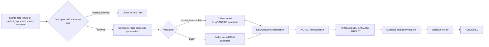

<!-- [KFM_META_BLOCK_V2]
doc_id: kfm://doc/connectors-loc-tests-readme
title: connectors/loc/tests/ — Library of Congress Greenfield Connector Test Boundary
type: readme
version: v0.2
status: draft
owners: OWNER_TBD — Connector steward · Package maintainer · Test steward · LOC source steward · Archives steward · People-DNA-Land steward · Genealogy steward · Rights reviewer · Privacy/sensitivity reviewer · CARE/cultural review steward · Security reviewer · Validation steward · Docs steward
created: 2026-06-19
updated: 2026-07-13
policy_label: public-doctrine; tests; greenfield-scaffold; candidate-family; beyond-directory-rules-7-3; open-dsc-10; no-network; fixture-safe; rights-fail-closed; sensitivity-fail-closed; care-review; security-negative-tests; lifecycle-boundary; no-activation; no-publication
current_path: connectors/loc/tests/README.md
truth_posture: CONFIRMED README-only named test lane, absent conventional conftest and test modules, merged v0.2 LOC package and source-layout boundaries, 0.0.0 project metadata, empty initializer, comment-only fetch and admit modules, nonconforming four-field local descriptor, TODO-only connector workflows, empty source-authority register, and canonical OPEN-DSC-10 placement question / CONFLICTED final LOC connector-family placement, test and fixture topology, SourceDescriptor schema authority, machine source-role vocabulary, product dispatch, and source-page naming / PROPOSED executable test contract / UNKNOWN pytest configuration, test runner dependencies, fixtures, executable coverage, substantive CI, source activation, deployment, and release readiness
evidence_snapshot:
  repository: bartytime4life/Kansas-Frontier-Matrix
  base_ref: main
  base_commit: eb4205ad509d7962850a2c55d60ac6eda001fa59
  prior_blob: cf93248d5e08e13e22b75fabed53cb2ae3f3122a
related:
  - ../README.md
  - ../pyproject.toml
  - ../src/README.md
  - ../src/loc/README.md
  - ../src/loc/__init__.py
  - ../src/loc/fetch.py
  - ../src/loc/admit.py
  - ../src/loc/descriptor.yaml
  - ../../../CONTRIBUTING.md
  - ../../../.github/CODEOWNERS
  - ../../../.github/workflows/connector-gate.yml
  - ../../../.github/workflows/source-descriptor-validate.yml
  - ../../../docs/doctrine/directory-rules.md
  - ../../../docs/adr/ADR-0001-schema-home--schemas-contracts-v1-is-canonical.md
  - ../../../docs/adr/ADR-0012-connector-outputs-to-data-raw-or-data-quarantine-only.md
  - ../../../docs/sources/SOURCE_DESCRIPTOR_STANDARD.md
  - ../../../docs/sources/catalog/OPEN-QUESTIONS.md
  - ../../../docs/sources/catalog/loc/README.md
  - ../../../docs/sources/catalog/loc/loc-iiif-presentations.md
  - ../../../docs/sources/catalog/loc/loc-historic-maps.md
  - ../../../docs/sources/catalog/loc/lcnaf-name-authority.md
  - ../../../docs/sources/catalog/loc/lcsh-subject-headings.md
  - ../../../docs/sources/catalog/loc/chronicling-america.md
  - ../../../contracts/source/source_descriptor.md
  - ../../../schemas/contracts/v1/source/source_descriptor.schema.json
  - ../../../schemas/contracts/v1/sources/source_descriptor.schema.json
  - ../../../data/registry/sources/README.md
  - ../../../control_plane/source_authority_register.yaml
  - ../../../fixtures/README.md
  - ../../../tests/fixtures/README.md
  - ../../../policy/rights/README.md
  - ../../../policy/sensitivity/README.md
  - ../../../policy/sources/
  - ../../../release/
tags: [kfm, connectors, loc, library-of-congress, tests, pytest, greenfield, candidate-family, archives, lcnaf, lcsh, iiif, historic-maps, chronicling-america, linked-data, ocr, georeferencing, authority-control, no-network, fixtures, rights, sensitivity, care, security, raw, quarantine, lifecycle, governance]
notes:
  - "Exact probes at the evidence snapshot found no `conftest.py`, `test_fetch.py`, `test_admit.py`, or `test_descriptor.py` under this test lane. This is a README-only test boundary at the named paths; executable coverage is not established."
  - "The canonical source-catalog open-question register assigns LOC family placement to OPEN-DSC-10, not OPEN-DSC-14. OPEN-DSC-10 is deferred pending an ADR per archival/genealogy family plus CARE and sensitivity review."
  - "The LOC package is a 0.0.0 scaffold with no implemented fetch or admission behavior. Tests must not simulate maturity by asserting against imagined APIs or by treating placeholder comments as callable contracts."
  - "The package-local descriptor is nonconforming and cannot be used as a positive activation fixture. Unknown role, rights, sensitivity, CARE, source identity, or activation state must produce deny, abstain, or quarantine-oriented expectations."
  - "The connector-gate and source-descriptor-validate workflows execute TODO echo steps. Green workflow completion is not evidence that LOC tests ran or that package, descriptor, rights, lifecycle, or release boundaries were enforced."
  - "Only this Markdown file is changed. No test, fixture, package code, project metadata, descriptor, registry entry, schema, contract, policy, workflow, source access, activation decision, lifecycle object, receipt, proof, release object, path move, or public artifact is created or changed."
[/KFM_META_BLOCK_V2] -->

<a id="top"></a>

# Library of Congress Greenfield Connector Test Boundary

> [!IMPORTANT]
> **Document lifecycle:** `draft v0.2`  
> **Current test maturity:** README-only test lane at the named probes; no executable LOC connector tests established  
> **Package maturity:** repository-present `0.0.0` greenfield scaffold with no supported fetch or admission behavior  
> **Family posture:** `connectors/loc/` is a candidate family beyond the established §7.3 set; disposition is `DEFERRED` under `OPEN-DSC-10`  
> **Authority:** test documentation only; no source, descriptor, policy, lifecycle, evidence, activation, release, or publication authority  
> **Boundary:** no default network, no credentials, no unsafe source payloads, no false coverage claims, no source activation, and no publication.

> [!WARNING]
> A test README, a green workflow, a skipped test, a mocked success response, a public endpoint, a package directory, or a `0.0.0` declaration is not proof of implementation, source authority, current rights, CARE review, activation, lifecycle safety, or release readiness.

<p>
  
  
  
  
  
  
  
  
</p>

**Quick links:** [Purpose](#purpose) · [Authority](#authority-level) · [Current state](#current-test-state) · [Family placement](#loc-family-placement-and-open-dsc-10) · [What belongs](#what-belongs-here) · [Exclusions](#what-does-not-belong-here) · [Test principles](#test-principles) · [Required suites](#required-test-suites) · [Surface matrix](#loc-source-surface-test-matrix) · [Fixtures](#fixture-contract) · [Network and secrets](#network-and-secret-safety) · [Security](#security-negative-tests) · [Lifecycle](#lifecycle-and-publication-tests) · [Outcomes](#test-outcomes-and-coverage-claims) · [CI](#ci-boundary) · [Evidence](#evidence-basis) · [Review](#review-burden) · [ADRs](#adr-and-migration-triggers) · [Definition of done](#definition-of-done) · [Rollback](#rollback) · [Backlog](#verification-backlog)

---

## Purpose

`connectors/loc/tests/` is the connector-local test boundary for the current Library of Congress greenfield scaffold.

Its responsibilities are to:

1. make the absence of executable LOC tests visible rather than implied;
2. define the minimum evidence required before package behavior, source access, admission, or CI enforcement can be claimed;
3. protect the no-network, no-secret, caller-owned-candidate, and no-publication boundaries;
4. keep LCNAF, LCSH, IIIF, historic-map, Chronicling America, and id.loc.gov behavior testable without collapsing their meanings;
5. require product-specific rights, sensitivity, CARE, source-head, uncertainty, and provenance cases;
6. require negative tests for malformed, unsafe, oversized, ambiguous, or unauthorized inputs;
7. prevent TODO-only workflows, skipped suites, or mocked happy paths from being presented as implementation maturity;
8. keep fixture, schema, registry, policy, evidence, and release authority outside this test directory;
9. preserve reversible migration while LOC family placement and package topology remain unresolved.

This README does not establish a test runner, test dependency, fixture root, command, marker vocabulary, coverage threshold, source endpoint, package API, or release rule. Those remain **PROPOSED / NEEDS VERIFICATION** until supported by repository evidence and accepted decisions.

[Back to top](#top)

---

## Authority level

**Documentation-only test boundary inside a deferred candidate connector family.**

| Concern | Status | Evidence-bounded determination |
|---|---:|---|
| Responsibility root | **CONFIRMED** | Connector-local tests may live beside source-specific code; canonical contracts, schemas, registries, policies, lifecycle state, evidence, and release controls remain in their owning roots. |
| Test path | **CONFIRMED** | `connectors/loc/tests/README.md` exists at the evidence snapshot. |
| Executable tests | **NOT ESTABLISHED AT NAMED PROBES** | Exact probes found no `conftest.py`, `test_fetch.py`, `test_admit.py`, or `test_descriptor.py`. Differently named or unindexed tests remain `UNKNOWN`. |
| Test framework and dependencies | **UNKNOWN** | The LOC `pyproject.toml` declares only project name and version; it does not establish pytest, plugins, coverage tools, markers, or test commands. |
| Package behavior under test | **ABSENT** | `fetch.py` and `admit.py` are comment-only; `__init__.py` is empty. No callable LOC behavior is established. |
| Local descriptor fixture | **NONCONFORMING / NEGATIVE CASE ONLY** | `name`, `role: TBD`, `rights: TBD`, and `sensitivity_floor: public` cannot activate a source or serve as a passing descriptor fixture. |
| Fixture home | **CONFLICTED / NEEDS VERIFICATION** | Repository roots for fixtures exist, but no accepted LOC-specific fixture placement or inventory was verified. |
| LOC family placement | **DEFERRED** | The canonical register assigns LOC to `OPEN-DSC-10`; family promotion requires an ADR plus CARE and sensitivity review. |
| SourceDescriptor authority | **CONFLICTED / OUTSIDE TESTS** | Available schema surfaces disagree on canonicality and enforceable shape; tests must not choose authority by convenience. |
| Machine source authority | **NOT ESTABLISHED** | The inspected source-authority register contains `entries: []`. |
| CI enforcement | **TODO-ONLY** | Current connector and descriptor workflows execute echo commands, not LOC tests or substantive validation. |
| Live source tests | **DENIED BY DEFAULT** | No reviewed endpoints, credentials, terms, activation state, rate policy, or live-test isolation contract was verified. |
| Publication authority | **NONE** | Test success cannot create a public claim, EvidenceBundle, proof, release decision, or published artifact. |
| Owners | **UNKNOWN** | `OWNER_TBD` remains deliberate until test-, package-, source-, rights-, CARE-, and security ownership is accepted. |

[Back to top](#top)

---

## Current test state

The bounded repository state at commit `eb4205ad509d7962850a2c55d60ac6eda001fa59` is:

```text
connectors/loc/
├── README.md                         # candidate-family documentation; separate update scope
├── pyproject.toml                    # kfm-connector-loc, version 0.0.0 only
├── src/
│   ├── README.md                     # v0.2 source-layout boundary
│   └── loc/
│       ├── README.md                 # v0.2 package boundary
│       ├── __init__.py               # empty
│       ├── fetch.py                  # comment-only placeholder
│       ├── admit.py                  # comment-only placeholder
│       └── descriptor.yaml           # four-field nonconforming placeholder
└── tests/
    └── README.md                     # this test boundary
```

Exact named probes returned `Not Found`:

```text
connectors/loc/tests/conftest.py
connectors/loc/tests/test_fetch.py
connectors/loc/tests/test_admit.py
connectors/loc/tests/test_descriptor.py
```

These are bounded absence statements. They establish that conventional tests at these paths do not exist at the snapshot. They do not prove that every differently named, generated, external, or later-added test is absent.

### Current workflow evidence

```text
.github/workflows/connector-gate.yml
  echo TODO connector-output-gate
  echo TODO ingest-receipt-presence

.github/workflows/source-descriptor-validate.yml
  echo TODO validate-descriptors
  echo TODO rights-presence
```

A green run of these workflows proves only that the echo commands ran.

### Current descriptor evidence

```yaml
# connectors/loc/src/loc/descriptor.yaml
name: loc
role: TBD
rights: TBD
sensitivity_floor: public
```

This file is suitable only as a **negative fixture candidate** showing that unresolved, underspecified local metadata must be rejected or quarantined. It is not a passing descriptor, authority entry, activation decision, rights review, sensitivity classification, CARE review, or public-release approval.

[Back to top](#top)

---

## LOC family placement and `OPEN-DSC-10`

The canonical source-catalog open-question register assigns LOC to:

```text
OPEN-DSC-10 — candidate families: archival and genealogy
```

The register states:

- the question includes Library of Congress, FamilySearch, AHGP, and Newspapers;
- status is `DEFERRED`;
- resolution requires an ADR per family;
- archival and genealogy sources additionally require CARE and sensitivity review.

The prior test README incorrectly cited `OPEN-DSC-14`. `OPEN-DSC-14` concerns a different second-wave family set and is not the LOC placement question.

Tests must therefore verify the current negative boundary:

- directory presence does not ratify LOC as canonical;
- package import, successful parsing, or a green test does not resolve `OPEN-DSC-10`;
- family migration or retention requires an accepted decision and compatible test updates;
- CARE and sensitivity gates cannot be bypassed by classifying a source as public or federal.

[Back to top](#top)

---

## What belongs here

Once implementation is separately authorized, this lane may contain:

- connector-local unit and integration tests for the accepted LOC package API;
- no-network guards and transport doubles;
- deterministic tests for product identity, source-head preservation, checksums, and finite outcomes;
- negative descriptor and activation tests;
- references to canonical, rights-safe LOC fixtures;
- parsers' valid and invalid cases for accepted LOC representations;
- product-specific rights, attribution, sensitivity, CARE, and uncertainty tests;
- security tests for URL handling, redirects, content limits, archives, and parsing;
- lifecycle-boundary tests proving caller-owned candidate output and denial of direct persistence;
- migration and compatibility tests tied to accepted family/package decisions;
- test-local helper code that has no independent schema, policy, registry, fixture, evidence, or release authority;
- documentation explaining exact test commands, markers, expected skips, and coverage claims after those mechanisms exist.

Each executable test should identify the contract, policy, product, threat, or lifecycle boundary it protects.

## What does not belong here

This directory must not contain or imply authority over:

- source activation, credentials, production cookies, private tokens, signed URLs, or account data;
- live network calls in default test execution;
- unrestricted copies of LOC exports, images, OCR corpora, manifests, authority dumps, or maps;
- living-person, family-history, culturally sensitive, restricted, private, or harmful exact-location data unless explicitly minimized and approved;
- canonical `SourceDescriptor` records, schema definitions, policy decisions, source-authority entries, or role vocabularies;
- production lifecycle writes, catalog entries, triplets, EvidenceBundles, proofs, receipts, release manifests, or published artifacts;
- tests that mutate canonical stores or depend on an existing developer machine state;
- tests that declare successful retrieval equivalent to admission, truth, completeness, evidence closure, or release;
- generated summaries treated as expected authoritative output;
- snapshots containing secrets, access headers, unredacted rights-sensitive text, or harmful joins;
- hidden network fallback when fixtures are missing;
- broad fixture corpora copied into this lane merely for convenience;
- coverage badges or CI claims not backed by observed substantive runs.

[Back to top](#top)

---

## Test principles

### 1. Cite the behavior under test

Every test family should point to an accepted contract, schema, policy, ADR, package API, product requirement, or lifecycle invariant. A README statement alone is not enough to invent a callable interface.

### 2. No network by default

Default imports, unit tests, documentation checks, and ordinary CI must fail if they attempt external network access. Live-source checks, if ever approved, require separate configuration, isolation, rate controls, terms review, secrets handling, and explicit execution.

### 3. Fail closed

Unknown product identity, descriptor authority, activation state, rights, sensitivity, CARE posture, source role, source head, uncertainty, or output boundary must not become a passing admission case.

### 4. Preserve source meaning

Tests must distinguish source bytes, source metadata, OCR, georeferencing, authority records, crosswalks, generated interpretations, and public derivatives.

### 5. Deterministic fixtures

Identical fixture bytes plus identical configuration should produce identical normalized candidates, findings, finite outcomes, and hashes where the accepted contract requires them.

### 6. Negative cases are first-class

Malformed, incomplete, conflicting, oversized, unsafe, rights-unknown, sensitivity-unknown, or culturally restricted cases require explicit expectations. A happy-path-only suite is insufficient.

### 7. Test the trust membrane

Connector tests must prove the package cannot bypass caller-owned orchestration, downstream validation, policy, evidence closure, or release review.

### 8. Honest coverage

Skipped, xfailed, mocked, or TODO tests must remain visible. They do not count as evidence of implemented behavior unless the governing test policy explicitly says otherwise.

[Back to top](#top)

---

## Required test suites

The following suites are **PROPOSED requirements**, not claims that test files or APIs already exist.

| Suite | Minimum behavior to prove | Required failure posture |
|---|---|---|
| Package metadata and import | Accepted build metadata, package discovery, supported Python, and import surface work without side effects. | Fail when package metadata is incomplete or import triggers network/persistence. |
| No-network default | Ordinary test execution cannot create external sockets or HTTP requests. | Immediate test failure with a clear attempted destination. |
| Configuration and secrets | Configuration is explicit, validated, and redacted in errors/logs. | Reject missing or malformed config; never reveal secret values. |
| Descriptor conformance | Product-level descriptors validate against the accepted machine schema. | Reject the current four-field placeholder and unresolved role/rights values. |
| Activation gate | Fixture-only, disabled, restricted, and live modes obey accepted activation state. | Deny or abstain when activation evidence is absent. |
| Product identity | Exact LOC surface/product identity survives fetch, parse, and handoff. | Reject ambiguous or silently switched products. |
| Source head and integrity | Checksums, revisions, manifest IDs, `ETag`, `Last-Modified`, or equivalent source-head signals are preserved where supported. | Quarantine mismatches; no silent refresh or overwrite. |
| Rights and attribution | Source- and asset-level rights, required attribution, redistribution, caching, and derivative limits survive. | Quarantine or deny unknown/conflicting rights. |
| Privacy, sensitivity, and CARE | Living-person, family-history, cultural, archaeological, private annotation, and join-induced risks are detected and routed. | Deny, restrict, generalize, or quarantine according to accepted policy. |
| Source-role separation | Authority, subject vocabulary, image, OCR, map, linked-data, and derived roles remain distinct. | Reject role collapse and unsupported truth upgrades. |
| Uncertainty | OCR confidence, georeferencing error, identity-match confidence, crosswalk confidence, and missing values remain explicit. | Quarantine or abstain when required uncertainty is absent. |
| Finite outcomes | Accepted outcome and reason-code vocabulary is deterministic and complete. | Reject implicit fallback, silent `None`, or unclassified exceptions. |
| Security | URL, redirect, SSRF, archive, decompression, traversal, content-type, encoding, and response-size controls work. | Deny unsafe input without external side effects. |
| Lifecycle boundary | Package returns caller-owned candidates/findings and cannot select or write lifecycle sinks. | Fail on writes to RAW, WORK, QUARANTINE, PROCESSED, catalog, proof, receipt, release, or published roots. |
| Publication denial | Connector success is never labeled released or public. | Fail any direct public artifact, UI payload, release state, or publication claim. |
| Replay and correction | Same source head supports no-op/replay; changed or withdrawn sources preserve correction and supersession lineage. | Reject destructive overwrite and untraceable replacement. |
| Migration | Package/family rename or relocation preserves source IDs, imports, receipts, fixtures, tests, links, warnings, and rollback. | Fail on silent aliases or parallel authority. |

[Back to top](#top)

---

## LOC source-surface test matrix

Each LOC surface requires its own product identity and test expectations. Shared institutional branding is not a reason to reuse one role, rights state, parser, or fixture.

| Surface | Required distinctions | Representative positive cases | Representative negative cases |
|---|---|---|---|
| **LCNAF** | Name authority, variants, identifiers, authority status, match lineage; not biography or occurrence truth. | Preserve source heading, variants, LCNAF IRI, source head, and match provenance. | Auto-merging two people from string similarity; inventing dates/places; treating authority absence as identity proof. |
| **LCSH** | Subject authority and historical terminology; not canonical KFM ontology by default. | Preserve source concept ID, preferred/variant labels, version, and crosswalk lineage. | Silent replacement of contested or historical terms; irreversible crosswalk; treating subject assignment as factual event evidence. |
| **IIIF presentations** | Manifest bytes, canvases, image services, metadata, rights, and asset identity remain distinct. | Hash exact manifest bytes; preserve manifest/canvas IDs and rights statements. | Assuming image rights from manifest availability; fetching unbounded image services; treating metadata as verified narrative truth. |
| **Historic maps** | Source map, control points, transformation, warped derivative, scale, and uncertainty remain distinct. | Preserve source map identity, annotation provenance, transform method, residual/error metrics, and version. | Publishing warped geometry as current canonical geometry; missing control-point provenance; unsupported scale claims. |
| **Chronicling America** | Page image, OCR, issue/page identity, layout, confidence, and extracted entities/events remain distinct. | Preserve image/OCR linkage, issue date, page ID, OCR confidence, and derivation metadata. | Treating OCR as verified transcription; emitting extracted names/events without evidence and confidence; dropping correction lineage. |
| **id.loc.gov linked data** | Stable IRIs, content negotiation, redirects, representations, and graph assertions remain explicit. | Preserve requested IRI, resolved IRI, representation media type, source head, and retrieved bytes. | Redirect loops, unsafe schemes/hosts, auto-merging graph entities, treating one relation as complete identity proof. |

The exact formats, endpoints, modules, and APIs remain **NEEDS VERIFICATION**. Tests must follow accepted product contracts rather than infer behavior from product-page prose alone.

[Back to top](#top)

---

## Fixture contract

No accepted LOC-specific fixture inventory or final fixture home was verified in this update. Until placement is resolved, fixture references must remain explicit and reversible.

### Required fixture qualities

- synthetic, minimized, redacted, generalized, or explicitly rights-cleared;
- no credentials, cookies, private URLs, signed URLs, authorization headers, or source-account metadata;
- exact byte identity and checksum recorded where deterministic behavior depends on bytes;
- source surface, product, representation, version, and expected role stated;
- rights, attribution, sensitivity, CARE, living-person, cultural, and locality posture declared;
- valid and invalid fixtures paired where possible;
- expected outcome and stable reason stated;
- no assumption that source-public means derivative-public;
- no unrestricted bulk source dumps;
- no exact harmful locations or private annotations;
- no generated output used as the only oracle for source truth.

### Minimum fixture families

1. valid and malformed SourceDescriptor candidates;
2. disabled, fixture-only, restricted, and denied activation states;
3. valid, malformed, truncated, and oversized representations;
4. unknown, conflicting, and restricted rights cases;
5. living-person, family-history, CARE, and cultural-review cases;
6. LCNAF and LCSH identity/crosswalk disagreements;
7. IIIF manifest rights and source-head changes;
8. historic-map control-point and uncertainty failures;
9. OCR confidence, encoding, layout, and correction cases;
10. redirect, unsafe URL, content-type, decompression, and path-traversal cases;
11. no-op, correction, withdrawal, supersession, and replay cases;
12. lifecycle-write denial cases.

A fixture registry or manifest should be adopted before fixture count grows. That registry must record source, rights, sensitivity, purpose, checksum, expected outcome, and review state without becoming a parallel source registry.

[Back to top](#top)

---

## Network and secret safety

Default test execution must be hermetic.

Required controls include:

- fail when DNS, sockets, HTTP clients, subprocess fetchers, or cloud SDKs attempt external access;
- permit only explicit in-process fixtures or reviewed local test servers;
- prevent fallback to a live URL when a fixture is missing;
- scrub authorization headers, cookies, tokens, signed parameters, and private URLs from failures and snapshots;
- avoid reading developer home directories, browser stores, global credentials, or ambient cloud metadata;
- use explicit temporary directories and caller-controlled environment;
- restore patched environment and network state after each test;
- keep live-source checks in a separately approved workflow with independent secrets and no publication authority;
- treat successful live access as operational evidence only, not source activation, rights clearance, or release approval.

[Back to top](#top)

---

## Security negative tests

Future substantive coverage should include, as applicable to accepted implementations:

| Threat | Test expectation |
|---|---|
| SSRF | Reject loopback, link-local, metadata-service, private-network, unsupported scheme, and policy-denied destinations. |
| Redirect abuse | Enforce hop limits, revalidate every destination, and reject scheme/host downgrades. |
| Oversized response | Stop before unbounded memory/disk growth; return a stable deny/error outcome. |
| Compression bomb | Enforce compressed and expanded size limits plus member-count limits. |
| Archive traversal | Reject absolute paths, `..`, links, device files, and writes outside a test-owned directory. |
| Content-type mismatch | Reject or quarantine bytes that do not match the accepted representation contract. |
| Encoding hazards | Handle invalid, mixed, or deceptive encodings without silent data loss or code execution. |
| Parser depth/complexity | Enforce structural limits for deeply nested or adversarial input. |
| Log injection | Escape or structure untrusted values; never let source text forge log fields. |
| Secret disclosure | Assert that exceptions, snapshots, traces, and receipts do not contain configured secrets. |
| Path injection | Reject source-derived filenames or identifiers that escape caller-owned staging. |
| Unsafe deserialization | Do not execute source-controlled objects, templates, expressions, or code. |

Security tests must be deterministic and must not probe real third-party infrastructure.

[Back to top](#top)

---

## Lifecycle and publication tests

Tests must enforce the lifecycle separation:



Connector-local tests should prove:

- package functions, if implemented, return values rather than selecting repository paths;
- no direct write occurs to lifecycle or authority roots;
- no returned object claims `processed`, `cataloged`, `evidence-closed`, `released`, or `published` status;
- downstream references are caller-supplied and validated rather than hard-coded;
- failed or ambiguous inputs produce finite, inspectable outcomes;
- correction, withdrawal, replay, and supersession metadata can survive handoff;
- public clients cannot import the package as a normal data source;
- no test promotes fixture output into `data/published/` or `release/`.

[Back to top](#top)

---

## Test outcomes and coverage claims

### Result vocabulary

The exact package outcome enum is not yet accepted. Tests should not freeze an invented vocabulary. A future contract may include concepts such as:

- candidate admitted for downstream RAW review;
- candidate held for quarantine;
- deny;
- abstain;
- no-op for an unchanged source head;
- rate-limited or deferred retry;
- operational error.

Whatever vocabulary is accepted must be finite, machine-readable, documented, and paired with stable reason codes.

### Coverage claims

- **PASS** means the test executed the intended assertion against implemented behavior.
- **SKIP** means the behavior was not tested in that run and must not count as coverage evidence.
- **XFAIL** requires a linked, accepted issue and must not hide a missing safety boundary.
- **MOCKED** network success proves local handling of the mock only; it does not prove current endpoint compatibility.
- **LIVE** checks, if approved, prove only the observed interaction at the recorded time and configuration.
- **GREEN CI** proves substantive coverage only when workflow steps run the actual test suite and surface failures.
- **COVERAGE PERCENTAGE** is meaningful only after executable code, collection scope, exclusions, and branch criteria are defined.

Test reports should identify commit, environment, command, collected tests, passes, failures, skips, xfails, duration, and artifact digests when relevant.

[Back to top](#top)

---

## CI boundary

The current workflows are placeholders. They do not run LOC tests.

Before CI may be described as substantive, it should:

1. install the package using accepted project metadata;
2. collect the intended LOC test suite and fail when zero tests are collected unexpectedly;
3. enforce no-network default behavior;
4. validate accepted SourceDescriptor fixtures against the accepted schema;
5. run rights, sensitivity, CARE, source-role, and activation negative cases;
6. run product-specific parser and uncertainty suites;
7. run security negative tests;
8. prove lifecycle-write denial;
9. publish inspectable test and coverage artifacts without secrets;
10. pin or govern action versions according to repository policy;
11. distinguish required checks from informational checks;
12. fail on unexpected skips, missing fixtures, or TODO-only substitutions where policy requires.

A proposed local command may eventually resemble:

```text
python -m pytest connectors/loc/tests -q
```

That command is **PROPOSED**, not verified. No pytest dependency, configuration, marker set, or executable suite was established in this update.

[Back to top](#top)

---

## Evidence basis

| Evidence | Status | Supports | Does not prove |
|---|---:|---|---|
| `connectors/loc/tests/README.md` prior blob | **CONFIRMED** | Target existed as v0.1 test-boundary documentation. | Executable tests, passing results, or CI. |
| Exact conventional test probes | **CONFIRMED bounded absence** | No `conftest.py`, `test_fetch.py`, `test_admit.py`, or `test_descriptor.py` at the snapshot. | Absence of every differently named or external test. |
| `connectors/loc/pyproject.toml` | **CONFIRMED** | Project name `kfm-connector-loc` and version `0.0.0`. | Buildability, test dependencies, supported Python, or commands. |
| `connectors/loc/src/README.md` | **CONFIRMED v0.2** | Verified source layout, placeholder package state, `OPEN-DSC-10`, and test absence boundary. | Executable behavior or test coverage. |
| `connectors/loc/src/loc/README.md` | **CONFIRMED v0.2** | Package semantics, current scaffold, required future test families, and lifecycle boundary. | Implemented APIs, current endpoints, or passing tests. |
| `__init__.py` | **CONFIRMED empty** | No package API or import-time behavior. | Future package design. |
| `fetch.py` and `admit.py` | **CONFIRMED comment-only** | No implemented retrieval or admission behavior. | Accepted future interfaces. |
| `descriptor.yaml` | **CONFIRMED nonconforming placeholder** | Negative case with unresolved role and rights. | Descriptor authority, activation, or public posture. |
| `docs/sources/catalog/OPEN-QUESTIONS.md` | **CONFIRMED canonical register** | LOC belongs under `OPEN-DSC-10`, status `DEFERRED`, with ADR plus CARE/sensitivity resolution. | Final family placement. |
| LOC catalog family and product pages | **CONFIRMED mixed draft doctrine** | Source-surface distinctions and intended preservation concerns. | Current endpoint health, accepted descriptors, code, fixtures, or release. |
| Singular SourceDescriptor schema | **CONFIRMED populated / self-described legacy path** | Rich required field set and migration metadata. | Final schema authority. |
| Plural SourceDescriptor schema | **CONFIRMED empty PROPOSED scaffold** | Path exists. | Enforceable validation. |
| Source-authority register | **CONFIRMED empty** | `entries: []` at the snapshot. | Absence of every source record outside that file. |
| Connector and descriptor workflows | **CONFIRMED TODO-only** | Workflow triggers and echo steps exist. | Test execution or enforcement. |

Where evidence conflicts, tests must preserve the conflict or fail closed. They must not silently choose a schema, role, path, fixture home, product topology, or release state.

[Back to top](#top)

---

## Review burden

A future executable test suite requires review from:

| Reviewer role | Required review |
|---|---|
| Test steward | Test architecture, collection, markers, deterministic behavior, skip/xfail policy, reports, and coverage claims. |
| Connector steward | Package boundary, finite outcomes, no-network posture, configuration, and lifecycle separation. |
| Package maintainer | Supported imports, APIs, dependencies, typing, errors, and packaging behavior. |
| LOC source steward | Product identities, representations, source heads, cadence, endpoints, and source-specific expected behavior. |
| Archives steward | Archival description, collection context, source provenance, correction, and OCR/image distinctions. |
| People-DNA-Land / Genealogy stewards | Identity joins, family-history use, living-person implications, authority ladders, and sensitive relationships. |
| Rights reviewer | Fixture rights, redistribution, derivative use, caching, retention, and attribution expectations. |
| Privacy/sensitivity reviewer | Living-person data, exact locations, harmful joins, private annotations, and minimization. |
| CARE/cultural reviewer | Cultural authority, sovereignty, community governance, contested terminology, and staged-access cases. |
| Security reviewer | Network isolation, secrets, URL controls, SSRF, redirects, parser limits, archives, traversal, and logging. |
| Validation steward | Contract/schema checks, negative matrices, reason-code stability, lifecycle denial, replay, and correction tests. |
| Docs steward | Truth labels, links, test commands, open-question identifiers, migration notes, and rollback clarity. |

The package author must not unilaterally define passing rights, sensitivity, CARE, activation, evidence, and release expectations.

[Back to top](#top)

---

## ADR and migration triggers

An accepted ADR or equivalent governed decision is required before tests ratify or depend on:

- LOC becoming a canonical connector family;
- a final distribution, import, package, or product-dispatch topology;
- a new test or fixture authority root;
- one SourceDescriptor schema or source-role vocabulary as machine authority;
- product descriptor and activation formats;
- live-source test execution;
- credentials or restricted fixtures in CI;
- lifecycle persistence from connector code;
- public authority, OCR, map, event, or linked-data outputs;
- weakened CARE, cultural, living-person, archaeological, rights, or sensitivity controls;
- compatibility aliases or package moves that may create parallel APIs.

The decision should identify affected tests, fixtures, source IDs, package imports, workflows, migration order, compatibility window, deprecation warnings, correction behavior, rollback, and required documentation updates.

[Back to top](#top)

---

## Definition of done

This test lane may leave README-only status when:

- [ ] `OPEN-DSC-10` is resolved for LOC or an accepted bounded exception is recorded.
- [ ] Package distribution, import, build, dependency, and product topology are accepted.
- [ ] The supported package API exists and is documented.
- [ ] SourceDescriptor schema authority and machine source-role vocabulary are resolved.
- [ ] Product-level descriptors and activation states exist for each implemented LOC surface.
- [ ] A canonical LOC fixture home and fixture manifest are accepted.
- [ ] Fixtures are synthetic, minimized, redacted, public-safe, or explicitly rights-cleared.
- [ ] Conventional or otherwise documented executable tests are present and collected.
- [ ] No-network, configuration, secret, descriptor, activation, product, source-head, integrity, rights, sensitivity, CARE, uncertainty, security, lifecycle, replay, correction, and migration suites are substantive.
- [ ] LCNAF, LCSH, IIIF, historic-map, Chronicling America, and linked-data distinctions are tested where implemented.
- [ ] Test outcome and stable reason-code contracts are accepted.
- [ ] CI installs the package, fails on zero/unexpected collection, runs real tests, and publishes inspectable results.
- [ ] CI no longer relies on TODO echo steps for the relevant gates.
- [ ] Skips, xfails, live checks, and mocked checks are truthfully reported.
- [ ] No test writes canonical lifecycle, evidence, release, or published state.
- [ ] No passing test is treated as source activation, evidence closure, or public release.
- [ ] Migration, deprecation, correction, withdrawal, supersession, and rollback paths are tested.

Until these conditions are met, the accurate status is **README-only test boundary; executable coverage not established**.

[Back to top](#top)

---

## Rollback

Rollback this README if it is used to justify:

- executable test coverage that does not exist;
- green CI enforcement from TODO-only workflows;
- live-source access in default tests;
- canonical LOC family status;
- descriptor, role, rights, sensitivity, or CARE authority inside tests;
- unsafe, unrestricted, secret-bearing, or rights-unclear fixtures;
- direct lifecycle, proof, receipt, release, or publication writes;
- source-surface collapse;
- public identity, OCR, map, event, archival, or linked-data claims;
- implementation maturity without observed package and test results.

Repository rollback target:

```text
base commit: eb4205ad509d7962850a2c55d60ac6eda001fa59
prior blob:  cf93248d5e08e13e22b75fabed53cb2ae3f3122a
```

Restoring the prior blob reverses this documentation change. It does not create tests, resolve `OPEN-DSC-10`, or establish CI.

[Back to top](#top)

---

## Verification backlog

| Item | Status | Needed evidence |
|---|---:|---|
| Resolve LOC family placement. | **DEFERRED / OPEN-DSC-10** | Accepted family ADR plus CARE and sensitivity review. |
| Confirm complete test inventory. | **NOT ESTABLISHED AT NAMED PROBES** | Repository tree, test collection output, and reviewed test manifest. |
| Confirm test framework and dependencies. | **UNKNOWN** | Accepted project metadata, lockfile/dependency policy, and observed install/test run. |
| Confirm supported package API. | **ABSENT / GREENFIELD** | Implemented code, package docs, typing, and tests. |
| Resolve SourceDescriptor schema authority. | **CONFLICTED** | Accepted schema/ADR and validator tests. |
| Resolve machine source-role vocabulary. | **CONFLICTED** | Accepted role contract, mappings, and fixtures. |
| Create product-level descriptors and activation fixtures. | **NOT ESTABLISHED** | Registry entries, activation contract, rights/sensitivity/CARE review, and tests. |
| Select LOC fixture home. | **NEEDS VERIFICATION** | Directory Rules check, fixture-root evidence, migration note, and maintainer decision. |
| Verify fixture rights and safety. | **UNKNOWN** | Fixture manifest, rights review, sensitivity/CARE review, checksums, and redaction evidence. |
| Verify no-network enforcement. | **NOT IMPLEMENTED / UNKNOWN** | Network guard tests and observed default CI run. |
| Verify security negative coverage. | **NOT IMPLEMENTED / UNKNOWN** | Test files, fixtures, and observed results. |
| Verify product-specific coverage. | **NOT IMPLEMENTED / UNKNOWN** | LCNAF/LCSH/IIIF/maps/ChronAm/linked-data tests and results. |
| Verify lifecycle-write denial. | **NOT IMPLEMENTED / UNKNOWN** | Sandbox tests and observed failure on forbidden writes. |
| Replace TODO-only CI. | **NEEDS IMPLEMENTATION** | Workflow patch and observed substantive run. |
| Verify source-head no-op, replay, correction, and supersession. | **NOT IMPLEMENTED / UNKNOWN** | Accepted contracts, fixtures, tests, and run artifacts. |
| Verify test ownership. | **UNKNOWN** | CODEOWNERS or accepted ownership record. |
| Verify coverage and reporting policy. | **UNKNOWN** | Accepted thresholds, skip/xfail policy, report format, and CI artifacts. |
| Update adjacent LOC root documentation. | **NEEDS VERIFICATION** | Separate scoped revision correcting `OPEN-DSC-14` and stale maturity language. |

[Back to top](#top)

---

## Maintainer note

Do not add a token happy-path test merely to make CI green. The first useful LOC tests should prove the negative trust boundaries: no network, no activation without governed evidence, no secret leakage, no source-surface collapse, no silent uncertainty loss, no lifecycle write, and no publication shortcut.

[Back to top](#top)
