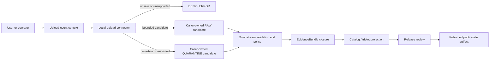

<!-- [KFM_META_BLOCK_V2]
doc_id: kfm://doc/connectors-local-upload-readme
title: connectors/local_upload/ — Local Upload Greenfield Connector and Trust-Edge Boundary
type: readme
version: v0.2
status: draft
owners: OWNER_TBD — Connector steward · Package maintainer · Source-intake steward · Test steward · Fixture steward · Rights reviewer · Privacy/sensitivity reviewer · Security reviewer · Validation steward · Docs steward
created: 2026-06-19
updated: 2026-07-13
policy_label: public-doctrine; connector-family; greenfield-scaffold; local-upload; trust-edge; untrusted-bytes; candidate-source; rights-fail-closed; sensitivity-fail-closed; quarantine-first; no-network; no-activation; no-publication
current_path: connectors/local_upload/README.md
truth_posture: CONFIRMED repository-present 0.0.0 connector scaffold with merged v0.2 source-layout, package-boundary, and test-boundary READMEs, one local_upload package namespace, empty initializer, comment-only fetch/admit modules, nonconforming four-field descriptor, README-only named test lane, absent conventional named tests, empty source-authority register, SourceDescriptor schema conflict, absent named local-upload policy README, and TODO-only connector workflows / PROPOSED fail-closed connector-family contract, upload-event and content-identity model, bounded arbitrary-file handling, caller-owned candidate outcomes, and smallest safe implementation sequence / UNKNOWN differently named modules or tests, package buildability, import behavior, upload surfaces, scanner/parser integration, runtime, activation, substantive CI, deployment, and release readiness
evidence_snapshot:
  repository: bartytime4life/Kansas-Frontier-Matrix
  base_ref: main
  base_commit: 75928dce9d5c850da606c387a020738643b5c6d7
  prior_blob: 20dd0120f84021ebd8266e081ce7fa0335324607
  readme_introduction_commit: d678ce2df1d75ec01d11192dc86bdeeaefd36b1e
related:
  - ../README.md
  - ./pyproject.toml
  - ./src/README.md
  - ./src/local_upload/README.md
  - ./src/local_upload/__init__.py
  - ./src/local_upload/fetch.py
  - ./src/local_upload/admit.py
  - ./src/local_upload/descriptor.yaml
  - ./tests/README.md
  - ../../CONTRIBUTING.md
  - ../../.github/CODEOWNERS
  - ../../.github/workflows/connector-gate.yml
  - ../../.github/workflows/source-descriptor-validate.yml
  - ../../docs/doctrine/directory-rules.md
  - ../../docs/doctrine/trust-membrane.md
  - ../../docs/doctrine/lifecycle-law.md
  - ../../docs/adr/ADR-0012-connector-outputs-to-data-raw-or-data-quarantine-only.md
  - ../../docs/sources/ADMISSION_PROCESS.md
  - ../../docs/sources/catalog/local_upload/README.md
  - ../../docs/sources/catalog/local_upload/user-file-upload.md
  - ../../contracts/source/source_descriptor.md
  - ../../schemas/contracts/v1/source/source_descriptor.schema.json
  - ../../schemas/contracts/v1/sources/source_descriptor.schema.json
  - ../../control_plane/source_authority_register.yaml
  - ../../data/registry/sources/README.md
  - ../../policy/rights/README.md
  - ../../policy/sensitivity/README.md
  - ../../tests/README.md
  - ../../tests/fixtures/README.md
  - ../../fixtures/README.md
  - ../../release/
tags: [kfm, connectors, local-upload, local_upload, upload, intake, trust-edge, untrusted-files, candidate, source-admission, descriptor, rights, sensitivity, privacy, security, provenance, archives, raw, quarantine, no-network, no-publication]
notes:
  - "Direct reads at the pinned base confirm project kfm-connector-local_upload version 0.0.0, one local_upload namespace, an empty __init__.py, comment-only fetch.py and admit.py, and a four-field descriptor.yaml placeholder."
  - "The merged package, source-layout, and test-boundary READMEs are v0.2 and record the same non-operational scaffold, arbitrary-file risk boundary, invalid local descriptor, named test absences, fixture split, and candidate-only output posture."
  - "The local descriptor leaves role and rights unresolved and asserts sensitivity_floor: public. It is not a conforming SourceDescriptor, activation decision, rights decision, sensitivity clearance, or release authorization."
  - "The source catalog treats local upload as the highest-uncertainty intake lane, but catalog defaults and narrative role terms do not replace accepted machine schema, registry, policy, review, or activation authority."
  - "The machine source-authority register contains entries: []; the populated singular SourceDescriptor schema points to an empty plural schema as canonical; the named local-upload policy README is absent; connector workflows execute TODO echo steps."
  - "Only this Markdown file is in scope. No package code, metadata, dependency, descriptor, registry record, policy, schema, fixture, test, workflow, uploaded payload, credential, lifecycle artifact, evidence object, release object, route, or public artifact is created or changed."
[/KFM_META_BLOCK_V2] -->

<a id="top"></a>

# Local Upload Greenfield Connector and Trust-Edge Boundary

> Repository-grounded boundary for `connectors/local_upload/`, KFM's source-admission lane for files supplied by a person or operator rather than fetched from a governed, versioned publisher surface. The connector family exists, but the inspected implementation is a non-operational `0.0.0` scaffold.

**Document lifecycle:** `draft v0.2`  
**Current connector maturity:** `CONFIRMED` greenfield scaffold; supported upload behavior is not established  
**Owner:** `OWNER_TBD`  
**Authority:** connector-family documentation only; no source, contract, schema, policy, lifecycle, evidence, release, or publication authority  
**Default posture:** untrusted bytes · unverified claims · conservative candidate state · rights unresolved · sensitivity restricted until reviewed · quarantine first · no public output

> [!IMPORTANT]
> The repository currently provides an empty initializer, comment-only fetch and admission modules, a nonconforming package-local descriptor, and documentation-only named tests. A directory, README, placeholder YAML file, pull request, merge, or green TODO-only workflow is not implementation evidence.

> [!CAUTION]
> Local upload can introduce almost any data class into KFM: personal or genomic records, precise ecological or archaeological locations, credentials, proprietary documents, active content, malicious archives, hidden metadata, unsafe geometry, or harmful joins. Unknown content, source identity, rights, sensitivity, source role, consent, review state, or public-release posture fails closed.

**Quick links:** [Purpose](#purpose) · [Authority](#authority-level) · [Current state](#current-repository-state) · [Repository fit](#repository-fit) · [Intake surfaces](#intake-surfaces-and-product-boundaries) · [Identity](#upload-event-content-and-source-identity) · [Descriptor](#descriptor-registry-and-activation-boundary) · [What belongs](#what-belongs-here) · [Exclusions](#what-does-not-belong-here) · [Inputs](#inputs) · [Inspection](#bounded-content-inspection) · [Archives](#archive-and-active-content-boundary) · [Sensitive content](#rights-sensitivity-privacy-secrets-and-geometry) · [Outputs](#outputs) · [Failure contract](#failure-contract) · [Lifecycle](#lifecycle-evidence-release-and-publication-boundary) · [Tests and fixtures](#tests-fixtures-and-ci) · [Validation](#validation) · [Evidence](#evidence-basis) · [Review](#review-burden) · [Implementation sequence](#smallest-safe-implementation-sequence) · [Definition of done](#definition-of-done) · [Rollback](#rollback) · [Backlog](#verification-backlog)

---

## Purpose

`connectors/local_upload/` is the source-specific responsibility boundary for admitting files that arrive through a human or operator-controlled submission surface.

Its safe purpose is to support a future connector that:

- receives explicit caller-supplied upload-event context and untrusted bytes or an immutable object reference;
- preserves the distinction between uploader claims and detected properties;
- records content identity without erasing event, actor, consent, rights, or review lineage;
- performs bounded, non-authoritative file and container inspection;
- emits structured findings about integrity, type, archive structure, embedded content, sensitive indicators, and intake risk;
- preserves conservative candidate posture while rights, sensitivity, source role, provenance, and review remain unresolved;
- returns caller-owned admit, hold, quarantine, deny, abstain, no-op, rate-limit, or error candidates;
- stops at the connector boundary.

The connector must never turn a submitted file into truth merely because the bytes were received, parsed, scanned, committed, or reviewed by an administrator.

A filename, extension, MIME type, uploader title, source assertion, license claim, timestamp, coordinate, or narrative is an unverified assertion until governed evidence and review establish otherwise.

[Back to top](#top)

---

## Authority level

**Greenfield source-admission connector family. No independent governance authority.**

| Concern | Status | Evidence-bounded determination |
|---|---:|---|
| Responsibility root | **CONFIRMED** | Directory Rules place source-specific capture, preservation, inspection, parsing, packaging, and admission support under `connectors/`. |
| Current connector path | **CONFIRMED** | `connectors/local_upload/` and the named scaffold files exist at the pinned base. |
| Distribution | **CONFIRMED PLACEHOLDER** | `pyproject.toml` declares `kfm-connector-local_upload` version `0.0.0`; buildability and installability remain unknown. |
| Package namespace | **CONFIRMED** | One `src/local_upload/` namespace is documented and present at the named paths. |
| Current implementation | **GREENFIELD PLACEHOLDER** | `__init__.py` is empty; `fetch.py` and `admit.py` contain comments only. |
| Package-local descriptor | **NONCONFORMING / DENY FOR AUTHORITY USE** | Four minimal fields cannot establish source identity, rights, sensitivity, review, activation, or release. |
| Executable tests | **NOT FOUND AT NAMED PROBES / OTHERWISE UNKNOWN** | The connector test lane is README-only at the conventional paths inspected by the merged v0.2 boundary. |
| Stable local-upload fixtures | **NOT ESTABLISHED** | Root fixture doctrine exists, but the exact local-upload fixture child path and payload inventory remain unresolved. |
| Source authority | **NOT ESTABLISHED** | The machine source-authority register is `PROPOSED` with `entries: []`. |
| Schema authority | **CONFLICTED** | The populated singular SourceDescriptor schema declares the empty plural scaffold canonical. |
| Lane-specific policy | **NOT FOUND AT NAMED PATH** | `policy/sources/local_upload/README.md` was not present at the pinned evidence base. |
| Connector CI | **TODO-ONLY** | Named connector and descriptor workflows execute placeholder `echo TODO` steps. |
| Upload surfaces | **UNKNOWN** | Browser, CLI, watcher, administrative, and staging integrations were not verified as runtime behavior. |
| Source activation | **DENIED / NOT VERIFIED** | No accepted descriptor, policy decision, review state, operation authorization, or activation decision was verified. |
| Public release | **NONE** | This connector cannot approve or emit a public file, preview, map, API response, catalog record, EvidenceBundle, proof, or release. |

Path presence grants responsibility, not authority or maturity.

[Back to top](#top)

---

## Current repository state

### Bounded snapshot

Direct reads at base commit `75928dce9d5c850da606c387a020738643b5c6d7` support this named surface:

```text
connectors/local_upload/
├── README.md                              # this connector-family boundary
├── pyproject.toml                         # kfm-connector-local_upload, version 0.0.0
├── src/
│   ├── README.md                          # source-layout boundary v0.2
│   └── local_upload/
│       ├── README.md                      # package trust-edge boundary v0.2
│       ├── __init__.py                    # empty
│       ├── fetch.py                       # comment-only placeholder
│       ├── admit.py                       # comment-only placeholder
│       └── descriptor.yaml                # four-field placeholder
└── tests/
    └── README.md                          # negative-first test boundary v0.2
```

The merged child boundaries record exact `Not Found` results for conventional test names such as `conftest.py`, fetch/admit/descriptor tests, an archive-safety test, and a connector-local fixture README. Those absence claims are bounded to the named paths and their pinned commits. Differently named or later-added files remain `UNKNOWN` until directly inspected.

### Current maturity table

| Surface | Confirmed state | Safe conclusion |
|---|---|---|
| Parent README | v0.1 before this revision | Stale generic boundary; did not reflect the exact scaffold. |
| `pyproject.toml` | Project name and `0.0.0` only | No build backend, Python constraint, dependency set, discovery rule, entry point, or command is established. |
| `src/README.md` | v0.2 source-layout boundary | Organizes future implementation; does not prove an installable package. |
| Package README | v0.2 trust-edge boundary | Defines arbitrary-file and candidate-output constraints; does not implement them. |
| `__init__.py` | Empty | No public package API or import-time behavior. |
| `fetch.py` | Comment-only | No upload transport, stream capture, hashing, scanner, source-head, or staging behavior. |
| `admit.py` | Comment-only | No validation, disposition, quarantine, receipt, or candidate-handoff behavior. |
| `descriptor.yaml` | `name`, `role: TBD`, `rights: TBD`, `sensitivity_floor: public` | Invalid as descriptor authority, activation, rights clearance, sensitivity clearance, or release evidence. |
| Test README | v0.2 negative-first contract | No runner, collection, pass rate, coverage, or executable security proof follows. |
| Workflows | TODO echo steps | Green execution would prove only that placeholder steps ran. |

There is no supported quickstart because no supported install, command, callable API, upload endpoint, configuration contract, scanner, parser, runner, or lifecycle integration was verified.

[Back to top](#top)

---

## Repository fit

Directory Rules assign one primary responsibility to each root. The local-upload connector must remain subordinate to those boundaries.

| Responsibility | Owning surface | Connector relationship |
|---|---|---|
| Source-specific intake mechanics | `connectors/local_upload/` | This family may eventually implement bounded source-admission mechanics. |
| Human-facing source doctrine | `docs/sources/` | Connector documentation references doctrine; it does not redefine it. |
| Object meaning | `contracts/` | Connector code consumes accepted meanings; local classes do not become contracts. |
| Machine shape | `schemas/` | Connector code validates against accepted schemas; local dictionaries or models do not become schema authority. |
| Source identity and activation | Accepted registry/control-plane surfaces | Connector resolves reviewed references; it cannot activate itself. |
| Rights, sensitivity, privacy, security, access, and release policy | `policy/` | Connector preserves claims and findings; it does not clear risk. |
| Connector-local behavior tests | `connectors/local_upload/tests/` | Tests may prove narrow package mechanics after implementation exists. |
| Cross-system enforceability | Root `tests/` | Canonical proof of lifecycle, policy, evidence, release, correction, rollback, and public-path behavior. |
| Test-local fixtures | `tests/fixtures/` under an accepted child lane | Small fixtures local to tests; exact local-upload child placement remains unresolved. |
| Cross-cutting fixtures | Root `fixtures/` under an accepted child lane | Shared synthetic corpora; not owned by the connector. |
| Lifecycle persistence | `data/` through governed orchestration | Connector returns candidates; an accepted caller performs append-only landing. |
| Evidence closure | Evidence/proof responsibility roots | A file, checksum, scan result, parser result, or intake receipt is not an EvidenceBundle. |
| Release, correction, withdrawal, and rollback | `release/` | Successful intake cannot publish anything. |
| Public applications | Governed API/UI/map roots | Public clients must not invoke the connector or read RAW/QUARANTINE material directly. |

The current path is appropriate by responsibility. It must not become a parallel policy, schema, registry, fixture, receipt, proof, release, or public-data home.

[Back to top](#top)

---

## Intake surfaces and product boundaries

The source catalog describes human-initiated file upload as one product within the `local_upload` family. Other potential surfaces—CLI imports, watcher-detected staging files, administrative submissions, or controlled batch intake—may share connector mechanics while requiring distinct operation authorization, identity, audit, and access controls.

Current runtime presence for these surfaces is **UNKNOWN**.

A future implementation must not collapse all surfaces into one unqualified operation mode. Preserve at least:

| Surface concern | Required distinction |
|---|---|
| Human browser upload | Authenticated or pseudonymous actor context, request/session identity, client-supplied metadata marked untrusted, size and timeout limits. |
| CLI import | Invoking identity, working-directory independence, explicit file/reference input, no ambient credential or sink discovery. |
| Watcher/staging intake | Watch event identity, stable-file detection, duplicate-event handling, non-publisher posture, no automatic promotion. |
| Administrative intake | Stronger audit and separation of duties; administrator status does not grant source, rights, sensitivity, or release authority. |
| Fixture-only mode | Synthetic or reviewed fixtures, no production sinks, no live credentials, no public outputs. |
| Approved restricted production mode | Explicit activation, reviewed policy, bounded access, secure storage, auditability, and caller-owned persistence. |

A silent shared code path must not erase which surface supplied the bytes or which controls applied.

[Back to top](#top)

---

## Upload-event, content, and source identity

A local upload involves identities that must remain separate:

1. **Upload-event identity** — who or what submitted bytes, through which surface, at what time, under which session/run, and with which supplied claims.
2. **Content identity** — the immutable bytes or reproducibly referenced object identified by digest, byte length, and integrity metadata.
3. **Candidate source identity** — the proposed source or artifact identity used during governed review.
4. **Reviewed SourceDescriptor identity** — the accepted registry record and version, when governance creates one.
5. **Derived-record identity** — downstream normalized or interpreted objects, which remain distinct from the upload and source.

A future connector should preserve, where applicable:

- upload event ID and run ID;
- actor reference according to privacy policy;
- submission surface and operation mode;
- received and completed-capture times;
- supplied filename and safe display name, kept distinct;
- supplied and detected media types;
- byte length, digest algorithm, and digest value;
- immutable or reproducible object reference;
- uploader-supplied source, rights, license, date, domain, geography, and sensitivity claims as unverified assertions;
- descriptor reference and version when accepted;
- scanner, parser, classifier, and signature-set versions;
- findings, limits reached, warnings, and disposition reasons;
- duplicate-content, correction, withdrawal, and supersession relationships.

Identical bytes submitted twice may share a content digest while remaining distinct upload events. Deduplication must not erase actor, consent, rights, review, incident, or correction history.

[Back to top](#top)

---

## Descriptor, registry, and activation boundary

The package-local placeholder is:

```yaml
name: local_upload
role: TBD
rights: TBD
sensitivity_floor: public
```

| Placeholder field | Current problem | Required posture |
|---|---|---|
| `name` | Identifies a lane rather than a stable uploaded artifact, event, or reviewed source. | Use accepted deterministic identity conventions after governance ratifies them. |
| `role` | `TBD` is not a reviewed role; uploader claims cannot grant source authority. | Preserve a conservative candidate posture and re-role only through reviewed descriptor state. |
| `rights` | Unresolved scalar placeholder. | Unknown rights fail closed; preserve supplied claims separately from decisions. |
| `sensitivity_floor` | Deprecated/minimal alias with an unsafe permissive value. | Never treat `public` as clearance; content and joins require review. |

The populated singular SourceDescriptor schema expects a richer closed object, but its metadata declares an empty plural scaffold canonical. Until schema authority is resolved:

- do not use the local YAML as source, activation, rights, sensitivity, or release authority;
- do not mint a connector-local replacement schema or registry;
- keep uploader assertions distinguishable from reviewed fields;
- require an accepted descriptor reference or explicit pre-descriptor intake mode;
- require operation authorization before governed admission;
- hold or deny when identity, role, rights, sensitivity, source head, review, or public-release posture is unresolved;
- preserve descriptor version and review lineage rather than mutating earlier decisions in place.

Receiving bytes into a controlled intake boundary is not source activation.

[Back to top](#top)

---

## What belongs here

After contracts, policy, package metadata, and tests are accepted, this connector family may contain:

- one reviewed Python distribution and one primary import namespace;
- source-specific capture, inspection, parsing, and candidate-admission helpers;
- deterministic content identity and byte-count mechanics;
- safe filename/display-name normalization while preserving supplied values;
- bounded magic-byte and container-signature inspection;
- declared-versus-detected media-type findings;
- archive member inventory without unsafe extraction;
- scanner and complex-parser adapter interfaces;
- upload-event and content-identity candidate construction;
- candidate descriptor input preparation without activation;
- preservation of uploader claims as unverified assertions;
- structured rights, sensitivity, privacy, secret, geometry, and content-risk findings;
- finite caller-owned candidate outcomes;
- connector-local behavior tests using synthetic or reviewed fixtures;
- documentation of migration, compatibility, failure, correction, and rollback boundaries.

Each executable component must have a narrow responsibility, bounded resource use, deterministic negative behavior where practical, and no implicit lifecycle or release sink.

[Back to top](#top)

---

## What does not belong here

This connector family must not contain or become:

- a public upload endpoint, UI component, authentication authority, or public file browser;
- source registry, SourceDescriptor authority, activation record, rights decision, sensitivity decision, privacy decision, or release decision storage;
- a second contract, schema, policy, fixture, receipt, proof, catalog, release, or publication home;
- bulk submitted payloads, production uploads, personal exports, genomic files, exact protected locations, proprietary documents, secrets, or malware specimens committed to source control;
- archive extraction into the repository, user home, lifecycle roots, or uploader-derived paths;
- execution of submitted scripts, binaries, macros, notebooks, PDF actions, embedded objects, media callbacks, shell commands, or office automation;
- import-time network access, filesystem mutation, credential discovery, scanner startup, parser startup, or lifecycle side effects;
- normalization, geocoding, OCR, AI interpretation, catalog projection, or domain inference presented as connector truth;
- silent source-role, rights, sensitivity, geometry, review, or release upgrades;
- direct writes to `data/raw/`, `data/quarantine/`, `data/receipts/`, `data/work/`, `data/processed/`, `data/catalog/`, `data/triplets/`, `data/proofs/`, `data/published/`, or `release/` from package code;
- public previews, thumbnails, extracts, maps, downloads, or metadata views before governed access decisions;
- logging that exposes payload bytes, secrets, personal data, exact coordinates, private paths, tokens, or signed URLs.

Administrative convenience is not a trust exception.

[Back to top](#top)

---

## Inputs

### Current

None. The inspected scaffold declares no supported function, command, configuration object, endpoint, credential variable, upload-event contract, scanner contract, parser contract, fixture shape, sink protocol, or runner.

### Future admissible inputs

A retained implementation may accept only explicit caller-supplied inputs such as:

- upload-event context with run identity and actor/access context;
- bounded byte stream, immutable temporary object, or content-addressed reference;
- supplied filename and media type marked untrusted;
- byte, time, CPU, memory, member-count, nesting, page, row, image, and decompression limits;
- accepted descriptor reference or explicit pre-descriptor intake mode;
- operation authorization distinguishing fixture, restricted, and approved production modes;
- reviewed scanner and inspection adapters supplied by dependency injection;
- isolated caller-owned temporary workspace and cleanup policy;
- caller-owned return channels or candidate sinks;
- rights, sensitivity, privacy, secret, geometry, and access context;
- supported-content and deny-list policy references;
- audit context that excludes secrets and payload fragments.

The connector must not discover production sinks, credentials, policies, or public destinations by searching the local machine, environment, repository, or current working directory.

[Back to top](#top)

---

## Bounded content inspection

Content inspection is **PROPOSED** and is not implemented in the named scaffold.

A safe implementation must distinguish:

- **capture** — receiving bytes and calculating integrity metadata;
- **inspection** — reading the minimum bounded structure needed to identify shape and risk;
- **parsing** — producing source-native candidates under an accepted parser contract;
- **normalization** — downstream domain work outside this connector;
- **interpretation** — reviewed analysis outside this connector;
- **publication** — release-plane work outside this connector.

Required controls include:

- stream processing where practical instead of loading arbitrary files wholly into memory;
- hard limits for bytes, wall time, CPU, memory, recursion, member count, extracted size, dimensions, pages, rows, and nested objects;
- declared-versus-detected type comparison;
- explicit unsupported, malformed, truncated, encrypted, password-protected, polyglot, and ambiguous states;
- deterministic outcomes when limits are reached;
- isolated adapters for complex formats, native libraries, scanners, OCR, or models;
- no active-content execution;
- no automatic link, font, media, schema, callback, or external-resource retrieval;
- no trust in EXIF, author fields, timestamps, geotags, hidden sheets, comments, thumbnails, or revision histories without review;
- redacted logs using stable identifiers and reason codes rather than content fragments.

A clean scanner result does not prove rights, sensitivity, truth, or release safety. A recognized type does not prove source role. A successful parse does not prove accuracy.

[Back to top](#top)

---

## Archive and active-content boundary

Archives and compound documents are high-risk. Support is **PROPOSED**, not implemented.

A future connector must fail closed for:

- absolute, parent-traversal, drive-letter, alternate-separator, or ambiguous normalized paths;
- symbolic links, hard links, device files, pipes, sockets, and special filesystem objects;
- duplicate member names, case-folding collisions, Unicode-normalization collisions, and path aliases;
- recursive or deeply nested archives beyond explicit limits;
- excessive member count, compression ratio, expanded size, or cumulative cost;
- encrypted or password-protected members without an accepted restricted workflow;
- executables, scripts, macros, active document content, and unsupported embedded objects;
- member types that conflict with names or declared media types;
- multipart, split, damaged, or unsupported containers;
- hidden files or metadata that violate policy;
- formats requiring network access, unsafe callbacks, or unreviewed native plugins.

Inventory without extraction is preferred. Temporary extraction, when approved, must use a caller-owned isolated workspace, safe path joining, no-follow semantics, bounded permissions, no execution, deterministic cleanup, and an auditable member manifest.

The connector must not unpack directly into source control, lifecycle roots, a user home directory, or a path derived from the submitted filename.

[Back to top](#top)

---

## Rights, sensitivity, privacy, secrets, and geometry

Local upload intersects nearly every sensitive KFM class. The connector may detect and preserve indicators; it cannot clear them.

Treat the following as hold, quarantine, restricted, or denied until owning policy and reviewers decide otherwise:

- living-person names, contact information, residences, identifiers, allegations, case records, employment records, or linked profiles;
- DNA, genomic, health, biometric, ancestry, or raw consumer-genetics exports;
- exact rare-species, nest, den, roost, hibernacula, spawning, or sensitive habitat locations;
- archaeological, burial, sacred, culturally sensitive, or sovereignty-governed material;
- parcel, owner, tenant, permit, utility, or private-property joins;
- critical infrastructure, access routes, control points, vulnerabilities, or facility-adjacent precision data;
- proprietary, copyrighted, licensed, embargoed, confidential, privileged, or contract-restricted content;
- API keys, tokens, cookies, private keys, passwords, credentials, signed URLs, connection strings, or private endpoints;
- exact coordinates whose CRS, datum, derivation, precision, uncertainty, consent, or public-safe transform is unresolved;
- EXIF geotags, hidden sheets, comments, tracked changes, embedded files, thumbnails, or revision history;
- joins that become more sensitive than any input alone;
- synthetic or AI-generated content presented as observed, regulatory, historical, or measured reality;
- stale, superseded, corrected, incomplete, or selectively excerpted material lacking state and provenance.

Preserve originals or reproducible references, restricted findings, precise geometry, proposed redacted/generalized derivatives, transform versions, review decisions, public-safe representations, and correction/withdrawal state as distinct objects.

Never copy sensitive fragments into exceptions, logs, fixtures, snapshots, issue bodies, pull requests, generated reports, or AI prompts.

[Back to top](#top)

---

## Outputs

### Current

None. The inspected connector emits no payload, digest manifest, scanner finding, parsed record, descriptor, decision, candidate envelope, receipt, lifecycle write, map artifact, API response, preview, or public claim.

### Future bounded outputs

A retained implementation may return in memory or through an explicit caller-owned interface:

1. upload-event candidate with supplied and detected metadata separated;
2. content-identity candidate with digest, byte length, and immutable reference;
3. bounded inspection and scanner findings with tool/version provenance;
4. parsed source-native candidate when an accepted parser contract permits it;
5. candidate descriptor input that remains unreviewed and non-authoritative;
6. admit candidate suitable for caller-owned RAW landing consideration;
7. hold or quarantine candidate with structured reasons and remediation requirements;
8. deterministic deny, abstain, no-op, rate-limit, or error outcome;
9. process-memory intake or denial receipt candidate when an accepted receipt contract exists.

Exact DTOs, enums, reason-code vocabulary, sink protocols, receipt types, idempotency rules, and scanner-result schemas remain **PROPOSED / NEEDS VERIFICATION**. This README does not mint them.

The connector must not emit a reviewed SourceDescriptor, EvidenceBundle, processed record, catalog item, triplet, proof, ReleaseManifest, public preview, map layer, API answer, or publication decision.

[Back to top](#top)

---

## Failure contract

Until executable contracts are accepted, these are semantic requirements rather than claimed machine enums:

| Condition | Required semantic outcome |
|---|---|
| No bounded input stream or immutable reference | `ERROR` / `DENY`; do not infer a local path. |
| Resource, byte, page, row, dimension, member, nesting, or decompression limit exceeded | `HOLD` / `QUARANTINE` / bounded `ERROR`. |
| Declared and detected types conflict | `HOLD` / `QUARANTINE`; preserve both. |
| Unknown, opaque, malformed, truncated, encrypted, or unsupported content | `HOLD` / `QUARANTINE`; no best-effort promotion. |
| Malware, active content, executable content, or suspicious embedded object detected | `DENY` or isolated `QUARANTINE` under accepted security policy. |
| Archive traversal, link, collision, recursion, special-file, or expansion risk | `DENY` / `QUARANTINE`; never extract unsafely. |
| Missing or nonconforming descriptor authority | `DENY` activation; pre-descriptor intake remains restricted. |
| Missing operation authorization | `DENY` governed admission. |
| Unknown rights, license, attribution, redistribution, or consent | `HOLD` / `QUARANTINE` / `ABSTAIN`. |
| Unknown role or uploader claims an elevated role | Preserve claim as unverified; `HOLD` for review. |
| Sensitive content or exact location without approved handling | `HOLD` / `QUARANTINE` / `DENY` public output. |
| Secret or credential detected | `DENY` normal processing and invoke accepted incident handling without reproducing the secret. |
| Duplicate content digest | Preserve the new upload-event identity; return a duplicate-content finding. |
| Network attempted during import or default tests | `ERROR` and fail the test. |
| Direct lifecycle or release persistence attempted from package code | `ERROR` and fail closed. |
| Scanner or parser unavailable or indeterminate | `HOLD` / `QUARANTINE`; do not fabricate a clean result. |
| Unsupported schema or drift detected | `HOLD` / `QUARANTINE` / `ERROR` with source evidence preserved. |

Failures must not leak payload bytes, secrets, personal data, precise locations, private paths, or proprietary content.

[Back to top](#top)

---

## Lifecycle, evidence, release, and publication boundary

KFM's lifecycle invariant remains:

```text
RAW → WORK / QUARANTINE → PROCESSED → CATALOG / TRIPLET → PUBLISHED
```

A future connector participates only at the source-admission edge. It may prepare caller-owned RAW or QUARANTINE candidates. It does not select, create, persist, or promote lifecycle state.



The connector must not:

- write directly to lifecycle, receipt, proof, or release roots;
- approve descriptor, rights, sensitivity, privacy, redaction, evidence, catalog, or release state;
- expose uploaded bytes or derivatives to public clients;
- treat a checksum, upload receipt, scanner result, parser result, commit, workflow, or merge as evidence closure or promotion;
- let callers select `WORK`, `PROCESSED`, `CATALOG`, `TRIPLET`, `PUBLISHED`, proof, or release as an output mode;
- mutate, overwrite, or delete lifecycle data;
- implement retention, deletion, legal hold, correction, withdrawal, or supersession without accepted governance and orchestration.

Directory Rules are governing authority. ADR-0012 remains a draft numbered codification and must not be represented as accepted beyond its status.

[Back to top](#top)

---

## Tests, fixtures, and CI

The merged v0.2 connector-local test README records a documentation-only lane at the named conventional paths. No framework, runner, collection command, pass rate, coverage, mutation result, security result, or test quickstart is established.

### Proof split

- `connectors/local_upload/tests/` may prove narrow package behavior.
- root `tests/` owns cross-system trust-spine proof.
- `tests/fixtures/` is for unit-test-scoped synthetic fixtures.
- root `fixtures/` is for cross-cutting reusable synthetic corpora.
- this connector does not select an unverified local-upload child fixture path or create a parallel fixture authority.

### Required future connector-local proof

- offline, side-effect-free import;
- no ambient credential, policy, sink, or current-working-directory discovery;
- package-local descriptor rejection;
- upload-event/content-identity separation;
- deterministic digest and byte-count behavior;
- declared-versus-detected type handling;
- byte, time, CPU, memory, archive, page, row, image, nesting, and decompression limits;
- traversal, links, special files, collisions, recursion, encryption, and expansion failures;
- no active-content execution;
- scanner/parser clean, suspicious, malicious, unavailable, timeout, unsupported, and indeterminate states;
- rights, sensitivity, privacy, secret, geometry, and harmful-join negative cases;
- redacted logs and exceptions;
- caller-owned candidate outcomes without lifecycle writes;
- deterministic replay;
- fixture provenance and safety metadata;
- zero collected tests and unexpected skips failing visibly.

### Required future root proof

- accepted descriptor and activation decisions;
- policy enforcement and separation of duties;
- governed RAW or QUARANTINE persistence;
- EvidenceBundle closure or abstention;
- catalog/triplet and release gates;
- public-path denial for unpublished uploads;
- correction, withdrawal, supersession, retention, deletion, and rollback;
- end-to-end auditability without sensitive leakage.

TODO-only workflows do not prove these behaviors.

[Back to top](#top)

---

## Validation

### Documentation validation for this revision

- [x] One H1.
- [x] Current path, base commit, prior blob, and introduction commit recorded.
- [x] Exact `0.0.0` scaffold and merged v0.2 child boundaries reflected.
- [x] Current runtime, inputs, outputs, quickstart, test results, and activation stated as absent or unknown.
- [x] Package-local descriptor classified as nonconforming and non-authoritative.
- [x] Source, contract, schema, policy, registry, lifecycle, evidence, test, fixture, release, and public boundaries separated.
- [x] Arbitrary-file, archive, active-content, privacy, secret, geometry, and harmful-join risks fail closed.
- [x] No external badge or image dependency added.
- [x] No real upload, secret, personal record, coordinate, proprietary payload, endpoint, credential, or malware specimen included.
- [x] No speculative DTO, enum, reason-code, module, fixture path, or workflow represented as implemented.
- [x] Exact rollback target recorded.

### Required future connector validation

A retained implementation must prove:

- [ ] reviewed build backend, supported Python, dependency policy, package discovery, and operation configuration;
- [ ] deterministic, offline, side-effect-free imports and installation;
- [ ] no uploaded or generated material leaks into wheel/sdist artifacts;
- [ ] explicit operation modes and activation authority;
- [ ] bounded capture, inspection, parsing, and cleanup;
- [ ] safe archive and compound-document handling;
- [ ] isolated and versioned scanner/parser adapters;
- [ ] no active-content execution or hidden network access;
- [ ] uploader claims cannot elevate role, rights, sensitivity, review, or release state;
- [ ] secret and sensitive content cannot leak through logs, failures, fixtures, reports, or AI prompts;
- [ ] precise and generalized geometry remain separate with transform provenance;
- [ ] caller-owned candidates and no package-selected lifecycle sink;
- [ ] substantive connector-local and root trust-spine tests;
- [ ] CI executes real commands and exposes collection, skips, failures, and artifacts;
- [ ] activation is explicitly approved for a bounded operation mode;
- [ ] release, correction, withdrawal, retention, deletion, supersession, and rollback close independently.

[Back to top](#top)

---

## Evidence basis

| Evidence | Status | Supports | Limits |
|---|---:|---|---|
| This README at base `75928dce…` | **CONFIRMED** | Current v0.1 content and prior blob. | Documentation does not prove behavior. |
| `pyproject.toml` | **CONFIRMED** | Distribution name and version `0.0.0`. | No build or runtime support follows. |
| Source-layout README v0.2 | **CONFIRMED** | One namespace, package/dependency/import boundaries, candidate-only posture, security and lifecycle constraints. | Does not implement them. |
| Package README v0.2 | **CONFIRMED** | Trust-edge, archive, active-content, privacy, secret, output, failure, review, and rollback boundaries. | Does not implement them. |
| Test README v0.2 | **CONFIRMED** | README-only named test state, negative-first matrix, fixture split, CI and root-proof boundaries. | No executable coverage follows. |
| `__init__.py`, `fetch.py`, `admit.py` | **CONFIRMED** | Empty/comment-only scaffold. | Differently named modules remain unknown. |
| `descriptor.yaml` | **CONFIRMED** | Four-field placeholder with unresolved role/rights and permissive-looking sensitivity alias. | Not source, policy, activation, or release authority. |
| Local-upload source catalog | **CONFIRMED DRAFT DOC** | Highest-uncertainty lane, conservative candidate posture, unknown rights, restricted sensitivity, public denial. | Several implementation paths and object shapes remain proposed. |
| User-file-upload product page | **CONFIRMED DRAFT DOC** | Human-initiated surface and strict proposed admission posture. | Explicitly not runtime proof. |
| Directory Rules | **CONFIRMED DOCTRINE** | Connector responsibility, trust membrane, separate authority roots, lifecycle, tests/fixtures, and no publication. | Does not define connector DTOs or prove enforcement. |
| ADR-0012 | **CONFIRMED DRAFT ADR** | Proposed numbered codification of RAW/QUARANTINE-only output. | Draft/proposed; Directory Rules remain governing authority. |
| Source-authority register | **CONFIRMED** | Register is `PROPOSED` with `entries: []`. | No local-upload source authority exists. |
| Singular SourceDescriptor schema | **CONFIRMED** | Rich required object and metadata pointing to plural path as canonical. | Conflicts with the plural scaffold. |
| Plural SourceDescriptor schema | **CONFIRMED** | Empty permissive `PROPOSED` scaffold. | Insufficient for governed validation. |
| Local-upload policy README probe | **NOT FOUND AT NAMED PATH** | Named documentation path is absent. | Other policy files or paths remain unknown. |
| Connector workflows | **CONFIRMED TODO-ONLY** | Named workflows execute placeholder echo steps. | Green completion cannot prove connector behavior. |

When documentation and implementation evidence conflict, current-session direct reads and observed tests constrain present-behavior claims. Doctrine still governs required boundaries.

[Back to top](#top)

---

## Review burden

At minimum, implementation or activation work requires:

- connector steward;
- package maintainer;
- source-intake steward;
- test and fixture stewards;
- security reviewer for arbitrary-file handling, active content, scanners, parsers, archives, resource limits, storage, cleanup, secrets, and incident handoff;
- rights reviewer;
- privacy/sensitivity reviewer;
- validation steward;
- applicable domain steward after content classification;
- specialist reviewer for living-person, genomic, ecological, archaeological, cultural, sovereignty, infrastructure, or other material concerns;
- docs steward;
- release reviewer before any public-use claim.

The uploader must not be the sole reviewer, policy authority, source authority, or release authority for material uploads.

An ADR or explicit design/migration decision is required before this family:

- adds a second distribution, package, import alias, or source-family identity;
- creates a connector-local contract, schema, registry, policy, fixture, receipt, proof, or release home;
- moves test or fixture ownership;
- changes lifecycle persistence responsibility;
- introduces privileged bypass behavior;
- exposes a public upload route, preview, map, metadata view, or download;
- adopts native scanners, parser plugins, model runtimes, or background services with material security or operational impact.

[Back to top](#top)

---

## Smallest safe implementation sequence

The smallest useful, reversible sequence is **PROPOSED**:

1. **Resolve authority surfaces.** Ratify SourceDescriptor schema authority, candidate-role mapping, upload-event/content-identity meaning, finite outcomes, reason codes, and receipt boundaries.
2. **Complete package metadata.** Add reviewed build backend, supported Python, package discovery, dependency policy, and no-network test configuration without live upload behavior.
3. **Prove packaging.** Build source and wheel artifacts; verify only intended code and metadata are included.
4. **Implement pure identity helpers.** Stream byte counts and cryptographic digests from tiny synthetic inputs; preserve distinct upload events.
5. **Implement bounded type findings.** Compare supplied and detected types without active content or complex parser execution.
6. **Implement negative archive inventory.** Reject traversal, links, collisions, nesting, encryption, and expansion-limit cases without unsafe extraction.
7. **Implement descriptor rejection.** Prove the current placeholder cannot activate or release a source and uploader claims cannot elevate role.
8. **Implement candidate outcomes.** Return caller-owned hold, quarantine, deny, abstain, or error candidates with stable reasons; do not persist.
9. **Add secret/privacy/sensitivity no-leak controls.** Use fake canaries and captured-log assertions.
10. **Add isolated scanner/parser adapters.** Only after security review, explicit limits, inert fixtures, and indeterminate-state handling exist.
11. **Integrate governed orchestration.** Let an accepted caller choose RAW or QUARANTINE through documented append-only sink and receipt contracts.
12. **Prove trust-spine boundaries.** Add root-level tests for source, policy, lifecycle, evidence, public denial, release, correction, retention, withdrawal, and rollback before activation.

Each step must be independently reviewable and revertible. Do not begin with a broad upload service or public preview before negative controls and authority surfaces close.

[Back to top](#top)

---

## Definition of done

This README revision is ready for review when:

- [x] Exact connector, package, source-layout, and test scaffold is recorded.
- [x] Current runtime, inputs, outputs, quickstart, test results, and activation remain visibly absent or unknown.
- [x] Descriptor placeholder is classified as nonconforming and non-authoritative.
- [x] Upload-event, content, source, descriptor, derived-record, and release identities remain distinct.
- [x] Arbitrary-file, archive, active-content, privacy, secret, geometry, rights, sensitivity, and harmful-join boundaries are fail closed.
- [x] Future behavior is bounded to caller-owned findings and RAW/QUARANTINE candidates.
- [x] Package, tests, fixtures, policy, lifecycle, evidence, release, and public-client responsibilities are separated.
- [x] Exact rollback blob is recorded.

An operational connector is not ready until:

- [ ] accepted contracts and canonical schema/registry authority exist;
- [ ] owners and CODEOWNERS coverage are assigned;
- [ ] package metadata, dependencies, discovery, commands, and operation modes are complete and reviewed;
- [ ] arbitrary-file threat model, storage, isolation, cleanup, retention, deletion, and incident designs are accepted;
- [ ] bounded capture, archive, scanner, parser, and active-content controls are implemented;
- [ ] rights, sensitivity, privacy, secret, geometry, access, and release policies are executable;
- [ ] safe synthetic positive and negative fixtures exist in accepted homes;
- [ ] substantive connector-local and root trust-spine tests pass;
- [ ] zero-test discovery and unexpected skips fail CI;
- [ ] workflows execute substantive enforcement rather than TODO steps;
- [ ] caller-owned candidate and append-only receipt contracts are integrated;
- [ ] activation is explicitly approved for a bounded operation mode;
- [ ] public clients cannot reach uploads or unpublished derivatives;
- [ ] correction, withdrawal, supersession, retention, deletion, release, and rollback controls pass independently.

[Back to top](#top)

---

## Rollback

Before merge, close the draft PR if this revision is rejected.

After merge, restore the prior blob:

```text
20dd0120f84021ebd8266e081ce7fa0335324607
```

Use a transparent revert commit or revert PR. Do not reset, force-push, or rewrite shared history. Re-run applicable documentation, link, connector-boundary, packaging, test-structure, fixture, security, policy, and rollback checks after the revert.

Rollback is required if this README is used to justify implementation maturity, source activation, uploader-controlled authority, arbitrary-file execution, unsafe extraction, rights or sensitivity clearance, secret retention, exact-location exposure, direct lifecycle writes, EvidenceBundle closure, public previews, release readiness, or publication without observed evidence.

[Back to top](#top)

---

## Verification backlog

| Item | Status | Needed evidence |
|---|---:|---|
| Verify complete recursive connector inventory. | **NEEDS VERIFICATION** | Commit-pinned tree or mounted repository inspection. |
| Resolve canonical SourceDescriptor schema and role vocabulary. | **CONFLICTED** | Accepted schema authority, validator, role crosswalk, fixtures, and tests. |
| Define upload-event, content identity, candidate descriptor, finite outcome, reason-code, and receipt contracts. | **PROPOSED** | Contract/schema decisions and review. |
| Complete package metadata and discovery. | **NOT ESTABLISHED** | Build backend, supported Python, dependencies, package configuration, and artifact inspection. |
| Define stable public package API, if any. | **PROPOSED** | API design, compatibility policy, tests, and deprecation rules. |
| Establish lane-specific rights, sensitivity, privacy, secret, access, retention, and release policy. | **NOT FOUND / NEEDS VERIFICATION** | Accepted policy files, tests, and reviewer decisions. |
| Define accepted intake surfaces and operation modes. | **UNKNOWN / PROPOSED** | Application code, routes, configs, auth model, activation records, and runtime logs. |
| Define immutable capture, temporary storage, cleanup, retention, deletion, and legal-hold contracts. | **PROPOSED** | Security/storage design, contracts, tests, and audit evidence. |
| Define file-size, time, CPU, memory, archive, page, row, image, recursion, and decompression limits. | **PROPOSED** | Threat model, configuration contract, fixtures, and negative tests. |
| Select scanner and complex-parser isolation model. | **PROPOSED** | Security review, dependency policy, sandbox design, and failure tests. |
| Establish archive traversal, link, collision, encryption, and expansion defenses. | **PROPOSED** | Implementation, inert adversarial fixtures, and observed tests. |
| Establish active-content non-execution proof. | **PROPOSED** | Isolation design, inert canaries, hooks, and observed tests. |
| Establish secret detection and incident handoff. | **NEEDS VERIFICATION** | Security policy, redacted reason codes, runbook, and no-leak tests. |
| Select exact test-local and cross-cutting fixture child paths. | **NEEDS VERIFICATION** | Fixture steward decision and Directory Rules check. |
| Establish synthetic fixture provenance and safety metadata. | **NEEDS VERIFICATION** | Generation notes, rights/sensitivity posture, expected outcomes, and reviews. |
| Establish executable package and root trust-spine tests. | **NOT FOUND / UNKNOWN** | Test files, runner, collection logs, coverage, and observed CI. |
| Replace connector workflow TODO steps. | **PROPOSED** | Workflow commands, logs, required-check decisions, and failure evidence. |
| Define RAW/QUARANTINE candidate and append-only receipt integration. | **PROPOSED** | Accepted contracts, orchestration code, idempotency tests, and receipts. |
| Prove package artifacts exclude submitted and generated material. | **UNKNOWN** | Wheel/sdist manifests, reproducible builds, and artifact inspection. |
| Prove public clients cannot reach uploads or unpublished derivatives. | **UNKNOWN** | Dependency graph, API/UI route tests, access policy, runtime proof, and denial logs. |
| Assign owners and CODEOWNERS coverage. | **UNKNOWN** | Maintainer and governance decision. |
| Prove correction, withdrawal, supersession, retention, deletion, and rollback behavior. | **UNKNOWN** | End-to-end tests, review records, receipts/proofs, and drills. |

---

## Maintainer note

Treat every upload as untrusted bytes plus unverified claims. Preserve event and content identity, make uncertainty visible, quarantine safely, and let governed contracts, schemas, registries, policy, orchestration, review, evidence closure, and release carry authority. A convenient file picker must never become a shortcut around KFM's trust membrane.

[Back to top](#top)
