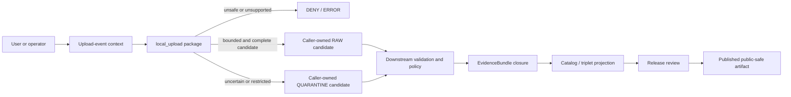

<!-- [KFM_META_BLOCK_V2]
doc_id: kfm://doc/connectors-local-upload-src-readme
title: connectors/local_upload/src/ — Local Upload Greenfield Source Layout Boundary
type: readme
version: v0.2
status: draft
owners: OWNER_TBD — Connector steward · Package maintainer · Source-intake steward · Rights reviewer · Privacy/sensitivity reviewer · Security reviewer · Validation steward · Test steward · Docs steward
created: 2026-06-19
updated: 2026-07-13
policy_label: public-doctrine; source-layout; greenfield-package; local-upload; trust-edge; untrusted-bytes; candidate-source; rights-fail-closed; sensitivity-fail-closed; quarantine-first; no-network; no-activation; no-publication
current_path: connectors/local_upload/src/README.md
truth_posture: CONFIRMED source layout containing one local_upload package namespace, a 0.0.0 project scaffold, empty initializer, comment-only fetch/admit modules, four-field nonconforming descriptor, README-only named test lane, absent conventional named tests, empty source-authority register, SourceDescriptor schema conflict, absent named local-upload policy README, and TODO-only connector workflows / PROPOSED fail-closed source-layout contract, package-structure constraints, dependency and import boundaries, candidate-only integration posture, and smallest safe implementation sequence / UNKNOWN differently named modules or tests, buildability, package discovery, import behavior, scanner/parser integration, upload surfaces, runtime, activation, substantive CI, deployment, and release readiness
evidence_snapshot:
  repository: bartytime4life/Kansas-Frontier-Matrix
  base_ref: main
  base_commit: eb4205ad509d7962850a2c55d60ac6eda001fa59
  prior_blob: 804410f84bf0fb4a0eef4986bf4021f5ff0cc06b
related:
  - ../README.md
  - ../pyproject.toml
  - ../tests/README.md
  - ./local_upload/README.md
  - ./local_upload/__init__.py
  - ./local_upload/fetch.py
  - ./local_upload/admit.py
  - ./local_upload/descriptor.yaml
  - ../../../CONTRIBUTING.md
  - ../../../.github/CODEOWNERS
  - ../../../.github/workflows/connector-gate.yml
  - ../../../.github/workflows/source-descriptor-validate.yml
  - ../../../docs/doctrine/directory-rules.md
  - ../../../docs/doctrine/trust-membrane.md
  - ../../../docs/doctrine/lifecycle-law.md
  - ../../../docs/adr/ADR-0012-connector-outputs-to-data-raw-or-data-quarantine-only.md
  - ../../../docs/sources/ADMISSION_PROCESS.md
  - ../../../docs/sources/catalog/local_upload/README.md
  - ../../../docs/sources/catalog/local_upload/user-file-upload.md
  - ../../../contracts/source/source_descriptor.md
  - ../../../schemas/contracts/v1/source/source_descriptor.schema.json
  - ../../../schemas/contracts/v1/sources/source_descriptor.schema.json
  - ../../../control_plane/source_authority_register.yaml
  - ../../../data/registry/sources/README.md
  - ../../../policy/rights/README.md
  - ../../../policy/sensitivity/README.md
  - ../../../tests/README.md
  - ../../../fixtures/README.md
  - ../../../release/
tags: [kfm, connectors, local-upload, local_upload, src, source-layout, package-layout, python, greenfield, intake, untrusted-files, candidate, source-admission, rights, sensitivity, privacy, security, provenance, raw, quarantine, no-publication]
notes:
  - "Direct reads at the pinned base confirm project kfm-connector-local_upload version 0.0.0, one local_upload package namespace, an empty __init__.py, comment-only fetch.py and admit.py, and a four-field descriptor.yaml placeholder."
  - "Exact probes returned Not Found for tests/conftest.py, test_fetch.py, test_admit.py, test_descriptor.py, and policy/sources/local_upload/README.md. Absence claims are bounded to those names and the pinned commit; differently named files remain UNKNOWN."
  - "The child package README is now v0.2 and defines the trust-edge, arbitrary-file, archive, secret, privacy, candidate-output, and lifecycle boundaries for future package code."
  - "The local descriptor uses deprecated minimal aliases, leaves role and rights unresolved, and asserts sensitivity_floor: public. It is not a conforming SourceDescriptor, activation decision, rights decision, sensitivity clearance, or release authorization."
  - "The machine source-authority register contains entries: []; the populated singular SourceDescriptor schema points to an empty plural schema as canonical; connector workflows execute TODO echo steps."
  - "Only this Markdown file is in scope. No package code, metadata, dependency, descriptor, registry record, policy, schema, fixture, test, workflow, uploaded payload, credential, lifecycle artifact, evidence object, release object, or public artifact is created or changed."
[/KFM_META_BLOCK_V2] -->

<a id="top"></a>

# Local Upload Greenfield Source Layout Boundary

> Repository-grounded boundary for `connectors/local_upload/src/`. The layout contains one `local_upload` Python namespace and verified placeholder files, but no supported connector behavior. It organizes future package code only; it is not a source registry, policy engine, lifecycle store, upload service, evidence authority, release plane, or public surface.

**Document lifecycle:** `draft v0.2`  
**Current layout maturity:** `CONFIRMED` greenfield `0.0.0` source layout; package runtime is not established  
**Owner:** `OWNER_TBD`  
**Authority:** package-layout documentation only; no source, schema, policy, lifecycle, evidence, release, or publication authority  
**Default posture:** one package namespace · no network on import · no uploaded bytes in source control · candidate-only outputs · no lifecycle writes · no publication

> [!IMPORTANT]
> The layout currently contains an empty initializer, comment-only fetch and admission modules, a nonconforming descriptor, and documentation rather than executable behavior. A `src/` directory, package name, README, local YAML file, pull request, merge, or green TODO-only workflow is not implementation evidence.

> [!CAUTION]
> This layout sits behind KFM's highest-uncertainty intake lane. Files submitted by users or operators may contain active content, malicious archives, credentials, personal or genomic data, exact protected locations, proprietary material, hidden metadata, or harmful joins. Unknown content, rights, sensitivity, source role, identity, or review state fails closed.

**Quick links:** [Purpose](#purpose) · [Authority](#authority-level) · [Current layout](#current-layout) · [Repository fit](#repository-fit) · [Package identity](#package-and-import-identity) · [What belongs](#what-belongs-under-src) · [Exclusions](#what-does-not-belong-under-src) · [Package boundaries](#package-boundary-and-internal-module-rules) · [Dependencies](#dependency-and-adapter-boundary) · [Imports](#import-time-and-install-time-boundary) · [Descriptor boundary](#descriptor-registry-and-policy-boundary) · [Tests and fixtures](#test-and-fixture-routing) · [Inputs and outputs](#inputs-and-outputs) · [Security](#arbitrary-file-and-security-boundary) · [Lifecycle](#lifecycle-and-publication-boundary) · [Validation](#validation) · [Evidence](#evidence-basis) · [Review](#review-burden) · [Implementation sequence](#smallest-safe-implementation-sequence) · [Definition of done](#definition-of-done) · [Rollback](#rollback) · [Backlog](#verification-backlog)

---

## Purpose

`connectors/local_upload/src/` is the implementation-layout container for the local-upload connector package.

Its present responsibilities are narrow:

- record the exact package layout that exists;
- keep the `local_upload` namespace visibly greenfield and fail closed;
- distinguish source-layout concerns from package behavior, connector orchestration, tests, fixtures, policy, schemas, registries, lifecycle state, evidence, and release;
- prevent a convenient `src/` folder from becoming a second authority root;
- constrain future package organization before arbitrary-file handling is implemented;
- preserve a single, reviewable import namespace and avoid silent aliases or duplicate packages;
- require offline, side-effect-free imports and deterministic negative behavior;
- route implementation questions to the child package boundary and governance questions to their owning roots;
- keep upload-event identity, content identity, candidate descriptor state, findings, and final governance decisions separate;
- preserve reversibility while package contracts, policy, fixtures, tests, and orchestration remain unresolved.

This README does not establish a browser upload endpoint, CLI command, watcher, parser, scanner, quarantine writer, source activation flow, public preview, or release path.

[Back to top](#top)

---

## Authority level

**Source-layout documentation only.**

| Concern | Status | Evidence-bounded determination |
|---|---:|---|
| Responsibility root | **CONFIRMED** | Directory Rules place source-specific intake, preservation, inspection, parsing, and admission mechanics under `connectors/`. |
| Current `src/` path | **CONFIRMED** | This README and one `local_upload/` package directory exist at the pinned base. |
| Distribution metadata | **CONFIRMED PLACEHOLDER** | Parent `pyproject.toml` declares `kfm-connector-local_upload` version `0.0.0` only. |
| Package namespace | **CONFIRMED** | `src/local_upload/` exists and contains the package README plus named placeholder files. |
| Current package behavior | **GREENFIELD PLACEHOLDER** | `__init__.py` is empty; `fetch.py` and `admit.py` contain comments only. |
| Local descriptor | **NONCONFORMING / DENY FOR AUTHORITY USE** | Four minimal fields cannot establish source identity, activation, rights, sensitivity, review, or release. |
| Package discovery and installability | **UNKNOWN** | No build backend, dependency set, Python constraint, package-discovery rule, entry point, command, or install evidence was verified. |
| Executable tests | **NOT FOUND AT NAMED PROBES / OTHERWISE UNKNOWN** | Test documentation exists; conventional named tests and `conftest.py` were absent at the pinned base. |
| Source authority | **NOT ESTABLISHED** | The machine source-authority register is `PROPOSED` with `entries: []`. |
| Schema authority | **CONFLICTED** | The populated singular SourceDescriptor schema declares the plural path canonical; the plural schema is an empty permissive scaffold. |
| Lane-specific policy | **NOT FOUND AT NAMED PATH** | `policy/sources/local_upload/README.md` was absent at the pinned base. |
| Connector CI | **TODO-ONLY** | Named connector and descriptor workflows execute placeholder `echo TODO` steps. |
| Source activation | **DENIED / NOT VERIFIED** | No accepted descriptor, review state, policy decision, operation authorization, or activation decision was verified. |
| Public output | **NONE** | This layout cannot authorize or emit a public file, preview, map, API response, catalog record, evidence object, proof, or release. |

A source layout may organize code. It cannot define truth, authority, admissibility, lifecycle state, evidence closure, or publication.

[Back to top](#top)

---

## Current layout

### Bounded repository snapshot

Direct reads at base commit `eb4205ad509d7962850a2c55d60ac6eda001fa59` confirm this named surface:

```text
connectors/local_upload/
├── README.md                              # parent connector boundary v0.1
├── pyproject.toml                         # kfm-connector-local_upload, version 0.0.0
├── src/
│   ├── README.md                          # this source-layout boundary
│   └── local_upload/
│       ├── README.md                      # package trust-edge boundary v0.2
│       ├── __init__.py                    # empty
│       ├── fetch.py                       # comment-only placeholder
│       ├── admit.py                       # comment-only placeholder
│       └── descriptor.yaml                # four-field placeholder
└── tests/
    └── README.md                          # documentation contract v0.1
```

Exact probes returned `Not Found` for:

```text
connectors/local_upload/tests/conftest.py
connectors/local_upload/tests/test_fetch.py
connectors/local_upload/tests/test_admit.py
connectors/local_upload/tests/test_descriptor.py
policy/sources/local_upload/README.md
```

These statements are bounded to the pinned commit and exact paths. Differently named, generated, unindexed, or later-added files remain `UNKNOWN` until directly inspected.

### Current maturity table

| Surface | Confirmed state | Safe conclusion |
|---|---|---|
| `src/README.md` | This layout contract. | Documents boundaries; does not implement them. |
| `src/local_upload/README.md` | v0.2 package trust-edge boundary. | Defines future behavior constraints; does not create behavior. |
| `src/local_upload/__init__.py` | Empty. | No public package API or initialization behavior. |
| `src/local_upload/fetch.py` | Comment-only. | No upload transport, staging, stream capture, hashing, scanner, or source-head behavior. |
| `src/local_upload/admit.py` | Comment-only. | No validation, disposition, quarantine, receipt, or candidate-handoff behavior. |
| `src/local_upload/descriptor.yaml` | `name: local_upload`, `role: TBD`, `rights: TBD`, `sensitivity_floor: public`. | Invalid as source authority, activation, rights clearance, sensitivity clearance, or release evidence. |
| Parent metadata | Name and `0.0.0` only. | Buildability, dependencies, supported Python, discovery, commands, and runtime remain unknown. |
| Connector tests | README-only at the named probes. | Discovery count, coverage, pass state, negative-case enforcement, and fixture safety remain unknown. |
| Connector workflows | TODO-only. | Green completion proves workflow execution only. |

There is no supported quickstart because no installable distribution, command, callable API, upload surface, configuration contract, or runner was verified.

[Back to top](#top)

---

## Repository fit

Directory Rules assign one primary responsibility to each root. This `src/` layout must stay subordinate to those authority boundaries.

| Responsibility | Owning surface | Source-layout relationship |
|---|---|---|
| Local-upload connector mechanics | `connectors/local_upload/` | The package may eventually implement narrow source-specific mechanics. |
| Human-facing source doctrine | `docs/sources/` | Source-layout documentation references doctrine; package code does not redefine it. |
| Object meaning | `contracts/` | Package classes and type hints consume accepted meanings; they do not become canonical contracts. |
| Machine shape | `schemas/` | Package code validates against accepted schemas; local dictionaries, dataclasses, models, or snapshots do not become schema authority. |
| Source identity and activation | Accepted registry and control-plane surfaces | Package code resolves reviewed references; it cannot activate itself. |
| Rights, sensitivity, privacy, security, access, and release decisions | `policy/` and reviewed governance surfaces | Package code may preserve claims and findings; it cannot clear risk. |
| Connector-local tests | `connectors/local_upload/tests/` | Tests may prove retained package mechanics. |
| Cross-system trust-spine tests | Root `tests/` | Canonical enforcement of lifecycle, policy, evidence, release, correction, and public-path boundaries belongs outside this package. |
| Golden and negative fixtures | Accepted `fixtures/` lanes | Do not create a parallel fixture authority below `src/`. |
| Lifecycle persistence | `data/` through governed orchestration | Package code returns candidates; it does not select or write lifecycle sinks. |
| Evidence closure | Evidence and proof responsibility roots | Upload bytes, checksums, scan results, parser findings, and intake receipts are evidence inputs, not an EvidenceBundle. |
| Release, correction, withdrawal, retention, and rollback | `release/` and owning governance lanes | Successful package execution cannot publish or approve deletion. |
| Public API, UI, previews, and maps | Governed applications | Public clients must not import this package directly or read RAW/QUARANTINE material. |

The path is appropriate because it organizes code owned by the local-upload connector. Placement does not confer implementation maturity or governance authority.

[Back to top](#top)

---

## Package and import identity

The current named identities are:

| Identity layer | Current value | Posture |
|---|---|---|
| Connector directory | `connectors/local_upload/` | **CONFIRMED path** |
| Distribution name | `kfm-connector-local_upload` | **CONFIRMED placeholder** |
| Import namespace | `local_upload` | **CONFIRMED directory / runtime UNKNOWN** |
| Source-family label | `local_upload` | **DOCUMENTED / not a per-upload source ID** |
| Per-upload source identity | Not established | **PROPOSED / NEEDS VERIFICATION** |

A future package decision must avoid identity collapse:

- distribution name is not a source ID;
- import namespace is not a SourceDescriptor;
- connector directory is not an activation record;
- source-family label is not an individual upload-event identity;
- upload-event identity is not content identity;
- content digest is not uploader identity, rights state, or review state;
- duplicate bytes do not erase distinct upload events;
- one package version does not describe the version or correction state of every admitted artifact.

### Identity change discipline

An ADR or explicit migration plan is required before:

- renaming the distribution or import namespace;
- adding an alternate import alias;
- introducing a second package namespace under this `src/` tree;
- changing source-family or per-upload ID conventions;
- moving descriptor, fixture, test, receipt, or lifecycle responsibilities;
- exposing public APIs or commands that become compatibility surfaces.

A silent alias, duplicate package, copied tree, import shim, or README edit is not a governed migration.

[Back to top](#top)

---

## What belongs under `src/`

After accepted contracts, security design, policy, package configuration, and tests exist, this layout may contain one primary `local_upload` package with small modules or subpackages for narrow source-specific mechanics such as:

- immutable streaming capture interfaces controlled by the caller;
- deterministic byte counts and cryptographic digests;
- safe display-name normalization that preserves the original supplied filename separately;
- bounded magic-byte and container-signature findings;
- declared-versus-detected media-type comparison;
- archive member inventory without unsafe extraction;
- scanner and parser adapter interfaces with explicit indeterminate states;
- upload-event and content-identity candidate construction;
- uploader-claim preservation as unverified assertions;
- candidate SourceDescriptor input preparation without authority or activation;
- rights, sensitivity, privacy, secret, active-content, and geometry findings;
- explicit admit-candidate, hold/quarantine-candidate, deny, abstain, no-op, rate-limit, or error outcomes;
- caller-owned RAW/QUARANTINE candidate-envelope construction;
- deterministic reason-code use after an accepted contract defines the vocabulary;
- package-specific exceptions or result types that map to canonical contracts rather than replacing them.

Every executable unit must have:

- one narrow responsibility;
- bounded resource use;
- explicit inputs and outputs;
- no implicit filesystem or network discovery;
- deterministic negative behavior where practical;
- no lifecycle sink selection;
- no authority upgrade;
- synthetic or reviewed fixtures;
- package-local tests and, where material, root trust-spine tests.

[Back to top](#top)

---

## What does not belong under `src/`

This layout must not contain or become:

- a browser upload endpoint, HTTP server, authentication service, UI component, watcher daemon, public API route, or public download service;
- a source registry, SourceDescriptor authority, activation store, policy bundle, rights decision store, sensitivity decision store, or release decision store;
- canonical contract or schema definitions hidden inside Python models;
- a second fixture, test, receipt, proof, catalog, release, correction, or publication authority;
- uploaded payloads, production samples, private exports, genomic files, proprietary documents, exact protected locations, credentials, signed URLs, or malware specimens committed to the repository;
- generated files, cache directories, extracted archives, temporary workspaces, scan databases, model weights, parser binaries, or native tool outputs;
- direct writes to `data/raw/`, `data/quarantine/`, `data/receipts/`, `data/work/`, `data/processed/`, `data/catalog/`, `data/triplets/`, `data/proofs/`, `data/published/`, or `release/`;
- archive extraction into the package tree, repository, user home, or a path derived from an uploaded filename;
- execution of uploaded scripts, macros, binaries, notebooks, office automation, PDF actions, embedded objects, media callbacks, or shell commands;
- import-time network access, filesystem mutation, scanner startup, credential lookup, configuration search, lifecycle writes, or telemetry emission;
- package-local copies of rights, sensitivity, privacy, secret, geometry, retention, or release rules;
- OCR, document understanding, geocoding, normalization, AI interpretation, catalog projection, or public summarization presented as package truth;
- silent source-role, rights, sensitivity, geometry, review, evidence, or public-release upgrades;
- logs, snapshots, exceptions, generated docs, or test output containing payload bytes, secrets, personal data, precise locations, private paths, or proprietary content.

Administrative convenience does not justify bypassing the trust membrane. Privileged upload surfaces require stronger audit and separation of duties, not weaker admission controls.

[Back to top](#top)

---

## Package boundary and internal module rules

The child package README defines the detailed trust-edge behavior boundary. This layout adds structural constraints around that package.

### One primary namespace

Until an accepted design says otherwise:

- keep one primary import namespace: `local_upload`;
- do not create sibling aliases such as `localupload`, `local_upload_connector`, or `upload` by convenience;
- do not create product-specific top-level packages for browser, CLI, watcher, and administrative intake unless an ADR establishes separate ownership and compatibility rules;
- keep transport surfaces outside the package and inject bounded streams or immutable references;
- keep domain-specific normalization outside the source package;
- keep policy and lifecycle orchestration outside the package.

### Internal module boundaries

A future package may group internal modules by responsibility, but module names and tree shape remain **PROPOSED** until implementation is reviewed. Do not copy a speculative module map from documentation into the repository without:

- accepted contracts;
- explicit ownership;
- dependency review;
- tests for every public surface;
- import and packaging configuration;
- migration and rollback considerations;
- a reason the split improves auditability or safety.

Internal helper modules must not become alternate homes for canonical DTOs, policy enums, schema fragments, registry records, or reason-code vocabularies.

### Public package surface

If a public Python API is later introduced:

- export the smallest stable surface through `__init__.py`;
- keep internal adapters private;
- document versioning and compatibility expectations;
- avoid importing optional heavy parsers or scanners at package import time;
- avoid re-exporting policy or lifecycle implementations;
- test that import remains offline and side-effect-free;
- record deprecation and rollback paths before changing public names.

Today `__init__.py` is empty, so no public package API is claimed.

[Back to top](#top)

---

## Dependency and adapter boundary

The current metadata declares no dependencies. Any future dependency is a trust-bearing change because this package processes arbitrary untrusted files.

### Dependency rules

A dependency proposal should document:

- the exact feature that requires it;
- supported and pinned version policy;
- license and redistribution posture;
- security and maintenance posture;
- native-code, subprocess, plugin, and network behavior;
- file formats and active-content features it may execute or decode;
- resource-limit and timeout support;
- deterministic failure and indeterminate-state handling;
- sandbox or isolation requirements;
- fixture and negative-test coverage;
- removal and rollback plan.

### Adapter rules

Complex scanners, parsers, archive tools, document engines, image codecs, OCR systems, and AI models should be accessed through explicit adapters supplied by the caller or governed orchestration.

Adapters must:

- receive bounded inputs;
- return structured findings with tool and version provenance;
- distinguish clean, detected, unsupported, failed, and indeterminate states;
- avoid implicit network access and external callback resolution;
- avoid writing into the package or lifecycle roots;
- redact sensitive findings from logs;
- expose timeout and resource controls;
- fail closed when unavailable or indeterminate;
- remain replaceable without changing source authority or lifecycle contracts.

A scanner result is an evidence input. It is not proof of rights, accuracy, completeness, sensitivity clearance, or release safety.

[Back to top](#top)

---

## Import-time and install-time boundary

Installation and import must remain lower risk than processing an upload.

A future implementation must prove that installation and import:

- do not contact a network;
- do not read credentials or private configuration;
- do not scan local directories;
- do not discover upload files or lifecycle roots;
- do not start services, threads, subprocesses, scanners, watchers, or background jobs;
- do not mutate the filesystem;
- do not create caches in the repository or user home;
- do not download parser data, models, signatures, fonts, schemas, or media;
- do not register public routes or application hooks implicitly;
- do not emit telemetry containing repository, user, path, or upload metadata;
- do not activate a source or make a policy decision.

Optional parser or scanner integrations should load only when explicitly requested by an authorized caller. Importing `local_upload` must not import every optional heavy dependency.

The current empty initializer does not prove these properties for a future package; it only proves that no import API is implemented in that file today.

[Back to top](#top)

---

## Descriptor, registry, and policy boundary

The package-local placeholder is:

```yaml
name: local_upload
role: TBD
rights: TBD
sensitivity_floor: public
```

| Placeholder field | Current problem | Required layout posture |
|---|---|---|
| `name` | Not the populated schema's required stable `source_id`; identifies a connector family rather than a specific artifact and upload event. | Package code may prepare candidate identity inputs but cannot mint authority locally. |
| `role` | `TBD` is not an accepted source role; uploader claims cannot assign authoritative meaning. | Preserve claims separately and require reviewed descriptor state. |
| `rights` | Unresolved scalar placeholder. | Unknown rights fail closed; authoritative decisions remain outside `src/`. |
| `sensitivity_floor` | Deprecated minimal alias with an unsafe permissive value. | Never treat `public` as clearance; local uploads begin conservatively. |

The populated singular SourceDescriptor schema requires a richer closed object but declares the plural schema path canonical. The plural path is currently an empty permissive scaffold. The source-authority register contains no entries.

Therefore this layout must not contain:

- an authoritative descriptor instance;
- a package-local source registry;
- a copied or simplified SourceDescriptor schema;
- package-owned activation records;
- package-owned rights or sensitivity decisions;
- a locally invented source-role or reason-code enum presented as canonical;
- a migration shortcut that treats the current YAML as valid authority.

Package code may prepare candidate inputs, validate against an accepted external authority, and preserve review references. It must hold or deny when descriptor authority, role mapping, rights, sensitivity, source head, review state, operation authorization, or public-release posture is unresolved.

Receiving bytes into a controlled intake boundary is not source activation.

[Back to top](#top)

---

## Test and fixture routing

### Connector-local tests

Package-specific tests belong under the accepted connector-local test lane, currently documented at `connectors/local_upload/tests/`.

They should prove narrow mechanics such as:

- deterministic byte counts and digests;
- upload-event versus content-identity separation;
- declared-versus-detected media-type findings;
- hard resource and archive limits;
- no path traversal, link following, special-file extraction, collision, recursion, or expansion bypass;
- no active-content execution;
- descriptor-placeholder rejection;
- preservation of uploader claims as unverified;
- deterministic hold, quarantine, deny, abstain, no-op, rate-limit, and error semantics after contracts are accepted;
- no network or filesystem mutation on import and default tests;
- no secret or sensitive-content leakage in logs and errors;
- caller-owned candidate outputs with no lifecycle sink selection.

### Root trust-spine tests

Root-level tests should prove cross-system controls such as:

- public clients cannot reach uploaded or unpublished material;
- source activation requires accepted descriptor and policy state;
- connector outputs cannot skip lifecycle phases;
- upload receipts do not become EvidenceBundles or release proofs;
- rights and sensitivity remain fail closed;
- correction, withdrawal, supersession, retention, and rollback remain auditable;
- privileged upload paths do not bypass separation of duties.

### Fixtures

Fixtures must live in the accepted fixture authority, not under `src/`.

Local-upload fixtures should be:

- synthetic or explicitly rights-cleared;
- minimized;
- provenance-recorded;
- free of real credentials and private identifiers;
- generalized or invented for sensitive-location cases;
- explicit about expected findings and disposition;
- bounded for archive, parser, image, document, tabular, and malformed-content tests;
- paired with negative cases;
- reviewed before becoming a golden fixture.

Do not commit real personal exports, DNA files, exact protected locations, proprietary documents, production uploads, or live malware. Adversarial fixtures should be inert synthetic structures that exercise parser and path logic safely.

The named conventional tests are currently absent, so no coverage or pass state is claimed.

[Back to top](#top)

---

## Inputs and outputs

### Current inputs

None. The source layout and child package declare no supported function, class, command, configuration object, upload surface, endpoint, credential variable, scanner contract, descriptor contract, fixture shape, or runner.

### Current outputs

None. The inspected package emits no captured payload, digest manifest, scan result, parsed record, validation finding, descriptor, decision, candidate envelope, receipt, lifecycle write, map artifact, API response, or public claim.

### Future admissible package inputs

After authority and implementation gates close, code under this layout may accept explicit caller-supplied values such as:

- upload-event context with run and actor/access references;
- a bounded byte stream, immutable temporary object, or content-addressed reference;
- supplied filename and media type marked untrusted;
- configured byte, time, CPU, memory, member-count, nesting, decompression, page, row, and dimension limits;
- accepted descriptor reference or explicit restricted pre-descriptor intake mode;
- operation authorization distinguishing fixture, restricted, and approved production intake;
- reviewed scanner and parser adapters;
- caller-owned isolated temporary workspace;
- caller-owned candidate return channels;
- rights, sensitivity, privacy, secret, and geometry context;
- supported-content and deny-list policy references;
- trace and audit context that excludes secrets.

### Future bounded package outputs

Code under this layout may return in memory or through an explicit caller-owned interface:

1. upload-event and content-identity candidates;
2. bounded inspection and scanner findings with provenance;
3. parsed source-native candidates under accepted parser contracts;
4. unreviewed descriptor-input candidates;
5. admit candidates suitable for caller-owned RAW consideration;
6. hold or quarantine candidates with structured reasons;
7. deterministic deny, abstain, no-op, rate-limit, or error outcomes;
8. process-memory intake or denial receipt candidates if an accepted receipt contract exists.

The exact DTOs, enums, reason-code vocabulary, sink protocol, receipt types, idempotency rules, and adapter schemas remain **PROPOSED / NEEDS VERIFICATION**. This README does not mint them.

No code under this layout may emit a reviewed SourceDescriptor, EvidenceBundle, processed record, catalog item, triplet, proof, ReleaseManifest, public preview, map layer, API answer, or publication decision.

[Back to top](#top)

---

## Arbitrary-file and security boundary

The child package README carries detailed trust-edge requirements. This source layout must ensure structural decisions do not weaken them.

### Required structural protections

Future code organization must support:

- streaming rather than whole-file loading where practical;
- hard limits on bytes, time, CPU, memory, pages, rows, image dimensions, archive members, nesting, recursion, and expanded size;
- separation of capture, inspection, parsing, normalization, interpretation, and publication;
- no active-content execution;
- no automatic fetching of links, media, fonts, schemas, callbacks, or remote resources;
- isolated adapters for complex parsers, native codecs, scanners, OCR, and model-based inspection;
- explicit unsupported and indeterminate states;
- safe temporary workspace ownership and cleanup outside source control;
- redacted logs with stable identifiers and reason codes rather than payload fragments;
- version provenance for every scanner, parser, signature set, or classifier;
- no trust in metadata, EXIF, author fields, timestamps, geotags, hidden sheets, tracked changes, thumbnails, or uploader claims without review.

### Archive and container protections

Any archive or compound-document support must fail closed for:

- absolute, parent-traversal, drive-letter, alternate-separator, or ambiguous normalized paths;
- symbolic links, hard links, device files, pipes, sockets, or special filesystem objects;
- duplicate names, case-folding collisions, Unicode-normalization collisions, or path aliases;
- excessive nesting, recursion, member count, compression ratio, expanded size, or cumulative cost;
- encrypted, password-protected, split, damaged, multipart, or unsupported containers without an accepted restricted workflow;
- scripts, executables, macros, active document content, embedded objects, and unsupported native plugins;
- member types that conflict with supplied names or declared media types;
- hidden files or metadata that violate policy;
- formats that require network access or unsafe callbacks.

Inventory without extraction is preferred. Temporary extraction, when later approved, must use a caller-owned isolated workspace, safe path joining, no-follow semantics, bounded permissions, no execution, deterministic cleanup, and an auditable member manifest.

### Sensitive classes

The source layout must support fail-closed handling for:

- living-person and identifying data;
- DNA, genomic, health, biometric, and ancestry exports;
- rare-species and sensitive habitat locations;
- archaeology, burial, sacred, cultural, and sovereignty-governed material;
- parcel, owner, tenant, permit, utility, and private-property joins;
- critical infrastructure, access routes, vulnerabilities, and facility-adjacent precision data;
- proprietary, copyrighted, licensed, embargoed, confidential, privileged, or contract-restricted content;
- API keys, tokens, cookies, private keys, passwords, credentials, signed URLs, connection strings, and private endpoints;
- exact coordinates with unresolved CRS, datum, derivation, precision, uncertainty, consent, or transform state;
- hidden metadata, revision history, embedded files, comments, and tracked changes;
- joins that become more sensitive than their inputs;
- synthetic or generated material presented as observed, regulatory, historical, or measured reality;
- stale, superseded, corrected, incomplete, or selectively excerpted material without state and provenance.

Source layout decisions must not copy sensitive fragments into module constants, fixtures, exceptions, logs, docs, tests, issue bodies, pull requests, generated reports, or AI prompts.

[Back to top](#top)

---

## Lifecycle and publication boundary

KFM's lifecycle invariant remains:

```text
RAW → WORK / QUARANTINE → PROCESSED → CATALOG / TRIPLET → PUBLISHED
```

Code under this source layout participates only at the source-admission edge. It may prepare caller-owned RAW or QUARANTINE candidates. It does not select, create, persist, or promote lifecycle state.



The source layout and package must not:

- write directly to lifecycle, receipt, proof, or release roots;
- approve descriptor, rights, sensitivity, privacy, redaction, evidence, catalog, or release state;
- expose uploaded bytes or derivatives to public clients;
- treat a checksum, upload receipt, scan result, parser result, commit, workflow, or merge as evidence closure or promotion;
- allow callers to select `WORK`, `PROCESSED`, `CATALOG`, `TRIPLET`, `PUBLISHED`, proof, or release as package output modes;
- mutate, overwrite, or delete lifecycle data;
- implement retention, deletion, legal hold, correction, withdrawal, or supersession without accepted governance and orchestration.

Directory Rules are the governing authority for the connector boundary. ADR-0012 remains a draft numbered codification and must not be represented as accepted beyond its status.

[Back to top](#top)

---

## Validation

### Documentation validation for this revision

- [x] One H1.
- [x] Current path, base commit, and prior blob recorded.
- [x] Verified package files and named absent tests recorded.
- [x] Named absence claims bounded to the pinned commit.
- [x] Stale two-file inventory removed.
- [x] Stale blank-file and placeholder rollback claims removed.
- [x] Current package inputs, outputs, runtime, and quickstart stated as absent.
- [x] Layout authority separated from package, tests, fixtures, policy, schemas, registry, lifecycle, evidence, and release.
- [x] No external badge or image dependency added.
- [x] No real upload, secret, personal record, coordinate, proprietary payload, endpoint, credential, or malware sample included.
- [x] No speculative module tree represented as implementation.
- [x] No lifecycle or publication authority created.

### Required future packaging validation

A retained implementation must prove:

- [ ] a reviewed build backend and package-discovery rule include exactly the intended namespace;
- [ ] supported Python and dependency policies are explicit;
- [ ] editable and wheel installs expose the same package surface;
- [ ] imports are deterministic, offline, and side-effect-free;
- [ ] optional heavy dependencies do not load on base import;
- [ ] public API exports are minimal, documented, versioned, and tested;
- [ ] duplicate or alternate import namespaces are rejected unless migration-approved;
- [ ] source distributions and wheels exclude fixtures, uploads, secrets, caches, temporary files, scan data, and generated artifacts;
- [ ] package metadata does not imply source activation or public release;
- [ ] dependency licenses and security posture are reviewed;
- [ ] scanner and parser adapters are bounded, isolated, versioned, and explicit about indeterminate states;
- [ ] no package module selects or writes lifecycle sinks;
- [ ] no package-local model becomes canonical contract, schema, policy, registry, or reason-code authority;
- [ ] connector-local tests and root trust-spine tests execute substantive positive and negative cases;
- [ ] zero-test discovery and unexpected skips fail CI;
- [ ] workflows execute real commands rather than TODO echoes;
- [ ] deterministic replay produces stable content identity, findings, and reason codes for fixed synthetic inputs.

### Required future security validation

- [ ] byte, time, CPU, memory, nesting, archive-member, decompression, page, row, and dimension limits are enforced;
- [ ] traversal, links, special files, collisions, recursion, encryption, and expansion attacks fail closed;
- [ ] no uploaded active content executes;
- [ ] no parser, scanner, or document engine performs hidden network access;
- [ ] secrets and sensitive content cannot leak through logs, errors, snapshots, fixtures, reports, or AI prompts;
- [ ] exact and generalized geometry remain separate with transform provenance;
- [ ] identical bytes do not erase distinct upload-event provenance;
- [ ] uploader claims cannot elevate role, rights, sensitivity, review, or release state;
- [ ] public applications cannot import this package as a shortcut to unpublished bytes;
- [ ] privileged upload paths preserve auditability and separation of duties.

A green workflow is not sufficient unless the executed commands and logs prove the relevant behavior.

[Back to top](#top)

---

## Evidence basis

| Evidence | Status | Supports | Limits |
|---|---:|---|---|
| This README at base `eb4205ad…` | **CONFIRMED** | Current v0.1 content and prior blob. | Documentation alone does not prove behavior. |
| Parent `pyproject.toml` | **CONFIRMED** | Distribution name and version `0.0.0`. | No build, install, discovery, or runtime support follows. |
| Child package README v0.2 | **CONFIRMED** | Current trust-edge, archive, privacy, security, candidate-output, lifecycle, validation, and rollback boundaries. | Does not implement those controls. |
| `__init__.py`, `fetch.py`, `admit.py` | **CONFIRMED** | Empty/comment-only package scaffold. | Differently named modules remain unknown. |
| `descriptor.yaml` | **CONFIRMED** | Four-field placeholder with unresolved role/rights and permissive-looking sensitivity alias. | Not descriptor authority, activation, policy, or release evidence. |
| Exact conventional test probes | **CONFIRMED NAMED ABSENCE** | No named `conftest.py`, fetch, admit, or descriptor test at the pinned base. | Differently named or later-added tests remain unknown. |
| Parent connector and test READMEs | **CONFIRMED** | Earlier connector-family, no-network, candidate-role, and RAW/QUARANTINE boundaries. | Their implementation inventories are stale relative to direct reads. |
| Local-upload source catalog | **CONFIRMED DRAFT DOC** | Highest-uncertainty intake, candidate role, unknown rights, restricted sensitivity, public denial, and trust-membrane posture. | Several implementation paths and object shapes remain proposed. |
| User-file-upload product page | **CONFIRMED DRAFT DOC** | Human-initiated upload surface and proposed strict admission posture. | Explicitly not runtime proof. |
| Directory Rules | **CONFIRMED DOCTRINE** | Responsibility-root placement, connector admission boundary, separate tests/fixtures, and no publication. | Does not define package modules or prove enforcement. |
| ADR-0012 | **CONFIRMED DRAFT ADR** | Proposed numbered codification of RAW/QUARANTINE-only connector output. | Draft/proposed; Directory Rules remain governing authority. |
| Source-authority register | **CONFIRMED** | Register is `PROPOSED` with `entries: []`. | No local-upload source authority or activation is established. |
| Singular SourceDescriptor schema | **CONFIRMED** | Rich required object and metadata pointing to plural path as canonical. | Authority metadata conflicts with the plural scaffold. |
| Plural SourceDescriptor schema | **CONFIRMED** | Empty permissive `PROPOSED` scaffold. | Not sufficient for governed validation. |
| Local-upload policy README probe | **NOT FOUND AT NAMED PATH** | Named documentation path is absent. | Other policy files or differently named paths remain unknown. |
| Connector workflows | **CONFIRMED TODO-ONLY** | Named workflows execute placeholder echo steps. | Green status cannot prove package behavior. |

When documentation and implementation evidence conflict, current-session direct file reads constrain claims about present behavior. Doctrine still governs intended boundaries.

[Back to top](#top)

---

## Review burden

At minimum, changes under this source layout require review appropriate to their effect:

- package maintainer for package organization and public Python surface;
- connector steward for source-intake boundaries;
- source-intake steward for upload-event and candidate semantics;
- security reviewer for arbitrary-file handling, dependencies, isolation, scanners, parsers, archives, temporary storage, secrets, and active content;
- rights reviewer;
- privacy/sensitivity reviewer;
- validation and test steward;
- applicable domain steward after content classification;
- cultural, sovereignty, living-person, genomic, ecological, archaeological, infrastructure, or other specialist reviewer when material triggers those concerns;
- docs steward;
- release reviewer before any public-use claim.

The uploader must not be the sole reviewer or release authority for material uploads. Administrative upload privilege is not approval authority.

An ADR or explicit design/migration decision is required before this layout:

- adds a second package or import alias;
- changes distribution or source-family identity;
- introduces a package-local authority home;
- moves test or fixture ownership;
- changes lifecycle persistence responsibility;
- adds privileged bypass behavior;
- exposes a public route, preview, map, or download path;
- adopts native scanners, parser plugins, model runtimes, or background services with material security or operational impact.

[Back to top](#top)

---

## Smallest safe implementation sequence

The smallest useful, reversible sequence is **PROPOSED**:

1. **Resolve authority surfaces.** Ratify SourceDescriptor schema authority, candidate role mapping, upload-event/content-identity semantics, finite outcomes, reason codes, and receipt boundaries.
2. **Complete package metadata.** Add reviewed build backend, supported Python, package discovery, dependency policy, and no-network test configuration without adding live upload behavior.
3. **Prove packaging.** Build source and wheel artifacts; verify only intended modules are included and no fixtures, uploads, secrets, caches, or generated files leak into artifacts.
4. **Implement pure identity helpers.** Stream byte counts and cryptographic digests from tiny synthetic inputs; preserve upload-event identity separately.
5. **Implement bounded type findings.** Compare supplied and detected types without complex parsers or execution.
6. **Implement negative archive inventory.** Reject traversal, links, collisions, nesting, encryption, and expansion-limit cases without extracting into real paths.
7. **Implement descriptor rejection.** Prove the current placeholder cannot activate a source and uploader claims cannot elevate role or release class.
8. **Implement candidate outcomes.** Return caller-owned hold/quarantine/deny candidates with stable reasons; do not persist.
9. **Add isolated scanner/parser adapters.** Only after security review, explicit limits, inert fixtures, and indeterminate-state handling exist.
10. **Integrate governed orchestration.** Let an accepted caller choose RAW or QUARANTINE through documented append-only sink and receipt contracts.
11. **Prove trust-spine boundaries.** Add root-level negative tests for policy, lifecycle, evidence, public access, correction, retention, withdrawal, release, and rollback before activation.

Each step should be independently reviewable and revertible. Do not build a broad upload service before package identity, negative controls, authority surfaces, and tests are established.

[Back to top](#top)

---

## Definition of done

This README revision is ready for review when:

- [x] Exact `src/` and child package scaffold are recorded.
- [x] Named test and policy absences are bounded to exact probes.
- [x] Source-layout authority is separated from package behavior and governance roots.
- [x] Distribution, import namespace, source-family label, upload-event identity, and content identity remain distinct.
- [x] Local descriptor is classified as nonconforming and non-authoritative.
- [x] Package, dependency, import, fixture, test, archive, active-content, privacy, secret, and lifecycle boundaries are visible.
- [x] Current inputs, outputs, runtime, and quickstart are stated as absent.
- [x] Future behavior is bounded to caller-owned candidates.
- [x] No speculative module tree is presented as implementation.
- [x] Exact rollback blob is recorded.

An operational source layout is not ready until:

- [ ] accepted contracts and canonical schema/registry authority exist;
- [ ] package and governance owners are assigned;
- [ ] package metadata, discovery, supported Python, dependencies, and commands are complete and reviewed;
- [ ] build artifacts contain only intended code and metadata;
- [ ] arbitrary-file threat model and isolation design are accepted;
- [ ] bounded content, archive, scanner, parser, temporary-storage, cleanup, and retention behavior are implemented;
- [ ] rights, sensitivity, privacy, secret, geometry, access, and release policies are executable;
- [ ] safe fixtures and substantive negative tests exist;
- [ ] no-network, no-execution, no-secret-leak, no-public-bypass, and no-lifecycle-write tests pass;
- [ ] connector and descriptor workflows execute substantive enforcement;
- [ ] caller-owned candidate and receipt contracts are integrated;
- [ ] activation is explicitly approved for a bounded operation mode;
- [ ] correction, withdrawal, supersession, retention, deletion, release, and rollback controls pass independently;
- [ ] no public upload preview or output is enabled before the governed trust path closes.

[Back to top](#top)

---

## Rollback

Before merge, close the draft PR if this revision is rejected.

After merge, restore the prior blob:

```text
804410f84bf0fb4a0eef4986bf4021f5ff0cc06b
```

Use a transparent revert commit or revert PR. Do not reset, force-push, or rewrite shared history. Re-run applicable documentation, link, connector-boundary, packaging, security, policy, and rollback checks after the revert.

Rollback is required if this README is used to justify implementation maturity, a second package authority, uploader-controlled source status, arbitrary-file execution, unsafe extraction, rights or sensitivity bypass, secret retention, exact-location exposure, direct lifecycle writes, public previews, evidence closure, or publication.

[Back to top](#top)

---

## Verification backlog

| Item | Status | Needed evidence |
|---|---:|---|
| Verify complete recursive `src/` and test inventory. | **NEEDS VERIFICATION** | Commit-pinned tree or mounted repository inspection. |
| Resolve canonical SourceDescriptor schema and role vocabulary. | **CONFLICTED** | Accepted schema authority, validator, role crosswalk, fixtures, and tests. |
| Define upload-event, content identity, candidate descriptor, finite outcome, and receipt contracts. | **PROPOSED** | Contract/schema decisions and review. |
| Complete package metadata and discovery. | **NOT ESTABLISHED** | Build backend, supported Python, dependency policy, package configuration, and artifact inspection. |
| Define stable public package API, if any. | **PROPOSED** | API design, compatibility policy, tests, and deprecation rules. |
| Establish lane-specific rights, sensitivity, privacy, secret, access, retention, and release policy. | **NOT FOUND / NEEDS VERIFICATION** | Accepted policy files, tests, and reviewer decisions. |
| Define accepted operation modes and activation authority. | **NOT ESTABLISHED** | Registry/control-plane record and activation decision. |
| Verify browser, CLI, watcher, and administrative upload surfaces. | **UNKNOWN** | Application code, routes, configs, authentication model, and runtime logs. |
| Define immutable capture, temporary storage, cleanup, retention, deletion, and legal-hold contracts. | **PROPOSED** | Security/storage design, contracts, tests, and audit evidence. |
| Define file-size, resource, archive, page, row, image, recursion, and decompression limits. | **PROPOSED** | Threat model, configuration contract, fixtures, and negative tests. |
| Select scanner and complex-parser isolation model. | **PROPOSED** | Security review, dependency policy, sandbox design, failure tests. |
| Establish archive traversal, link, collision, encryption, and expansion defenses. | **PROPOSED** | Implementation, inert adversarial fixtures, and observed tests. |
| Establish secret-detection and incident-response handoff. | **NEEDS VERIFICATION** | Security policy, redacted reason codes, runbook, and tests. |
| Establish safe fixture home and metadata. | **NEEDS VERIFICATION** | Fixture registry, provenance/rights/sensitivity records, positive and negative fixtures. |
| Establish executable package and root trust-spine tests. | **NOT FOUND / UNKNOWN** | Test files, runner, collection logs, coverage, and observed CI. |
| Replace connector workflow TODO steps. | **PROPOSED** | Workflow commands, logs, and failure evidence. |
| Define RAW/QUARANTINE candidate and append-only receipt integration. | **PROPOSED** | Accepted contracts, orchestration code, idempotency tests, and receipts. |
| Prove package artifacts exclude uploaded or generated material. | **UNKNOWN** | Wheel/sdist manifests, reproducible builds, and artifact inspection. |
| Prove public clients cannot import or reach uploads and unpublished derivatives. | **UNKNOWN** | Dependency graph, API/UI route tests, access policy, runtime proof, and denial logs. |
| Assign owners and CODEOWNERS coverage. | **UNKNOWN** | Maintainer and governance decision. |
| Prove correction, withdrawal, supersession, retention, deletion, and rollback behavior. | **UNKNOWN** | End-to-end tests, review records, receipts/proofs, and drills. |

---

## Maintainer note

Keep `src/` boring, explicit, and reversible. It should organize one small package that treats uploads as untrusted bytes plus unverified claims. Preserve identity and evidence, make uncertainty visible, quarantine safely, and let governed registries, policy, orchestration, review, evidence closure, and release carry authority.

[Back to top](#top)
