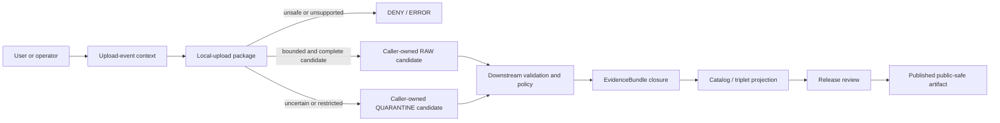

<!-- [KFM_META_BLOCK_V2]
doc_id: kfm://doc/connectors-local-upload-src-package-readme
title: connectors/local_upload/src/local_upload/ — Local Upload Greenfield Package and Trust-Edge Boundary
type: readme
version: v0.2
status: draft
owners: OWNER_TBD — Connector steward · Package maintainer · Source-intake steward · Rights reviewer · Privacy/sensitivity reviewer · Security reviewer · Validation steward · Test steward · Docs steward
created: 2026-06-19
updated: 2026-07-13
policy_label: public-doctrine; greenfield-package; local-upload; trust-edge; untrusted-bytes; candidate-source; rights-fail-closed; sensitivity-fail-closed; quarantine-first; no-network; no-activation; no-publication
current_path: connectors/local_upload/src/local_upload/README.md
truth_posture: CONFIRMED repository-present 0.0.0 package scaffold, empty initializer, comment-only fetch/admit modules, four-field nonconforming local descriptor, README-only named test lane, absent conventional named tests, empty source-authority register, SourceDescriptor schema conflict, absent named local-upload policy README, and TODO-only connector workflows / PROPOSED fail-closed package contract, bounded inspection interface, safe archive/media handling, candidate outcome model, and smallest safe implementation sequence / UNKNOWN differently named modules or tests, buildability, import behavior, scanner integration, parsing support, current upload surfaces, runtime, activation, substantive CI, deployment, and release readiness
evidence_snapshot:
  repository: bartytime4life/Kansas-Frontier-Matrix
  base_ref: main
  base_commit: 2ba58c6b8250fc61ec5b9e6cde42dc0def71caf2
  prior_blob: 7ec2c18e31f23c22a18286f36816806efa2de44c
  readme_introduction_commit: a7d75f0e585020a882323396bd798b4a9e7ae233
related:
  - ../README.md
  - ../../README.md
  - ../../pyproject.toml
  - ../../tests/README.md
  - ./__init__.py
  - ./fetch.py
  - ./admit.py
  - ./descriptor.yaml
  - ../../../README.md
  - ../../../../CONTRIBUTING.md
  - ../../../../.github/CODEOWNERS
  - ../../../../.github/workflows/connector-gate.yml
  - ../../../../.github/workflows/source-descriptor-validate.yml
  - ../../../../docs/doctrine/directory-rules.md
  - ../../../../docs/doctrine/trust-membrane.md
  - ../../../../docs/doctrine/lifecycle-law.md
  - ../../../../docs/adr/ADR-0012-connector-outputs-to-data-raw-or-data-quarantine-only.md
  - ../../../../docs/sources/ADMISSION_PROCESS.md
  - ../../../../docs/sources/catalog/local_upload/README.md
  - ../../../../docs/sources/catalog/local_upload/user-file-upload.md
  - ../../../../contracts/source/source_descriptor.md
  - ../../../../schemas/contracts/v1/source/source_descriptor.schema.json
  - ../../../../schemas/contracts/v1/sources/source_descriptor.schema.json
  - ../../../../control_plane/source_authority_register.yaml
  - ../../../../data/registry/sources/README.md
  - ../../../../policy/rights/README.md
  - ../../../../policy/sensitivity/README.md
  - ../../../../tests/README.md
  - ../../../../fixtures/README.md
  - ../../../../release/
tags: [kfm, connectors, local-upload, local_upload, package, python, intake, untrusted-files, candidate, source-admission, descriptor, rights, sensitivity, privacy, security, provenance, raw, quarantine, no-publication]
notes:
  - "Direct reads at the pinned base confirm project kfm-connector-local_upload version 0.0.0, an empty __init__.py, comment-only fetch.py and admit.py, and a four-field descriptor.yaml placeholder."
  - "Exact probes returned Not Found for tests/conftest.py, test_fetch.py, test_admit.py, and test_descriptor.py. Absence claims are bounded to those names and the pinned commit; differently named files remain UNKNOWN."
  - "The local descriptor uses deprecated minimal aliases, leaves role and rights unresolved, and asserts sensitivity_floor: public. It is not a conforming SourceDescriptor, activation decision, rights decision, sensitivity clearance, or release authorization."
  - "The source catalog classifies local upload as KFM's highest-uncertainty intake lane: source role begins candidate, rights are unknown, sensitivity is restricted by default, and public release is denied until governed review."
  - "The machine source-authority register contains entries: []; the populated singular SourceDescriptor schema points to an empty plural schema as canonical; the named local-upload policy README was absent; connector workflows execute TODO echo steps."
  - "Only this Markdown file is in scope. No package code, metadata, descriptor, registry record, policy, schema, fixture, test, workflow, uploaded payload, credential, lifecycle artifact, evidence object, release object, or public artifact is created or changed."
[/KFM_META_BLOCK_V2] -->

<a id="top"></a>

# Local Upload Greenfield Package and Trust-Edge Boundary

> Repository-grounded boundary for `connectors/local_upload/src/local_upload/`. The namespace exists, but the inspected package is a non-operational `0.0.0` scaffold at KFM's highest-uncertainty intake edge. It does not currently fetch, inspect, scan, parse, admit, quarantine, persist, or publish an uploaded file.

**Document lifecycle:** `draft v0.2`  
**Current package maturity:** `CONFIRMED` greenfield scaffold; supported runtime behavior is not established  
**Owner:** `OWNER_TBD`  
**Authority:** package-boundary documentation only; no source, schema, policy, lifecycle, evidence, release, or publication authority  
**Default posture:** untrusted bytes · candidate role · rights unknown · restricted sensitivity · quarantine first · no public output

> [!IMPORTANT]
> The package currently contains an empty initializer, comment-only fetch and admission modules, and a nonconforming local descriptor. A directory, README, placeholder YAML, pull request, merge, or green TODO-only workflow is not implementation evidence.

> [!CAUTION]
> `sensitivity_floor: public` in the package-local placeholder is **not** a public-safety decision. User-supplied files may contain personal data, genomic data, exact ecological or archaeological locations, credentials, proprietary content, embedded scripts, malicious archives, hidden metadata, or harmful joins. Unknown content, rights, sensitivity, identity, or review state fails closed.

**Quick links:** [Purpose](#purpose) · [Authority](#authority-level) · [Current package](#current-package) · [Repository fit](#repository-fit) · [Descriptor boundary](#descriptor-registry-and-activation-boundary) · [Trust-edge model](#trust-edge-and-upload-event-model) · [What belongs](#what-belongs-here) · [Exclusions](#what-does-not-belong-here) · [Inputs](#inputs) · [Inspection](#bounded-content-inspection) · [Archives](#archive-and-container-safety) · [Sensitive content](#rights-sensitivity-privacy-and-secrets) · [Outputs](#outputs) · [Failure contract](#failure-contract) · [Lifecycle](#lifecycle-and-publication-boundary) · [Validation](#validation) · [Evidence](#evidence-basis) · [Review](#review-burden) · [Implementation sequence](#smallest-safe-implementation-sequence) · [Definition of done](#definition-of-done) · [Rollback](#rollback) · [Backlog](#verification-backlog)

---

## Purpose

`connectors/local_upload/src/local_upload/` is the Python namespace reserved for narrow, source-specific mechanics associated with a user or operator submitting a file to KFM.

Its safe purpose is to support a future connector that:

- receives caller-supplied upload-event metadata and an untrusted byte stream or file reference;
- records the distinction between uploader claims and detected properties;
- preserves byte identity through deterministic checksums;
- performs bounded, non-authoritative file-shape inspection;
- produces explicit findings about type, integrity, archive structure, embedded content, and intake risk;
- preserves candidate source role, unresolved rights, conservative sensitivity, and review requirements;
- returns caller-owned admission, hold, quarantine, deny, or error candidates;
- stops at the source-admission boundary.

The package must not turn uploaded material into truth. A user-provided filename, extension, title, license claim, source claim, coordinate, timestamp, or narrative is evidence about the upload event—not proof that the file's contents are accurate, lawful, complete, current, or public-safe.

This README does not prove that the future mechanics above exist. It defines the boundary they must satisfy if implemented.

[Back to top](#top)

---

## Authority level

**Greenfield connector package scaffold. No independent governance authority.**

| Concern | Status | Evidence-bounded determination |
|---|---:|---|
| Responsibility root | **CONFIRMED** | Directory Rules assign source-specific fetch, preservation, inspection, and admission support to `connectors/`. |
| Current namespace | **CONFIRMED** | This README and named placeholder package files exist at the pinned base. |
| Distribution | **CONFIRMED PLACEHOLDER** | `pyproject.toml` declares `kfm-connector-local_upload` version `0.0.0`; no build backend, dependency set, Python constraint, package discovery, entry point, or command is declared. |
| Current implementation | **GREENFIELD PLACEHOLDER** | `__init__.py` is empty; `fetch.py` and `admit.py` are comments only. |
| Local descriptor | **NONCONFORMING / DENY FOR AUTHORITY USE** | Four minimal fields do not satisfy the populated SourceDescriptor contract and cannot authorize access, admission, or release. |
| Executable tests | **NOT FOUND AT NAMED PROBES / OTHERWISE UNKNOWN** | The test README exists; conventional named test modules and `conftest.py` were absent at the pinned base. |
| Source authority | **NOT ESTABLISHED** | The machine source-authority register is `PROPOSED` with `entries: []`. |
| Schema authority | **CONFLICTED** | The populated singular-path schema labels the plural path canonical; the plural-path schema is an empty permissive scaffold. |
| Lane-specific policy | **NOT FOUND AT NAMED PATH** | `policy/sources/local_upload/README.md` was absent at the pinned base. Rights and sensitivity decisions therefore cannot be replaced locally. |
| Connector CI | **TODO-ONLY** | The named connector and descriptor workflows execute placeholder `echo TODO` steps. |
| Source activation | **DENIED / NOT VERIFIED** | No accepted descriptor, source-head evidence, review state, policy decision, or activation decision was verified. |
| Public output | **NONE** | This package cannot approve or emit a public file, map, API response, catalog record, evidence object, proof, or release. |

Tests may prove package behavior after code exists. They do not become authority for source identity, rights, sensitivity, policy, or publication.

[Back to top](#top)

---

## Current package

### Bounded repository snapshot

Direct reads at base commit `2ba58c6b8250fc61ec5b9e6cde42dc0def71caf2` confirm:

```text
connectors/local_upload/
├── README.md                              # parent connector boundary v0.1
├── pyproject.toml                         # kfm-connector-local_upload, version 0.0.0
├── src/
│   ├── README.md                          # source-layout boundary v0.1
│   └── local_upload/
│       ├── README.md                      # this package boundary
│       ├── __init__.py                    # empty
│       ├── fetch.py                       # comment-only placeholder
│       ├── admit.py                       # comment-only placeholder
│       └── descriptor.yaml                # four-field placeholder
└── tests/
    └── README.md                          # documentation contract v0.1
```

Exact probes returned `Not Found` for:

```text
connectors/local_upload/tests/conftest.py
connectors/local_upload/tests/test_fetch.py
connectors/local_upload/tests/test_admit.py
connectors/local_upload/tests/test_descriptor.py
policy/sources/local_upload/README.md
```

These statements are bounded to the pinned commit and exact paths. Differently named, generated, unindexed, or later-added files remain `UNKNOWN` until directly inspected.

### Current maturity table

| Surface | Confirmed state | Safe conclusion |
|---|---|---|
| `pyproject.toml` | Name and `0.0.0` only. | Buildability, installability, supported Python, dependencies, commands, and package discovery are unknown. |
| `__init__.py` | Empty. | No public import API or initialization behavior. |
| `fetch.py` | Comment-only. | No upload transport, staging, stream handling, size enforcement, hashing, scanner invocation, or source-head behavior. |
| `admit.py` | Comment-only. | No validation, decision, quarantine, receipt, or candidate-handoff behavior. |
| `descriptor.yaml` | `name: local_upload`, `role: TBD`, `rights: TBD`, `sensitivity_floor: public`. | Invalid as source authority, activation, rights clearance, sensitivity clearance, or release evidence. |
| Tests | README-only at the named probes. | Discovery count, coverage, pass state, negative-case enforcement, and fixture safety are unknown. |
| Workflows | TODO-only. | Green completion proves workflow execution only. |

There is no supported quickstart because no supported command, callable API, configuration contract, or runner was verified.

[Back to top](#top)

---

## Repository fit

Directory Rules assign one primary responsibility to each root. This package must remain subordinate to those boundaries.

| Responsibility | Owning surface | Package relationship |
|---|---|---|
| Source-specific upload intake and admission mechanics | `connectors/local_upload/` | This package may implement narrow mechanics after contracts and policy are accepted. |
| Human-facing source doctrine | `docs/sources/` | Package references doctrine; it does not redefine it. |
| Object meaning | `contracts/` | Package consumes accepted meanings; local classes do not become canonical contracts. |
| Machine shape | `schemas/` | Package validates against accepted schemas; local dictionaries or snapshots do not become schema authority. |
| Source identity and activation | Accepted registry/control-plane surfaces | Package resolves reviewed records; it cannot activate itself. |
| Rights, sensitivity, privacy, access, and release policy | `policy/` | Package preserves inputs and findings; it does not decide final policy. |
| Canonical test proof | Root `tests/` plus accepted connector-local tests | Local tests prove package mechanics only. |
| Golden and negative samples | Accepted `fixtures/` lanes | Do not create a parallel fixture authority under the package. |
| Lifecycle persistence | `data/` through governed orchestration | Package returns candidates; caller-owned orchestration chooses an accepted landing operation. |
| Evidence closure | Evidence/proof responsibility roots | An uploaded file, checksum, scan result, or intake receipt is not an EvidenceBundle. |
| Release, correction, withdrawal, and rollback | `release/` | A successful intake cannot publish anything. |
| Public API and map behavior | Governed applications | Public clients must not invoke this package or read RAW/QUARANTINE material directly. |

The package path is appropriate by responsibility because it belongs to the local-upload connector. That placement does not confer source authority or implementation maturity.

[Back to top](#top)

---

## Descriptor, registry, and activation boundary

The package-local placeholder is:

```yaml
name: local_upload
role: TBD
rights: TBD
sensitivity_floor: public
```

| Placeholder field | Current problem | Required posture |
|---|---|---|
| `name` | Not the populated schema's required stable `source_id`; identifies a lane rather than a specific uploaded artifact and upload event. | Use accepted deterministic source/upload identity conventions after governance ratifies them. |
| `role` | `TBD` is not an accepted role. Uploader claims cannot assign authoritative meaning. | Begin as a governed candidate posture; re-role only through reviewed descriptor state. |
| `rights` | Unresolved scalar placeholder. | Unknown rights fail closed; record supplied claims separately from reviewed decisions. |
| `sensitivity_floor` | Deprecated minimal alias with an unsafe permissive value. | Never treat `public` as clearance; local uploads begin conservatively until content and joins are reviewed. |

The populated singular-path schema requires a richer closed object covering identity, descriptor version, source type and role, authority rank, publisher/steward, rights, sensitivity, cadence, access, citation, source head, admissibility limits, public-release posture, review state, release state, and lifecycle state. Its metadata declares a plural schema canonical, while that plural schema is currently empty and permissive.

Therefore this package must:

- reject its local YAML as an activation or release authority;
- avoid minting a package-local replacement schema or registry;
- keep uploader-supplied assertions distinguishable from reviewed descriptor fields;
- require an accepted descriptor reference and explicit operation authorization before any governed admission path;
- hold or deny when descriptor authority, role mapping, rights, sensitivity, source head, review state, or public-release posture is unresolved;
- preserve descriptor version and review lineage rather than mutating an earlier decision in place.

A file may be received into a controlled intake boundary before it becomes an admitted source. Receiving bytes is not source activation.

[Back to top](#top)

---

## Trust-edge and upload-event model

A local upload has at least two identities that must not collapse:

1. **Upload-event identity** — who or what submitted bytes, through which surface, at what time, under which session/run, and with which supplied claims.
2. **Content identity** — the immutable bytes or reproducibly referenced object identified by cryptographic digest, byte length, and integrity metadata.

A future implementation should preserve, where applicable:

- upload event ID and run ID;
- authenticated actor or pseudonymous actor reference according to privacy policy;
- submission surface such as browser, CLI, watcher, or administrative intake;
- received time and completed-capture time;
- supplied filename and normalized display name, clearly marked untrusted;
- supplied media type and detected media type, kept distinct;
- byte length and streaming checksum result;
- original extension and detected container/file family;
- uploader-supplied source, rights, license, date, geography, domain, and sensitivity claims;
- accepted descriptor reference and version, when one exists;
- scanner, parser, classifier, and inspection tool versions;
- structured findings, limits reached, warnings, and disposition reasons;
- immutable/reproducible content reference;
- correction, supersession, duplicate-content, and withdrawal relationships.

Identical bytes submitted twice may share a content digest while remaining two distinct upload events. Deduplication must not erase actor, consent, rights, review, or correction history.

Filename, path, client MIME type, uploader description, and file extension are untrusted hints. They must never be the sole basis for classification, execution, rights, sensitivity, source role, or release.

[Back to top](#top)

---

## What belongs here

After accepted contracts, policy, package configuration, and tests exist, this namespace may contain small source-specific helpers for:

- immutable streaming capture interfaces that do not trust client paths;
- deterministic digest and byte-count calculation;
- safe filename/display-name normalization that preserves the original supplied value separately;
- bounded magic-byte and container-signature inspection;
- declared-versus-detected media-type findings;
- archive member inventory without unsafe extraction;
- structured scanner-adapter interfaces whose results are evidence inputs, not truth;
- upload-event and content-identity candidate construction;
- candidate descriptor preparation without source activation;
- preservation of uploader claims as unverified assertions;
- structured rights, sensitivity, privacy, and secret-detection findings;
- explicit admit-candidate, hold/quarantine-candidate, deny, abstain, no-op, rate-limit, or error outcomes;
- caller-owned RAW/QUARANTINE candidate-envelope construction;
- deterministic reason codes once an accepted contract provides them;
- connector-local tests for pure package behavior using synthetic or approved fixtures.

Each executable helper must have a narrow responsibility, bounded resource use, deterministic negative behavior where practical, and no implicit lifecycle sink.

[Back to top](#top)

---

## What does not belong here

This namespace must not contain or become:

- a browser upload endpoint, HTTP server, public API route, UI component, or authentication service;
- source-authority, SourceDescriptor registry, activation, rights, sensitivity, privacy, or release decision storage;
- a second contract, schema, policy, registry, fixture, receipt, proof, catalog, release, or publication home;
- bulk uploaded payloads, production samples, personal exports, genomic files, proprietary documents, exact protected locations, credentials, or malware specimens committed to the repository;
- direct writes to `data/raw/`, `data/quarantine/`, `data/receipts/`, `data/work/`, `data/processed/`, `data/catalog/`, `data/triplets/`, `data/proofs/`, `data/published/`, or `release/`;
- archive extraction into caller-controlled or repository paths;
- execution of uploaded scripts, macros, binaries, notebooks, office automation, PDF actions, embedded objects, media codecs, or shell commands;
- import-time network, filesystem mutation, credential lookup, scanner startup, or lifecycle side effects;
- OCR, document understanding, geocoding, domain normalization, AI interpretation, or catalog projection presented as package truth;
- silent source-role, rights, sensitivity, geometry, or public-release upgrades;
- a mechanism that trusts an uploader because the uploader is an administrator;
- public download links, previews, maps, thumbnails, text extracts, or metadata views before governed access checks;
- logging that exposes original content, secrets, personal data, exact coordinates, private paths, tokens, or signed URLs.

Administrative convenience does not justify bypassing the trust membrane. Privileged upload surfaces require stronger auditability, not weaker admission controls.

[Back to top](#top)

---

## Inputs

### Current

None. The inspected package declares no supported function, class, command, configuration object, upload surface, endpoint, credential variable, scanner contract, descriptor contract, fixture shape, or runner.

### Future admissible inputs

A retained implementation may accept only explicit caller-supplied inputs such as:

- an upload-event context with run identity and actor/access context;
- a bounded byte stream, immutable temporary object, or content-addressed reference controlled by the caller;
- supplied filename and media type as untrusted metadata;
- configured byte, time, member-count, nesting, and decompression limits;
- an accepted descriptor reference or explicit pre-descriptor intake mode;
- an operation authorization distinguishing fixture-only, restricted intake, and approved production intake;
- reviewed scanner and inspection adapters supplied through dependency injection;
- caller-owned temporary workspace with enforced isolation and cleanup policy;
- caller-owned candidate sinks or return channels;
- rights, sensitivity, privacy, and secret-handling context;
- supported-content and deny-list policy references;
- correlation, trace, and audit context that excludes secrets.

The package must not discover a production sink, public destination, credential, or policy by searching the local machine or repository.

[Back to top](#top)

---

## Bounded content inspection

Content inspection is **PROPOSED** behavior and is not present in the inspected scaffold.

A safe implementation should distinguish:

- **capture** — receiving bytes and calculating integrity metadata;
- **inspection** — reading the minimum bounded structure needed to identify risk and shape;
- **parsing** — producing source-native candidate records under an accepted parser contract;
- **normalization** — downstream domain work outside this package;
- **interpretation** — reviewed analysis outside this package;
- **publication** — release-plane work outside this package.

Inspection requirements should include:

- stream processing where practical rather than loading arbitrary files wholly into memory;
- hard limits for bytes read, wall time, CPU, memory, recursion, archive members, extracted size, image dimensions, page count, row count, and nested objects;
- declared-versus-detected media-type comparison;
- recognition of unsupported, truncated, encrypted, malformed, password-protected, polyglot, or ambiguous content;
- deterministic findings when a limit is reached;
- isolated adapters for parsers or scanners that process complex formats;
- no active-content execution;
- no automatic external-link fetching, remote font loading, embedded media retrieval, or callback resolution;
- no trust in document metadata, EXIF, embedded thumbnails, author fields, geotags, or timestamps without review;
- redacted logs containing identifiers and reason codes rather than payload fragments.

A clean scanner result does not prove rights, sensitivity, accuracy, or safe publication. A recognized file type does not prove source role. A successful parse does not prove truth.

[Back to top](#top)

---

## Archive and container safety

Archives and compound documents are high-risk containers. Support is **PROPOSED**, not implemented.

A future implementation must fail closed for:

- absolute paths, parent-directory traversal, drive-letter paths, alternate separators, or ambiguous normalized paths;
- symbolic links, hard links, device files, named pipes, sockets, or special filesystem objects;
- duplicate member names, case-folding collisions, Unicode-normalization collisions, or path aliasing;
- recursive or deeply nested archives beyond an explicit limit;
- excessive member count, compression ratio, expanded size, or cumulative extraction cost;
- encrypted or password-protected members without an accepted restricted workflow;
- executables, scripts, macros, active document content, or unsupported embedded objects;
- archive members whose detected type conflicts with their name or declared type;
- multipart, split, damaged, or unsupported containers;
- hidden files or metadata that violate policy;
- container formats requiring network access or unsafe native plugins.

Inventory should occur without extraction when possible. When temporary extraction is unavoidable, it must use a caller-owned isolated workspace, safe path joining, no-follow semantics, bounded permissions, no execution, deterministic cleanup, and an auditable member manifest.

The package must not unpack directly into the repository, user home, lifecycle roots, or a path derived from the uploaded filename.

[Back to top](#top)

---

## Rights, sensitivity, privacy, and secrets

Local upload intersects nearly every sensitive KFM class. The package may detect and preserve risk indicators; it cannot clear them.

### Fail-closed classes

Treat the following as hold, quarantine, restricted, or denied until the owning reviewers and policies decide otherwise:

- living-person names, contact details, residences, identifiers, allegations, case material, employment records, or linked profiles;
- DNA, genomic, health, biometric, or ancestry exports;
- exact rare-species, nest, den, roost, hibernacula, spawning, or sensitive habitat locations;
- archaeological, burial, sacred, culturally sensitive, or sovereignty-governed material;
- parcel, owner, tenant, permit, utility, or private-property joins;
- critical infrastructure, security systems, access routes, control points, vulnerabilities, or facility-adjacent precision data;
- proprietary, copyrighted, licensed, embargoed, confidential, privileged, or contract-restricted content;
- API keys, access tokens, cookies, private keys, passwords, credentials, signed URLs, connection strings, or private endpoints;
- exact coordinates or geometry whose CRS, datum, derivation, precision, uncertainty, consent, or public-safe transform is unresolved;
- EXIF geotags, document metadata, hidden sheets, comments, tracked changes, embedded files, thumbnails, or revision histories;
- joins that become more sensitive than any input alone;
- AI-generated or synthetic material presented as observed, regulatory, historical, or measured reality;
- stale, superseded, corrected, incomplete, or selectively excerpted material lacking state and provenance.

### Required separation

Preserve separately:

- uploaded original bytes or reproducible reference;
- detected sensitive findings;
- restricted precise geometry;
- proposed generalized or redacted derivatives;
- transform rule and version;
- reviewer decision and rationale;
- public-safe representation, if later approved;
- correction, withdrawal, and supersession state.

The package must not copy detected secrets or sensitive fragments into exceptions, logs, snapshots, fixtures, issue bodies, pull requests, generated reports, or AI prompts.

[Back to top](#top)

---

## Outputs

### Current

None. The inspected package emits no captured payload, digest manifest, scan result, parsed record, validation finding, descriptor, decision, candidate envelope, receipt, lifecycle write, map artifact, API response, or public claim.

### Future bounded outputs

A retained implementation may return in memory or through an explicit caller-owned interface:

1. an upload-event candidate preserving supplied and detected metadata separately;
2. a content-identity candidate with digest, byte length, and immutable reference;
3. bounded inspection and scanner findings with tool/version provenance;
4. a parsed source-native candidate only when an accepted parser contract permits it;
5. a candidate descriptor input that remains unreviewed and non-authoritative;
6. an **admit candidate** suitable for caller-owned RAW landing consideration;
7. a **hold or quarantine candidate** with structured reasons and remediation requirements;
8. a deterministic **deny**, **abstain**, **no-op**, **rate-limit**, or **error** outcome;
9. a process-memory intake or denial receipt candidate if an accepted receipt contract exists.

The exact DTOs, reason-code vocabulary, sink protocol, receipt type, idempotency rules, and scanner result schema remain **PROPOSED / NEEDS VERIFICATION**. This README does not mint them.

The package must not emit a reviewed SourceDescriptor, EvidenceBundle, processed record, catalog item, triplet, proof, ReleaseManifest, public preview, map layer, API answer, or publication decision.

[Back to top](#top)

---

## Failure contract

Until executable contracts are accepted, the outcomes below are semantic requirements—not claimed machine enums.

| Condition | Required semantic outcome |
|---|---|
| No bounded input stream or immutable reference | `ERROR` / `DENY`; do not infer a local path. |
| Byte, time, CPU, memory, page, row, dimension, or member limit exceeded | `HOLD` / `QUARANTINE` / bounded `ERROR`. |
| Declared and detected content types conflict | `HOLD` / `QUARANTINE`; preserve both values. |
| Unknown, opaque, malformed, truncated, encrypted, or unsupported content | `HOLD` / `QUARANTINE`; no best-effort promotion. |
| Malware, active content, executable content, or suspicious embedded object detected | `DENY` or isolated `QUARANTINE` under accepted security policy. |
| Archive traversal, link, special-file, collision, recursion, or decompression risk | `DENY` / `QUARANTINE`; never extract unsafely. |
| Missing or nonconforming descriptor authority | `DENY` source activation; pre-descriptor intake remains restricted. |
| Missing operation authorization | `DENY` governed admission. |
| Unknown rights, license, attribution, redistribution, or consent | `HOLD` / `QUARANTINE` / `ABSTAIN`. |
| Unknown source role or uploader claims an elevated role | Preserve claim as unverified; `HOLD` until steward review. |
| Sensitive content or exact location without approved handling | `HOLD` / `QUARANTINE` / `DENY` public output. |
| Secret or credential detected | `DENY` normal processing; invoke the accepted incident path without reproducing the secret. |
| Duplicate content digest | Preserve the new upload-event identity; return a duplicate-content finding, not silent event collapse. |
| Package attempts network access on import or default test | `ERROR` and fail the test. |
| Package attempts direct lifecycle or release persistence | `ERROR` and fail closed. |
| Scanner or parser unavailable | `HOLD` / `QUARANTINE`; do not fabricate a clean result. |
| Scanner or parser returns indeterminate state | `HOLD` / `QUARANTINE`; preserve indeterminate evidence. |
| Unsupported schema or unexpected drift | `HOLD` / `QUARANTINE` / `ERROR` with preserved source evidence. |

Failures must be deterministic where practical and must not leak payload bytes, credentials, personal data, precise locations, private paths, or proprietary content.

[Back to top](#top)

---

## Lifecycle and publication boundary

KFM's lifecycle invariant remains:

```text
RAW → WORK / QUARANTINE → PROCESSED → CATALOG / TRIPLET → PUBLISHED
```

The package participates only at the source-admission edge. It may prepare caller-owned candidates for RAW or QUARANTINE. It does not select, create, or promote lifecycle state.



The package must not:

- write directly to any lifecycle or release root;
- approve descriptor, rights, sensitivity, redaction, evidence, catalog, or release state;
- expose uploaded bytes or derivatives to a public client;
- treat a checksum, upload receipt, scan result, parser result, commit, workflow, or merge as evidence closure or promotion;
- allow a caller to select `WORK`, `PROCESSED`, `CATALOG`, `TRIPLET`, `PUBLISHED`, proof, or release as a package output mode.

Directory Rules are the governing authority for the connector boundary. ADR-0012 is a draft numbered codification and must not be represented as accepted beyond its status.

[Back to top](#top)

---

## Validation

### Documentation validation for this revision

- [x] One H1.
- [x] Current path, base commit, prior blob, and introduction commit recorded.
- [x] Verified package bytes and named absent tests recorded.
- [x] Named absence statements bounded to the pinned commit.
- [x] Stale blank-file and placeholder rollback claims removed.
- [x] Current runtime, inputs, and outputs stated as none.
- [x] No external badge or image dependency added.
- [x] No real upload, secret, personal record, coordinate, proprietary payload, endpoint, or credential included.
- [x] No module, DTO, enum, policy, schema, or registry path claimed as implemented without evidence.
- [x] No lifecycle or publication authority created.

### Required future package validation

A retained implementation must prove:

- [ ] installation and import are deterministic, offline, and side-effect-free;
- [ ] package discovery, supported Python, dependencies, commands, and configuration are explicit;
- [ ] input size, resource, timeout, nesting, archive-member, decompression, page, row, and dimension limits are enforced;
- [ ] supplied and detected filenames/media types remain separate;
- [ ] streaming digest and byte counts are deterministic;
- [ ] identical content does not erase distinct upload-event provenance;
- [ ] archive paths, links, special files, collisions, recursion, encryption, and expansion attacks fail closed;
- [ ] no uploaded active content is executed;
- [ ] complex parsers and scanners are isolated, bounded, versioned, and return indeterminate states explicitly;
- [ ] scanner success is not treated as rights, sensitivity, accuracy, or release approval;
- [ ] the package-local descriptor is rejected as authority;
- [ ] descriptor and operation authorization gates are exercised before governed admission;
- [ ] uploader claims cannot elevate source role, rights, sensitivity, or release state;
- [ ] secrets and sensitive content cannot leak through logs, errors, snapshots, fixtures, reports, or AI prompts;
- [ ] exact and generalized geometry remain separate with transform provenance;
- [ ] outputs are caller-owned candidates and package code cannot select lifecycle sinks;
- [ ] no EvidenceBundle, catalog, proof, release, preview, or public artifact is emitted;
- [ ] synthetic, minimized, provenance-recorded positive and negative fixtures exist in the accepted fixture home;
- [ ] zero-test discovery and unexpected skips fail CI;
- [ ] workflows run substantive commands rather than TODO echo steps;
- [ ] deterministic replay produces stable content identity, findings, and reason codes for fixed inputs.

A green workflow is not sufficient unless its executed commands and logs prove the relevant behavior.

[Back to top](#top)

---

## Evidence basis

| Evidence | Status | Supports | Limits |
|---|---:|---|---|
| This README at base `2ba58c6…` | **CONFIRMED** | Current v0.1 content and prior blob. | Documentation alone does not prove behavior. |
| `pyproject.toml` | **CONFIRMED** | Distribution name and version `0.0.0`. | No build or runtime support follows. |
| `__init__.py`, `fetch.py`, `admit.py` | **CONFIRMED** | Empty/comment-only package scaffold. | Differently named modules remain unknown. |
| `descriptor.yaml` | **CONFIRMED** | Four-field placeholder with unresolved role/rights and permissive-looking sensitivity alias. | Not descriptor authority, activation, policy, or release evidence. |
| Exact conventional test probes | **CONFIRMED NAMED ABSENCE** | No named `conftest.py`, fetch, admit, or descriptor test at the pinned base. | Differently named or later-added tests remain unknown. |
| Parent and source-layout READMEs | **CONFIRMED** | Earlier package-boundary expectations and RAW/QUARANTINE posture. | Their inventory claims are stale relative to direct package reads. |
| Local-upload source catalog | **CONFIRMED DRAFT DOC** | Highest-uncertainty intake; candidate role; unknown rights; restricted sensitivity; public denial; trust-membrane posture. | Several paths and implementation details remain proposed. |
| User-file-upload product page | **CONFIRMED DRAFT DOC** | Human-initiated surface, proposed magic-byte and scanner flow, strict admission posture. | Explicitly a proposed scaffold, not runtime proof. |
| Directory Rules | **CONFIRMED DOCTRINE** | `connectors/` owns source admission and cannot publish; tests and fixtures have separate authority roots. | Does not define package DTOs or prove enforcement. |
| ADR-0012 | **CONFIRMED DRAFT ADR** | Proposed numbered codification of RAW/QUARANTINE-only connector output. | Status is draft/proposed; Directory Rules remain governing authority. |
| Source-authority register | **CONFIRMED** | Register is `PROPOSED` with `entries: []`. | No local-upload source authority or activation is established. |
| Singular SourceDescriptor schema | **CONFIRMED** | Rich required object and metadata pointing to plural path as canonical. | Authority metadata conflicts with the plural scaffold. |
| Plural SourceDescriptor schema | **CONFIRMED** | Empty permissive `PROPOSED` scaffold. | Not sufficient for governed validation. |
| Local-upload policy README probe | **NOT FOUND AT NAMED PATH** | Named documentation path is absent. | Other policy files or differently named paths remain unknown. |
| Connector workflows | **CONFIRMED TODO-ONLY** | Named workflows execute placeholder echo steps. | Green status cannot prove package behavior. |

When documents and implementation evidence conflict, current-session direct file reads constrain claims about present behavior. Doctrine still governs intended boundaries.

[Back to top](#top)

---

## Review burden

At minimum, implementation or activation work requires:

- connector steward;
- package maintainer;
- source-intake steward;
- rights reviewer;
- privacy/sensitivity reviewer;
- security reviewer for arbitrary-file handling, isolation, scanners, archives, and secret response;
- validation and test steward;
- applicable domain steward after content classification;
- cultural, sovereignty, living-person, genomic, ecological, archaeological, infrastructure, or other specialist reviewer when material triggers those concerns;
- docs steward;
- release reviewer before any public-use claim.

The uploader must not be the sole reviewer or release authority for material uploads. Administrative upload privilege is not approval authority.

An ADR or explicit migration/design decision is required before this package creates a new authority home, changes lifecycle ownership, exposes a public route, adopts a privileged bypass, or introduces a parallel fixture, registry, schema, policy, receipt, proof, or release lane.

[Back to top](#top)

---

## Smallest safe implementation sequence

The smallest useful, reversible sequence is **PROPOSED**:

1. **Ratify contracts and authority.** Resolve SourceDescriptor schema authority, upload-event/content-identity meaning, finite outcomes, reason codes, and receipt boundaries.
2. **Define package configuration.** Add a build backend, supported Python, dependency policy, package discovery, and no-network test configuration without adding live upload behavior.
3. **Implement pure identity helpers.** Stream byte counts and cryptographic digests from synthetic inputs; preserve upload-event identity separately.
4. **Implement bounded type findings.** Compare supplied and detected types using tiny invented fixtures; do not parse complex content yet.
5. **Implement negative archive inventory.** Reject traversal, links, collisions, nesting, encryption, and expansion-limit cases without extracting into real paths.
6. **Implement descriptor rejection.** Prove the current placeholder cannot activate a source and uploader claims cannot elevate role or release class.
7. **Implement candidate outcomes.** Return caller-owned hold/quarantine/deny candidates with stable reasons; do not persist.
8. **Add isolated scanner/parser adapters.** Only after security review, explicit limits, safe fixtures, and indeterminate-state handling exist.
9. **Integrate governed orchestration.** Let an accepted caller choose RAW or QUARANTINE through a documented sink contract and append-only receipts.
10. **Prove trust-spine boundaries.** Add root-level negative tests for lifecycle, policy, evidence, release, correction, and rollback before activation.

Each step should be independently reviewable and revertible. Do not implement a broad upload service before negative controls and authority surfaces exist.

[Back to top](#top)

---

## Definition of done

This README revision is ready for review when:

- [x] Exact package scaffold and current limitations are recorded.
- [x] Named test absence is bounded to exact probes.
- [x] Local descriptor is classified as nonconforming and non-authoritative.
- [x] Highest-uncertainty candidate, rights, sensitivity, and public-release defaults are visible.
- [x] Untrusted bytes, active content, archive, resource-exhaustion, privacy, secret, geometry, and harmful-join risks are fail closed.
- [x] Current inputs, outputs, runtime, and quickstart are stated as absent.
- [x] Future behavior is bounded to caller-owned candidates.
- [x] Lifecycle, evidence, policy, release, and public-delivery authority remain outside the package.
- [x] Exact rollback blob is recorded.

An operational package is not ready until:

- [ ] accepted contracts and canonical schema/registry authority exist;
- [ ] owners and review responsibilities are assigned;
- [ ] package metadata and dependencies are complete and reviewed;
- [ ] arbitrary-file threat model and isolation design are accepted;
- [ ] bounded content, archive, scanner, parser, and cleanup behavior are implemented;
- [ ] rights, sensitivity, privacy, secret, and geometry policies are executable;
- [ ] safe fixtures and substantive negative tests exist;
- [ ] no-network, no-execution, no-secret-leak, and no-lifecycle-write tests pass;
- [ ] connector and descriptor workflows run substantive enforcement;
- [ ] caller-owned candidate and receipt contracts are integrated;
- [ ] activation is explicitly approved for a bounded operation mode;
- [ ] end-to-end release, correction, withdrawal, supersession, and rollback controls pass independently;
- [ ] no public upload preview or output is enabled before the governed trust path closes.

[Back to top](#top)

---

## Rollback

Before merge, close the draft PR if this revision is rejected.

After merge, restore the prior blob:

```text
7ec2c18e31f23c22a18286f36816806efa2de44c
```

Use a transparent revert commit or revert PR. Do not reset, force-push, or rewrite shared history. Re-run applicable documentation, link, connector-boundary, security, policy, and rollback checks after the revert.

Rollback is required if this README is used to justify arbitrary-file execution, source activation, uploader-controlled authority, rights or sensitivity bypass, secret retention, unsafe extraction, exact-location exposure, lifecycle writes, public preview, evidence closure, or publication.

[Back to top](#top)

---

## Verification backlog

| Item | Status | Needed evidence |
|---|---:|---|
| Verify complete recursive package and test inventory. | **NEEDS VERIFICATION** | Commit-pinned tree or mounted repository inspection. |
| Resolve canonical SourceDescriptor schema and role vocabulary. | **CONFLICTED** | Accepted schema authority, validator, role crosswalk, fixtures, and tests. |
| Define upload-event, content identity, descriptor candidate, and finite outcome contracts. | **PROPOSED** | Contract/schema decisions and review. |
| Establish lane-specific rights, sensitivity, privacy, secret, and access policy. | **NOT FOUND / NEEDS VERIFICATION** | Accepted policy files, tests, and reviewer decisions. |
| Define accepted operation modes and activation authority. | **NOT ESTABLISHED** | Registry/control-plane record and activation decision. |
| Verify browser, CLI, watcher, and administrative upload surfaces. | **UNKNOWN** | Application code, routes, configs, auth model, and runtime logs. |
| Define immutable capture, temporary storage, cleanup, and retention contracts. | **PROPOSED** | Security design, storage contract, tests, and audit evidence. |
| Define file-size, resource, archive, page, row, image, and recursion limits. | **PROPOSED** | Threat model, configuration contract, fixtures, and negative tests. |
| Select scanner and complex-parser isolation model. | **PROPOSED** | Security review, dependency policy, sandbox design, failure tests. |
| Establish archive traversal, link, collision, encryption, and expansion defenses. | **PROPOSED** | Implementation, adversarial synthetic fixtures, and observed tests. |
| Establish secret-detection and incident-response handoff. | **NEEDS VERIFICATION** | Security policy, redacted reason codes, tests, and runbook. |
| Establish safe fixture home and fixture metadata. | **NEEDS VERIFICATION** | Fixture registry, provenance/rights/sensitivity records, positive and negative fixtures. |
| Establish executable package and root trust-spine tests. | **NOT FOUND / UNKNOWN** | Test files, runner, collection logs, coverage, and observed CI. |
| Replace connector workflow TODO steps. | **PROPOSED** | Workflow commands, logs, and failure evidence. |
| Define RAW/QUARANTINE candidate and append-only receipt integration. | **PROPOSED** | Accepted contracts, orchestration code, idempotency tests, and receipts. |
| Prove public clients cannot reach uploads or unpublished derivatives. | **UNKNOWN** | API/UI route tests, access policy, runtime proof, and denial logs. |
| Assign owners and CODEOWNERS coverage. | **UNKNOWN** | Maintainer and governance decision. |
| Prove correction, withdrawal, supersession, deletion, retention, and rollback behavior. | **UNKNOWN** | End-to-end tests, review records, receipts/proofs, and drills. |

---

## Maintainer note

Treat every upload as untrusted bytes plus unverified claims. Preserve identity and evidence, make uncertainty visible, quarantine safely, and let governed review carry authority. Do not turn a convenient file picker into a shortcut around KFM's trust membrane.

[Back to top](#top)
