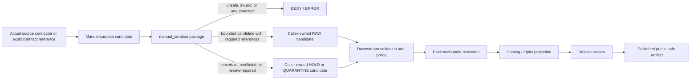

<!-- [KFM_META_BLOCK_V2]
doc_id: kfm://doc/connectors-manual-curation-src-readme
title: connectors/manual_curation/src/ — Manual Curation Greenfield Source Layout and Process-Ownership Boundary
type: readme
version: v0.2
status: draft
owners: OWNER_TBD — Connector steward · Package maintainer · Source steward · Review-workflow steward · Architecture steward · Rights reviewer · Sensitivity reviewer · Policy steward · Validation steward · Test steward · Docs steward
created: 2026-06-19
updated: 2026-07-13
policy_label: public-doctrine; source-layout; greenfield-package; manual-curation; process-not-source; steward-gate; source-admission; rights-fail-closed; sensitivity-fail-closed; quarantine-aware; no-network-default; no-activation; no-publication
current_path: connectors/manual_curation/src/README.md
truth_posture: CONFIRMED repository-present src layout containing one manual_curation package namespace, a 0.0.0 project scaffold, empty initializer, comment-only fetch/admit modules, four-field nonconforming local descriptor, README-only named test lane, empty source-authority register, SourceDescriptor schema-path conflict, stub source/rights/sensitivity policy surfaces, and TODO-only connector workflows / CONFLICTED whether a cross-source manual-curation workflow belongs permanently under the source-specific connectors responsibility root and whether a process-not-source package should carry descriptor.yaml / PROPOSED fail-closed source-layout contract, package-structure constraints, dependency and import boundaries, candidate-only integration posture, and smallest safe implementation sequence / UNKNOWN buildability, package discovery, imports, executable behavior, differently named modules or tests, live integrations, accepted DTOs, substantive CI enforcement, deployment, source activation, and release readiness
evidence_snapshot:
  repository: bartytime4life/Kansas-Frontier-Matrix
  base_ref: main
  base_commit: a715ea0cdbc39c613cc4f2543c73d5eaf9d40e74
  prior_blob: ef52e7f1aeb086e553faf637609cd1049efbc28e
related:
  - ../README.md
  - ../pyproject.toml
  - ../tests/README.md
  - ./manual_curation/README.md
  - ./manual_curation/__init__.py
  - ./manual_curation/fetch.py
  - ./manual_curation/admit.py
  - ./manual_curation/descriptor.yaml
  - ../../../CONTRIBUTING.md
  - ../../../.github/CODEOWNERS
  - ../../../.github/workflows/connector-gate.yml
  - ../../../.github/workflows/source-descriptor-validate.yml
  - ../../../docs/doctrine/directory-rules.md
  - ../../../docs/doctrine/trust-membrane.md
  - ../../../docs/doctrine/lifecycle-law.md
  - ../../../docs/adr/ADR-0001-schema-home--schemas-contracts-v1-is-canonical.md
  - ../../../docs/adr/ADR-0012-connector-outputs-to-data-raw-or-data-quarantine-only.md
  - ../../../docs/registers/DRIFT_REGISTER.md
  - ../../../docs/sources/catalog/manual_curation/README.md
  - ../../../docs/sources/catalog/manual_curation/steward-curation-workflow.md
  - ../../../contracts/source/source_descriptor.md
  - ../../../schemas/contracts/v1/source/source_descriptor.schema.json
  - ../../../schemas/contracts/v1/sources/source_descriptor.schema.json
  - ../../../control_plane/source_authority_register.yaml
  - ../../../data/registry/sources/README.md
  - ../../../policy/source/README.md
  - ../../../policy/rights/README.md
  - ../../../policy/sensitivity/README.md
  - ../../../fixtures/README.md
  - ../../../tests/README.md
  - ../../../release/
tags: [kfm, connectors, manual-curation, manual_curation, src, source-layout, package-layout, python, greenfield, steward-review, source-admission, descriptor, source-role, rights, sensitivity, validation, raw, quarantine, no-network, no-publication, governance]
notes:
  - "Direct reads at the pinned base confirm project kfm-connector-manual_curation version 0.0.0, one manual_curation package namespace, an empty __init__.py, comment-only fetch.py and admit.py, and a four-field descriptor.yaml placeholder."
  - "Exact probes returned Not Found for tests/conftest.py, test_fetch.py, test_admit.py, and test_descriptor.py. Absence claims are bounded to those names and the pinned commit; differently named files remain UNKNOWN."
  - "The child package README is v0.2 and records the same greenfield scaffold, nonconforming descriptor, process-not-source placement conflict, caller-owned candidate boundary, and no-publication posture."
  - "The local descriptor omits the current required SourceDescriptor v1 surface, leaves role and rights unresolved, and asserts sensitivity_floor: public without policy or review evidence."
  - "The machine source-authority register has entries: []; policy/source, policy/rights, and policy/sensitivity are stubs; the populated singular SourceDescriptor schema declares a permissive plural schema canonical; connector workflows run TODO echo steps."
  - "Only this Markdown file is changed. No package code, metadata, dependency, descriptor, registry record, policy, schema, fixture, test, workflow, source material, credential, lifecycle artifact, evidence object, release object, path move, or public artifact is created or changed."
[/KFM_META_BLOCK_V2] -->

<a id="top"></a>

# Manual Curation Greenfield Source Layout and Process-Ownership Boundary

> Repository-grounded boundary for `connectors/manual_curation/src/`. The layout contains one `manual_curation` Python namespace and verified placeholder files, but no supported curation or connector behavior. It organizes future package code only; it is not a source registry, review authority, policy engine, lifecycle store, EvidenceBundle resolver, catalog-closure service, release plane, or public surface.

**Document lifecycle:** `draft v0.2`  
**Current layout maturity:** `CONFIRMED` greenfield `0.0.0` source layout; package runtime is not established  
**Owner:** `OWNER_TBD`  
**Authority:** package-layout documentation only; no source, schema, policy, review, lifecycle, evidence, release, or publication authority  
**Default posture:** one package namespace · process-not-source · no network on import · caller-owned candidates only · no lifecycle writes · no activation · no publication

> [!IMPORTANT]
> The layout currently contains an empty initializer, comment-only fetch and admission modules, a nonconforming descriptor, and documentation rather than executable behavior. A `src/` directory, package name, README, local YAML file, pull request, merge, or green TODO-only workflow is not implementation evidence.

> [!CAUTION]
> `manual_curation` is a steward workflow applied **to** sources, not an upstream publisher or source family. The current location under `connectors/` is repository fact, but permanent ownership is `CONFLICTED / NEEDS VERIFICATION`. The package-local `descriptor.yaml` must not be treated as an approved source record, and `sensitivity_floor: public` is not a public-safety decision.

**Quick links:** [Purpose](#purpose) · [Authority](#authority-level) · [Current layout](#current-layout) · [Repository fit](#repository-fit-and-placement-tension) · [Package identity](#package-and-import-identity) · [What belongs](#what-belongs-under-src) · [Exclusions](#what-does-not-belong-under-src) · [Package boundaries](#package-boundary-and-internal-module-rules) · [Dependencies](#dependency-and-adapter-boundary) · [Imports](#import-time-and-install-time-boundary) · [Descriptor boundary](#descriptor-registry-and-policy-boundary) · [Tests and fixtures](#test-and-fixture-routing) · [Inputs and outputs](#inputs-and-outputs) · [Sensitive material](#rights-sensitivity-privacy-and-protected-material) · [Lifecycle](#lifecycle-and-publication-boundary) · [Validation](#validation) · [CI reality](#ci-and-observability) · [Evidence](#evidence-basis) · [Review](#review-burden) · [Implementation sequence](#smallest-safe-implementation-sequence) · [Definition of done](#definition-of-done) · [Rollback](#rollback) · [Backlog](#verification-backlog)

---

## Purpose

`connectors/manual_curation/src/` is the implementation-layout container for the current manual-curation helper package.

Its present responsibilities are narrow:

- record the exact source layout that exists;
- keep the `manual_curation` namespace visibly greenfield and fail closed;
- distinguish source-layout concerns from package behavior, connector orchestration, steward workflow, tests, fixtures, policy, schemas, registries, lifecycle state, evidence, catalog closure, and release;
- prevent a convenient `src/` folder from becoming a second authority root;
- preserve one reviewable import namespace and avoid silent aliases or duplicate packages;
- constrain future package organization before curation-candidate contracts and review interfaces are accepted;
- require offline, side-effect-free imports and deterministic negative behavior;
- route implementation questions to the child package README and governance questions to their owning roots;
- preserve source identity, curation-run identity, artifact identity, review identity, disposition state, and final governance decisions as separate concepts;
- preserve reversibility while package ownership, descriptor semantics, contracts, policy, fixtures, tests, and orchestration remain unresolved.

This README does not establish a universal fetcher, source activation service, review console, workflow engine, quarantine writer, EvidenceBundle builder, cataloger, public API, map layer, or release path.

[Back to top](#top)

---

## Authority level

**Source-layout documentation only. No independent governance authority.**

| Concern | Status | Evidence-bounded determination |
|---|---:|---|
| Current `src/` path | **CONFIRMED** | This README and one `manual_curation/` package directory exist at the pinned base. |
| Permanent responsibility root | **CONFLICTED / NEEDS VERIFICATION** | `connectors/` owns source-specific acquisition and admission mechanics, while manual curation is a cross-source steward process. Presence does not settle permanent ownership. |
| Distribution metadata | **CONFIRMED PLACEHOLDER** | Parent `pyproject.toml` declares `kfm-connector-manual_curation` version `0.0.0` only. |
| Package namespace | **CONFIRMED** | `src/manual_curation/` exists and contains the package README plus named placeholder files. |
| Current package behavior | **GREENFIELD PLACEHOLDER** | `__init__.py` is empty; `fetch.py` and `admit.py` contain comments only. |
| Local descriptor | **NONCONFORMING / DENY FOR AUTHORITY USE** | Four minimal fields cannot establish source identity, activation, rights, sensitivity, review, or release. |
| Package discovery and installability | **UNKNOWN** | No build backend, dependency set, Python constraint, package-discovery rule, entry point, command, or install evidence was verified. |
| Executable tests | **NOT FOUND AT NAMED PROBES / OTHERWISE UNKNOWN** | Test documentation exists; conventional named tests and `conftest.py` were absent at the pinned base. |
| Source authority | **NOT ESTABLISHED** | The machine source-authority register is `PROPOSED` with `entries: []`. |
| Schema authority | **CONFLICTED** | The populated singular SourceDescriptor schema declares the plural path canonical; the plural schema is an empty permissive scaffold. |
| Policy enforcement | **STUB ONLY** | `policy/source/`, `policy/rights/`, and `policy/sensitivity/` contain greenfield README stubs, not package-specific executable proof. |
| Connector CI | **TODO-ONLY** | Named connector and descriptor workflows execute placeholder `echo TODO` steps. |
| Source activation | **DENIED / NOT VERIFIED** | No conforming descriptor, review state, policy decision, operation authorization, or activation record was verified. |
| Public output | **NONE** | This layout cannot authorize or emit a public file, map, API response, catalog record, EvidenceBundle, proof, or release. |

A source layout may organize code. It cannot define truth, authority, admissibility, lifecycle state, evidence closure, catalog closure, or publication.

[Back to top](#top)

---

## Current layout

### Bounded repository snapshot

Direct reads at base commit `a715ea0cdbc39c613cc4f2543c73d5eaf9d40e74` confirm this named surface:

```text
connectors/manual_curation/
├── README.md                              # parent connector-boundary README v0.1
├── pyproject.toml                         # kfm-connector-manual_curation, version 0.0.0
├── src/
│   ├── README.md                          # this source-layout boundary
│   └── manual_curation/
│       ├── README.md                      # package/steward-gate boundary v0.2
│       ├── __init__.py                    # empty
│       ├── fetch.py                       # comment-only placeholder
│       ├── admit.py                       # comment-only placeholder
│       └── descriptor.yaml                # four-field placeholder
└── tests/
    └── README.md                          # documentation contract v0.1
```

Exact probes returned `Not Found` for:

```text
connectors/manual_curation/tests/conftest.py
connectors/manual_curation/tests/test_fetch.py
connectors/manual_curation/tests/test_admit.py
connectors/manual_curation/tests/test_descriptor.py
```

These statements are bounded to the exact paths and pinned commit. Differently named, generated, unindexed, or later-added files remain `UNKNOWN` until directly inspected.

### Current maturity table

| Surface | Confirmed state | Safe conclusion |
|---|---|---|
| `src/README.md` | This layout contract. | Documents boundaries; does not implement them. |
| `src/manual_curation/README.md` | v0.2 package and steward-gate boundary. | Defines future constraints and unresolved ownership; does not create behavior. |
| `src/manual_curation/__init__.py` | Empty. | No public package API or initialization behavior. |
| `src/manual_curation/fetch.py` | Comment-only. | No source retrieval, packet assembly, hashing, source-head, retry, staging, or adapter behavior. |
| `src/manual_curation/admit.py` | Comment-only. | No validation, policy call, review routing, disposition, receipt, or handoff behavior. |
| `src/manual_curation/descriptor.yaml` | `name: manual_curation`, `role: TBD`, `rights: TBD`, `sensitivity_floor: public`. | Invalid as source authority, activation, rights clearance, sensitivity clearance, review evidence, or release evidence. |
| Parent metadata | Name and `0.0.0` only. | Buildability, dependencies, supported Python, discovery, commands, and runtime remain unknown. |
| Connector tests | README-only at the named probes. | Discovery count, coverage, pass state, negative-case enforcement, and fixture safety remain unknown. |
| Connector workflows | TODO-only. | Green completion proves workflow execution only. |

There is no supported quickstart because no installable distribution, command, callable API, configuration contract, adapter contract, or runner was verified.

[Back to top](#top)

---

## Repository fit and placement tension

Directory Rules assign one primary responsibility to each root. This `src/` layout must stay subordinate to those authority boundaries.

| Responsibility | Owning surface | Source-layout relationship |
|---|---|---|
| Source-specific fetch and admission mechanics | `connectors/` | This layout may host narrow mechanics only if manual curation remains a connector helper. |
| Steward methodology and workflow | `docs/sources/catalog/manual_curation/` | Source-layout documentation follows the workflow docs; it does not redefine them. |
| Cross-source review application or orchestration | **NEEDS VERIFICATION** | A review application, shared package, worker, tool, or pipeline may be a better permanent owner than a connector namespace. No choice is made here. |
| Object meaning | `contracts/` | Package classes and type hints consume accepted meanings; they do not become canonical contracts. |
| Machine shape | `schemas/contracts/v1/` | Package code validates against accepted schemas; local dictionaries, dataclasses, models, or snapshots do not become schema authority. |
| Source identity and activation | Accepted registry and control-plane surfaces | Package code resolves reviewed references; it cannot activate itself. |
| Rights, sensitivity, consent, sovereignty, access, and release decisions | `policy/` and reviewed governance surfaces | Package code may preserve facts and references; it cannot clear risk. |
| Connector-local tests | `connectors/manual_curation/tests/` | Tests may prove retained package mechanics. |
| Cross-system trust-spine tests | Root `tests/` | Canonical enforcement of lifecycle, policy, evidence, review, release, correction, and public-path boundaries belongs outside this package. |
| Golden and negative fixtures | Accepted `fixtures/` lanes | Do not create a parallel fixture authority below `src/`. |
| Lifecycle persistence | `data/` through governed orchestration | Package code may return candidates; it must not discover, select, or write to a sink. |
| Evidence closure | Evidence and proof responsibility roots | A curation packet, checksum, validation result, or steward note is not an EvidenceBundle. |
| Catalog closure | Catalog responsibility roots | A completed helper call cannot close STAC, DCAT, PROV, domain catalog, or triplet records. |
| Release, correction, withdrawal, and rollback | `release/` and governed lifecycle records | A successful curation helper cannot publish anything. |
| Public API and map behavior | Governed applications | Public clients must not import this package or read unresolved candidates. |

### Placement determination

The repository currently places this package below `connectors/manual_curation/`. That path is **CONFIRMED**.

The manual-curation methodology and workflow docs state that manual curation is a process applied to sources rather than an upstream publisher or product. Permanent ownership is therefore **CONFLICTED / NEEDS VERIFICATION**.

This README does not move the path, create a parallel package, or select a replacement. The smallest safe action is to:

1. preserve the current path;
2. prevent the layout from acquiring unreviewed authority;
3. record the process-not-source conflict in architecture review and the drift register;
4. decide whether the package remains a connector helper, becomes compatibility-only, or migrates to a review app, shared package, worker, pipeline, or tool;
5. document any move with an ADR or migration note when required;
6. keep rollback and import compatibility explicit.

[Back to top](#top)

---

## Package and import identity

The only confirmed package namespace below this layout is:

```python
manual_curation
```

The parent distribution name is:

```text
kfm-connector-manual_curation
```

These identifiers are not interchangeable:

- the **repository path** describes current placement;
- the **distribution name** would identify an installable project if packaging is completed;
- the **Python package name** identifies the import namespace;
- a **source ID** identifies an upstream source;
- a **curation run ID** identifies one steward workflow execution;
- an **artifact or content ID** identifies material under review;
- a **review ID** identifies a review record;
- a **decision ID** identifies a governed decision;
- a **release ID** identifies an approved release.

Because manual curation is process-not-source, `manual_curation` must not be converted into `kfm://source/manual_curation` or an equivalent source identity merely because a descriptor file exists locally.

Future packaging must define:

- supported Python versions;
- build backend and build-system requirements;
- package discovery;
- runtime and optional dependency groups;
- public imports;
- typed configuration;
- entry points or commands, if any;
- compatibility and deprecation policy;
- semantic versioning;
- artifact naming;
- reproducible build and installation checks.

Until those exist, imports, installation, editable installs, wheel builds, dependency behavior, and public API stability remain `UNKNOWN`.

[Back to top](#top)

---

## What belongs under `src/`

After ownership, contracts, policy, package configuration, and tests are accepted, this layout may contain one retained package namespace with small helpers for:

- constructing curation-candidate values from explicit caller inputs;
- preserving supplied assertions separately from verified findings;
- validating references to source descriptors, source artifacts, evidence, review requirements, and policy context;
- deterministic source-role anti-collapse checks;
- rights, sensitivity, consent, sovereignty, privacy, and precise-location review flags;
- validation-defect and remediation summaries;
- review-packet assembly without review approval;
- explicit hold, quarantine, deny, abstain, conflict, no-op, rate-limit, or error candidates;
- caller-owned RAW or QUARANTINE handoff candidates;
- correction, supersession, withdrawal, and rollback references;
- redacted logging metadata and reason codes;
- dependency-injected adapters for accepted validators or registries;
- connector-local tests for pure package behavior using synthetic or approved fixtures.

Each executable module must have a narrow responsibility, bounded resource use, deterministic negative behavior where practical, and no implicit lifecycle sink.

[Back to top](#top)

---

## What does not belong under `src/`

This layout must not contain or become:

- a universal source fetcher or hidden network crawler;
- a browser route, public API endpoint, review-console UI, authentication service, or map component;
- source registry records, activation decisions, rights decisions, sensitivity decisions, policy decisions, review approvals, or release decisions;
- a second contract, schema, policy, registry, fixture, receipt, proof, catalog, release, or publication home;
- bulk source payloads, production records, personal exports, genomic files, proprietary documents, exact protected locations, credentials, or malware samples;
- direct writes to `data/raw/`, `data/quarantine/`, `data/receipts/`, `data/work/`, `data/processed/`, `data/catalog/`, `data/triplets/`, `data/proofs/`, `data/published/`, or `release/`;
- automatic source activation, source-role upgrade, rights clearance, sensitivity downgrade, evidence closure, catalog closure, or release;
- import-time network, filesystem mutation, credential discovery, registry mutation, policy evaluation, worker startup, or lifecycle side effects;
- AI output presented as evidence, review approval, or source authority;
- copied canonical schemas, contract snapshots, policy bundles, or fixture corpora maintained as package-local truth;
- logging that exposes source content, secrets, personal data, precise locations, private paths, tokens, or signed URLs;
- public download links, previews, maps, summaries, or metadata views before governed access and release checks.

Administrative or steward convenience does not justify bypassing the trust membrane.

[Back to top](#top)

---

## Package boundary and internal module rules

The child package README is the detailed package contract. This source-layout README adds organization rules:

1. **One primary namespace.** Do not create sibling packages such as `manual_review`, `curation`, `source_curation`, or `steward_tools` without an explicit ownership and migration decision.
2. **No topic mirrors.** Do not mirror `contracts/`, `schemas/`, `policy/`, `fixtures/`, `data/`, or `release/` below `src/`.
3. **No authority by class name.** A local class named `SourceDescriptor`, `EvidenceBundle`, `PolicyDecision`, `ReviewRecord`, or `ReleaseManifest` is not canonical unless imported from or generated from the accepted authority surface.
4. **No generic fetch in a cross-source workflow.** Source retrieval belongs in the connector for the actual source family. Manual curation may receive explicit source/artifact references or injected source-specific adapters.
5. **No hidden persistence.** Package modules return values or use explicit caller-owned interfaces. They must not discover repository paths or lifecycle sinks.
6. **No implicit policy.** Defaults may be conservative, but allow/deny/restrict decisions must remain traceable to accepted policy and review inputs.
7. **No silent role mapping.** Narrative terms and machine enums must be mapped by accepted contract or review, not convenience.
8. **No import side effects.** Imports must not read source material, call services, inspect credentials, initialize clients, or mutate state.
9. **No circular governance dependency.** Canonical contracts, schemas, and policy must not depend on this package to define themselves.
10. **Explicit compatibility.** Renames, moves, or public API changes need migration notes, deprecation behavior, and rollback.

If future implementation needs multiple bounded contexts, split them under their owning responsibility roots rather than expanding this folder into a monolith.

[Back to top](#top)

---

## Dependency and adapter boundary

No dependency set is currently declared. Future dependencies must be admitted deliberately.

### Allowed dependency purposes

A retained package may depend on small, reviewed libraries for:

- typed value validation;
- immutable data structures;
- deterministic serialization;
- URI and timestamp parsing;
- content hashing;
- structured error types;
- explicit adapter protocols;
- test-only property or fixture validation.

### Dependency constraints

Dependencies must:

- have a documented purpose;
- be version constrained according to repository policy;
- avoid network or filesystem side effects on import;
- avoid hidden telemetry;
- avoid dynamic code execution from source material;
- support offline fixture tests;
- preserve deterministic failure behavior;
- receive license and security review appropriate to risk;
- be replaceable behind a narrow adapter where external behavior matters.

### Adapter rules

Adapters for source registries, policy engines, validators, evidence resolvers, review stores, or lifecycle writers must be:

- supplied explicitly by the caller;
- typed and bounded;
- unavailable by default;
- testable with no-network fakes;
- unable to grant authority beyond their accepted contract;
- separated from pure candidate-construction logic;
- explicit about timeout, rate limit, retry, and indeterminate outcomes;
- prevented from logging protected payloads.

The package must not discover adapters through environment scanning, import hooks, global singletons, repository traversal, or implicit service locators.

[Back to top](#top)

---

## Import-time and install-time boundary

### Import-time requirements

A future package import must be:

- offline;
- deterministic;
- side-effect free;
- safe without credentials;
- safe without repository-root discovery;
- safe without writable lifecycle directories;
- safe without policy, registry, database, queue, model, or network services;
- free of worker startup, scheduler registration, telemetry, or background threads.

An import test should prove that importing the package does not:

- open sockets;
- write files;
- create directories;
- read secrets;
- traverse user or repository paths;
- load arbitrary source payloads;
- call a model;
- activate a source;
- register a public route;
- mutate global governance state.

### Install-time requirements

A future build and install path must prove:

- valid project metadata;
- deterministic package discovery;
- reproducible wheel or approved artifact creation;
- installation into an isolated environment;
- no install-time network beyond the approved dependency resolver;
- no arbitrary build-script execution outside the declared backend;
- no source payloads or secrets included in distributions;
- license and dependency metadata;
- import success after installation;
- clean uninstall or environment disposal.

Current `pyproject.toml` does not satisfy those conditions.

[Back to top](#top)

---

## Descriptor, registry, and policy boundary

The package-local `descriptor.yaml` currently contains:

```yaml
name: manual_curation
role: TBD
rights: TBD
sensitivity_floor: public
```

This file is **NONCONFORMING / DENY FOR AUTHORITY USE**.

The inspected SourceDescriptor v1 schema requires a substantially richer surface, including identity, version, source type, source role, authority rank, publisher/steward, rights, sensitivity, cadence, access, citation, source-head metadata, admissibility limits, public-release posture, review state, release state, and lifecycle state.

The local YAML:

- does not identify a legitimate upstream publisher;
- does not establish a stable `source_id`;
- leaves role and rights unresolved;
- asserts a public sensitivity floor without policy or review support;
- does not record source-head or access information;
- does not record review, release, or lifecycle state;
- does not validate against the populated singular-path schema;
- cannot activate a source or authorize a curation operation;
- cannot authorize public access or release.

Because manual curation is a process rather than a source family, the existence and future meaning of `descriptor.yaml` are themselves **NEEDS VERIFICATION**. Possible governed resolutions include:

1. remove it after confirming nothing relies on it;
2. replace it with a non-source capability or package manifest under an accepted contract;
3. retain a descriptor only if a real source identity is established and reviewed;
4. mark it explicitly fixture-only in a governed fixture lane rather than package source.

No resolution is selected here.

The package must resolve reviewed registry and policy references from their owning surfaces. It must not:

- treat a local YAML file as registry authority;
- write registry records;
- invent source-role mappings;
- decide rights or sensitivity;
- lower restrictions because a steward initiated the operation;
- treat validation success as activation or release;
- copy policy rules into package constants as an independent authority.

Unknown descriptor, role, rights, sensitivity, consent, sovereignty, review, or release state fails closed.

[Back to top](#top)

---

## Test and fixture routing

### Connector-local tests

`connectors/manual_curation/tests/` may test pure retained package mechanics such as:

- safe import;
- typed input validation;
- candidate construction;
- source-role anti-collapse;
- descriptor rejection;
- rights and sensitivity flag preservation;
- conflict and indeterminate outcomes;
- no-network behavior;
- no lifecycle writes;
- redacted logs;
- deterministic errors;
- caller-owned handoff candidates;
- correction and rollback reference preservation.

### Root tests

Root `tests/` should prove cross-system properties such as:

- connector or helper boundaries cannot bypass lifecycle stages;
- public clients cannot read unresolved candidates;
- source activation requires reviewed authority;
- policy and evidence closure remain outside the package;
- catalog and release state cannot be minted locally;
- correction and rollback remain visible;
- a package move or compatibility layer preserves expected imports.

### Fixtures

Fixtures belong in accepted fixture roots and should be:

- synthetic, minimized, or approved;
- explicit about source role, rights, sensitivity, consent, review, and expected outcome;
- paired with safety metadata;
- free of real credentials and protected source material;
- split into valid and invalid cases;
- content-addressed or otherwise stable where practical;
- prohibited from becoming production evidence.

Do not place a growing fixture corpus below `src/`. Tiny inline values may be acceptable for unit tests, but golden artifacts and policy-significant examples belong in governed fixture lanes.

### Current evidence limit

The named test files were not found at the pinned base. This README does not claim that no differently named tests exist. It claims only that executable coverage, collection, pass state, and CI enforcement were not established.

[Back to top](#top)

---

## Inputs and outputs

### Current

None. The inspected layout declares no supported function, class, command, configuration object, adapter, endpoint, credential variable, fixture shape, or runner.

### Future admissible inputs

A retained implementation may accept only explicit caller-supplied values such as:

- curation-run identity and actor/reviewer context;
- source and artifact references;
- a reviewed SourceDescriptor reference or explicit pre-descriptor intake mode;
- supplied assertions marked as unverified;
- accepted contract versions;
- rights, sensitivity, consent, sovereignty, access, and review context;
- validation results and defect records;
- policy or evidence references without package-local authority;
- correction, supersession, withdrawal, and rollback references;
- bounded operation authorization;
- caller-supplied adapters;
- correlation, trace, and audit context that excludes secrets.

The package must not infer a production source, sink, policy, reviewer, credential, or release target by searching the environment or repository.

### Future bounded outputs

A retained package may return in memory or through an explicit caller-owned interface:

1. a curation-candidate value preserving supplied and verified fields separately;
2. a review-packet candidate with unresolved requirements visible;
3. a validation-defect or remediation summary;
4. a source-role conflict or anti-collapse finding;
5. a rights, sensitivity, consent, sovereignty, privacy, or precise-location review flag;
6. a hold or quarantine candidate with structured reasons;
7. an admit candidate suitable for caller-owned RAW consideration;
8. a deterministic deny, abstain, conflict, no-op, rate-limit, or error outcome;
9. a correction, supersession, withdrawal, or rollback handoff candidate;
10. a process-memory receipt candidate if an accepted receipt contract exists.

The exact DTOs, reason-code vocabulary, adapter protocols, idempotency rules, and receipt type remain **PROPOSED / NEEDS VERIFICATION**.

The layout must not emit a reviewed SourceDescriptor, SourceActivationDecision, EvidenceBundle, processed record, catalog item, triplet, proof, ReleaseManifest, public preview, map layer, API answer, or publication decision.

[Back to top](#top)

---

## Rights, sensitivity, privacy, and protected material

Manual curation is used precisely when automated handling is insufficient. The package may preserve review-relevant facts; it cannot clear them.

Treat the following as hold, quarantine, restricted, denied, or review-required until the owning policies and reviewers decide otherwise:

- living-person data, contact details, residences, identifiers, allegations, case material, or linked profiles;
- DNA, genomic, health, biometric, or ancestry data;
- exact rare-species, habitat, archaeology, burial, sacred, or culturally sensitive locations;
- sovereignty-governed or community-controlled knowledge;
- parcel, landowner, tenant, utility, permit, or private-property joins;
- critical infrastructure, access routes, vulnerabilities, or facility-adjacent precision;
- proprietary, copyrighted, licensed, embargoed, confidential, privileged, or contract-restricted material;
- credentials, private keys, tokens, cookies, passwords, signed URLs, or private endpoints;
- exact geometry whose CRS, datum, derivation, uncertainty, consent, or public-safe transform is unresolved;
- hidden metadata, comments, revision history, embedded files, thumbnails, or attachments;
- joins that become more sensitive than any input alone;
- AI-generated or synthetic material presented as observed, regulatory, historical, measured, or authoritative;
- stale, superseded, corrected, incomplete, or selectively excerpted material without state and provenance.

Preserve separately:

- original source/artifact reference;
- supplied assertions;
- verified findings;
- restricted precise representation;
- proposed generalized or redacted derivative;
- transform rule and version;
- reviewer requirement and decision;
- public-safe representation, if later approved;
- correction, withdrawal, supersession, and rollback state.

Do not copy protected content into exceptions, logs, fixtures, issue bodies, pull requests, generated reports, or model prompts.

[Back to top](#top)

---

## Lifecycle and publication boundary

KFM's lifecycle invariant remains:

```text
RAW → WORK / QUARANTINE → PROCESSED → CATALOG / TRIPLET → PUBLISHED
```

This source layout participates, if retained, only at the source-admission and steward-review edge. Package code may prepare caller-owned candidates for RAW or QUARANTINE. It does not select, create, mutate, or promote lifecycle state.



The package must not:

- write directly to any lifecycle root;
- mutate or delete source artifacts;
- normalize source-native records into canonical domain truth;
- create EvidenceBundles or proof packs;
- close catalog or triplet records;
- authorize release;
- expose unresolved material to public clients;
- treat a commit, PR, merge, file move, or successful helper call as promotion.

Promotion remains a governed state transition outside this layout.

[Back to top](#top)

---

## Validation

A future source layout is reviewable only when validation proves both positive behavior and negative authority boundaries.

| Concern | Required proof |
|---|---|
| Layout | One intended package namespace; no duplicate or shadow packages. |
| Packaging | Reproducible build, isolated installation, explicit Python support, package discovery, and import success. |
| Imports | No network, filesystem mutation, credential lookup, service startup, or lifecycle side effect. |
| Public API | Explicit, typed, minimal, versioned, and documented. |
| Inputs | Explicit source/artifact, descriptor, review, policy, and operation context; no ambient discovery. |
| Outputs | Candidate values only; no authority-bearing object minted locally. |
| Source role | No silent role upgrade or narrative-to-enum convenience mapping. |
| Descriptor | Current placeholder rejected for authority use. |
| Rights and sensitivity | Unknown, restricted, contested, or unsupported states fail closed. |
| Evidence | Evidence references preserved; helper output never becomes EvidenceBundle closure. |
| Review | Review requirements remain visible; package cannot approve itself. |
| Lifecycle | No direct persistence; caller-owned RAW/QUARANTINE candidates only. |
| Catalog and release | No catalog closure, proof, release, or public artifact emission. |
| Logging | No source payloads, secrets, personal data, or precise locations leaked. |
| Errors | Deterministic, structured, bounded, and safe. |
| Corrections | Supersession, withdrawal, and rollback references preserved. |
| Compatibility | Moves or renames have tested import and migration behavior. |

Required negative tests should include:

- missing or nonconforming descriptor;
- unresolved rights;
- unresolved sensitivity;
- missing review context;
- source-role conflict;
- unsupported or ambiguous evidence reference;
- invalid operation authorization;
- attempted direct lifecycle write;
- attempted registry or policy mutation;
- attempted EvidenceBundle, catalog, or release creation;
- import-time network or filesystem access;
- sensitive content in logs;
- unavailable or indeterminate adapter;
- correction or withdrawal state ignored;
- duplicate package or import alias.

A green README-only or TODO-only workflow is not proof that these conditions pass.

[Back to top](#top)

---

## CI and observability

The inspected connector and descriptor workflows currently execute placeholder `echo TODO` steps. Their success proves only that GitHub Actions started and completed those steps.

A substantive source-layout gate should eventually report:

- metadata and build validation;
- isolated package installation;
- package namespace inventory;
- import-safety test;
- no-network test;
- unit and property-test counts;
- valid/invalid fixture results;
- descriptor rejection and schema parity;
- source-role anti-collapse;
- rights and sensitivity negative cases;
- direct-write denial;
- redacted-log checks;
- dependency and license scan;
- generated receipt or test-report location;
- workflow commit SHA and environment;
- correction/rollback test result.

Observability must not expose source content or protected metadata. Prefer:

- stable run and candidate identifiers;
- reason codes;
- adapter names and versions;
- bounded timing and count metrics;
- success, deny, abstain, conflict, quarantine, and error counts;
- validation report references;
- no payload excerpts.

No package-specific dashboard, runtime log, deployment, service-level objective, activation metric, or release metric was verified.

[Back to top](#top)

---

## Evidence basis

| Evidence | Status | Supports | Does not prove |
|---|---:|---|---|
| `connectors/manual_curation/src/README.md` | **CONFIRMED** | Existing v0.1 layout document and prior blob. | Package behavior or ownership correctness. |
| `connectors/manual_curation/pyproject.toml` | **CONFIRMED** | Distribution name and `0.0.0` placeholder version. | Buildability, dependencies, discovery, commands, or supported Python. |
| `src/manual_curation/__init__.py` | **CONFIRMED empty** | No current initializer behavior. | Absence of every possible module or external integration. |
| `src/manual_curation/fetch.py` | **CONFIRMED comment-only** | No implemented named fetch surface. | Absence of differently named retrieval code elsewhere. |
| `src/manual_curation/admit.py` | **CONFIRMED comment-only** | No implemented named admission surface. | Absence of differently named admission code elsewhere. |
| `src/manual_curation/descriptor.yaml` | **CONFIRMED four-field placeholder** | Current local descriptor content. | Source authority, rights clearance, sensitivity clearance, review, activation, or release. |
| `src/manual_curation/README.md` v0.2 | **CONFIRMED** | Repository-grounded package boundary, process-not-source conflict, and implementation limits. | Executable behavior. |
| `connectors/manual_curation/tests/README.md` | **CONFIRMED** | Intended test posture. | Executable tests, collection, coverage, or pass state. |
| Exact test probes | **NOT FOUND** | Named conventional files were absent at the pinned base. | Absence of differently named tests. |
| Manual-curation methodology and workflow docs | **CONFIRMED docs** | Manual curation is a steward process applied to sources. | Accepted implementation placement or runtime. |
| SourceDescriptor contract and singular schema | **CONFIRMED present / PROPOSED authority** | Rich current field surface and anti-collapse semantics. | Accepted canonical migration or validator enforcement. |
| Plural SourceDescriptor schema | **CONFIRMED permissive scaffold** | Schema-path conflict exists. | A validated canonical schema. |
| Source-authority register | **CONFIRMED `entries: []`** | No machine entry establishes authority. | Absence of all human or external decisions. |
| Policy READMEs | **CONFIRMED stubs** | Policy roots exist. | Executable rights, sensitivity, or source policy. |
| Connector workflows | **CONFIRMED TODO-only** | Trigger and placeholder steps exist. | Substantive validation. |
| Directory Rules and lifecycle doctrine | **CONFIRMED doctrine** | Responsibility-root, trust-membrane, and lifecycle boundaries. | Final disposition of the process-not-source placement conflict. |

Repository evidence outranks the old speculative layout. Doctrine governs placement and trust. Neither turns proposed code into implementation.

[Back to top](#top)

---

## Review burden

Changes below this layout should be reviewed according to impact.

| Change | Minimum review burden |
|---|---|
| README wording with no behavior change | Package maintainer or connector steward + Docs steward. |
| Package metadata, dependencies, discovery, or supported Python | Package maintainer + Test steward + Security/dependency reviewer. |
| New public import or DTO | Package maintainer + Contract/schema steward + affected workflow owner. |
| Source-role or descriptor behavior | Source steward + Contract/schema steward + Policy steward. |
| Rights, sensitivity, consent, sovereignty, privacy, or precise-location handling | Relevant rights/sensitivity/community/domain reviewers. |
| Registry, policy, evidence, or review adapters | Owning subsystem steward + package maintainer + security reviewer. |
| RAW/QUARANTINE candidate integration | Connector/pipeline owner + validation steward + lifecycle reviewer. |
| Package move or ownership change | Architecture steward + Docs steward + affected owners; ADR or migration note when required. |
| Public API, map, or release coupling | DENY as a package-local shortcut; redesign through governed applications and release surfaces. |

The author of a material policy-significant change should not be the sole approver when separation of duties is applicable.

[Back to top](#top)

---

## Smallest safe implementation sequence

1. **Resolve ownership and placement.** Decide whether this remains a connector helper, becomes compatibility-only, or moves to a review app, package, worker, pipeline, or tool.
2. **Resolve descriptor semantics.** Retire or replace `descriptor.yaml` unless a governed decision establishes a legitimate non-source capability manifest or true source identity.
3. **Define bounded-context meanings.** Specify curation candidate, review packet, disposition candidate, conflict, and handoff semantics under the owning contract root.
4. **Resolve schema authority.** Complete the singular/plural SourceDescriptor migration and validator parity before depending on it.
5. **Add schemas and fixtures.** Include negative cases for missing descriptors, unknown rights, sensitivity, conflicts, quarantine, and errors.
6. **Complete package metadata.** Add the repository-approved build backend, Python support, package discovery, dependencies, and test configuration.
7. **Prove import safety.** Add isolated no-network, no-side-effect import tests.
8. **Implement pure helpers first.** Use explicit inputs, immutable outputs, injected adapters, and no global discovery.
9. **Add deterministic tests.** Prove anti-collapse, descriptor rejection, fail-closed routing, redacted logs, and output boundaries.
10. **Integrate caller-owned candidates.** Use accepted interfaces for RAW or QUARANTINE consideration; keep package persistence disabled.
11. **Replace TODO workflows.** Validate metadata, packaging, schemas, fixtures, tests, no-network behavior, and connector-output boundaries.
12. **Run a fixture-only steward slice.** Produce a review candidate and a hold/quarantine result without activation, catalog closure, or publication.
13. **Keep live retrieval source-specific.** Add network access only in the connector that owns the actual source.
14. **Activate only after governed review.** Require source, policy, validation, evidence, review, correction, and rollback support appropriate to the operation.

Do not skip from placeholder files directly to a live cross-source workflow, universal fetcher, or public UI.

[Back to top](#top)

---

## Definition of done

Do not call this source layout implemented, operational, production-ready, activated, or release-ready until all applicable conditions are proven:

- [ ] Permanent responsibility root and owning component are decided and documented.
- [ ] Any compatibility or migration relationship is recorded and reversible.
- [ ] One intended package/import namespace is retained without shadow aliases.
- [ ] `descriptor.yaml` semantics are resolved without creating fake source authority.
- [ ] SourceDescriptor canonical path conflict is resolved through accepted governance and migration.
- [ ] Package metadata declares a supported, reproducible build and test path.
- [ ] Isolated build, install, import, and uninstall/disposal checks pass.
- [ ] Public import surface and supported interfaces are explicit and versioned.
- [ ] Candidate, review, disposition, conflict, and handoff meanings are accepted.
- [ ] Machine schemas and valid/invalid fixtures exist in governed homes.
- [ ] Imports are side-effect free and no-network by default.
- [ ] Dependencies are reviewed, constrained, and documented.
- [ ] Source-role anti-collapse is tested.
- [ ] Rights, sensitivity, consent, sovereignty, privacy, and precise-location failures are tested.
- [ ] Evidence references remain unresolved until the owning evidence service resolves them.
- [ ] Package outputs cannot become activation, policy, evidence, review, catalog, proof, or release authority.
- [ ] No direct lifecycle, registry, policy, evidence, catalog, or release writes are possible.
- [ ] Logs and errors are verified not to leak protected material.
- [ ] Connector and descriptor workflows perform substantive checks rather than TODO echoes.
- [ ] Review responsibilities and separation-of-duties expectations are recorded.
- [ ] Correction, supersession, withdrawal, and rollback behavior are testable.
- [ ] Public clients have no direct path to the package or unresolved candidates.
- [ ] Generated receipts, runtime evidence, or CI results support every maturity claim.

A passing package suite still does not publish or prove a source claim.

[Back to top](#top)

---

## Rollback

This revision changes documentation only.

**Base commit:** `a715ea0cdbc39c613cc4f2543c73d5eaf9d40e74`  
**Prior README blob:** `ef52e7f1aeb086e553faf637609cd1049efbc28e`

Before merge, rollback means closing or abandoning the review branch and leaving `main` unchanged. After merge, rollback means a transparent revert of the documentation commit or restoration of the prior blob through a new reviewed commit.

Rollback is required if this README is used to claim:

- executable curation behavior that is not present;
- accepted package ownership despite the process-not-source conflict;
- SourceDescriptor conformance or source activation from the local YAML;
- public sensitivity clearance from `sensitivity_floor: public`;
- working tests or CI from README-only and TODO-only surfaces;
- source-role, rights, sensitivity, review, evidence, catalog, release, or publication authority;
- direct lifecycle or public-path access;
- absence of all tests or modules based only on the named probes.

Do not delete history, force-push shared branches, or silently replace correction lineage.

[Back to top](#top)

---

## Verification backlog

| Item | Status | Evidence needed |
|---|---:|---|
| Decide whether manual curation is correctly owned by `connectors/`. | **CONFLICTED / NEEDS VERIFICATION** | Directory Rules review, architecture decision, drift entry, and ADR or migration note if required. |
| Decide whether `src/` remains, moves, or becomes compatibility-only. | **NEEDS VERIFICATION** | Ownership decision, dependency graph, import consumers, and migration plan. |
| Decide the future of package-local `descriptor.yaml`. | **NEEDS VERIFICATION** | Source-governance decision separating process metadata from source identity. |
| Resolve singular/plural SourceDescriptor schema authority. | **CONFLICTED** | Accepted ADR/migration, canonical schema, fixtures, validator parity, and registry update. |
| Confirm package buildability and package discovery. | **UNKNOWN** | Completed metadata, isolated build/install, artifact inspection, and import test. |
| Confirm actual package API. | **UNKNOWN** | Implemented typed interfaces and tests. |
| Confirm differently named modules, tests, or fixtures. | **UNKNOWN** | Complete tree inspection or mounted checkout. |
| Define curation-candidate and review-packet contracts. | **PROPOSED** | Accepted contract, schema, examples, and versioning rules. |
| Define finite disposition and conflict vocabulary. | **PROPOSED** | Contract, policy crosswalk, reason-code registry, and negative fixtures. |
| Confirm source-role, rights, sensitivity, consent, and review routing. | **UNKNOWN** | Policy packages, workflow integration, code, and tests. |
| Confirm no-network default and side-effect-free import. | **UNKNOWN** | Executable tests and substantive CI logs. |
| Confirm caller-owned RAW/QUARANTINE candidate interface. | **UNKNOWN** | Accepted interface contract, code, fixtures, and tests. |
| Confirm evidence-reference preservation and non-closure. | **UNKNOWN** | Evidence contract integration and negative tests. |
| Confirm correction, supersession, withdrawal, and rollback handling. | **UNKNOWN** | Contracts, code, fixtures, and replay tests. |
| Replace TODO-only connector workflows. | **PROPOSED** | Real checks, permissions review, passing/failing evidence, and required-check status. |
| Assign semantic owners and reviewers. | **NEEDS VERIFICATION** | CODEOWNERS and governance review aligned to actual teams. |
| Confirm runtime, deployment, activation, and release posture. | **UNKNOWN** | Runtime traces, deployment config, activation record, release evidence, and rollback proof. |

[Back to top](#top)

---

## Maintainer checklist

Before expanding this source layout:

- verify the responsibility root and migration posture;
- preserve manual curation as a process, not a fabricated source;
- keep a single deliberate package namespace;
- reject the current local descriptor for authority use;
- keep source-specific retrieval in source-specific connectors;
- use explicit inputs and caller-owned outputs;
- default to no network and no side effects;
- keep source role, rights, sensitivity, evidence, review, catalog, and release states separate;
- route uncertainty to review, hold, quarantine, deny, abstain, conflict, or error;
- keep canonical contracts, schemas, policy, registries, fixtures, and lifecycle records outside `src/`;
- keep public clients behind governed released interfaces;
- pair every behavior claim with code, fixtures, tests, and current evidence;
- preserve correction and rollback paths.

**Core rule:** organize helper code without becoming the decision authority.

[Back to top](#top)
