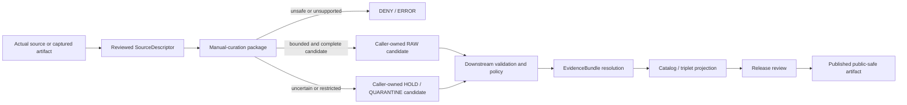

<!-- [KFM_META_BLOCK_V2]
doc_id: kfm://doc/connectors-manual-curation-src-package-readme
title: connectors/manual_curation/src/manual_curation/ — Manual Curation Greenfield Package and Steward-Gate Boundary
type: readme
version: v0.2
status: draft
owners: OWNER_TBD — Connector steward · Package maintainer · Source steward · Review-workflow steward · Rights reviewer · Sensitivity reviewer · Policy steward · Validation steward · Test steward · Docs steward · Architecture steward
created: 2026-06-19
updated: 2026-07-13
policy_label: public-doctrine; greenfield-package; manual-curation; process-not-source; steward-gate; source-admission; rights-fail-closed; sensitivity-fail-closed; quarantine-aware; no-network-default; no-activation; no-publication
current_path: connectors/manual_curation/src/manual_curation/README.md
truth_posture: CONFIRMED repository-present 0.0.0 Python scaffold with empty initializer, comment-only fetch/admit modules, four-field nonconforming local descriptor, README-only named test lane, empty source-authority register, SourceDescriptor schema-path conflict, stub policy surfaces, and TODO-only connector workflows / CONFLICTED whether a cross-source manual-curation workflow belongs permanently under the source-specific connectors responsibility root and whether descriptor.yaml should exist for a process that is not an upstream source / PROPOSED bounded steward-assistance package contract and smallest safe implementation sequence / UNKNOWN buildability, imports, executable behavior, differently named tests or fixtures, live integrations, accepted DTOs, substantive CI enforcement, deployment, source activation, and release readiness
evidence_snapshot:
  repository: bartytime4life/Kansas-Frontier-Matrix
  base_ref: main
  base_commit: b06215ea7b9990c76e4c9b756a966ce0d5bf3f8b
  prior_blob: 883227b8110b40c0d5566fff8499fd9d768a8fda
related:
  - ../README.md
  - ../../README.md
  - ../../pyproject.toml
  - ../../tests/README.md
  - ./__init__.py
  - ./fetch.py
  - ./admit.py
  - ./descriptor.yaml
  - ../../../../CONTRIBUTING.md
  - ../../../../.github/CODEOWNERS
  - ../../../../.github/workflows/connector-gate.yml
  - ../../../../.github/workflows/source-descriptor-validate.yml
  - ../../../../docs/doctrine/directory-rules.md
  - ../../../../docs/doctrine/trust-membrane.md
  - ../../../../docs/doctrine/lifecycle-law.md
  - ../../../../docs/adr/ADR-0001-schema-home--schemas-contracts-v1-is-canonical.md
  - ../../../../docs/adr/ADR-0012-connector-outputs-to-data-raw-or-data-quarantine-only.md
  - ../../../../docs/registers/DRIFT_REGISTER.md
  - ../../../../docs/sources/catalog/manual_curation/README.md
  - ../../../../docs/sources/catalog/manual_curation/steward-curation-workflow.md
  - ../../../../contracts/source/source_descriptor.md
  - ../../../../schemas/contracts/v1/source/source_descriptor.schema.json
  - ../../../../schemas/contracts/v1/sources/source_descriptor.schema.json
  - ../../../../control_plane/source_authority_register.yaml
  - ../../../../data/registry/sources/README.md
  - ../../../../policy/source/README.md
  - ../../../../policy/rights/README.md
  - ../../../../policy/sensitivity/README.md
  - ../../../../fixtures/README.md
  - ../../../../tests/README.md
  - ../../../../release/
tags: [kfm, connectors, manual-curation, manual_curation, package, python, steward-review, source-admission, descriptor, source-role, rights, sensitivity, validation, raw, quarantine, no-network, no-publication, governance]
notes:
  - "Direct reads at the pinned base confirm project kfm-connector-manual_curation version 0.0.0, an empty __init__.py, comment-only fetch.py and admit.py, and a four-field descriptor.yaml placeholder."
  - "Exact probes returned Not Found for tests/conftest.py, test_fetch.py, test_admit.py, and test_descriptor.py. Absence claims are bounded to those names and the pinned commit; differently named files remain UNKNOWN."
  - "The local descriptor is not a conforming SourceDescriptor. It omits the current required v1 surface, leaves role and rights unresolved, and asserts sensitivity_floor: public without policy or review evidence."
  - "The manual-curation methodology and workflow docs state that manual curation is a steward process applied to sources, not an upstream publisher or source family. Permanent package placement and descriptor semantics therefore remain CONFLICTED / NEEDS VERIFICATION."
  - "The machine source-authority register has entries: []; policy/source, policy/rights, and policy/sensitivity are stubs; the populated singular SourceDescriptor schema declares a permissive plural schema canonical; connector workflows run TODO echo steps."
  - "Only this Markdown file is changed. No code, metadata, descriptor, registry entry, policy, schema, fixture, test, workflow, source payload, credential, lifecycle artifact, evidence object, release object, path move, or public artifact is created or changed."
[/KFM_META_BLOCK_V2] -->

<a id="top"></a>

# Manual Curation Greenfield Package and Steward-Gate Boundary

> Repository-grounded boundary for `connectors/manual_curation/src/manual_curation/`. The namespace exists, but the inspected package is a non-operational `0.0.0` scaffold. It does not currently fetch, parse, curate, admit, quarantine, persist, activate, catalog, release, or publish source material.

**Document lifecycle:** `draft v0.2`  
**Current package maturity:** `CONFIRMED` greenfield scaffold; supported runtime behavior is not established  
**Owner:** `OWNER_TBD`  
**Authority:** package-boundary documentation only; no source, schema, policy, review, lifecycle, evidence, release, or publication authority  
**Default posture:** steward-assisted · process-not-source · no-network by default · unresolved material fails closed · no public output

> [!IMPORTANT]
> The package currently contains an empty initializer, comment-only fetch and admission modules, and a nonconforming local descriptor. A directory, README, placeholder YAML, pull request, merge, or green TODO-only workflow is not implementation evidence.

> [!CAUTION]
> `manual_curation` is a workflow applied **to** sources; it is not itself an upstream publisher. The package-local `descriptor.yaml` must not be treated as an approved source record, and `sensitivity_floor: public` is not a public-safety decision.

**Quick links:** [Purpose](#purpose) · [Authority](#authority-level) · [Current package](#current-package) · [Repository fit](#repository-fit-and-placement-tension) · [Bounded context](#bounded-context) · [Inputs and outputs](#inputs-and-outputs) · [Descriptor boundary](#descriptor-registry-and-activation-boundary) · [Workflow](#relationship-to-the-steward-curation-workflow) · [Rights and sensitivity](#source-role-rights-sensitivity-and-review) · [Identity and time](#identity-time-and-provenance) · [Lifecycle](#lifecycle-and-publication-boundary) · [Failure contract](#failure-contract) · [Validation](#validation-and-fixtures) · [Interfaces](#interfaces-and-side-effects) · [CI reality](#ci-and-observability) · [Evidence](#evidence-basis) · [Review](#review-burden) · [Implementation sequence](#smallest-safe-implementation-sequence) · [Definition of done](#definition-of-done) · [Rollback](#rollback) · [Backlog](#verification-backlog)

---

## Purpose

`connectors/manual_curation/src/manual_curation/` is the current Python namespace reserved for narrow helper mechanics that may support a steward-led curation pass.

A safe retained package may eventually help a caller:

- assemble a reviewable candidate from explicit source and artifact references;
- preserve supplied assertions separately from verified findings;
- validate that descriptor, source-role, rights, sensitivity, evidence, and review references are present;
- prepare structured review, hold, quarantine, denial, abstention, conflict, or error candidates;
- preserve validation defects and remediation requirements;
- produce caller-owned candidates for a governed RAW or QUARANTINE decision;
- keep AI or watcher summaries advisory;
- preserve correction, supersession, withdrawal, and rollback references;
- stop at the source-admission and steward-review boundary.

The package must not turn a steward note, source file, generated summary, successful validation, or completed curation session into truth or release authority. Manual curation walks material through gates; it does not replace those gates.

This README defines the boundary future code must satisfy. It does not prove that the future mechanics exist.

[Back to top](#top)

---

## Authority level

**Greenfield helper-package scaffold. No independent governance authority.**

| Concern | Status | Evidence-bounded determination |
|---|---:|---|
| Responsibility root | **CONFLICTED / NEEDS VERIFICATION** | `connectors/` owns source-specific fetch and admission mechanics, but manual curation is a cross-source steward workflow rather than an upstream source. The current path exists; permanent placement needs an explicit architecture or migration decision. |
| Current namespace | **CONFIRMED** | This README and the named placeholder package files exist at the pinned base. |
| Distribution | **CONFIRMED PLACEHOLDER** | `pyproject.toml` declares `kfm-connector-manual_curation` version `0.0.0`; no build backend, dependency set, Python constraint, package discovery, entry point, or command is declared. |
| Current implementation | **GREENFIELD PLACEHOLDER** | `__init__.py` is empty; `fetch.py` and `admit.py` contain comments only. |
| Local descriptor | **NONCONFORMING / DENY FOR AUTHORITY USE** | Four minimal fields do not satisfy the inspected SourceDescriptor v1 schema and cannot authorize access, admission, or release. |
| Executable tests | **NOT FOUND AT NAMED PROBES / OTHERWISE UNKNOWN** | The test README exists; conventional named test modules and `conftest.py` were absent at the pinned base. |
| Source authority | **NOT ESTABLISHED** | The machine source-authority register is `PROPOSED` with `entries: []`. |
| Schema authority | **CONFLICTED** | The populated singular-path schema declares the plural path canonical; the plural-path schema is an empty permissive scaffold. |
| Policy enforcement | **STUB ONLY** | `policy/source/`, `policy/rights/`, and `policy/sensitivity/` contain greenfield README stubs, not package-specific executable proof. |
| Connector CI | **TODO-ONLY** | The inspected connector and descriptor workflows execute placeholder `echo TODO` steps. |
| Source activation | **DENIED / NOT VERIFIED** | No conforming descriptor, source-head evidence, policy decision, review state, or activation record was verified. |
| Public output | **NONE** | This package cannot approve or emit a public file, map, API response, catalog record, EvidenceBundle, proof, or release. |

Tests may later prove package behavior. They do not become authority for source identity, rights, sensitivity, policy, evidence, or publication.

[Back to top](#top)

---

## Current package

### Bounded repository snapshot

Direct reads at base commit `b06215ea7b9990c76e4c9b756a966ce0d5bf3f8b` confirm:

```text
connectors/manual_curation/
├── README.md
├── pyproject.toml                         # project name + version 0.0.0 only
├── src/
│   ├── README.md
│   └── manual_curation/
│       ├── README.md                      # this file
│       ├── __init__.py                    # empty
│       ├── fetch.py                       # comment-only placeholder
│       ├── admit.py                       # comment-only placeholder
│       └── descriptor.yaml                # four-field placeholder
└── tests/
    └── README.md                          # documentation contract only
```

Exact probes returned `Not Found` for:

```text
connectors/manual_curation/tests/conftest.py
connectors/manual_curation/tests/test_fetch.py
connectors/manual_curation/tests/test_admit.py
connectors/manual_curation/tests/test_descriptor.py
```

These absence statements are bounded to the exact paths and pinned commit. Differently named, generated, unindexed, or later-added files remain `UNKNOWN` until directly inspected.

### Current maturity table

| Surface | Confirmed state | Safe conclusion |
|---|---|---|
| `pyproject.toml` | Name and `0.0.0` only. | Buildability, installability, Python support, dependencies, commands, and package discovery are unknown. |
| `__init__.py` | Empty. | No public import API or initialization behavior. |
| `fetch.py` | Comment-only. | No retrieval, packet assembly, hashing, source-head, retry, or staging behavior. |
| `admit.py` | Comment-only. | No validation, policy call, review routing, disposition, receipt, or handoff behavior. |
| `descriptor.yaml` | `name`, `role: TBD`, `rights: TBD`, `sensitivity_floor: public`. | Invalid as source authority, activation, rights clearance, sensitivity clearance, or release evidence. |
| Tests | README-only at named probes. | Collection, coverage, pass state, negative-case enforcement, and fixture safety are unknown. |
| Workflows | TODO-only. | A green run would prove workflow execution only. |

There is no supported quickstart because no supported command, callable API, configuration contract, or runner was verified.

[Back to top](#top)

---

## Repository fit and placement tension

Directory Rules assign files by responsibility. The current path is implementation evidence, but presence does not settle architecture.

| Responsibility | Owning surface | Package relationship |
|---|---|---|
| Source-specific fetch and admission mechanics | `connectors/` | This package may hold narrow mechanics only if manual curation is retained as a connector helper. |
| Steward workflow and methodology | `docs/sources/catalog/manual_curation/` | Package follows the docs; it does not redefine the workflow. |
| Object meaning | `contracts/` | Package consumes accepted meanings; local classes do not become canonical contracts. |
| Machine shape | `schemas/contracts/v1/` | Package validates against accepted schemas; local dicts or YAML do not become schema authority. |
| Source identity and activation | Registry/control-plane surfaces | Package resolves reviewed records; it cannot activate itself. |
| Rights, sensitivity, consent, access, and release policy | `policy/` | Package preserves facts and references; it does not make final decisions. |
| Canonical fixtures and test proof | Governed `fixtures/` and `tests/` lanes | Connector-local tests prove mechanics only and must not create parallel authority. |
| Lifecycle persistence | `data/` through governed orchestration | Package may return candidates; it must not discover or select a sink. |
| Evidence closure | Evidence/proof responsibility roots | A curation packet, checksum, validation report, or steward note is not an EvidenceBundle. |
| Release, correction, withdrawal, and rollback | `release/` and governed lifecycle records | A successful curation helper cannot publish anything. |
| Public API and map behavior | Governed applications | Public clients must not import this package or read unresolved candidates. |

### Placement determination

The workflow docs state that manual curation is a **process applied to sources**, not a publisher or source family. That creates two unresolved questions:

1. Does generic cross-source orchestration belong under `connectors/`?
2. Should a process package carry a source-shaped `descriptor.yaml` at all?

This README does not decide those questions. Safe options include:

- retain this package as a narrow compatibility/helper layer with no generic network retrieval;
- move generic orchestration to a governed review application, shared package, or tool after an ADR/migration review;
- keep source-specific fetching in each actual source connector and let manual curation coordinate only explicit candidates;
- retire the local descriptor unless a non-source capability-manifest contract is accepted.

No path is moved and no new authority home is created by this documentation update. The conflict should be recorded in the drift register before implementation expands.

[Back to top](#top)

---

## Bounded context

### Inside this package, if retained

- pure candidate and review-packet assembly from explicit inputs;
- preservation of source identifiers, artifact digests, evidence references, and review references;
- validation of required references and local structural invariants;
- deterministic reason generation from accepted vocabularies;
- preparation of caller-owned hold, quarantine, deny, abstain, conflict, error, or RAW-candidate results;
- no-network fixture support;
- redacted, structured diagnostic output;
- correction, supersession, withdrawal, and rollback-reference preservation.

### Outside this package

- source-specific network retrieval and authentication unless an actual source contract explicitly assigns it here;
- SourceDescriptor registry ownership or source activation;
- source-role, rights, sensitivity, consent, sovereignty, privacy, or release decisions;
- canonical object meaning or schema definition;
- lifecycle storage, mutation, promotion, or deletion;
- normalization, cross-source joins, claim inference, catalog projection, graph projection, or tiling;
- EvidenceBundle resolution or proof creation;
- release manifests, correction authority, rollback authorization, or publication;
- public API, UI, map, Focus Mode, or AI answer behavior.

The package may help prepare evidence for a decision. It must not become the decision maker.

[Back to top](#top)

---

## Inputs and outputs

### Current inputs and outputs

None. The inspected package declares no supported function, class, command, configuration object, endpoint, credential variable, fixture shape, runner, or return contract. It emits no curation packet, validation finding, decision, receipt, lifecycle write, or public claim.

### Future admissible inputs

A retained implementation may accept explicit caller-supplied inputs such as:

- curation run identity and actor/access context;
- the source being curated through an accepted `source_id` and descriptor version;
- immutable artifact references and digests rather than ambient paths;
- candidate records, fields, geometry, or documents already captured by an owning connector;
- source-native metadata preserved separately from steward assertions;
- rights, sensitivity, consent, sovereignty, privacy, and access review references;
- evidence references that remain unresolved until the evidence service resolves them;
- validation reports and defects;
- prior review, correction, supersession, withdrawal, and rollback references;
- explicit operation authorization distinguishing fixture-only, restricted review, and approved production review;
- accepted policy, schema, reason-code, and workflow versions;
- caller-owned result and handoff interfaces.

The package must not search the local machine or repository for a source, credential, policy, registry entry, production sink, or public destination.

### Future bounded outputs

A retained implementation may return in memory or through an explicit caller-owned interface:

1. a curation-candidate packet;
2. a review-packet candidate;
3. structured validation findings and remediation requirements;
4. a role/rights/sensitivity review-routing candidate;
5. a hold or quarantine candidate with auditable reasons;
6. a bounded RAW-candidate envelope when all admission prerequisites are represented;
7. deterministic deny, abstain, conflict, no-op, rate-limit, or error results;
8. a receipt candidate only when an accepted receipt contract exists.

Exact DTOs, reason codes, idempotency rules, sink protocols, and receipt types remain `PROPOSED / NEEDS VERIFICATION`.

The package must not emit a reviewed SourceDescriptor, SourceActivationDecision, EvidenceBundle, processed object, catalog item, triplet, proof, ReleaseManifest, public preview, map layer, API answer, or publication decision.

[Back to top](#top)

---

## Descriptor, registry, and activation boundary

The package-local `descriptor.yaml` is a placeholder, not a governed source record:

```yaml
name: manual_curation
role: TBD
rights: TBD
sensitivity_floor: public
```

The inspected SourceDescriptor v1 schema requires a much richer surface including stable source identity and version, source type and role, authority rank, publisher/steward, rights, sensitivity, cadence, access, citation, source-head evidence, admissibility limits, public-release posture, review state, release state, and lifecycle state.

The current local YAML therefore:

- does not conform to the populated schema;
- leaves role and rights unresolved;
- uses deprecated/minimal field concepts;
- has no source-head, review, release, lifecycle, or admissibility support;
- is not present in the machine source-authority register;
- cannot authorize fetching, admission, RAW landing, or release;
- cannot make `public` sensitivity safe or reviewed.

There is also a repository conflict: the populated singular-path schema declares the plural schema path canonical, while the plural-path schema is an empty permissive scaffold. New code must not silently choose whichever schema is easiest.

### Process-not-source conflict

Manual curation is a workflow applied to the actual source being curated. The workflow docs explicitly state that it does not own its own source family or SourceDescriptor. The descriptor for a curation pass belongs to the source being curated.

Before implementing code, stewards must decide whether to:

- remove the local descriptor;
- replace it with a separately governed capability/workflow manifest;
- retain it only as a clearly invalid fixture;
- or redefine the package as a true source-specific connector through an architecture decision.

Until that decision is made, the local YAML is **DENY for authority use**.

[Back to top](#top)

---

## Relationship to the steward curation workflow

The workflow documentation describes a governed sequence:

```text
candidate source or artifact
  -> identify the actual source and descriptor
  -> review source role, authority, rights, sensitivity, access, and citation
  -> decide activation or continued quarantine outside this package
  -> preserve RAW capture and source-native material
  -> validate and normalize downstream
  -> resolve EvidenceRef -> EvidenceBundle
  -> apply policy and review
  -> close catalog records
  -> hand a release candidate to release authority
```

This package may support only bounded preparation or routing around the early steward steps. It must not:

- issue a final activation decision;
- assign elevated source authority by convenience;
- clear rights or sensitivity;
- resolve evidence as authoritative;
- close catalog records;
- approve release;
- publish a public-safe representation.

The methodology and workflow docs outrank package convenience. A package success result is never equivalent to workflow completion.

[Back to top](#top)

---

## Source role, rights, sensitivity, and review

### Source-role anti-collapse

The package must preserve distinctions among:

- authoritative or regulatory source posture;
- observation or occurrence evidence;
- administrative or legal context;
- aggregator or citation source;
- candidate signal;
- steward-review source;
- derived public product;
- fixture-only material;
- generated, modeled, or synthetic interpretation.

A filename, directory, user assertion, AI summary, successful parse, steward note, or repeated citation cannot upgrade a source role.

### Fail-closed review classes

Route to hold, quarantine, restricted review, denial, or abstention when any of these are unresolved:

- rights, license, attribution, redistribution, commercial-use, or consent terms;
- living-person, health, biometric, genealogy, DNA, or genomic information;
- exact rare-species, habitat, archaeology, burial, sacred, or culturally sensitive locations;
- sovereignty, tribal, community, or rights-holder review;
- private-property, owner, tenant, permit, or parcel-linked material;
- critical infrastructure, security systems, access routes, or vulnerability detail;
- proprietary, confidential, privileged, embargoed, or contract-restricted content;
- exact coordinates or geometry with unresolved precision, CRS, uncertainty, derivation, or public-safe transform;
- hidden metadata, attachments, comments, tracked changes, thumbnails, or embedded files;
- joins whose combined sensitivity exceeds the inputs;
- stale, superseded, withdrawn, corrected, incomplete, or selectively excerpted evidence;
- generated or synthetic content presented as observed reality.

### Separation of duties

Where materiality warrants, the person or automation preparing a candidate should not be the sole authority approving source role, rights, sensitivity, catalog closure, or release. The package must preserve reviewer identity and decision references without pretending to enforce staffing policy by itself.

[Back to top](#top)

---

## Identity, time, and provenance

A future implementation must keep separate:

- `source_id` — the actual source being curated;
- `descriptor_version` — the reviewed descriptor version;
- `curation_run_id` — one curation execution;
- candidate or packet identity;
- artifact/content identity and digest;
- actor and reviewer identities where policy permits;
- workflow, contract, schema, policy, and tool versions;
- parent run and correction/supersession relationships.

Time fields must remain semantically distinct where material:

- source publication or revision time;
- capture or retrieval time;
- valid or observed time represented by the content;
- curation started and completed time;
- review decision time;
- release time outside this package;
- correction, withdrawal, and supersession time.

Required provenance posture:

- preserve source-native material or a reproducible immutable reference;
- hash referenced artifacts deterministically when a governing contract permits;
- record transforms rather than silently rewriting evidence;
- preserve failed checks and indeterminate findings;
- identify the exact descriptor, schema, policy, and workflow versions used;
- keep generated summaries distinguishable from source evidence;
- never erase prior review or correction history through deduplication.

[Back to top](#top)

---

## Lifecycle and publication boundary

KFM's lifecycle invariant remains:

```text
RAW -> WORK / QUARANTINE -> PROCESSED -> CATALOG / TRIPLET -> PUBLISHED
```

This package participates only at the source-admission and review-preparation edge. It may prepare caller-owned candidates for RAW or QUARANTINE consideration. It does not select, create, move, or promote lifecycle state.



The package must not write directly to `data/raw/`, `data/quarantine/`, `data/work/`, `data/processed/`, `data/catalog/`, `data/triplets/`, `data/receipts/`, `data/proofs/`, `data/published/`, the source registry, policy roots, or `release/`. Caller-owned orchestration must apply accepted contracts and persistence rules.

Public clients and normal UI surfaces must never invoke this package or read unresolved curation candidates directly.

[Back to top](#top)

---

## Failure contract

Until executable contracts are accepted, these are semantic requirements rather than claimed machine enums.

| Condition | Required semantic outcome |
|---|---|
| Package is invoked as a working connector today | `ERROR` / unsupported; no fabricated success. |
| Source identity or descriptor is missing or nonconforming | `HOLD` / `QUARANTINE`; deny activation. |
| Local `descriptor.yaml` is offered as authority | `DENY`; report nonconformance and registry absence. |
| Source role is missing, ambiguous, or convenience-upgraded | Preserve the claim as unverified; `HOLD` for steward review. |
| Rights, consent, access, attribution, or redistribution posture is unresolved | `HOLD` / `QUARANTINE` / `ABSTAIN`. |
| Sensitivity or public-safe precision is unresolved | `HOLD` / `QUARANTINE`; deny public output. |
| Required review or separation-of-duties evidence is absent | `HOLD`; do not self-approve. |
| Evidence references are missing or unresolved | `ABSTAIN`; no evidence-closure claim. |
| Validation fails or returns indeterminate | Preserve findings; `HOLD` / `QUARANTINE` / bounded `ERROR`. |
| Sources, fields, dates, or reviewers conflict | `CONFLICT` / `HOLD`; preserve variants and do not silently choose. |
| AI or watcher summary is the only support | Advisory only; `ABSTAIN` from authority claims. |
| Network access occurs on import or in default tests | `ERROR` and fail the test. |
| Package attempts ambient credential discovery | `ERROR` / `DENY`. |
| Package attempts direct lifecycle, registry, policy, evidence, catalog, or release writes | `ERROR` and fail closed. |
| Caller requests processed, catalog, public, or release output | `DENY` / out of scope. |
| Schema or policy authority is conflicted | `HOLD`; require explicit governance resolution. |
| Correction or withdrawal state is unresolved | `HOLD`; preserve prior lineage and prevent release claims. |

Failures must not leak source payloads, credentials, personal data, precise locations, private paths, proprietary content, or restricted review notes.

[Back to top](#top)

---

## Validation and fixtures

### Current validation state

No executable manual-curation test was verified at the conventional named probes. The test README defines expectations only. The connector and descriptor workflows contain TODO echo steps and do not substantively validate this package.

### Required test families before implementation maturity

1. **Package metadata** — isolated build/install behavior, supported Python, package discovery, and dependency locking.
2. **Import safety** — no network, file mutation, credential lookup, registry write, policy write, or lifecycle side effect on import.
3. **Descriptor rejection** — the current placeholder cannot pass as a reviewed SourceDescriptor.
4. **Source-role anti-collapse** — user, AI, directory, or summary labels cannot upgrade source role.
5. **Rights and consent** — unresolved posture routes to a safe outcome.
6. **Sensitivity and precision** — unresolved sensitive content or exact location cannot reach a public candidate.
7. **Review routing** — missing or incompatible review references fail closed.
8. **Evidence-reference preservation** — references are preserved without becoming EvidenceBundle closure.
9. **Validation-defect visibility** — failures and indeterminate findings remain explicit.
10. **Conflict preservation** — conflicting values remain separate and auditable.
11. **RAW/QUARANTINE candidate boundary** — no processed, catalog, triplet, proof, published, or release output.
12. **No direct writes** — package cannot mutate lifecycle, registry, policy, evidence, or release roots.
13. **Redacted diagnostics** — logs and exceptions exclude protected content.
14. **Correction and withdrawal** — prior lineage and changed state remain visible.
15. **Determinism and idempotency** — same explicit inputs produce stable candidate identity where the contract requires it.

### Fixture posture

Fixtures should be minimized, synthetic or safely redacted, and explicit about source role, rights, sensitivity, evidence references, review state, expected disposition, and why the sample is safe. Do not commit real living-person data, DNA/genomic exports, exact protected locations, credentials, proprietary payloads, or uncontrolled source dumps.

When fixture safety is unclear, test the metadata envelope or assert quarantine behavior without retaining the sensitive payload.

### Grounded commands

No repository-grounded install, import, run, or test command is documented here because the package metadata and executable tests are incomplete. Add commands only after they are run successfully from a clean checkout and their scope and dependencies are recorded.

[Back to top](#top)

---

## Interfaces and side effects

### Current interfaces

None verified. There is no supported CLI, Python function, class, service route, worker, configuration model, plugin interface, sink, or public API.

### Future internal interface requirements

A retained interface should:

- use typed, versioned inputs and outputs;
- require explicit context rather than ambient discovery;
- inject source, registry, policy, evidence, and sink adapters;
- return caller-owned candidate results rather than persist them;
- separate supplied assertions, verified findings, steward decisions, and generated summaries;
- expose finite outcomes and stable reason codes after a contract is accepted;
- support cancellation and bounded resource use;
- avoid import-time side effects;
- redact diagnostics by default;
- carry correction and supersession references.

### Public interface prohibition

This package is internal source-admission support. It must not expose a browser endpoint, public HTTP route, map source, popup payload, Focus Mode tool, public AI function, or direct download. Public applications consume governed released interfaces only.

[Back to top](#top)

---

## CI and observability

### Inspected workflow reality

| Workflow | Confirmed behavior | Safe conclusion |
|---|---|---|
| `.github/workflows/connector-gate.yml` | Checks out code and runs TODO echo steps. | Workflow presence is not connector-output enforcement. |
| `.github/workflows/source-descriptor-validate.yml` | Checks out code and runs TODO echo steps. | Workflow presence is not descriptor or rights validation. |
| Documentation workflows inspected during preflight | TODO echo steps. | A green run does not prove rendered docs, links, or control-plane consistency. |

No inspected workflow used `pull_request_target`, self-hosted runners, explicit elevated permissions, or secrets in the reviewed file body. This is a bounded workflow preflight, not proof of repository-wide security, required checks, or branch protection.

A mature package should expose non-sensitive signals such as run/candidate ID, outcome, reason codes, duration, input-reference count, defect count, conflict count, review requirement count, and contract/schema/policy versions. It must not log payload excerpts, credentials, personal data, precise protected locations, or restricted steward notes.

[Back to top](#top)

---

## Evidence basis

| Evidence | Status | What it supports | What it does not prove |
|---|---:|---|---|
| This path and prior README blob | **CONFIRMED** | Package README exists and previously contained a proposed module map. | Runtime behavior or current module implementation. |
| `pyproject.toml` | **CONFIRMED** | Distribution name and `0.0.0`. | Buildability, installability, dependencies, commands, or Python support. |
| `__init__.py`, `fetch.py`, `admit.py` | **CONFIRMED** | Empty/comment-only scaffold. | Any executable connector or curation behavior. |
| `descriptor.yaml` | **CONFIRMED** | Four-field placeholder with unresolved role/rights and public sensitivity alias. | SourceDescriptor conformance, activation, or public safety. |
| Exact test probes | **CONFIRMED NOT FOUND AT NAMED PATHS** | Conventional files were absent at the pinned base. | Absence of differently named or later-added tests. |
| Parent, source-layout, and test READMEs | **CONFIRMED** | Intended helper and no-publication boundaries. | Code, tests, or CI success. |
| Manual-curation methodology/workflow docs | **CONFIRMED docs** | Manual curation is a steward process applied to sources and does not own a source family. | Implemented workflow or accepted package placement. |
| Directory Rules | **CONFIRMED doctrine** | Responsibility-root, lifecycle, no-parallel-authority, and migration discipline. | Final resolution of this process/package placement. |
| ADR-0001 | **PROPOSED ADR** | Intended canonical schema-home rule. | Accepted migration or current validator parity. |
| ADR-0012 | **DRAFT / PROPOSED ADR** | Numbered connector RAW/QUARANTINE boundary proposal subordinate to Directory Rules. | Accepted enforcement or functioning connector gate. |
| SourceDescriptor contract and populated singular schema | **CONFIRMED repository files / PROPOSED authority** | Rich current field surface and local placeholder nonconformance. | Settled singular/plural canonical path or accepted production schema. |
| Plural SourceDescriptor schema | **CONFIRMED permissive scaffold** | Schema-path conflict exists. | Useful validation. |
| Source-authority register | **CONFIRMED `entries: []`** | No machine entry was verified. | Absence of all human docs or future records. |
| Source/rights/sensitivity policy READMEs | **CONFIRMED stubs** | Policy roots exist. | Executable policy coverage. |
| Connector workflows | **CONFIRMED TODO-only** | CI scaffolds exist. | Substantive enforcement or required-check status. |

No runtime logs, package build, test collection, fixture inventory, deployment configuration, activation record, EvidenceBundle, release manifest, or rollback drill was inspected for this package.

[Back to top](#top)

---

## Review burden

| Change class | Minimum semantic review burden |
|---|---|
| README-only clarification | Package/connector maintainer plus docs steward; architecture steward when placement language changes. |
| Package metadata or build configuration | Package maintainer, connector steward, test steward, and security reviewer. |
| Candidate input/output contract | Contract steward, schema steward, source steward, validation steward, and workflow owner. |
| Source-role or authority behavior | Source steward plus domain/source-role governance reviewer. |
| Rights, consent, sovereignty, privacy, or sensitivity behavior | Owning rights/sensitivity/privacy/cultural reviewer and policy steward. |
| Network or source-specific retrieval | Actual source connector owner, security reviewer, rights reviewer, and source steward. |
| Lifecycle sink or receipt behavior | Pipeline/ingest owner, lifecycle steward, validation steward, and architecture reviewer. |
| Evidence, catalog, or release interaction | Evidence/catalog/release owners; this package remains non-authoritative. |
| Placement move or parallel implementation | Directory Rules preflight, drift entry, migration plan, and ADR when required. |

The current `CODEOWNERS` file is a greenfield placeholder and does not settle semantic ownership.

[Back to top](#top)

---

## Smallest safe implementation sequence

The sequence below is **PROPOSED**. Each step should be separately reviewable and reversible.

1. **Resolve ownership and placement.** Record the process-not-source conflict and decide whether this remains a connector helper, moves to a review application/package/tool, or becomes compatibility-only.
2. **Resolve descriptor semantics.** Retire or replace `descriptor.yaml` unless a governed decision establishes a legitimate non-source capability manifest or true source identity.
3. **Define object meanings.** Specify curation candidate, review packet, disposition candidate, conflict, and handoff semantics under the owning contract root.
4. **Add schemas and fixtures.** Use the accepted schema home and include negative cases for missing descriptors, unknown rights, sensitivity, conflicts, quarantine, and errors.
5. **Complete package metadata.** Add the repository-approved build backend, Python support, package discovery, dependencies, and test configuration.
6. **Implement pure no-network helpers first.** Use explicit inputs, injected adapters, no global discovery, no lifecycle writes, and no public interfaces.
7. **Add deterministic tests.** Prove import safety, anti-collapse, descriptor rejection, fail-closed routing, redacted logs, and output boundaries.
8. **Integrate caller-owned RAW/QUARANTINE candidates.** Use an accepted interface; keep package persistence disabled.
9. **Replace TODO workflows with substantive checks.** Validate metadata, schemas, fixtures, tests, no-network behavior, and connector-output boundaries.
10. **Run a fixture-only review slice.** Produce a reviewable candidate and a hold/quarantine result without activation or publication.
11. **Add live retrieval only in the actual source connector.** Generic manual curation must not become a hidden universal fetcher.
12. **Activate only after governed review.** Require source, policy, validation, evidence, review, correction, and rollback support appropriate to the operation.

Do not skip from placeholder modules directly to a live network workflow or public UI.

[Back to top](#top)

---

## Definition of done

Do not call this package implemented, operational, production-ready, activated, or release-ready until all applicable conditions are proven:

- [ ] Permanent responsibility root and owning component are decided and documented.
- [ ] Any compatibility or migration relationship is recorded and reversible.
- [ ] `descriptor.yaml` semantics are resolved without creating fake source authority.
- [ ] SourceDescriptor canonical path conflict is resolved through accepted governance and migration.
- [ ] Package metadata declares a supported, reproducible build and test path.
- [ ] Public import surface and supported interfaces are explicit.
- [ ] Candidate, review, disposition, conflict, and handoff meanings are accepted.
- [ ] Machine schemas and valid/invalid fixtures exist.
- [ ] Imports are side-effect free and no-network by default.
- [ ] Source-role anti-collapse is tested.
- [ ] Rights, sensitivity, consent, sovereignty, privacy, and precise-location failures are tested.
- [ ] Evidence references remain unresolved until the owning evidence service resolves them.
- [ ] Package outputs cannot become activation, policy, evidence, catalog, proof, or release authority.
- [ ] No direct lifecycle, registry, policy, evidence, catalog, or release writes are possible.
- [ ] Logs and errors are verified not to leak protected material.
- [ ] Connector and descriptor workflows perform substantive checks rather than TODO echoes.
- [ ] Review responsibilities and separation-of-duties expectations are recorded.
- [ ] Correction, supersession, withdrawal, and rollback behavior are testable.
- [ ] Public clients have no direct path to the package or unresolved candidates.
- [ ] Generated receipts, runtime evidence, or CI results support every maturity claim.

A passing package suite still does not publish or prove a source claim.

[Back to top](#top)

---

## Rollback

This revision changes documentation only.

**Base commit:** `b06215ea7b9990c76e4c9b756a966ce0d5bf3f8b`  
**Prior README blob:** `883227b8110b40c0d5566fff8499fd9d768a8fda`

Before merge, rollback means closing or abandoning the review branch and leaving `main` unchanged. After merge, rollback means a transparent revert of the documentation commit or restoration of the prior blob through a new reviewed commit.

Rollback is required if this README is used to claim:

- executable curation behavior that is not present;
- SourceDescriptor conformance or source activation from the local YAML;
- public sensitivity clearance from `sensitivity_floor: public`;
- accepted package placement despite the process-not-source conflict;
- working tests or CI from README-only and TODO-only surfaces;
- source-role, rights, sensitivity, evidence, catalog, release, or publication authority;
- direct lifecycle or public-path access.

Do not delete history, force-push shared branches, or silently replace correction lineage.

[Back to top](#top)

---

## Verification backlog

| Item | Status | Evidence needed |
|---|---:|---|
| Decide whether manual curation is correctly owned by `connectors/`. | **CONFLICTED / NEEDS VERIFICATION** | Directory Rules review, architecture decision, drift entry, and ADR or migration note if required. |
| Decide the future of package-local `descriptor.yaml`. | **NEEDS VERIFICATION** | Source-governance decision separating process metadata from source identity. |
| Resolve singular/plural SourceDescriptor schema authority. | **CONFLICTED** | Accepted ADR/migration, canonical schema, fixtures, validator parity, and registry update. |
| Confirm package buildability and import behavior. | **UNKNOWN** | Completed package metadata, isolated installation, import test, and build output. |
| Confirm actual package API. | **UNKNOWN** | Implemented typed interfaces and tests. |
| Confirm differently named tests or fixtures. | **UNKNOWN** | Complete tree inspection or mounted checkout. |
| Define curation-candidate and review-packet contracts. | **PROPOSED** | Accepted contract, schema, examples, and versioning rules. |
| Define finite disposition and conflict vocabulary. | **PROPOSED** | Contract, policy crosswalk, reason-code registry, and negative fixtures. |
| Confirm source-role, rights, sensitivity, consent, and review routing. | **UNKNOWN** | Policy packages, workflow integration, code, and tests. |
| Confirm no-network default and side-effect-free import. | **UNKNOWN** | Executable tests and substantive CI logs. |
| Confirm RAW/QUARANTINE caller-owned handoff. | **UNKNOWN** | Accepted interface contract, code, fixtures, and tests. |
| Confirm evidence-reference preservation and non-closure. | **UNKNOWN** | Evidence contract integration and negative tests. |
| Confirm correction, supersession, withdrawal, and rollback handling. | **UNKNOWN** | Contracts, code, fixtures, and replay tests. |
| Replace TODO-only connector workflows. | **PROPOSED** | Real checks, permissions review, passing/failing evidence, and required-check status. |
| Assign semantic owners and reviewers. | **NEEDS VERIFICATION** | CODEOWNERS and governance review aligned to actual teams. |
| Confirm runtime, deployment, activation, and release posture. | **UNKNOWN** | Runtime traces, deployment config, activation record, release evidence, and rollback proof. |

[Back to top](#top)

---

## Maintainer checklist

Before expanding this package:

- verify the responsibility root and migration posture;
- preserve manual curation as a process, not a fabricated source;
- reject the current local descriptor for authority use;
- keep source-specific retrieval in source-specific connectors;
- use explicit inputs and caller-owned outputs;
- default to no network and no side effects;
- keep source role, rights, sensitivity, evidence, review, and release states separate;
- route uncertainty to review, hold, quarantine, deny, abstain, conflict, or error;
- keep public clients behind governed released interfaces;
- pair every behavior claim with code, fixtures, tests, and current evidence;
- preserve correction and rollback paths.

**Core rule:** help stewards prepare decisions; never become the decision authority.

[Back to top](#top)
