<!-- [KFM_META_BLOCK_V2]
doc_id: kfm://doc/connectors-nasa-earthdata-readme
title: connectors/nasa-earthdata/ — NASA Earthdata README-Only Access-Surface Boundary
type: readme
version: v0.2
status: draft
owners: OWNER_TBD — Connector steward · NASA/Earthdata source steward · Earth-observation steward · Security reviewer · Rights reviewer · Validation steward · Test steward · Docs steward
created: 2026-06-19
updated: 2026-07-13
policy_label: public-doctrine; readme-only; flat-product-lane; path-posture-unresolved; nasa-earthdata; cmr; edl; credentialed-access; no-browser-token-exposure; no-network; no-activation; raw-quarantine-only; no-publication
current_path: connectors/nasa-earthdata/README.md
truth_posture: CONFIRMED repository-present README-only lane at named conventional probes, v0.1 introduction lineage, Earthdata/CMR/EDL access-surface boundary, deferred OPEN-DSC-14 family promotion, empty source-authority register, conflicted SourceDescriptor schema authority, greenfield policy stubs, TODO-only generic CI, and current official CMR/EDL client guidance / CONFLICTED final NASA family topology, canonical connector placement, SourceDescriptor schema path, registry activation, and CMR timeout-header spelling / PROPOSED future server-side discovery and retrieval adapter / UNKNOWN recursive lane inventory, package buildability, runtime, credential configuration, endpoint allowlist, product routing, rights, fixtures, executable tests, substantive CI, activation, lifecycle artifacts, deployment, release state, and owners
evidence_snapshot:
  repository: bartytime4life/Kansas-Frontier-Matrix
  repository_id: "1059091169"
  visibility: public
  base_ref: main
  base_commit: b06215ea7b9990c76e4c9b756a966ce0d5bf3f8b
  prior_blob: 2afa797fe358ff50787b934cb8197a1f5bf02907
  introduction_commit: 22a1897817b57bc64fbede1df61c10efbd367d53
related:
  - ../README.md
  - ../nasa/README.md
  - ../nasa-firms/README.md
  - ../nasa-hls/README.md
  - ../nasa-smap/README.md
  - ../../CONTRIBUTING.md
  - ../../.github/CODEOWNERS
  - ../../.github/PULL_REQUEST_TEMPLATE.md
  - ../../.github/workflows/connector-gate.yml
  - ../../.github/workflows/source-descriptor-validate.yml
  - ../../.github/workflows/docs-build.yml
  - ../../.github/workflows/link-check.yml
  - ../../docs/doctrine/directory-rules.md
  - ../../docs/adr/README.md
  - ../../docs/registers/DRIFT_REGISTER.md
  - ../../docs/sources/catalog/OPEN-QUESTIONS.md
  - ../../docs/sources/catalog/nasa/README.md
  - ../../docs/sources/catalog/nasa/nasa-earthdata.md
  - ../../docs/sources/SOURCE_DESCRIPTOR_STANDARD.md
  - ../../contracts/source/source_descriptor.md
  - ../../schemas/contracts/v1/source/source_descriptor.schema.json
  - ../../schemas/contracts/v1/sources/source_descriptor.schema.json
  - ../../data/registry/sources/README.md
  - ../../control_plane/source_authority_register.yaml
  - ../../policy/source/README.md
  - ../../policy/rights/README.md
  - ../../policy/sensitivity/README.md
  - https://cmr.earthdata.nasa.gov/search/site/docs/search/api.html
  - https://urs.earthdata.nasa.gov/documentation/for_users/user_token
tags: [kfm, connectors, nasa, earthdata, cmr, edl, daac, metadata-discovery, credentialed-access, readme-only, source-admission, rights, freshness, raw, quarantine, governance]
notes:
  - "At the pinned base, this README is the only file returned by a path-scoped repository search for connectors/nasa-earthdata/. Exact conventional probes for pyproject.toml, source READMEs, __init__.py, fetch.py, admit.py, descriptor.yaml, and tests/README.md returned Not Found. This is bounded named-path evidence, not an exhaustive recursive tree receipt."
  - "OPEN-DSC-14 remains DEFERRED. Folder existence does not ratify NASA as a canonical source family or settle flat-versus-nested product topology."
  - "The machine source-authority register has entries: []; no NASA Earthdata activation or authority entry is established there."
  - "The populated singular SourceDescriptor schema declares a plural canonical path while the plural file is an empty PROPOSED scaffold. This README does not select a winning schema path."
  - "Rights, source, and sensitivity policy READMEs are greenfield stubs; generic connector, descriptor, docs, and link workflows are TODO-only echo scaffolds."
  - "Main moved from 75928dce9d5c850da606c387a020738643b5c6d7 to b06215ea7b9990c76e4c9b756a966ce0d5bf3f8b while this revision was prepared. The compare showed only connectors/local_upload/README.md changed; this target retained prior blob 2afa797fe358ff50787b934cb8197a1f5bf02907."
  - "Only this Markdown file changes. No code, package metadata, credential, endpoint config, descriptor, registry entry, policy, schema, contract, fixture, executable test, workflow, lifecycle artifact, release object, path move, or public artifact is created or modified."
[/KFM_META_BLOCK_V2] -->

<a id="top"></a>

# NASA Earthdata README-Only Access-Surface Boundary

> [!IMPORTANT]
> **Document lifecycle:** `draft v0.2`  
> **Component maturity:** README-only at the directly inspected conventional paths; no supported package, CMR client, EDL client, downloader, parser, admission decision, test lane, or lifecycle handoff is verified  
> **Path posture:** the flat lane exists, but NASA-family promotion and final nested-versus-flat topology remain `DEFERRED / CONFLICTED / NEEDS VERIFICATION`  
> **Authority:** implementation-boundary documentation inside `connectors/`; no source, credential, schema, policy, registry, evidence, lifecycle, release, routing, or publication authority

> [!CAUTION]
> NASA Earthdata access can involve account credentials and bearer tokens. Never commit, log, serialize, fixture, expose to a browser, or place in an error message any credential value, authorization header, cookie, signed URL, refresh material, private endpoint, or protected payload.

**Quick links:** [Purpose](#purpose) · [Authority](#authority-level) · [Status](#status) · [What belongs](#what-belongs-here) · [What does not](#what-does-not-belong-here) · [Inputs](#inputs) · [Outputs](#outputs) · [Validation](#validation) · [Review](#review-burden) · [Related](#related-folders) · [ADRs](#adrs) · [Last reviewed](#last-reviewed) · [Access model](#earthdata-cmr-edl-and-daac-boundary) · [Client contract](#proposed-cmr-client-contract) · [Credentials](#credential-and-secret-handling) · [Products](#downstream-product-routing) · [Lifecycle](#lifecycle-boundary) · [Failure contract](#failure-contract) · [Evidence](#evidence-basis) · [Rollback](#rollback) · [Backlog](#verification-backlog) · [Done](#definition-of-done)

---

## Purpose

`connectors/nasa-earthdata/` currently provides a documentation boundary for a future NASA Earthdata access adapter.

It exists to:

- prevent the folder from being mistaken for an implemented or activated connector;
- distinguish CMR metadata discovery, Earthdata Login authentication, DAAC/provider distribution, and downstream product semantics;
- define a server-side-only credential boundary;
- preserve product, provider, collection, processing-level, version, source-role, temporal, rights, and release distinctions;
- constrain future output to in-memory results, source references, secret-free receipt candidates, or caller-owned RAW/QUARANTINE handoff candidates;
- record the evidence and governance gaps that must close before activation;
- keep connector work upstream of normalization, evidence closure, cataloging, release, and public delivery.

This README does not prove implementation, canonical placement, source activation, rights clearance, or public-release eligibility.

[Back to top](#top)

---

## Authority level

| Concern | Status | Evidence-bounded determination |
|---|---:|---|
| Owning root | **CONFIRMED** | `connectors/` owns source-specific fetch, probe, preservation, and admission mechanics. |
| Current path | **CONFIRMED** | `connectors/nasa-earthdata/README.md` exists at base `b06215ea…`. |
| Final topology | **CONFLICTED / DEFERRED** | The repo has a flat product lane and NASA umbrella README. `OPEN-DSC-14` defers family promotion; no exact `connectors/nasa/earthdata/README.md` was found. |
| Implementation | **NOT ESTABLISHED** | The README is verified; named conventional package, source, client, descriptor, and test paths were absent. Differently named content remains `UNKNOWN`. |
| Source authority | **NOT ESTABLISHED** | `control_plane/source_authority_register.yaml` contains `entries: []`. |
| SourceDescriptor authority | **CONFLICTED** | The rich singular schema calls itself legacy and points to a plural canonical path whose file is an empty permissive scaffold. |
| Rights/sensitivity enforcement | **GREENFIELD STUBS / UNKNOWN** | Inspected policy READMEs are stubs; no NASA-specific executable policy was verified. |
| CI | **TODO-ONLY SCAFFOLDS** | Inspected connector, descriptor, docs, and link workflows only echo TODO text. |
| External protocol facts | **EXTERNAL / CURRENTLY VERIFIED** | Current official CMR/EDL docs support the protocol-sensitive guidance below; recheck before pinning code. |
| Public output | **NONE AUTHORIZED** | This README creates no data, API, map, release, or publication artifact. |

This edit does not choose the winning topology, schema path, credential-provider, environment-variable names, endpoint allowlist, product IDs, retry budget, or activation state.

[Back to top](#top)

---

## Status

At base commit `b06215ea7b9990c76e4c9b756a966ce0d5bf3f8b`, a path-scoped search returned only:

```text
connectors/nasa-earthdata/
└── README.md
```

Exact probes returned `Not Found` for:

```text
connectors/nasa-earthdata/pyproject.toml
connectors/nasa-earthdata/src/README.md
connectors/nasa-earthdata/src/nasa_earthdata/README.md
connectors/nasa-earthdata/src/nasa_earthdata/__init__.py
connectors/nasa-earthdata/src/nasa_earthdata/fetch.py
connectors/nasa-earthdata/src/nasa_earthdata/admit.py
connectors/nasa-earthdata/src/nasa_earthdata/descriptor.yaml
connectors/nasa-earthdata/tests/README.md
connectors/nasa/earthdata/README.md
```

These are bounded named-path absences, not an exhaustive recursive tree receipt.

| Surface | Confirmed state | Safe conclusion |
|---|---|---|
| This README | v0.1 existed before this revision | Documentation existed; runtime did not follow from it. |
| Introduction commit | `22a1897817b57bc64fbede1df61c10efbd367d53` changed a blank placeholder to v0.1 | Blank is lineage, not this revision's rollback target. |
| Parent connector root | Current README defines RAW/QUARANTINE and non-publication boundaries | Applies here. |
| NASA umbrella and source pages | Draft planning/source documentation | Supports product separation; not activation authority. |
| `OPEN-DSC-14` | `DEFERRED` | Folder existence is not family promotion. |
| Authority register | Empty | No machine authority established. |
| SourceDescriptor surfaces | Rich singular schema plus empty plural scaffold | Canonical schema and validator wiring unresolved. |
| Generic workflows | TODO-only pull-request jobs | Workflow success would not prove behavior. |

[Back to top](#top)

---

## What belongs here

Until governance and implementation gates are accepted, this lane should contain only:

- this boundary and evidence pointers;
- topology, migration, deprecation, redirect, and rollback notes;
- future CMR collection/granule discovery code that preserves upstream identity and query evidence;
- future EDL/provider authorization adapters using an approved server-side secret mechanism;
- future provider distribution helpers preserving redirects, source-head metadata, byte count, and checksums;
- deterministic pagination, parsing, deduplication, and replay helpers;
- synthetic or explicitly rights-cleared no-network fixtures;
- secret-free receipt candidates and caller-owned RAW/QUARANTINE handoff candidates.

Discovery, authentication, distribution, product parsing, admission, normalization, and publication remain distinct responsibilities even when one package coordinates them.

## What does NOT belong here

This directory must not contain or imply authority over:

- canonical NASA-family or connector topology without the `OPEN-DSC-14` decision path;
- browser-side CMR, EDL, DAAC, or protected product access;
- credentials, authorization headers, cookies, token caches, `.netrc` content, signed URLs, private redirects, secret-manager payloads, or account identifiers;
- authoritative SourceDescriptors, activation decisions, source-authority entries, contracts, schemas, or policy;
- one generic “NASA data” role collapsing CMR, EDL, SMAP, HLS, FIRMS, MAIAC, providers, collections, granules, levels, or versions;
- direct public claims from metadata discovery;
- writes to `data/work/`, `data/processed/`, `data/catalog/`, `data/triplets/`, `data/proofs/`, `data/published/`, or `release/`;
- EvidenceBundle closure, catalog closure, promotion, public API/UI behavior, or AI answers presented as NASA truth;
- live tests in the default no-network test lane;
- copied examples containing real credentials, private URLs, or restricted payloads;
- implicit rights clearance because an upstream provider is public-sector.

Public discoverability is not source admission. Successful authentication is not rights clearance. A downloadable asset is not a released KFM artifact.

[Back to top](#top)

---

## Inputs

### Current

Documentation and evidence only. No supported runtime command, package API, configuration contract, environment-variable name, credential provider, endpoint allowlist, fixture shape, SourceDescriptor ID, or activation state is declared.

### Future admissible inputs

After review gates close, a retained adapter may consume:

- reviewed access-surface and downstream-product SourceDescriptor references;
- an explicit activation decision and approved access configuration;
- a caller-owned request plan with provider, collection, granule, format, spatial, temporal, paging, and destination intent;
- server-side secret references, never raw credentials in ordinary arguments;
- normalized CMR collection/granule query parameters;
- caller-provided bytes, files, metadata documents, or approved transport responses;
- concept, revision, provider, native, collection-version, producer-granule, source-head, and checksum metadata;
- source, observation, validity, revision, retrieval, correction, and release times where material;
- rights, attribution, redistribution, access, sensitivity, and review context;
- synthetic or explicitly rights-cleared no-network fixtures.

Ambient credential discovery, implicit endpoint activation, and destinations selected only from untrusted metadata must be rejected.

[Back to top](#top)

---

## Outputs

### Current

Documentation only. No runtime object is emitted.

### Future bounded outputs

A future adapter may return to caller-owned orchestration:

- a normalized CMR search page preserving upstream IDs and response metadata;
- a deterministic query fingerprint and continuation checkpoint;
- a source-head or distribution-reference candidate;
- a payload reference with byte count and strong digest;
- a secret-free fetch/connector receipt candidate;
- an admission candidate carrying source, product, collection, provider, rights, sensitivity, and provenance references;
- a finite outcome such as fetched, not-modified, empty, rate-limited, held, denied, or error;
- a RAW/QUARANTINE handoff request.

The adapter must not choose later lifecycle paths, emit EvidenceBundles, catalog records, release manifests, or public claims.

[Back to top](#top)

---

## Validation

### Performed for v0.2

- Re-read the target and pinned prior blob on current `main`.
- Verified v0.1 introduction lineage and replaced stale blank-file rollback language.
- Inspected the connector root, NASA docs, `OPEN-DSC-14`, Directory Rules, ADR/drift surfaces, SourceDescriptor contract/schemas, source registry, authority register, policy stubs, contribution guidance, CODEOWNERS, PR template, and relevant workflows.
- Probed the named conventional package, source, descriptor, client, and test paths listed above.
- Checked current official CMR Search and EDL token documentation.
- Checked Directory Rules §15 heading order, internal anchors, unresolved SHA placeholders, secret-shaped strings, and trailing whitespace.

### Future connector tests

No-network tests must cover:

- missing, malformed, stale, superseded, denied, and wrong-product descriptors;
- secret redaction from logs, errors, receipts, snapshots, URLs, and fixtures;
- deterministic query normalization and hashing;
- Search After continuation, terminal page, duplicate cursor, changed-query failure, and stable page assembly;
- rejection of deprecated deep-harvest paging in new code;
- timeout/partial-result hold behavior, including both timeout-header spellings currently present in official CMR docs;
- HTTP 401, 403, 404, 413, 429 with `Retry-After`, 5xx, malformed body, truncated body, and unsupported media type;
- bounded retry/backoff/circuit breaking;
- request correlation and secret-free receipt fields;
- concept, revision, provider, native, collection, version, and producer-granule identity separation;
- redirect, byte-count, media-type, source-head, checksum-match, and checksum-mismatch behavior;
- empty, unchanged, duplicate, rate-limited, held, denied, quarantined, and error outcomes;
- rights unknown/restricted, attribution required, redistribution restricted, and review-required gates;
- RAW/QUARANTINE-only handoff and public-boundary denial;
- replay determinism.

Live tests, if authorized later, must be opt-in, bounded, secret-safe, non-publishing, and separately reviewed. Passing live access tests would not prove rights, evidence closure, or release safety.

[Back to top](#top)

---

## Review burden

| Change | Minimum review |
|---|---|
| README clarification | Connector/package maintainer plus Docs steward. |
| Endpoint, format, pagination, retry | Connector maintainer plus NASA/Earthdata source and test stewards. |
| Authentication or credential behavior | Security reviewer plus connector maintainer. |
| Rights, terms, attribution, redistribution | Rights reviewer plus source steward. |
| Source role or product grouping | Source steward plus affected domain/evidence steward. |
| SourceDescriptor or activation | Source, contract, schema, policy, and registry stewards. |
| Path migration or NASA-family promotion | Architecture/Docs review plus accepted ADR or migration decision. |
| Public exposure or release | Policy, evidence, release, security, and domain review outside this lane. |

Current `CODEOWNERS` has a repository-wide placeholder and no connector-specific rule. It is routing evidence, not proof of accepted ownership.

[Back to top](#top)

---

## Related folders

| Surface | Relationship | Posture |
|---|---|---:|
| `connectors/README.md` | Root source-admission contract. | **CONFIRMED** |
| `connectors/nasa/README.md` | NASA umbrella/product-separation draft. | **CONFIRMED draft / promotion deferred** |
| `connectors/nasa-{firms,hls,smap}/` | Separate product-lane READMEs. | **Docs confirmed / implementation not inferred** |
| `docs/sources/catalog/nasa/nasa-earthdata.md` | Human access-surface profile. | **Draft / not activation authority** |
| `docs/sources/catalog/OPEN-QUESTIONS.md` | Owns `OPEN-DSC-14`. | **CONFIRMED** |
| `contracts/source/source_descriptor.md` | SourceDescriptor semantics. | **Draft / PROPOSED** |
| `schemas/contracts/v1/source/` and `/sources/` | Competing schema surfaces. | **CONFLICTED** |
| `data/registry/sources/` | Intended source registry. | **Root confirmed / NASA entry unverified** |
| `control_plane/source_authority_register.yaml` | Machine authority register. | **CONFIRMED empty** |
| `policy/{source,rights,sensitivity}/` | Policy homes. | **CONFIRMED stubs** |
| `data/raw/`, `data/quarantine/`, `data/receipts/` | Future handoff roots. | **Outside connector ownership** |
| `pipelines/`, `data/proofs/`, `data/catalog/`, `data/triplets/`, `release/`, `data/published/` | Later lifecycle/release roots. | **Forbidden direct targets** |
| Relevant `.github/workflows/` | Generic connector/docs checks. | **TODO-only scaffolds** |

[Back to top](#top)

---

## ADRs

No accepted ADR was verified that:

- promotes NASA to a canonical Directory Rules §7.3 family;
- selects flat `connectors/nasa-earthdata/` versus nested `connectors/nasa/earthdata/`;
- resolves singular-versus-plural SourceDescriptor schema authority;
- defines the Earthdata access-surface descriptor and activation state;
- pins credential-provider or environment-variable names;
- defines product routing or public-release posture.

`OPEN-DSC-14` is the controlling lane-level item found. It is `DEFERRED`, with ADR-per-family resolution gated on populated connector and source-registry companions. This README does not satisfy that gate or allocate an ADR number.

[Back to top](#top)

---

## Last reviewed

**2026-07-13** against `bartytime4life/Kansas-Frontier-Matrix`, `main` at `b06215ea7b9990c76e4c9b756a966ce0d5bf3f8b`, and prior target blob `2afa797fe358ff50787b934cb8197a1f5bf02907`.

Repository claims are bounded to that snapshot. Protocol-sensitive CMR/EDL statements were checked against current official documentation and must be rechecked when code is implemented.

[Back to top](#top)

---

## Earthdata, CMR, EDL, and DAAC boundary

| Surface | Role | Can establish | Cannot establish |
|---|---|---|---|
| Earthdata | Umbrella discovery/access environment. | Access services exist. | Product truth, admission, rights, or release. |
| CMR Search | Collection/granule/concept metadata discovery. | Returned metadata, identifiers, revisions, links, and query results. | Download, integrity, admissibility, completeness, or release. |
| EDL | Authentication/token service. | Authenticated access accepted for a request. | Rights, evidence sufficiency, or redistribution. |
| DAAC/provider distribution | Product-specific payload delivery. | Returned bytes or links. | KFM quality, role, policy, or release gates. |
| Product connector | Product-specific capture/admission candidate. | Product/collection/granule capture evidence. | Cross-product authority or publication. |
| KFM lifecycle/release | Validation, evidence, policy, catalog, review, release, correction, rollback. | Whether a KFM artifact may be relied on or exposed. | More upstream truth than captured evidence supports. |

CMR discovery is not EDL authentication, and authentication is not product distribution. Some metadata searches may be public while restricted concepts or downloads may require authorization. Access posture must come from reviewed descriptors, not blanket assumptions.

The adapter must preserve access surface versus product, collection versus granule, concept versus revision, provider ID versus organization, native ID versus producer granule ID, collection short name versus version, discovery versus distribution/service/browse links, metadata revision versus observation/retrieval time, metadata role versus product role, public metadata versus protected payload access, access permission versus redistribution permission, and complete versus partial/timed-out/rate-limited results.

[Back to top](#top)

---

## Proposed CMR client contract

This is **PROPOSED**, grounded in current official CMR documentation, and not implementation evidence.

A future client should:

- use reviewed allowlisted HTTPS endpoints from descriptor/config surfaces;
- set an explicit `Accept` type;
- send a stable, non-secret `Client-Id` and run-scoped `X-Request-Id`;
- use `Authorization: Bearer` only when authorization is required;
- never put tokens in query strings, URLs, logs, receipts, errors, snapshots, or fixtures;
- use POST when a query exceeds the documented safe GET length;
- bound `page_size` within the current CMR maximum and a smaller KFM resource budget;
- normalize and hash effective query parameters before transport;
- preserve response format, CMR request IDs, `CMR-Hits`, continuation, timing, timeout/partial indicators, upstream IDs, links by role, byte count, digest, and retrieval time.

For large metadata harvests, new code should use Search After rather than deprecated scroll, `page_num`, or `offset` deep paging. It must keep query parameters stable, advance using each returned continuation value, detect loops/duplicates/changed queries, terminate only on an empty terminal page/no continuation, and record that Search After resolves against current upstream state rather than a transactionally frozen snapshot.

Official CMR docs currently use both `CMR-Time-Out` and `CMR-Timed-Out` spellings in different sections. Live behavior or fixtures must resolve/support that discrepancy. Any timeout or partial result produces `HOLD` or `ERROR`, never complete success.

HTTP 429 handling must honor `Retry-After`; retries and total delay must be bounded; authentication, authorization, policy, rights, invalid-query, and schema failures must not be retried as transient; exhausted retries must not become empty success.

CMR documents JSON, UMM JSON, STAC-profile JSON, XML families, CSV, Atom, KML, and native metadata outputs. Only explicitly validated formats may be admitted. A CMR STAC response does not make Earthdata itself a KFM STAC Collection or bypass product-specific catalog governance.

[Back to top](#top)

---

## Credential and secret handling

No canonical environment-variable names or secret-provider implementation were verified, so this README does not invent them.

Before credentialed code lands, define and test:

- approved secret provider/runtime injection;
- environment-variable names or config keys, never values;
- token acquisition, refresh, revocation, expiry, and cache behavior;
- allowed user-token, OAuth, or provider-specific auth per product;
- log, trace, metric, error, receipt, snapshot, and fixture redaction;
- redirect and cross-host credential-forwarding rules;
- no-credential local and CI behavior;
- exposure incident response and connector deactivation.

```text
public client X--> protected CMR / EDL / DAAC access
public client --> governed API --> released public-safe asset/reference
server connector --> approved secret provider --> upstream --> secret-free receipt candidate
```

Strip authorization, cookies, signed parameters, and equivalent secrets before serializing request metadata. Hashing a secret does not make it public-safe.

[Back to top](#top)

---

## Downstream product routing

Earthdata is an access surface, not the source ID for every product retrieved through it.

| Product | Relationship | Required separation | Status |
|---|---|---|---:|
| SMAP | CMR/EDL may support specific collection discovery/distribution. | Product, collection, level, surface/root-zone meaning, version, provider, rights, time, role. | **NEEDS VERIFICATION** |
| HLS / HLS-VI | CMR/EDL may support specific collection discovery/distribution. | Harmonization, collection/version, quality masks, product versus derived index, rights, time, role. | **NEEDS VERIFICATION** |
| FIRMS | Relationship varies by endpoint/product. | Near-real-time candidate role, sensor, latency, quality, rights, safety disclaimer. | **NEEDS VERIFICATION; no EDL assumption** |
| MAIAC AOD | Candidate access relationship appears in catalog planning. | Collection/version, QA, model/observation role, provider, rights, atmosphere interpretation. | **NEEDS VERIFICATION** |
| Future products | No implicit inheritance. | Separate descriptor, activation, identity, rights, cadence, fixtures, tests, evidence, release posture. | **DENY until reviewed** |

Route by reviewed product/collection identifiers, not keyword matching alone. Unknown provider, product, level, or version must hold or quarantine.

[Back to top](#top)

---

## Lifecycle boundary

```mermaid
flowchart LR
  EXT[CMR / EDL / provider] --> PRE[descriptor + activation + rights + security preflight]
  PRE --> DISC[metadata discovery]
  DISC --> AUTH{authorization required?}
  AUTH -->|yes| SEC[approved secret provider]
  AUTH -->|no| DIST[distribution/reference resolution]
  SEC --> DIST
  DIST --> VERIFY[identity + response + integrity + product checks]
  VERIFY --> DECIDE{connector outcome}
  DECIDE -->|candidate| RAW[caller-owned RAW handoff]
  DECIDE -->|hold| QUAR[caller-owned QUARANTINE handoff]
  DECIDE -->|no-op/rate-limit/deny/error| REC[secret-free receipt candidate]
  RAW -. outside connector .-> WORK[WORK]
  QUAR -. review .-> WORK
  WORK -. outside connector .-> PROC[PROCESSED]
  PROC -. outside connector .-> CAT[CATALOG / TRIPLET]
  CAT -. release gates .-> PUB[PUBLISHED]
  PUB --> API[governed API]
  API --> CLIENT[public client]
  CLIENT -. forbidden .-> EXT
```



Connector activity is not publication authority. A RAW candidate should resolve source/product descriptors, activation/policy references, query fingerprint, upstream IDs, secret-free URIs, media type, byte count, digest, source-head metadata, role, rights, sensitivity, outcome/reason codes, paging/retry state, and quarantine reason where applicable.

[Back to top](#top)

---

## Failure contract

No repository-wide connector outcome schema was verified. This vocabulary is **PROPOSED**, not canonical.

| Outcome | Meaning | Next action |
|---|---|---|
| `FETCHED` | Expected material retrieved and integrity checks passed. | Return RAW-admission candidate. |
| `NOT_MODIFIED` | Reviewed source-head evidence shows no material change. | Secret-free no-op receipt candidate. |
| `EMPTY` | Complete valid query returned no records. | Empty-result receipt distinct from error. |
| `RATE_LIMITED` | Bounded retry budget ended after throttling. | Record rate-limit evidence; no false success. |
| `HOLD` | Partial/timed-out response, unresolved rights, stale descriptor, ambiguous product, changed paging, or review required. | Quarantine/steward review. |
| `DENY` | Policy, access, credential, endpoint, product, or public-boundary rule forbids operation. | Stop with secret-free denial evidence. |
| `ERROR` | Malformed response, checksum mismatch, unsupported format, transport fault, or invariant violation. | Stop; no unsafe fallback. |

[Back to top](#top)

---

## Evidence basis

| Evidence | Pinned state | Supports | Limit |
|---|---|---|---|
| Target README | path at `b06215ea…`, blob `2afa797f…` | v0.1 content and rollback target. | No runtime proof. |
| Introduction commit | `22a1897817b57bc64fbede1df61c10efbd367d53` | Blank-to-v0.1 lineage. | Blank is not current rollback target. |
| Connector/NASA/source docs | current at base | Boundary, product separation, deferred promotion. | No activation. |
| Directory Rules | current at base | Connector placement, README order, RAW/QUARANTINE and migration rules. | No NASA implementation. |
| SourceDescriptor contract/schemas | current blobs | Rich semantics plus schema conflict. | No effective validator/entry. |
| Registry/authority/policy | current files | Registry intent, empty authority entries, policy stubs. | No exhaustive absence. |
| Workflows | current files | Inspected PR jobs are TODO-only GitHub-hosted stubs. | No claim about every workflow. |
| Named 404 probes | exact paths in [Status](#status) | Those paths absent at base. | Not recursive proof. |
| Official CMR Search docs | checked 2026-07-13 | Search After, headers, formats, timeout/partial and 429 behavior. | No KFM/product rights proof. |
| Official EDL token docs | checked 2026-07-13 | Bearer user tokens exist. | No chosen KFM auth model. |

**CONFIRMED:** target/lineage, README-only named snapshot, root limits, deferred promotion, empty authority register, schema conflict, policy stubs, and TODO-only inspected workflows.  
**PROPOSED:** future CMR/EDL/provider client, outcome vocabulary, fixture suite, receipt fields, and handoff contract.  
**UNKNOWN:** recursive implementation, runtime, credentials, endpoints, product routing, descriptors, activation, rights, tests, CI enforcement, deployment, and release.  
**NEEDS VERIFICATION:** canonical topology, family promotion, schema path, timeout header behavior, product-specific access/rights/cadence, environment-variable names, and release gates.

[Back to top](#top)

---

## Rollback

```text
repository: bartytime4life/Kansas-Frontier-Matrix
base commit: b06215ea7b9990c76e4c9b756a966ce0d5bf3f8b
prior target blob: 2afa797fe358ff50787b934cb8197a1f5bf02907
operation: restore that blob at connectors/nasa-earthdata/README.md
```

Do not restore the historical blank placeholder merely because v0.1 began there. Correct or roll back if this README is used to justify unapproved topology, implementation maturity, credential exposure, later-phase writes, product-role collapse, or public release without rights, evidence, policy, review, correction, and rollback support.

[Back to top](#top)

---

## Verification backlog

| Item | Status | Evidence needed |
|---|---:|---|
| NASA family and flat/nested topology | **DEFERRED / CONFLICTED** | Accepted ADR/migration satisfying `OPEN-DSC-14`. |
| Complete lane inventory | **NEEDS VERIFICATION** | Non-truncated tree receipt at pinned commit. |
| Owners/CODEOWNERS | **UNKNOWN** | Accepted ownership/routing. |
| SourceDescriptor schema authority | **CONFLICTED** | ADR/migration plus aligned schema, contract, fixtures, validator, CI. |
| Earthdata and product descriptors/activation | **NEEDS VERIFICATION** | Registry entries and decisions. |
| Current endpoints/access | **NEEDS VERIFICATION** | Official source review and allowlisted config. |
| Auth/secret-provider contract | **NEEDS VERIFICATION** | Security-reviewed design and redaction tests. |
| Product rights/terms/attribution/redistribution | **NEEDS VERIFICATION** | Current provider review per product/collection. |
| Search After, formats, timeout, rate-limit, retry | **PROPOSED** | Code, fixtures, tests, receipts. |
| Product-aware routing | **PROPOSED** | Registry/mapping contract, code, negative tests. |
| Secret-free receipts and RAW/QUARANTINE handoff | **PROPOSED** | Contract/schema, code, validators, lifecycle tests. |
| Substantive CI | **NEEDS VERIFICATION** | Safe workflows and passing runs exercising real checks. |
| Public-client isolation | **NEEDS VERIFICATION** | Architecture, code, policy, tests, deployment evidence. |
| Deactivation/correction/rollback | **NEEDS VERIFICATION** | Runbook, receipts, tests, reviewed governance objects. |

[Back to top](#top)

---

## Definition of done

This README may advance beyond README-only draft only after:

- [ ] topology and family promotion are resolved;
- [ ] an owned buildable package or explicit deprecation/redirect exists;
- [ ] real modules/interfaces are documented;
- [ ] access-surface and product descriptors conform to the accepted schema;
- [ ] authority and activation decisions are populated;
- [ ] endpoints and access behavior are configured from reviewed evidence;
- [ ] credential injection, redaction, revocation, redirect, and incident behavior are tested;
- [ ] rights, terms, attribution, redistribution, cadence, freshness, and release posture are verified per product;
- [ ] CMR query, Search After, parsing, timeout, throttling, retry, and circuit-breaker behavior are implemented;
- [ ] product/collection/granule identities and roles stay distinct;
- [ ] no-network fixtures cover success and every negative state;
- [ ] outputs are limited to caller-owned results, RAW/QUARANTINE candidates, and secret-free receipts;
- [ ] substantive CI runs the real validators/tests;
- [ ] public clients cannot reach protected NASA services directly;
- [ ] deactivation, correction, supersession, and rollback are documented/tested;
- [ ] owners and maintenance cadence are assigned;
- [ ] README claims are refreshed against resulting evidence.

Authentication plus download capability alone is not KFM readiness.

[Back to top](#top)
