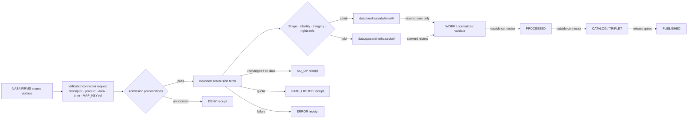

<!-- [KFM_META_BLOCK_V2]
doc_id: kfm://doc/connectors-nasa-firms-readme
title: connectors/nasa-firms/ — NASA FIRMS Connector Boundary
type: readme
version: v0.2
status: draft
owners: OWNER_TBD — Connector steward · Source steward for NASA · Hazards steward · Security reviewer · Rights reviewer · Validation steward · Docs steward
created: 2026-06-19
updated: 2026-07-13
policy_label: public-doctrine; connector-boundary; nasa-firms; candidate-detections; no-alert-authority; server-side-map-key; raw-quarantine-receipts-only; beyond-directory-rules-7-3; open-dsc-14; no-publication
proposed_path: connectors/nasa-firms/README.md
truth_posture: CONFIRMED path and adjacent README surfaces / PROPOSED NASA family promotion and connector realization / IMPLEMENTATION DEPTH NEEDS VERIFICATION
related:
  - ../README.md
  - ../nasa/README.md
  - ../nasa-earthdata/README.md
  - ../../docs/sources/catalog/nasa/README.md
  - ../../docs/sources/catalog/nasa/nasa-firms.md
  - ../../docs/sources/catalog/OPEN-QUESTIONS.md
  - ../../docs/sources/ADMISSION_PROCESS.md
  - ../../docs/sources/SOURCE_DESCRIPTOR_STANDARD.md
  - ../../docs/doctrine/directory-rules.md
  - ../../docs/doctrine/lifecycle-law.md
  - ../../docs/doctrine/trust-membrane.md
  - ../../data/registry/sources/
  - ../../data/raw/hazards/firms/README.md
  - ../../data/quarantine/hazards/
  - ../../data/receipts/
  - ../../fixtures/
  - ../../schemas/contracts/v1/source/
  - ../../policy/sources/
  - ../../policy/rights/
  - ../../policy/sensitivity/
  - ../../tools/ingest/firms_hms_watch/README.md
  - ../../release/
tags: [kfm, connectors, nasa, nasa-firms, firms, candidate-detection, remote-sensing, hazards, map-key, raw, quarantine, receipts, governance]
notes:
  - "v0.2 preserves the v0.1 candidate-detection boundary and expands it to the current connectors/ child-README contract."
  - "Directory Rules place source-specific fetch and admission under connectors/, but NASA family promotion remains DEFERRED under OPEN-DSC-14."
  - "The confirmed RAW lane is data/raw/hazards/firms/; actual connector code, SourceDescriptor records, fixtures, tests, workflows, and source activation remain NEEDS VERIFICATION."
  - "Official NASA FIRMS pages were rechecked on 2026-07-13 for current access, source-class, MAP_KEY, quota, and tactical-use caveats; operational values must still be revalidated before pinning."
[/KFM_META_BLOCK_V2] -->

<a id="top"></a>

# NASA FIRMS Connector Boundary

> Source-admission boundary for NASA FIRMS active-fire and thermal-hotspot records. KFM admits these records as **candidate remote-sensing detections**, never as confirmed fires, emergency alerts, warnings, incidents, or tactical local-condition authority.

<p>
  
  
  
  
  
  
</p>

> [!IMPORTANT]
> **Status:** `draft` connector-boundary README · **Owner:** `OWNER_TBD`  
> **Path:** `connectors/nasa-firms/README.md`  
> **Owning root:** `connectors/` — source-specific fetch and admission  
> **Placement posture:** path exists; NASA family promotion is `PROPOSED` / `DEFERRED` under `OPEN-DSC-14`  
> **Implementation posture:** connector code, activation, tests, fixtures, workflows, emitted receipts, and runtime behavior remain `NEEDS VERIFICATION`  
> **Boundary:** descriptor-gated, server-side source admission only; no event confirmation, alerting, downstream transformation, or publication.

**Quick jumps:** [Scope](#scope) · [Current status](#current-status) · [Repo fit](#repo-fit) · [Source-role discipline](#source-role-discipline) · [Accepted inputs](#accepted-inputs) · [Credential and network posture](#credential-and-network-posture) · [Allowed responsibilities](#allowed-responsibilities) · [Outputs](#outputs-and-handoff-contract) · [Forbidden responsibilities](#forbidden-responsibilities) · [Lifecycle](#lifecycle-boundary) · [Validation](#validation) · [Evidence](#evidence-basis) · [Rollback](#rollback) · [Definition of done](#definition-of-done) · [Backlog](#verification-backlog)

---

## Scope

`connectors/nasa-firms/` is the KFM connector lane for **source-specific FIRMS request preparation, retrieval, response preservation, minimal source-shape checks, and governed admission handoff**.

FIRMS records describe satellite-observed active-fire or thermal-hotspot detections. The connector must preserve that source-native meaning and must not upgrade a pixel, row, footprint, or response into a confirmed fire event. Event clustering, persistence logic, Fire Radiative Power interpretation, cross-source corroboration, EvidenceBundle closure, public-safe layer generation, and release decisions are downstream responsibilities.

This README defines the connector boundary. It does not activate FIRMS, prove endpoint health, establish a SourceDescriptor, authorize data use, or prove that an executable connector exists.

[Back to top](#top)

---

## Current status

| Surface | Status | What is confirmed | What remains unverified |
|---|---:|---|---|
| `connectors/nasa-firms/README.md` | **CONFIRMED** | The target path and this boundary document exist. | Executable code, package metadata, tests, fixtures, and CI wiring. |
| `connectors/README.md` | **CONFIRMED** | Connectors own source-specific fetch, probe, and admission; normal outputs are RAW, QUARANTINE, and receipts. | Per-lane implementation completeness. |
| `connectors/nasa/README.md` | **CONFIRMED draft** | NASA product lanes must remain separate and cannot publish. | NASA family promotion under Directory Rules §7.3. |
| `docs/sources/catalog/nasa/nasa-firms.md` | **CONFIRMED draft** | FIRMS is documented as candidate-detection material with anti-alert and supersession rules. | Current endpoint, terms, and machine implementation. |
| `data/raw/hazards/firms/README.md` | **CONFIRMED** | A governed FIRMS RAW source-capture lane exists and preserves detection-not-event semantics. | Presence of actual payloads and complete run sidecars. |
| `tools/ingest/firms_hms_watch/README.md` | **CONFIRMED draft** | A separate proposed watcher boundary exists for review signals. | Watcher executable, cadence, and thresholds. |
| Product-specific `SourceDescriptor` and activation decision | **NEEDS VERIFICATION** | Registry authority is `data/registry/sources/`. | Exact record, review state, rights state, and activation state. |
| `OPEN-DSC-14` | **CONFIRMED DEFERRED** | NASA family promotion requires an ADR and companion registry evidence. | Resolving ADR and final placement decision. |

[Back to top](#top)

---

## Repo fit

Directory Rules assign `connectors/` the responsibility for source-specific fetch and admission. The target file belongs under that implementation root because it governs a source connector, not source doctrine, data lifecycle truth, policy, schemas, or release authority.

| Surface | Responsibility | Connector relationship |
|---|---|---|
| [`../README.md`](../README.md) | Connector-root contract. | Governs this child README and its output boundary. |
| [`../nasa/README.md`](../nasa/README.md) | Proposed NASA connector-family boundary. | Coordinates product lanes without collapsing them. |
| [`../../docs/sources/catalog/nasa/nasa-firms.md`](../../docs/sources/catalog/nasa/nasa-firms.md) | FIRMS product/source doctrine. | Explains the product; does not own executable admission. |
| `data/registry/sources/` | SourceDescriptor and activation authority. | Connector consumes a reviewed reference; it does not create authority. |
| [`../../data/raw/hazards/firms/README.md`](../../data/raw/hazards/firms/README.md) | Immutable FIRMS RAW source-capture lane. | Allowed admitted-data destination. |
| `data/quarantine/hazards/` | Held or rejected Hazards source material. | Allowed fail-closed destination with reason. |
| `data/receipts/` | Run, probe, denial, no-op, rate-limit, and failure evidence. | Allowed connector evidence destination. |
| [`../../tools/ingest/firms_hms_watch/README.md`](../../tools/ingest/firms_hms_watch/README.md) | Proposed source-change watcher tooling. | Separate from connector fetch/admission; watchers do not publish. |
| `pipelines/`, `data/work/`, `data/processed/` | Transformation and normalized lifecycle work. | Downstream; not owned by this connector. |
| `data/catalog/`, `data/triplets/`, `data/proofs/`, `release/`, `data/published/` | Catalog closure, graph projection, evidence/proof, release, and publication. | Forbidden direct-write surfaces for this connector. |

> [!NOTE]
> The path is an existing connector implementation lane, but the **NASA family is not thereby promoted to canonical Directory Rules §7.3 status**. Folder existence and README completeness do not resolve `OPEN-DSC-14`.

[Back to top](#top)

---

## Source-role discipline

The connector must preserve FIRMS records as source-bound detections and keep product and processing classes distinct.

| Material | Connector interpretation | Forbidden upgrade |
|---|---|---|
| MODIS, VIIRS, or supported Landsat active-fire/hotspot row | Candidate satellite detection tied to a named source/product class. | Confirmed fire, incident, perimeter, warning, or evacuation condition. |
| Near-real-time, real-time, or ultra-real-time response | Freshness-sensitive candidate source material. | Stable historical truth or automatically preferred release record. |
| Standard Processing response | Distinct processing class that may supersede or refine earlier material. | Silent overwrite of earlier records or lost correction lineage. |
| Empty or missing-data response | Source-state observation that may support a no-op, hold, or error receipt. | Proof that no fire exists. |
| Downstream spatial-temporal cluster | **Outside connector ownership.** | Connector-emitted confirmed event ID. |
| Official warning, advisory, or incident record | Separate source role and source family. | FIRMS acting as alert authority. |

Required anti-collapse rules:

1. Preserve the source-native product identifier and processing class; do not flatten all FIRMS sources into `firms` alone.
2. Preserve acquisition/observation time separately from retrieval, admission, release, and correction times.
3. Preserve NRT/RT/URT versus Standard Processing distinctions and any supersession relationship supplied or derived downstream.
4. Preserve sensor/platform identity and source-specific confidence or quality fields without inventing cross-sensor equivalence.
5. Keep FIRMS separate from NOAA HMS, NWS warnings, incident-management records, ground observations, smoke concentrations, and exposure determinations.
6. Treat an empty query result as **no returned detection for that bounded request**, not as evidence that no fire existed.

> [!CAUTION]
> NASA states that FIRMS data are not advised for tactical decision-making or informing local-scale conditions because of spatial resolution and other characteristics. KFM must preserve an equivalent limitation in any downstream public use.

[Back to top](#top)

---

## Accepted inputs

A connector invocation should accept only an explicit, governed request context. The exact machine contract remains `PROPOSED` until schemas and tests are verified.

| Input | Required posture |
|---|---|
| `source_descriptor_ref` | Required; must resolve to a reviewed product-specific SourceDescriptor and activation state. |
| FIRMS source/product identifier | Required and explicit; preserve the exact requested product and processing class. |
| Area or spatial window | Bounded and normalized; validate bounding-box order and coordinate range before network access. |
| Date or retrieval window | Bounded; preserve requested and effective windows. |
| Day range | Validate against the current official service contract before use. |
| Server-side `MAP_KEY` reference | Required for FIRMS web services where applicable; pass by secret/config reference, not committed value. |
| Run context | Stable run ID, caller, purpose, requested destination, retry budget, and receipt destination. |
| Rights and sensitivity references | Required or fail closed; the connector does not decide policy. |
| Expected source shape | Versioned parser/schema reference or an explicit `NEEDS VERIFICATION` hold posture. |
| Network policy | Explicit live-network authorization; default tests remain offline. |

Current official FIRMS Area API documentation exposes an explicit source identifier, area or `world`, a bounded day range, optional date, and `MAP_KEY`. Those details are version-sensitive and must be rechecked before code or configuration pins them.

[Back to top](#top)

---

## Credential and network posture

FIRMS web services currently require a free `MAP_KEY`. KFM must treat it as protected operational configuration even though NASA issues it by email.

- Inject `MAP_KEY` through an approved server-side secret or environment mechanism.
- Never commit a real key to code, Markdown, fixtures, snapshots, examples, logs, receipts, issue text, browser bundles, URLs shown to users, or public error messages.
- Because FIRMS request URLs can embed the key as a path segment, request logging must redact that segment before persistence or display.
- Public clients must use governed KFM interfaces and released artifacts; they must not call FIRMS directly with a KFM key.
- Default tests must use no-network fixtures. Live probes must be explicit, bounded, quota-aware, and non-publishing.
- Respect the current service quota and expose it through configuration rather than hard-coded assumptions. NASA currently documents `5000` transactions per `10`-minute interval and notes that larger requests can count as multiple transactions; reverify before operational use.
- Use bounded retry with jitter where authorized. Never use unbounded retries, retry storms, or silent fallback to a different product class.
- On rate limit, authentication failure, unavailable service, partial response, or source-shape drift, emit a fail-closed receipt and do not create a downstream success state.

[Back to top](#top)

---

## Allowed responsibilities

This folder may support helpers for:

- building a bounded FIRMS request from a validated connector request;
- retrieving approved FIRMS source responses through server-side access;
- preserving source URL templates with credentials redacted;
- preserving source/product identifier, area, requested date/window, effective date/window, and processing class;
- parsing CSV or other explicitly supported source formats without semantic truth upgrade;
- retaining source-native columns, confidence/quality values, acquisition time, geometry, and sensor/platform identity;
- computing raw-response and normalized-record checksums where the governing contract requires them;
- capturing retrieval time, response metadata, row counts, source availability notes, and source fingerprints;
- comparing digests or supported validators to identify deterministic no-op outcomes;
- preparing supersession metadata without deleting or overwriting earlier source captures;
- checking SourceDescriptor, activation, rights, sensitivity, product identity, and destination preconditions;
- writing immutable admitted material to the governed FIRMS RAW lane;
- writing unresolved material to a governed Hazards quarantine lane with a reason;
- emitting connector receipts for success, quarantine, denial, no-op, skipped, rate-limited, and error outcomes;
- returning deterministic, redacted failures when credentials, source identity, source shape, policy references, or provenance are unresolved.

[Back to top](#top)

---

## Outputs and handoff contract

Connector outputs are limited to governed RAW, QUARANTINE, and receipt surfaces. The caller or orchestration layer must supply the allowed destination; the connector must not derive an arbitrary filesystem path from untrusted source fields.

| Output | Allowed destination | Minimum content | Authority limit |
|---|---|---|---|
| Admitted source capture | `data/raw/hazards/firms/<product_or_sensor>/<run_id>/` | Raw response or immutable reference, redacted request metadata, source/product identity, times, checksums, and receipt reference. | Source capture only; not processed or public truth. |
| Held source capture | Governed path under `data/quarantine/hazards/` | Preserved material when safe, reason code, unresolved fields, attempted source identity, and receipt reference. | Review hold; not a silent drop or publication. |
| Connector receipt | Governed path under `data/receipts/` | Outcome, run ID, descriptor reference, redacted request fingerprint, timing, counts, digests, destination refs, retry/rate-limit state, and error summary. | Evidence of connector behavior; not proof or release approval. |
| No-op receipt | Governed path under `data/receipts/` | Reason such as unchanged digest, explicit no-data response, skipped request, or supported cache result. | No work created; not evidence of no fire. |

A future machine envelope should include, at minimum:

```text
run_id
source_descriptor_ref
source_product_id
processing_class
request_fingerprint
requested_spatial_window
requested_temporal_window
retrieval_time
source_observation_time_range
http_status_or_source_status
row_count
raw_digest
source_head_or_validator
outcome
raw_ref_or_quarantine_ref
receipt_ref
supersedes_refs
redacted_error
```

These field names are **PROPOSED**, not a parallel schema. The canonical shape belongs under the accepted schema home and must be referenced here after verification.

### Connector outcome vocabulary

The following labels are documentation-level proposals until a contract or schema ratifies them:

| Outcome | Meaning |
|---|---|
| `ADMIT_RAW` | Request succeeded, minimum admission gates passed, and immutable source material plus receipt were written to RAW. |
| `QUARANTINE` | Material was preserved under a hold because identity, shape, rights, sensitivity, freshness, or integrity was unresolved. |
| `DENY` | Request was not performed or output was not admitted because a required policy, descriptor, credential, or authority precondition failed. |
| `NO_OP` | No new source material was admitted, with an explicit reason recorded. |
| `RATE_LIMITED` | Service quota blocked the request; retry eligibility and next action were recorded without unsafe fallback. |
| `ERROR` | Operational failure occurred; no success state or downstream promotion was emitted. |

These are connector-run outcomes, not public `ANSWER / ABSTAIN / DENY / ERROR` response authority.

[Back to top](#top)

---

## Forbidden responsibilities

This folder must not:

- call a detection, hotspot, pixel, row, footprint, or cluster a confirmed fire, wildfire, incident, emergency, or warning;
- provide tactical local-condition guidance, evacuation guidance, life-safety recommendations, or emergency alerting;
- silently collapse MODIS, VIIRS, Landsat, platform variants, confidence fields, or processing classes;
- delete or overwrite superseded NRT/RT/URT captures when a later Standard Processing record exists;
- cluster detections, apply persistence windows, set FRP thresholds, create stable event IDs, or perform cross-source confirmation as connector authority;
- treat empty responses as proof of absence;
- expose `MAP_KEY` or protected request URLs to public clients, logs, fixtures, examples, or generated documentation;
- create or modify authoritative SourceDescriptor records, schemas, contracts, rights policy, sensitivity policy, or release policy;
- decide rights, sensitivity, source role, release class, public visibility, or catalog authority;
- write directly to `data/work/`, `data/processed/`, `data/catalog/`, `data/triplets/`, `data/proofs/`, `data/published/`, or `release/`;
- emit public maps, PMTiles, APIs, summaries, dashboards, stories, graph edges, vector indexes, alerts, AI answers, or release artifacts;
- treat `connectors/nasa-firms/` or the NASA family as canonical §7.3 infrastructure before `OPEN-DSC-14` is resolved;
- use successful network access or a populated README as evidence of publication readiness.

[Back to top](#top)

---

## Lifecycle boundary



The connector may provide evidence for later lifecycle gates, but it does not execute promotion. Publication remains a governed state transition outside this folder.

[Back to top](#top)

---

## Validation

Before implementation maturity is claimed, tests should prove the following boundaries.

| Validation area | Required check | Failure posture |
|---|---|---|
| Placement | Connector writes only to caller-approved RAW, QUARANTINE, and receipt roots. | `DENY` or `ERROR`; no alternate path. |
| Descriptor gate | Missing, unresolved, inactive, or mismatched SourceDescriptor blocks live fetch or admission. | `DENY` or `QUARANTINE` as policy permits. |
| Credential safety | Real `MAP_KEY` values and key-bearing URLs are absent from committed files, fixtures, logs, receipts, snapshots, and browser bundles. | Fail test and redact output. |
| Product identity | Exact source/product and processing class survive request, parse, RAW sidecars, and receipt. | `QUARANTINE`. |
| Candidate wording | Connector output never labels FIRMS data as confirmed fire, alert, warning, or incident. | Fail closed. |
| Temporal integrity | Observation/acquisition, retrieval, admission, release, and correction times are not collapsed. | `QUARANTINE`. |
| Supersession | Later processing can reference earlier captures without destructive overwrite. | Fail test. |
| Empty result | Empty response produces bounded `NO_OP` or source-state receipt, never a no-fire claim. | Fail test. |
| Rate limit | Quota response produces bounded `RATE_LIMITED` behavior and no retry storm. | Stop and receipt. |
| Source drift | Missing columns, unknown product class, malformed rows, partial download, changed content type, or schema drift cannot produce `ADMIT_RAW` silently. | `QUARANTINE` or `ERROR`. |
| Offline default | Unit and contract tests use deterministic no-network fixtures. | Fail CI. |
| Output boundary | No connector path writes work, processed, catalog, triplet, proof, release, published, API, UI, or map artifacts. | Fail CI. |
| Receipt coverage | Success, quarantine, denial, no-op, skipped, rate-limited, and error cases leave inspectable receipts where applicable. | Incomplete implementation. |

Minimum fixture set:

- valid MODIS or VIIRS candidate-detection response with synthetic/public-safe coordinates;
- distinct NRT and Standard Processing records for the same bounded scenario;
- empty response;
- malformed row and missing required column;
- unknown source/product identifier;
- missing descriptor reference;
- missing or redacted `MAP_KEY` reference;
- simulated rate limit;
- partial or truncated response;
- changed content type or source-shape drift;
- destination-path escape attempt;
- log-redaction check for key-bearing URL;
- output-boundary check proving no downstream writes.

[Back to top](#top)

---

## Evidence basis

| Source | Status | Supports | Limits |
|---|---:|---|---|
| [`../README.md`](../README.md) | **CONFIRMED** | Child connector READMEs require accepted inputs, exclusions, output boundary, evidence, validation, rollback, and definition of done. | Does not prove this lane is implemented. |
| [`../../docs/doctrine/directory-rules.md`](../../docs/doctrine/directory-rules.md) | **CONFIRMED doctrine** | `connectors/` owns source-specific fetch/admission; connector output goes to RAW or QUARANTINE with descriptors, checksums, and ingest receipts; no publication or direct processed/catalog/published writes. | NASA is not enumerated as a canonical §7.3 family. |
| [`../../docs/sources/catalog/OPEN-QUESTIONS.md`](../../docs/sources/catalog/OPEN-QUESTIONS.md) | **CONFIRMED register** | `OPEN-DSC-14` is DEFERRED and requires an ADR plus connector and registry evidence. | Does not resolve placement. |
| [`../../docs/sources/catalog/nasa/nasa-firms.md`](../../docs/sources/catalog/nasa/nasa-firms.md) | **CONFIRMED draft** | Candidate-detection framing, anti-alert posture, product/cadence separation, and downstream supersession concerns. | Current endpoints, terms, thresholds, and implementation remain version-sensitive or proposed. |
| [`../../data/raw/hazards/firms/README.md`](../../data/raw/hazards/firms/README.md) | **CONFIRMED** | FIRMS RAW lane, source-role preservation, no-public-path posture, and product/sensor sub-lane pattern. | Actual payloads and connector wiring remain unknown. |
| [`../../tools/ingest/firms_hms_watch/README.md`](../../tools/ingest/firms_hms_watch/README.md) | **CONFIRMED draft** | Watcher review signals are separate from connector admission and cannot confirm events or publish. | Watcher code is proposed. |
| [NASA Earthdata FIRMS](https://www.earthdata.nasa.gov/data/tools/firms) | **CONFIRMED external check — 2026-07-13** | Active-fire/hotspot purpose, MODIS/VIIRS product context, open-use guidance, citation expectation, and tactical local-use caveat. | External content can change; recheck before operational decisions. |
| [NASA FIRMS API](https://firms.modaps.eosdis.nasa.gov/api/) and [Area API](https://firms.modaps.eosdis.nasa.gov/api/area/) | **CONFIRMED external check — 2026-07-13** | Area/date/sensor request surface, current source classes, data-availability service, and key-bearing request pattern. | API version and source list are version-sensitive. |
| [NASA FIRMS MAP_KEY](https://firms.modaps.eosdis.nasa.gov/api/map_key/) | **CONFIRMED external check — 2026-07-13** | MAP_KEY requirement and currently documented transaction quota. | Quota and access rules may change. |
| Actual connector implementation, tests, fixtures, CI, SourceDescriptor, activation, and emitted receipts | **NEEDS VERIFICATION** | Required before implementation claims. | README text is not executable proof. |

[Back to top](#top)

---

## Rollback

Rollback is required if this README is used to justify any of the following without stronger evidence:

- NASA-family canonicality under Directory Rules §7.3;
- source activation without a reviewed SourceDescriptor and policy state;
- public or browser-side use of a KFM `MAP_KEY`;
- direct publication or downstream lifecycle writes from the connector;
- confirmed-fire, emergency-alert, tactical-local-condition, smoke-concentration, or exposure claims from FIRMS alone;
- implementation maturity without tests, fixtures, receipts, and current endpoint verification.

Rollback target:

```text
Restore connectors/nasa-firms/README.md v0.1
blob SHA: 8ff1c80737353d04332d1bb0f79c09dfcc0d35f8
```

This is a documentation-only change. Rollback does not alter admitted data, registry decisions, policies, schemas, source credentials, releases, or public artifacts.

[Back to top](#top)

---

## Definition of done

- [ ] `OWNER_TBD` is replaced with accountable connector, NASA source, Hazards, security, rights, validation, and docs owners.
- [ ] `OPEN-DSC-14` is resolved by an accepted ADR or an explicit migration decision, and this README reflects the result.
- [ ] Product-specific SourceDescriptor records and activation state are verified and linked without duplicating authority fields.
- [ ] Current FIRMS endpoints, source identifiers, access rules, quota behavior, missing-data behavior, and source schema are revalidated and pinned through governed configuration where necessary.
- [ ] Executable connector files and package boundaries are inventoried in this README or a child implementation README.
- [ ] `MAP_KEY` injection, URL/log redaction, rotation, and public-client isolation are tested.
- [ ] Offline fixtures cover valid, empty, malformed, missing-field, unknown-product, rate-limit, partial-response, and source-drift cases.
- [ ] Product, sensor/platform, processing class, acquisition time, retrieval time, and checksums survive RAW handoff.
- [ ] RAW, QUARANTINE, and receipt envelope schemas validate.
- [ ] Output-boundary tests prove no work, processed, catalog, triplet, proof, release, published, API, UI, map, or AI writes occur from the connector.
- [ ] Receipt tests cover success, quarantine, denial, no-op, skipped, rate-limited, and error cases where applicable.
- [ ] NRT/RT/URT and Standard Processing supersession behavior is documented and tested without destructive overwrite.
- [ ] CI runs the relevant offline checks, and current results are cited before implementation maturity is upgraded.
- [ ] Downstream public copy retains the detection-not-confirmed-fire and not-for-tactical-local-use caveats.

[Back to top](#top)

---

## Verification backlog

| Item | Status | Evidence needed |
|---|---:|---|
| Resolve NASA family placement and `OPEN-DSC-14`. | **NEEDS VERIFICATION** | Accepted ADR or migration record. |
| Inventory actual files under `connectors/nasa-firms/`. | **NEEDS VERIFICATION** | Recursive tree or mounted checkout. |
| Locate and validate FIRMS SourceDescriptor records. | **NEEDS VERIFICATION** | Registry path, schema result, review state, and activation decision. |
| Confirm current FIRMS API surfaces and supported source classes. | **NEEDS VERIFICATION before pinning** | Official documentation check plus steward-approved configuration. |
| Confirm key storage, redaction, and rotation. | **NEEDS VERIFICATION** | Security config, tests, and operational runbook. |
| Confirm raw/quarantine/receipt envelope shape. | **NEEDS VERIFICATION** | Contracts, schemas, fixtures, and validators. |
| Confirm no-network fixture home and parser coverage. | **NEEDS VERIFICATION** | Fixture inventory and passing test logs. |
| Confirm destination-path confinement. | **NEEDS VERIFICATION** | Negative tests for path escape and arbitrary destination input. |
| Confirm supersession representation across processing classes. | **NEEDS VERIFICATION** | Contract fields, fixture pairs, receipts, and downstream tests. |
| Confirm emitted receipts for all finite connector outcomes. | **NEEDS VERIFICATION** | Sample receipts and schema validation. |
| Confirm CI and workflow-trigger safety. | **NEEDS VERIFICATION** | Workflow files, path filters, permissions, and passing run evidence. |
| Confirm downstream warning/alert authority separation. | **NEEDS VERIFICATION** | Hazards source-role tests, UI/copy tests, and governed API fixtures. |

[Back to top](#top)

---

## Related surfaces

- [`../README.md`](../README.md) — connector-root authority and required child README contract.
- [`../nasa/README.md`](../nasa/README.md) — proposed NASA connector-family boundary.
- [`../nasa-earthdata/README.md`](../nasa-earthdata/README.md) — related NASA access-surface boundary.
- [`../../docs/sources/catalog/nasa/README.md`](../../docs/sources/catalog/nasa/README.md) — proposed NASA source-family catalog.
- [`../../docs/sources/catalog/nasa/nasa-firms.md`](../../docs/sources/catalog/nasa/nasa-firms.md) — FIRMS product/source documentation.
- [`../../docs/sources/catalog/OPEN-QUESTIONS.md`](../../docs/sources/catalog/OPEN-QUESTIONS.md) — canonical `OPEN-DSC-*` register.
- [`../../docs/doctrine/directory-rules.md`](../../docs/doctrine/directory-rules.md) — placement and connector-output doctrine.
- [`../../data/raw/hazards/firms/README.md`](../../data/raw/hazards/firms/README.md) — immutable FIRMS RAW lane.
- [`../../tools/ingest/firms_hms_watch/README.md`](../../tools/ingest/firms_hms_watch/README.md) — proposed review-signal watcher boundary.

---

## Maintainer note

Keep this connector deliberately narrow. It may admit source-bound FIRMS detections and leave inspectable run evidence. It must not decide that a fire exists, act as an alert system, transform candidate detections into events, or publish any result.

<p align="right"><a href="#top">Back to top</a></p>
