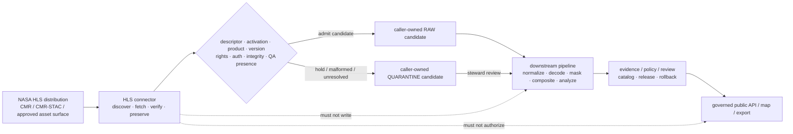

<!-- [KFM_META_BLOCK_V2]
doc_id: kfm://doc/connectors-nasa-hls-readme
title: connectors/nasa-hls/ — NASA HLS README-Only Source-Admission Boundary
type: readme
version: v0.2
status: draft
owners: OWNER_TBD — Connector steward · NASA/HLS source steward · Agriculture steward · Remote-sensing steward · Security reviewer · Rights reviewer · Sensitivity reviewer · Validation steward · Test steward · Docs steward
created: 2026-06-19
updated: 2026-07-13
policy_label: public-doctrine; readme-only; duplicate-path-conflict; nasa-hls; hlsl30; hlss30; hls-vi; harmonized-reflectance; qa-preservation; credentialed-access; context-layer; no-network; no-activation; raw-quarantine-only; no-publication
current_path: connectors/nasa-hls/README.md
truth_posture: CONFIRMED repository-present top-level README-only lane at named conventional probes, blank nested connectors/nasa/hls/README.md compatibility candidate, v0.1 introduction lineage, placeholder agriculture NASA-HLS registry record, documentation-only HLS-VI fixture lane, pipeline docs pointing to the nested path, deferred OPEN-DSC-14 family promotion, conflicted SourceDescriptor schema authority, TODO-only generic connector and descriptor CI, and current official NASA HLS v2.0 product/access documentation / CONFLICTED canonical connector path, flat-versus-nested NASA topology, source-role mapping, SourceDescriptor schema path, activation authority, and final fixture/test routing / PROPOSED future server-side HLS discovery, retrieval, integrity, QA-preservation, and RAW-or-QUARANTINE candidate adapter / UNKNOWN recursive implementation inventory, package buildability, imports, runtime, credential provider, endpoint allowlist, rights enforcement, executable fixtures/tests, mask pipeline, substantive CI, deployment, release state, and owners
evidence_snapshot:
  repository: bartytime4life/Kansas-Frontier-Matrix
  repository_id: "1059091169"
  visibility: public
  base_ref: main
  base_commit: 5f06485d910ee1b4855aff3274623f801a798d11
  prior_blob: e539aa2ab0cf1b244474825c76a3d5b116b2e227
  introduction_commit: 2172d142f1efd6eefa530c4928ab8d8cf301a749
  nested_blank_blob: 8b137891791fe96927ad78e64b0aad7bded08bdc
related:
  - ../README.md
  - ../nasa/README.md
  - ../nasa-earthdata/README.md
  - ../nasa-firms/README.md
  - ../nasa-smap/README.md
  - ../nasa/hls/README.md
  - ../../CONTRIBUTING.md
  - ../../.github/CODEOWNERS
  - ../../.github/PULL_REQUEST_TEMPLATE.md
  - ../../.github/workflows/connector-gate.yml
  - ../../.github/workflows/source-descriptor-validate.yml
  - ../../docs/doctrine/directory-rules.md
  - ../../docs/adr/README.md
  - ../../docs/registers/DRIFT_REGISTER.md
  - ../../docs/sources/catalog/OPEN-QUESTIONS.md
  - ../../docs/sources/catalog/nasa/README.md
  - ../../docs/sources/catalog/nasa/nasa-hls.md
  - ../../docs/sources/catalog/nasa/nasa-earthdata.md
  - ../../docs/sources/SOURCE_DESCRIPTOR_STANDARD.md
  - ../../docs/domains/agriculture/SOURCE_REGISTRY.md
  - ../../docs/domains/agriculture/SOURCES.md
  - ../../docs/domains/agriculture/SENSITIVITY.md
  - ../../pipelines/domains/agriculture/README.md
  - ../../pipeline_specs/agriculture/README.md
  - ../../fixtures/domains/agriculture/hls_vi/README.md
  - ../../data/registry/sources/agriculture/nasa_hls.yaml
  - ../../contracts/source/source_descriptor.md
  - ../../schemas/contracts/v1/source/source_descriptor.schema.json
  - ../../schemas/contracts/v1/sources/source_descriptor.schema.json
  - ../../control_plane/source_authority_register.yaml
  - ../../policy/source/README.md
  - ../../policy/rights/README.md
  - ../../policy/sensitivity/README.md
  - https://hls.gsfc.nasa.gov/
  - https://hls.gsfc.nasa.gov/data-products/
  - https://hls.gsfc.nasa.gov/data-access-and-tools/
  - https://www.earthdata.nasa.gov/data/catalog/lpcloud-hlsl30-2.0
  - https://www.earthdata.nasa.gov/data/catalog/lpcloud-hlss30-2.0
tags: [kfm, connectors, nasa, hls, hlsl30, hlss30, hls-vi, landsat, sentinel-2, sentinel-2c, cogs, mgrs, fmask, agriculture, remote-sensing, context-layer, source-admission, rights, freshness, raw, quarantine, governance]
notes:
  - "The top-level target is README-only at the directly inspected conventional package, source-layout, module, descriptor, and test paths."
  - "A second empty README exists at connectors/nasa/hls/README.md, while Agriculture pipeline documentation points to that nested path. This revision does not choose, mirror, move, or deprecate either path."
  - "The current data/registry/sources/agriculture/nasa_hls.yaml file is a three-field PROPOSED placeholder, not a conforming SourceDescriptor or activation record."
  - "The HLS-VI fixture lane contains a detailed README but no fixture payload, consumer, schema, validator, or executed test was established by the inspected evidence."
  - "Current official NASA material identifies HLS v2.0 L30, S30, and HLS-VI as 30 m COG products; includes Sentinel-2C in S30; reports approximately 1.4-day global-average median revisit, typical 2–3 day latency, and HLS-LL as future work targeted for early 2027. These facts remain version-sensitive."
  - "Main advanced from a715ea0cdbc39c613cc4f2543c73d5eaf9d40e74 to 5f06485d910ee1b4855aff3274623f801a798d11 during preparation. The compare touched only connectors/manual_curation/src/README.md; the HLS target retained prior blob e539aa2ab0cf1b244474825c76a3d5b116b2e227."
  - "Only this Markdown file is changed. No path, code, package metadata, credential, endpoint config, descriptor, registry entry, schema, contract, policy, fixture, test, workflow, lifecycle artifact, evidence object, release object, or public artifact is created or modified."
[/KFM_META_BLOCK_V2] -->

<a id="top"></a>

# NASA HLS README-Only Source-Admission Boundary

> [!IMPORTANT]
> **Document lifecycle:** `draft v0.2`  
> **Component maturity:** README-only at the directly inspected top-level implementation probes; no supported HLS client, downloader, parser, QA decoder, admission decision, test lane, or lifecycle handoff is verified here  
> **Path posture:** `connectors/nasa-hls/` contains this README; `connectors/nasa/hls/README.md` also exists as a blank file, so final flat-versus-nested ownership is `CONFLICTED / NEEDS VERIFICATION`  
> **Authority:** implementation-boundary documentation inside `connectors/`; no source, credential, schema, policy, registry, evidence, lifecycle, analysis, release, routing, or publication authority

> [!CAUTION]
> HLS surface reflectance and vegetation indices are remotely sensed, harmonized or derived products—not field measurements, crop confirmations, parcel truth, damage determinations, regulatory findings, or emergency alerts. Public or high-impact claims require downstream QA, evidence, policy, aggregation, review, release, correction, and rollback support.

**Quick links:** [Purpose](#purpose) · [Authority](#authority-level) · [Status](#status) · [What belongs](#what-belongs-here) · [What does not](#what-does-not-belong-here) · [Inputs](#inputs) · [Outputs](#outputs) · [Validation](#validation) · [Review](#review-burden) · [Related](#related-folders) · [ADRs](#adrs) · [Last reviewed](#last-reviewed) · [Path conflict](#path-and-migration-conflict) · [Product boundary](#hls-product-boundary) · [Current product snapshot](#current-official-product-snapshot) · [Access](#access-and-credential-boundary) · [Identity](#product-collection-granule-and-asset-identity) · [QA](#qa-mask-and-analysis-boundary) · [Roles](#source-role-and-anti-collapse-rules) · [Time](#time-freshness-and-source-head) · [Lifecycle](#lifecycle-boundary) · [Failure contract](#failure-contract) · [Evidence](#evidence-basis) · [Rollback](#rollback) · [Backlog](#verification-backlog) · [Done](#definition-of-done)

---

## Purpose

`connectors/nasa-hls/` currently provides a documentation boundary for a future NASA Harmonized Landsat and Sentinel-2 source adapter.

Its present responsibility is to:

- prevent the top-level folder from being mistaken for an implemented, activated, or canonical connector;
- expose the unresolved duplication with the blank nested `connectors/nasa/hls/` lane;
- preserve HLS L30, HLS S30, HLS-VI, HLS-LL, OPERA-HLS, source-platform, provider, collection, granule, tile, acquisition, version, band, and asset distinctions;
- define server-side discovery and Earthdata credential boundaries without selecting unverified environment-variable names or secret providers;
- preserve source-native CMR, CMR-STAC, COG, MGRS, Fmask, metadata, checksum, citation, and source-head evidence;
- constrain future connector output to caller-owned results, secret-free receipt candidates, or governed RAW/QUARANTINE candidates;
- keep QA preservation separate from downstream masking, compositing, vegetation-change, burn-severity, field inference, cataloging, release, and publication;
- record the evidence and governance gaps that must close before implementation or activation.

This README does not prove that a connector exists, that either observed path is canonical, that the placeholder registry file activates HLS, that HLS-derived claims are valid, or that any HLS asset is approved for public release.

[Back to top](#top)

---

## Authority level

| Concern | Status | Evidence-bounded determination |
|---|---:|---|
| Owning responsibility root | **CONFIRMED** | `connectors/` owns source-specific discovery, fetch, preservation, packaging, integrity checking, and admission mechanics. |
| Top-level path | **CONFIRMED** | `connectors/nasa-hls/README.md` exists and is the requested target. |
| Nested NASA path | **CONFIRMED EMPTY README** | `connectors/nasa/hls/README.md` exists with a zero-content blob; it does not establish an implementation. |
| Canonical connector topology | **CONFLICTED** | Parent/source docs use flat `connectors/nasa-hls/`; Agriculture pipeline docs point to nested `connectors/nasa/hls/`. No accepted migration decision was verified. |
| Current implementation | **NOT ESTABLISHED** | Path-scoped search returned this README; named conventional package, source-layout, module, descriptor, and test probes were absent. Differently named files remain `UNKNOWN`. |
| HLS registry record | **PLACEHOLDER ONLY** | `data/registry/sources/agriculture/nasa_hls.yaml` contains `status`, `path`, `source_docs`, and a placeholder note—not a conforming SourceDescriptor or activation decision. |
| Machine source authority | **NOT ESTABLISHED** | The inspected source-authority register has `entries: []`. |
| SourceDescriptor authority | **CONFLICTED** | The populated singular schema declares a plural canonical path, while the plural path is an empty permissive scaffold. |
| Rights/sensitivity enforcement | **GREENFIELD STUBS / UNKNOWN** | The inspected source, rights, and sensitivity policy READMEs do not establish HLS-specific executable policy. |
| Connector CI | **TODO-ONLY** | The inspected generic connector and descriptor workflows execute `echo TODO ...`; green completion is not substantive HLS proof. |
| Public output | **NONE AUTHORIZED** | This README creates no dataset, source activation, map layer, API response, alert, release, or publication artifact. |

Editing this README does not decide path ownership, source-role vocabulary, product hierarchy, descriptor granularity, source activation, rights, sensitivity, mask policy, evidence sufficiency, or release posture.

[Back to top](#top)

---

## Status

### Bounded repository snapshot

Directly verified at base commit `5f06485d910ee1b4855aff3274623f801a798d11`:

```text
connectors/nasa-hls/
└── README.md

connectors/nasa/hls/
└── README.md       # empty
```

Exact top-level conventional probes returned `Not Found` for:

```text
connectors/nasa-hls/pyproject.toml
connectors/nasa-hls/src/README.md
connectors/nasa-hls/src/nasa_hls/README.md
connectors/nasa-hls/src/nasa_hls/__init__.py
connectors/nasa-hls/fetch.py
connectors/nasa-hls/admit.py
connectors/nasa-hls/descriptor.yaml
connectors/nasa-hls/tests/README.md
```

These are bounded named-path statements, not a recursive tree receipt. Differently named, unindexed, generated, Git-LFS, submodule, or external implementation remains `UNKNOWN`.

| Surface | Confirmed state | Safe conclusion |
|---|---|---|
| This README | Existing v0.1 boundary before revision | Documentation existed; runtime did not follow from it. |
| Introduction lineage | Commit `2172d142…` expanded a blank placeholder into v0.1 | The blank file is historical lineage—not the rollback target for v0.2. |
| Nested HLS README | Present and empty | Duplicate path exists; no redirect, mirror class, or package is established. |
| HLS source-catalog page | Detailed draft product profile | Supports product/QA/claim boundaries; does not activate source access or prove code. |
| Agriculture HLS registry YAML | Three-field placeholder | Source identity, role, rights, access, activation, and release state are not machine-established. |
| HLS-VI fixture lane | README only in inspected evidence | Fixture intent exists; payloads, consumer, schema, validator, and test result do not follow. |
| Agriculture pipeline/spec docs | Detailed draft lane contracts; reference nested connector path | Supports downstream ownership; does not prove executable HLS transformation or active spec. |
| Generic workflows | TODO-only checkout/echo steps | Workflow success cannot establish HLS access, parsing, QA, rights, admission, or lifecycle behavior. |

### Maturity summary

| Capability | Status |
|---|---:|
| README boundary | **CONFIRMED** |
| Canonical path | **CONFLICTED** |
| Buildable package | **NOT ESTABLISHED** |
| CMR/CMR-STAC discovery client | **NOT ESTABLISHED** |
| Earthdata credential integration | **NOT ESTABLISHED** |
| HLS asset retrieval | **NOT ESTABLISHED** |
| COG/metadata integrity validation | **NOT ESTABLISHED** |
| Fmask/QA preservation | **NOT ESTABLISHED** |
| HLS-VI fixture payloads/tests | **NOT ESTABLISHED** |
| Downstream mask/composite/change pipeline | **PROPOSED / UNKNOWN** |
| Substantive CI | **NOT ESTABLISHED** |
| Release/public delivery | **NOT AUTHORIZED** |

[Back to top](#top)

---

## What belongs here

Until topology and ownership are resolved, this lane may contain only documentation and narrowly bounded future source-admission implementation for HLS.

Appropriate future contents, after governance prerequisites pass, include:

- a package manifest and source namespace at the accepted connector path;
- CMR or CMR-STAC collection/granule discovery helpers;
- HLS product allowlist and collection identity mapping;
- Earthdata credential-handle integration that never stores or logs secret values;
- provider-approved HTTPS or S3 asset retrieval helpers;
- redirect, timeout, rate-limit, retry, and circuit-breaker controls;
- HLS native metadata, CMR XML/JSON, COG reference, checksum, and source-head preservation;
- product, collection, granule, MGRS tile, acquisition, platform, sensor, version, band, QA, and asset identity preservation;
- source COG structural/integrity preflight appropriate to admission;
- Fmask/QA asset presence and metadata preservation;
- deterministic, secret-free connector outcomes and receipt candidates;
- RAW or QUARANTINE candidate packaging controlled by the caller/orchestrator;
- a local README, test boundary, and no-network fixture inventory;
- a compatibility shim only if an accepted migration explicitly requires one.

Connector-local files must remain subordinate to accepted SourceDescriptors, activation decisions, rights and sensitivity policy, lifecycle contracts, and caller-controlled persistence.

## What does NOT belong here

This directory must not contain or imply authority over:

- parallel implementation in both flat and nested HLS paths;
- canonical NASA-family placement without accepted architecture/migration evidence;
- credentials, tokens, cookies, signed URLs, private keys, authorization headers, secret-manager values, or protected payloads;
- browser-side access to CMR, Earthdata Login, LP DAAC, S3, or other protected provider surfaces;
- canonical SourceDescriptor records, source-authority entries, activation decisions, contracts, schemas, or policy;
- production-sized source imagery stored beside connector code;
- HLS L30/S30/HLS-VI/HLS-LL or other products collapsed into one unversioned “HLS” identity;
- OPERA-HLS collapsed into HLS L30/S30 without product-specific identity and rights review;
- COG-to-GeoTIFF transformation, reprojection, resampling, mosaicking, tiling, compositing, or index calculation;
- valid-pixel footprint generation, cross-product mask gates, NDVI/NBR/dNBR computation, vegetation-change or burn-severity analysis;
- field, parcel, crop, yield, damage, stress, fire, drought, water, regulatory, or emergency claims;
- direct writes to `data/work/`, `data/processed/`, `data/catalog/`, `data/triplets/`, `data/proofs/`, `data/published/`, or `release/`;
- EvidenceBundle closure, catalog closure, release approval, correction, withdrawal, rollback, public API/UI behavior, or AI answers presented as HLS truth.

Public upstream access does not equal KFM source admission, rights clearance, claim eligibility, evidence closure, or release approval.

[Back to top](#top)

---

## Inputs

### Current

This README consumes repository evidence, KFM doctrine, and current official NASA HLS documentation. It declares no supported runtime command, package import, endpoint, environment variable, credential provider, SourceDescriptor ID, collection allowlist, fixture payload, or activation state.

### Future admissible inputs

After topology, descriptor, activation, security, rights, sensitivity, fixture, and test gates are accepted, an HLS connector may consume:

- a conforming, reviewed SourceDescriptor reference for the access surface and relevant HLS products/collections;
- an explicit activation decision and approved access configuration;
- a query over allowlisted products, concepts, versions, spatial/temporal bounds, platforms, sensors, or MGRS tiles;
- caller-supplied credential handles or signed access context, never raw secrets in command arguments by default;
- CMR, CMR-STAC, Earthdata Search, provider API, HTTPS, S3, or other reviewed transport results;
- source-native collection, granule, provider, version, acquisition, platform, instrument, tile, band, asset, QA, and checksum identifiers;
- source publication and retrieval timestamps;
- media type, content length, ETag, Last-Modified, checksum, source version, revision, and known-issue context;
- rights, attribution, redistribution, access, sensitivity, citation, and review metadata;
- synthetic or explicitly rights-cleared no-network fixtures.

### Input preconditions

Before any network or file operation:

1. resolve the accepted connector path and package ownership;
2. resolve the SourceDescriptor schema and source-role vocabulary;
3. locate a conforming descriptor and activation decision;
4. validate the requested product, version, collection, provider, and access method;
5. resolve rights, terms, attribution, redistribution, sensitivity, and citation posture;
6. obtain credentials through an approved provider without exposing values;
7. establish allowlisted hosts and redirect rules;
8. establish request/run identity, timeouts, byte/object bounds, retry budget, and destination intent;
9. establish expected COG/metadata/QA integrity checks;
10. fail closed when any policy-significant precondition is unresolved.

The connector must not infer activation, rights, or source role from public availability, a filename, a DOI, a CMR concept ID, a documentation page, or a successful authenticated request.

[Back to top](#top)

---

## Outputs

### Current

No runtime output is established.

### Future bounded outputs

A future connector may return or propose:

- normalized collection and granule discovery metadata;
- caller-owned asset references, streams, temporary files, or downloaded bytes;
- source-native metadata and CMR sidecar preservation;
- COG asset inventory with source checksums and content metadata;
- HLS product/version/platform/sensor/tile/acquisition/band/QA identity;
- conditional-request/source-head evidence such as `ETag`, `Last-Modified`, checksum, upstream version, concept ID, or retrieval status when available;
- secret-free fetch/probe receipt candidates;
- RAW candidate envelopes;
- QUARANTINE candidate envelopes with deterministic reasons;
- `NOT_MODIFIED`, `NO_MATCH`, `RATE_LIMITED`, `RETRYABLE_ERROR`, `DENY`, or `ERROR` outcomes under an accepted connector outcome contract.

The connector must return outcomes to the caller or orchestrator. It must not choose a lifecycle path by writing to canonical stores on its own.

### Prohibited output upgrades

```text
source COG                    != field truth
HLS-VI layer                  != crop truth
Fmask value                   != release decision
valid source granule          != valid analytical claim
connector fetch receipt       != EvidenceBundle
downloaded asset              != catalog closure
successful connector run      != source activation
RAW candidate                 != PUBLISHED
```

[Back to top](#top)

---

## Validation

### Documentation validation for this revision

Performed before repository mutation:

- exactly one H1;
- required Directory Rules README sections present and ordered;
- all internal quick-link anchors resolve;
- fenced code blocks are balanced;
- no unresolved rollback placeholder remains;
- no JWT-like, GitHub-token-like, AWS-key-like, or private-key marker appears;
- current target and parallel nested path were read from the repository;
- named conventional top-level implementation paths were probed;
- registry, fixture, pipeline, descriptor, policy, and workflow evidence was inspected;
- current official NASA product/access documentation was checked.

### Future connector-local validation

A real HLS connector needs no-network tests for:

- accepted and rejected collection/product/version identifiers;
- L30, S30, HLS-VI, future HLS-LL, and non-HLS anti-collapse;
- Sentinel-2A/B/C and Landsat 8/9 platform preservation;
- MGRS tile, CRS, resolution, band, asset, and acquisition identity;
- CMR and CMR-STAC pagination, empty pages, duplicate granules, malformed metadata, and partial responses;
- missing/expired/rejected credentials and redacted diagnostics;
- allowed-host and redirect enforcement;
- timeout, rate-limit, retry, jitter, backoff, circuit-breaker, and cancellation behavior;
- conditional requests and `NOT_MODIFIED` handling;
- content-length, byte-budget, checksum, content-type, and partial-download failures;
- COG signature/structure checks appropriate to source admission;
- metadata/COG/QA asset mismatch;
- Fmask asset preservation and bit-packed round trip;
- multiple simultaneously set Fmask bits;
- missing QA, unknown QA version, and malformed bit fields;
- source-head, retrieval time, version, and known-issue preservation;
- rights/terms/attribution/sensitivity unresolved states;
- no direct lifecycle writes;
- no browser/public-client protected access;
- secret-free receipts, logs, errors, snapshots, and fixtures;
- deterministic outcomes and replay-safe identity.

### Root trust-spine validation

Connector-local tests cannot prove:

- accepted SourceDescriptor authority or activation;
- downstream mask/composite/change behavior;
- EvidenceBundle or catalog closure;
- sensitivity or aggregation policy;
- release or public-map readiness.

Those require tests and governed artifacts in their owning roots.

### Current CI limitation

The inspected `connector-gate` and `source-descriptor-validate` workflows contain only TODO echo steps. A green run is not substantive HLS proof.

[Back to top](#top)

---

## Review burden

| Change | Minimum review burden |
|---|---|
| README clarification only | Connector steward + Docs steward |
| Product/collection mapping | NASA/HLS source steward + Remote-sensing steward + Connector steward |
| HLS Agriculture source-role or claim posture | Agriculture steward + Source steward + Evidence/policy reviewer |
| Credential, transport, redirect, or host handling | Security reviewer + Connector steward |
| Rights, attribution, redistribution | Rights reviewer + NASA/HLS source steward |
| QA/Fmask asset requirements | Remote-sensing steward + Validation/Test steward |
| Fixture content | Fixture/Test steward + rights/sensitivity review when realistic metadata is used |
| Path move, alias, deprecation, or duplicate-lane resolution | Architecture/Directory Rules reviewer + migration owner; ADR if required |
| SourceDescriptor/schema/role vocabulary | Contract + Schema + Source-registry + Policy reviewers; accepted ADR where authority changes |
| Lifecycle or public-release behavior | Evidence + Policy + Release stewards; outside this README-only change |

Current CODEOWNERS is a greenfield placeholder and does not establish HLS-specific ownership. `OWNER_TBD` remains honest until accepted routing exists.

[Back to top](#top)

---

## Related folders

| Surface | Relationship | Current posture |
|---|---|---:|
| `connectors/README.md` | Connector-root source-admission contract. | **CONFIRMED** |
| `connectors/nasa/README.md` | NASA family boundary. | **DRAFT / OPEN-DSC-14 DEFERRED** |
| `connectors/nasa-earthdata/README.md` | Shared access-surface and credential boundary. | **README-ONLY v0.2** |
| `connectors/nasa-firms/README.md` | FIRMS source lane; downstream mask/context input only. | **README-ONLY v0.2** |
| `connectors/nasa/hls/README.md` | Empty nested path referenced by Agriculture docs. | **CONFLICTED / EMPTY** |
| `docs/sources/catalog/nasa/nasa-hls.md` | Product/source profile and proposed mask/claim doctrine. | **DRAFT; NOT IMPLEMENTATION** |
| `data/registry/sources/agriculture/nasa_hls.yaml` | Candidate HLS registry filename. | **PLACEHOLDER; NOT CONFORMING** |
| `fixtures/domains/agriculture/hls_vi/` | Candidate HLS-VI fixture lane. | **README-ONLY IN INSPECTED EVIDENCE** |
| `pipelines/domains/agriculture/` | Downstream executable Agriculture transforms. | **DRAFT BOUNDARY; HLS EXECUTION UNKNOWN** |
| `pipeline_specs/agriculture/` | Downstream declarative run profiles. | **DRAFT BOUNDARY; ACTIVE HLS SPEC UNKNOWN** |
| `contracts/source/` | SourceDescriptor semantics. | **DRAFT / PROPOSED** |
| `schemas/contracts/v1/source/` and `/sources/` | SourceDescriptor shape paths. | **CONFLICTED** |
| `control_plane/source_authority_register.yaml` | Machine source-authority register. | **EMPTY ENTRIES** |
| `policy/source/`, `policy/rights/`, `policy/sensitivity/` | Admission/rights/sensitivity authorities. | **GREENFIELD STUBS IN INSPECTED FILES** |
| `data/raw/`, `data/quarantine/`, `data/receipts/` | Possible caller-owned handoff surfaces after contracts. | **OUTSIDE CONNECTOR OWNERSHIP** |
| `release/` | Promotion, release, correction, rollback. | **OUT OF SCOPE** |

[Back to top](#top)

---

## ADRs

No accepted ADR was verified that:

- promotes NASA into the Directory Rules connector-family examples;
- chooses flat `connectors/nasa-hls/` versus nested `connectors/nasa/hls/`;
- defines compatibility class or migration between them;
- resolves singular/plural SourceDescriptor schema authority;
- freezes HLS source-role vocabulary or product hierarchy;
- authorizes protected access, connector outcome, receipt, or lifecycle handoff contracts.

Relevant decision classes:

1. **NASA family promotion** — `OPEN-DSC-14` remains deferred and requires a populated connector plus registry companion.
2. **Duplicate connector path** — accepted path, old/new mapping, references, compatibility window, deprecation, tests, and rollback.
3. **SourceDescriptor authority** — schema-home and validation migration.
4. **Source-role vocabulary** — human docs use `modeled`; machine enum uses different terms. No convenience mapping is selected here.
5. **Descriptor granularity** — access surface, product family, collection, version, and derived product records.
6. **HLS-LL introduction** — future cadence/latency and correction/supersession posture.

This README surfaces those decisions; it does not enact them.

[Back to top](#top)

---

## Last reviewed

**2026-07-13** — repository and official-source evidence pass.

Review again when:

- either connector path changes;
- NASA family promotion or a migration ADR lands;
- a package/module/test/fixture is added;
- a conforming HLS SourceDescriptor or activation record appears;
- HLS versions, platform constellation, access methods, known issues, latency, HLS-LL availability, or rights change;
- mask, source-role, aggregation, policy, catalog, or release contracts change;
- this file is older than six months.

Evidence reviewed:

- repository `main` at `5f06485d910ee1b4855aff3274623f801a798d11`;
- target prior blob `e539aa2ab0cf1b244474825c76a3d5b116b2e227`;
- bounded path search and exact conventional path probes;
- adjacent connector, source-profile, agriculture, registry, fixture, pipeline, schema, policy, workflow, ADR, and doctrine surfaces;
- current official NASA HLS product and access pages checked 2026-07-13.

A later review must refresh current product versions, concept IDs, platforms, cadence, latency, access methods, known issues, rights/attribution, and HLS-LL status before activation.

[Back to top](#top)

---

## Path and migration conflict

Two HLS connector homes exist:

```text
connectors/nasa-hls/README.md      # substantive documentation
connectors/nasa/hls/README.md      # blank
```

Agriculture pipeline and pipeline-spec READMEs currently reference the nested path. The NASA family and source-catalog documentation also reference flat product lanes. Neither convention can be treated as canonical solely because a folder exists.

Until a governed decision:

1. do not add implementation to both paths;
2. do not create divergent descriptors, fixtures, tests, configs, or clients;
3. do not turn the blank nested README into a second authority surface;
4. keep new work documentation-only or pause implementation;
5. open a drift entry and ADR/migration plan;
6. choose the owning path by source-family architecture, not convenience;
7. use `git mv` or a documented compatibility shim if migration is approved;
8. update every connector, pipeline, spec, fixture, test, registry, docs, and workflow reference;
9. record old-to-new mapping and rollback;
10. retire the compatibility path only after a verification window.

This README remains at the requested existing top-level path and makes no migration.

[Back to top](#top)

---

## HLS product boundary

### Product families that must remain distinct

| Surface | Meaning | Connector treatment |
|---|---|---|
| **HLS L30** | Harmonized Landsat 8/9 surface reflectance. | Preserve L30 collection/version/platform/sensor/granule identity. |
| **HLS S30** | Harmonized Sentinel-2A/B/C surface reflectance. | Preserve S30 collection/version/platform/sensor/granule identity; do not reject Sentinel-2C through stale assumptions. |
| **HLS-VI** | Vegetation-index product derived from HLS L30/S30. | Preserve VI product/version/index/source lineage; never relabel as source reflectance or field truth. |
| **HLS-LL** | Planned low-latency HLS delivery. | Future product class; do not claim operational availability until official evidence and descriptor review confirm it. |
| **OPERA-HLS** | OPERA products derived from HLS, with their own algorithms/products. | Separate source/product lane; HLS provenance does not collapse OPERA identity. |
| **Landsat archive** | Longer historical Landsat record outside HLS harmonization. | Separate source family/collection; may support downstream crosswalks. |
| **MAIAC AOD** | Aerosol product used as downstream atmospheric context. | Separate product/connector/descriptor; not an HLS asset. |
| **FIRMS** | Active-fire detection product used downstream as context/mask input. | Separate candidate-detection role; not an HLS QA band. |

### Connector scope

The connector may discover, fetch, verify, and preserve HLS products. It does not:

- calculate HLS-VI indices from reflectance unless separately assigned downstream pipeline work;
- create temporal baselines, composites, deltas, alerts, or valid-pixel footprints;
- decide which cross-product masks make a claim publishable;
- infer crop type, condition, yield, management, ownership, damage, or regulatory status;
- convert modeled/derived context into observation or field truth.

[Back to top](#top)

---

## Current official product snapshot

> [!IMPORTANT]
> This table records version-sensitive external facts checked on 2026-07-13. It is evidence for documentation and future descriptor review—not source activation or package configuration.

| Item | Current official evidence | KFM consequence |
|---|---|---|
| HLS scope | NASA describes HLS as harmonized Landsat and Sentinel-2 surface-reflectance products. | Treat harmonization as a derived/model process; preserve source-platform lineage. |
| Core version | HLS L30 and S30 current core product pages identify version `2.0`. | Descriptor and fetch identity must pin version; never use an unversioned “HLS” alias as sufficient identity. |
| L30 collection | HLSL30 v2.0; DOI `10.5067/HLS/HLSL30.002`; CMR concept ID `C2021957657-LPCLOUD`. | Preserve collection ID, DOI, provider, version, and granule identity. |
| S30 collection | HLSS30 v2.0; DOI `10.5067/HLS/HLSS30.002`; CMR concept ID `C2021957295-LPCLOUD`. | Preserve collection ID, DOI, provider, version, and granule identity. |
| Platforms | L30 uses Landsat 8/9; S30 currently includes Sentinel-2A/B/C. | Platform/sensor belongs in granule/source metadata; Sentinel-2C must not be silently rejected by an outdated allowlist. |
| Resolution/form | Core products and HLS-VI are 30 m, MGRS/UTM-tiled, band-separated COG products. | Preserve tile, CRS, resolution, band, media type, and asset relations. |
| Temporal coverage | L30 begins in 2013; S30 in 2015; current coverage continues to present. | Acquisition and source-vintage fields remain product-specific. |
| Revisit | NASA reports about `1.4 days` global-average median revisit with the current five-satellite constellation, with geographic/seasonal variability. | Do not treat revisit as guaranteed per tile or clear-pixel cadence. |
| Latency | Current v2.0 availability is typically about `2–3 days`, dependent on inputs and ancillary data. | Freshness expectations must allow source status/known-issue checks; do not market core HLS as near-real-time. |
| QA | L30, S30, and HLS-VI include per-pixel Fmask QA; bits may be simultaneously set, and aerosol state uses two bits. | Preserve raw bit-packed QA and decoding version; do not flatten to one mutually exclusive label. |
| HLS-VI | NASA currently documents nine indices: NDVI, EVI, SAVI, MSAVI, NDMI, NDWI, NBR, NBR2, and TVI. | Preserve index name, formula/product lineage, source L30/S30 granule, QA, and product version. |
| HLS-LL | Initial low-latency delivery is expected in early 2027; target latency is six hours or less. | Treat as future, separate product/cadence class; do not claim availability or substitute it today. |
| Access | NASA documents Earthdata Search, CMR/CMR-STAC, Earthdata Cloud/S3, AppEEARS, Harmony, GEE, Azure/Planetary Computer and other surfaces with differing product support. | KFM must select and allowlist access methods per descriptor; availability through one surface does not imply parity across all products. |

Known issues and data-status notices are operational inputs. A successful discovery call must not override a current upstream outage, anomaly, reprocessing, or product-status notice.

[Back to top](#top)

---

## Access and credential boundary

Official NASA documentation states that HLS L30, S30, and HLS-VI are openly accessible with an Earthdata Login and available through multiple interfaces. KFM must still keep protected access server-side.

### Required security posture

A future implementation must:

- receive credentials through an approved secret provider or authenticated transport;
- keep credential values out of repository files, fixtures, command history, URLs, query strings, logs, traces, receipts, exceptions, screenshots, and public clients;
- use explicit allowed hosts and redirect policy;
- avoid forwarding authorization material across unapproved host changes;
- separate CMR/CMR-STAC discovery credentials from provider/S3 asset-access credentials where their mechanisms differ;
- redact signed query parameters and temporary access material;
- bound token lifetime, revocation, retry, and incident behavior;
- return deterministic denial or error when credentials are missing, expired, rejected, or not permitted for the requested product;
- never let MapLibre, browser code, static assets, or public APIs call protected HLS distribution services directly.

### Access-method anti-collapse

```text
Earthdata Search UI         != connector API contract
CMR metadata discovery      != asset authorization
CMR-STAC Item               != KFM catalog Item
Earthdata Cloud S3 access   != unrestricted redistribution
AppEEARS subset output      != original HLS granule
GEE or Azure copy           != LP DAAC source identity
successful download         != KFM source admission
```

A SourceDescriptor must name permitted access surfaces, endpoints, auth posture, formats, rate-limit behavior, citation, rights, and source-head method. The connector must not switch access surfaces silently merely because an alternate copy exists.

[Back to top](#top)

---

## Product, collection, granule, and asset identity

### Required identity hierarchy

A future connector should preserve, where provided:

| Layer | Required identity examples |
|---|---|
| access surface | Earthdata/CMR/CMR-STAC/provider surface identity |
| product | L30, S30, HLS-VI, future HLS-LL |
| collection | CMR concept ID, provider collection ID, DOI, version |
| granule | source-native granule ID, revision, acquisition time |
| spatial tile | MGRS/UTM tile identifier and geometry |
| platform/sensor | Landsat 8/9 OLI; Sentinel-2A/B/C MSI, as source metadata states |
| asset | band, QA, metadata, COG, browse/thumbnail, checksum, media type, size |
| source head | ETag, Last-Modified, checksum, provider revision, observed status |
| run | request/run ID, retrieval time, connector version, descriptor reference |

### Deterministic identity posture

A future stable identity should incorporate at least:

- source/provider identity;
- HLS product and version;
- collection/concept identity;
- granule/source-native identifier;
- asset/band/QA role;
- acquisition time and MGRS tile when material;
- content or source-head digest where available.

Do not derive canonical identity solely from a mutable URL, filename, display title, retrieval time, or local path.

### Supersession and reprocessing

- Reprocessed versions do not overwrite prior evidence silently.
- New product versions require new descriptor/version posture.
- Source revisions must preserve predecessor/successor lineage.
- A newer retrieval with identical source head may be a no-op.
- NRT/future low-latency and reprocessed products must stay distinct.
- Correction or withdrawal must remain visible to downstream catalog/release surfaces.

[Back to top](#top)

---

## QA, mask, and analysis boundary

### What the connector must preserve

Official HLS v2.0 products include an 8-bit Fmask QA layer. A future connector should preserve:

- the Fmask asset itself;
- bit-packed values without destructive recoding;
- the product/user-guide version that defines bit semantics;
- cloud, cloud shadow, snow/ice, water, adjacency, and aerosol bit context;
- source metadata describing aggregation/resampling behavior;
- QA asset checksum and relation to its granule;
- missing/duplicate/mismatched QA as a negative outcome.

Fmask bits are not mutually exclusive. The connector must not flatten them to one category unless a downstream transform emits a receipt and preserves the original.

### What remains downstream

The following do **not** belong in source admission:

- valid-pixel footprint generation;
- cloud/aerosol/fire/phenology cross-product gating;
- MAIAC or FIRMS joins;
- temporal composites or baseline/current windows;
- NDVI/NBR/dNBR change calculations;
- uncertainty bands or evidence-confidence thresholds;
- crop, stress, disturbance, burn, water, or field claims;
- alert selection;
- public-safe aggregation;
- catalog and release products.

### Claim eligibility rule

```text
connector preserves source QA
  -> downstream pipeline interprets QA under a versioned rule
  -> cross-product and temporal gates run
  -> valid support/footprint is derived
  -> uncertainty and source-role limits are recorded
  -> evidence/policy/review/release gates decide claim eligibility
```

Missing downstream masks may block a claim without making the original source granule inadmissible. Conversely, a valid source granule may still be quarantined at admission for identity, rights, checksum, format, or QA-asset failures. Do not collapse source admission with analytical validity.

[Back to top](#top)

---

## Source role and anti-collapse rules

Agriculture documentation currently assigns NASA HLS/HLS-VI a human-facing primary role of `modeled`, while the substantive SourceDescriptor machine schema uses a different controlled vocabulary. That is a governance conflict, not permission to invent a mapping.

Until ADR-S-04/source-role resolution:

- preserve the narrative posture: harmonized/derived remote-sensing context, not field observation;
- do not populate a machine `source_role` by convenience;
- do not treat HLS-VI as direct observation merely because it is computed from satellite measurements;
- do not treat source reflectance as a crop, parcel, operator, or condition claim;
- do not relabel a candidate anomaly as a released agriculture observation;
- do not use HLS at field scale to infer private operator behavior or join to owner identity without explicit policy/permission;
- keep aggregate/public-safe outputs downstream and release-gated;
- require UI and AI surfaces to expose source role, model/derivation, time, resolution, masks, uncertainty, and release state.

### Common collapses to deny

| Collapse | Required response |
|---|---|
| HLS reflectance → crop identity | `DENY` or bounded contextual statement with downstream evidence. |
| HLS-VI → field condition truth | `ABSTAIN` unless claim contract/evidence/release support exists. |
| NDVI delta → damage finding | `DENY`; analysis is not a legal, insurance, or agronomic determination. |
| dNBR → confirmed fire severity | `ABSTAIN` or bounded proxy language; preserve FIRMS/field/official evidence distinctions. |
| 30 m pixel → parcel/operator truth | `DENY`; resolution and mixed-pixel/support limits apply. |
| cloud-free revisit → guaranteed usable cadence | `ABSTAIN`; revisit, latency, and clear-pixel availability differ. |
| public NASA asset → public KFM release | `DENY` until KFM rights, evidence, policy, review, and release close. |

[Back to top](#top)

---

## Time, freshness, and source head

HLS processing must keep time kinds distinct.

| Time kind | Meaning |
|---|---|
| acquisition/observed time | Satellite observation time for the granule |
| source publication time | When NASA/LP DAAC made the granule available |
| retrieval time | When KFM discovered or fetched it |
| product/version time | HLS algorithm/product version and collection revision |
| valid/reference time | Downstream analysis window; not owned by connector |
| release time | KFM release decision time; outside connector |
| correction/supersession time | When upstream reprocessing or KFM correction changes active lineage |

### Freshness posture

- The official reported revisit interval is a statistical constellation property, not a guarantee of clear data for a specific tile.
- Typical source latency is not a service-level guarantee.
- Clouds, seasonal illumination, source outages, auxiliary-data delays, known issues, and reprocessing affect usability.
- A connector must record the upstream status and product version relevant to each run.
- Conditional source-head evidence should be preserved when provided.
- `NOT_MODIFIED` must not be treated as “still analytically valid” without downstream freshness policy.
- A newer retrieval does not automatically supersede a prior granule unless product identity and lineage establish replacement.
- HLS-LL, once available, will require a distinct cadence, latency, source-role, correction, and supersession policy.

[Back to top](#top)

---

## Lifecycle boundary



Canonical lifecycle remains:

```text
RAW -> WORK / QUARANTINE -> PROCESSED -> CATALOG / TRIPLET -> PUBLISHED
```

A connector may prepare evidence for admission. It cannot perform promotion, evidence closure, policy approval, catalog closure, release, correction, withdrawal, or rollback.

[Back to top](#top)

---

## Failure contract

A future implementation should converge on explicit finite outcomes under an accepted connector contract.

| Condition | Proposed outcome | Notes |
|---|---|---|
| Descriptor/activation absent | `DENY` / `HOLD` | No network or source candidate. |
| Product/version/collection not allowlisted | `DENY` | Do not silently broaden. |
| Credentials absent/expired/rejected | `DENY` / `AUTH_ERROR` | Redacted, non-retryable unless refresh path exists. |
| Host/redirect outside allowlist | `DENY` | Never forward authorization. |
| Timeout / transient 5xx | `RETRYABLE_ERROR` | Bounded retries; honor cancellation/circuit breaker. |
| Rate limited | `RATE_LIMITED` | Preserve retry-after semantics when available. |
| Query returns no matching granules | `NO_MATCH` | Valid empty result, not error or proof of absence. |
| Source head unchanged | `NOT_MODIFIED` | No-op receipt candidate; downstream freshness remains separate. |
| Metadata malformed or identity incomplete | `QUARANTINE` | Preserve bounded diagnostics. |
| Asset too large or exceeds budget | `DENY` / `QUARANTINE` | No unbounded download. |
| Missing/malformed Fmask for required profile | `QUARANTINE` / `DENY` | Product-profile decision; no claim eligibility. |
| Checksum/content mismatch | `QUARANTINE` | Preserve expected/actual digest without protected payload. |
| Rights/terms state unresolved | `HOLD` / `DENY` | No public-bound candidate. |
| Candidate prepared | `FETCHED_CANDIDATE` | Return caller-owned result; do not self-promote. |
| Unexpected internal failure | `ERROR` | Fail closed and emit secret-free diagnostics. |

Errors must include stable reason codes, bounded public-safe messages, retryability, source/product identity, request/run ID, and evidence references where available. They must not include credentials, signed URLs, protected headers, private object content, or full upstream responses by default.

[Back to top](#top)

---

## Evidence basis

| Evidence | Status | Supports | Does not prove |
|---|---:|---|---|
| `connectors/nasa-hls/README.md` prior blob `e539aa2a…` | **CONFIRMED** | Existing v0.1 source-admission/context-layer doctrine. | Runtime, path canonicality, tests, activation. |
| Introduction commit `2172d142…` | **CONFIRMED LINEAGE** | v0.1 expanded an earlier blank placeholder. | Blank is not the rollback target for v0.2. |
| Path-scoped search and exact probes | **CONFIRMED BOUNDED EVIDENCE** | Top-level conventional implementation paths are absent; README is the indexed lane content. | Not an exhaustive recursive inventory. |
| `connectors/nasa/hls/README.md` blob `8b137891…` | **CONFIRMED EMPTY** | A parallel nested path exists. | Canonicality, implementation, redirect, migration. |
| `data/registry/sources/agriculture/nasa_hls.yaml` | **CONFIRMED PLACEHOLDER** | Candidate registry filename exists. | Conforming SourceDescriptor, source role, rights, activation. |
| `fixtures/domains/agriculture/hls_vi/README.md` | **CONFIRMED DOC** | Fixture intent and authority boundary are documented. | Fixture payloads, schema, validator, test consumer, passing test. |
| Agriculture source-registry docs | **CONFIRMED DOC / PROPOSED IMPLEMENTATION** | HLS context-only posture and source-role tension. | Accepted machine role mapping or activation. |
| Agriculture pipeline/spec READMEs | **CONFIRMED DOC** | Downstream processing boundary and nested-path reference. | Executable HLS pipeline or active spec. |
| SourceDescriptor contract and schemas | **CONFIRMED CONFLICT** | Rich singular schema plus empty plural scaffold and declared migration direction. | Accepted canonical schema or working validator. |
| Generic connector/descriptor workflows | **CONFIRMED TODO-ONLY** | PR/push scaffolds exist. | Substantive connector or descriptor validation. |
| Official HLS site, product pages, access page | **CONFIRMED EXTERNAL, CHECKED 2026-07-13** | Current v2.0 product, platform, COG, MGRS, QA, cadence, latency, HLS-VI, access, HLS-LL facts. | KFM rights review, source activation, code, tests, release. |
| Uploaded/project KFM doctrine | **CONFIRMED DOCTRINE** | Evidence-first, lifecycle, trust-membrane, fail-closed, rollback posture. | Repository implementation maturity by itself. |

### Evidence conflicts preserved

1. Flat and nested connector paths both exist.
2. Human Agriculture docs propose a `modeled` role; machine SourceDescriptor vocabulary differs.
3. Singular SourceDescriptor schema is substantive but declares the plural path canonical; the plural file is empty.
4. HLS product docs are detailed; the KFM registry entry remains a placeholder.
5. HLS-VI fixture documentation exists; executable fixture proof is not established.

[Back to top](#top)

---

## Rollback

### Documentation rollback

Restore prior blob:

```text
e539aa2ab0cf1b244474825c76a3d5b116b2e227
```

Or revert the scoped commit created by this revision through a reviewed commit or revert PR. Do not reset, force-push, or rewrite shared history.

The original blank placeholder predates v0.1 and is lineage only. Restoring it would discard the v0.1 boundary and is not the default rollback.

### Operational rollback triggers for future implementation

Deactivate or roll back if:

- credentials, authorization headers, signed URLs, or protected payloads appear in logs, receipts, errors, fixtures, or public surfaces;
- both flat and nested paths begin implementing HLS independently;
- product/version/platform/sensor/granule/asset identity is lost or collapsed;
- Sentinel-2C or future platform additions are mishandled by stale allowlists;
- checksums, COG structure, metadata, or QA relation are not preserved;
- Fmask bits are destructively flattened or decoded under the wrong version;
- rights, attribution, redistribution, descriptor, or activation state is unresolved;
- connector code writes beyond caller-owned RAW/QUARANTINE candidates;
- source QA preservation is confused with downstream claim validation;
- HLS outputs are presented as field, crop, damage, regulatory, or emergency truth;
- public clients reach protected NASA distribution directly;
- correction, supersession, deactivation, or rollback cannot be replayed.

Rollback must preserve prior artifacts, receipts, failure reason, affected identities, correction/supersession lineage, and a testable restoration target.

[Back to top](#top)

---

## Verification backlog

| Item | Status | Evidence required |
|---|---:|---|
| Assign owners/CODEOWNERS | **UNKNOWN** | Accepted ownership and review routing. |
| Resolve `OPEN-DSC-14` | **DEFERRED** | Accepted NASA family decision. |
| Resolve flat vs nested HLS path | **CONFLICTED** | ADR/migration, old-to-new map, references, tests, rollback. |
| Complete recursive implementation inventory | **NEEDS VERIFICATION** | Mounted tree/search receipt for both paths and adjacent packages. |
| Resolve SourceDescriptor schema authority | **CONFLICTED** | Accepted ADR/migration plus aligned contract/schema/fixtures/validator/CI. |
| Replace placeholder HLS registry record | **NEEDS VERIFICATION** | Conforming descriptors and explicit activation decisions. |
| Decide descriptor granularity | **OPEN** | L30/S30/HLS-VI collection/product/version hierarchy contract. |
| Resolve HLS machine source role | **OPEN / ADR-S-04 CLASS** | Accepted vocabulary and mapping. |
| Verify rights, terms, attribution, redistribution | **NEEDS VERIFICATION** | Current NASA/Copernicus/LP DAAC review and policy records. |
| Pin access methods and host allowlist | **NEEDS VERIFICATION** | Security-reviewed SourceDescriptor/config. |
| Define credential provider contract | **NEEDS VERIFICATION** | Security design, redaction, revocation, redirect tests. |
| Implement CMR/CMR-STAC discovery | **PROPOSED** | Code, bounded pagination tests, response fixtures. |
| Implement asset retrieval/integrity | **PROPOSED** | HTTPS/S3 client, checksums, partial-download tests. |
| Define product/collection allowlist | **PROPOSED** | Current concept IDs, revisions, versions, migration policy. |
| Preserve MGRS/granule/band/QA identity | **PROPOSED** | Contract, code, fixtures, tests. |
| Define source COG admission preflight | **PROPOSED** | Limits, checks, fixtures, deterministic outcomes. |
| Populate HLS-VI fixtures | **NEEDS VERIFICATION** | Rights-cleared/synthetic payloads and consumers. |
| Implement Fmask preservation tests | **PROPOSED** | Bit-packed QA fixtures and exact round-trip assertions. |
| Implement downstream mask/change pipeline | **OUTSIDE CONNECTOR / PROPOSED** | Pipeline code, policy, receipts, evidence, tests. |
| Define RAW/QUARANTINE candidate contract | **PROPOSED** | Contract/schema, caller integration, lifecycle tests. |
| Make connector CI substantive | **NEEDS VERIFICATION** | Real checks and passing logs. |
| Prove public-client isolation | **NEEDS VERIFICATION** | Architecture, code, policy, deployment, negative tests. |
| Define HLS-LL future admission | **FUTURE** | Official availability, descriptor, cadence, correction policy. |
| Document deactivation/correction/rollback | **NEEDS VERIFICATION** | Runbook, code, receipts, tests, reviews. |
| Refresh source facts before activation | **REQUIRED** | Official product/access/known-issues check near activation date. |

[Back to top](#top)

---

## Definition of done

This README may advance beyond README-only draft only after:

- [ ] NASA family promotion and HLS path topology are resolved;
- [ ] duplicate-path migration, redirect, mirror, deprecation, or removal is documented and tested;
- [ ] an owned buildable package exists at the accepted path;
- [ ] real modules, commands, interfaces, dependencies, and supported runtimes are documented;
- [ ] SourceDescriptor schema authority and source-role vocabulary are accepted;
- [ ] conforming descriptors exist for access/product/collection scopes selected by architecture;
- [ ] source-authority and activation decisions are populated;
- [ ] current product versions, concept IDs, platforms, access surfaces, rights, terms, attribution, redistribution, cadence, latency, and known issues are reviewed;
- [ ] credential injection, host allowlist, redirect, redaction, revocation, retry, and incident behavior are tested;
- [ ] CMR/CMR-STAC pagination and response-shape behavior are implemented with no-network fixtures;
- [ ] asset retrieval enforces limits, integrity, content type, partial-download, cancellation, and secret-free diagnostics;
- [ ] product/collection/granule/tile/platform/sensor/band/QA identity is deterministic and replayable;
- [ ] source COG and metadata preflight is implemented without silently transforming source assets;
- [ ] Fmask/QA is preserved bit-for-bit with versioned decoding tests;
- [ ] HLS-VI fixture payloads and consumers exist and remain non-authoritative;
- [ ] connector-local tests cover success and every negative/failure state;
- [ ] root trust-spine tests prove descriptor, rights, sensitivity, lifecycle-isolation, and negative tests;
- [ ] public clients cannot receive credentials or call protected HLS distribution directly;
- [ ] deactivation, correction, supersession, migration, and rollback are documented and tested;
- [ ] owners and review cadence are assigned;
- [ ] README claims are refreshed against resulting repository and official-source evidence.

A downloaded COG, decoded Fmask, calculated vegetation index, or green TODO workflow is not KFM readiness.

[Back to top](#top)
