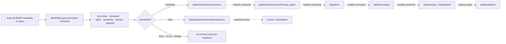

<!-- [KFM_META_BLOCK_V2]
doc_id: kfm://doc/connectors-nasa-smap-readme
title: connectors/nasa-smap/ — NASA SMAP README-Only Product Connector Boundary
type: readme
version: v0.2
status: draft
owners: OWNER_TBD — Connector steward · NASA/SMAP source steward · Soil steward · Agriculture steward · Security reviewer · Rights reviewer · Validation steward · Test steward · Docs steward
created: 2026-06-19
updated: 2026-07-13
policy_label: public-doctrine; readme-only; flat-product-lane; path-posture-unresolved; nasa-smap; model-assimilated-reference; surface-root-zone-separated; no-network; no-activation; raw-quarantine-only; no-publication
current_path: connectors/nasa-smap/README.md
truth_posture: CONFIRMED repository-present README-only flat lane at named conventional probes, v0.1 lineage, parallel flat/nested README surfaces, placeholder Soil/Agriculture registry records, empty machine source-authority register, draft downstream Soil pipeline documentation, conflicted SourceDescriptor schema authority, and TODO-only generic CI / CONFLICTED final NASA product-lane topology and SourceDescriptor schema path / PROPOSED future server-side SMAP source adapter / UNKNOWN recursive lane inventory, runtime implementation, credentials, endpoint allowlist, product identifiers, rights clearance, quotas, retry budgets, fixtures, executable tests, lifecycle artifacts, deployment, release state, and owners
evidence_snapshot:
  repository: bartytime4life/Kansas-Frontier-Matrix
  repository_id: "1059091169"
  visibility: public
  base_ref: main
  base_commit: b6bcc4cd27dc8c0fa1f74aa5b989cb3240e90aa8
  prior_blob: 762d0650d3e80c92e0b8f20d67a99b8d0bf3ebfc
related:
  - ../README.md
  - ../nasa/README.md
  - ../nasa/smap/README.md
  - ../nasa-earthdata/README.md
  - ../nasa-hls/README.md
  - ../nasa-firms/README.md
  - ../../CONTRIBUTING.md
  - ../../.github/CODEOWNERS
  - ../../.github/PULL_REQUEST_TEMPLATE.md
  - ../../.github/workflows/connector-gate.yml
  - ../../.github/workflows/source-descriptor-validate.yml
  - ../../docs/doctrine/directory-rules.md
  - ../../docs/doctrine/trust-membrane.md
  - ../../docs/doctrine/lifecycle-law.md
  - ../../docs/adr/README.md
  - ../../docs/adr/ADR-0012-connector-outputs-to-data-raw-or-data-quarantine-only.md
  - ../../docs/registers/DRIFT_REGISTER.md
  - ../../docs/sources/catalog/OPEN-QUESTIONS.md
  - ../../docs/sources/catalog/nasa/README.md
  - ../../docs/sources/catalog/nasa/nasa-smap.md
  - ../../docs/sources/catalog/nasa/nasa-earthdata.md
  - ../../docs/sources/SOURCE_DESCRIPTOR_STANDARD.md
  - ../../contracts/source/source_descriptor.md
  - ../../schemas/contracts/v1/source/source_descriptor.schema.json
  - ../../schemas/contracts/v1/sources/source_descriptor.schema.json
  - ../../control_plane/source_authority_register.yaml
  - ../../data/registry/sources/soil/nasa-smap.yaml
  - ../../data/registry/sources/agriculture/nasa-smap.yaml
  - ../../data/registry/sources/agriculture/nasa_smap.yaml
  - ../../pipelines/domains/soil/smap_ingest/README.md
  - ../../data/raw/
  - ../../data/quarantine/
  - ../../policy/source/
  - ../../policy/rights/
  - ../../policy/sensitivity/
  - ../../release/
tags: [kfm, connectors, nasa, smap, soil-moisture, earthdata, readme-only, source-admission, model-assimilated, surface-root-zone, nrt, reprocessed, ease-grid, soil, agriculture, rights, freshness, raw, quarantine, governance]
notes:
  - "At the pinned base, this README is the only confirmed file at the flat lane's directly inspected conventional package/test probes. Exact probes for pyproject.toml, src/nasa_smap/__init__.py, and tests/README.md returned Not Found. This is bounded named-path evidence, not an exhaustive recursive tree receipt."
  - "The repository also contains connectors/nasa/smap/README.md. Both paths are documentation boundaries; neither is selected here as the final canonical implementation home."
  - "OPEN-DSC-14 remains DEFERRED. data/registry/sources/nasa/README.md was not found, so the documented family-promotion gate is not satisfied by folder presence."
  - "The machine source-authority register has entries: []; the Soil and Agriculture SMAP YAML files inspected are PROPOSED placeholders, and Agriculture has both hyphenated and underscored placeholder names. None establishes activation."
  - "The rich singular SourceDescriptor schema declares the plural path canonical, while the plural file is an empty permissive PROPOSED scaffold. This README does not choose a winning schema path."
  - "The Soil SMAP pipeline README exists and is detailed, but its own metadata keeps executable behavior, source linkage, schedules, CI, and release wiring unverified; pipeline_specs/soil/smap_ingest.yaml was not found."
  - "The generic connector and SourceDescriptor workflows are TODO-only echo scaffolds and therefore do not prove enforcement."
  - "Only this Markdown file changes. No code, package metadata, credential, endpoint configuration, SourceDescriptor, registry activation, policy, schema, contract, fixture, executable test, workflow, lifecycle artifact, release object, path move, or public artifact is created or modified."
[/KFM_META_BLOCK_V2] -->

<a id="top"></a>

# NASA SMAP README-Only Product Connector Boundary

> [!IMPORTANT]
> **Document lifecycle:** `draft v0.2`  
> **Component maturity:** README-only at the directly inspected conventional flat-lane probes; no supported package, SMAP client, Earthdata client, downloader, parser, admission decision, test lane, or lifecycle handoff is verified  
> **Path posture:** the flat lane exists, but NASA-family promotion and final flat-versus-nested product topology remain `DEFERRED / CONFLICTED / NEEDS VERIFICATION`  
> **Authority:** implementation-boundary documentation inside `connectors/`; no source, credential, schema, policy, registry, evidence, lifecycle, release, routing, or publication authority

> [!CAUTION]
> NASA product access may require account credentials, bearer tokens, cookies, signed URLs, or provider redirects. Never commit, log, serialize, fixture, expose to a browser, or place in an error message any credential value, authorization header, cookie, token cache, private redirect, signed URL, or protected payload.


**Quick links:** [Purpose](#purpose) · [Authority](#authority-level) · [Status](#status) · [What belongs](#what-belongs-here) · [What does not](#what-does-not-belong-here) · [Inputs](#inputs) · [Outputs](#outputs) · [Validation](#validation) · [Review](#review-burden) · [Related](#related-folders) · [ADRs](#adrs) · [Last reviewed](#last-reviewed) · [Semantic boundary](#smap-source-role-and-semantic-boundary) · [Access](#access-authentication-and-secret-boundary) · [Operations](#operational-resilience-contract) · [Lifecycle](#lifecycle-and-quarantine-boundary) · [Identity](#identity-hashing-deduplication-and-replay) · [Fixtures](#no-network-fixture-strategy) · [Activation](#activation-promotion-and-publication) · [Evidence](#evidence-basis) · [Rollback](#correction-rollback-and-deactivation) · [Backlog](#verification-backlog) · [Done](#definition-of-done)

---

## Purpose

`connectors/nasa-smap/` currently provides a documentation boundary for a future NASA Soil Moisture Active Passive product adapter.

It exists to:

- prevent the folder from being mistaken for an implemented, activated, or canonical connector;
- preserve SMAP product, collection, granule, processing-level, version, cadence, layer, grid, source-role, temporal, rights, and provenance distinctions;
- keep observation-class product candidates distinct from model-assimilated reference candidates;
- keep surface and root-zone soil-moisture semantics separate;
- keep near-real-time and standard/reprocessed product candidates separate until downstream supersession handling is proven;
- define a server-side-only credential and protected-source boundary;
- constrain future connector output to source references, secret-free run-local sidecars, or caller-owned RAW/QUARANTINE handoff candidates;
- keep connector work upstream of normalization, EvidenceBundle closure, cataloging, promotion, release, public API/UI behavior, and AI interpretation.

This README does not prove implementation, canonical placement, source activation, product selection, rights clearance, endpoint availability, or public-release eligibility.

[Back to top](#top)

---

## Authority level

| Concern | Status | Evidence-bounded determination |
|---|---:|---|
| Owning responsibility root | **CONFIRMED** | `connectors/` owns source-specific fetch, probe, preservation, and admission mechanics. |
| Current path | **CONFIRMED** | `connectors/nasa-smap/README.md` exists at base `b6bcc4cd…`. |
| Final product-lane topology | **CONFLICTED / DEFERRED** | Both `connectors/nasa-smap/README.md` and `connectors/nasa/smap/README.md` exist. No accepted ADR or migration note inspected here selects one as canonical or compatibility-only. |
| NASA family promotion | **DEFERRED** | `OPEN-DSC-14` requires an ADR and populated connector plus source-registry companion. `data/registry/sources/nasa/README.md` was not found. |
| Connector implementation | **NOT ESTABLISHED** | The README is verified; named conventional package, module, and test probes were absent. Differently named or deeper content remains `UNKNOWN`. |
| Source authority / activation | **NOT ESTABLISHED** | `control_plane/source_authority_register.yaml` contains `entries: []`; inspected SMAP registry YAMLs are PROPOSED placeholders. |
| SourceDescriptor authority | **CONFLICTED** | The populated singular schema points to a plural canonical path whose file is an empty permissive scaffold. |
| Product/source doctrine | **DRAFT / PROPOSED** | The NASA SMAP catalog page and Soil pipeline README preserve useful semantic boundaries but do not create machine authority or activation. |
| Downstream pipeline | **DOCUMENTED / EXECUTION NOT ESTABLISHED** | `pipelines/domains/soil/smap_ingest/README.md` exists; its own status keeps executable behavior and wiring unverified, and its named pipeline spec was not found. |
| Rights and sensitivity enforcement | **UNKNOWN** | No SMAP-specific executable rights or sensitivity decision was verified in this change. |
| CI enforcement | **TODO-ONLY SCAFFOLDS** | The inspected connector and SourceDescriptor workflows only echo TODO messages. |
| Public output | **NONE AUTHORIZED** | This lane creates no map, API payload, claim, EvidenceBundle, release, or publication artifact. |

This edit does not choose the winning topology, SourceDescriptor schema path, registry naming, product collection, credential provider, environment-variable names, endpoint allowlist, retry budget, rate limit, source activation state, or public release posture.

[Back to top](#top)

---

## Status

At base commit `b6bcc4cd27dc8c0fa1f74aa5b989cb3240e90aa8`, exact probes confirmed this target README and returned `Not Found` for:

```text
connectors/nasa-smap/pyproject.toml
connectors/nasa-smap/src/nasa_smap/__init__.py
connectors/nasa-smap/tests/README.md
pipeline_specs/soil/smap_ingest.yaml
data/registry/sources/nasa/README.md
```

These are bounded named-path absences, not an exhaustive recursive tree receipt.

| Surface | Confirmed state | Safe conclusion |
|---|---|---|
| This README | v0.1 existed before this revision | A boundary document existed; runtime did not follow from it. |
| Flat lane | Target README exists | Path presence does not establish canonical topology or package maturity. |
| Nested lane | `connectors/nasa/smap/README.md` exists | Parallel documentation exists; authority must not diverge. |
| NASA umbrella | `connectors/nasa/README.md` exists | Umbrella planning exists; `OPEN-DSC-14` remains deferred. |
| Machine authority register | Empty | No source authority or activation is established. |
| Soil SMAP registry | PROPOSED placeholder | A filename is not a validated SourceDescriptor. |
| Agriculture SMAP registries | Hyphenated and underscored PROPOSED placeholders | Naming and duplication require reconciliation; neither grants authority. |
| SourceDescriptor schemas | Rich singular file plus empty plural scaffold | Canonical schema and validator wiring are conflicted. |
| Soil pipeline README | Detailed draft documentation | Downstream semantics are documented; execution and release wiring remain unproven. |
| Generic workflows | TODO-only jobs | A workflow file or green run would not prove connector behavior. |

[Back to top](#top)

---

## What belongs here

Until topology, authority, implementation, and activation gates close, this lane should contain only:

- this boundary document and evidence pointers;
- topology, migration, deprecation, redirect, and rollback notes;
- future product/collection/granule discovery code that preserves upstream identity and query evidence;
- future server-side authorization and provider-distribution adapters using an approved secret mechanism;
- future deterministic pagination, redirect handling, parsing, checksum, deduplication, and replay helpers;
- product metadata preservation for product id, processing level, collection/version, granule id, cadence class, layer semantics, QA metadata, native grid/projection, and source timestamps;
- synthetic or explicitly rights-cleared no-network fixtures;
- secret-free receipt candidates and caller-owned RAW/QUARANTINE handoff candidates;
- narrow admission checks that consume authoritative descriptors and policy decisions from their owning roots.

Discovery, authentication, distribution, product parsing, admission, normalization, comparison, aggregation, EvidenceBundle creation, cataloging, and publication remain distinct responsibilities even if future orchestration coordinates them.

## What does NOT belong here

This directory must not contain or imply authority over:

- canonical NASA-family or product-lane topology without the `OPEN-DSC-14` and migration/ADR decision path;
- browser-side Earthdata, DAAC, LANCE, protected-product, token, cookie, or signed-URL access;
- credentials, authorization headers, cookies, token caches, `.netrc` content, private redirects, signed URLs, secret-manager payloads, account identifiers, or real protected payloads;
- authoritative SourceDescriptors, activation decisions, source-authority entries, contracts, schemas, policy, rights decisions, or sensitivity decisions;
- a generic “NASA data” or “soil moisture” role that collapses products, providers, processing levels, versions, cadence classes, or surface/root-zone semantics;
- a claim that model-assimilated Level-4 material is raw measurement, station truth, field truth, ground truth, crop truth, drought truth, or public guidance;
- a silent merge with Kansas Mesonet, SCAN, USCRN, or any other in-situ source;
- normalization into Soil domain objects, resampling, reprojection, aggregation, comparison products, drought indicators, crop indicators, or catalog assets;
- writes to `data/work/`, `data/processed/`, `data/catalog/`, `data/triplets/`, `data/proofs/`, `data/published/`, `data/rollback/`, or `release/`;
- EvidenceBundle closure, catalog closure, promotion, release approval, public API/UI behavior, map layers, alerts, AI answers, or claims presented as NASA truth;
- live-network tests in the default no-network test lane;
- implicit rights clearance because the publisher is a public agency or an asset is technically downloadable.

A discoverable collection is not an admitted source. Successful authentication is not rights clearance. A downloaded granule is not a processed Soil record. A processed record is not a released KFM claim.

[Back to top](#top)

---

## Inputs

### Current

Documentation and repository evidence only. No supported runtime command, package API, configuration contract, environment-variable name, credential provider, endpoint allowlist, collection id, product id, retry policy, fixture shape, SourceDescriptor id, or activation state is declared by this lane.

### Future admissible inputs

After governance and implementation gates close, a retained adapter may consume:

- reviewed SMAP product-specific SourceDescriptor references;
- an explicit activation decision and approved access configuration;
- a caller-owned request plan containing provider, collection, product, granule, processing level, version, layer, temporal, spatial, format, paging, and destination intent;
- server-side secret references, never raw credentials in ordinary arguments;
- normalized metadata-query parameters and provider distribution references;
- caller-provided bytes, files, metadata documents, or approved transport responses;
- explicit RAW or QUARANTINE sink capability supplied by governed orchestration;
- explicit rights, sensitivity, source-role, integrity, and stale-state decisions supplied by their owning systems.

The connector must reject or quarantine inputs whose product identity, descriptor, rights, sensitivity, layer semantics, cadence class, version, provenance, or destination cannot be resolved.

## Outputs

### Current

This README only. It emits no source payload, descriptor, registry record, receipt, evidence bundle, lifecycle record, catalog item, release object, API payload, map layer, or public claim.

### Future permitted output classes

A reviewed implementation may return or hand off only:

- in-memory discovery or provider-response summaries with protected values removed;
- source-native metadata and source references;
- immutable payload bytes or pointers with checksums and retrieval metadata;
- secret-free run-local checksum manifests and ingest-receipt candidates;
- a caller-owned `data/raw/<domain>/<source_id>/<run_id>/` handoff candidate; or
- a caller-owned `data/quarantine/<domain>/<reason>/<run_id>/` handoff candidate with deterministic reason evidence.

A future connector must not create normalized Soil records, STAC/DCAT/PROV records, graph triplets, EvidenceBundles, public rasters, PMTiles, dashboards, alerts, releases, or published aliases. Central receipt indexing, if retained, must occur through a separately governed append-only writer; this README does not authorize direct connector writes to `data/receipts/`.

[Back to top](#top)

---

## Validation

### Current validation posture

| Validation surface | Current evidence | Determination |
|---|---|---|
| Flat-lane package tests | Named conventional test probe absent | **NOT ESTABLISHED** |
| Connector gate workflow | TODO-only echo jobs | **NOT ENFORCING** |
| SourceDescriptor workflow | TODO-only echo jobs | **NOT ENFORCING** |
| Machine source authority | Empty register | **NO ACTIVATION** |
| SMAP registry records | PROPOSED placeholders | **NOT VALIDATED DESCRIPTORS** |
| SourceDescriptor schema | Singular/plural authority conflict | **CONFLICTED** |
| Downstream SMAP pipeline | Draft README; named spec absent | **EXECUTION NOT ESTABLISHED** |

### Required future checks

Before implementation maturity is claimed, no-network tests and validators should prove:

- the selected path and package topology match an accepted ADR or migration note;
- product, collection, granule, processing level, version, and provider identity are preserved;
- observation-class and model-assimilated product roles cannot be silently collapsed;
- surface and root-zone outputs remain distinct;
- near-real-time and standard/reprocessed candidates remain distinct and carry explicit supersession state;
- SMAP and in-situ observations remain sibling evidence unless a reviewed downstream comparison or crosswalk says otherwise;
- native grid/projection, source resolution, timestamps, QA/uncertainty, and transformation intent are preserved where applicable;
- credentials and protected values never enter logs, exceptions, fixtures, receipts, URLs, or browser bundles;
- redirects and destination hosts are constrained by an approved allowlist;
- response identity, byte count, checksums, and content type are verified before admission;
- descriptor, rights, sensitivity, source-role, stale-state, and integrity failures route to deterministic quarantine or denial;
- successful connector output is limited to an approved RAW or QUARANTINE handoff;
- retries are bounded and deterministic; no infinite retry or silent partial success is possible;
- replays with the same admitted source state and request identity are idempotent or produce an explicit conflict;
- no connector path creates processed, catalog, triplet, proof, release, or public artifacts.

A README lint or link check is documentation validation only; it does not prove runtime safety or source admissibility.

## Review burden

Changes to this lane should receive review from:

- connector/source-admission stewardship;
- NASA/SMAP source stewardship;
- Soil stewardship and Agriculture stewardship when domain use changes;
- security review for authentication, redirects, downloads, archives, or parser changes;
- rights and sensitivity review before source activation or fixture inclusion;
- validation/test stewardship for behavior or fixture changes;
- docs stewardship for authority, truth labels, links, and rollback language.

`CODEOWNERS` is currently a greenfield placeholder and does not define a connector-specific ownership rule. Do not infer approval or staffing from placeholder teams. A path consolidation, rename, compatibility declaration, or source-family promotion additionally requires architecture/docs review and the applicable ADR or migration note.

## Related folders

| Surface | Responsibility | Current posture |
|---|---|---:|
| [`connectors/`](../README.md) | Root source-admission contract. | **CONFIRMED** |
| [`connectors/nasa/`](../nasa/README.md) | Proposed NASA umbrella boundary. | **CONFIRMED path / promotion DEFERRED** |
| [`connectors/nasa/smap/`](../nasa/smap/README.md) | Parallel nested SMAP documentation boundary. | **CONFIRMED path / topology CONFLICTED** |
| [`connectors/nasa-earthdata/`](../nasa-earthdata/README.md) | Shared Earthdata access-surface boundary. | **README-only at inspected probes** |
| [`docs/sources/catalog/nasa/nasa-smap.md`](../../docs/sources/catalog/nasa/nasa-smap.md) | Draft product/source doctrine. | **CONFIRMED document / activation not established** |
| [`control_plane/source_authority_register.yaml`](../../control_plane/source_authority_register.yaml) | Machine source-authority register. | **CONFIRMED empty** |
| [`data/registry/sources/soil/nasa-smap.yaml`](../../data/registry/sources/soil/nasa-smap.yaml) | Soil-side registry placeholder. | **PROPOSED placeholder** |
| [`data/registry/sources/agriculture/nasa-smap.yaml`](../../data/registry/sources/agriculture/nasa-smap.yaml) | Agriculture-side hyphenated placeholder. | **PROPOSED placeholder** |
| [`data/registry/sources/agriculture/nasa_smap.yaml`](../../data/registry/sources/agriculture/nasa_smap.yaml) | Agriculture-side underscored placeholder. | **PROPOSED duplicate/naming drift candidate** |
| [`pipelines/domains/soil/smap_ingest/`](../../pipelines/domains/soil/smap_ingest/README.md) | Downstream Soil normalization pipeline boundary. | **Draft documentation / execution not established** |
| [`schemas/contracts/v1/source/`](../../schemas/contracts/v1/source/source_descriptor.schema.json) | Populated singular SourceDescriptor schema. | **Rich but declares itself legacy** |
| [`schemas/contracts/v1/sources/`](../../schemas/contracts/v1/sources/source_descriptor.schema.json) | Declared plural canonical schema path. | **Empty permissive PROPOSED scaffold** |
| `data/raw/` and `data/quarantine/` | Connector payload handoff destinations after gates. | **Outside connector authority** |
| `policy/source/`, `policy/rights/`, `policy/sensitivity/` | Source, rights, and sensitivity decisions. | **Outside connector authority; SMAP enforcement not verified** |
| `release/` | Promotion, release, correction, and rollback decisions. | **Outside connector authority** |

## ADRs

| Decision surface | Status | Effect on this lane |
|---|---:|---|
| Directory Rules §7.3 | **GOVERNING DOCTRINE** | Connectors fetch/admit and stop at RAW or QUARANTINE; they do not publish or mutate canonical truth. |
| `OPEN-DSC-14` | **DEFERRED** | NASA family promotion is not established by folder or README presence. |
| ADR-0012 — connector outputs to RAW or QUARANTINE only | **DRAFT / PROPOSED HANDLE** | Useful numbered proposal; Directory Rules remain the authority until acceptance. |
| Flat `nasa-smap` versus nested `nasa/smap` topology | **NO ACCEPTED DECISION VERIFIED** | Do not move, duplicate implementation, or declare either path canonical in this README. |
| SourceDescriptor singular versus plural schema path | **CONFLICTED** | Do not create a connector-local schema or select a winner here. |

Any accepted ADR or migration note that changes topology, schema authority, lifecycle output, or family promotion must update this README, its nested sibling, the NASA umbrella README, relevant registries, tests, and rollback guidance together.

## Last reviewed

**2026-07-13** — repository evidence snapshot pinned to `main@b6bcc4cd27dc8c0fa1f74aa5b989cb3240e90aa8` and prior target blob `762d0650d3e80c92e0b8f20d67a99b8d0bf3ebfc`.

Review again when any of these changes:

- flat/nested topology or NASA-family promotion;
- SourceDescriptor schema authority;
- source-authority register or SMAP registry content;
- product selection, endpoint, provider, auth, rights, cadence, or version posture;
- connector code, package metadata, fixtures, tests, workflows, or deployment;
- downstream pipeline spec, behavior, release wiring, or public use;
- six months pass without review.

[Back to top](#top)

---

## SMAP source role and semantic boundary

The repository's current draft product and pipeline documentation supports the following KFM semantic constraints. These are source-role boundaries, not proof of current upstream product versions or connector implementation.

| Material class | KFM candidate posture | Must not be claimed by this connector |
|---|---|---|
| Selected observation-class SMAP product | Satellite-derived observation candidate only when the exact product, method, QA, layer, and SourceDescriptor support that role. | Generic raw truth, station truth, field truth, or an unspecified “SMAP observation.” |
| Level-4 surface candidate | Model-assimilated reference moisture for the surface layer. | Raw measurement, root-zone moisture, ground truth, or direct drought/crop conclusion. |
| Level-4 root-zone candidate | Model-assimilated reference moisture for the root-zone layer. | Surface moisture, raw measurement, station reading, or field-specific fact. |
| Near-real-time candidate | Preliminary cadence class with explicit product/version/time/QA posture. | Final or silently durable analytical truth. |
| Standard/reprocessed candidate | Distinct later candidate that may supersede an earlier candidate after governed matching and review. | Silent overwrite, deletion, or automatic public authority. |
| Kansas Mesonet or other in-situ comparison | Independent sibling evidence used only by a downstream reviewed comparison product. | Silent merge, calibration truth without receipt, or source-role substitution. |

### Anti-collapse rules

```text
SMAP product family              ≠ one generic product
observation-class candidate      ≠ model-assimilated candidate
surface layer                    ≠ root-zone layer
near-real-time candidate         ≠ standard/reprocessed candidate
satellite grid cell              ≠ station observation
satellite grid cell              ≠ field-specific fact
resampled value                  ≠ source-native value
SMAP + Mesonet comparison        ≠ merged source truth
connector success                ≠ evidence closure
connector success                ≠ release
```

The connector cannot by itself prove soil conditions at a specific field, establish countywide drought, infer crop yield, issue management advice, or authorize a public map. Those require downstream domain semantics, spatial support checks, aggregation/model receipts, EvidenceBundles, policy, review, release, correction, and rollback.

[Back to top](#top)

---

## Access, authentication, and secret boundary

### Current state

No supported endpoint, provider allowlist, collection identifier, authentication method, credential store, environment-variable name, token refresh path, command-line interface, or configuration file is established by this connector lane.

The related Earthdata README is the access-surface boundary. It does not make this SMAP lane implemented or activated.

### Future rules

A future adapter must:

- run server-side or in a controlled worker/operator context, never in a public browser;
- consume secret references from an approved secret mechanism rather than raw values in config or ordinary function arguments;
- prevent credentials, cookies, authorization headers, tokens, private redirects, and signed URLs from entering logs, receipts, exceptions, telemetry, cache keys, fixtures, or user-visible output;
- constrain outbound hosts, redirect hosts, protocols, content types, and maximum object/archive sizes through reviewed configuration;
- distinguish metadata discovery, authentication, provider distribution, product parsing, and admission decisions;
- store only secret-free source references and replay evidence;
- fail closed when authentication posture, destination host, rights, or protected-content handling is unresolved.

This README intentionally does not invent environment-variable names, credentials, endpoints, quotas, or token lifetimes.

[Back to top](#top)

---

## Endpoint, protocol, format, and cadence posture

Current product identifiers, provider endpoints, API/metadata protocols, paging semantics, download protocols, file formats, grid identifiers, cadence values, quotas, and update windows are `NEEDS VERIFICATION` before implementation or activation.

A future product-specific SourceDescriptor should pin at minimum:

- publisher, provider/DAAC or distribution surface, product/collection identity, processing level, and version;
- metadata-discovery and asset-distribution endpoint classes;
- authentication requirement and server-side secret posture;
- response/file formats, compression/archive behavior, media types, and parser limits;
- paging/cursor semantics and deterministic ordering, where applicable;
- source-native granule identifiers and revision identifiers;
- source-native grid/projection, spatial resolution/support, layer/depth semantics, and coverage footprint;
- observed/source/valid/retrieval times and cadence class;
- QA, uncertainty, fill/no-data, preliminary/reprocessed, and supersession semantics;
- rights, attribution, redistribution, commercial-use, and citation requirements;
- freshness expectation, stale-state policy, outage behavior, and deactivation trigger;
- source-head evidence such as upstream version, revision id, checksum, ETag, or Last-Modified when available and policy-safe.

Source-native formats and grids should be preserved at admission. Reprojection, resampling, conversion to COG/GeoParquet, aggregation, and comparison are downstream pipeline operations that require their own receipts.

[Back to top](#top)

---

## Operational resilience contract

No current numeric timeout, retry count, backoff schedule, rate limit, concurrency limit, circuit-breaker threshold, or object-size ceiling is verified for this lane. A future implementation must not invent or silently default those values in documentation.

The operational contract should require:

- bounded connect/read/total timeouts supplied by reviewed configuration;
- bounded retries only for explicitly retryable failures;
- exponential or otherwise reviewed backoff with jitter;
- respect for provider retry/rate-limit signals when present;
- deterministic pagination and resume checkpoints;
- content-length, object-count, archive-entry, decompression-ratio, and memory limits before parsing;
- checksums and content-type validation before admission;
- no automatic retry for authentication failure, rights denial, malformed identity, semantic mismatch, or integrity failure;
- a circuit-open or paused-source state after repeated provider/system failures;
- explicit stale/outage/no-op/quarantine evidence rather than silent reuse or silent partial success;
- idempotent replay or explicit conflict when the same request/run identity encounters changed source state.

A temporary upstream outage must not be converted into an empty valid dataset. A rate limit must not be converted into “no data.” A partial download must not be admitted as complete.

[Back to top](#top)

---

## Freshness, stale state, outage, and supersession

A future adapter and SourceDescriptor should keep these states distinct:

| State | Required behavior |
|---|---|
| Fresh source state | Preserve source-head evidence, retrieval time, product/version, and cadence. |
| Unchanged/no-op | Emit secret-free no-op evidence; do not duplicate payloads or advance release state. |
| Stale but usable for internal review | Mark stale explicitly; downstream policy decides whether to ABSTAIN, hold, or deny publication. |
| Upstream outage | Record outage evidence and retry posture; do not emit empty truth or silently substitute another product. |
| Near-real-time candidate | Mark preliminary/revisable and retain the product/version/time identity. |
| Standard/reprocessed replacement candidate | Link to the earlier candidate through reviewed supersession matching; do not delete or overwrite lineage. |
| Product/version retirement | Pause or deactivate source intake until descriptors, parsers, fixtures, rights, and downstream impacts are reviewed. |
| Schema or semantic drift | Quarantine and open a verification/drift item; do not coerce unknown fields into old meanings. |

Supersession is a governed relation, not filename replacement. Later source data does not automatically correct a released KFM artifact; correction and release systems own that transition.

[Back to top](#top)

---

## Lifecycle and quarantine boundary



### Candidate RAW preconditions

A future run may be eligible for a caller-owned RAW handoff only when:

- authoritative descriptor and activation references resolve;
- product/collection/granule/version/layer/cadence identity is complete;
- rights and sensitivity posture allow acquisition and retention;
- authentication and destination-host policy pass;
- response/file integrity and content type pass;
- source-native payload and metadata can be retained without unsafe transformation;
- checksums and secret-free retrieval evidence are complete.

### Quarantine reasons

Use deterministic, reviewable reason codes or equivalent structured reasons for conditions such as:

- missing or invalid SourceDescriptor;
- no activation decision;
- unresolved rights, attribution, redistribution, or sensitivity;
- unknown product, collection, version, processing level, layer, cadence, or provider;
- surface/root-zone ambiguity;
- observation/model-assimilation role ambiguity;
- near-real-time/reprocessed supersession ambiguity;
- source schema or semantic drift;
- unexpected content type, truncated content, checksum mismatch, or archive/parser safety failure;
- missing QA/uncertainty/no-data semantics;
- unsupported grid/projection or lost source-resolution metadata;
- unsafe redirect or authentication leakage risk;
- duplicate identity with conflicting bytes;
- request/replay identity conflict;
- destination/lifecycle sink not explicitly authorized.

When no safe classification exists, quarantine rather than guess.

[Back to top](#top)

---

## Identity, hashing, deduplication, and replay

A future implementation should make identity deterministic at four levels:

1. **Request identity** — canonicalized product/provider/query/spatial/temporal/page/version intent with secrets excluded.
2. **Source object identity** — source-native collection/granule/revision/layer identifiers plus provider and product version.
3. **Content identity** — byte-level checksum for each immutable fetched object and checksum manifest for the run.
4. **Run identity** — deterministic or collision-resistant id bound to descriptor version, request identity, source-head state, implementation/spec hash, and execution time where appropriate.

Required behavior:

- never put credentials, signed URLs, authorization data, or volatile secret-bearing query parameters into hashes or receipts;
- preserve original source identifiers; do not replace them with derived KFM ids;
- distinguish duplicate identity with identical bytes from duplicate identity with conflicting bytes;
- avoid deduplicating surface and root-zone assets, NRT and reprocessed assets, or different product versions merely because timestamps overlap;
- record content and metadata canonicalization rules before relying on replay equality;
- allow a reviewer to reconstruct which descriptor, request, source-head state, payload checksum, and parser/spec version produced a handoff candidate;
- treat changed source bytes under the same upstream identifier as drift or revision evidence, not silent overwrite.

No canonical SMAP id formula or hash recipe is established by this README.

[Back to top](#top)

---

## Normalization and downstream responsibility

The connector preserves source material; it does not normalize domain truth.

| Operation | Owning surface |
|---|---|
| Metadata discovery, protected distribution, source-byte capture | Future accepted connector implementation |
| Product/granule identity preservation and RAW/QUARANTINE admission | Future accepted connector plus governed admission gates |
| Surface/root-zone normalization into Soil candidates | `pipelines/domains/soil/smap_ingest/` after implementation and tests |
| Reprojection, resampling, COG/GeoParquet conversion | Downstream pipeline with transformation receipt |
| Aggregation to field/county/region/time composites | Downstream analytical pipeline with spatial/temporal support receipt |
| SMAP/Mesonet comparison or calibration | Reviewed derived-product lane with explicit crosswalk/model receipt |
| EvidenceBundle and citation closure | Evidence/proof systems |
| STAC/DCAT/PROV and domain catalog records | Catalog pipelines |
| Public layer/API/UI/AI output | Release-gated governed delivery surfaces |
| Correction, withdrawal, supersession of released KFM artifacts | Release/correction systems |

A successful download cannot bypass these responsibilities.

[Back to top](#top)

---

## Receipts, evidence, and emitted artifacts

A future connector run should preserve enough secret-free evidence to support review without claiming proof closure:

- descriptor and activation references;
- request identity and approved destination intent;
- source/provider/product/collection/granule/version/layer/cadence identifiers;
- retrieval start/end time and result class;
- response status class and policy-safe headers/source-head evidence;
- redirect summary without protected URLs or tokens;
- byte count, media type, object checksum, and checksum-manifest reference;
- retry, backoff, rate-limit, timeout, no-op, outage, or circuit state;
- rights/sensitivity decision references, not duplicated policy;
- RAW or QUARANTINE destination reference supplied by orchestration;
- quarantine/deny/no-op reason evidence;
- implementation/spec version and replay inputs.

These records are process evidence, not an EvidenceBundle, proof pack, release manifest, or public citation. Run-local sidecars belong with the selected RAW/QUARANTINE run unless an accepted receipt architecture provides a governed append-only index.

[Back to top](#top)

---

## No-network fixture strategy

Default tests must not require NASA credentials, live provider access, or mutable upstream state.

A future fixture lane should include small, synthetic or explicitly rights-cleared examples for:

- collection/product metadata with surface semantics;
- collection/product metadata with root-zone semantics;
- observation-class versus model-assimilated role separation;
- near-real-time versus standard/reprocessed candidates;
- pagination and deterministic ordering;
- redirect allow/deny behavior with fictional hosts;
- content-type, checksum, truncation, archive-bomb, oversized-object, and malformed-file failures;
- QA/no-data/fill-value preservation;
- grid/projection and source-resolution metadata preservation;
- duplicate identical bytes and duplicate conflicting bytes;
- stale, no-op, outage, rate-limit, timeout, retry-exhausted, and circuit-open states;
- missing descriptor, inactive source, unresolved rights, unresolved sensitivity, and schema drift;
- credential/token/cookie/signed-URL redaction in logs, exceptions, receipts, and snapshots;
- RAW handoff success and deterministic QUARANTINE outcomes;
- assertions that no processed/catalog/proof/release/public output is written.

Live probes, if later authorized, belong in a separate manual or scheduled lane with explicit credentials, terms, budgets, logging controls, and no publication side effects.

[Back to top](#top)

---

## Activation, promotion, and publication

### Activation prerequisites

A SMAP connector must remain inactive until all applicable items pass:

- final connector topology is accepted or migration/compatibility behavior is documented;
- product-specific SourceDescriptors validate against a settled schema authority;
- the machine source-authority register records an approved role and status;
- rights, attribution, redistribution, access, sensitivity, retention, and citation are reviewed;
- product/collection/version/provider/layer/cadence selections are pinned;
- server-side credential handling and endpoint/redirect allowlists are reviewed;
- no-network fixtures and negative tests exist;
- parsers, limits, retries, timeouts, rate handling, checksums, quarantine, and replay behavior pass;
- RAW/QUARANTINE sinks and secret-free receipt handling are proven;
- downstream pipeline compatibility is tested without granting the connector publication authority;
- connector CI performs substantive checks rather than TODO echoes;
- owners and review burden are assigned.

### Promotion and publication restrictions

Connector activation permits source admission only. It does not permit:

- promotion to WORK, PROCESSED, CATALOG/TRIPLET, or PUBLISHED;
- EvidenceBundle or proof closure;
- public map/API/UI/AI use;
- declaring a model-assimilated product “measured” or “ground truth”;
- automatic drought, crop, hazard, or management claims;
- silent NRT replacement, resampling, aggregation, or in-situ merging;
- release, correction, withdrawal, or rollback decisions.

Connectors and watchers are not publication authorities. A source change event may create a candidate, receipt, quarantine record, or pull request; it must not publish or rewrite public truth.

[Back to top](#top)

---

## Rights, attribution, sensitivity, and public safety

Current SMAP-specific rights, attribution, redistribution, access, retention, and citation decisions are not established by this README.

Before activation, authoritative records should answer:

- which product/version/provider terms apply;
- whether account acceptance or additional agreements apply;
- whether KFM may retain, transform, redistribute, cache, mirror, or publish derived artifacts;
- required attribution and citation text;
- whether credentials or signed distribution references impose handling limits;
- whether spatial joins with private fields, infrastructure, archaeological sites, rare species, or other sensitive data raise the sensitivity floor;
- whether a derived high-resolution product creates false precision or exposure risk;
- how source corrections, reprocessing, withdrawal, or product retirement affect retained and released artifacts.

Public-sector origin does not imply unrestricted redistribution. Coarse satellite resolution does not remove sensitivity from downstream joins. When rights or sensitivity are unclear, quarantine, restrict, generalize, delay, or deny rather than assume.

[Back to top](#top)

---

## Proposed failure contract

The following is a lane-local proposal for future tests, not a settled cross-project enum:

| Outcome | Meaning | Required evidence |
|---|---|---|
| `ADMIT_CANDIDATE` | Payload is eligible for caller-owned RAW handoff. | Descriptor, activation, identity, rights/sensitivity, integrity, checksum, and destination evidence. |
| `QUARANTINE` | Payload or metadata must be held for review/remediation. | Structured reason, source identity, safe metadata, and remediation pointer. |
| `NO_OP` | Source state is unchanged or no new eligible object exists. | Request identity and source-head/content identity evidence. |
| `DENY` | Policy or access posture prohibits acquisition, retention, or handling. | Policy decision reference without sensitive detail. |
| `RETRY_LATER` | Temporary provider/rate/outage condition is safely retryable. | Bounded retry state and next-action evidence. |
| `ERROR` | Local/system/parser/integrity failure prevented a safe decision. | Redacted error class, no partial admission, and operator action. |

No failure may silently become an empty successful dataset or public “no data” claim.

[Back to top](#top)

---

## Evidence basis

| Evidence | Status | Supports | Does not prove |
|---|---:|---|---|
| Target README at `main@b6bcc4cd…` | **CONFIRMED** | v0.1 existed at prior blob `762d0650…`. | Runtime, activation, tests, or canonical topology. |
| Exact conventional flat-lane probes | **CONFIRMED bounded result** | Named package/module/test paths were absent. | Exhaustive recursive absence of every possible implementation file. |
| `connectors/README.md` and Directory Rules §7.3 | **CONFIRMED doctrine/repo docs** | Connector source-admission and RAW/QUARANTINE boundary. | Executable enforcement. |
| Parallel `connectors/nasa/smap/README.md` | **CONFIRMED** | A nested documentation lane also exists. | Which path is canonical. |
| `OPEN-DSC-14` | **CONFIRMED register state** | NASA family promotion is deferred and gated. | Future resolution. |
| `control_plane/source_authority_register.yaml` | **CONFIRMED empty** | No machine source-authority entry exists. | Whether future or external authority will be granted. |
| Soil/Agriculture SMAP registry YAMLs | **CONFIRMED placeholders** | Proposal filenames and source-doc pointers exist. | Valid SourceDescriptors or activation. |
| Singular/plural SourceDescriptor schemas | **CONFIRMED conflict** | Rich singular schema points to empty plural canonical scaffold. | Accepted canonical schema or validator behavior. |
| SMAP source catalog page | **CONFIRMED draft document** | Current KFM semantic intent: model-assimilated role, layer/cadence separation, no silent merge. | Current upstream details, rights, endpoint behavior, or machine authority. |
| Soil SMAP ingest pipeline README | **CONFIRMED draft document** | Downstream responsibility and anti-collapse intent. | Executable pipeline, spec, tests, schedules, or release wiring. |
| Generic connector/descriptor workflows | **CONFIRMED TODO-only** | Workflow names and triggers exist. | Substantive validation or gate enforcement. |
| Current external SMAP/DAAC documentation | **NOT USED AS IMPLEMENTATION PROOF HERE** | Must be rechecked during descriptor/client implementation. | Repo behavior or source activation. |

Where documentation and machine authority conflict, this README narrows the claim and defers activation.

[Back to top](#top)

---

## Correction, rollback, and deactivation

### Documentation rollback

This v0.2 change can be reversed by restoring:

```text
repository: bartytime4life/Kansas-Frontier-Matrix
base commit: b6bcc4cd27dc8c0fa1f74aa5b989cb3240e90aa8
prior blob: 762d0650d3e80c92e0b8f20d67a99b8d0bf3ebfc
path: connectors/nasa-smap/README.md
```

Rollback changes only this README. It must not delete source material, registry lineage, nested-lane documentation, pipeline documentation, or release history.

### Future source deactivation

A future activated connector should support fail-closed pause/deactivation when:

- product/version/provider/endpoints change incompatibly;
- terms, rights, attribution, access, or redistribution posture changes;
- credentials or secret handling is compromised;
- source identity, layer semantics, cadence, QA, grid, or format drifts;
- repeated integrity, parser, timeout, rate-limit, or outage failures exceed reviewed thresholds;
- descriptor, policy, schema, registry, fixture, or validator state becomes invalid;
- flat/nested topology creates divergent behavior;
- upstream correction/withdrawal or KFM review requires a hold.

Deactivation stops new admission. It does not silently delete prior RAW evidence, overwrite lineage, retract a release, or correct a public claim. Release/correction systems own public withdrawal, supersession, and rollback.

[Back to top](#top)

---

## Verification backlog

| Item | Status | Evidence required to close |
|---|---:|---|
| Resolve NASA-family promotion under `OPEN-DSC-14`. | **DEFERRED** | Accepted ADR plus required connector/registry companion state. |
| Resolve flat `connectors/nasa-smap/` versus nested `connectors/nasa/smap/`. | **NEEDS VERIFICATION** | ADR or migration note defining canonical, compatibility, imports, tests, redirects, and rollback. |
| Produce a complete recursive inventory for both SMAP paths. | **NEEDS VERIFICATION** | Tree/contents receipt at a pinned commit. |
| Assign owners and connector-specific review rules. | **NEEDS VERIFICATION** | CODEOWNERS or approved ownership record. |
| Resolve singular/plural SourceDescriptor schema authority. | **CONFLICTED** | Accepted ADR/migration, populated canonical schema, fixtures, validator, and parity tests. |
| Replace Soil/Agriculture SMAP placeholders with validated descriptors or remove duplicates. | **NEEDS VERIFICATION** | Registry decision, descriptor instances, validation, naming migration, and review. |
| Populate machine source-authority state for approved products. | **NOT STARTED** | Reviewed authority/activation entries tied to descriptors and policy. |
| Select and pin product/collection/provider/version/layer/cadence roles. | **NEEDS VERIFICATION** | Current upstream review plus approved product-specific SourceDescriptors. |
| Verify access, authentication, endpoints, redirects, formats, paging, quotas, and terms. | **NEEDS VERIFICATION** | Current official documentation, security/rights review, and client tests. |
| Define timeouts, retry/backoff, rate handling, circuit breaking, and size limits. | **NEEDS VERIFICATION** | Reviewed configuration contract plus deterministic tests. |
| Create safe no-network fixtures and negative cases. | **NOT ESTABLISHED** | Fixture registry, rights record, tests, and leak checks. |
| Implement and test RAW/QUARANTINE handoff and secret-free run evidence. | **NOT ESTABLISHED** | Code, schemas/contracts, sink tests, receipts, and path-boundary tests. |
| Implement substantive connector and SourceDescriptor CI. | **NOT ESTABLISHED** | Workflows invoking real tests/validators with negative-state coverage. |
| Implement and validate the downstream SMAP pipeline spec. | **NEEDS VERIFICATION** | Accepted `pipeline_specs` path, executable code, fixtures, receipts, and tests. |
| Prove surface/root-zone, observation/model, NRT/reprocessed, and grid/station anti-collapse. | **NEEDS VERIFICATION** | Negative fixtures and end-to-end validation receipts. |
| Verify rights, attribution, redistribution, citation, sensitivity, correction, and deactivation. | **NEEDS VERIFICATION** | Policy decisions and steward review. |
| Prove no connector/browser/public-path access and no connector publication. | **NEEDS VERIFICATION** | Architecture tests, dependency checks, route tests, and release-gate evidence. |

[Back to top](#top)

---

## Definition of done

This connector lane is not implementation-complete until all applicable criteria pass:

- [ ] An accepted topology decision identifies the canonical lane and any compatibility/migration behavior.
- [ ] NASA-family promotion or product-lane exception is recorded through the required governance path.
- [ ] Product-specific SourceDescriptors validate against one accepted schema authority.
- [ ] Machine authority/activation entries exist for the selected products and roles.
- [ ] Rights, attribution, redistribution, access, retention, sensitivity, citation, and correction postures are reviewed.
- [ ] Product/provider/collection/version/processing-level/layer/cadence identities are pinned.
- [ ] Server-side credential handling, endpoint/redirect allowlists, parser limits, and secret-redaction tests pass.
- [ ] Timeouts, retry/backoff, rate limits, circuit breaking, paging, checksums, and replay behavior are deterministic and tested.
- [ ] No-network valid/invalid/golden fixtures exist and carry rights/provenance notes.
- [ ] RAW and QUARANTINE handoffs are append-only, checksummed, and bounded by Directory Rules.
- [ ] Observation/model, surface/root-zone, NRT/reprocessed, source-native/derived, and grid/station distinctions are enforced by negative tests.
- [ ] Connector output cannot reach WORK, PROCESSED, CATALOG/TRIPLET, PROOFS, RELEASE, PUBLISHED, public API/UI, or AI surfaces.
- [ ] The downstream Soil pipeline consumes admitted inputs without giving the connector normalization or publication authority.
- [ ] CI runs substantive tests and validators rather than TODO echoes.
- [ ] Owners, review burden, operational runbook, correction path, deactivation path, and rollback target are assigned.
- [ ] Documentation, nested/umbrella siblings, registries, schemas, policies, tests, and pipeline references agree.

Until then, the honest status is **README-only / inactive / not publication-authorized**.

---

## Changelog

### v0.2 — 2026-07-13

- Replaced broad implementation uncertainty with a commit-pinned repository evidence snapshot.
- Recorded the flat/nested SMAP path conflict without selecting a canonical home.
- Recorded the deferred NASA-family promotion gate and missing family registry companion.
- Distinguished placeholder registry filenames from validated SourceDescriptors and activation.
- Surfaced the singular/plural SourceDescriptor schema-authority conflict.
- Distinguished downstream pipeline documentation from verified executable behavior.
- Recorded TODO-only CI and placeholder CODEOWNERS posture.
- Added the Directory Rules §15 folder README contract in required order.
- Added source-role limits, credentials, endpoint/cadence, resilience, stale/outage, lifecycle, quarantine, identity/replay, fixtures, activation, rights, failure, rollback, deactivation, and definition-of-done contracts.
- Preserved the core v0.1 anti-collapse posture: Level-4 model-assimilated reference is not raw measurement; surface is not root-zone; NRT is not reprocessed; SMAP is not silently merged with in-situ evidence.
- Changed no file except this README and granted no implementation, source, registry, release, or publication authority.

### v0.1 — 2026-06-19

- Replaced a blank placeholder with the initial SMAP connector-boundary note.

---

## Maintainer note

Keep this lane conservative. A connector may preserve and admit source material after gates; it may not decide what the material proves, normalize it into domain truth, merge it with in-situ evidence, publish it, or turn a successful fetch into a public claim.

[Back to top](#top)
