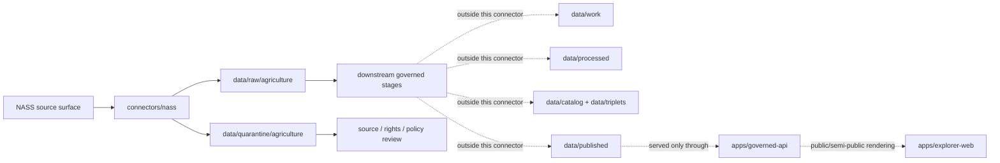
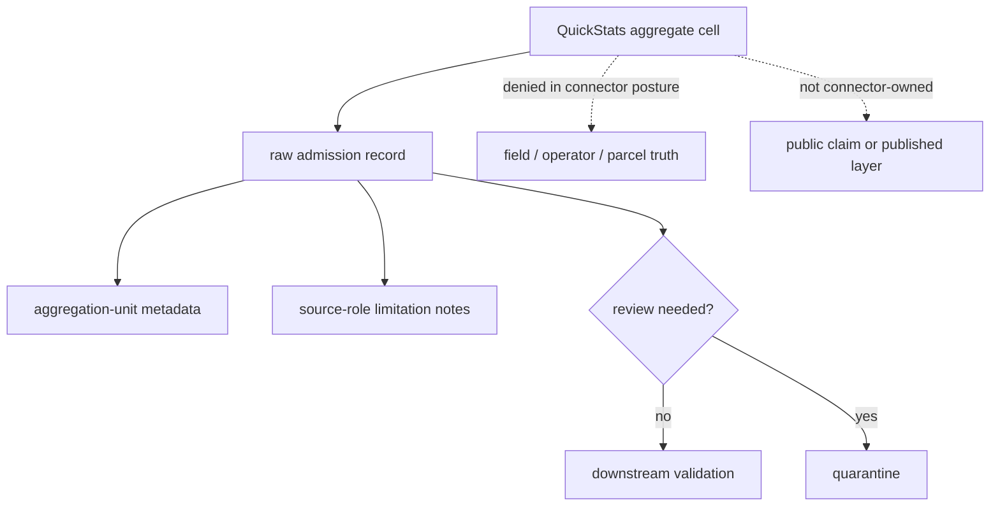

<!-- [KFM_META_BLOCK_V2]
doc_id: kfm://doc/connectors-nass-readme
title: connectors/nass/ — NASS Connector Lane
type: readme
version: v0.1
status: draft
owners: OWNER_TBD — Source steward · Connector steward · Agriculture steward · Data steward · Docs steward
created: 2026-06-19
updated: 2026-06-19
policy_label: public
related:
  - ../README.md
  - ../../docs/doctrine/directory-rules.md
  - ../../docs/sources/catalog/usda/README.md
  - ../../docs/sources/catalog/usda/usda-nass-quickstats.md
  - ../../docs/sources/catalog/usda/usda-nass-cdl.md
  - ../../docs/domains/agriculture/SOURCE_REGISTRY.md
  - ../../data/registry/sources/
  - ../../data/raw/
  - ../../data/quarantine/
  - ../../data/receipts/
  - ../../data/proofs/
  - ../../policy/rights/
  - ../../policy/sensitivity/
  - ../../release/
tags: [kfm, connectors, nass, usda, agriculture, quickstats, cdl, source-admission, raw, quarantine, governance]
notes:
  - "Connector lane for USDA NASS source intake and admission helpers."
  - "Placement is draft: Directory Rules §7.3 does not list nass/ in the canonical connector spine; keep OPEN-DSC-14 / source-family placement unresolved until ADR or migration note."
  - "Connector output may enter raw or quarantine admission lanes only."
  - "QuickStats API facts are descriptive source-interface notes, not implementation proof."
[/KFM_META_BLOCK_V2] -->

<a id="top"></a>

# NASS Connector

> Source-specific intake and admission lane for USDA National Agricultural Statistics Service source material, especially QuickStats aggregate statistics and Cropland Data Layer source events.

<p>
  
  
  
  
  
  
</p>

`connectors/nass/`

## Quick jumps

[Scope](#scope) · [Repo fit](#repo-fit) · [Lifecycle sketch](#lifecycle-sketch) · [Authority boundary](#authority-boundary) · [Inputs](#inputs) · [Exclusions](#exclusions) · [Source interface notes](#source-interface-notes) · [Admission posture](#admission-posture) · [Aggregate-only governance](#aggregate-only-governance) · [Placement status](#placement-status) · [Validation](#validation) · [Definition of done](#definition-of-done)

---

## Scope

`connectors/nass/` is the connector lane for NASS source intake and admission helpers.

This folder may contain connector-local documentation, source-admission helpers, API-request builders, no-network fixture pointers, and raw/quarantine output adapters for NASS products used by KFM Agriculture and related lanes.

It must not become agricultural truth, source-family authority, policy authority, schema authority, catalog/triplet authority, proof authority, release authority, pipeline authority, or publication authority.

> [!IMPORTANT]
> **Status:** draft / `NEEDS VERIFICATION`  
> **Owner:** `OWNER_TBD`  
> **Path:** `connectors/nass/`  
> **Truth posture:** the path exists in the repository as this README; source activation, endpoint behavior, credentials, tests, fixtures, CI wiring, rights status, and placement ratification remain `NEEDS VERIFICATION`.

---

## Repo fit

```text
connectors/
└── nass/
    └── README.md
```

Related responsibility roots:

```text
connectors/                                # source-specific fetch and admission code
docs/sources/catalog/usda/                 # USDA/NASS source-family and product documentation
docs/domains/agriculture/                  # agriculture domain context and source-role rules
data/registry/sources/                     # authoritative SourceDescriptors and activation state
data/raw/agriculture/                      # raw staged agriculture outputs
data/quarantine/agriculture/               # held material requiring source/policy review
data/receipts/                             # ingest, run, transform, and aggregation receipts
data/proofs/                               # EvidenceBundles and proof packs
policy/rights/                             # rights and source-term checks
policy/sensitivity/                        # sensitive-join and release-safety rules
release/                                   # release decisions, manifests, rollback, correction state
apps/governed-api/                         # downstream public trust membrane, not connector-owned
apps/explorer-web/                         # downstream map UI, never direct RAW/QUARANTINE access
```

---

## Lifecycle sketch



> [!CAUTION]
> Connector code admits source material. It does not normalize, catalog, publish, answer public claims, or decide source truth. Promotion remains a governed state transition, not a file move.

---

## Authority boundary

```text
OUTPUT LIMIT:
  data/raw/agriculture/<source_id>/<run_id>/
  data/quarantine/agriculture/<source_id>/<run_id>/

NOT HERE:
  source-family truth
  agriculture doctrine
  SourceDescriptor authority
  rights or sensitivity policy
  API/public UI behavior
  processed data
  catalog records
  triplet records
  receipts/proofs as authority
  release decisions
  published artifacts
  schemas/contracts
  generated reports
```

---

## Inputs

| Accepted item | Required posture |
|---|---|
| Source adapter | Preserve source identity, request parameters, retrieval time, source product, and review posture. |
| QuickStats request builder | Build bounded requests only; preflight broad requests with count checks when implemented. |
| CDL source-event helper | Preserve source vintage, raster/product identity, retrieval metadata, and checksum expectations. |
| Credential configuration notes | Document environment-variable expectations only; never commit API keys, tokens, or secrets. |
| Admission helper | Prepare raw/quarantine output only. |
| Aggregate-role helper | Preserve aggregation unit, time period, measure, commodity, and source-role limitation fields. |
| Connector docs | Do not claim source admission, validation, release, or policy state unless verified. |
| Test references | Point to owning fixture/test roots; fixtures do not become source authority. |

---

## Exclusions

| Do not store here | Correct home |
|---|---|
| NASS source-family documentation | `docs/sources/catalog/usda/` |
| Authoritative `SourceDescriptor` records | `data/registry/sources/` |
| Agriculture doctrine | `docs/domains/agriculture/` |
| Rights, terms, sensitivity, or release policy | `policy/rights/`, `policy/sensitivity/`, `policy/` |
| Processed agriculture records | `data/processed/` |
| Catalog or triplet records | `data/catalog/`, `data/triplets/` |
| Receipts and proof packs as authority | `data/receipts/`, `data/proofs/` |
| Release decisions, manifests, rollback, or correction records | `release/` |
| Published artifacts or public layers | `data/published/` after governed release |
| Schemas or semantic contracts | `schemas/`, `contracts/` |
| Generated reports | `artifacts/` |
| Public UI or API behavior | `apps/governed-api/`, `apps/explorer-web/` |

---

## Source interface notes

These notes describe the external source surfaces this connector may support. They are not implementation proof.

| Source surface | KFM use | Connector posture |
|---|---|---|
| NASS QuickStats API | Official published aggregate agricultural estimates, often queried by commodity, geography, and time. | `NEEDS VERIFICATION` before activation; output remains aggregate source material. |
| QuickStats `api_GET` | Bounded retrieval of published estimates. | Use only through configured request builders; do not hard-code secrets. |
| QuickStats `get_counts` | Count preflight for a parameterized query. | Use before broad pulls where practical; route excessive result sets to narrower queries or bulk-download review. |
| QuickStats `get_param_values` | Parameter discovery for a specific field. | Treat as discovery metadata, not as domain truth. |
| NASS Cropland Data Layer | Annual crop-class raster product referenced by USDA/NASS source docs. | Admit source snapshots only; classification interpretation, crosswalks, and map products are downstream. |

QuickStats facts to preserve at admission time where applicable:

- request URL path and query parameters, with API key redacted;
- NASS source product and endpoint family;
- retrieval time;
- response format;
- content digest and source headers when available;
- row count or count preflight result when available;
- source `load_time` field when present;
- aggregation geography such as state, county, district, region, ZIP, watershed, or national scope;
- time fields such as `year`, `freq_desc`, `reference_period_desc`, `week_ending`, `begin_code`, and `end_code` when present;
- terms/attribution review state;
- quarantine reason if the request, rights, size, format, or source-role posture needs review.

> [!WARNING]
> NASS API use requires compliance with the NASS Terms of Service. Public-facing products using the API must not imply NASS endorsement and should preserve the required attribution/notice posture through downstream release review.

---

## Admission posture

NASS intake should preserve:

- source identity and source surface;
- product family (`quickstats`, `cdl`, or another explicit NASS product if later approved);
- request parameters and filters;
- retrieval timestamp;
- source time, source vintage, and `load_time` where available;
- source role and limitation notes;
- content digest;
- response format and parse status;
- aggregation unit and geography scope;
- tabular value fields as source text until downstream validation normalizes them;
- rights and attribution posture;
- source-size / result-limit posture;
- quarantine reason when review is required.

NASS may inform Agriculture indicators, county-year matrices, crop context, land-cover context, and Focus Mode summaries. Connector output remains admission material. Confirmation, transformation, aggregation receipts, EvidenceBundle production, catalog closure, public claims, publication, correction, and rollback belong to governed downstream stages.

---

## Aggregate-only governance

QuickStats is an aggregate source surface. This connector must preserve aggregate semantics and prevent downstream consumers from mistaking aggregate cells for field-, operator-, parcel-, or site-level truth.

| Rule | Connector implication |
|---|---|
| Preserve `source_role = aggregate` hints for QuickStats candidates. | Do not relabel QuickStats as observation data in connector output. |
| Preserve the aggregation unit. | Carry county/state/district/watershed/national scope as source metadata. |
| Preserve matrix-cell semantics. | Treat commodity × measure × geography × time as a cell, not as a direct claim about a field or person. |
| Fail closed on private-sensitive joins. | Route any request that could imply operator-, farm-, parcel-, or proprietary yield truth to quarantine or downstream policy review. |
| Keep AI downstream and evidence-subordinate. | Connector output is not a Focus Mode answer and cannot be cited directly by public AI surfaces. |



---

## Placement status

`connectors/nass/README.md` is intentionally conservative because NASS placement is not yet fully ratified by Directory Rules.

| Claim | Status | Notes |
|---|---|---|
| `connectors/nass/README.md` contains this connector README | `CONFIRMED` after this update | The file itself now carries the connector-lane boundary. |
| `connectors/nass/` is a source-admission lane only | `PROPOSED / draft` | Consistent with `connectors/` responsibility, but not yet listed in the canonical §7.3 connector spine. |
| NASS product docs exist under `docs/sources/catalog/usda/` | `CONFIRMED` in repo evidence | QuickStats and CDL product docs are adjacent source-catalog anchors. |
| NASS connector placement is ADR-ratified | `NEEDS VERIFICATION` | `OPEN-DSC-14` keeps the USDA/NASS/NRCS family boundary open. |
| A live NASS `SourceDescriptor` exists and is active | `NEEDS VERIFICATION` | Must be checked under `data/registry/sources/`. |
| API key, endpoint behavior, tests, fixtures, and CI are implemented | `UNKNOWN` | Not proven by this README. |
| NASS outputs are validated, cataloged, and published | `UNKNOWN` | Connector README does not prove downstream promotion. |

---

## Validation

Before relying on this connector, verify:

- placement is intentional and documented by ADR, migration note, or updated Directory Rules;
- source descriptors exist and are active for each NASS source product;
- API key handling uses non-committed configuration or secret storage;
- terms-of-service and attribution requirements are captured in the source descriptor and release review;
- request builders perform bounded queries and use `get_counts` preflight where practical;
- tests use no-network fixtures where practical;
- output paths are limited to raw/quarantine admission lanes;
- source-role and aggregation-unit metadata survive parsing;
- field-, operator-, parcel-, or private-sensitive joins fail closed;
- downstream receipts, proofs, catalog/triplet records, and release records are produced only outside this connector;
- public products are released only through governed publication controls.

---

## Definition of done

- [ ] Owners are confirmed and `OWNER_TBD` is replaced.
- [ ] Directory placement is ratified or the conflict is recorded in the drift/open-question register.
- [ ] Actual connector contents are inventoried.
- [ ] NASS `SourceDescriptor` IDs and source-family activation are verified.
- [ ] NASS API terms, attribution notice, credentials, and rate/limit posture are documented.
- [ ] QuickStats request builders preserve request parameters, count preflights, result limits, aggregation scope, and source `load_time` when present.
- [ ] CDL source-event helpers preserve product vintage, source metadata, and digest posture where applicable.
- [ ] Outputs are verified to enter only raw or quarantine admission lanes.
- [ ] No source-family, domain, processed, catalog, triplet, published, release, schema, policy, proof, receipt, registry, fixture, report, API, or UI authority lives here.
- [ ] Tests, fixtures, and CI behavior are verified or marked `NEEDS VERIFICATION`.

---

## Status summary

`connectors/nass/` is for NASS source-admission code only. It is not source-family truth, agriculture truth, policy authority, schema authority, catalog/triplet authority, proof closure, release authority, publication authority, public API behavior, public UI behavior, or pipeline authority.

<p align="right"><a href="#top">Back to top</a></p>
