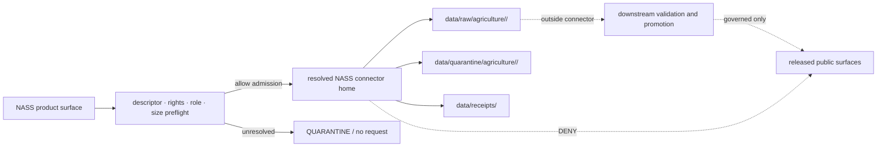

<!-- [KFM_META_BLOCK_V2]
doc_id: kfm://doc/connectors-nass-readme
title: connectors/nass/ — NASS Connector Coordination Lane
type: readme
version: v0.2
status: draft
owners: OWNER_TBD — Source steward · Connector steward · Agriculture steward · Data steward · Rights reviewer · Validation steward · Docs steward
created: 2026-06-19
updated: 2026-07-14
policy_label: "public; source-admission-only; placement-conflicted; no-live-activation; no-public-path"
current_path: connectors/nass/README.md
truth_posture: CONFIRMED requested README path, two sibling NASS connector README paths, placeholder source records, placeholder pipeline spec, docstring-only tests, fixture README surfaces, and Agriculture RAW compatibility/canonical documentation at the pinned base / PROPOSED interim coordination through connectors/nass pending placement decision / UNKNOWN exhaustive connector payload inventory, live endpoint behavior, credentials, activation, substantive tests, CI enforcement, receipts, runtime output, downstream promotion, and publication
evidence_snapshot:
  repository: bartytime4life/Kansas-Frontier-Matrix
  repository_id: "1059091169"
  visibility: public
  base_ref: main
  base_commit: f8937692702ac3b6a088bfd995d820e242012528
  prior_blob: f960ab02a625d07761d6f07d73351fc1b1eb1418
related:
  - ../README.md
  - ../usda-nass/README.md
  - ../usda/README.md
  - ../usda/nass/README.md
  - ../../docs/doctrine/directory-rules.md
  - ../../docs/sources/catalog/OPEN-QUESTIONS.md
  - ../../docs/sources/catalog/usda/README.md
  - ../../docs/sources/catalog/usda/usda-nass-quickstats.md
  - ../../docs/sources/catalog/usda/usda-nass-cdl.md
  - ../../docs/domains/agriculture/FILE_SYSTEM_PLAN.md
  - ../../docs/domains/agriculture/CANONICAL_PATHS.md
  - ../../docs/domains/agriculture/SOURCE_REGISTRY.md
  - ../../docs/domains/agriculture/VERIFICATION_BACKLOG.md
  - ../../data/registry/sources/agriculture/nass_quickstats.yaml
  - ../../data/registry/sources/agriculture/nass_crop_progress.yaml
  - ../../pipeline_specs/agriculture/nass_quickstats.yaml
  - ../../fixtures/domains/agriculture/no_network/nass/README.md
  - ../../fixtures/domains/agriculture/nass_quickstats/README.md
  - ../../tests/domains/agriculture/test_nass_aggregate_only.py
  - ../../tests/domains/agriculture/test_policy_denial_field_level_nass.py
  - ../../data/raw/agriculture/usda-nass/README.md
  - ../../data/raw/usda-nass/README.md
  - ../../data/quarantine/
  - ../../data/receipts/
  - ../../data/proofs/
  - ../../policy/rights/
  - ../../policy/sensitivity/
  - ../../release/
  - ../../.github/CODEOWNERS
tags: [kfm, connectors, nass, usda, agriculture, quickstats, crop-progress, cdl, source-admission, aggregate, source-role, raw, quarantine, placement-drift, no-secrets, no-public-path]
notes:
  - "v0.2 preserves the v0.1 source-admission, raw/quarantine-only, aggregate anti-collapse, no-secrets, no-publication, validation, and definition-of-done controls."
  - "Three repository-present README paths currently describe NASS connector placement: connectors/nass/, connectors/usda-nass/, and connectors/usda/nass/. No accepted placement decision was verified."
  - "Sibling connector documentation treats connectors/nass/ as the current coordination target while explicitly withholding canonical status; Agriculture planning documents propose other homes and record the conflict."
  - "The inspected NASS source records, pipeline spec, and tests are placeholders only. Their presence does not establish activation, executable behavior, validation, or release readiness."
  - "This revision changes only connectors/nass/README.md. It does not create connector code, credentials, source activation, data, fixtures, tests, policy, schemas, workflows, receipts, releases, or public artifacts."
[/KFM_META_BLOCK_V2] -->

<a id="top"></a>

# NASS Connector Coordination Lane

`connectors/nass/`

> Current documentation boundary for USDA National Agricultural Statistics Service intake coordination. Placement remains conflicted, and no live connector is established by this README.


**Quick jumps:** [Status](#status) · [Purpose](#purpose) · [Placement](#placement-reconciliation) · [Inventory](#current-inspected-inventory) · [Authority](#authority-boundary) · [Products](#product-and-source-role-boundaries) · [Inputs](#accepted-inputs) · [Outputs](#output-and-lifecycle-contract) · [Security](#credentials-rights-and-sensitive-join-rules) · [Validation](#validation) · [Rollback](#rollback) · [Evidence](#evidence-ledger)

> [!IMPORTANT]
> **Document status:** draft `v0.2`
> **Owning responsibility root:** `connectors/`
> **Observed maturity:** README-backed coordination plus placeholder source records, pipeline spec, and tests; no executable NASS connector was established by the bounded inspection
> **Placement:** `CONFLICTED` across three repository-present connector paths
> **Activation:** not established; placeholder `status: PROPOSED` records are not activation decisions
> **Default behavior:** inactive and fail closed

> [!CAUTION]
> Folder presence, a source-record filename, a pipeline-spec filename, or a test filename must not trigger source access, credential use, RAW admission, promotion, release, or public display. Each behavior requires substantive implementation and review evidence.

---

## Status

### Pinned repository snapshot

| Field | Value |
|---|---|
| Repository | `bartytime4life/Kansas-Frontier-Matrix` |
| Base ref | `main` |
| Base commit | `f8937692702ac3b6a088bfd995d820e242012528` |
| Prior target blob | `f960ab02a625d07761d6f07d73351fc1b1eb1418` |
| Target path | `connectors/nass/README.md` |
| Target state before this revision | v0.1 draft README |
| Change boundary | one README only |

### Safe current conclusion

`connectors/nass/` is a repository-present documentation lane that other connector READMEs currently use as an interim NASS coordination target. That is a repo-local convention, not an accepted canonical-placement decision. The inspected implementation-adjacent files are placeholders; live source access, parsing, output emission, validation, activation, and deployment remain unproven.

| Capability | Status | Evidence-bounded conclusion |
|---|---:|---|
| Requested README | `CONFIRMED` | `connectors/nass/README.md` exists. |
| NASS placement | `CONFLICTED` | Three connector README paths coexist; planning docs propose different homes. |
| Connector implementation | `NOT ESTABLISHED` | Bounded code search surfaced interface prose but no executable NASS connector. |
| QuickStats source record | `PLACEHOLDER / PROPOSED` | File exists but contains only status, path, source-doc pointer, and placeholder note. |
| Crop Progress source record | `PLACEHOLDER / PROPOSED` | Same bounded placeholder shape as QuickStats. |
| QuickStats pipeline spec | `PLACEHOLDER / PROPOSED` | File exists but contains no executable/declarative pipeline definition beyond placeholder metadata. |
| Aggregate-only tests | `PLACEHOLDER / NOT EXECUTABLE` | Two Python files contain docstrings only. |
| NASS fixtures | `README-BACKED / PAYLOADS UNVERIFIED` | Two fixture READMEs exist and each reports no confirmed payload inventory during its authoring pass. |
| CDL source record/spec | `NOT FOUND IN NAMED PROBES` | Common candidate paths were absent; differently named files remain possible. |
| API credentials | `UNKNOWN / FORBIDDEN IN REPO` | No live binding is authorized; real keys must stay outside the repository. |
| Endpoint behavior | `UNKNOWN` | Repository prose does not prove a current external API contract or successful request. |
| RAW output | `DOCUMENTED, NOT OBSERVED` | Canonical Agriculture RAW lane and compatibility pointer READMEs exist; no emitted payload was inspected. |
| Runtime, release, publication | `NOT ESTABLISHED / NOT AUTHORIZED HERE` | No public or promotion authority belongs to the connector. |

[Back to top](#top)

---

## Purpose

`connectors/nass/` coordinates documentation and, only after placement and activation are resolved, may host source-specific fetch and admission support for accepted USDA NASS products used by KFM.

Potential product surfaces include:

- QuickStats aggregate agricultural statistics;
- Crop Progress aggregate reporting;
- Cropland Data Layer raster/classification source events;
- another explicitly admitted NASS product with its own descriptor, role, rights, cadence, validation, and output contract.

This lane may describe how a verified connector should retrieve and package source material. It does not decide whether a source is active, what a product means, whether rights allow use, whether a claim is true, whether data passes policy, or whether an artifact may be released.

### Audience

- connector and source stewards;
- Agriculture domain maintainers;
- rights, sensitivity, validation, and data-lifecycle reviewers;
- pipeline and fixture owners evaluating a future NASS implementation;
- reviewers resolving the connector-path conflict.

[Back to top](#top)

---

## Placement reconciliation

Directory Rules §7.3 establishes `connectors/` as the responsibility root for source-specific fetch and admission. Its example connector tree does not settle the NASS child slug. Current repository documentation contains three candidates:

| Path | Repository state | What it currently says | Authority limit |
|---|---:|---|---|
| `connectors/nass/` | README present; v0.1 before this change | Fuller NASS intake boundary and requested path. | Not ratified as canonical. |
| `connectors/usda-nass/` | README present; v0.1 | Alias/sibling lane; tells implementation work to prefer `connectors/nass/` until governance chooses otherwise. | Cannot make `connectors/nass/` canonical by itself. |
| `connectors/usda/nass/` | README present; draft | Nested candidate under a draft USDA umbrella. | Explicitly says it does not supersede the other paths. |
| `connectors/usda/` | README present; draft | Coordination umbrella; points source-specific intake toward product/source lanes. | Not product implementation authority. |

Agriculture documents also disagree:

- `FILE_SYSTEM_PLAN.md` and `CANONICAL_PATHS.md` propose `connectors/usda-nass/` as an example source-keyed home.
- `FILE_SYSTEM_PLAN.md` records verification item `V-05` for `connectors/usda-nass/` vs `connectors/nass/` vs `connectors/usda/nass/`.
- `VERIFICATION_BACKLOG.md` names `connectors/usda/nass/` as one possible home and keeps the canonical home unresolved.
- the source-catalog `OPEN-DSC-14` question concerns whether a USDA connector-derived family is promoted; it does not choose among the three NASS paths.

### Interim rule

Until an accepted decision and migration plan exist:

1. treat `connectors/nass/` as the current **documentation coordination target**, because sibling connector documentation points here;
2. do not call any of the three paths canonical;
3. do not add duplicate implementation across the paths;
4. do not move or redirect files in a README-only change;
5. require an ADR or an explicitly governed migration note before consolidating, renaming, or retiring a path;
6. update all three child READMEs and affected Agriculture references together when the decision is made.

### Placement decision record required

A closure decision should state:

- chosen canonical connector path;
- status of the two non-chosen paths: redirect, tombstone, compatibility pointer, or removal;
- import and consumer migration plan;
- source-descriptor and pipeline-spec references;
- output-path mapping;
- rollback target;
- owner and review requirements;
- date after which new implementation at old paths is denied.

[Back to top](#top)

---

## Current inspected inventory

### Directly observed documentation and placeholders

```text
connectors/
├── nass/README.md
├── usda-nass/README.md
└── usda/
    ├── README.md
    └── nass/README.md

data/registry/sources/agriculture/
├── nass_quickstats.yaml          # PROPOSED placeholder
└── nass_crop_progress.yaml       # PROPOSED placeholder

pipeline_specs/agriculture/
└── nass_quickstats.yaml          # PROPOSED placeholder

tests/domains/agriculture/
├── test_nass_aggregate_only.py
└── test_policy_denial_field_level_nass.py

fixtures/domains/agriculture/
├── nass_quickstats/README.md
└── no_network/nass/README.md

data/raw/
├── agriculture/usda-nass/README.md
└── usda-nass/README.md            # compatibility pointer
```

### Placeholder details

| Path | Blob at pinned base | Inspected content | Safe interpretation |
|---|---|---|---|
| `data/registry/sources/agriculture/nass_quickstats.yaml` | `7e2d31a23f5a…` | `status: PROPOSED`, path, one source-doc pointer, placeholder note. | Not a complete SourceDescriptor and not an activation decision. |
| `data/registry/sources/agriculture/nass_crop_progress.yaml` | `5d611852b91f…` | Same minimal placeholder structure. | Not a complete SourceDescriptor and not an activation decision. |
| `pipeline_specs/agriculture/nass_quickstats.yaml` | `cbff8002dced…` | `status: PROPOSED`, path, source-doc pointer, placeholder note. | Not a runnable or sufficiently declarative pipeline spec. |
| `tests/domains/agriculture/test_nass_aggregate_only.py` | `97939b939122…` | Documentation-only module docstring. | Provides no assertion or enforceability proof. |
| `tests/domains/agriculture/test_policy_denial_field_level_nass.py` | `06e3abeabc57…` | Documentation-only module docstring. | Provides no assertion or enforceability proof. |
| `fixtures/domains/agriculture/no_network/nass/README.md` | `ec233cd32d20…` | Fixture boundary README; says payload inventory and no-network execution remain unverified. | Fixture intent only. |
| `fixtures/domains/agriculture/nass_quickstats/README.md` | `a9fb9ff71eae…` | Aggregate QuickStats fixture boundary; says direct payloads were not confirmed. | Fixture intent only. |

The named-path inventory is bounded. It is not a recursive tree receipt, and code search is not proof that differently named implementation files do not exist. Strong implementation claims therefore remain `NEEDS VERIFICATION`.

[Back to top](#top)

---

## Authority boundary

### This lane may support

- descriptor-gated request construction;
- bounded endpoint or package retrieval;
- response/package inventory and digest capture;
- source-native metadata preservation;
- parsing into a raw admission envelope without semantic promotion;
- explicit RAW or QUARANTINE handoff;
- connector run receipts stored in the owning receipt lane;
- no-network fixture references and validation guidance.

### This lane does not own

| Concern | Owning surface |
|---|---|
| USDA/NASS product doctrine | `docs/sources/catalog/usda/` |
| Agriculture meaning and source-role doctrine | `docs/domains/agriculture/` and accepted contracts |
| Source identity and activation | `data/registry/sources/` plus governed activation decision |
| Machine shape | accepted `schemas/` home |
| Object meaning | `contracts/` |
| Rights and sensitivity decisions | `policy/rights/`, `policy/sensitivity/`, and review records |
| Pipeline execution | `pipelines/` |
| Declarative pipeline configuration | `pipeline_specs/` |
| Test proof | `tests/` with substantive assertions |
| Fixture authority | none; fixtures are deterministic examples only |
| RAW and QUARANTINE lifecycle state | `data/raw/` and `data/quarantine/` |
| Receipts and proofs | `data/receipts/` and `data/proofs/` |
| Promotion, release, correction, rollback | `release/` and governed lifecycle tooling |
| Public API, UI, map, or AI response | governed released application surfaces only |

Connector output is source material plus admission evidence. It is not agricultural truth, field truth, parcel truth, proof closure, release approval, or a public claim.

[Back to top](#top)

---

## Product and source-role boundaries

NASS is an organization, not a single homogeneous product. Each product requires its own identity, source role, cadence, rights review, parser, validation, and receipt lineage.

| Product surface | Required role posture | Required preservation | Anti-collapse rule |
|---|---|---|---|
| QuickStats | `aggregate` candidate unless an accepted SourceDescriptor says otherwise | commodity, statistic, unit, geography/aggregation unit, period, query parameters, suppression flags, source revision/load time, retrieval time, digest | Never reinterpret a county/state/district cell as field, farm, operator, parcel, or individual observation. |
| Crop Progress | aggregate/reporting posture pending complete descriptor | commodity, condition/progress measure, geography, reporting period, revision, retrieval time, digest | Do not treat aggregate progress as a direct observation of a specific field. |
| Cropland Data Layer | classified/model-derived raster posture pending complete descriptor | product year, raster identity, classmap/version, spatial support, CRS, source metadata, digest | Do not collapse classified pixels into QuickStats cells or claim ground-observed crop truth. |
| Future NASS product | explicit role required before admission | product identity, rights, cadence, version, spatial/temporal support, retrieval lineage | No inheritance of another NASS product's role, parser, activation, or release posture. |

### QuickStats aggregate rules

- preserve matrix-cell semantics: commodity × measure × geography × time;
- preserve the aggregation unit and do not attach finer geometry as if observed;
- round-trip upstream suppression or disclosure-control markers;
- do not impute suppressed cells in the connector;
- record revisions as new source captures; do not silently overwrite prior values;
- require downstream aggregation/citation/evidence controls before any promoted use;
- deny or quarantine field-, farm-, operator-, parcel-, or private-yield joins.

### CDL separation rules

- pin product vintage and classmap/version where available;
- preserve source-native classes before downstream crosswalks;
- record raster/package inventory and digests;
- fail closed on unknown classmap changes or spatial-reference ambiguity;
- keep material-change watchers non-publishing;
- do not reuse QuickStats tabular assumptions for raster admission.

[Back to top](#top)

---

## Accepted inputs

| Accepted item | Minimum requirement |
|---|---|
| Source adapter | Explicit product and SourceDescriptor reference; no implicit activation. |
| QuickStats request builder | Bounded filters, redacted credential handling, deterministic parameter serialization, count/size preflight where supported and verified. |
| Crop Progress request/import helper | Explicit period and geography; revision and source-role preservation. |
| CDL package/source-event helper | Product vintage, classmap/version, file inventory, source reference, and digest posture. |
| Admission envelope builder | RAW/QUARANTINE handoff only; preserve source identity and review state. |
| Parser | Loss-aware; preserve source-native values and flags until downstream normalization. |
| Receipt helper | Emit run outcome, request/package identity, timestamps, digests, and failure/hold reason to the owning receipt lane. |
| Test reference | Point to substantive, deterministic, no-network tests and fixtures. |
| README or migration note | Keep placement, activation, implementation, and validation claims evidence-bounded. |

### Forbidden inputs and contents

- committed API keys, tokens, cookies, passwords, private endpoints, or signed URLs;
- operator-, farm-, parcel-, or person-identifying private data;
- live production bindings or workstation-specific paths;
- full source dumps presented as fixtures;
- policy decisions, SourceDescriptors, schemas, contracts, lifecycle records, release records, or public artifacts stored under the connector path;
- a second implementation copied into another NASS connector candidate path.

[Back to top](#top)

---

## Output and lifecycle contract

Directory Rules §7.3 limits connectors to admission outputs:

```text
external NASS product
  -> explicit descriptor and policy preflight
  -> connectors/<resolved-nass-home>/
  -> data/raw/agriculture/<source_id>/<run_id>/
     or data/quarantine/agriculture/<reason-or-source>/<run_id>/
  -> downstream governed pipeline stages
```

The repository documents `data/raw/agriculture/usda-nass/` as the canonical Agriculture source-family RAW lane and `data/raw/usda-nass/` as compatibility-only. A future implementation must choose concrete product/source IDs and run paths without writing new captures to the compatibility root.

### Required admission record

Preserve, where applicable:

- complete source/product identifier;
- referenced SourceDescriptor revision and activation decision;
- request endpoint family or package/distribution identity;
- request parameters with secrets removed;
- response status, content type, row/file count, and size;
- source time, product vintage, load/revision time, and retrieval time;
- aggregation unit or spatial support;
- source role and product-specific limitation notes;
- rights, attribution, and sensitivity review state;
- payload/package digest and source headers or manifest metadata;
- parse status and error/hold reason;
- destination RAW or QUARANTINE path;
- run receipt reference.

### Forbidden output routes

The connector must not write directly to:

- `data/work/`;
- `data/processed/`;
- `data/catalog/` or `data/triplets/`;
- `data/proofs/` as proof closure;
- `data/published/`;
- `release/` as a release decision;
- public API, UI, map, report, or AI response surfaces.



[Back to top](#top)

---

## Credentials, rights, and sensitive-join rules

### Credentials

- store real NASS credentials only in an approved external secret mechanism;
- document environment-variable names, never values;
- redact credentials from URLs, logs, receipts, errors, examples, and fixtures;
- do not make network requests during module import;
- fail before a request if required credentials are missing or malformed;
- rotate/revoke and follow the incident process if a real key enters Git history.

### Rights and attribution

The source-catalog pages label current rights/attribution posture `NEEDS VERIFICATION`. A federal source assumption is not a release decision. Before activation, record current terms, attribution language, redistribution limits, retention expectations, and review date in the governing source record and release process.

### Sensitive joins

NASS aggregates may be public upstream while becoming sensitive after downstream joins. The connector and its tests must fail closed when a request or transformation could expose:

- operator or farm identity;
- exact parcel or field inference;
- proprietary yield, pesticide, financial, or production records;
- suppressed or disclosure-controlled cells;
- a finer geometry than the source aggregation supports.

[Back to top](#top)

---

## External source interface notes

The v0.1 README described QuickStats `api_GET`, `get_counts`, and `get_param_values` surfaces and NASS CDL intake. Those names remain useful discovery notes, but this revision does not verify the current external endpoints, parameters, quotas, formats, terms, or availability.

Before implementation:

1. verify current official NASS interface documentation and terms;
2. record the verification date and authoritative URL in the source catalog/descriptor;
3. define timeout, retry, rate-limit, pagination/result-limit, and failure behavior;
4. add no-network fixtures for success, empty, malformed, unauthorized, throttled, and oversized responses;
5. ensure logs and receipts redact credentials;
6. require a manual/CI-offline validation path that does not depend on live NASS availability.

Do not treat examples in this README as a live API contract.

[Back to top](#top)

---

## Activation and consumer binding

Placeholder filenames do not activate a source. Activation requires all of the following:

- placement decision or explicitly accepted interim implementation home;
- complete SourceDescriptor with stable ID and revision;
- explicit activation decision and owner approval;
- verified rights, attribution, role, cadence, and sensitivity posture;
- substantive connector implementation with no import-time side effects;
- explicit pipeline/consumer binding;
- deterministic no-network fixtures;
- substantive tests for parsing, aggregate anti-collapse, credential redaction, output boundaries, errors, and quarantine;
- run receipt behavior;
- rollback and disable switch;
- CI or review evidence appropriate to the risk.

No recursive folder discovery, filename convention, or `status: PROPOSED` record may substitute for explicit binding.

### Safe default states

| Condition | Required result |
|---|---|
| Placement unresolved | `HOLD`; do not add duplicate implementation. |
| Source record is placeholder/incomplete | inactive; no request. |
| Rights or terms unresolved | `HOLD` or `DENY`; no downstream release. |
| Credential missing | explicit configuration error before network access. |
| Query too broad or result count excessive | narrow, hold, or use an approved bulk path; never silently truncate. |
| Response malformed or source role unclear | QUARANTINE with reason and receipt. |
| Suppression flag would be lost | `DENY` or QUARANTINE. |
| Output path outside RAW/QUARANTINE/receipt handoff | `DENY`. |
| Public consumer attempts direct access | `DENY`; require governed released artifacts. |

[Back to top](#top)

---

## Validation

### Required validation matrix

| Check | Current state | Evidence required to pass |
|---|---:|---|
| Placement decision | `OPEN / CONFLICTED` | Accepted ADR or migration note covering all three connector paths. |
| Complete QuickStats SourceDescriptor | `FAILS MATURITY GATE` | Schema-valid descriptor with identity, role, rights, cadence, endpoint/package, sensitivity, citation, and activation fields. |
| Complete Crop Progress SourceDescriptor | `FAILS MATURITY GATE` | Same product-specific evidence. |
| Complete CDL SourceDescriptor | `NOT FOUND IN NAMED PROBES` | Reviewed descriptor or explicit out-of-scope decision. |
| Executable connector | `NOT ESTABLISHED` | Current implementation inventory and reviewed code. |
| Pipeline binding | `PLACEHOLDER ONLY` | Complete spec plus explicit consumer/orchestrator reference. |
| Credentials and redaction | `UNKNOWN` | Secret-store binding, redaction tests, and failure tests. |
| Bounded query behavior | `UNKNOWN` | Offline tests for filters, count/size preflight, pagination/limits, retry, timeout, and rate limiting. |
| QuickStats aggregate-only rule | `DOCSTRING TEST ONLY` | Assertions that reject field/farm/operator/parcel reinterpretation and preserve suppression/aggregation metadata. |
| Output boundary | `UNKNOWN` | Tests proving only RAW, QUARANTINE, and receipt handoffs. |
| Fixtures | `README-BACKED ONLY` | Reviewed payload inventory and consuming tests. |
| No-network default tests | `NOT RUN / UNPROVEN` | Deterministic passing test receipt with network disabled. |
| Rights and attribution | `NEEDS VERIFICATION` | Dated source review and descriptor/release linkage. |
| Receipts | `UNKNOWN` | Success, empty, failure, denial, rate-limit, and quarantine receipt fixtures/tests. |
| CI enforcement | `UNKNOWN` | Workflow invoking substantive tests and validators. |
| Runtime/publication | `NOT AUTHORIZED HERE` | Must remain outside this lane and pass downstream gates. |

### Suggested local checks after implementation exists

The following are target checks, not currently verified commands:

```text
parse and schema-check complete SourceDescriptors
run NASS connector tests with outbound network disabled
assert no credential-shaped strings in fixtures, logs, or receipts
assert QuickStats aggregate and suppression fields round-trip
assert field/farm/operator/parcel reinterpretation is denied
assert connector writes only to explicit RAW/QUARANTINE/receipt destinations
assert malformed, empty, unauthorized, throttled, and oversized inputs fail safely
assert imports have no network or filesystem side effects
```

### Review dispositions

| Disposition | Meaning |
|---|---|
| `PASS` | Placement/binding is explicit and all relevant checks have inspectable evidence. This permits source admission only. |
| `HOLD` | A resolvable dependency such as placement, rights, descriptor completeness, fixture coverage, or owner review is missing. |
| `DENY` | Secret exposure, sensitive join, source-role collapse, forbidden output, duplicate implementation, or public bypass is present. |
| `ERROR` | Validator/tool failure prevents a trustworthy decision; fail closed. |

[Back to top](#top)

---

## Migration and correction posture

If governance selects another NASS home:

1. freeze new implementation in all three candidates;
2. inventory code, imports, tests, fixtures, source records, pipeline specs, workflows, output paths, and documentation references;
3. choose the canonical path through the accepted decision process;
4. move implementation once, preserving history;
5. convert non-canonical paths to reviewed redirects/tombstones or remove them as decided;
6. update source records, pipeline bindings, fixtures, tests, CODEOWNERS, and all three READMEs in one migration series;
7. validate no duplicate implementation or recursive discovery remains;
8. keep rollback instructions until all consumers are migrated;
9. record unresolved drift rather than claiming silent completion.

If unsafe behavior or claims are discovered:

- disable the binding;
- quarantine affected outputs;
- rotate exposed credentials;
- preserve investigation evidence without publishing sensitive values;
- correct source-role or suppression handling through new records, not silent overwrites;
- issue downstream correction/rollback records where prior use was consequential.

[Back to top](#top)

---

## Rollback

This README-only revision can be rolled back by restoring prior blob:

```text
f960ab02a625d07761d6f07d73351fc1b1eb1418
```

No runtime, source, data, or release rollback is required for this documentation change because it creates no executable behavior or lifecycle transition.

Rollback or correct the lane if the README is used to justify:

- canonical placement without a decision;
- live source activation from placeholder records;
- committed credentials;
- direct writes beyond RAW/QUARANTINE/receipts;
- aggregate-to-field or suppressed-cell overclaim;
- connector-owned promotion, release, publication, API, UI, map, or AI behavior.

[Back to top](#top)

---

## Verification backlog

| Item | Status | Closure evidence |
|---|---:|---|
| Resolve three-path connector placement | `OPEN / ADR-CLASS` | Accepted decision and migration plan. |
| Record path conflict in the central drift register | `OPEN` | Specific entry naming all three connector paths and Agriculture references. |
| Generate exhaustive `connectors/nass/` tree inventory | `NEEDS VERIFICATION` | Non-truncated tree receipt. |
| Confirm connector code absence/presence across all candidates | `NEEDS VERIFICATION` | Recursive inventory plus import/reference search. |
| Replace placeholder source records | `OPEN` | Complete validated descriptors and activation decisions. |
| Decide CDL descriptor/spec scope | `OPEN` | Reviewed file or explicit separation decision. |
| Replace placeholder pipeline spec | `OPEN` | Complete spec and orchestrator binding. |
| Replace docstring-only tests | `OPEN` | Substantive assertions and passing receipts. |
| Add/review fixture payloads | `OPEN` | Public-safe inventory with consuming tests. |
| Verify current official API/terms | `NEEDS VERIFICATION` | Dated authoritative source review. |
| Verify CODEOWNERS and accepted stewards | `OWNER_TBD` | Valid connector/source/agriculture ownership. |
| Verify CI, receipt, and rollback behavior | `UNKNOWN` | Workflow and test evidence. |

[Back to top](#top)

---

## Definition of done

- [ ] Canonical NASS connector placement is accepted and all three paths are reconciled.
- [ ] Owners are confirmed and `OWNER_TBD` is replaced.
- [ ] Complete recursive inventories cover connector, descriptor, pipeline, fixture, test, workflow, and output surfaces.
- [ ] Product-specific SourceDescriptors are complete, schema-valid, reviewed, and explicitly activated or denied.
- [ ] Current official endpoint/package, credential, terms, attribution, cadence, and limit posture is documented.
- [ ] Connector implementation is product-separated and has no import-time side effects.
- [ ] QuickStats/Crop Progress aggregate semantics and suppression flags are preserved.
- [ ] CDL classification/model and classmap/version semantics are preserved separately.
- [ ] All default tests are deterministic and no-network.
- [ ] Field-, farm-, operator-, parcel-, private-yield, and suppressed-cell misuse fails closed.
- [ ] Outputs are proven to enter only explicit RAW/QUARANTINE/receipt destinations.
- [ ] Success, empty, failure, denial, rate-limit, and quarantine receipts are tested.
- [ ] No connector code owns schemas, policy, source activation, catalog/triplet truth, proof closure, release, publication, API, UI, map, or AI behavior.
- [ ] CI evidence and rollback instructions are current.

[Back to top](#top)

---

## Evidence ledger

| Evidence | Blob / state at pinned base | Supports | Does not prove |
|---|---|---|---|
| `connectors/nass/README.md` | `f960ab02…`; v0.1 | Existing NASS intake boundary and safety controls. | Executable connector behavior. |
| `connectors/README.md` | `bdd50032…`; v0.3 | Connector root owns source admission and limits outputs to RAW/QUARANTINE/receipts. | NASS child placement. |
| `connectors/usda-nass/README.md` | `5ed99416…`; v0.1 | Alias lane points interim implementation toward `connectors/nass/`. | Accepted canonical status. |
| `connectors/usda/nass/README.md` | `c53c0308…`; draft | Nested candidate exists and recognizes the three-way conflict. | Accepted canonical status. |
| `connectors/usda/README.md` | `de709073…`; draft | USDA coordination boundary and product separation. | Product implementation authority. |
| Directory Rules | `2affb080…`; v1.4 | `connectors/` responsibility and RAW/QUARANTINE-only rule. | Exact NASS child slug. |
| Agriculture `FILE_SYSTEM_PLAN.md` | `a260334c…` | Proposes `usda-nass` and records V-05 three-way conflict. | Accepted placement or implementation. |
| Agriculture `VERIFICATION_BACKLOG.md` | `562cf123…`; v1.1 | NASS activation remains verification work; names candidate paths/tests. | Their completion. |
| QuickStats source catalog | `034c8ee4…`; v0.2 | Aggregate source-role and anti-collapse doctrine; activation/rights gaps. | Current external endpoint or connector behavior. |
| CDL source catalog | `9a0f5af5…`; v0.2 | Product separation, classified/model posture, watcher constraints. | Active descriptor, connector, or release. |
| QuickStats/Crop Progress source YAML | `status: PROPOSED` placeholders | Planned record paths. | Complete descriptors or activation. |
| QuickStats pipeline YAML | `status: PROPOSED` placeholder | Planned spec path. | Runnable pipeline. |
| Two NASS Python tests | docstrings only | Planned enforcement topics. | Any assertion or passing test. |
| Two fixture READMEs | README-backed, payloads unverified | Intended deterministic fixture boundaries. | Fixture payloads or test execution. |
| Agriculture RAW README | `1c6f863b…` | Canonical documented RAW source-family lane. | Emitted payloads. |
| RAW compatibility README | `f897d111…` | `data/raw/usda-nass/` is compatibility-only. | Completed migration. |
| CODEOWNERS | `6adabefc…` | No connector-specific ownership rule in the inspected file. | Team validity or branch protection. |

[Back to top](#top)

---

<details>
<summary><strong>No-loss preservation note</strong></summary>

The v0.1 README established the NASS source-admission purpose, Directory Rules uncertainty, RAW/QUARANTINE lifecycle limit, authority exclusions, QuickStats interface notes, CDL separation, aggregate-only governance, credential prohibition, source-role preservation, validation checklist, and definition of done.

v0.2 preserves those controls and adds:

- a commit- and blob-pinned repository snapshot;
- explicit reconciliation of all three NASS connector README paths;
- placeholder-level inspection of source records, pipeline spec, tests, and fixture docs;
- canonical-versus-compatibility RAW path clarification;
- stronger QuickStats/Crop Progress/CDL anti-collapse rules;
- explicit activation and consumer-binding gates;
- credential, rights, suppression, and sensitive-join rules;
- validation dispositions, migration, rollback, evidence ledger, and verification backlog;
- a documentation-only change boundary.

No prior authority limitation is intentionally weakened.

</details>

<details>
<summary><strong>Documentation-only change boundary</strong></summary>

This revision changes only `connectors/nass/README.md`. It does not create or modify:

- connector code or package metadata;
- live endpoint bindings or credentials;
- SourceDescriptors or activation decisions;
- pipeline specs or executable pipelines;
- fixtures, tests, validators, or workflows;
- RAW, QUARANTINE, receipt, proof, catalog, triplet, or published data;
- schemas, contracts, policy, release, correction, or rollback objects;
- public API, UI, map, report, or AI behavior;
- the status of either sibling NASS connector path.

</details>

## Status summary

At `main@f8937692702ac3b6a088bfd995d820e242012528`, `connectors/nass/` is the current README-backed NASS coordination target referenced by sibling connector docs, but canonical placement remains conflicted with `connectors/usda-nass/` and `connectors/usda/nass/`. The inspected source records, pipeline spec, and tests are placeholders; fixture payloads, connector code, activation, endpoint behavior, credentials, CI, receipts, runtime outputs, and downstream publication remain unverified or unestablished. Any future connector may admit product-separated NASS material only to explicit RAW/QUARANTINE/receipt handoffs and cannot create source truth, policy, proof, release, or public authority.

<p align="right"><a href="#top">Back to top</a></p>
