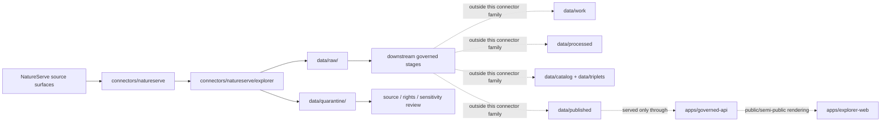

<!-- [KFM_META_BLOCK_V2]
doc_id: kfm://doc/connectors-natureserve-readme
title: connectors/natureserve/ — NatureServe Connector Family Lane
type: readme
version: v0.1
status: draft
owners: OWNER_TBD — Source steward · Connector steward · Flora steward · Fauna steward · Habitat steward · Data steward · Docs steward
created: 2026-06-19
updated: 2026-06-19
policy_label: restricted
related:
  - ../README.md
  - ./explorer/README.md
  - ../../docs/doctrine/directory-rules.md
  - ../../docs/domains/flora/SOURCE_REGISTRY.md
  - ../../docs/domains/flora/README.md
  - ../../docs/domains/fauna/README.md
  - ../../docs/architecture/ecology-cross-domain.md
  - ../../docs/standards/Darwin_Core.md
  - ../../data/registry/sources/
  - ../../data/raw/
  - ../../data/quarantine/
  - ../../data/receipts/
  - ../../data/proofs/
  - ../../policy/rights/
  - ../../policy/sensitivity/
  - ../../release/
tags: [kfm, connectors, natureserve, biodiversity, conservation-status, flora, fauna, habitat, source-admission, raw, quarantine, governance]
notes:
  - "Parent connector-family lane for NatureServe source intake and admission helpers."
  - "Nested service lanes, currently explorer/, hold service-specific connector documentation."
  - "Placement is draft: Directory Rules §7.3 does not list natureserve/ in the canonical connector spine; keep placement unresolved until ADR or migration note."
  - "Connector output may enter raw or quarantine admission lanes only."
  - "Rights, citation, data sensitivity, provider authority, and public-release posture fail closed until verified."
[/KFM_META_BLOCK_V2] -->

<a id="top"></a>

# NatureServe Connector Family

> Parent source-admission lane for NatureServe-related connector helpers used by KFM Flora, Fauna, Habitat, ecology cross-domain reasoning, and public-safe conservation-status context.

<p>
  
  
  
  
  
  
  
</p>

`connectors/natureserve/`

## Quick jumps

[Scope](#scope) · [Repo fit](#repo-fit) · [Nested connector lanes](#nested-connector-lanes) · [Lifecycle sketch](#lifecycle-sketch) · [Authority boundary](#authority-boundary) · [Inputs](#inputs) · [Exclusions](#exclusions) · [Admission posture](#admission-posture) · [Sensitivity posture](#sensitivity-posture) · [Placement status](#placement-status) · [Validation](#validation) · [Definition of done](#definition-of-done)

---

## Scope

`connectors/natureserve/` is the parent connector-family lane for NatureServe source intake and admission helpers.

This folder may contain connector-family documentation, shared helper notes, service-lane indexes, source-admission conventions, fixture pointers, and shared raw/quarantine routing guidance for NatureServe-derived source surfaces.

Service-specific connector documentation should live in nested lanes such as [`explorer/`](./explorer/README.md). The parent lane orients and constrains those children; it does not replace them.

This folder must not become biodiversity truth, conservation-status authority, flora truth, fauna truth, habitat truth, source-family authority, policy authority, schema authority, catalog/triplet authority, proof authority, release authority, pipeline authority, or publication authority.

> [!IMPORTANT]
> **Status:** draft / `NEEDS VERIFICATION`  
> **Owner:** `OWNER_TBD`  
> **Path:** `connectors/natureserve/`  
> **Truth posture:** the path exists in the repository as this README; source activation, endpoint behavior, credentials, tests, fixtures, CI wiring, rights status, data-sensitivity handling, child-lane inventory, and placement ratification remain `NEEDS VERIFICATION`.

---

## Repo fit

```text
connectors/
└── natureserve/
    ├── README.md
    └── explorer/
        └── README.md
```

Related responsibility roots:

```text
connectors/                          # source-specific fetch and admission code
docs/sources/catalog/natureserve/    # PROPOSED source-family documentation home; NEEDS VERIFICATION
docs/domains/flora/                  # flora domain context and rare-plant posture
docs/domains/fauna/                  # fauna domain context and sensitive-occurrence posture
docs/domains/habitat/                # habitat/community/ecology context where present
data/registry/sources/               # authoritative SourceDescriptors and activation state
data/raw/                            # raw staged outputs by owning domain
data/quarantine/                     # held material requiring source/rights/sensitivity review
data/receipts/                       # ingest, run, validation, and sensitivity receipts
data/proofs/                         # EvidenceBundles and proof packs
policy/rights/                       # rights, terms, and citation checks
policy/sensitivity/                  # rare taxa, sensitive location, and redaction rules
release/                             # release decisions, manifests, rollback, correction state
apps/governed-api/                   # downstream public trust membrane, not connector-owned
apps/explorer-web/                   # downstream map UI, never direct RAW/QUARANTINE access
```

---

## Nested connector lanes

| Lane | Purpose | Status | Boundary |
|---|---|---|---|
| [`explorer/`](./explorer/README.md) | NatureServe Explorer API/source-surface intake for taxa, searches, exports/jobs, domain values, data sensitivity, providers, and feature services. | `draft / NEEDS VERIFICATION` | Source-admission only; raw/quarantine output only. |

Future nested lanes may be added only when they represent a distinct NatureServe source surface or service family and when their placement is documented. Do not create sibling service lanes as a shortcut for domain ownership; NatureServe remains a source connector family, not a Flora/Fauna/Habitat domain home.

---

## Lifecycle sketch



> [!CAUTION]
> Connector family code and child connectors admit source material. They do not normalize, catalog, publish, answer public claims, decide conservation truth, or decide release safety. Promotion remains a governed state transition, not a file move.

---

## Authority boundary

```text
OUTPUT LIMIT:
  data/raw/<domain>/<source_id>/<run_id>/
  data/quarantine/<domain>/<source_id>/<run_id>/

NOT HERE:
  source-family truth
  NatureServe rank methodology authority
  flora, fauna, or habitat doctrine
  SourceDescriptor authority
  rights or sensitivity policy
  public-safe geometry decisions
  processed data
  catalog records
  triplet records
  receipts/proofs as authority
  release decisions
  published artifacts
  schemas/contracts
  generated reports
  public API behavior
  public UI behavior
```

---

## Inputs

| Accepted item | Required posture |
|---|---|
| Connector-family README and index | Orient child connector lanes without claiming source activation, rights, or release state. |
| Shared helper notes | Explain shared request, retry, parsing, fixture, or routing conventions without becoming executable policy. |
| Child-lane pointer | Link to service-specific connector README files such as `explorer/README.md`. |
| Source adapter | Preserve source identity, service family, request context, retrieval time, response status, and review posture. |
| Data-sensitivity routing helper | Preserve sensitive flags and route unclear records to quarantine/policy review. |
| Credential/configuration notes | Document environment-variable expectations only; never commit keys, tokens, or secrets. |
| Test references | Point to owning fixture/test roots; fixtures do not become source authority. |

---

## Exclusions

| Do not store here | Correct home |
|---|---|
| NatureServe source-family documentation | `docs/sources/catalog/natureserve/` once ratified; otherwise source-catalog open question register |
| Authoritative `SourceDescriptor` records | `data/registry/sources/` |
| Flora, Fauna, Habitat, or ecology doctrine | `docs/domains/flora/`, `docs/domains/fauna/`, `docs/domains/habitat/`, `docs/architecture/ecology-cross-domain.md` |
| Rights, terms, sensitivity, redaction, or release policy | `policy/rights/`, `policy/sensitivity/`, `policy/` |
| Processed taxon/status/occurrence/community records | `data/processed/` |
| Catalog or triplet records | `data/catalog/`, `data/triplets/` |
| Receipts and proof packs as authority | `data/receipts/`, `data/proofs/` |
| Release decisions or rollback/correction records | `release/` |
| Published artifacts or public layers | `data/published/` after governed release |
| Schemas or semantic contracts | `schemas/`, `contracts/` |
| Generated reports | `artifacts/` |
| Public UI or API behavior | `apps/governed-api/`, `apps/explorer-web/` |

---

## Admission posture

NatureServe-family intake should preserve:

- source identity and source surface;
- nested connector lane or service family;
- request criteria, paging, filters, and identifiers;
- retrieval timestamp;
- response status, parse status, and content digest;
- source role and limitation notes;
- record type and domain-lane routing hint;
- conservation-status/rank fields as source fields, not downstream truth;
- data-sensitive flags, provider fields, citation fields, and limitation fields;
- public-safe geometry limitation notes;
- quarantine reason when review is required.

NatureServe-derived source material may inform Flora, Fauna, Habitat, ecology cross-domain reasoning, public-safe status displays, and Focus Mode summaries. Connector output remains admission material. Confirmation, transformation, redaction/generalization, EvidenceBundle production, catalog closure, public claims, publication, correction, and rollback belong to governed downstream stages.

---

## Sensitivity posture

NatureServe source surfaces can carry policy-significant fields for rare taxa, sensitive locations, proprietary data, conservation ranks, jurisdiction-specific status, and source-provider attribution. KFM must treat this as fail-closed source material.

| Rule | Connector-family implication |
|---|---|
| Preserve data-sensitive fields. | Child connectors must not drop sensitive flags, categories, provider fields, or limitation notes. |
| Treat exact or feature-service geometry as restricted until released. | Direct source geometry is not public-ready just because it is retrievable. |
| Preserve provider authority. | Provider and citation lineage must remain inspectable for downstream review. |
| Separate rank/status from occurrence proof. | A rank, status, or jurisdiction list is not an occurrence observation unless a downstream source role and EvidenceBundle support that claim. |
| Fail closed on sensitive taxa and rare-location inference. | Route unclear, sensitive, or precise-location material to quarantine or downstream policy review. |
| Keep AI downstream and evidence-subordinate. | Connector output is not a Focus Mode answer and cannot be cited directly by public AI surfaces. |

---

## Placement status

`connectors/natureserve/README.md` is intentionally conservative because NatureServe placement is not yet fully ratified by Directory Rules.

| Claim | Status | Notes |
|---|---|---|
| `connectors/natureserve/README.md` contains this parent connector README | `CONFIRMED` after this update | The file itself now carries the parent connector-family boundary. |
| `connectors/natureserve/explorer/README.md` exists as a nested service-lane README | `CONFIRMED` from the prior update | Service-specific Explorer details live there. |
| `connectors/natureserve/` is a source-admission family lane only | `PROPOSED / draft` | Consistent with `connectors/` responsibility, but not yet listed in the canonical §7.3 connector spine. |
| NatureServe source-catalog docs exist under `docs/sources/catalog/natureserve/` | `UNKNOWN` | No source-catalog NatureServe file was verified during this parent update. |
| NatureServe connector placement is ADR-ratified | `NEEDS VERIFICATION` | Directory Rules §7.3 should be updated or an ADR/migration note should justify this lane. |
| Live NatureServe `SourceDescriptor` records exist and are active | `NEEDS VERIFICATION` | Must be checked under `data/registry/sources/`. |
| Endpoint behavior, tests, fixtures, and CI are implemented | `UNKNOWN` | Not proven by this README. |
| NatureServe outputs are validated, cataloged, redacted, generalized, and published | `UNKNOWN` | Connector-family README does not prove downstream promotion. |

---

## Validation

Before relying on this connector family, verify:

- placement is intentional and documented by ADR, migration note, or updated Directory Rules;
- child connector lanes are inventoried and each has a README;
- source descriptors exist and are active for each NatureServe source surface;
- terms of use, required citation/attribution, provider authority, and data sensitivity are captured in source descriptors and release review;
- endpoint behavior, request/response shapes, paging, export/job behavior, and error cases are fixture-tested in child lanes;
- tests use no-network fixtures where practical;
- output paths are limited to raw/quarantine admission lanes;
- source-role, rank/status, provider, citation, and sensitivity metadata survive parsing;
- exact-location, sensitive taxa, proprietary-data, and rare-species inference paths fail closed;
- downstream receipts, proofs, catalog/triplet records, redaction/generalization records, and release records are produced only outside this connector family;
- public products are released only through governed publication controls.

---

## Definition of done

- [ ] Owners are confirmed and `OWNER_TBD` is replaced.
- [ ] Directory placement is ratified or the conflict is recorded in the drift/open-question register.
- [ ] Actual connector-family and child-lane contents are inventoried.
- [ ] NatureServe `SourceDescriptor` IDs and source-family activation are verified.
- [ ] Terms of Use, citation/attribution, provider authority, and sensitivity posture are documented.
- [ ] Every child connector lane has a README with source surface, accepted inputs, exclusions, authority boundary, validation, and rollback notes.
- [ ] Data-sensitive flags, provider fields, feature-service references, ranks, and jurisdiction fields survive parsing in child lanes.
- [ ] Outputs are verified to enter only raw or quarantine admission lanes.
- [ ] No source-family, domain, processed, catalog, triplet, published, release, schema, policy, proof, receipt, registry, fixture, report, API, or UI authority lives here.
- [ ] Tests, fixtures, and CI behavior are verified or marked `NEEDS VERIFICATION`.

---

## Status summary

`connectors/natureserve/` is a parent connector-family lane for NatureServe source-admission work only. It is not source-family truth, conservation-status authority, flora truth, fauna truth, habitat truth, policy authority, schema authority, catalog/triplet authority, proof closure, release authority, publication authority, public API behavior, public UI behavior, or pipeline authority.

<p align="right"><a href="#top">Back to top</a></p>
