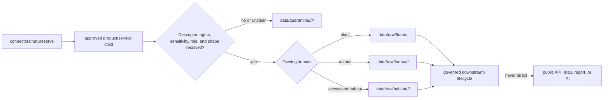

<!-- [KFM_META_BLOCK_V2]
doc_id: kfm://connectors/natureserve/readme
title: NatureServe Connector Family Lane
path: connectors/natureserve/README.md
type: connector-family-readme
version: v0.2
prior_version: v0.1
prior_blob: 1a0b108e8ff7ad0f4bad2e9f8063281910de821b
base_commit: 1c776e17922b5c19ed2337b559d18d8c947e7c63
status: draft
owners: OWNER_TBD — source steward · connector steward · flora steward · fauna steward · habitat steward · data steward · rights steward · sensitivity steward
created: 2026-06-19
updated: 2026-07-14
policy_label: restricted-review
truth_posture: cite-or-abstain
responsibility_root: connectors/
lifecycle_phase: source-admission
source_family: natureserve
related:
  - ../README.md
  - ./explorer/README.md
  - ../../docs/sources/catalog/natureserve/README.md
  - ../../docs/architecture/source-roles.md
  - ../../docs/architecture/ecology-cross-domain.md
  - ../../docs/doctrine/directory-rules.md
  - ../../data/registry/sources/README.md
  - ../../data/registry/sources/habitat/natureserve.yaml
  - ../../data/raw/fauna/natureserve/README.md
  - ../../data/raw/habitat/natureserve/README.md
  - ../../policy/rights/flora/natureserve_explorer_pro.md
tags:
  - kfm
  - connectors
  - natureserve
  - biodiversity
  - conservation-status
  - flora
  - fauna
  - habitat
  - source-admission
  - raw
  - quarantine
  - sensitivity
  - rights-review
notes:
  - "This parent lane indexes and constrains NatureServe service connectors; service-specific behavior belongs in child lanes."
  - "The parent and Explorer child paths are repository-confirmed, while the exact nested family convention remains draft because Directory Rules does not ratify this path shape."
  - "The NatureServe source catalog, Fauna RAW README, Habitat RAW README, and a proposed Habitat descriptor placeholder are present. They do not prove activation or payloads."
  - "The Explorer Pro rights file is only a PROPOSED scaffold and is not rights clearance."
  - "Connector-family output is limited to governed RAW or QUARANTINE admission destinations; no connector family or child may publish."
[/KFM_META_BLOCK_V2] -->

<a id="top"></a>

# NatureServe connector family

Parent source-admission lane for NatureServe products and service surfaces used by KFM Flora, Fauna, Habitat, and governed cross-domain workflows.

<p>
  
  
  
  
  
  
  
</p>

> [!CAUTION]
> This directory indexes and constrains connector children. It is not NatureServe doctrine, biodiversity truth, conservation-status authority, Flora/Fauna/Habitat truth, occurrence proof, KFM policy, a SourceDescriptor registry, schema authority, catalog/triplet authority, proof or receipt authority, release authority, a public API, a public map source, or generated-answer evidence.

---

## Quick contract

| Question | Family answer |
|---|---|
| What belongs here? | Family-level documentation and narrowly shared NatureServe connector helpers that do not hide product, service, rights, role, or sensitivity differences. |
| Where does service-specific behavior live? | In a documented child lane such as [`explorer/`](./explorer/README.md). |
| What may a child write? | `data/raw/<domain>/<source_id>/<run_id>/` or `data/quarantine/<domain>/<source_id>/<run_id>/` only. |
| What may this family publish? | Nothing. |
| Is NatureServe active as a family? | **NEEDS VERIFICATION**. Family documentation is not an activation decision. |
| Does one license or role cover every NatureServe product? | **No.** Rights, access, provider rules, sensitivity, source role, and release class are product-specific. |
| Is rank/status occurrence proof? | **No.** Assessment/status context and occurrence evidence are separate claim types. |
| Can public UI or AI use connector output directly? | **No.** Public surfaces consume governed released artifacts only. |

---

## Scope and responsibility boundary

`connectors/natureserve/` is the parent connector-family lane. It provides the index and shared guardrails that every NatureServe child must follow.

Allowed parent responsibilities include:

- index each verified service/product child and name its owner and status;
- define the common admission envelope and RAW/QUARANTINE-only output boundary;
- document family-wide identity, provider-lineage, rights, source-role, sensitivity, secret-handling, and cross-domain invariants;
- point to source-family doctrine, authoritative registry/policy roots, tests, fixtures, receipts, and release systems without taking over their authority;
- host shared helper code only when behavior is genuinely common and the child/product identity remains explicit.

This parent and its children must not:

- decide that a taxon or ecosystem is present or absent at a place;
- convert conservation rank or legal/administrative status into occurrence evidence;
- grant rights, provider permission, public precision, or release eligibility;
- flatten distinct products, access tiers, providers, or source roles into one family default;
- overwrite prior RAW runs or mutate a SourceDescriptor, policy decision, proof, receipt, or release record in place;
- write processed, catalog, triplet, published, proof, release, policy, schema, contract, app, or report authority;
- expose a source response, export, job artifact, feature service, or precise geometry directly to public UI, API, map, search, vector index, report, or generated answer.

---

## Repository map

```text
connectors/
└── natureserve/
    ├── README.md                 # this family index and boundary
    └── explorer/
        └── README.md             # verified child documentation; implementation unverified
```

Related responsibility roots:

```text
docs/sources/catalog/natureserve/       source-family governance profile
docs/domains/{flora,fauna,habitat}/     owning domain doctrine
docs/architecture/source-roles.md       canonical source-role vocabulary
data/registry/sources/                  SourceDescriptor authority
data/raw/<domain>/                      immutable admitted source captures
data/quarantine/<domain>/               unresolved or denied admission material
data/receipts/                          receipt authority
data/proofs/                            proof/EvidenceBundle authority
policy/rights/                          rights and allowed-use decisions
policy/sensitivity/                     sensitivity and redaction decisions
release/                                release, correction, and rollback decisions
data/published/                         released artifacts only
apps/governed-api/                      governed public trust boundary
apps/explorer-web/                      public map UI; never direct RAW/QUARANTINE access
```

---

## Verified family state

The table records observations at base commit `1c776e17922b5c19ed2337b559d18d8c947e7c63`. Targeted repository search is evidence of what surfaced during this update, not exhaustive proof of absence.

| Surface | Observed state | Family consequence |
|---|---|---|
| [`connectors/README.md`](../README.md) | Connector root is for source admission and stops at RAW or QUARANTINE. | No family or child may publish or promote. |
| This README | Existing v0.1 parent at prior blob `1a0b108e8ff7ad0f4bad2e9f8063281910de821b`. | v0.2 replaces stale evidence claims while preserving the boundary. |
| [`explorer/README.md`](./explorer/README.md) | v0.2 child README is merged and documents the Explorer source surface. | Explorer-specific interface, terms, routing, and validation detail belongs there. |
| Other connector children | No other `connectors/natureserve/<child>/` README surfaced. | `explorer/` is the only verified child; do not invent siblings from planning prose. |
| [`docs/sources/catalog/natureserve/README.md`](../../docs/sources/catalog/natureserve/README.md) | NatureServe source profile exists and is draft/restricted-by-default pending rights review. | The v0.1 “unknown” claim is retired; the profile still does not activate a connector. |
| [`policy/rights/flora/natureserve_explorer_pro.md`](../../policy/rights/flora/natureserve_explorer_pro.md) | File exists as a short `PROPOSED scaffold`. | It is not permission, license review, or release clearance. |
| [`data/registry/sources/habitat/natureserve.yaml`](../../data/registry/sources/habitat/natureserve.yaml) | Proposed inventory-derived placeholder. | It is not a complete or active SourceDescriptor. |
| Expected Flora/Fauna descriptors | No `data/registry/sources/{flora,fauna}/natureserve.yaml` surfaced. | Do not infer activation for those domains. |
| [`data/raw/fauna/natureserve/README.md`](../../data/raw/fauna/natureserve/README.md) | Documented restricted-review RAW boundary; payload presence remains unknown. | Boundary evidence only, not data or readiness proof. |
| [`data/raw/habitat/natureserve/README.md`](../../data/raw/habitat/natureserve/README.md) | Documented restricted-review RAW boundary; payload presence remains unknown. | Boundary evidence only, not data or readiness proof. |
| Expected Flora RAW README | No `data/raw/flora/natureserve/README.md` surfaced. | Quarantine Flora material until a governed destination is confirmed. |
| Family/child implementation, dedicated tests, and fixtures | None surfaced under targeted NatureServe connector/test/fixture searches. | Implementation and enforcement remain **NEEDS VERIFICATION**. |
| `.github/CODEOWNERS` | No NatureServe-specific ownership rule surfaced. | Owners remain `OWNER_TBD`. |

> [!IMPORTANT]
> A family README, child README, source profile, placeholder descriptor, or RAW-lane README documents intent and boundaries. It does not prove activation, payload existence, provider permission, rights clearance, sensitivity enforcement, validation, downstream promotion, or release.

---

## Child-lane registry

| Child | Source surface | Status | Owned detail | Output boundary |
|---|---|---|---|---|
| [`explorer/`](./explorer/README.md) | NatureServe Explorer | `draft`; documentation confirmed; implementation/activation unverified | Taxon/search/export-job/domain-value/sensitivity/provider/feature-service interface notes, admission fields, routing, rights, validation, and rollback | RAW or QUARANTINE only |

Future children require all of the following:

1. A genuinely distinct NatureServe product or access surface, not merely another KFM domain.
2. A child README defining source identity, accepted inputs, exclusions, upstream interface, rights/access tier, source role, sensitivity, routing, outputs, fixtures/tests, activation, and rollback.
3. A complete SourceDescriptor and explicit SourceActivationDecision for the exact product/surface.
4. Product-specific rights, provider-permission, attribution, retention/deletion, precision, and release review.
5. No-network valid/invalid/sensitive/error fixtures and output-boundary tests.
6. Placement review if the new child deepens or changes the unratified nested convention.

Do not create domain-named children such as `flora/`, `fauna/`, or `habitat/` merely to route records. Domains own downstream lifecycle lanes; connector children represent upstream products or service surfaces.

---

## Placement posture

The `connectors/` root is canonical for source-specific fetchers and admitters. Directory Rules §7.3 limits connector output to RAW or QUARANTINE and forbids publication, but its example connector tree does not ratify `connectors/natureserve/` or this nested family/product convention.

Treat placement as:

- **CONFIRMED repository path** — parent and Explorer child READMEs exist;
- **CONFIRMED responsibility fit** — NatureServe connector work belongs under `connectors/`;
- **PROPOSED nested convention** — no accepted placement ADR or Directory Rules entry was verified;
- **non-authoritative** — this README cannot settle the canonical connector taxonomy.

Do not create parallel `connectors/natureserve_explorer/`, `connectors/explorer/`, or domain-owned NatureServe connectors to avoid the open placement question. Relocation requires an ADR or migration note, owner review, link updates, rollback instructions, and protection against parallel writable homes.

---

## Common admission envelope

Every NatureServe child must preserve or contribute to an inspectable admission record with these field groups:

| Field group | Minimum family requirement |
|---|---|
| Source identity | Stable KFM `source_id`, NatureServe product/surface, provider identity, access tier, SourceDescriptor reference, and supersession state. |
| Request identity | Child/service family, method/path or artifact request, parameters/body digest, filters, identifiers, page/job identity, and retry lineage. |
| Time and version | Retrieval time, source time/vintage when supplied, upstream interface/product version, connector version, and clock/timezone basis. |
| Response identity | Status/job state, media type, record count when meaningful, parse state, immutable content digest, and payload/reference location. |
| Semantics | Original record type, upstream identifiers, taxon/ecosystem concept, rank/status jurisdiction and date, and code-list/crosswalk version. |
| Source role | Canonical enum value, product/claim rationale, conditional role fields, and immutable descriptor reference. |
| Rights and citation | Terms/product reference, intended-use class, rights decision, access restrictions, provider permissions, attribution/citation, reviewer, and re-review trigger. |
| Sensitivity | Upstream flags/categories, jurisdiction, precision/geometry class, provider restriction, inference risk, and quarantine/redaction requirement. |
| Routing | Owning domain, RAW/QUARANTINE destination, run ID, decision reason, and split-package lineage. |
| Failure | Error class, retryability, partial-result state, quarantine reason, and steward disposition. |

Credentials, tokens, cookies, signed URLs, precise sensitive coordinates, or protected license documents must not appear in family/child READMEs, logs, fixtures, PR bodies, or public receipts.

---

## Product and source-role separation

NatureServe is a source family, not a single product or source role. Each admitted product must use the canonical vocabulary from [`docs/architecture/source-roles.md`](../../docs/architecture/source-roles.md):

`observed | regulatory | modeled | aggregate | administrative | candidate | synthetic`

Descriptive phrases found in adjacent drafts—such as `authority`, `context`, `authority-context`, or `administrative-aggregate-context`—are not canonical enum values. Do not emit them as `source_role` unless an accepted schema/ADR changes the vocabulary.

Family rules:

- assign role per product and intended claim, never once for the whole NatureServe family;
- preserve the upstream provider/authority separately from `source_role`;
- do not call a conservation assessment `regulatory` merely because it is influential or authoritative;
- do not call a location/occurrence-like record `observed` without first-hand place/time evidence and a compatible descriptor;
- preserve aggregation unit/method for `aggregate` material and model identity/run evidence for `modeled` material;
- route unresolved output as `candidate`/QUARANTINE when the authoritative schema and policy permit;
- correct role through a new descriptor and lineage record, never in-place mutation.

Rank, listing, sensitivity flag, legal designation, modeled range, generalized map, and occurrence record are distinct product/claim shapes. A child must preserve those distinctions through admission.

---

## Rights and access separation

Rights are product-, surface-, provider-, jurisdiction-, access-tier-, and use-specific. The family must not inherit one blanket decision from a public website, a licensed delivery, a Pro surface, a source profile, or a policy filename.

Before activation, record for each product/surface:

- current terms/license and review date;
- exact product, provider, access surface, and access tier;
- permitted internal, derivative, public, commercial, and redistribution uses;
- required citation/attribution and provider notices;
- precision/generalization limits and protected-data conditions;
- retention, deletion, expiration, renewal, revocation, and credential duties;
- intended use and downstream audience;
- rights reviewer, decision, evidence reference, and re-review trigger.

The source profile's restricted-by-default posture is the KFM admission default until the product-specific review closes. A source-catalog row or rights scaffold is not an allow decision.

---

## Sensitivity and public-safety boundary

NatureServe products can carry rare-taxon, provider-restricted, precise-location, property, collection-threat, or jurisdiction-specific sensitivity. Preserve upstream signals and fail closed when any part is unclear.

Required family invariants:

- never drop or default a child-provided sensitivity flag, category, provider restriction, precision, or limitation field;
- never infer “not sensitive” from missing metadata, empty results, endpoint failure, unsupported jurisdiction, or stale cache;
- keep exact or reversibly precise locations out of public fixtures, logs, PRs, search indexes, vector indexes, maps, and generated answers;
- treat individual-taxon feature-service URLs and derived coordinates as restricted until explicit provider and release review;
- evaluate mosaic/inference risk across domains and products, not one record in isolation;
- create redaction, generalization, suppression, aggregation, and release receipts only in their owning downstream systems;
- deny direct family/child/RAW/QUARANTINE access from public applications.

> [!WARNING]
> Rank, sensitivity category, or a map response does not prove presence at a location. Missing NatureServe material does not prove absence. Public claims require claim-appropriate downstream evidence and release closure.

---

## Cross-domain routing

Route by admitted product and claim, not by the connector family name or by convenient taxon-name matching.



Routing rules:

1. Preserve a stable upstream identity and digest across all domain routes.
2. Record each split and parent-package lineage; never silently duplicate one source record into multiple domains.
3. Mixed, unresolved, or unsupported-domain packages go to QUARANTINE.
4. If an owning RAW boundary is absent or unverified, quarantine rather than improvising a path.
5. Domain interpretation, normalization, crosswalks, joins, proof, and release occur downstream, not in this family.

---

## Lifecycle and authority boundary

```text
SourceDescriptor + activation + product-specific rights/sensitivity review
  -> approved NatureServe child connector
  -> immutable RAW capture or QUARANTINE hold
  -> WORK / normalization
  -> PROCESSED validation
  -> CATALOG / TRIPLET / proof closure
  -> release decision, redaction/generalization, and manifest
  -> PUBLISHED artifact
  -> governed API / public UI / report / generated answer
```

Connector-permitted destinations:

```text
data/raw/<domain>/<source_id>/<run_id>/
data/quarantine/<domain>/<source_id>/<run_id>/
```

Forbidden direct destinations include:

```text
data/work/
data/processed/
data/catalog/
data/triplets/
data/published/
data/proofs/
data/receipts/ as self-issued authority
release/
policy/
schemas/
contracts/
apps/
artifacts/
```

Promotion is a governed state transition, not a file move. The family may reference downstream decisions and receipts after they exist; it cannot issue them or declare their gates closed.

---

## Family activation gates

Keep a child inactive until all applicable items are evidenced:

- [ ] Parent/child placement and owners are accepted or explicitly approved as draft implementation placement.
- [ ] The child README identifies a distinct product/surface and defines its complete admission/output boundary.
- [ ] A complete, current SourceDescriptor exists for each product/access tier and domain route.
- [ ] Source role uses the canonical enum and matches the admitted product and intended claim.
- [ ] A SourceActivationDecision authorizes the exact child/product scope.
- [ ] Product-specific rights, provider permissions, attribution, retention/deletion, expiration, and intended-use conditions are reviewed.
- [ ] Sensitivity, precision, location-inference, and public-release limits are mapped to KFM policy.
- [ ] Upstream identity, paging/job/version/error behavior, and request/response shape are fixture-tested.
- [ ] No-network valid, invalid, sensitive, partial, empty, rate-limited, stale, and changed-interface fixtures exist.
- [ ] Tests prove RAW/QUARANTINE-only writes, immutable run IDs, hash binding, domain routing, quarantine behavior, and secret scrubbing.
- [ ] Public applications have no dependency on family, child, RAW, or QUARANTINE paths.
- [ ] Rollback can disable the child without deleting descriptor, RAW, quarantine, receipt, proof, correction, or release history.

---

## Validation matrix

| Family risk | Minimum evidence | Failure posture |
|---|---|---|
| Child inventory drift | Parent registry compared with actual child READMEs and ownership. | Hold unregistered child activation. |
| Product collapse | Product/access-tier identity and separate descriptors/rights decisions. | Reject family-wide default. |
| Source-role collapse | Canonical enum validation and product-specific role fixtures. | Reject or quarantine invalid role. |
| Rights mismatch | Allowed/denied intended-use matrix per product and provider. | Deny or hold for rights review. |
| Sensitivity loss | Sensitive, conditional, missing, unknown, precise, and mosaic-risk fixtures. | Fail closed and quarantine. |
| Cross-domain leakage | Plant/animal/ecosystem/mixed-package routing fixtures. | Quarantine unresolved route. |
| Identity drift | Stable upstream ID, provider, digest, and split/supersession lineage checks. | Quarantine unresolved identity. |
| Secret leakage | Header, token, cookie, signed-URL, error-payload, and fixture scans. | Abort write and rotate exposure as required. |
| Output escape | Filesystem tests restricting writes to resolved RAW/QUARANTINE run paths. | Reject and alert; never use a fallback lifecycle root. |
| Public shortcut | Dependency/integration check forbidding public reads from connector/RAW/QUARANTINE. | Block release. |

No implementation, dedicated fixture suite, or dedicated test suite was verified during this README update. This matrix defines activation evidence; it does not claim passing coverage.

---

## Evidence and change ledger

| Claim | Status | Evidence / limit |
|---|---|---|
| This parent path and README exist. | **CONFIRMED** | Prior blob `1a0b108e8ff7ad0f4bad2e9f8063281910de821b`. |
| Explorer is a documented child lane. | **CONFIRMED** | `connectors/natureserve/explorer/README.md` v0.2 is merged. |
| Another connector child exists. | **UNKNOWN** | None surfaced in targeted repository search; absence is not exhaustively proven. |
| NatureServe source-catalog documentation exists. | **CONFIRMED** | `docs/sources/catalog/natureserve/README.md`; draft/restricted-by-default pending review. |
| The Explorer Pro rights file clears use. | **DENY** | It is only a `PROPOSED scaffold`. |
| Fauna and Habitat NatureServe RAW boundaries exist. | **CONFIRMED** | Their READMEs exist; payloads and activation remain unknown. |
| A complete active NatureServe SourceDescriptor exists. | **NEEDS VERIFICATION** | Only a proposed Habitat placeholder surfaced at the checked path. |
| Family/child implementation, fixtures, tests, and pipeline wiring are complete. | **UNKNOWN** | None surfaced in targeted search; no runtime claim is made. |
| One source role or rights decision safely applies to every NatureServe product. | **DENY** | Role and rights are product/claim/use-specific. |
| Rank/status is occurrence proof. | **DENY** | Claim-type and source-role boundaries prohibit the collapse. |
| Connector-family output is public-ready. | **DENY** | Directory Rules restrict connector output to RAW/QUARANTINE and forbid publication. |

### What changed from v0.1

- corrected the stale “NatureServe source catalog unknown” claim;
- synchronized the parent with the merged Explorer v0.2 child boundary;
- recorded confirmed Fauna/Habitat RAW READMEs and the proposed Habitat descriptor placeholder without treating them as readiness evidence;
- distinguished product/service child identity from downstream domain routing;
- aligned family source-role guidance to the seven canonical enum values;
- made product-specific rights/access, sensitivity, common admission metadata, child-registration, activation, validation, and rollback requirements explicit;
- preserved the v0.1 source-admission-only, RAW/QUARANTINE-only, no-direct-public-path, provider/citation-preservation, rank-is-not-occurrence, and fail-closed sensitivity boundaries;
- kept volatile service/interface details in child READMEs rather than duplicating them at the family layer.

---

## Rollback

This is a documentation-only update. Restore the exact prior parent README from blob:

```text
1a0b108e8ff7ad0f4bad2e9f8063281910de821b
```

Rolling back this document does not activate or deactivate a child and must not delete or rewrite any SourceDescriptor, rights review, RAW capture, quarantine record, receipt, proof, correction, or release history.

---

## Related files

- [`connectors/README.md`](../README.md)
- [`connectors/natureserve/explorer/README.md`](./explorer/README.md)
- [`docs/sources/catalog/natureserve/README.md`](../../docs/sources/catalog/natureserve/README.md)
- [`docs/architecture/source-roles.md`](../../docs/architecture/source-roles.md)
- [`docs/architecture/ecology-cross-domain.md`](../../docs/architecture/ecology-cross-domain.md)
- [`docs/doctrine/directory-rules.md`](../../docs/doctrine/directory-rules.md)
- [`data/registry/sources/README.md`](../../data/registry/sources/README.md)
- [`data/registry/sources/habitat/natureserve.yaml`](../../data/registry/sources/habitat/natureserve.yaml)
- [`data/raw/fauna/natureserve/README.md`](../../data/raw/fauna/natureserve/README.md)
- [`data/raw/habitat/natureserve/README.md`](../../data/raw/habitat/natureserve/README.md)
- [`policy/rights/flora/natureserve_explorer_pro.md`](../../policy/rights/flora/natureserve_explorer_pro.md)

---

KFM rule: `connectors/natureserve/` indexes and constrains NatureServe source-admission children. Neither the family nor any child decides biodiversity truth, occurrence truth, source role, rights, sensitivity, proof, release, publication, public presentation, or generated-answer truth.

[Back to top](#top)
