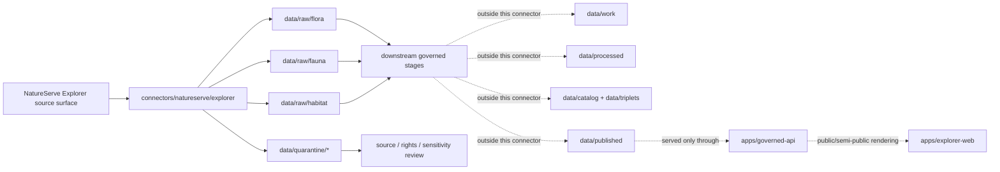
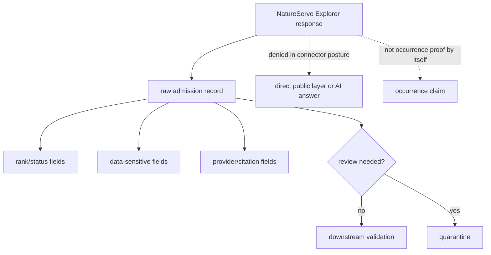

<!-- [KFM_META_BLOCK_V2]
doc_id: kfm://doc/connectors-natureserve-explorer-readme
title: connectors/natureserve/explorer/ — NatureServe Explorer Connector Lane
type: readme
version: v0.1
status: draft
owners: OWNER_TBD — Source steward · Connector steward · Flora steward · Fauna steward · Habitat steward · Data steward · Docs steward
created: 2026-06-19
updated: 2026-06-19
policy_label: restricted
related:
  - ../../README.md
  - ../../../docs/doctrine/directory-rules.md
  - ../../../docs/domains/flora/SOURCE_REGISTRY.md
  - ../../../docs/domains/flora/README.md
  - ../../../docs/domains/fauna/README.md
  - ../../../docs/architecture/ecology-cross-domain.md
  - ../../../docs/standards/Darwin_Core.md
  - ../../../data/registry/sources/
  - ../../../data/raw/
  - ../../../data/quarantine/
  - ../../../data/receipts/
  - ../../../data/proofs/
  - ../../../policy/rights/
  - ../../../policy/sensitivity/
  - ../../../release/
tags: [kfm, connectors, natureserve, explorer, biodiversity, conservation-status, flora, fauna, habitat, source-admission, raw, quarantine, governance]
notes:
  - "Connector lane for NatureServe Explorer source intake and admission helpers."
  - "Placement is draft: Directory Rules §7.3 does not list natureserve/ or natureserve/explorer/ in the canonical connector spine; keep placement unresolved until ADR or migration note."
  - "Connector output may enter raw or quarantine admission lanes only."
  - "NatureServe Explorer API facts are descriptive source-interface notes, not implementation proof."
  - "Rights, citation, data sensitivity, provider authority, and public-release posture fail closed until verified."
[/KFM_META_BLOCK_V2] -->

<a id="top"></a>

# NatureServe Explorer Connector

> Source-specific intake and admission lane for NatureServe Explorer biodiversity, conservation-status, taxonomy, ecosystem, data-sensitivity, and rank/source-provider material.

<p>
  
  
  
  
  
  
  
</p>

`connectors/natureserve/explorer/`

## Quick jumps

[Scope](#scope) · [Repo fit](#repo-fit) · [Lifecycle sketch](#lifecycle-sketch) · [Authority boundary](#authority-boundary) · [Inputs](#inputs) · [Exclusions](#exclusions) · [Source interface notes](#source-interface-notes) · [Admission posture](#admission-posture) · [Sensitivity posture](#sensitivity-posture) · [Placement status](#placement-status) · [Validation](#validation) · [Definition of done](#definition-of-done)

---

## Scope

`connectors/natureserve/explorer/` is the connector lane for NatureServe Explorer source intake and admission helpers.

This folder may contain connector-local documentation, source-admission helpers, API-request builders, no-network fixture pointers, and raw/quarantine output adapters for NatureServe Explorer products used by KFM Flora, Fauna, Habitat, ecology cross-domain reasoning, and public-safe conservation-status context.

It must not become biodiversity truth, conservation-status authority, flora truth, fauna truth, habitat truth, source-family authority, policy authority, schema authority, catalog/triplet authority, proof authority, release authority, pipeline authority, or publication authority.

> [!IMPORTANT]
> **Status:** draft / `NEEDS VERIFICATION`  
> **Owner:** `OWNER_TBD`  
> **Path:** `connectors/natureserve/explorer/`  
> **Truth posture:** the path exists in the repository as this README; source activation, endpoint behavior, credentials, tests, fixtures, CI wiring, rights status, data-sensitivity handling, and placement ratification remain `NEEDS VERIFICATION`.

---

## Repo fit

```text
connectors/
└── natureserve/
    └── explorer/
        └── README.md
```

Related responsibility roots:

```text
connectors/                                # source-specific fetch and admission code
docs/sources/catalog/natureserve/          # PROPOSED source-family documentation home; NEEDS VERIFICATION
docs/domains/flora/                        # flora domain context and rare-plant posture
docs/domains/fauna/                        # fauna domain context and sensitive-occurrence posture
docs/domains/habitat/                      # habitat/community/ecology context where present
data/registry/sources/                     # authoritative SourceDescriptors and activation state
data/raw/flora/                            # raw staged flora outputs
data/raw/fauna/                            # raw staged fauna outputs
data/raw/habitat/                          # raw staged habitat/ecosystem outputs where present
data/quarantine/flora/                     # held flora material requiring review
data/quarantine/fauna/                     # held fauna material requiring review
data/quarantine/habitat/                   # held habitat/ecosystem material requiring review where present
data/receipts/                             # ingest, run, validation, and sensitivity receipts
data/proofs/                               # EvidenceBundles and proof packs
policy/rights/                             # rights, terms, and citation checks
policy/sensitivity/                        # rare taxa, sensitive location, and redaction rules
release/                                   # release decisions, manifests, rollback, correction state
apps/governed-api/                         # downstream public trust membrane, not connector-owned
apps/explorer-web/                         # downstream map UI, never direct RAW/QUARANTINE access
```

---

## Lifecycle sketch



> [!CAUTION]
> Connector code admits source material. It does not normalize, catalog, publish, answer public claims, decide conservation truth, or decide release safety. Promotion remains a governed state transition, not a file move.

---

## Authority boundary

```text
OUTPUT LIMIT:
  data/raw/flora/<source_id>/<run_id>/
  data/raw/fauna/<source_id>/<run_id>/
  data/raw/habitat/<source_id>/<run_id>/
  data/quarantine/<domain>/<source_id>/<run_id>/

NOT HERE:
  source-family truth
  NatureServe rank methodology authority
  flora, fauna, or habitat doctrine
  SourceDescriptor authority
  rights or sensitivity policy
  public-safe geometry decisions
  processed data
  catalog records
  triplet records
  receipts/proofs as authority
  release decisions
  published artifacts
  schemas/contracts
  generated reports
  public API behavior
  public UI behavior
```

---

## Inputs

| Accepted item | Required posture |
|---|---|
| Source adapter | Preserve source identity, request path, request body, retrieval time, response status, and review posture. |
| Taxon request builder | Build bounded taxon requests by Element Global UID or approved alternate key; do not invent taxonomic authority. |
| Search request builder | Preserve search criteria object, paging options, status/location/taxonomy filters, and result-count context. |
| Export/job helper | Preserve asynchronous job identity and retrieval metadata; route unfinished or failed jobs to quarantine/retry review. |
| Domain-values helper | Preserve code-list source time and endpoint family; do not treat domain values as claim evidence by themselves. |
| Data-sensitivity helper | Preserve data-sensitive flags and categories; route sensitive or unclear records to quarantine/policy review. |
| Feature-service helper | Preserve feature-service URL, taxon identity, map/generalization context, and release restrictions. |
| Connector docs | Do not claim source admission, validation, release, or policy state unless verified. |
| Test references | Point to owning fixture/test roots; fixtures do not become source authority. |

---

## Exclusions

| Do not store here | Correct home |
|---|---|
| NatureServe source-family documentation | `docs/sources/catalog/natureserve/` once ratified; otherwise source-catalog open question register |
| Authoritative `SourceDescriptor` records | `data/registry/sources/` |
| Flora, Fauna, Habitat, or ecology doctrine | `docs/domains/flora/`, `docs/domains/fauna/`, `docs/domains/habitat/`, `docs/architecture/ecology-cross-domain.md` |
| Rights, terms, sensitivity, redaction, or release policy | `policy/rights/`, `policy/sensitivity/`, `policy/` |
| Processed taxon/status/occurrence/community records | `data/processed/` |
| Catalog or triplet records | `data/catalog/`, `data/triplets/` |
| Receipts and proof packs as authority | `data/receipts/`, `data/proofs/` |
| Release decisions or rollback/correction records | `release/` |
| Published artifacts or public layers | `data/published/` after governed release |
| Schemas or semantic contracts | `schemas/`, `contracts/` |
| Generated reports | `artifacts/` |
| Public UI or API behavior | `apps/governed-api/`, `apps/explorer-web/` |

---

## Source interface notes

These notes describe the external source surfaces this connector may support. They are not implementation proof.

At authoring time, the official NatureServe Explorer REST API page reported API documentation version `1.1.88`, described the services as publicly available web services for NatureServe Explorer, and stated that paths are relative to `https://explorer.natureserve.org/`. Treat that as a `NEEDS VERIFICATION` version-sensitive fact before package pinning, tests, or source activation.

| Source surface | Example path or family | KFM use | Connector posture |
|---|---|---|---|
| Get Taxon | `/api/data/taxon/{ouSeqUid}` | Retrieve a taxon record by Element Global UID for taxonomy, rank, national/subnational status, and sensitivity context. | `NEEDS VERIFICATION`; source material only. |
| Get Taxon by alternate key | API-documented alternate-key service | Retrieve records by supported alternate identifiers where allowed. | Preserve alternate key and resolver path. |
| Search services | combined/species/ecosystems search criteria | Discover candidate records by text, status, location, record type, taxonomy, and paging criteria. | Preserve search criteria object and paging context. |
| Export and Job services | export/job families | Retrieve larger result sets through job-mediated workflows where supported. | Preserve job state and route failed/partial jobs to review. |
| Domain values | nations, subnations, taxonomy, statuses, sensitivity lists | Resolve code lists used to interpret API responses. | Treat as support metadata, not claim proof. |
| Data sensitivity | sensitive taxa by subnation and category | Detect or corroborate sensitivity routing requirements. | Fail closed when sensitivity is unclear. |
| Data providers | data-provider service | Preserve source-provider attribution and authority chain. | Required for attribution/review, not publication by itself. |
| Feature services | individual-taxon feature services, species subnational ranks | Candidate map/support services for released public-safe layers. | Do not expose directly to public UI without governed release. |

NatureServe Explorer facts to preserve at admission time where applicable:

- request path, method, and query/body criteria;
- API documentation version observed at authoring or test time;
- retrieval time and response status;
- response digest and source headers when available;
- Element Global UID, alternate key, or search criteria object;
- record type (`SPECIES`, `ECOSYSTEMS`, or API-provided equivalent);
- taxonomy, common/scientific name, concept reference, and rank fields when present;
- global, national, and subnational rank fields when present;
- jurisdiction fields such as nation, subnation, or subnation code when present;
- data-sensitive flag and data-sensitive category when present;
- data provider / attribution fields when present;
- feature-service URL or job identifier when present;
- terms/citation review state;
- quarantine reason if rights, sensitivity, provider authority, result shape, or endpoint behavior is unclear.

> [!WARNING]
> API use is subject to NatureServe Explorer Terms of Use. Any display or use of data obtained through the API must preserve citation/attribution requirements through downstream release review. This connector must not strip provider, citation, sensitivity, or limitation fields.

---

## Admission posture

NatureServe Explorer intake should preserve:

- source identity and source surface;
- API service family (`taxon`, `search`, `export`, `job`, `domain-values`, `data-sensitivity`, `feature-service`, or another explicit family if later approved);
- request criteria, paging, filters, and identifiers;
- retrieval timestamp;
- API documentation version or source-interface version observed during the run when available;
- response status, parse status, and content digest;
- source role and limitation notes;
- record type and domain-lane routing hint;
- conservation-status/rank fields as source fields, not downstream truth;
- data-sensitive flags, categories, provider fields, and citation fields;
- public-safe geometry limitation notes;
- quarantine reason when review is required.

NatureServe Explorer may inform Flora, Fauna, Habitat, ecology cross-domain reasoning, public-safe status displays, and Focus Mode summaries. Connector output remains admission material. Confirmation, transformation, redaction/generalization, EvidenceBundle production, catalog closure, public claims, publication, correction, and rollback belong to governed downstream stages.

---

## Sensitivity posture

NatureServe Explorer can expose records and metadata that matter for rare species, sensitive taxa, proprietary data, or jurisdiction-specific rank/status interpretation. KFM must treat that as policy-significant.

| Rule | Connector implication |
|---|---|
| Preserve data-sensitive fields. | Do not drop `dataSensitive`, `dataSensitiveCategory`, sensitive-taxa-by-subnation responses, or related limitation fields. |
| Treat exact or feature-service geometry as restricted until released. | Direct feature-service output is not public-ready just because it is retrievable. |
| Preserve provider authority. | Data provider and source lineage must remain inspectable for downstream citation and review. |
| Separate rank/status from occurrence proof. | A conservation status, rank, or jurisdiction list is not an occurrence observation unless a downstream source role and evidence bundle support that claim. |
| Fail closed on sensitive taxa and rare-location inference. | Route unclear, sensitive, or precise-location material to quarantine or downstream policy review. |
| Keep AI downstream and evidence-subordinate. | Connector output is not a Focus Mode answer and cannot be cited directly by public AI surfaces. |



---

## Placement status

`connectors/natureserve/explorer/README.md` is intentionally conservative because NatureServe placement is not yet fully ratified by Directory Rules.

| Claim | Status | Notes |
|---|---|---|
| `connectors/natureserve/explorer/README.md` contains this connector README | `CONFIRMED` after this update | The file itself now carries the connector-lane boundary. |
| `connectors/natureserve/explorer/` is a source-admission lane only | `PROPOSED / draft` | Consistent with `connectors/` responsibility, but not yet listed in the canonical §7.3 connector spine. |
| NatureServe source-catalog docs exist under `docs/sources/catalog/natureserve/` | `UNKNOWN` | No source-catalog NatureServe file was verified during this update. |
| NatureServe connector placement is ADR-ratified | `NEEDS VERIFICATION` | Directory Rules §7.3 should be updated or an ADR/migration note should justify this nested lane. |
| A live NatureServe Explorer `SourceDescriptor` exists and is active | `NEEDS VERIFICATION` | Must be checked under `data/registry/sources/`. |
| API endpoint behavior, tests, fixtures, and CI are implemented | `UNKNOWN` | Not proven by this README. |
| NatureServe outputs are validated, cataloged, redacted, generalized, and published | `UNKNOWN` | Connector README does not prove downstream promotion. |

---

## Validation

Before relying on this connector, verify:

- placement is intentional and documented by ADR, migration note, or updated Directory Rules;
- source descriptors exist and are active for NatureServe Explorer services;
- Terms of Use and required citation/attribution are captured in the source descriptor and release review;
- endpoint behavior, API documentation version, request/response shapes, paging, export/job behavior, and error cases are fixture-tested;
- tests use no-network fixtures where practical;
- output paths are limited to raw/quarantine admission lanes;
- source-role, rank/status, provider, citation, and sensitivity metadata survive parsing;
- exact-location, sensitive taxa, proprietary-data, and rare-species inference paths fail closed;
- downstream receipts, proofs, catalog/triplet records, redaction/generalization records, and release records are produced only outside this connector;
- public products are released only through governed publication controls.

---

## Definition of done

- [ ] Owners are confirmed and `OWNER_TBD` is replaced.
- [ ] Directory placement is ratified or the conflict is recorded in the drift/open-question register.
- [ ] Actual connector contents are inventoried.
- [ ] NatureServe Explorer `SourceDescriptor` IDs and source-family activation are verified.
- [ ] NatureServe Explorer Terms of Use, citation/attribution, provider authority, and sensitivity posture are documented.
- [ ] Request builders preserve request path, service family, search criteria, paging, identifiers, and response status.
- [ ] Data-sensitive flags, sensitive categories, provider fields, feature-service references, ranks, and jurisdiction fields survive parsing.
- [ ] Outputs are verified to enter only raw or quarantine admission lanes.
- [ ] No source-family, domain, processed, catalog, triplet, published, release, schema, policy, proof, receipt, registry, fixture, report, API, or UI authority lives here.
- [ ] Tests, fixtures, and CI behavior are verified or marked `NEEDS VERIFICATION`.

---

## Status summary

`connectors/natureserve/explorer/` is for NatureServe Explorer source-admission code only. It is not source-family truth, conservation-status authority, flora truth, fauna truth, habitat truth, policy authority, schema authority, catalog/triplet authority, proof closure, release authority, publication authority, public API behavior, public UI behavior, or pipeline authority.

<p align="right"><a href="#top">Back to top</a></p>
