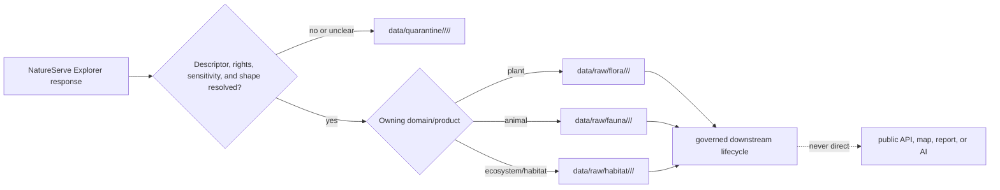

<!-- [KFM_META_BLOCK_V2]
doc_id: kfm://connectors/natureserve/explorer/readme
title: NatureServe Explorer Connector Lane
path: connectors/natureserve/explorer/README.md
type: connector-lane-readme
version: v0.2
prior_version: v0.1
prior_blob: ffc10af7ba9bdc757dceba4feb40077f2694b4ef
base_commit: d6c6556e2e20a06d12b49d4c94ed6fe996e003d7
status: draft
owners: OWNER_TBD — source steward · connector steward · flora steward · fauna steward · habitat steward · data steward · rights steward · sensitivity steward
created: 2026-06-19
updated: 2026-07-14
policy_label: restricted-review
truth_posture: cite-or-abstain
responsibility_root: connectors/
lifecycle_phase: source-admission
source_family: natureserve
source_surface: explorer
related:
  - ../README.md
  - ../../README.md
  - ../../../docs/sources/catalog/natureserve/README.md
  - ../../../docs/architecture/source-roles.md
  - ../../../docs/doctrine/directory-rules.md
  - ../../../data/registry/sources/README.md
  - ../../../data/registry/sources/habitat/natureserve.yaml
  - ../../../data/raw/fauna/natureserve/README.md
  - ../../../data/raw/habitat/natureserve/README.md
  - ../../../policy/rights/flora/natureserve_explorer_pro.md
tags:
  - kfm
  - connectors
  - natureserve
  - explorer
  - biodiversity
  - conservation-status
  - flora
  - fauna
  - habitat
  - source-admission
  - raw
  - quarantine
  - sensitivity
  - rights-review
notes:
  - "This lane admits NatureServe Explorer source material; it does not establish biodiversity, occurrence, policy, catalog, proof, release, or public truth."
  - "The parent NatureServe README documents this child lane, while Directory Rules defines only the connector-root responsibility and RAW/QUARANTINE output boundary. Exact nested placement remains draft."
  - "The source catalog is present; the Explorer Pro rights file is only a PROPOSED scaffold and is not rights clearance."
  - "A Habitat SourceDescriptor placeholder and Fauna/Habitat RAW lane READMEs are present; activation, payloads, implementation, fixtures, tests, and receipts remain unverified."
  - "Official interface and terms references were rechecked on 2026-07-14; runtime behavior and product-specific permissions must be rechecked at activation and each governed retrieval."
[/KFM_META_BLOCK_V2] -->

<a id="top"></a>

# NatureServe Explorer connector lane

Source-admission boundary for NatureServe Explorer material used by KFM Flora, Fauna, Habitat, and governed cross-domain workflows.

<p>
  
  
  
  
  
  
</p>

> [!CAUTION]
> This directory may fetch, preserve, and route source material. It is not NatureServe doctrine, Flora/Fauna/Habitat truth, occurrence proof, taxonomic final authority, KFM policy, a SourceDescriptor registry, schema authority, catalog/triplet authority, proof or receipt authority, release authority, a public API, a public map source, or generated-answer evidence.

---

## Quick contract

| Question | Answer |
|---|---|
| What belongs here? | Connector-local documentation and, after activation, source-specific request, parsing, fixture, and RAW/QUARANTINE adapter code for the NatureServe Explorer surface. |
| What may this lane write? | `data/raw/<domain>/<source_id>/<run_id>/` or `data/quarantine/<domain>/<source_id>/<run_id>/` only. |
| What may it publish? | Nothing. |
| Is the connector active? | **NEEDS VERIFICATION**. No activation decision was verified in this update. |
| Are rights cleared? | **No blanket clearance.** Product, surface, access tier, intended use, attribution, and redistribution must be reviewed. |
| Are sensitive or precise locations public-ready? | **No.** Hold or quarantine until sensitivity, provider-permission, redaction/generalization, proof, and release gates close. |
| Does a rank or status prove an occurrence? | **No.** Rank/status context and occurrence evidence are different claim types. |
| Can public UI or AI read connector output directly? | **No.** Public surfaces consume only governed released artifacts. |

---

## Purpose and responsibility boundary

This lane is the source-specific intake edge for NatureServe Explorer. Its responsibility ends when a governed, immutable admission package has been written to the owning domain's RAW lane or held in QUARANTINE.

Allowed responsibilities include:

- build requests for an approved Explorer service family;
- capture the exact request criteria, retrieval time, response status, and source-interface observation;
- preserve upstream identifiers, record type, provider, citation, rights/access, rank/status, and data-sensitivity fields without semantic promotion;
- hash-bind admitted payloads or payload references;
- route each record or package to an explicit Flora, Fauna, Habitat, or quarantine destination;
- emit connector-local diagnostics that do not become proof, release, or catalog authority.

This lane must not:

- decide that a species or ecosystem is present or absent at a place;
- convert a conservation rank, listing, or jurisdictional status into occurrence proof;
- assign a public-safe geometry class by convenience;
- overwrite prior RAW runs or silently replace a provider/source identity;
- create processed, catalog, triplet, published, proof, release, policy, schema, or registry authority;
- serve an Explorer feature service or response directly to a public map, API, report, search index, vector index, or generated answer.

---

## Repository fit and verified state

The table below records what was observed at base commit `d6c6556e2e20a06d12b49d4c94ed6fe996e003d7`. Repository search is evidence of what surfaced during this update, not proof that no other implementation exists.

| Surface | Observed state | Connector consequence |
|---|---|---|
| [`connectors/README.md`](../../README.md) | Connector root is for source admission; outputs stop at RAW or QUARANTINE. | This lane cannot publish or promote. |
| [`connectors/natureserve/README.md`](../README.md) | Parent family README points to `explorer/`. | The child is repository-documented, but still draft. |
| [`docs/sources/catalog/natureserve/README.md`](../../../docs/sources/catalog/natureserve/README.md) | NatureServe source profile exists and is draft/restricted-by-default pending rights review. | The v0.1 claim that this catalog was unknown is retired. |
| [`policy/rights/flora/natureserve_explorer_pro.md`](../../../policy/rights/flora/natureserve_explorer_pro.md) | File exists as a short `PROPOSED scaffold`. | It is a placeholder, not permission, license review, or activation evidence. |
| [`data/registry/sources/habitat/natureserve.yaml`](../../../data/registry/sources/habitat/natureserve.yaml) | Proposed inventory-derived placeholder. | It is not a complete or active SourceDescriptor. |
| Expected Flora/Fauna descriptor paths | No `data/registry/sources/{flora,fauna}/natureserve.yaml` surfaced. | Do not infer activation for those domains. |
| [`data/raw/fauna/natureserve/README.md`](../../../data/raw/fauna/natureserve/README.md) | Documented restricted-review RAW lane; actual payload presence remains unknown. | Fauna routing has a documented boundary, not proof of data or readiness. |
| [`data/raw/habitat/natureserve/README.md`](../../../data/raw/habitat/natureserve/README.md) | Documented restricted-review RAW lane; actual payload presence remains unknown. | Habitat routing has a documented boundary, not proof of data or readiness. |
| Expected Flora RAW README | No `data/raw/flora/natureserve/README.md` surfaced. | Quarantine Flora material until a governed destination is confirmed. |
| Pipeline specifications | No expected `pipeline_specs/{flora,fauna,habitat}/natureserve.yaml` surfaced. | No pipeline activation is claimed. |
| Connector implementation, dedicated tests, and fixtures | None surfaced under the searched NatureServe connector/test/fixture terms. | Implementation and enforcement remain **NEEDS VERIFICATION**. |
| `.github/CODEOWNERS` | No NatureServe-specific rule surfaced. | Owners remain `OWNER_TBD`. |

> [!IMPORTANT]
> A README, placeholder descriptor, or empty RAW lane documents a boundary. It does not prove connector activation, payload existence, validation, provider permission, rights clearance, sensitivity handling, downstream promotion, or public release.

---

## Placement posture

`connectors/natureserve/explorer/` is consistent with the parent NatureServe family README and the connector root's source-admission responsibility. Directory Rules §7.3 confirms that connectors are source-specific fetchers/admitters whose output goes only to RAW or QUARANTINE, but its example connector spine does not ratify this exact nested family/product path.

Treat placement as:

- **CONFIRMED repository path** — the directory and README exist;
- **CONFIRMED parent-child documentation** — `connectors/natureserve/README.md` names the Explorer child;
- **PROPOSED nested convention** — no placement ADR or Directory Rules entry was verified;
- **non-authoritative** — this README does not settle the canonical connector taxonomy.

Do not create a parallel `connectors/natureserve_explorer/`, `connectors/explorer/`, or domain-owned NatureServe connector to work around that open placement question. Resolve any relocation through an ADR or migration note with redirects, owner review, and rollback instructions.

---

## Upstream interface reference

The official [NatureServe Explorer REST API](https://explorer.natureserve.org/api-docs/index.html) page observed on 2026-07-14 labels the documentation `version 1.1.87`, describes public Explorer web services, requires citation, and documents paths relative to `https://explorer.natureserve.org/`. The v0.1 README's `1.1.88` observation is not retained as current.

The version label and endpoint behavior are operationally unstable. A future connector must capture the interface observation used for each run and re-verify request/response behavior with no-network fixtures before activation.

| Service family | Upstream purpose | KFM admission rule |
|---|---|---|
| Taxon | Retrieve a record by Element Global UID; the documented path includes `/api/data/taxon/{ouSeqUid}`. | Preserve the UID, record type, concept/taxonomy fields, status/rank fields, sensitivity fields, provider fields, and response digest. |
| Alternate-key lookup | Resolve a supported alternate identifier. | Preserve both the alternate key and returned canonical identifier; never merge identities silently. |
| Search | Find species or ecosystem records using text, status, location, record-type, taxonomy, and paging criteria. | Preserve the complete criteria object and paging/result-count context. Search results are candidates for downstream review, not proof of occurrence or absence. |
| Export/job | Support larger or asynchronous result retrieval where the current interface permits it. | Preserve job identity, state transitions, retrieval metadata, partial/failure state, and artifact digest; quarantine incomplete or ambiguous jobs. |
| Domain values | Supply nations, subnations, taxonomy/status, sensitivity, and related code lists. | Pin retrieval time and observed interface version. Domain values aid interpretation but are not claim evidence by themselves. |
| Data sensitivity | Return sensitivity indicators and sensitive taxa by subnation/category. | Preserve `dataSensitive`, `dataSensitiveCategory`, jurisdiction, and category metadata; fail closed if missing, unknown, or inconsistent. |
| Data providers | Identify contributing provider/source context. | Preserve provider lineage and attribution. Provider metadata does not itself authorize redistribution. |
| Feature services | Supply individual-taxon or subnational-rank map support where available. | Treat URLs and geometry as restricted references until product rights, precision, provider permission, redaction/generalization, and release gates close. |

Documented record-type values include `SPECIES` and `ECOSYSTEM`. Do not normalize an upstream value to a KFM domain or object family without preserving the original value and recording the explicit routing decision.

---

## Admission record

Every attempted retrieval must produce or contribute to an inspectable admission record. At minimum preserve:

| Field group | Required content |
|---|---|
| Source identity | KFM `source_id`, NatureServe surface/product, upstream provider identity, access tier, and SourceDescriptor reference. |
| Request identity | Method, path/service family, parameters or body digest, search criteria, identifiers, page/job identity, and retry lineage. |
| Time and version | Retrieval timestamp, source time when supplied, documentation/interface version observed, connector version, and clock/timezone basis. |
| Response identity | HTTP/job state, media type, record count when meaningful, parse status, immutable content digest, and payload/reference location. |
| Semantics | Original record type, Element Global UID/alternate keys, taxon/ecosystem concept fields, rank/status jurisdiction and date, and code-list version. |
| Rights and citation | Terms/product reference, intended-use class, license/access review state, required citation/attribution, provider restrictions, and review owner. |
| Sensitivity | Data-sensitive indicator/category, precision or geometry class, provider restriction, derived-sensitivity warning, and quarantine/redaction requirement. |
| Routing | Owning domain, source role, RAW/QUARANTINE destination, run ID, decision reason, and any split-package lineage. |
| Failure | Error class, retryability, partial-result state, quarantine reason, and operator/steward disposition. |

Credentials, tokens, cookies, signed URLs, license documents containing secrets, and precise sensitive coordinates must not be written to this README, logs, fixtures, PR bodies, or public receipts.

---

## Cross-domain routing

NatureServe Explorer spans species and ecosystems; the source family is not itself a KFM domain. Route by admitted product and claim, not by connector location or name matching.



Routing rules:

1. Preserve one stable upstream identity and digest even when a package is split across domains.
2. Record each domain route and parent-package lineage; do not duplicate records without a traceable split decision.
3. Mixed or unresolved records go to QUARANTINE, not the most convenient domain.
4. A Flora, Fauna, or Habitat lane may add domain interpretation downstream, but it cannot rewrite upstream identity or source role in place.
5. Cross-domain joins require governed downstream evidence; they are not a connector responsibility.

---

## Source-role discipline

[`docs/architecture/source-roles.md`](../../../docs/architecture/source-roles.md) defines seven canonical role values:

`observed | regulatory | modeled | aggregate | administrative | candidate | synthetic`

`authority`, `context`, `authority-context`, and `administrative-aggregate-context` are descriptive phrases found in adjacent draft docs, not values in that canonical enum. Do not emit them as `source_role` unless the authoritative schema or an accepted ADR later changes the vocabulary.

There is no safe lane-wide role for all NatureServe products. The reviewed SourceDescriptor must assign a role per admitted product and intended claim:

| Product/claim shape | Role question to resolve | Anti-collapse rule |
|---|---|---|
| Taxon or conservation-rank compilation | Often administrative context; verify whether any particular status has regulatory force. | Do not label an assessment or compilation `regulatory` merely because it is authoritative or important. |
| Jurisdictional legal designation | May be `regulatory` when the issuing body and legal determination are preserved. | Do not turn a regulatory designation into an observed occurrence. |
| Summary map or generalized unit | May be `aggregate` when the aggregation unit and method are preserved. | Do not infer a precise site or individual record from an aggregate. |
| Location/occurrence-like material | Role depends on the underlying record, provider, time/place evidence, and access terms. | Do not call it `observed` without first-hand evidentiary support and a compatible descriptor. |
| Unresolved connector output | `candidate` with pending/quarantined disposition may be appropriate. | Candidate material cannot cross into PUBLISHED without promotion. |

Corrections create a new descriptor and lineage record. They do not mutate role, rights, sensitivity, or provider identity in place.

---

## Rights, terms, and citation

NatureServe's official [Data Use Terms and Citations](https://www.natureserve.org/nsexplorer/about-the-data/use-guidelines-citation) distinguishes open Explorer data from licensed or specialized data and gives product-specific citation guidance. The general [NatureServe Terms and Conditions](https://www.natureserve.org/terms) also notes that particular products can carry separate terms and citation requirements.

KFM therefore uses a product-specific decision, not either of these unsafe shortcuts:

- “Everything retrievable from Explorer is unrestricted.”
- “Every NatureServe product has the same restricted license.”

Before activation, the rights review must record:

- exact product and access surface (`Explorer`, `Explorer Pro`, export, feature service, licensed delivery, or another named surface);
- current terms/license reference and review date;
- public, semi-public, restricted, or internal use class;
- intended use, derivative/redistribution limits, provider permissions, attribution text, and citation date;
- expiration, deletion, renewal, or access-control duties where applicable;
- whether derived outputs may be displayed and at what geometry/aggregation precision;
- rights reviewer, decision, and re-review trigger.

The repository source profile's restricted-by-default posture remains the KFM admission default until those facts are recorded. The Explorer Pro policy file currently contributes no clearance because it is only a scaffold.

---

## Sensitivity and public-safety boundary

NatureServe sensitivity signals are inputs to KFM review, not substitutes for KFM policy. Preserve them exactly and treat ambiguity as restrictive.

Required rules:

- never drop or default `dataSensitive`, `dataSensitiveCategory`, jurisdiction, provider, precision, or limitation fields;
- never infer “not sensitive” from a missing field, empty list, endpoint error, or unsupported jurisdiction;
- do not place exact or reversibly precise rare-taxon locations in public fixtures, logs, PRs, map sources, search indexes, or generated answers;
- treat individual-taxon feature-service URLs and derived coordinates as restricted until provider permission and release review explicitly allow the intended precision;
- record generalization, suppression, aggregation, and redaction outside this connector with inspectable receipts;
- account for mosaic and inference risk: individually coarse outputs can become sensitive when joined;
- fail closed when source terms, provider rules, sensitivity category, location precision, or downstream audience is unclear.

> [!WARNING]
> Conservation rank, sensitive-taxa status, or a feature-service response does not prove presence at a location. Conversely, a missing Explorer record does not prove absence. Public claims require claim-appropriate downstream evidence and release closure.

---

## Lifecycle and output contract

```text
SourceDescriptor + activation + product-specific rights/sensitivity review
  -> connector request
  -> immutable RAW capture or QUARANTINE hold
  -> WORK / normalization
  -> PROCESSED validation
  -> CATALOG / TRIPLET / proof closure
  -> release decision, redaction/generalization, and manifest
  -> PUBLISHED artifact
  -> governed API / public UI / report / generated answer
```

Connector-permitted destinations:

```text
data/raw/<domain>/<source_id>/<run_id>/
data/quarantine/<domain>/<source_id>/<run_id>/
```

Forbidden direct destinations include:

```text
data/work/
data/processed/
data/catalog/
data/triplets/
data/published/
data/proofs/
data/receipts/ as self-issued authority
release/
policy/
schemas/
contracts/
apps/
artifacts/
```

The connector may reference downstream receipts or policies after they exist. It cannot manufacture them, declare their gates closed, or promote by copying files.

---

## Activation gates

Keep the connector inactive until all applicable items are evidenced:

- [ ] Placement and owners are accepted or the draft placement is explicitly approved for implementation.
- [ ] A complete, current SourceDescriptor exists for each product/surface and domain route.
- [ ] `source_role` uses the canonical vocabulary and matches the admitted product and claim.
- [ ] A SourceActivationDecision authorizes the exact connector/product scope.
- [ ] Official API/service behavior, version observation, paging, rate limits, export/job state, retries, and errors are verified.
- [ ] Product-specific terms, provider permissions, attribution, redistribution, expiration, and intended-use restrictions are reviewed.
- [ ] Sensitivity fields, exact-location handling, inference risk, and public precision limits are mapped to KFM policy.
- [ ] Request and response schemas preserve upstream identifiers, record type, rank/status jurisdiction, provider, citation, and sensitivity fields.
- [ ] Valid, invalid, sensitive, partial, empty, paged, rate-limited, failed-job, and changed-interface no-network fixtures exist.
- [ ] Tests prove RAW/QUARANTINE-only writes, immutable run IDs, hash binding, domain routing, quarantine behavior, and secret scrubbing.
- [ ] Receipts and downstream gates are produced by their owning systems, not asserted by connector code.
- [ ] Rollback disables activation without deleting prior RAW, quarantine, descriptor, or review history.

---

## Validation matrix

| Risk | Minimum test/evidence | Failure posture |
|---|---|---|
| Interface drift | Pinned request/response fixtures plus a documented live-contract recheck at activation. | Disable or quarantine; do not coerce unknown shapes. |
| Identity drift | Alternate-key and Element Global UID fixtures with explicit merge/split cases. | Quarantine unresolved identity. |
| Paging/export loss | Multi-page, zero-result, duplicate-page, partial-job, expired-job, and retry fixtures. | Hold incomplete package; preserve job lineage. |
| Source-role collapse | Descriptor validation against canonical role enum and product-specific role tests. | Reject invalid role or quarantine. |
| Rights mismatch | Product/access-tier matrix with allowed and denied intended-use fixtures. | Deny or hold for rights review. |
| Sensitivity loss | Sensitive, conditional, missing, unknown, provider-restricted, and exact-geometry cases. | Fail closed and quarantine. |
| Cross-domain leakage | Species/ecosystem and mixed-package routing fixtures. | Quarantine unresolved or misrouted records. |
| Secret leakage | Redaction tests for headers, tokens, cookies, signed URLs, and error payloads. | Abort write; rotate exposed credentials if necessary. |
| Output escape | Filesystem tests restricting writes to the resolved RAW/QUARANTINE run path. | Reject and alert; never fall back to another lifecycle root. |
| Public shortcut | Integration test showing no connector/RAW/QUARANTINE dependency from public app surfaces. | Block release. |

No implementation, dedicated fixtures, or dedicated tests were verified during this documentation update; this matrix is an activation requirement, not a claim of passing coverage.

---

## Evidence and change ledger

| Claim | Status | Evidence / limit |
|---|---|---|
| The requested connector README exists. | **CONFIRMED** | Prior blob `ffc10af7ba9bdc757dceba4feb40077f2694b4ef`. |
| The parent README documents this Explorer child. | **CONFIRMED** | `connectors/natureserve/README.md`. |
| NatureServe source-catalog documentation exists. | **CONFIRMED** | `docs/sources/catalog/natureserve/README.md`; draft and restricted-by-default pending review. |
| The Explorer Pro rights file clears use. | **DENY** | The file is only a `PROPOSED scaffold`. |
| Fauna and Habitat NatureServe RAW boundaries exist. | **CONFIRMED** | Their READMEs exist; payloads and activation remain unknown. |
| A complete active SourceDescriptor exists. | **NEEDS VERIFICATION** | Only a proposed Habitat placeholder surfaced at the checked path. |
| Connector code, fixtures, tests, and pipeline specs are implemented. | **UNKNOWN** | None surfaced in the targeted repository search; absence was not exhaustively proven. |
| Official Explorer API documentation currently shows `1.1.87`. | **EXTERNAL observation** | Official API page checked 2026-07-14; must be rechecked before use. |
| Explorer and precise/licensed products share one blanket permission. | **DENY** | Official terms distinguish products/surfaces and product-specific conditions. |
| NatureServe rank/status is occurrence proof. | **DENY** | Source-role and claim-type boundaries prohibit the collapse. |
| Connector output is public-ready. | **DENY** | Directory Rules and connector lifecycle forbid direct publication. |

### What changed from v0.1

- corrected the stale “source catalog unknown” claim;
- recorded the confirmed Fauna/Habitat RAW boundaries and proposed Habitat descriptor placeholder;
- distinguished repository-documented placement from formal placement ratification;
- replaced the old API version observation with the official `1.1.87` observation dated 2026-07-14;
- separated open Explorer terms from licensed/precise product review without granting blanket permission;
- aligned `source_role` guidance to the seven canonical enum values;
- made cross-domain routing, admission metadata, sensitivity, activation, validation, and rollback requirements explicit;
- preserved the v0.1 source-admission-only, RAW/QUARANTINE-only, no-public-shortcut, provider/citation-preservation, and rank-is-not-occurrence boundaries.

---

## Rollback

This is a documentation-only update. To restore the exact prior README, recover blob:

```text
ffc10af7ba9bdc757dceba4feb40077f2694b4ef
```

Rollback of this document does not activate or deactivate a connector and must not delete or rewrite any SourceDescriptor, rights review, RAW capture, quarantine record, receipt, proof, correction, or release history.

---

## Related files

- [`connectors/natureserve/README.md`](../README.md)
- [`connectors/README.md`](../../README.md)
- [`docs/sources/catalog/natureserve/README.md`](../../../docs/sources/catalog/natureserve/README.md)
- [`docs/architecture/source-roles.md`](../../../docs/architecture/source-roles.md)
- [`docs/doctrine/directory-rules.md`](../../../docs/doctrine/directory-rules.md)
- [`data/registry/sources/README.md`](../../../data/registry/sources/README.md)
- [`data/registry/sources/habitat/natureserve.yaml`](../../../data/registry/sources/habitat/natureserve.yaml)
- [`data/raw/fauna/natureserve/README.md`](../../../data/raw/fauna/natureserve/README.md)
- [`data/raw/habitat/natureserve/README.md`](../../../data/raw/habitat/natureserve/README.md)
- [`policy/rights/flora/natureserve_explorer_pro.md`](../../../policy/rights/flora/natureserve_explorer_pro.md)
- [NatureServe Explorer REST API](https://explorer.natureserve.org/api-docs/index.html)
- [NatureServe Data Use Terms and Citations](https://www.natureserve.org/nsexplorer/about-the-data/use-guidelines-citation)
- [NatureServe Terms and Conditions](https://www.natureserve.org/terms)

---

KFM rule: `connectors/natureserve/explorer/` admits source material into governed RAW or QUARANTINE lanes only. It does not decide biodiversity truth, occurrence truth, rights, sensitivity, source role, proof, release, publication, public presentation, or generated-answer truth.

[Back to top](#top)
