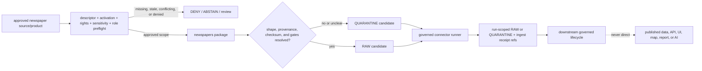

<!-- [KFM_META_BLOCK_V2]
doc_id: kfm://connectors/newspapers/readme
title: Newspaper Connector Family
path: connectors/newspapers/README.md
type: connector-family-readme
version: v0.2
prior_version: v0.1
prior_blob: f1fcf2aef3e3d1225f75c0cb52b650342a649eae
base_commit: d2cb304f41966d8df61e9437f89262a6794d69c9
status: draft
owners: OWNER_TBD — source steward · connector steward · archives steward · genealogy steward · people-dna-land steward · settlements steward · validation steward · data steward · rights steward · sensitivity steward
created: 2026-06-19
updated: 2026-07-14
policy_label: restricted-review
truth_posture: cite-or-abstain
responsibility_root: connectors/
lifecycle_phase: source-admission
source_family: newspapers
distribution_name: kfm-connector-newspapers
related:
  - ../README.md
  - ./pyproject.toml
  - ./src/README.md
  - ./src/newspapers/README.md
  - ./tests/README.md
  - ../../docs/sources/catalog/newspapers/README.md
  - ../../docs/sources/catalog/newspapers.md
  - ../../docs/sources/catalog/newspapers/ocr-full-text.md
  - ../../docs/sources/catalog/newspapers/event-reporting.md
  - ../../docs/sources/catalog/newspapers/legal-notices.md
  - ../../docs/sources/catalog/newspapers/obituaries.md
  - ../../docs/sources/catalog/loc/README.md
  - ../../docs/architecture/source-roles.md
  - ../../docs/doctrine/directory-rules.md
  - ../../data/registry/sources/README.md
  - ../../schemas/contracts/v1/source/source_descriptor.schema.json
  - ../../fixtures/README.md
  - ../../tests/fixtures/README.md
  - ../../tests/policy/test_pipeline_connector_non_publisher.py
  - ../../.github/workflows/connector-gate.yml
tags:
  - kfm
  - connectors
  - newspapers
  - archives
  - chronicling-america
  - loc
  - ocr
  - iiif
  - genealogy
  - settlements
  - source-admission
  - raw
  - quarantine
  - provenance
  - rights-review
  - sensitivity-review
notes:
  - "The family currently contains this README, a 0.0.0 package placeholder, v0.2 source/package/test READMEs, and an empty package initializer."
  - "Expected runtime modules, dedicated newspaper tests, payload fixtures, active newspaper descriptors, and substantive connector CI did not surface."
  - "Newspaper source-family and product documentation exists outside this connector, including parallel catalog profile surfaces whose canonical relationship remains unresolved."
  - "This connector family may prepare bounded RAW or QUARANTINE admission plus checksum and receipt references; it may not decide truth or publish."
  - "Page images, OCR, corrected transcription, event reporting, legal notices, obituaries, and extraction candidates remain distinct products with product-specific roles and gates."
[/KFM_META_BLOCK_V2] -->

<a id="top"></a>

# Newspaper connector family

Parent boundary and navigation index for newspaper source-admission implementation under `connectors/`.

<p>
  
  
  
  
  
  
</p>

> [!CAUTION]
> This family may organize newspaper connector implementation and package-local verification. It is not newspaper or archival source doctrine, OCR/transcription truth, person/entity/event/place authority, SourceDescriptor or schema authority, rights/privacy/sensitivity policy, evidence/proof authority, release authority, a public API/UI, or generated-answer evidence.

---

## Quick contract

| Question | Family answer |
|---|---|
| What exists now? | Parent README, `pyproject.toml`, source-root README, package README, empty package initializer, and test-lane README. |
| Is the connector implemented? | **No verified implementation.** Expected runtime modules are absent and the distribution remains `0.0.0`. |
| Are newspaper tests implemented? | **No suite surfaced.** The test lane contains its v0.2 README only. |
| Is live access activated? | **No verified activation.** Checked newspaper/ChronAm descriptor and authority-register paths were absent. |
| What products must stay distinct? | Page/image, OCR, corrected transcription, article/clipping, event reporting, legal notices, obituaries, and extraction candidates. |
| What may future connector code emit? | Bounded run-scoped RAW or QUARANTINE admission material with descriptor, checksum, and ingest-receipt references. |
| Can this family decide truth or publish? | **No.** Evidence resolution, policy, proof, release, correction, publication, and public presentation remain downstream. |

---

## Verified repository state

The table records observations at base commit `d2cb304f41966d8df61e9437f89262a6794d69c9`. Expected-path probes and targeted search show what surfaced during this update; they are not exhaustive proof of absence.

| Surface | Observed state | Family consequence |
|---|---|---|
| This README | Existing v0.1 at blob `f1fcf2aef3e3d1225f75c0cb52b650342a649eae`. | v0.2 replaces the README-only tree and speculative child-lane menu with pinned inventory. |
| [`connectors/README.md`](../README.md) | v0.3 connector-root contract exists. | This family inherits source-admission-only, descriptor-gated, no-publication boundaries. |
| [`src/README.md`](./src/README.md) | Merged v0.2 source-root contract, blob `cd6d70ce0695db3b1a7196633283985680336137`. | Source-root placement, import/build posture, and governed-runner handoff are delegated there. |
| [`src/newspapers/README.md`](./src/newspapers/README.md) | Merged v0.2 package contract, blob `e01284545d7dc5857aab53ff2c3ab6d7aed83038`. | Module, product, finite-outcome, provenance, and activation detail is delegated there. |
| [`tests/README.md`](./tests/README.md) | Merged v0.2 test-lane contract, blob `aa46566e46438247f6ad90a1b0b64ab599127cf6`. | Package-local test/fixture/CI requirements are delegated there; it does not prove coverage. |
| [`pyproject.toml`](./pyproject.toml) | Distribution `kfm-connector-newspapers`, version `0.0.0`, with no build backend, dependencies, entry points, or test configuration. | Build, install, import discovery, runtime, and package-local test behavior remain unverified. |
| `src/newspapers/__init__.py` | Empty Git blob `e69de29bb2d1d6434b8b29ae775ad8c2e48c5391`. | No public import surface or import-time behavior is implemented. |
| Expected runtime modules | `config.py`, `client.py`, `parser.py`, `ocr.py`, `iiif.py`, `extraction.py`, `sensitivity.py`, `envelope.py`, and `errors.py` were absent at inspected paths. | The connector remains a code scaffold. |
| Expected package tests/fixtures | Common test, `conftest.py`, and connector-local fixture paths were absent; targeted search surfaced documentation only. | No newspaper package pass rate or coverage is claimed. |
| [`connector-gate.yml`](../../.github/workflows/connector-gate.yml) | Connector jobs currently check out the repository and echo TODO messages. | Workflow success is not connector implementation, boundary, receipt, or coverage proof. |
| Root connector no-publication canary | [`test_pipeline_connector_non_publisher.py`](../../tests/policy/test_pipeline_connector_non_publisher.py) statically checks selected write contexts across connectors/pipelines. | Useful cross-cutting guard; not full newspaper behavior or output-escape coverage. |
| Newspaper catalog family | [`docs/sources/catalog/newspapers/README.md`](../../docs/sources/catalog/newspapers/README.md), a flat [`newspapers.md`](../../docs/sources/catalog/newspapers.md), and four product pages exist. | Source/product doctrine is documented outside the connector; parallel profile relationship remains unresolved. |
| LOC catalog | [`docs/sources/catalog/loc/README.md`](../../docs/sources/catalog/loc/README.md) exists and covers LOC/Chronicling America lineage. | LOC identity, access, terms, and product semantics remain external source-catalog concerns. |
| Expected newspaper/ChronAm authority records | Checked `data/registry/sources/` descriptors and proposed authority-register path were absent. | Live access and product-specific activation are not established. |
| SourceDescriptor schema | [`source_descriptor.schema.json`](../../schemas/contracts/v1/source/source_descriptor.schema.json) exists and identifies itself as proposed/legacy-path while naming a plural canonical path. | Schema-home drift is external; this family may consume only the accepted validator/contract, not resolve it. |
| `.github/CODEOWNERS` | No newspapers-specific ownership rule surfaced. | Owners remain `OWNER_TBD`. |

> [!IMPORTANT]
> Four READMEs, an empty initializer, a placeholder distribution, catalog prose, and a workflow name prove scaffolding—not an operational connector, active source, passing suite, rights decision, or public-ready product.

---

## Repository and placement boundary

```text
connectors/
└── newspapers/
    ├── README.md                    # this family boundary/index
    ├── pyproject.toml               # 0.0.0 greenfield placeholder
    ├── src/
    │   ├── README.md                # source-root contract, v0.2
    │   └── newspapers/
    │       ├── README.md            # package contract, v0.2
    │       └── __init__.py          # empty at the pinned base
    └── tests/
        └── README.md                # test contract, v0.2; no suite verified
```

Directory Rules §7.3 confirms `connectors/` as the canonical source-specific fetch/admission root, requires connector output to go to run-scoped RAW or QUARANTINE with descriptors, checksums, and ingest receipts, and forbids publication or writes to processed/catalog/published roots.

The same section's example spine does not list `newspapers/` and does not prescribe this Python `src/` layout. Treat placement as:

- **CONFIRMED repository path** — the scaffold above exists;
- **CONFIRMED responsibility fit** — newspaper fetch/parse/admit implementation belongs under `connectors/`;
- **UNRATIFIED family/package layout** — the exact family name, source tree, distribution, and child-test layout are not established by the example spine;
- **non-authoritative** — this README cannot settle source, package, schema, registry, policy, fixture, lifecycle, proof, release, or public-surface authority.

No nested service connector was verified. Do not create `loc-chronam/`, `kansas-newspapers/`, `local-upload/`, a parallel `connectors/newspaper/`, or a domain-owned fetch root from this README alone. A distinct service lane requires accepted placement, source/product identity, owner, descriptor/activation record, rights/sensitivity posture, package contract, tests/fixtures, CI selection, migration/rollback plan, and non-competing canonical home.

---

## Family responsibility split

| Responsibility | Correct owner | Family rule |
|---|---|---|
| Connector-root doctrine | [`connectors/README.md`](../README.md) | This family narrows the root contract; it does not override it. |
| Family navigation and shared admission boundary | This README | Index verified children and define family-wide non-authority/activation rules. |
| Source-tree placement and import/build posture | [`src/README.md`](./src/README.md) | Parent does not duplicate module-level implementation detail. |
| Package module/product/outcome contract | [`src/newspapers/README.md`](./src/newspapers/README.md) | Package implementation follows this child contract once code exists. |
| Package-local verification | [`tests/README.md`](./tests/README.md) | README presence is not coverage; canonical cross-cutting enforcement stays under root `tests/`. |
| Newspaper source/product documentation | Newspaper catalog family and product pages | Connector preserves semantics; docs do not activate code or become evidence. |
| LOC/Chronicling America source doctrine | LOC source catalog | Do not embed LOC authority or terms in package defaults. |
| Source identity, role, rights, access, cadence, and activation | `data/registry/sources/` plus accepted activation records | Code consumes reviewed decisions; it does not silently create or mutate authority. |
| Machine shape and object meaning | Accepted `schemas/` and `contracts/` homes | Connector validates against them; it does not fork schemas/contracts. |
| Rights/privacy/sensitivity decisions | `policy/` plus review records | Package-local signals are inputs, never final decisions. |
| RAW/QUARANTINE writes and ingest receipts | Governed runner/orchestration using accepted data/receipt homes | Parsers return bounded candidates; orchestration records the handoff. |
| Evidence/proof, release, correction, publication, API/UI/AI | Governed downstream roots | This family cannot issue, promote, release, correct, serve, or answer them. |

---

## Product and claim separation

Newspapers are a source family, not one semantic product. Future implementation must preserve at least these distinctions:

| Product | Preserve separately | Must not collapse into |
|---|---|---|
| Page/image artifact | Provider, collection, issue/page identity, image/IIIF refs, dimensions/order, rights, retrieval, digest. | OCR, corrected text, article segmentation, or factual claim. |
| OCR full text | Page linkage, engine/version/config/run, raw text, regions/layout, language/script, quality/confidence, digest. | Authoritative transcription, page artifact, or evidence score. |
| Corrected transcription | Changed spans/method, reviewer/tool/run, source OCR/page refs, correction receipt/state. | Replacement of raw OCR or adjudication of reported facts. |
| Article/clipping segment | Source segmentation, page/region, headline/byline/date, clipping/article identifiers, uncertainty. | Whole issue/page or verified event/person/place object. |
| Event reporting | Exact wording/context, publication/source time, article/page refs, contradictions, extraction lineage. | Direct observation or final event adjudication. |
| Legal notice | Issuer/publisher, notice type, jurisdiction, publication dates, page/region, authoritative-record cross-reference. | Final title, court, election, regulatory, or legal truth. |
| Obituary | Publication/page, attributed submitter when known, assertions, relationships, uncertainty, living-person risk. | Vital-record authority, canonical identity, or verified relationship/life event. |
| NER/event extraction | Tool/model/config/run, input refs/spans, candidate values, confidence, ambiguity, abstention/review state. | Source evidence, resolved entity, or public claim. |

The canonical source-role enum is:

`observed | regulatory | modeled | aggregate | administrative | candidate | synthetic`

Roles must be assigned in reviewed SourceDescriptors per product and intended claim. Do not hardcode one family-wide role. Draft newspaper product pages contain vocabulary/role examples such as `observation` or `authority` that do not match the canonical enum; preserve the conflict and quarantine/review rather than coercing it in connector code.

The family also has parallel catalog profile surfaces—`docs/sources/catalog/newspapers.md` and `docs/sources/catalog/newspapers/README.md`. This connector may link both for evidence of current documentation, but it must not select one as canonical or duplicate their prose. Resolve that relationship through source-catalog governance, redirects/migration notes, and an ADR when required.

---

## Connector family contract

Future code under this family may:

- read explicit runtime configuration without import-time side effects;
- perform bounded, descriptor-gated requests after activation;
- parse supplied or approved source responses without asserting truth;
- preserve provider, collection, publication, issue/page/article/clipping/image/OCR identity and lineage;
- produce typed candidates, risk signals, quarantine reasons, and finite errors;
- build bounded admission handoffs for a governed runner;
- expose small import surfaces only after package/build/test contracts are accepted.

Future code must not:

- activate a source from a URL, package import, environment variable, or source-catalog page alone;
- infer product identity, source role, rights, sensitivity, or intended use from convenience;
- overwrite raw OCR with corrections or merge extraction candidates into source evidence;
- read credentials or call the network at import time;
- make unbounded requests, paging loops, downloads, retries, cache writes, or filesystem writes;
- log full copyrighted text, secrets, private archive material, or sensitive person/location detail;
- write directly to WORK, PROCESSED, CATALOG, TRIPLET, PUBLISHED, proof, release, policy, schema, API, UI, report, search/vector, or AI-answer stores;
- publish, promote, resolve truth, decide policy, or serve public clients.

---

## Admission and lifecycle handoff



Permitted data destinations:

```text
data/raw/<domain>/<source_id>/<run_id>/
data/quarantine/<domain>/<source_id>/<run_id>/
```

Source code should return typed candidates or finite failures. The governed runner resolves and records destination, descriptor/version, product, role, request scope, checksums, retrieval/run identity, partial/duplicate state, and ingest receipt references. Receipt/proof authority stays in its governed home; a connector does not turn its own logs into proof closure.

Domain routing is a hint, not domain truth. Newspaper material may inform genealogy, People/DNA/Land, settlements, roads/rail/trade, hazards, atmosphere, archaeology, flora/fauna, or local history, but domain-specific normalization, identity/event/place resolution, evidence closure, policy, and release happen downstream.

---

## Activation gates

Keep runtime implementation absent or disabled until all applicable gates close:

- [ ] Family/package/source/test placement and owners are accepted.
- [ ] `pyproject.toml` defines a real build backend, Python support, package discovery, dependencies, entry points, and test contract.
- [ ] Runtime modules replace the empty scaffold and remain import-side-effect-free.
- [ ] Each provider/collection/product/access tier has a complete, current SourceDescriptor and explicit activation decision.
- [ ] Product-specific roles use the canonical enum; role conflicts and catalog vocabulary drift are resolved or quarantined.
- [ ] Provider terms, copyright/license, citation/attribution, excerpt, download, retention/deletion, redistribution, privacy, sensitivity, and intended-use decisions are current.
- [ ] Network, paging/cursor/job, timeout, retry, rate-limit, concurrency, caching, partial-result, duplicate, and drift behavior is finite and tested.
- [ ] Page/image, OCR, correction, segmentation, article, and extraction provenance is lossless and hash-bound.
- [ ] Dedicated synthetic valid/invalid/partial/drift/sensitive fixtures and no-network tests exist in accepted homes.
- [ ] Package-local and cross-cutting output-escape/public-shortcut tests pass.
- [ ] Connector CI performs substantive checks, reports exact selection, and fails on zero collected tests.
- [ ] Rollback disables activation without deleting descriptor, RAW, quarantine, receipt, proof, review, correction, or release history.

---

## Rights, privacy, and sensitivity boundary

Public discoverability does not authorize download, retention, transformation, quotation, redistribution, model use, mapping, or publication.

Fail closed when any of these is absent, unclear, conflicting, or stale:

- provider, collection, publication, item/product, access tier, and intended use;
- copyright, license, terms, citation, attribution, excerpt, download, retention/deletion, derivative, model-use, and redistribution conditions;
- OCR/page-image/text/product rights separation;
- living-person, minor, medical/legal/crime/reputational, adoption/parentage, family, or exact-address state;
- tribal/cultural, sacred/burial, archaeology, repatriation, or exact protected-location sensitivity;
- mosaic/inference risk across newspaper-derived names, relationships, locations, dates, and other sources;
- public precision, audience, review state, and re-review trigger.

Never place real secrets, private archive exports, unbounded copyrighted OCR, long article excerpts, real sensitive identities, or protected exact locations in source, tests, fixtures, errors, logs, PRs, receipts, or generated documentation.

---

## Testing and CI relationship

The merged [`tests/README.md`](./tests/README.md) records the current test lane precisely:

```text
connector-local test README:       present, v0.2
newspaper test modules:            not surfaced
newspaper payload fixtures:        not surfaced
package runtime to exercise:       empty initializer only
package test configuration:        absent from 0.0.0 placeholder
default root make test selection:  schemas + contracts only
connector-gate implementation:     TODO echo scaffold
cross-cutting no-publish canary:    implemented, not package-specific
newspaper pass rate/coverage:       not established
```

README presence, root pytest availability, or a green TODO workflow must not be cited as newspaper coverage. Before activation, package tests must cover import/build/configuration, bounded client behavior, product separation, provenance, canonical roles, descriptor/activation, rights/privacy/sensitivity, finite failures, RAW/QUARANTINE handoff, secret/log safety, and output escape. Cross-cutting root tests must independently enforce trust-spine boundaries that package-local tests cannot establish.

---

## Evidence and change ledger

| Claim | Status | Evidence / limit |
|---|---|---|
| The connector-family path exists. | **CONFIRMED** | Parent README, package metadata, source/package scaffold, and test README exist. |
| The three child contracts are current. | **CONFIRMED** | Source-root, package, and test-lane READMEs are merged v0.2 documents. |
| Runtime connector modules are implemented. | **DENY** | Empty initializer only; expected runtime modules were absent at inspected paths. |
| The distribution is build/install-ready. | **DENY** | `pyproject.toml` is a four-line `0.0.0` project placeholder. |
| Dedicated newspaper tests and payload fixtures exist. | **UNKNOWN / not surfaced** | Expected paths were absent and targeted search returned documentation only. |
| Connector CI exercises implementation and receipts. | **DENY** | Both jobs echo TODO messages. |
| A cross-cutting no-publication guard exists. | **CONFIRMED, limited** | Root policy test scans selected connector/pipeline write contexts; it is not full package coverage. |
| Newspaper family/product source docs exist. | **CONFIRMED** | Two family-profile surfaces and four product pages exist; all are draft documentation. |
| Their canonical profile relationship and role vocabulary are resolved. | **DENY / drift surfaced** | Parallel catalog profiles and noncanonical draft role terms remain external governance issues. |
| A complete active newspaper/ChronAm SourceDescriptor exists. | **NEEDS VERIFICATION / not surfaced** | Checked descriptor and authority-register paths were absent. |
| OCR is authoritative transcription. | **DENY** | It is a derived reading requiring page/run/provenance/uncertainty linkage. |
| Newspaper-derived identities, relationships, events, or places are truth. | **DENY** | They remain assertions/candidates until downstream evidence and policy resolution. |
| Public access implies release permission. | **DENY** | Product/use-specific rights/privacy/sensitivity review is required. |
| Family output is public-ready. | **DENY** | Connector responsibility stops at governed RAW/QUARANTINE admission. |

### What changed from v0.1

- replaced the README-only repository tree with the confirmed parent/package/source/test scaffold;
- indexed the three merged v0.2 child contracts and delegated detail to their proper owners;
- recorded the `0.0.0` package placeholder, empty initializer, and absent runtime/test/fixture/descriptor state;
- removed speculative `loc-chronam/`, `kansas-newspapers/`, and `local-upload/` child-lane proposals from the current inventory;
- replaced ambiguous `PROPOSED_CONFLICTED` placement wording with confirmed responsibility fit plus an unratified exact family/package layout;
- added product/claim separation, canonical source-role handling, and source-catalog profile/vocabulary drift;
- aligned handoff with Directory Rules §7.3 and the governed-runner boundary;
- added activation, network/runtime, fixture/test/CI, rights/privacy/sensitivity, evidence, and exact rollback requirements;
- preserved v0.1's source-admission-only, RAW/QUARANTINE-only, OCR-is-not-truth, candidate-extraction, no-secret, no-publication, and fail-closed boundaries.

---

## Rollback

This is a documentation-only update. Restore the exact prior README from blob:

```text
f1fcf2aef3e3d1225f75c0cb52b650342a649eae
```

Rolling back this document does not implement, build, test, activate, disable, promote, or publish the connector. It must not alter source code, package metadata, tests, fixtures, workflows, SourceDescriptors, lifecycle data, rights/privacy/sensitivity decisions, receipts, proofs, reviews, corrections, or releases.

---

## Related files

- [`connectors/README.md`](../README.md)
- [`connectors/newspapers/pyproject.toml`](./pyproject.toml)
- [`connectors/newspapers/src/README.md`](./src/README.md)
- [`connectors/newspapers/src/newspapers/README.md`](./src/newspapers/README.md)
- [`connectors/newspapers/tests/README.md`](./tests/README.md)
- [`docs/sources/catalog/newspapers/README.md`](../../docs/sources/catalog/newspapers/README.md)
- [`docs/sources/catalog/newspapers.md`](../../docs/sources/catalog/newspapers.md)
- [`docs/sources/catalog/newspapers/ocr-full-text.md`](../../docs/sources/catalog/newspapers/ocr-full-text.md)
- [`docs/sources/catalog/newspapers/event-reporting.md`](../../docs/sources/catalog/newspapers/event-reporting.md)
- [`docs/sources/catalog/newspapers/legal-notices.md`](../../docs/sources/catalog/newspapers/legal-notices.md)
- [`docs/sources/catalog/newspapers/obituaries.md`](../../docs/sources/catalog/newspapers/obituaries.md)
- [`docs/sources/catalog/loc/README.md`](../../docs/sources/catalog/loc/README.md)
- [`docs/architecture/source-roles.md`](../../docs/architecture/source-roles.md)
- [`docs/doctrine/directory-rules.md`](../../docs/doctrine/directory-rules.md)
- [`data/registry/sources/README.md`](../../data/registry/sources/README.md)
- [`schemas/contracts/v1/source/source_descriptor.schema.json`](../../schemas/contracts/v1/source/source_descriptor.schema.json)
- [Root `fixtures/README.md`](../../fixtures/README.md)
- [`tests/fixtures/README.md`](../../tests/fixtures/README.md)
- [`tests/policy/test_pipeline_connector_non_publisher.py`](../../tests/policy/test_pipeline_connector_non_publisher.py)
- [`connector-gate.yml`](../../.github/workflows/connector-gate.yml)

---

KFM rule: `connectors/newspapers/` organizes bounded newspaper fetch/parse/admission implementation only. It does not decide newspaper, OCR, transcription, identity, relationship, event, place, rights, privacy, sensitivity, evidence, proof, release, publication, public-presentation, or generated-answer truth.

[Back to top](#top)
