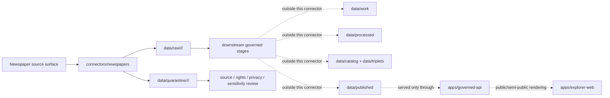
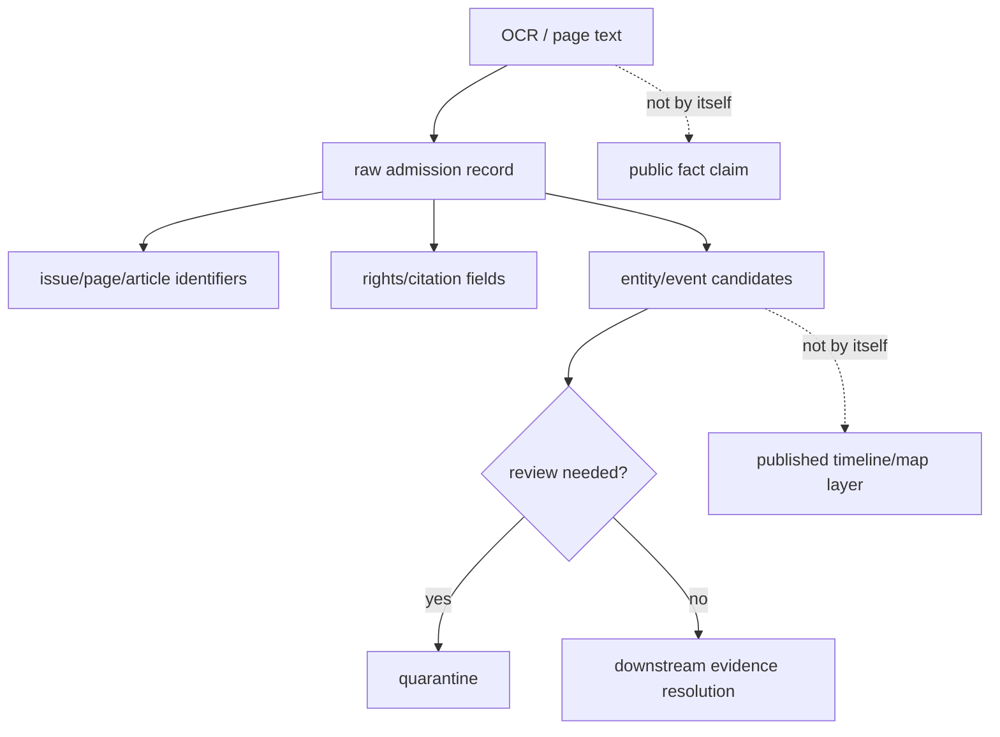

<!-- [KFM_META_BLOCK_V2]
doc_id: kfm://doc/connectors-newspapers-readme
title: connectors/newspapers/ — Newspaper Connector Family Lane
type: readme
version: v0.1
status: draft
owners: OWNER_TBD — Source steward · Connector steward · Archives steward · Genealogy steward · People-DNA-Land steward · Settlements steward · Data steward · Docs steward
created: 2026-06-19
updated: 2026-06-19
policy_label: public
related:
  - ../README.md
  - ../../docs/doctrine/directory-rules.md
  - ../../docs/sources/catalog/loc/README.md
  - ../../docs/sources/catalog/README.md
  - ../../docs/domains/genealogy/README.md
  - ../../docs/domains/people-dna-land/README.md
  - ../../docs/domains/settlements/README.md
  - ../../docs/standards/PROV.md
  - ../../data/registry/sources/
  - ../../data/raw/
  - ../../data/quarantine/
  - ../../data/receipts/
  - ../../data/proofs/
  - ../../policy/rights/
  - ../../policy/sensitivity/
  - ../../release/
tags: [kfm, connectors, newspapers, archives, chronicling-america, loc, ocr, iiif, genealogy, settlements, source-admission, raw, quarantine, governance]
notes:
  - "Parent connector-family lane for digitized newspaper source intake and admission helpers."
  - "Placement is draft / conflicted: Directory Rules §7.3 does not list newspapers/ in the canonical connector spine; keep placement unresolved until ADR or migration note."
  - "LOC/Chronicling America source-family doctrine belongs under docs/sources/catalog/loc/, not here."
  - "Connector output may enter raw or quarantine admission lanes only."
  - "OCR text is source material with transcription uncertainty, not authoritative fact."
  - "Rights, citation, living-person privacy, cultural sensitivity, and public-release posture fail closed until verified."
[/KFM_META_BLOCK_V2] -->

<a id="top"></a>

# Newspapers Connector Family

> Parent source-admission lane for digitized newspaper archive helpers, OCR/page-image intake, issue/page/article metadata capture, and provenance-preserving newspaper evidence candidates.

<p>
  
  
  
  
  
  
  
</p>

`connectors/newspapers/`

## Quick jumps

[Scope](#scope) · [Repo fit](#repo-fit) · [Nested connector lanes](#nested-connector-lanes) · [Lifecycle sketch](#lifecycle-sketch) · [Authority boundary](#authority-boundary) · [Inputs](#inputs) · [Exclusions](#exclusions) · [Admission posture](#admission-posture) · [OCR and evidence posture](#ocr-and-evidence-posture) · [Rights and sensitivity posture](#rights-and-sensitivity-posture) · [Placement status](#placement-status) · [Validation](#validation) · [Definition of done](#definition-of-done)

---

## Scope

`connectors/newspapers/` is the parent connector-family lane for newspaper-source intake and admission helpers.

This folder may contain connector-family documentation, shared helper notes, source-admission conventions, fixture pointers, page/OCR metadata capture guidance, and raw/quarantine routing guidance for digitized newspaper source surfaces.

It must not become newspaper truth, archival source-family authority, OCR authority, named-entity authority, genealogy truth, people truth, settlement truth, rights authority, privacy policy authority, schema authority, catalog/triplet authority, proof authority, release authority, pipeline authority, or publication authority.

> [!IMPORTANT]
> **Status:** draft / `PROPOSED_CONFLICTED`  
> **Owner:** `OWNER_TBD`  
> **Path:** `connectors/newspapers/`  
> **Truth posture:** the path exists in the repository as this README; source activation, endpoint behavior, credentials, tests, fixtures, CI wiring, rights status, OCR quality handling, living-person privacy handling, child-lane inventory, and placement ratification remain `NEEDS VERIFICATION`.

---

## Repo fit

```text
connectors/
└── newspapers/
    └── README.md
```

Related responsibility roots:

```text
connectors/                          # source-specific fetch and admission code
docs/sources/catalog/loc/            # LOC source-family doctrine; includes Chronicling America/LOC newspaper lineage
docs/sources/catalog/                # source-family catalog and open questions
docs/domains/genealogy/              # genealogy domain context where present
docs/domains/people-dna-land/        # people/land/DNA context and living-person sensitivity boundaries
docs/domains/settlements/            # settlement and place-history context where present
data/registry/sources/               # authoritative SourceDescriptors and activation state
data/raw/                            # raw staged outputs by owning domain
data/quarantine/                     # held material requiring source/rights/privacy/sensitivity review
data/receipts/                       # ingest, run, checksum, OCR, and extraction receipts
data/proofs/                         # EvidenceBundles and proof packs
policy/rights/                       # copyright, license, terms, citation, reuse, and attribution checks
policy/sensitivity/                  # living-person, cultural, sacred/burial, archaeology, and exact-location rules
release/                             # release decisions, manifests, rollback, correction state
apps/governed-api/                   # downstream public trust membrane, not connector-owned
apps/explorer-web/                   # downstream map UI, never direct RAW/QUARANTINE access
```

---

## Nested connector lanes

No nested service lanes are confirmed by this README.

| Lane | Purpose | Status | Boundary |
|---|---|---|---|
| `loc-chronam/` | Potential service lane for Chronicling America / LOC newspaper-source intake if ratified. | `PROPOSED` | Do not create until Directory Rules / ADR / migration note resolves placement. |
| `kansas-newspapers/` | Potential service lane for Kansas-specific newspaper archives if a distinct source surface is admitted. | `PROPOSED` | Must not replace source-catalog or domain authority. |
| `local-upload/` | Potential local-upload adapter for user-supplied clippings or scans. | `PROPOSED` | Prefer existing `connectors/local_upload/` unless ADR says otherwise. |

> [!CAUTION]
> Do not add nested service lanes just because a source mentions newspapers. Add a child lane only when it represents a distinct fetch/admission surface with a SourceDescriptor, rights posture, fixtures, and validation plan.

---

## Lifecycle sketch



> [!CAUTION]
> Connector code admits source material. It does not normalize, catalog, publish, answer public claims, decide historical truth, or decide release safety. Promotion remains a governed state transition, not a file move.

---

## Authority boundary

```text
OUTPUT LIMIT:
  data/raw/<domain>/<source_id>/<run_id>/
  data/quarantine/<domain>/<source_id>/<run_id>/

NOT HERE:
  source-family truth
  OCR correction authority
  named-entity truth
  genealogy or living-person truth
  place-history truth
  SourceDescriptor authority
  rights or sensitivity policy
  processed data
  catalog records
  triplet records
  receipts/proofs as authority
  release decisions
  published artifacts
  schemas/contracts
  generated reports
  public API behavior
  public UI behavior
```

---

## Inputs

| Accepted item | Required posture |
|---|---|
| Connector-family README and index | Orient newspaper connector lanes without claiming source activation, rights, release, or publication state. |
| Source adapter | Preserve source identity, request path, collection title, newspaper title, issue/page/article identity, retrieval time, response status, and review posture. |
| OCR text capture helper | Preserve OCR text as source text with uncertainty; never silently promote it to corrected transcription or fact. |
| Page/image/IIIF metadata helper | Preserve image or manifest identifiers, sequence/order, dimensions where available, rights fields, and content digests. |
| Clipping/article metadata helper | Preserve title, date, page, column, segment, bounding box, clipping URL, and source-specific identifiers where available. |
| NER/event candidate helper | Emit extraction candidates only; preserve model/tool version, prompt/config, confidence, and abstention state. |
| Rights/citation helper | Preserve terms, license, citation text, rights URL, collection constraints, and reuse limitations. |
| Privacy/sensitivity helper | Route living-person, minors, medical/legal, burial/sacred, archaeology, tribal, exact-location, or reputationally sensitive material to quarantine/review. |
| Credential/configuration notes | Document environment-variable expectations only; never commit keys, tokens, cookies, or session material. |
| Test references | Point to owning fixture/test roots; fixtures do not become source authority. |

---

## Exclusions

| Do not store here | Correct home |
|---|---|
| Newspaper source-family doctrine | `docs/sources/catalog/` or a ratified source-family subfolder such as `docs/sources/catalog/loc/` |
| Authoritative `SourceDescriptor` records | `data/registry/sources/` |
| Genealogy, people, settlement, archaeology, or domain doctrine | `docs/domains/` under the owning domain lane |
| Rights, terms, sensitivity, redaction, or release policy | `policy/rights/`, `policy/sensitivity/`, `policy/` |
| Processed OCR, entities, events, or place mentions | `data/processed/` |
| Catalog or triplet records | `data/catalog/`, `data/triplets/` |
| Receipts and proof packs as authority | `data/receipts/`, `data/proofs/` |
| Release decisions or rollback/correction records | `release/` |
| Published artifacts or public layers | `data/published/` after governed release |
| Schemas or semantic contracts | `schemas/`, `contracts/` |
| Generated reports | `artifacts/` |
| Public UI or API behavior | `apps/governed-api/`, `apps/explorer-web/` |

---

## Admission posture

Newspaper intake should preserve:

- source identity and source surface;
- source collection and publication title;
- issue, date, edition, page, article, clipping, or segment identifiers when available;
- request URL/path and query/body criteria, with secrets redacted;
- retrieval timestamp;
- response status, parse status, and content digest;
- OCR source text, page image references, manifests, or derivative text references;
- language, script, OCR confidence, or quality flags when available;
- rights, citation, collection, provider, and reuse fields;
- extraction/tool metadata for any NER/event candidates;
- domain-lane routing hint such as genealogy, settlements, roads/rail/trade, people-dna-land, archaeology, or local history;
- public-safe limitation notes;
- quarantine reason when review is required.

Newspaper-derived source material may inform Focus Mode context, settlement timelines, road/rail/trade events, people/land history, genealogy leads, institutional histories, and corroborating local-history claims. Connector output remains admission material. Confirmation, transcription correction, entity resolution, event modeling, EvidenceBundle production, catalog closure, public claims, publication, correction, and rollback belong to governed downstream stages.

---

## OCR and evidence posture

Newspaper OCR is useful, but it is noisy source material. KFM must keep OCR uncertainty visible.

| Rule | Connector implication |
|---|---|
| OCR text is not corrected transcription. | Preserve raw OCR separately from any downstream correction or interpretation. |
| Search hits are not evidence by themselves. | A hit must be tied to issue/page/article identity, retrieval metadata, and source rights before it becomes a candidate evidence item. |
| NER/event extraction is interpretive. | Extracted names, places, dates, and events remain candidates until resolved against evidence and policy. |
| Page image and OCR must stay linkable. | Preserve page/image/manifest identifiers and digests where available. |
| Quotes require review. | Do not publish long excerpts or copyrighted text without rights and citation review. |
| Contradictions are expected. | Preserve multiple newspaper accounts and source provenance rather than overwriting one account with another. |



---

## Rights and sensitivity posture

Newspaper material can involve mixed copyright status, platform terms, personal data, minors, crime/legal/medical information, reputational risk, sacred or burial sites, archaeology, tribal matters, and exact-location exposure. Treat unclear material as restricted until reviewed.

| Risk | Default action |
|---|---|
| Copyright or reuse terms unclear | Quarantine or admit with `rights_review_required = true`; do not publish excerpted text. |
| OCR-only person/place match | Keep as candidate; require evidence resolution before claim publication. |
| Living person or recent family data | Route to privacy/sensitivity review; minimize public detail. |
| Minors, medical, legal, crime, or reputational material | Quarantine or restrict unless release policy explicitly allows. |
| Tribal, sacred, burial, archaeology, or culturally sensitive content | Fail closed; generalize, restrict, delay, or deny public release as appropriate. |
| Exact sensitive locations | Generalize/redact before any public map display. |
| AI-generated summary | Treat as downstream carrier only; it is not source evidence. |

---

## Placement status

`connectors/newspapers/README.md` is intentionally conservative because the newspaper connector family is not yet fully ratified by Directory Rules.

| Claim | Status | Notes |
|---|---|---|
| `connectors/newspapers/README.md` contains this connector-family README | `CONFIRMED` after this update | The file itself now carries the connector boundary. |
| `connectors/newspapers/` is a source-admission lane only | `PROPOSED_CONFLICTED / draft` | Consistent with `connectors/` responsibility, but not listed in the canonical §7.3 connector spine. |
| LOC source-family docs already name Chronicling America and newspaper OCR lineage | `CONFIRMED` in repo evidence | Source-family authority remains under `docs/sources/catalog/loc/README.md`. |
| Newspaper connector placement is ADR-ratified | `NEEDS VERIFICATION` | Directory Rules §7.3 should be updated or an ADR/migration note should justify this lane. |
| Live newspaper `SourceDescriptor` records exist and are active | `NEEDS VERIFICATION` | Must be checked under `data/registry/sources/`. |
| Endpoint behavior, tests, fixtures, and CI are implemented | `UNKNOWN` | Not proven by this README. |
| Newspaper outputs are validated, cataloged, redacted, generalized, and published | `UNKNOWN` | Connector-family README does not prove downstream promotion. |

---

## Validation

Before relying on this connector family, verify:

- placement is intentional and documented by ADR, migration note, or updated Directory Rules;
- actual child connector lanes are inventoried and each has a README;
- source descriptors exist and are active for each newspaper source surface;
- rights, citation, reuse, copyright, privacy, and sensitivity handling are captured in source descriptors and release review;
- request/response shapes, paging, image/OCR retrieval, article/clipping identifiers, and error cases are fixture-tested;
- tests use no-network fixtures where practical;
- output paths are limited to raw/quarantine admission lanes;
- source-role, OCR uncertainty, provider, citation, and privacy/sensitivity metadata survive parsing;
- living-person, minors, medical/legal/crime, tribal/cultural, burial/sacred, archaeology, and exact-location paths fail closed;
- downstream receipts, proofs, catalog/triplet records, redaction/generalization records, and release records are produced only outside this connector family;
- public products are released only through governed publication controls.

---

## Definition of done

- [ ] Owners are confirmed and `OWNER_TBD` is replaced.
- [ ] Directory placement is ratified or the conflict is recorded in the drift/open-question register.
- [ ] Actual connector-family and child-lane contents are inventoried.
- [ ] Newspaper `SourceDescriptor` IDs and source-family activation are verified.
- [ ] Rights, citation/attribution, reuse limits, provider authority, privacy, and sensitivity posture are documented.
- [ ] Request builders preserve request path, service family, search criteria, paging, issue/page/article identifiers, and response status.
- [ ] OCR text, page image references, article/clipping metadata, provider fields, rights fields, and extraction metadata survive parsing.
- [ ] Outputs are verified to enter only raw or quarantine admission lanes.
- [ ] No source-family, domain, processed, catalog, triplet, published, release, schema, policy, proof, receipt, registry, fixture, report, API, or UI authority lives here.
- [ ] Tests, fixtures, and CI behavior are verified or marked `NEEDS VERIFICATION`.

---

## Status summary

`connectors/newspapers/` is a connector-family lane for newspaper source-admission work only. It is not source-family truth, OCR truth, named-entity truth, genealogy truth, people truth, settlement truth, policy authority, schema authority, catalog/triplet authority, proof closure, release authority, publication authority, public API behavior, public UI behavior, or pipeline authority.

<p align="right"><a href="#top">Back to top</a></p>
