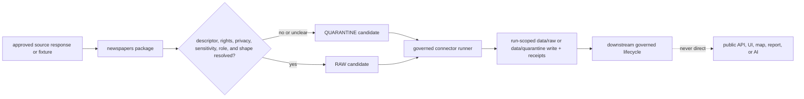

<!-- [KFM_META_BLOCK_V2]
doc_id: kfm://connectors/newspapers/src/readme
title: Newspaper Connector Source Root
path: connectors/newspapers/src/README.md
type: connector-source-root-readme
version: v0.2
prior_version: v0.1
prior_blob: f2f4cf5a998fbaadcdc1185a9d5700ea06c12504
base_commit: 654072bbb87450f1f0b6db8aaa1ee57e1a3bdf61
status: draft
owners: OWNER_TBD — source steward · connector steward · archives steward · genealogy steward · people-dna-land steward · settlements steward · validation steward · data steward · rights steward · sensitivity steward
created: 2026-06-19
updated: 2026-07-14
policy_label: restricted-review
truth_posture: cite-or-abstain
responsibility_root: connectors/
lifecycle_phase: source-admission
source_family: newspapers
related:
  - ../README.md
  - ./newspapers/README.md
  - ../tests/README.md
  - ../pyproject.toml
  - ../../README.md
  - ../../../docs/sources/catalog/newspapers/README.md
  - ../../../docs/sources/catalog/loc/README.md
  - ../../../docs/architecture/source-roles.md
  - ../../../docs/doctrine/directory-rules.md
  - ../../../data/registry/sources/README.md
  - ../../../schemas/contracts/v1/source/source_descriptor.schema.json
  - ../../../fixtures/README.md
tags:
  - kfm
  - connectors
  - newspapers
  - source-root
  - python
  - archives
  - ocr
  - iiif
  - genealogy
  - settlements
  - privacy
  - source-admission
  - raw
  - quarantine
  - rights-review
notes:
  - "The source root contains this README and the newspapers package directory; the package currently contains its README and an empty __init__.py."
  - "The merged package README is the detailed implementation contract; this file owns source-root placement, navigation, and shared boundaries."
  - "The distribution metadata remains a greenfield 0.0.0 placeholder; runtime modules, dedicated tests, fixtures, descriptors, and activation did not surface."
  - "Code below this root may prepare bounded RAW or QUARANTINE admission only and may not publish."
  - "OCR, entity/event extraction, rights, privacy, sensitivity, proof, release, and public claims remain outside source-root authority."
[/KFM_META_BLOCK_V2] -->

<a id="top"></a>

# Newspaper connector source root

Directory boundary for importable newspaper connector implementation under `connectors/newspapers/`.

<p>
  
  
  
  
  
</p>

> [!CAUTION]
> This source root may contain connector implementation code. It is not newspaper or OCR truth, person/entity/event/place authority, source-family doctrine, SourceDescriptor or schema authority, rights/privacy/sensitivity policy, proof or receipt authority, release authority, a public API, or generated-answer evidence.

---

## Quick contract

| Question | Source-root answer |
|---|---|
| What exists now? | This README, the `newspapers/` package directory, its v0.2 README, and an empty `__init__.py`. |
| Is runtime code implemented? | **No verified implementation.** Expected client/parser/OCR/IIIF/extraction modules are absent. |
| Is the package build-ready? | **No.** `pyproject.toml` remains a greenfield `0.0.0` placeholder. |
| Where are package details defined? | [`newspapers/README.md`](./newspapers/README.md). |
| Where are test requirements defined? | [`../tests/README.md`](../tests/README.md). |
| What may future source code produce? | Bounded admission material for `data/raw/<domain>/<source_id>/<run_id>/` or `data/quarantine/<domain>/<source_id>/<run_id>/` only. |
| Can source-root code decide truth or publish? | **No.** Those decisions belong to governed downstream authorities. |

---

## Verified repository state

The table records observations at base commit `654072bbb87450f1f0b6db8aaa1ee57e1a3bdf61`. Expected-path probes and targeted search show what surfaced during this update; they are not exhaustive proof of absence.

| Surface | Observed state | Source-root consequence |
|---|---|---|
| This README | Existing v0.1 at blob `f2f4cf5a998fbaadcdc1185a9d5700ea06c12504`. | v0.2 replaces unknown inventory claims with pinned evidence. |
| [`connectors/newspapers/README.md`](../README.md) | Parent family README exists and remains v0.1/draft. | Source root inherits source-admission-only and no-publication boundaries. |
| [`newspapers/README.md`](./newspapers/README.md) | v0.2 package contract is merged. | Module/product/runtime detail is delegated to the child README. |
| `newspapers/__init__.py` | Empty Git blob `e69de29bb2d1d6434b8b29ae775ad8c2e48c5391`. | No public imports or import-time behavior are implemented. |
| Expected runtime modules | `config.py`, `client.py`, `parser.py`, `ocr.py`, `iiif.py`, `extraction.py`, `sensitivity.py`, `envelope.py`, and `errors.py` were absent at expected paths. | Source-root implementation remains a scaffold. |
| [`connectors/newspapers/pyproject.toml`](../pyproject.toml) | Greenfield distribution placeholder `kfm-connector-newspapers`, version `0.0.0`. | Installability, dependencies, entry points, and build behavior are unverified. |
| [`connectors/newspapers/tests/README.md`](../tests/README.md) | Test contract README exists; no `test_newspapers` result or expected dedicated test module surfaced. | No passing package/source-root coverage is claimed. |
| Newspaper fixtures | No dedicated newspaper payload fixture surfaced in targeted search. | Fixture implementation remains proposed. |
| [`docs/sources/catalog/newspapers/README.md`](../../../docs/sources/catalog/newspapers/README.md) | Newspaper source-family and product documentation exists. | Source doctrine is external to this implementation root and does not activate it. |
| [`docs/sources/catalog/loc/README.md`](../../../docs/sources/catalog/loc/README.md) | LOC source-family documentation exists. | LOC/Chronicling America identity and terms remain source-catalog concerns. |
| Expected newspaper/ChronAm SourceDescriptors | No checked descriptor path existed. | Live source activation is not established. |
| [`source_descriptor.schema.json`](../../../schemas/contracts/v1/source/source_descriptor.schema.json) | SourceDescriptor schema exists. | Source code may validate against accepted schema tooling; it does not own schema meaning or shape. |
| `.github/CODEOWNERS` | No newspapers-specific ownership rule surfaced. | Owners remain `OWNER_TBD`. |

> [!IMPORTANT]
> Directory, README, and empty initializer presence prove scaffolding only. They do not prove package importability, network behavior, parsing, privacy/sensitivity enforcement, tests, descriptors, activation, or public readiness.

---

## Repository and placement boundary

```text
connectors/
└── newspapers/
    ├── README.md                    # parent connector-family boundary
    ├── pyproject.toml               # 0.0.0 greenfield placeholder
    ├── src/
    │   ├── README.md                # this source-root boundary
    │   └── newspapers/
    │       ├── README.md            # package implementation contract
    │       └── __init__.py          # empty at the pinned base
    └── tests/
        └── README.md                # test contract; no test modules verified
```

Directory Rules §7.3 confirms `connectors/` as the source fetch/admission root, restricts output to RAW or QUARANTINE, and forbids publication. It does not ratify `connectors/newspapers/` in its example spine or prescribe this Python `src/` layout.

Treat placement as:

- **CONFIRMED repository path** — root/package/test scaffolding exists;
- **CONFIRMED responsibility fit** — source-specific fetch/parse/admit code belongs under `connectors/`;
- **PROPOSED package layout** — `src/newspapers/` exists but is not proven buildable;
- **non-authoritative** — this README cannot settle connector, packaging, schema, policy, or lifecycle authority.

Do not create parallel `connectors/newspaper/`, `connectors/chronam/`, top-level `newspapers/`, or domain-owned fetch roots to avoid placement questions. Use an ADR or migration note with import/link redirects, owner review, and rollback instructions.

---

## Source-root responsibility split

| Responsibility | Correct owner | Source-root rule |
|---|---|---|
| Connector-family scope and child indexing | [`connectors/newspapers/README.md`](../README.md) | Source code follows the family boundary; it does not redefine it. |
| Package implementation contract | [`newspapers/README.md`](./newspapers/README.md) | Module, product, import, outcome, and activation details live in the package README. |
| Connector-local tests | [`../tests/README.md`](../tests/README.md) and future test modules | Production source does not embed tests or fixture payloads. |
| Source-family/product doctrine | [`docs/sources/catalog/newspapers/`](../../../docs/sources/catalog/newspapers/README.md) and LOC catalog | Code preserves upstream semantics; it does not author source doctrine. |
| Source identity/admission authority | [`data/registry/sources/`](../../../data/registry/sources/README.md) | Source code requires a current descriptor/activation decision; it does not create authority records silently. |
| Machine shape | [`schemas/contracts/v1/source/`](../../../schemas/contracts/v1/source/source_descriptor.schema.json) | Source root may call validators; schema files do not live here. |
| Runtime/synthetic fixture corpora | [`fixtures/`](../../../fixtures/README.md) when accepted | Do not duplicate fixture corpora or treat examples as truth. |
| Rights/privacy/sensitivity policy | `policy/rights/` and `policy/sensitivity/` | Package-local signals are inputs; canonical decisions live outside source code. |
| Lifecycle data | `data/raw/` and `data/quarantine/` via a governed runner | Source modules return bounded objects; a runner owns recorded writes. |
| Proof/release/public output | proof, release, published, governed API/UI roots | Source root cannot issue, promote, release, or serve them. |

---

## What belongs under `src/`

Allowed source-root content:

- importable package directories;
- package-local implementation modules and constants;
- package README/boundary files;
- typed data structures for source requests, parsed candidates, finite errors, and admission handoffs;
- adapters that preserve source identity, rights, sensitivity, source role, provenance, and digests;
- no-network-safe parsing and validation helpers.

Do not place here:

- source descriptors, activation decisions, or registry indexes;
- schemas, semantic contracts, rights/privacy/sensitivity policy, or release rules;
- real RAW/QUARANTINE/processed/catalog/published data;
- test payloads, large OCR dumps, page-image corpora, or private archive exports;
- credentials, cookies, tokens, signed URLs, session material, or developer-local caches;
- generated reports, public API/UI payloads, search/vector indexes, receipts, proofs, or release manifests;
- authoritative corrections, entity/person/event/place resolutions, or public claims.

Add another package under this source root only if it has a distinct accepted responsibility. Do not split by downstream domain merely because newspaper material can inform genealogy, settlements, archaeology, hazards, roads/rail/trade, or People/DNA/Land.

---

## Import, build, and dependency posture

At the pinned base, only the empty initializer was verified. The remote-only inspection did not run package import or build commands.

Future rules:

| Concern | Required behavior |
|---|---|
| Imports | No network, credential lookup, cache mutation, filesystem write, source activation, or logging configuration at import time. |
| Package metadata | Declare build backend, dependencies, Python support, package discovery, and entry points explicitly before claiming installability. |
| Dependencies | Minimal, pinned/managed by repository convention, license-reviewed, and free of hidden live access. |
| Configuration | Parsed explicitly at runtime; no real secrets or permissive live defaults. |
| Network | Disabled in unit tests/dry runs; approved live behavior is explicit, finite, and observable. |
| Determinism | Same payload/config/version produces the same parse/admission candidate and digest. |
| Writes | No unscoped writes; a governed caller resolves the run-specific RAW/QUARANTINE destination. |
| Logging | Structured and secret-safe; no full copyrighted text or sensitive person/location details. |
| Publication | No source-root module can publish or serve public output. |

Shared utilities should not be lifted into the source root or a common package until at least two consumers, an accepted responsibility, tests, and a non-competing canonical home are demonstrated.

---

## Product and claim separation

Source-root code must preserve product distinctions established by the package contract and source catalog:

- page/image artifact versus OCR;
- raw OCR versus corrected transcription;
- issue/page identity versus article/clipping segmentation;
- printed report versus downstream event adjudication;
- legal notice versus final legal/title/regulatory truth;
- obituary assertion versus verified identity, life event, or family relationship;
- extraction candidate versus evidence-backed person/place/event claim;
- public discoverability versus rights/privacy/sensitivity-cleared reuse.

The canonical source-role enum is:

`observed | regulatory | modeled | aggregate | administrative | candidate | synthetic`

Source roles belong in reviewed SourceDescriptors per product and intended claim. Source-root code must not assign one family-wide role or coerce draft vocabulary such as `observation` into a canonical enum. Unresolved role goes to quarantine/review.

---

## Lifecycle handoff



Source modules should return typed candidates or finite failures. The governed connector runner—not arbitrary parser code—resolves and records the final admission destination, checksums, SourceDescriptor reference, and ingest/run receipts.

Permitted lifecycle destinations:

```text
data/raw/<domain>/<source_id>/<run_id>/
data/quarantine/<domain>/<source_id>/<run_id>/
```

The source root must not write directly to WORK, PROCESSED, CATALOG, TRIPLET, PUBLISHED, proof, release, policy, schema, API, UI, report, search-index, vector-index, or AI-answer stores.

---

## Rights, privacy, and sensitivity boundary

The source root may preserve upstream rights statements and produce structured risk signals. It cannot make the authoritative decision.

Fail closed when any of these is absent, unclear, conflicting, or stale:

- provider/collection/product identity and terms;
- copyright, license, citation, attribution, excerpt, download, retention, deletion, or redistribution conditions;
- intended use, audience, public precision, and derivative class;
- living-person, minor, medical/legal/crime/reputational, adoption/parentage, or family-sensitive state;
- tribal, cultural, sacred, burial, archaeology, or repatriation sensitivity;
- exact person/site/resource location or mosaic/inference risk;
- page/OCR/extraction provenance needed to interpret or review the record.

Never put real secrets, private archive material, unbounded copyrighted OCR, or sensitive person/location data in source code, errors, logs, fixtures, PRs, or public receipts.

---

## Testing relationship

Production code under `src/` should be designed for deterministic, no-network tests under `connectors/newspapers/tests/`.

Minimum future coverage:

- import and build smoke without network, credentials, cache mutation, or writes;
- descriptor and activation gating;
- finite timeout/retry/paging/rate-limit/partial-result behavior;
- page/image, OCR, correction, segmentation, and extraction provenance preservation;
- canonical source-role validation and unresolved-role quarantine;
- rights/privacy/sensitivity allow/deny/restrict/abstain cases;
- malformed, empty, duplicate, drifted, and secret-bearing inputs;
- run-scoped RAW/QUARANTINE-only handoff and output-escape denial;
- proof that source-root code cannot publish, resolve truth, or serve UI/API/AI outputs.

The test README documents expected fixture rules, but no dedicated test module or newspaper payload fixture surfaced at the pinned base. Do not claim coverage from the existence of that README.

---

## Activation gates

Keep runtime implementation absent or disabled until all applicable items are evidenced:

- [ ] Source-root/package placement and owners are accepted.
- [ ] `pyproject.toml` defines a real build/package contract and import smoke passes.
- [ ] Actual modules replace the proposed package inventory and remain import-side-effect-free.
- [ ] Complete SourceDescriptors and activation decisions exist for each source/product/access tier.
- [ ] Product-specific source roles use the canonical enum and preserve role-conditional metadata.
- [ ] Rights, citation, privacy, sensitivity, retention/deletion, and intended-use decisions are current.
- [ ] Network, rate-limit, paging/job, retry, timeout, cache, and drift behavior is finite and tested.
- [ ] Page/OCR/correction/segmentation/extraction provenance is lossless and hash-bound.
- [ ] Dedicated no-network valid/invalid/sensitive/partial/drift fixtures and tests exist.
- [ ] Output-boundary and public-shortcut tests pass.
- [ ] Rollback disables activation without deleting descriptor, RAW, quarantine, receipt, proof, correction, or release history.

---

## Evidence and change ledger

| Claim | Status | Evidence / limit |
|---|---|---|
| The source-root path exists. | **CONFIRMED** | This README and `newspapers/` package directory exist. |
| The package contract is current. | **CONFIRMED** | Merged `newspapers/README.md` v0.2. |
| Runtime source modules are implemented. | **DENY** | Only the empty initializer surfaced; expected modules were absent. |
| The package is build/install-ready. | **DENY** | `pyproject.toml` is a `0.0.0` greenfield placeholder. |
| Dedicated tests and newspaper fixtures exist. | **UNKNOWN / not surfaced** | Test README exists; expected test modules/payloads did not surface. |
| Newspaper source-family docs exist. | **CONFIRMED** | Newspaper and LOC catalogs exist; they do not activate code. |
| A complete active newspaper SourceDescriptor exists. | **NEEDS VERIFICATION** | Checked newspaper/ChronAm descriptor paths were absent. |
| OCR or extraction output is authoritative. | **DENY** | Product separation and downstream evidence resolution are required. |
| Public source access permits publication. | **DENY** | Product/use-specific rights/privacy/sensitivity review is required. |
| Source-root output is public-ready. | **DENY** | Connector output stops at RAW/QUARANTINE admission. |

### What changed from v0.1

- replaced unknown source-root inventory with the confirmed README/package/empty-initializer scaffold;
- synchronized the source root with the merged package v0.2 contract;
- recorded the `0.0.0` greenfield package metadata and absent runtime/test/fixture/descriptor state;
- clarified source-root versus package, test, source-catalog, registry/schema, fixture, policy, data, proof, release, and public responsibilities;
- removed illustrative import examples that could be mistaken for implemented APIs;
- added product/claim separation, canonical role handling, governed-runner handoff, import/build rules, activation gates, and pinned evidence;
- preserved v0.1's source-admission-only, RAW/QUARANTINE-only, OCR/extraction-candidate, no-secret, no-publication, and fail-closed rights/privacy/sensitivity boundaries.

---

## Rollback

This is a documentation-only update. Restore the exact prior README from blob:

```text
f2f4cf5a998fbaadcdc1185a9d5700ea06c12504
```

Rolling back this document does not implement, activate, build, or disable a connector and must not alter package code, tests, fixtures, SourceDescriptors, rights/privacy/sensitivity decisions, RAW/QUARANTINE data, receipts, proofs, corrections, or releases.

---

## Related files

- [`connectors/newspapers/README.md`](../README.md)
- [`connectors/newspapers/src/newspapers/README.md`](./newspapers/README.md)
- [`connectors/newspapers/tests/README.md`](../tests/README.md)
- [`connectors/newspapers/pyproject.toml`](../pyproject.toml)
- [`connectors/README.md`](../../README.md)
- [`docs/sources/catalog/newspapers/README.md`](../../../docs/sources/catalog/newspapers/README.md)
- [`docs/sources/catalog/loc/README.md`](../../../docs/sources/catalog/loc/README.md)
- [`docs/architecture/source-roles.md`](../../../docs/architecture/source-roles.md)
- [`docs/doctrine/directory-rules.md`](../../../docs/doctrine/directory-rules.md)
- [`data/registry/sources/README.md`](../../../data/registry/sources/README.md)
- [`schemas/contracts/v1/source/source_descriptor.schema.json`](../../../schemas/contracts/v1/source/source_descriptor.schema.json)
- [`fixtures/README.md`](../../../fixtures/README.md)

---

KFM rule: `connectors/newspapers/src/` contains bounded newspaper connector implementation only. It does not decide newspaper truth, transcription truth, identity, relationship, event, place, rights, privacy, sensitivity, proof, release, publication, public presentation, or generated-answer truth.

[Back to top](#top)
