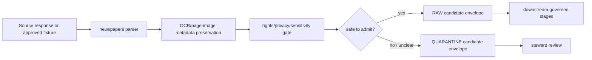

<!-- [KFM_META_BLOCK_V2]
doc_id: kfm://doc/connectors-newspapers-src-readme
title: connectors/newspapers/src/ — Newspaper Connector Source Root
type: readme
version: v0.1
status: draft
owners: OWNER_TBD — Source steward · Connector steward · Archives steward · Genealogy steward · People-DNA-Land steward · Settlements steward · Validation steward · Data steward · Docs steward
created: 2026-06-19
updated: 2026-06-19
policy_label: public-doctrine; rights-privacy-sensitivity-gated
proposed_path: connectors/newspapers/src/README.md
truth_posture: CONFIRMED path exists / PROPOSED source-root contract / UNKNOWN implementation depth
related:
  - ../README.md
  - newspapers/README.md
  - ../tests/README.md
  - ../../../docs/doctrine/directory-rules.md
  - ../../../docs/sources/catalog/loc/README.md
  - ../../../docs/sources/catalog/README.md
  - ../../../docs/domains/genealogy/README.md
  - ../../../docs/domains/people-dna-land/README.md
  - ../../../docs/domains/settlements/README.md
  - ../../../data/registry/sources/
  - ../../../data/raw/
  - ../../../data/quarantine/
  - ../../../fixtures/
  - ../../../schemas/contracts/v1/source/
  - ../../../policy/rights/
  - ../../../policy/sensitivity/
  - ../../../release/
tags: [kfm, connectors, newspapers, source-root, python, archives, chronicling-america, loc, ocr, iiif, genealogy, settlements, privacy, source-admission, raw, quarantine, governance]
notes:
  - "This README documents the connector source-code root, not newspaper source truth, OCR truth, person identity truth, event truth, rights authority, privacy authority, or publication authority."
  - "The implementation package below this root may prepare source material for RAW or QUARANTINE admission only."
  - "Concrete package metadata, modules, imports, source descriptors, endpoint coverage, tests, fixtures, rights/privacy/sensitivity gates, and CI wiring remain NEEDS VERIFICATION until inspected in the mounted repo."
  - "OCR text, page-image metadata, and NER/event extraction outputs remain candidate source material unless downstream evidence governance promotes them."
[/KFM_META_BLOCK_V2] -->

<a id="top"></a>

# Newspaper Connector Source Root

> Source-code root for the newspaper connector implementation under `connectors/newspapers/`.

<p>
  
  
  
  
  
  
  
</p>

`connectors/newspapers/src/`

## Quick jumps

[Scope](#scope) · [Repository fit](#repository-fit) · [Authority boundary](#authority-boundary) · [Expected contents](#expected-contents) · [Import and packaging posture](#import-and-packaging-posture) · [Lifecycle handoff](#lifecycle-handoff) · [Rights, privacy, and sensitivity posture](#rights-privacy-and-sensitivity-posture) · [Testing relationship](#testing-relationship) · [Definition of done](#definition-of-done) · [Verification backlog](#verification-backlog)

---

## Scope

`connectors/newspapers/src/` is the implementation source root for the newspaper connector lane.

This folder may contain importable connector code that supports newspaper source intake, bounded source requests, OCR/page-image parsing, metadata preservation, extraction-candidate shaping, rights/privacy/sensitivity gating, normalization into source-admission envelopes, and safe handoff toward RAW or QUARANTINE lifecycle states.

It must not contain:

- newspaper source truth;
- OCR correction authority;
- named-entity truth;
- person identity authority;
- event truth;
- genealogy truth;
- settlement truth;
- source registry authority;
- rights, privacy, or sensitivity policy authority;
- schema authority;
- processed domain records;
- published records;
- release decisions;
- proof packs;
- credentials, tokens, cookies, or private archive session exports;
- copyrighted bulk OCR dumps unless explicitly steward-approved and rights-cleared;
- UI-facing claim text.

> [!IMPORTANT]
> This root is for connector implementation code. It does not replace `connectors/newspapers/README.md`, `connectors/newspapers/tests/README.md`, source catalog documentation, source descriptors, contracts, schemas, rights/privacy/sensitivity policy, release records, or downstream pipeline documentation.

---

## Repository fit

```text
connectors/
└── newspapers/
    ├── README.md                    # connector-lane overview
    ├── src/
    │   ├── README.md                # this file
    │   └── newspapers/
    │       └── README.md            # implementation-package boundary
    └── tests/
        └── README.md                # connector-local tests
```

Related responsibility roots:

```text
connectors/                          # source-specific fetch and admission code
docs/sources/catalog/loc/            # LOC/Chronicling America newspaper-source lineage where applicable
docs/sources/catalog/                # source-family catalog and open questions
docs/domains/genealogy/              # genealogy domain context where present
docs/domains/people-dna-land/        # people/land/DNA context and living-person sensitivity boundaries
docs/domains/settlements/            # settlement and place-history context where present
data/registry/sources/               # source descriptors and activation state
data/raw/                            # raw staged source outputs, if admitted
data/quarantine/                     # held material requiring source/rights/privacy/sensitivity review
fixtures/                            # shared test fixtures, when promoted out of connector-local scope
schemas/contracts/v1/source/         # source/admission schemas, subject to ADR/schema-home convention
policy/rights/                       # copyright, license, terms, citation, reuse, and attribution checks
policy/sensitivity/                  # privacy, cultural, sacred/burial, archaeology, and exact-location gates
release/                             # release decisions, rollback, and correction state
```

Path names involving newspaper sources, LOC/Chronicling America, Kansas newspaper archives, or local uploads may be affected by source-family placement decisions. Verify against accepted Directory Rules and ADRs before adding new sibling paths.

---

## Authority boundary

```text
THIS SOURCE ROOT MAY CONTAIN:
  connector implementation code
  bounded client helpers
  parser helpers
  OCR/page-image metadata helpers
  IIIF/manifest metadata helpers
  extraction-candidate helpers
  rights/privacy/sensitivity gate helpers
  source-admission envelope builders
  connector-local error classes
  small package-local constants
  package README files

THIS SOURCE ROOT MUST NOT CONTAIN:
  source descriptors as authority records
  rights, privacy, or sensitivity policy decisions
  schemas as authority records
  release manifests
  publication outputs
  processed OCR/entity/event records
  raw private source dumps
  credentials, tokens, cookies, or private archive session material
  generated truth claims
```

The newspaper connector source root participates at the source-admission edge only:

```text
Newspaper source material
  -> connectors/newspapers/src/
  -> data/raw/ or data/quarantine/
  -> downstream governed processing, validation, evidence closure, rights/sensitivity review, release
```

It must not short-circuit the KFM lifecycle:

```text
RAW -> WORK / QUARANTINE -> PROCESSED -> CATALOG / TRIPLET -> PUBLISHED
```

---

## Expected contents

The exact implementation inventory is **NEEDS VERIFICATION**. A minimal source-root structure may look like this:

```text
connectors/newspapers/src/
├── README.md
└── newspapers/
    ├── README.md
    ├── __init__.py
    ├── config.py
    ├── client.py
    ├── parser.py
    ├── ocr.py
    ├── iiif.py
    ├── extraction.py
    ├── sensitivity.py
    ├── envelope.py
    └── errors.py
```

Recommended separation:

| Area | Responsibility |
|---|---|
| `newspapers/config.py` | Configuration parsing, feature flags, no-network defaults, endpoint keys, timeout policy, and live-test opt-in flags. |
| `newspapers/client.py` | Bounded request helpers; no live access unless explicitly enabled and reviewed. |
| `newspapers/parser.py` | Payload parsing from synthetic fixtures or steward-approved source responses without asserting truth. |
| `newspapers/ocr.py` | OCR text, OCR-quality, source-engine/version, and uncertain-transcription helpers. |
| `newspapers/iiif.py` | IIIF/page-image/manifest/canvas/sequence/bounding-box metadata helpers where applicable. |
| `newspapers/extraction.py` | Candidate extraction objects for names, places, dates, events, article segments, and clipping references. |
| `newspapers/sensitivity.py` | Rights/privacy/sensitivity gate helpers for living-person, minor, medical/legal/crime, reputational, tribal, sacred/burial, archaeology, and exact-location risks. |
| `newspapers/envelope.py` | Source-admission envelope construction with source references, lifecycle target, digest support, review flags, and quarantine reasons. |
| `newspapers/errors.py` | Finite connector errors safe for logs and review. |
| `newspapers/__init__.py` | Small import surface that does not trigger network, secret, archive-cache, or filesystem side effects. |

Avoid adding shared utilities here until more than one connector needs them. Shared connector patterns should move to a governed shared package or tool home after review.

---

## Import and packaging posture

Expected posture:

- importing the package should not make network calls;
- importing the package should not require archive accounts;
- importing the package should not read API keys, tokens, cookies, private archive exports, or session files;
- package-level code should avoid reading live environment secrets at import time;
- optional live behavior should be invoked explicitly;
- parser and sensitivity-gate functions should operate on supplied payloads or fixtures;
- connector outputs should be deterministic for the same input payload and connector configuration;
- source descriptors, schema validation, rights checks, privacy checks, and sensitivity checks should remain explicit dependencies, not hidden side effects.

Likely import shape, subject to repo verification:

```python
from newspapers.parser import parse_payload
from newspapers.sensitivity import evaluate_sensitivity_gate
from newspapers.envelope import build_source_admission_envelope
```

Do not treat this example as implementation proof until the mounted repo confirms module names and packaging configuration.

---

## Lifecycle handoff

Expected handoff sequence:



This root should return handoff envelopes or finite errors. It should not write lifecycle stores directly unless a downstream connector runner owns and records that write with receipts.

---

## Rights, privacy, and sensitivity posture

Default posture:

| Concern | Required behavior |
|---|---|
| Copyright, license, citation, reuse, or platform terms unclear | Return review-required or quarantine outcome. |
| OCR uncertainty | Preserve uncertainty; do not silently correct into authoritative transcription. |
| Named entities | Emit candidates only; do not resolve person/place/entity truth. |
| Living-person material | Deny, restrict, or quarantine/review-required by default. |
| Minors, medical/legal/crime, reputational, and family-sensitive content | Fail closed. |
| Tribal, sacred/burial, archaeology, and culturally sensitive content | Fail closed and require review. |
| Exact-location exposure | Route to redaction/generalization review. |
| AI/model extraction | Preserve tool/config/confidence/review metadata; never treat generated extraction as evidence by itself. |

---

## Testing relationship

Connector-local tests live under:

```text
connectors/newspapers/tests/
```

This source root should be designed so tests can verify:

- import safety;
- no-network defaults;
- no-secret defaults;
- descriptor gate behavior;
- rights/citation/reuse gate behavior;
- OCR uncertainty preservation;
- page-image / IIIF metadata preservation;
- provider, collection, issue, page, article, clipping, retrieval, and digest provenance;
- extraction-candidate metadata and abstention/review state;
- privacy and sensitivity fail-closed behavior;
- malformed payload handling;
- RAW or QUARANTINE envelope targeting;
- refusal to write processed/catalog/triplet/published/proof/receipt/release/API/UI outputs.

---

## Definition of done

- [ ] Owners are confirmed and `OWNER_TBD` is replaced.
- [ ] Actual source-root files are inventoried and this README is updated from `PROPOSED` layout to implementation-aware layout.
- [ ] Importing package modules performs no network, secret, archive-cache, or unsafe filesystem side effects.
- [ ] Source descriptors and activation decisions are required before live access.
- [ ] Rights, citation, reuse, platform terms, privacy, and sensitivity gates fail closed.
- [ ] OCR text remains uncertain source material unless downstream correction records exist.
- [ ] Issue/page/article/clipping/image/provenance metadata survives parsing.
- [ ] Extraction candidates preserve tool/config/confidence/review metadata and remain non-authoritative.
- [ ] Output is limited to RAW or QUARANTINE admission envelopes.
- [ ] Tests cover DENY, ABSTAIN, ERROR, and quarantine paths, not only happy paths.
- [ ] CI behavior is verified or marked `NEEDS VERIFICATION`.

---

## Verification backlog

| Item | Status | Needed evidence |
|---|---:|---|
| Confirm actual source-root files below this path. | **NEEDS VERIFICATION** | Repo tree or mounted workspace. |
| Confirm package manager and import path. | **NEEDS VERIFICATION** | `pyproject.toml`, workspace config, Makefile, or CI workflow. |
| Confirm source descriptor IDs and activation state. | **NEEDS VERIFICATION** | `data/registry/sources/` entries and accepted source schema. |
| Confirm newspaper source surfaces covered by this source root. | **NEEDS VERIFICATION** | Source-catalog entries, ADR, connector inventory, and tests. |
| Confirm rights, privacy, and sensitivity gate implementation. | **NEEDS VERIFICATION** | Policy docs, parser code, tests, and steward review. |
| Confirm OCR/page-image/IIIF parser behavior. | **NEEDS VERIFICATION** | Parser code, fixtures, and test logs. |
| Confirm CI wiring. | **NEEDS VERIFICATION** | Workflow files and current CI logs. |

---

## Maintainer note

Keep this source root import-safe, small, fixture-testable, and conservative. If a change makes claims true, publishes records, resolves people, corrects OCR authoritatively, chooses release posture, or bypasses rights/privacy/sensitivity review, it belongs outside this source root or behind downstream governance.

<p align="right"><a href="#top">Back to top</a></p>
