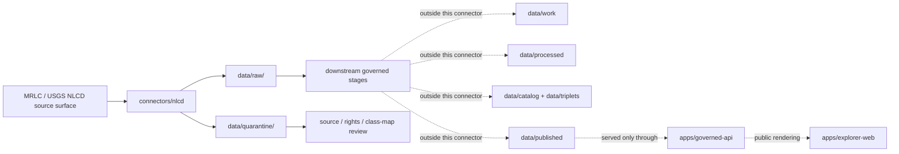

<!-- [KFM_META_BLOCK_V2]
doc_id: kfm://doc/connectors-nlcd-readme
title: connectors/nlcd/ — NLCD Connector Lane
type: readme
version: v0.1
status: draft
owners: OWNER_TBD — Source steward · Connector steward · Habitat steward · Agriculture steward · Hydrology steward · Spatial steward · Data steward · Docs steward
created: 2026-06-19
updated: 2026-06-19
policy_label: public
related:
  - ../README.md
  - ../../docs/doctrine/directory-rules.md
  - ../../docs/sources/catalog/usgs/nlcd.md
  - ../../docs/sources/catalog/usgs/README.md
  - ../../docs/domains/habitat/sublanes/land_cover.md
  - ../../data/registry/sources/usgs/
  - ../../data/registry/sources/mrlc/
  - ../../data/raw/
  - ../../data/quarantine/
  - ../../data/receipts/
  - ../../data/proofs/
  - ../../policy/rights/
  - ../../policy/sensitivity/
  - ../../release/
tags: [kfm, connectors, nlcd, usgs, mrlc, land-cover, raster, classification, modeled, habitat, agriculture, hydrology, spatial-foundation, source-admission, raw, quarantine, governance]
notes:
  - "Connector lane for National Land Cover Database source intake and admission helpers."
  - "Placement is draft / open: Directory Rules §7.3 does not list nlcd/ in the canonical connector spine; source catalog also preserves connectors/nlcd/ versus connectors/usgs/nlcd_ingester/ as an ADR question."
  - "Source-family and product truth belong under docs/sources/catalog/usgs/nlcd.md and source descriptors, not here."
  - "Connector output may enter raw or quarantine admission lanes only."
  - "NLCD pixels are modeled/classifier-assigned source values, not direct field measurements."
  - "Class-map version, epoch, sub-product, projection, resolution, source URL, and digest must be preserved."
[/KFM_META_BLOCK_V2] -->

<a id="top"></a>

# NLCD Connector

> Source-specific intake and admission lane for National Land Cover Database land-cover raster source material, including land-cover, change, confidence, impervious, and related MRLC/USGS distribution surfaces.

<p>
  
  
  
  
  
  
</p>

`connectors/nlcd/`

## Quick jumps

[Scope](#scope) · [Repo fit](#repo-fit) · [Lifecycle sketch](#lifecycle-sketch) · [Authority boundary](#authority-boundary) · [Inputs](#inputs) · [Exclusions](#exclusions) · [Source interface notes](#source-interface-notes) · [Admission posture](#admission-posture) · [Raster and class-map posture](#raster-and-class-map-posture) · [Placement status](#placement-status) · [Validation](#validation) · [Definition of done](#definition-of-done)

---

## Scope

`connectors/nlcd/` is the connector lane for NLCD source intake and admission helpers.

This folder may contain connector-local documentation, source-admission helpers, request or download manifest builders, raster sidecar parsers, no-network fixture pointers, and raw/quarantine output adapters for NLCD products used by KFM Habitat, Agriculture, Hydrology, Spatial Foundation, Focus Mode, and land-cover crosswalk lanes.

It must not become land-cover truth, source-family authority, classification taxonomy authority, crosswalk authority, policy authority, schema authority, catalog/triplet authority, proof authority, release authority, pipeline authority, or publication authority.

> [!IMPORTANT]
> **Status:** draft / `NEEDS VERIFICATION`  
> **Owner:** `OWNER_TBD`  
> **Path:** `connectors/nlcd/`  
> **Truth posture:** the path exists in the repository as this README; source activation, endpoint behavior, download URLs, tests, fixtures, CI wiring, rights status, raster parser behavior, class-map handling, and placement ratification remain `NEEDS VERIFICATION`.

---

## Repo fit

```text
connectors/
└── nlcd/
    └── README.md
```

Related responsibility roots:

```text
connectors/                          # source-specific fetch and admission code
docs/sources/catalog/usgs/nlcd.md    # NLCD source-product doctrine and product boundary
docs/sources/catalog/usgs/           # USGS source-family catalog
data/registry/sources/usgs/          # possible SourceDescriptor home; placement NEEDS VERIFICATION
data/registry/sources/mrlc/          # possible SourceDescriptor home; placement NEEDS VERIFICATION
data/raw/                            # raw staged outputs by owning domain
data/quarantine/                     # held material requiring source/rights/version/class-map review
data/receipts/                       # ingest, checksum, raster, class-map, and transform receipts
data/proofs/                         # EvidenceBundles and proof packs
policy/rights/                       # rights, terms, and attribution review
policy/sensitivity/                  # sensitivity and release-safety rules
release/                             # release decisions, manifests, rollback, correction state
apps/governed-api/                   # downstream public trust membrane, not connector-owned
apps/explorer-web/                   # downstream map UI, never direct RAW/QUARANTINE access
```

---

## Lifecycle sketch



> [!CAUTION]
> Connector code admits source material. It does not normalize rasters into truth, reconcile class maps, build public tiles, catalog products, publish layers, answer public claims, or decide release state. Promotion remains a governed state transition, not a file move.

---

## Authority boundary

```text
OUTPUT LIMIT:
  data/raw/<domain>/<source_id>/<run_id>/
  data/quarantine/<domain>/<source_id>/<run_id>/

NOT HERE:
  source-family truth
  NLCD product doctrine
  MRLC/USGS source authority
  classification taxonomy authority
  class-map crosswalk authority
  raster schema authority
  source descriptor authority
  rights or sensitivity policy
  processed raster derivatives
  catalog records
  triplet records
  tiles or public map artifacts
  receipts/proofs as authority
  release decisions
  published artifacts
  public API behavior
  public UI behavior
```

---

## Inputs

| Accepted item | Required posture |
|---|---|
| Source adapter | Preserve source identity, product family, request/download URL, retrieval time, response status, and review posture. |
| Download manifest helper | Capture file URL, filename, product, epoch/year, sub-product, format, size, checksum, and source metadata where available. |
| Raster sidecar helper | Preserve projection, resolution, extent, band metadata, nodata values, class codes, color tables, and source sidecars where available. |
| Class-map helper | Preserve native class-map version and labels; do not silently rewrite to a common KFM vocabulary. |
| Change-product helper | Preserve base years, target years, derivation lineage, and source change semantics. |
| Crosswalk hint helper | Emit advisory crosswalk candidates only; never overwrite native classes. |
| Rights/citation helper | Preserve source terms, citation, public-use posture, attribution posture, and review status. |
| Test references | Point to owning fixture/test roots; fixtures do not become source authority. |

---

## Exclusions

| Do not store here | Correct home |
|---|---|
| NLCD source-product doctrine | `docs/sources/catalog/usgs/nlcd.md` |
| USGS/MRLC source-family documentation | `docs/sources/catalog/usgs/` or ratified `docs/sources/catalog/mrlc/` if approved |
| Authoritative `SourceDescriptor` records | `data/registry/sources/usgs/` or `data/registry/sources/mrlc/` after ADR/source review |
| Land-cover crosswalk policy | `policy/`, `contracts/`, `schemas/`, or governed domain docs after review |
| Habitat, Agriculture, Hydrology, or Spatial doctrine | `docs/domains/` under owning domain lanes |
| Processed raster derivatives | `data/processed/` |
| Catalog or triplet records | `data/catalog/`, `data/triplets/` |
| Tile packages or public map artifacts | `data/published/` after governed release |
| Receipts and proof packs as authority | `data/receipts/`, `data/proofs/` |
| Release decisions or rollback/correction records | `release/` |
| Schemas or semantic contracts | `schemas/`, `contracts/` |
| Generated reports | `artifacts/` |
| Public UI or API behavior | `apps/governed-api/`, `apps/explorer-web/` |

---

## Source interface notes

These notes describe external source surfaces this connector may support. They are not implementation proof.

Official MRLC material describes MRLC as a federal-agency consortium that coordinates and generates national-scale land-cover information, and describes NLCD as a comprehensive land-cover product from Landsat satellite imagery and supplementary datasets. Current MRLC material also describes Annual NLCD as a newer USGS land-cover product suite with products such as Land Cover, Land Cover Change, Land Cover Confidence, Fractional Impervious Surface, Impervious Descriptor, and Spectral Change Day of Year.

| Source surface | KFM use | Connector posture |
|---|---|---|
| MRLC downloads | Candidate source files for NLCD annual and legacy products. | Preserve download URL, product, year/epoch, file identity, digest, and terms. |
| MRLC services | Candidate service metadata for inspection or source discovery. | Service metadata is not publication authority. |
| USGS catalog surfaces | Candidate official distribution or metadata records. | Preserve dataset identifiers, version, citation, and retrieval metadata. |
| Legacy NLCD epochs | Historical land-cover rasters where applicable. | Preserve epoch and class-map version. |
| Annual NLCD | Annual land-cover and change products, subject to current release verification. | Preserve collection, product, year, confidence/change fields, and model lineage. |
| Reference and validation data | Accuracy and validation context where available. | Support downstream quality review; not connector-owned proof closure. |

---

## Admission posture

NLCD intake should preserve:

- source identity and source surface;
- source descriptor reference and source activation state;
- product family, sub-product, epoch/year, and collection/vintage;
- source URL, download URL, service URL, or catalog item identifier;
- retrieval timestamp, response status, and content digest;
- raster profile and sidecar metadata;
- native class-map version and class labels;
- modeled-source-role limitation notes;
- rights/citation/attribution posture;
- domain-lane routing hint such as habitat, agriculture, hydrology, or spatial foundation;
- public-safe limitation notes;
- quarantine reason when review is required.

---

## Raster and class-map posture

NLCD is raster source material with versioned class semantics. Treat the raster and class map as a coupled source object.

| Rule | Connector implication |
|---|---|
| Preserve native classes. | Do not overwrite source class codes or labels with KFM common vocabulary during connector admission. |
| Preserve epoch/year and collection. | Every file/admission envelope must carry temporal product identity. |
| Preserve raster profile. | CRS, pixel size, extent, nodata, band count, and sidecars are source-significant. |
| Preserve confidence/accuracy context where available. | Confidence and validation products support review but are not connector-owned proof closure. |
| Crosswalks are advisory. | NLCD-to-CDL/LANDFIRE/GAP mappings must be downstream governed crosswalks, not connector rewrites. |
| Modeled is not observed. | Do not label NLCD pixels as direct measurements. |
| Release tiles are downstream. | This connector must not build or publish public map artifacts. |

---

## Placement status

`connectors/nlcd/README.md` is intentionally conservative because NLCD connector placement is not yet fully ratified.

| Claim | Status | Notes |
|---|---|---|
| `connectors/nlcd/README.md` contains this connector README | `CONFIRMED` after this update | The file itself now carries the connector-lane boundary. |
| `connectors/nlcd/` is a source-admission lane only | `PROPOSED / draft` | Consistent with `connectors/` responsibility, but not listed in Directory Rules §7.3 canonical connector spine. |
| NLCD source-product docs exist under `docs/sources/catalog/usgs/nlcd.md` | `CONFIRMED` in repo evidence | Product/source doctrine belongs there, not here. |
| Source-family placement is resolved as `usgs` vs `mrlc` | `NEEDS VERIFICATION` | Existing product page marks family-folder and connector-home placement as open ADR topics. |
| A live NLCD `SourceDescriptor` exists and is active | `NEEDS VERIFICATION` | Must be checked under `data/registry/sources/usgs/` or `data/registry/sources/mrlc/`. |
| Endpoint behavior, tests, fixtures, and CI are implemented | `UNKNOWN` | Not proven by this README. |
| NLCD outputs are validated, cataloged, tiled, and published | `UNKNOWN` | Connector README does not prove downstream promotion. |

---

## Validation

Before relying on this connector, verify:

- placement is intentional and documented by ADR, migration note, or updated Directory Rules;
- source descriptors exist and are active for NLCD products and source surfaces;
- MRLC/USGS rights, citation, attribution, endpoint, and distribution posture are captured in source descriptors;
- current product suite, release cadence, download URLs, services, and file formats are re-verified;
- request/download manifest builders preserve product, year, collection, file identity, digest, and source metadata;
- raster parsers preserve CRS, resolution, extent, nodata, band, sidecar, and class-map metadata;
- class-map/version tests cover cross-release differences and prevent silent class rewrites;
- tests use no-network fixtures where practical;
- output paths are limited to raw/quarantine admission lanes;
- modeled-source-role limitation metadata survives parsing;
- downstream receipts, proofs, catalog/triplet records, tile artifacts, and release records are produced only outside this connector;
- public products are released only through governed publication controls.

---

## Definition of done

- [ ] Owners are confirmed and `OWNER_TBD` is replaced.
- [ ] Directory placement is ratified or the conflict is recorded in the drift/open-question register.
- [ ] Actual connector contents are inventoried.
- [ ] NLCD `SourceDescriptor` IDs and source-family activation are verified.
- [ ] MRLC/USGS rights, citation, attribution, source terms, endpoint, and current product-suite posture are documented.
- [ ] Request/download builders preserve source URL, product, sub-product, epoch/year, collection, file identity, and digest.
- [ ] Raster parsing preserves CRS, pixel size, extent, nodata, sidecars, band metadata, and native class-map metadata.
- [ ] Class-map tests prevent silent cross-release class-code collapse.
- [ ] Outputs are verified to enter only raw or quarantine admission lanes.
- [ ] No source-family, domain, processed, catalog, triplet, published, release, schema, policy, proof, receipt, registry, fixture, report, API, UI, tile, or crosswalk authority lives here.
- [ ] Tests, fixtures, and CI behavior are verified or marked `NEEDS VERIFICATION`.

---

## Status summary

`connectors/nlcd/` is for NLCD source-admission code only. It is not source-family truth, land-cover truth, class-map/crosswalk authority, habitat/agriculture/hydrology truth, policy authority, schema authority, catalog/triplet authority, proof closure, release authority, tile publication authority, public API behavior, public UI behavior, or pipeline authority.

<p align="right"><a href="#top">Back to top</a></p>
