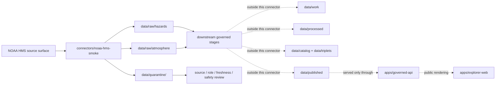

<!-- [KFM_META_BLOCK_V2]
doc_id: kfm://doc/connectors-noaa-hms-smoke-readme
title: connectors/noaa-hms-smoke/ — NOAA HMS Smoke Connector Lane
type: readme
version: v0.1
status: draft
owners: OWNER_TBD — Source steward · Connector steward · NOAA steward · Hazards steward · Atmosphere steward · Data steward · Docs steward
created: 2026-06-19
updated: 2026-06-19
policy_label: public; not-life-safety
related:
  - ../README.md
  - ../../docs/doctrine/directory-rules.md
  - ../../docs/sources/catalog/noaa/hms-fire-smoke.md
  - ../../docs/sources/catalog/noaa/hrrr-smoke.md
  - ../../docs/sources/catalog/noaa/goes-abi-aod.md
  - ../../docs/sources/catalog/noaa/viirs-hotspot.md
  - ../../docs/domains/hazards/README.md
  - ../../docs/domains/atmosphere/README.md
  - ../../docs/architecture/hazards-trust-membrane.md
  - ../../data/registry/sources/
  - ../../data/raw/
  - ../../data/quarantine/
  - ../../data/receipts/
  - ../../data/proofs/
  - ../../policy/rights/
  - ../../policy/sensitivity/
  - ../../release/
tags: [kfm, connectors, noaa, hms, smoke, fire, hazards, atmosphere, satellite, analyst-augmented, source-admission, raw, quarantine, governance]
notes:
  - "Connector lane for NOAA HMS smoke and fire source intake/admission helpers."
  - "Placement is draft / open: Directory Rules §7.3 lists noaa/ as canonical but does not settle this noaa-hms-smoke sibling versus a nested connectors/noaa/ lane."
  - "Source-product doctrine belongs under docs/sources/catalog/noaa/hms-fire-smoke.md and source descriptors, not here."
  - "Connector output may enter raw or quarantine admission lanes only."
  - "HMS smoke polygons are qualitative analyst plume boundaries, not surface PM2.5, exposure, or alert authority."
  - "Fire points, smoke polygons, smoke density classes, issue time, source files, and analyst-augmented provenance must be preserved separately."
[/KFM_META_BLOCK_V2] -->

<a id="top"></a>

# NOAA HMS Smoke Connector

> Source-specific intake and admission lane for NOAA Hazard Mapping System fire and smoke source material, especially smoke polygons and related fire-detection context used by KFM Hazards and Atmosphere lanes.

<p>
  
  
  
  
  
  
  
</p>

`connectors/noaa-hms-smoke/`

## Quick jumps

[Scope](#scope) · [Repo fit](#repo-fit) · [Lifecycle sketch](#lifecycle-sketch) · [Authority boundary](#authority-boundary) · [Inputs](#inputs) · [Exclusions](#exclusions) · [Source interface notes](#source-interface-notes) · [Admission posture](#admission-posture) · [Anti-collapse posture](#anti-collapse-posture) · [Placement status](#placement-status) · [Validation](#validation) · [Definition of done](#definition-of-done)

---

## Scope

`connectors/noaa-hms-smoke/` is the connector lane for NOAA HMS smoke and related fire source intake/admission helpers.

This folder may contain connector-local documentation, source-admission helpers, download or service manifest builders, KML/shapefile/WFS metadata helpers, no-network fixture pointers, and raw/quarantine output adapters for HMS source products.

It must not become NOAA source-family truth, HMS product doctrine, smoke truth, surface air-quality truth, fire-ground-truth authority, alert authority, policy authority, schema authority, catalog/triplet authority, proof authority, release authority, pipeline authority, or publication authority.

> [!IMPORTANT]
> **Status:** draft / `NEEDS VERIFICATION`  
> **Owner:** `OWNER_TBD`  
> **Path:** `connectors/noaa-hms-smoke/`  
> **Truth posture:** the path exists in the repository as this README; source activation, endpoint behavior, file formats, tests, fixtures, CI wiring, rights status, parser behavior, analyst-pass provenance, and placement ratification remain `NEEDS VERIFICATION`.

---

## Repo fit

```text
connectors/
└── noaa-hms-smoke/
    └── README.md
```

Related responsibility roots:

```text
connectors/                                      # source-specific fetch and admission code
docs/sources/catalog/noaa/hms-fire-smoke.md     # HMS source-product doctrine and product boundary
docs/sources/catalog/noaa/                      # NOAA source-family catalog
docs/domains/hazards/                           # hazards domain context and non-alert posture
docs/domains/atmosphere/                        # atmosphere/air context and smoke interpretation boundaries
data/registry/sources/                          # source descriptors and activation state
data/raw/hazards/                               # possible raw hazard-context source outputs
data/raw/atmosphere/                            # possible raw atmosphere/smoke-context source outputs
data/quarantine/                                # held material requiring source/rights/role/freshness review
data/receipts/                                  # ingest, checksum, analyst-pass, transform, and aggregation receipts
data/proofs/                                    # EvidenceBundles and proof packs
policy/rights/                                  # terms, attribution, and source-use review
policy/sensitivity/                             # public-safety, infrastructure, and exact-location release rules
release/                                        # release decisions, manifests, rollback, correction state
apps/governed-api/                              # downstream public trust membrane, not connector-owned
apps/explorer-web/                              # downstream map UI, never direct RAW/QUARANTINE access
```

---

## Lifecycle sketch



> [!CAUTION]
> Connector code admits source material. It does not issue alerts, provide emergency guidance, derive PM2.5, confirm ground fire status, publish layers, answer public claims, or decide release state. Promotion remains a governed state transition, not a file move.

---

## Authority boundary

```text
OUTPUT LIMIT:
  data/raw/<domain>/<source_id>/<run_id>/
  data/quarantine/<domain>/<source_id>/<run_id>/

NOT HERE:
  source-family truth
  HMS product doctrine
  smoke concentration truth
  exposure or health guidance
  emergency alert authority
  ground-fire confirmation
  source descriptor authority
  rights or sensitivity policy
  processed smoke/fire derivatives
  catalog records
  triplet records
  public tiles or map artifacts
  receipts/proofs as authority
  release decisions
  published artifacts
  public API behavior
  public UI behavior
```

---

## Inputs

| Accepted item | Required posture |
|---|---|
| Source adapter | Preserve source identity, product family, request/download URL, retrieval time, response status, and review posture. |
| Smoke polygon parser | Preserve geometry, start/end time, density class, satellite/source fields, file identity, and source issue context. |
| Fire point parser | Preserve longitude, latitude, satellite, method, ecosystem, fire radiative power when present, and acquisition time. |
| KML/shapefile/WFS helper | Preserve original format, component files, projection, field names, digest, and source URL. |
| Analyst-pass helper | Preserve issued time, product pass or source delivery identity where available, and analyst-augmented provenance without inventing internal analyst details. |
| Freshness helper | Preserve observation time, issue/update time, retrieval time, and expiry/review notes. |
| Cross-product hint helper | Emit candidate joins to FIRMS, HRRR-smoke, GOES AOD, AirNow, CAP, or NWS products only as downstream review candidates. |
| Rights/citation helper | Preserve source terms, citation, attribution posture, and review status. |
| Test references | Point to owning fixture/test roots; fixtures do not become source authority. |

---

## Exclusions

| Do not store here | Correct home |
|---|---|
| HMS source-product doctrine | `docs/sources/catalog/noaa/hms-fire-smoke.md` |
| NOAA source-family documentation | `docs/sources/catalog/noaa/` |
| Authoritative `SourceDescriptor` records | `data/registry/sources/` |
| Hazards or Atmosphere doctrine | `docs/domains/hazards/`, `docs/domains/atmosphere/` |
| Alerting, public-safety, sensitivity, or release policy | `policy/`, `policy/sensitivity/`, `release/` |
| Processed smoke or fire derivatives | `data/processed/` |
| Catalog or triplet records | `data/catalog/`, `data/triplets/` |
| Tile packages or public map artifacts | `data/published/` after governed release |
| Receipts and proof packs as authority | `data/receipts/`, `data/proofs/` |
| Schemas or semantic contracts | `schemas/`, `contracts/` |
| Generated reports | `artifacts/` |
| Public UI or API behavior | `apps/governed-api/`, `apps/explorer-web/` |

---

## Source interface notes

These notes describe external source surfaces this connector may support. They are not implementation proof.

NOAA OSPO’s Hazard Mapping System page identifies HMS as a fire and smoke product and exposes current analysis, Fire KML, Smoke KML, Smoke Text Product, Smoke Text Archive, and WFS data links for HMS Fire Detection and HMS Smoke Detection. NOAA’s page also documents 2022 data/file convention changes, including `hms_fireYYYYMMDD` for fire products and `hms_smokeYYYYMMDD` for smoke products, and smoke density values as `light`, `medium`, and `heavy`.

| Source surface | KFM use | Connector posture |
|---|---|---|
| HMS Smoke KML | Candidate smoke polygon source material. | Preserve density, start/end time, geometry, file identity, and retrieval metadata. |
| HMS Smoke shapefile or WFS | Candidate smoke polygon source material. | Preserve component files, fields, projection, geometry, and digest. |
| HMS Smoke Text Product / Archive | Candidate text summary and source-side context. | Preserve text source identity and review status; do not convert to alert authority. |
| HMS Fire KML / shapefile / WFS | Candidate fire detection context. | Preserve fire point fields and source-role distinction from smoke polygons. |
| Current Analysis page | Discovery/current-product context. | Discovery surface only; not a release decision. |
| Historical fire/smoke data | Backfill or time-series source material. | Preserve product date, issue/update time, and format/version details. |

---

## Admission posture

HMS intake should preserve:

- source identity and source surface;
- source descriptor reference and source activation state;
- product component: `fire_point`, `smoke_polygon`, `smoke_text`, or source-provided equivalent;
- source URL, download URL, service URL, or catalog item identifier;
- product date, observation time, start/end time, issue/update time, retrieval time, and timezone convention;
- response status, file identity, component files, projection, geometry profile, and content digest;
- smoke density class as a qualitative source category;
- fire detection fields as satellite-pixel signal fields;
- analyst-augmented and quality-control limitation notes where available;
- rights/citation/attribution posture;
- domain-lane routing hint such as hazards or atmosphere;
- public-safety limitation notes;
- quarantine reason when review is required.

---

## Anti-collapse posture

HMS has several high-risk interpretation boundaries. Keep them visible at connector admission time.

| Rule | Connector implication |
|---|---|
| Smoke polygon is not surface concentration. | Do not emit PM2.5, exposure, or concentration claims from density classes. |
| Smoke density is qualitative. | Preserve `light`, `medium`, `heavy` as source categories, not numeric concentration bins. |
| Fire point is not ground-fire authority. | Preserve fire detections as satellite-pixel signals with known uncertainty. |
| HMS is not a KFM alert. | Do not package connector output as emergency, public-safety, or evacuation guidance. |
| Analyst pass is provenance. | Preserve source issue/update and analyst-augmented context where available; do not invent internal analyst details. |
| Joins are downstream. | FIRMS, HRRR, AOD, CAP, NWS, AirNow, and monitor joins require downstream receipts and review. |
| Public display is downstream. | The connector must not build public tiles, UI layers, or alert payloads. |

---

## Placement status

`connectors/noaa-hms-smoke/README.md` is intentionally conservative because connector placement is not yet fully ratified.

| Claim | Status | Notes |
|---|---|---|
| `connectors/noaa-hms-smoke/README.md` contains this connector README | `CONFIRMED` after this update | The file itself now carries the connector-lane boundary. |
| `connectors/noaa-hms-smoke/` is a source-admission lane only | `PROPOSED / draft` | Consistent with `connectors/` responsibility, but Directory Rules §7.3 lists `noaa/` rather than this sibling lane. |
| HMS source-product docs exist under `docs/sources/catalog/noaa/hms-fire-smoke.md` | `CONFIRMED` in repo evidence | Product/source doctrine belongs there, not here. |
| A live NOAA HMS `SourceDescriptor` exists and is active | `NEEDS VERIFICATION` | Must be checked under `data/registry/sources/`. |
| Endpoint behavior, tests, fixtures, and CI are implemented | `UNKNOWN` | Not proven by this README. |
| HMS outputs are validated, cataloged, tiled, and published | `UNKNOWN` | Connector README does not prove downstream promotion. |

---

## Validation

Before relying on this connector, verify:

- placement is intentional and documented by ADR, migration note, or updated Directory Rules;
- source descriptors exist and are active for HMS source surfaces;
- NOAA rights, citation, attribution, endpoint, and distribution posture are captured in source descriptors;
- current product files, WFS services, text-product endpoints, cadence, filename conventions, field names, and formats are re-verified;
- parsers preserve fire-point and smoke-polygon source roles separately;
- smoke density classes remain qualitative and are not converted to PM2.5 or exposure claims;
- time handling preserves observation/start/end/issue/update/retrieval time;
- tests use no-network fixtures where practical;
- output paths are limited to raw/quarantine admission lanes;
- downstream receipts, proofs, catalog/triplet records, tile artifacts, and release records are produced only outside this connector;
- public products are released only through governed publication controls and never as KFM alerts.

---

## Definition of done

- [ ] Owners are confirmed and `OWNER_TBD` is replaced.
- [ ] Directory placement is ratified or the conflict is recorded in the drift/open-question register.
- [ ] Actual connector contents are inventoried.
- [ ] NOAA HMS `SourceDescriptor` IDs and source-family activation are verified.
- [ ] NOAA rights, citation, attribution, source terms, endpoint, and current product-suite posture are documented.
- [ ] Request/download builders preserve source URL, component type, product date, issue/update time, file identity, and digest.
- [ ] Fire-point and smoke-polygon parsing preserves distinct source roles and fields.
- [ ] Smoke density tests prevent silent conversion to PM2.5, exposure, or alert claims.
- [ ] Outputs are verified to enter only raw or quarantine admission lanes.
- [ ] No source-family, domain, processed, catalog, triplet, published, release, schema, policy, proof, receipt, registry, fixture, report, API, UI, tile, alert, or concentration authority lives here.
- [ ] Tests, fixtures, and CI behavior are verified or marked `NEEDS VERIFICATION`.

---

## Status summary

`connectors/noaa-hms-smoke/` is for NOAA HMS source-admission code only. It is not source-family truth, smoke concentration truth, air-quality truth, ground-fire authority, life-safety alert authority, policy authority, schema authority, catalog/triplet authority, proof closure, release authority, tile publication authority, public API behavior, public UI behavior, or pipeline authority.

<p align="right"><a href="#top">Back to top</a></p>
