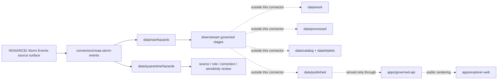

<!-- [KFM_META_BLOCK_V2]
doc_id: kfm://doc/connectors-noaa-storm-events-readme
title: connectors/noaa-storm-events/ — NOAA Storm Events Connector Lane
type: readme
version: v0.1
status: draft
owners: OWNER_TBD — Source steward · Connector steward · NOAA steward · Hazards steward · Data steward · Validation steward · Docs steward
created: 2026-06-19
updated: 2026-06-19
policy_label: public; historical-only; not-life-safety
related:
  - ../README.md
  - ../../docs/doctrine/directory-rules.md
  - ../../docs/sources/catalog/noaa/storm-events.md
  - ../../docs/sources/catalog/noaa/README.md
  - ../../docs/sources/catalog/noaa/nws-api.md
  - ../../docs/domains/hazards/README.md
  - ../../docs/domains/hazards/SOURCE_ROLE_MATRIX.md
  - ../../docs/architecture/hazards-trust-membrane.md
  - ../../docs/architecture/source-roles.md
  - ../../data/registry/sources/
  - ../../data/raw/
  - ../../data/quarantine/
  - ../../data/receipts/
  - ../../data/proofs/
  - ../../policy/rights/
  - ../../policy/sensitivity/
  - ../../release/
tags: [kfm, connectors, noaa, ncei, storm-events, hazards, severe-weather, historical-event, tornado, hail, wind, flood, source-admission, raw, quarantine, governance]
notes:
  - "Connector lane for NOAA/NCEI Storm Events source intake and admission helpers."
  - "Placement is draft / open: Directory Rules §7.3 lists noaa/ as canonical but does not settle this noaa-storm-events sibling versus a nested connectors/noaa/ lane."
  - "Source-product doctrine belongs under docs/sources/catalog/noaa/storm-events.md and source descriptors, not here."
  - "Connector output may enter raw or quarantine admission lanes only."
  - "Storm Events records are historical event records, not current warnings, alerts, forecasts, flood-inundation maps, or direct measurements of every scalar field."
  - "Event ID, episode ID, file vintage, creation date, table type, event state, correction lineage, geometry, narrative, magnitude, casualties, and damage fields must be preserved with caveats."
[/KFM_META_BLOCK_V2] -->

<a id="top"></a>

# NOAA Storm Events Connector

> Source-specific intake and admission lane for NOAA/NCEI Storm Events historical severe-weather event records used by KFM Hazards and Focus Mode workflows.

<p>
  
  
  
  
  
  
  
</p>

`connectors/noaa-storm-events/`

## Quick jumps

[Scope](#scope) · [Repo fit](#repo-fit) · [Lifecycle sketch](#lifecycle-sketch) · [Authority boundary](#authority-boundary) · [Inputs](#inputs) · [Exclusions](#exclusions) · [Source interface notes](#source-interface-notes) · [Admission posture](#admission-posture) · [Anti-collapse posture](#anti-collapse-posture) · [Placement status](#placement-status) · [Validation](#validation) · [Definition of done](#definition-of-done)

---

## Scope

`connectors/noaa-storm-events/` is the connector lane for NOAA/NCEI Storm Events source intake and admission helpers.

This folder may contain connector-local documentation, source-admission helpers, bulk CSV manifest builders, table parsers, no-network fixture pointers, checksum/digest helpers, and raw/quarantine output adapters for Storm Events records.

It must not become NOAA source-family truth, Storm Events product doctrine, current alert authority, disaster-declaration authority, wind/hail/rainfall measurement authority, flood-inundation authority, policy authority, schema authority, catalog/triplet authority, proof authority, release authority, pipeline authority, or publication authority.

> [!IMPORTANT]
> **Status:** draft / `NEEDS VERIFICATION`  
> **Owner:** `OWNER_TBD`  
> **Path:** `connectors/noaa-storm-events/`  
> **Truth posture:** the path exists in the repository as this README; source activation, endpoint behavior, CSV format handling, tests, fixtures, CI wiring, rights status, parser behavior, correction handling, and placement ratification remain `NEEDS VERIFICATION`.

---

## Repo fit

```text
connectors/
└── noaa-storm-events/
    └── README.md
```

Related responsibility roots:

```text
connectors/                                      # source-specific fetch and admission code
docs/sources/catalog/noaa/storm-events.md       # Storm Events source-product doctrine and product boundary
docs/sources/catalog/noaa/                      # NOAA source-family catalog
docs/domains/hazards/                           # hazards domain context and historical-event posture
data/registry/sources/                          # source descriptors and activation state
data/raw/hazards/                               # possible raw hazard event source outputs
data/quarantine/hazards/                        # held material requiring source/role/correction/sensitivity review
data/receipts/                                  # ingest, checksum, transform, correction, and aggregation receipts
data/proofs/                                    # EvidenceBundles and proof packs
policy/rights/                                  # terms, attribution, and source-use review
policy/sensitivity/                             # casualty, damage, exact-location, infrastructure, and public-safety release rules
release/                                        # release decisions, manifests, rollback, correction state
apps/governed-api/                              # downstream public trust membrane, not connector-owned
apps/explorer-web/                              # downstream map UI, never direct RAW/QUARANTINE access
```

---

## Lifecycle sketch



> [!CAUTION]
> Connector code admits source material. It does not issue warnings, provide emergency guidance, confirm flood inundation, convert ratings into measurements, publish layers, answer public claims, or decide release state. Promotion remains a governed state transition, not a file move.

---

## Authority boundary

```text
OUTPUT LIMIT:
  data/raw/hazards/<source_id>/<run_id>/
  data/quarantine/hazards/<source_id>/<run_id>/

NOT HERE:
  source-family truth
  Storm Events product doctrine
  current warning or alert authority
  disaster declaration authority
  flood-inundation authority
  wind/hail/rainfall measurement authority
  source descriptor authority
  rights or sensitivity policy
  processed event derivatives
  catalog records
  triplet records
  public tiles or map artifacts
  receipts/proofs as authority
  release decisions
  published artifacts
  public API behavior
  public UI behavior
```

---

## Inputs

| Accepted item | Required posture |
|---|---|
| Bulk CSV manifest helper | Preserve source URL, year, table type, file creation date, filename, size, compression, checksum, and retrieval time. |
| Details-table parser | Preserve event ID, episode ID, event type, begin/end time, state/county/CZ fields, narrative, magnitude, damage, casualties, and geometry fields where present. |
| Locations-table parser | Preserve location rows as supporting geometry/detail records tied to event ID and episode ID. |
| Fatalities-table parser | Preserve fatality records with privacy/sensitivity review flags and careful public-release posture. |
| Correction/vintage helper | Preserve file creation date and version; treat changed vintages as new source material, not silent overwrite. |
| Geometry helper | Preserve point/line/path/location fields as source geometry candidates; do not infer inundation or full hazard footprint. |
| Source-role helper | Preserve `observation` for finalized event records and `candidate` for preliminary or unresolved records where applicable. |
| Rights/citation helper | Preserve source terms, citation, attribution posture, and review status. |
| Test references | Point to owning fixture/test roots; fixtures do not become source authority. |

---

## Exclusions

| Do not store here | Correct home |
|---|---|
| Storm Events source-product doctrine | `docs/sources/catalog/noaa/storm-events.md` |
| NOAA source-family documentation | `docs/sources/catalog/noaa/` |
| Authoritative `SourceDescriptor` records | `data/registry/sources/` |
| Hazards doctrine | `docs/domains/hazards/` |
| Alerting, public-safety, sensitivity, or release policy | `policy/`, `policy/sensitivity/`, `release/` |
| Processed event derivatives | `data/processed/` |
| Catalog or triplet records | `data/catalog/`, `data/triplets/` |
| Tile packages or public map artifacts | `data/published/` after governed release |
| Receipts and proof packs as authority | `data/receipts/`, `data/proofs/` |
| Schemas or semantic contracts | `schemas/`, `contracts/` |
| Generated reports | `artifacts/` |
| Public UI or API behavior | `apps/governed-api/`, `apps/explorer-web/` |

---

## Source interface notes

These notes describe external source surfaces this connector may support. They are not implementation proof.

NOAA/NCEI exposes a public Storm Events bulk CSV directory. The directory contains CSV exports of the Storm Events Database and currently includes a README, bulk CSV format documentation, and compressed yearly files for details, fatalities, and other tables. The README describes the file naming pattern using table type, CSV structure version, data year, and file creation date; it also says current-year files may update monthly and prior years may change when updates or corrections are made.

| Source surface | KFM use | Connector posture |
|---|---|---|
| `StormEvents_details-ftp_*` files | Candidate main event records. | Preserve event/episode IDs, event type, time, geography, narrative, magnitude, damage, and geometry fields. |
| `StormEvents_fatalities-ftp_*` files | Candidate fatality records. | Preserve source linkage and route public release through privacy/sensitivity review. |
| Location tables | Candidate location/detail geometry records. | Preserve event linkage and source geometry without expanding to full hazard footprint. |
| Bulk CSV format documents | Parser contract reference. | Preserve format version and parser-version assumptions. |
| NCEI search/details pages | Discovery or per-event review context. | Do not treat page display as connector-owned release authority. |
| Revised yearly files | Correction/backfill source material. | Treat file creation-date changes as source-vintage changes requiring receipt and diff handling. |

---

## Admission posture

Storm Events intake should preserve:

- source identity and source surface;
- source descriptor reference and source activation state;
- table type such as details, fatalities, or locations;
- data year, file creation date, format version, filename, compression, and checksum;
- event ID and episode ID as identity fields;
- event type, begin/end date-time, timezone, state, county/CZ, WFO, and episode narrative fields;
- magnitude, fatalities, injuries, property damage, crop damage, and source notes with caveats;
- geometry/location/path fields as source geometry candidates;
- preliminary/final/corrected/vintage status when available or inferred from source file metadata;
- rights/citation/attribution posture;
- public-safety and sensitivity limitation notes;
- quarantine reason when review is required.

---

## Anti-collapse posture

Storm Events has several high-risk interpretation boundaries. Keep them visible at connector admission time.

| Rule | Connector implication |
|---|---|
| Historical record is not current alert. | Do not package connector output as warning, watch, advisory, or emergency guidance. |
| Event record is not a scalar measurement. | Preserve magnitude and ratings as source fields with caveats, not as direct measurement truth. |
| Flash-flood record is not inundation extent. | Do not infer water depth or flood polygon without separate evidence. |
| Tornado rating is not measured wind speed. | Preserve EF/F rating as classification and keep numeric conversion downstream and receipted if ever used. |
| Damage estimate is not insurance/legal determination. | Preserve damage values as source estimates with source notes and review flags. |
| Absence is not no hazard. | Do not infer that a place had no event just because no record appears in a slice. |
| Fatality/casualty details are sensitive. | Route public display through sensitivity review and minimization. |
| Public display is downstream. | The connector must not build public tiles, UI layers, or alert payloads. |

---

## Placement status

`connectors/noaa-storm-events/README.md` is intentionally conservative because connector placement is not yet fully ratified.

| Claim | Status | Notes |
|---|---|---|
| `connectors/noaa-storm-events/README.md` contains this connector README | `CONFIRMED` after this update | The file itself now carries the connector-lane boundary. |
| `connectors/noaa-storm-events/` is a source-admission lane only | `PROPOSED / draft` | Consistent with `connectors/` responsibility, but Directory Rules §7.3 lists `noaa/` rather than this sibling lane. |
| Storm Events source-product docs exist under `docs/sources/catalog/noaa/storm-events.md` | `CONFIRMED` in repo evidence | Product/source doctrine belongs there, not here. |
| A live NOAA Storm Events `SourceDescriptor` exists and is active | `NEEDS VERIFICATION` | Must be checked under `data/registry/sources/`. |
| Endpoint behavior, tests, fixtures, and CI are implemented | `UNKNOWN` | Not proven by this README. |
| Storm Events outputs are validated, cataloged, tiled, and published | `UNKNOWN` | Connector README does not prove downstream promotion. |

---

## Validation

Before relying on this connector, verify:

- placement is intentional and documented by ADR, migration note, or updated Directory Rules;
- source descriptors exist and are active for Storm Events source surfaces;
- NOAA/NCEI rights, citation, attribution, endpoint, and distribution posture are captured in source descriptors;
- current bulk CSV directory contents, table names, format documents, cadence, and file naming conventions are re-verified;
- parsers preserve event ID and episode ID as identity anchors;
- details, fatalities, and location tables retain their source roles and linkages;
- file creation dates and changed yearly files are handled as source-vintage changes;
- tests use no-network fixtures where practical;
- output paths are limited to raw/quarantine admission lanes;
- downstream receipts, proofs, catalog/triplet records, tile artifacts, and release records are produced only outside this connector;
- public products are released only through governed publication controls and never as KFM alerts.

---

## Definition of done

- [ ] Owners are confirmed and `OWNER_TBD` is replaced.
- [ ] Directory placement is ratified or the conflict is recorded in the drift/open-question register.
- [ ] Actual connector contents are inventoried.
- [ ] NOAA Storm Events `SourceDescriptor` IDs and source-family activation are verified.
- [ ] NOAA/NCEI rights, citation, attribution, source terms, endpoint, and current bulk-file posture are documented.
- [ ] Manifest builders preserve source URL, table type, data year, format version, file creation date, filename, size, compression, and digest.
- [ ] Parsers preserve event ID, episode ID, event type, time fields, geometry/location fields, narrative, magnitude, casualty, and damage fields with caveats.
- [ ] Tests prevent silent conversion of event records into alerts, flood extents, wind measurements, legal damage determinations, or no-hazard claims.
- [ ] Outputs are verified to enter only raw or quarantine admission lanes.
- [ ] No source-family, domain, processed, catalog, triplet, published, release, schema, policy, proof, receipt, registry, fixture, report, API, UI, tile, alert, measurement, or disaster-declaration authority lives here.
- [ ] Tests, fixtures, and CI behavior are verified or marked `NEEDS VERIFICATION`.

---

## Status summary

`connectors/noaa-storm-events/` is for NOAA/NCEI Storm Events source-admission code only. It is not source-family truth, current warning truth, disaster-declaration authority, flood-inundation truth, scalar measurement truth, policy authority, schema authority, catalog/triplet authority, proof closure, release authority, tile publication authority, public API behavior, public UI behavior, or pipeline authority.

<p align="right"><a href="#top">Back to top</a></p>
