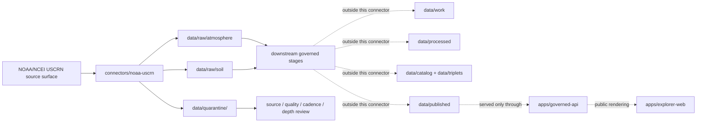

<!-- [KFM_META_BLOCK_V2]
doc_id: kfm://doc/connectors-noaa-uscrn-readme
title: connectors/noaa-uscrn/ — NOAA USCRN Connector Lane
type: readme
version: v0.1
status: draft
owners: OWNER_TBD — Source steward · Connector steward · NOAA steward · Atmosphere steward · Soil steward · Data steward · Validation steward · Docs steward
created: 2026-06-19
updated: 2026-06-19
policy_label: public; observation-source; not-life-safety
related:
  - ../README.md
  - ../../docs/doctrine/directory-rules.md
  - ../../docs/sources/catalog/noaa/noaa-uscrn.md
  - ../../docs/sources/catalog/noaa/station-climate-products.md
  - ../../docs/sources/catalog/noaa/README.md
  - ../../docs/domains/atmosphere/README.md
  - ../../docs/domains/soil/README.md
  - ../../data/registry/sources/
  - ../../data/raw/
  - ../../data/quarantine/
  - ../../data/receipts/
  - ../../data/proofs/
  - ../../policy/rights/
  - ../../policy/sensitivity/
  - ../../release/
tags: [kfm, connectors, noaa, ncei, uscrn, climate-reference-network, atmosphere, soil, weather-station, observation, sensor-depth, source-admission, raw, quarantine, governance]
notes:
  - "Connector lane for NOAA U.S. Climate Reference Network source intake and admission helpers."
  - "Placement is draft / open: Directory Rules §7.3 lists noaa/ as canonical but does not settle this noaa-uscrn sibling versus a nested connectors/noaa/ lane."
  - "Source-product doctrine belongs under docs/sources/catalog/noaa/noaa-uscrn.md and source descriptors, not here."
  - "Connector output may enter raw or quarantine admission lanes only."
  - "USCRN records are reference-grade station observations, not county/regional truth, regulatory determinations, forecasts, or alerts."
  - "Station ID, variable, cadence, timestamp, quality flags, sensor depth, units, file vintage, source URL, and digest must be preserved."
[/KFM_META_BLOCK_V2] -->

<a id="top"></a>

# NOAA USCRN Connector

> Source-specific intake and admission lane for NOAA U.S. Climate Reference Network station-observation products used by KFM Atmosphere, Soil, Hydrology-adjacent, Agriculture-adjacent, and Focus Mode workflows.

<p>
  
  
  
  
  
  
  
</p>

`connectors/noaa-uscrn/`

## Quick jumps

[Scope](#scope) · [Repo fit](#repo-fit) · [Lifecycle sketch](#lifecycle-sketch) · [Authority boundary](#authority-boundary) · [Inputs](#inputs) · [Exclusions](#exclusions) · [Source interface notes](#source-interface-notes) · [Admission posture](#admission-posture) · [Anti-collapse posture](#anti-collapse-posture) · [Placement status](#placement-status) · [Validation](#validation) · [Definition of done](#definition-of-done)

---

## Scope

`connectors/noaa-uscrn/` is the connector lane for NOAA USCRN source intake and admission helpers.

This folder may contain connector-local documentation, source-admission helpers, product-directory manifest builders, station metadata parsers, observation-table parsers, quality-flag handling helpers, no-network fixture pointers, checksum/digest helpers, and raw/quarantine output adapters for USCRN products.

It must not become NOAA source-family truth, USCRN product doctrine, county climate truth, regional surface truth, regulatory determination authority, forecast authority, alert authority, policy authority, schema authority, catalog/triplet authority, proof authority, release authority, pipeline authority, or publication authority.

> [!IMPORTANT]
> **Status:** draft / `NEEDS VERIFICATION`  
> **Owner:** `OWNER_TBD`  
> **Path:** `connectors/noaa-uscrn/`  
> **Truth posture:** the path exists in the repository as this README; source activation, endpoint behavior, product-directory coverage, tests, fixtures, CI wiring, rights status, parser behavior, quality-flag handling, and placement ratification remain `NEEDS VERIFICATION`.

---

## Repo fit

```text
connectors/
└── noaa-uscrn/
    └── README.md
```

Related responsibility roots:

```text
connectors/                                  # source-specific fetch and admission code
docs/sources/catalog/noaa/noaa-uscrn.md     # USCRN source-product doctrine and product boundary
docs/sources/catalog/noaa/                  # NOAA source-family catalog
docs/domains/atmosphere/                    # atmosphere/air/weather observation context
docs/domains/soil/                          # soil moisture and soil temperature depth-aware context
data/registry/sources/                      # source descriptors and activation state
data/raw/atmosphere/                        # possible raw station-observation source outputs
data/raw/soil/                              # possible raw soil-depth observation source outputs
data/quarantine/                            # held material requiring source/role/quality/cadence review
data/receipts/                              # ingest, checksum, station metadata, transform, and aggregation receipts
data/proofs/                                # EvidenceBundles and proof packs
policy/rights/                              # terms, attribution, and source-use review
policy/sensitivity/                         # public-safety, infrastructure, and location-release rules
release/                                    # release decisions, manifests, rollback, correction state
apps/governed-api/                          # downstream public trust membrane, not connector-owned
apps/explorer-web/                          # downstream map UI, never direct RAW/QUARANTINE access
```

---

## Lifecycle sketch



> [!CAUTION]
> Connector code admits source material. It does not interpolate stations into surfaces, turn point observations into county truth, aggregate cadence levels, publish layers, answer public claims, or decide release state. Promotion remains a governed state transition, not a file move.

---

## Authority boundary

```text
OUTPUT LIMIT:
  data/raw/<domain>/<source_id>/<run_id>/
  data/quarantine/<domain>/<source_id>/<run_id>/

NOT HERE:
  source-family truth
  USCRN product doctrine
  station-as-area truth
  climate-normal authority
  forecast or alert authority
  regulatory determination authority
  source descriptor authority
  rights or sensitivity policy
  processed station derivatives
  catalog records
  triplet records
  public tiles or map artifacts
  receipts/proofs as authority
  release decisions
  published artifacts
  public API behavior
  public UI behavior
```

---

## Inputs

| Accepted item | Required posture |
|---|---|
| Product manifest helper | Preserve source URL, product directory, cadence, filename, station ID, year or period, size, checksum, and retrieval time. |
| Station metadata parser | Preserve station ID, name, latitude, longitude, elevation, state, commissioning status, and source metadata. |
| Observation-table parser | Preserve timestamp, timezone convention, station ID, variable, value, units, quality flags, and missing-value codes. |
| Soil-depth parser | Preserve soil moisture or soil temperature depth as a required dimension; never collapse depths. |
| Cadence helper | Preserve sub-hourly, hourly, daily, monthly, or derived-product cadence as source-significant metadata. |
| Quality-flag helper | Preserve raw observations, calculated values, and quality-control flags separately. |
| Derived-product helper | Preserve source-defined derived product identity, algorithm/version notes, and source documentation references. |
| Rights/citation helper | Preserve source terms, citation, attribution posture, and review status. |
| Test references | Point to owning fixture/test roots; fixtures do not become source authority. |

---

## Exclusions

| Do not store here | Correct home |
|---|---|
| USCRN source-product doctrine | `docs/sources/catalog/noaa/noaa-uscrn.md` |
| NOAA source-family documentation | `docs/sources/catalog/noaa/` |
| Authoritative `SourceDescriptor` records | `data/registry/sources/` |
| Atmosphere or Soil doctrine | `docs/domains/atmosphere/`, `docs/domains/soil/` |
| Alerting, public-safety, sensitivity, or release policy | `policy/`, `policy/sensitivity/`, `release/` |
| Processed station derivatives or interpolations | `data/processed/` |
| Catalog or triplet records | `data/catalog/`, `data/triplets/` |
| Tile packages or public map artifacts | `data/published/` after governed release |
| Receipts and proof packs as authority | `data/receipts/`, `data/proofs/` |
| Schemas or semantic contracts | `schemas/`, `contracts/` |
| Generated reports | `artifacts/` |
| Public UI or API behavior | `apps/governed-api/`, `apps/explorer-web/` |

---

## Source interface notes

These notes describe external source surfaces this connector may support. They are not implementation proof.

NOAA/NCEI describes USCRN as a sustained network of high-quality weather monitoring stations across the contiguous U.S., Alaska, and Hawaii that measure temperature, precipitation, wind speed, soil conditions, and related variables. NCEI says the program provides quality-controlled observations and that NCEI maintains and distributes USCRN observations and derived products.

NCEI USCRN products include monthly, daily, hourly, and sub-hourly text files. NCEI describes variables including air temperature, precipitation, solar radiation, surface temperature, relative humidity, soil moisture, and soil temperature. The product page also documents quality flags, calculated variables, snapshots, updates, product documentation, headers, and citation expectations. Derived soil products include layer-specific values for 5, 10, 20, 50, and 100 cm where applicable.

| Source surface | KFM use | Connector posture |
|---|---|---|
| Monthly products | Candidate monthly station observations and aggregates. | Preserve station, period, variable, units, and product directory. |
| Daily products | Candidate daily station observations. | Preserve station/year file identity, quality flags, variables, and missing-value codes. |
| Hourly products | Candidate hourly station observations. | Preserve timestamp, station, variable, units, quality flags, and retrieval metadata. |
| Sub-hourly products | Candidate 5-minute station observations where available. | Preserve cadence and fields; do not aggregate silently. |
| Soil anomaly/climatology products | Candidate derived soil moisture/temperature products. | Preserve depth, layer, algorithm/version, and derived-product status. |
| Drought or heat products | Candidate derived station-based products. | Preserve derived-product identity and caveats; do not recast as alerts. |
| Documentation and headers | Parser contract references. | Preserve header version and parser-version assumptions. |
| Dataset change log | Correction/version context. | Treat changes as source-vintage updates requiring receipts. |

---

## Admission posture

USCRN intake should preserve:

- source identity and source surface;
- source descriptor reference and source activation state;
- product directory, cadence, product type, year/period, and file vintage;
- station ID, station metadata, location, elevation, and status fields;
- timestamp, timezone convention, variable, value, units, missing-value code, and quality flag;
- soil depth and soil layer where applicable;
- raw observation versus calculated/derived value status;
- retrieval timestamp, response status, file identity, and content digest;
- rights/citation/attribution posture;
- domain-lane routing hint such as atmosphere or soil;
- public-safety limitation notes;
- quarantine reason when review is required.

---

## Anti-collapse posture

USCRN has several high-risk interpretation boundaries. Keep them visible at connector admission time.

| Rule | Connector implication |
|---|---|
| Station reading is not area truth. | Do not emit county, watershed, region, or raster values without downstream aggregation or modeling receipts. |
| Depth matters. | Soil moisture/temperature at 5 cm, 10 cm, 20 cm, 50 cm, and 100 cm must stay distinct. |
| Cadence matters. | Sub-hourly, hourly, daily, monthly, and derived products are distinct artifacts. |
| Quality flags matter. | Do not drop QC flags, missing codes, or calculated-value conditions. |
| Reference-grade is not regulatory. | Do not treat USCRN as legal compliance or alert authority. |
| Derived products are not raw observations. | Preserve source-defined derived-product identity and algorithm/version context. |
| Public display is downstream. | The connector must not build public tiles, UI layers, climate claims, or alert payloads. |

---

## Placement status

`connectors/noaa-uscrn/README.md` is intentionally conservative because connector placement is not yet fully ratified.

| Claim | Status | Notes |
|---|---|---|
| `connectors/noaa-uscrn/README.md` contains this connector README | `CONFIRMED` after this update | The file itself now carries the connector-lane boundary. |
| `connectors/noaa-uscrn/` is a source-admission lane only | `PROPOSED / draft` | Consistent with `connectors/` responsibility, but Directory Rules §7.3 lists `noaa/` rather than this sibling lane. |
| USCRN source-product docs exist under `docs/sources/catalog/noaa/noaa-uscrn.md` | `CONFIRMED` in repo evidence | Product/source doctrine belongs there, not here. |
| A live NOAA USCRN `SourceDescriptor` exists and is active | `NEEDS VERIFICATION` | Must be checked under `data/registry/sources/`. |
| Endpoint behavior, tests, fixtures, and CI are implemented | `UNKNOWN` | Not proven by this README. |
| USCRN outputs are validated, cataloged, tiled, and published | `UNKNOWN` | Connector README does not prove downstream promotion. |

---

## Validation

Before relying on this connector, verify:

- placement is intentional and documented by ADR, migration note, or updated Directory Rules;
- source descriptors exist and are active for USCRN source surfaces;
- NOAA/NCEI rights, citation, attribution, endpoint, and distribution posture are captured in source descriptors;
- current product directories, product docs, headers, change log, cadence, field names, units, quality flags, and file naming conventions are re-verified;
- parsers preserve station ID, timestamp, cadence, variable, units, quality flags, missing codes, and derived/raw status;
- soil-depth parsing preserves depth and layer metadata without collapse;
- product-vintage changes are handled as source changes requiring receipt and diff handling;
- tests use no-network fixtures where practical;
- output paths are limited to raw/quarantine admission lanes;
- downstream receipts, proofs, catalog/triplet records, tile artifacts, and release records are produced only outside this connector;
- public products are released only through governed publication controls and never as alerts or area truth without downstream receipts.

---

## Definition of done

- [ ] Owners are confirmed and `OWNER_TBD` is replaced.
- [ ] Directory placement is ratified or the conflict is recorded in the drift/open-question register.
- [ ] Actual connector contents are inventoried.
- [ ] NOAA USCRN `SourceDescriptor` IDs and source-family activation are verified.
- [ ] NOAA/NCEI rights, citation, attribution, source terms, endpoint, and current product-directory posture are documented.
- [ ] Manifest builders preserve source URL, product directory, cadence, station ID, data year/period, file identity, size, and digest.
- [ ] Parsers preserve station metadata, timestamp, variable, value, units, quality flags, missing codes, soil depth, raw/derived status, and product vintage.
- [ ] Tests prevent silent conversion of station readings into area truth, depth-collapsed soil values, cadence-collapsed values, regulatory determinations, or alert claims.
- [ ] Outputs are verified to enter only raw or quarantine admission lanes.
- [ ] No source-family, domain, processed, catalog, triplet, published, release, schema, policy, proof, receipt, registry, fixture, report, API, UI, tile, alert, area-truth, or regulatory authority lives here.
- [ ] Tests, fixtures, and CI behavior are verified or marked `NEEDS VERIFICATION`.

---

## Status summary

`connectors/noaa-uscrn/` is for NOAA/NCEI USCRN source-admission code only. It is not source-family truth, regional climate truth, soil-column truth, forecast authority, alert authority, regulatory authority, policy authority, schema authority, catalog/triplet authority, proof closure, release authority, tile publication authority, public API behavior, public UI behavior, or pipeline authority.

<p align="right"><a href="#top">Back to top</a></p>
