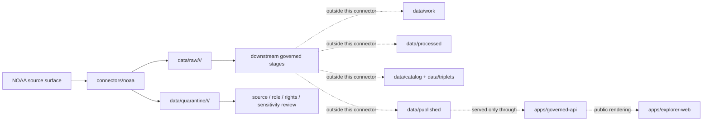

<!-- [KFM_META_BLOCK_V2]
doc_id: kfm://doc/connectors-noaa-readme
title: connectors/noaa/ — NOAA Connector Family Lane
type: readme
version: v0.1
status: draft
owners: OWNER_TBD — Source steward · Connector steward · NOAA steward · Hazards steward · Atmosphere steward · Climate steward · Soil steward · Data steward · Validation steward · Docs steward
created: 2026-06-19
updated: 2026-06-19
policy_label: public; multi-role; not-life-safety
related:
  - ../README.md
  - ../../docs/doctrine/directory-rules.md
  - ../../docs/sources/catalog/noaa/README.md
  - ../../docs/sources/catalog/noaa/storm-events.md
  - ../../docs/sources/catalog/noaa/nws-api.md
  - ../../docs/sources/catalog/noaa/hms-fire-smoke.md
  - ../../docs/sources/catalog/noaa/hrrr-smoke.md
  - ../../docs/sources/catalog/noaa/goes-abi-aod.md
  - ../../docs/sources/catalog/noaa/viirs-hotspot.md
  - ../../docs/sources/catalog/noaa/noaa-uscrn.md
  - ../../docs/sources/catalog/noaa/station-climate-products.md
  - ../../docs/domains/hazards/README.md
  - ../../docs/domains/atmosphere/README.md
  - ../../docs/domains/soil/README.md
  - ../../docs/architecture/hazards-trust-membrane.md
  - ../../docs/architecture/source-roles.md
  - ../../data/registry/sources/
  - ../../data/raw/
  - ../../data/quarantine/
  - ../../data/receipts/
  - ../../data/proofs/
  - ../../policy/rights/
  - ../../policy/sensitivity/
  - ../../release/
tags: [kfm, connectors, noaa, noaa-family, ncei, nws, hms, hrrr, goes, viirs, uscrn, storm-events, hazards, atmosphere, climate, soil, source-admission, raw, quarantine, governance]
notes:
  - "Parent connector-family lane for NOAA source intake and admission helpers."
  - "Directory Rules §7.3 lists noaa/ in the canonical connector spine; this README defines the family boundary, not product truth."
  - "NOAA products are multi-role and must not be admitted under one NOAA-wide source role."
  - "Source-product doctrine belongs under docs/sources/catalog/noaa/ and source descriptors, not here."
  - "Connector output may enter raw or quarantine admission lanes only."
  - "KFM is not an emergency alerting system; NOAA warnings, watches, advisories, hazards, smoke, storm, station, and forecast material must be represented with product-specific caveats and governed release."
[/KFM_META_BLOCK_V2] -->

<a id="top"></a>

# NOAA Connector Family

> Parent source-specific fetch and admission lane for National Oceanic and Atmospheric Administration source material used by KFM Hazards, Atmosphere, Climate, Soil, Hydrology-adjacent, Agriculture-adjacent, Spatial Foundation, and Focus Mode workflows.

<p>
  
  
  
  
  
  
  
</p>

`connectors/noaa/`

## Quick jumps

[Scope](#scope) · [Repo fit](#repo-fit) · [NOAA product lanes](#noaa-product-lanes) · [Lifecycle sketch](#lifecycle-sketch) · [Authority boundary](#authority-boundary) · [Inputs](#inputs) · [Exclusions](#exclusions) · [Admission posture](#admission-posture) · [Anti-collapse posture](#anti-collapse-posture) · [Sibling placement posture](#sibling-placement-posture) · [Validation](#validation) · [Definition of done](#definition-of-done)

---

## Scope

`connectors/noaa/` is the canonical connector-family lane for NOAA source intake and admission helpers.

This folder may contain connector-family documentation, shared NOAA request helpers, source-admission conventions, product-lane indexes, fixture pointers, no-network test guidance, and raw/quarantine output adapters for NOAA products. It may also host nested product-specific connector lanes if Directory Rules, ADRs, or a migration note consolidate sibling NOAA connectors under this family.

It must not become NOAA source-family truth, product doctrine, life-safety alert authority, forecast truth, air-quality truth, climate truth, station truth, storm truth, policy authority, schema authority, source descriptor authority, catalog/triplet authority, proof authority, release authority, pipeline authority, public API behavior, or public UI behavior.

> [!IMPORTANT]
> **Status:** draft / `NEEDS VERIFICATION`  
> **Owner:** `OWNER_TBD`  
> **Path:** `connectors/noaa/`  
> **Truth posture:** the path exists in the repository as this README; actual modules, endpoints, tests, fixtures, source descriptors, credentials, CI wiring, product-lane inventory, parser behavior, and release behavior remain `NEEDS VERIFICATION`.

---

## Repo fit

```text
connectors/
└── noaa/
    └── README.md
```

Related responsibility roots:

```text
connectors/                                  # source-specific fetch and admission code
docs/sources/catalog/noaa/                  # NOAA source-family and product-page doctrine
docs/domains/hazards/                       # hazards domain context and non-alert posture
docs/domains/atmosphere/                    # atmosphere / air / weather / climate context
docs/domains/soil/                          # soil-depth observations where NOAA products apply
data/registry/sources/                      # source descriptors and activation state
data/raw/                                   # raw staged source outputs by owning domain
data/quarantine/                            # held material requiring source/role/rights/sensitivity review
data/receipts/                              # ingest, checksum, transform, model, aggregation, and review receipts
data/proofs/                                # EvidenceBundles and proof packs
policy/rights/                              # terms, attribution, and source-use review
policy/sensitivity/                         # public-safety, privacy, infrastructure, exact-location, and release rules
release/                                    # release decisions, manifests, rollback, correction state
apps/governed-api/                          # downstream public trust membrane, not connector-owned
apps/explorer-web/                          # downstream map UI, never direct RAW/QUARANTINE access
```

---

## NOAA product lanes

NOAA is a multi-role source family. Do not create a single NOAA-wide source role, cadence, schema, or release posture.

| Product or sub-source | Product doctrine | Default posture | Connector placement status |
|---|---|---|---|
| Storm Events | `docs/sources/catalog/noaa/storm-events.md` | Historical event records; not current alerts; event record is not every scalar as measurement. | Parent family is `connectors/noaa/`; sibling `connectors/noaa-storm-events/` exists as draft and may need ADR/migration. |
| NWS API | `docs/sources/catalog/noaa/nws-api.md` | Forecast/alert/watch/warning/advisory context only; not KFM-issued alerts. | `NEEDS VERIFICATION`; should not bypass non-alert posture. |
| HMS Fire and Smoke | `docs/sources/catalog/noaa/hms-fire-smoke.md` | Fire detections and smoke polygons are distinct; smoke density is qualitative. | Parent family is `connectors/noaa/`; sibling `connectors/noaa-hms-smoke/` exists as draft and may need ADR/migration. |
| HRRR-Smoke | `docs/sources/catalog/noaa/hrrr-smoke.md` | Modeled forecast fields; requires model/run/version/freshness handling. | `NEEDS VERIFICATION`. |
| GOES ABI AOD | `docs/sources/catalog/noaa/goes-abi-aod.md` | Satellite retrieval context; AOD is not PM2.5. | `NEEDS VERIFICATION`. |
| VIIRS Hotspot | `docs/sources/catalog/noaa/viirs-hotspot.md` | Satellite thermal detections; not ground-fire authority. | `NEEDS VERIFICATION`. |
| USCRN | `docs/sources/catalog/noaa/noaa-uscrn.md` | Reference-grade station observations; station is not area truth; depth/cadence must be preserved. | Parent family is `connectors/noaa/`; sibling `connectors/noaa-uscrn/` exists as draft and may need ADR/migration. |
| Station climate products | `docs/sources/catalog/noaa/station-climate-products.md` | Station observations and aggregates require product-specific role/cadence handling. | `NEEDS VERIFICATION`. |

> [!CAUTION]
> A NOAA product mentioned here is not admitted just because it appears in this table. Admission requires an active SourceDescriptor, rights and sensitivity posture, source-role assignment, fixture/test coverage, and governed raw/quarantine handoff.

---

## Lifecycle sketch



> [!CAUTION]
> Connector code admits source material. It does not publish warnings, issue alerts, produce life-safety guidance, reconcile source roles, decide policy, close EvidenceBundles, publish map layers, or answer public claims. Promotion remains a governed state transition, not a file move.

---

## Authority boundary

```text
OUTPUT LIMIT:
  data/raw/<domain>/<source_id>/<run_id>/
  data/quarantine/<domain>/<source_id>/<run_id>/

NOT HERE:
  NOAA source-family truth
  product-page doctrine
  life-safety alert authority
  forecast truth
  air-quality truth
  climate truth
  station-as-area truth
  storm or disaster truth
  source descriptor authority
  rights or sensitivity policy
  processed derivatives
  catalog records
  triplet records
  public tiles or map artifacts
  receipts/proofs as authority
  release decisions
  published artifacts
  public API behavior
  public UI behavior
```

---

## Inputs

| Accepted item | Required posture |
|---|---|
| Family README and index | Orient NOAA connector work without claiming source activation, rights, release, or publication state. |
| Shared request helper | Preserve endpoint family, product lane, request path, parameters, retrieval time, response status, and source descriptor reference. |
| Product manifest helper | Preserve product, cadence, issue time, valid time, file name, file vintage, size, digest, and source URL where applicable. |
| Parser helper | Preserve product-specific fields and source-role distinctions; do not collapse NOAA-wide semantics. |
| Freshness helper | Preserve observation time, issue time, valid time, retrieval time, expiration/review notes, and product cadence. |
| Rights/citation helper | Preserve NOAA/NCEI/NWS terms, citation, attribution posture, and review status. |
| Sensitivity helper | Route public-safety, infrastructure, casualty, exact-location, privacy, or other sensitive material to review. |
| Test references | Point to owning fixture/test roots; fixtures do not become source authority. |
| Migration notes | Explain if sibling product connectors move under `connectors/noaa/`; preserve redirects and rollback path. |

---

## Exclusions

| Do not store here | Correct home |
|---|---|
| NOAA source-family doctrine | `docs/sources/catalog/noaa/README.md` |
| NOAA product-page doctrine | `docs/sources/catalog/noaa/*.md` |
| Authoritative `SourceDescriptor` records | `data/registry/sources/` |
| Hazards, Atmosphere, Soil, Climate, Hydrology, or domain doctrine | `docs/domains/` under owning domain lanes |
| Alerting, public-safety, sensitivity, or release policy | `policy/`, `policy/sensitivity/`, `release/` |
| Processed NOAA derivatives | `data/processed/` |
| Catalog or triplet records | `data/catalog/`, `data/triplets/` |
| Tile packages or public map artifacts | `data/published/` after governed release |
| Receipts and proof packs as authority | `data/receipts/`, `data/proofs/` |
| Schemas or semantic contracts | `schemas/`, `contracts/` |
| Generated reports | `artifacts/` |
| Public UI or API behavior | `apps/governed-api/`, `apps/explorer-web/` |
| Credentials, tokens, cookies, or account/session material | Nowhere in the repo unless a separate secrets policy explicitly allows an encrypted external secret reference. |

---

## Admission posture

NOAA intake should preserve:

- source identity and source surface;
- active source descriptor reference;
- product lane and source-role candidate;
- request URL/path, query/body parameters, and redacted request metadata;
- retrieval timestamp, response status, content digest, and source file identity;
- observation time, issue time, valid time, expiration time, file vintage, and correction/update markers where applicable;
- native product fields, units, geometry, projection, quality flags, and product version metadata;
- product-specific caveats and anti-collapse rules;
- rights/citation/attribution posture;
- domain-lane routing hint such as hazards, atmosphere, soil, climate, hydrology, agriculture, or spatial context;
- public-safety limitation notes;
- quarantine reason when review is required.

---

## Anti-collapse posture

NOAA products carry different epistemic roles. The connector family must preserve those differences.

| Risk | Connector implication |
|---|---|
| NOAA-wide role collapse | Do not admit all NOAA material under one source role. Use product-specific SourceDescriptors. |
| KFM alert collapse | Do not rebroadcast NOAA alerts, warnings, watches, advisories, forecasts, smoke, or storm records as KFM-issued alerts. |
| Historical record as current guidance | Storm Events and historical products are retrospective/contextual, not current life-safety guidance. |
| Model/retrieval as observation | HRRR-Smoke, AOD, and other modeled/retrieval products need model/version/freshness caveats. |
| Station as area truth | USCRN and station products must not become county/regional truth without downstream receipts. |
| Density or index as concentration | Smoke density and AOD must not become PM2.5 or exposure claims without separate governed derivation. |
| Detection as ground truth | VIIRS/HMS fire detections are source signals, not automatic ground-fire authority. |
| Derived product as raw observation | Climate normals, aggregates, interpolations, and forecasts require derived/model/aggregate receipts. |
| Public display as publication | Public map/API/UI products require governed release outside this connector family. |

---

## Sibling placement posture

`connectors/noaa/` is the canonical NOAA connector family lane. Several product-specific sibling connector lanes may exist or may be requested as draft scaffolds. Treat them as temporary or product-lane-specific homes until Directory Rules, ADRs, or a migration note decides whether they remain siblings or move under this parent.

| Sibling connector lane | Status | Recommended posture |
|---|---|---|
| `connectors/noaa-hms-smoke/` | Draft sibling lane if present. | Preserve product-specific README; consider migration to `connectors/noaa/hms-smoke/` only with ADR/migration note. |
| `connectors/noaa-storm-events/` | Draft sibling lane if present. | Preserve product-specific README; consider migration to `connectors/noaa/storm-events/` only with ADR/migration note. |
| `connectors/noaa-uscrn/` | Draft sibling lane if present. | Preserve product-specific README; consider migration to `connectors/noaa/uscrn/` only with ADR/migration note. |
| `connectors/noaa/*` nested lanes | `PROPOSED`. | Preferred for new NOAA sub-lanes if a future migration consolidates under the canonical family. |

No move, delete, or rename is implied by this README.

---

## Validation

Before relying on this connector family, verify:

- actual files, modules, tests, fixtures, and CI wiring below `connectors/noaa/`;
- whether product-specific sibling lanes should remain siblings or be migrated under `connectors/noaa/`;
- source descriptors exist and are active for each admitted NOAA product;
- rights, citation, attribution, terms, and public-safety posture are captured per product;
- source-role, freshness, cadence, geometry, quality flags, units, and product/version fields survive parsing;
- no-network tests exist for each product parser;
- outputs are limited to raw/quarantine admission lanes;
- downstream receipts, proofs, catalog/triplet records, tile artifacts, release records, public API responses, and UI layers are produced only outside this connector family;
- public products are released only through governed publication controls and never as KFM-issued alerts.

---

## Definition of done

- [ ] Owners are confirmed and `OWNER_TBD` is replaced.
- [ ] Actual connector-family contents are inventoried.
- [ ] Sibling NOAA connector placement is recorded in an ADR, migration note, or drift/open-question register.
- [ ] Active `SourceDescriptor` IDs are verified for each admitted NOAA product lane.
- [ ] NOAA rights, citation, attribution, terms, source-role, endpoint, cadence, freshness, and sensitivity posture are documented per product lane.
- [ ] Request/download/service helpers preserve source URL, product lane, source role, cadence, time fields, file identity, and digest.
- [ ] Parsers preserve product-native fields and do not collapse observations, models, forecasts, alerts, historical records, station readings, retrievals, detections, and aggregates into one role.
- [ ] Outputs are verified to enter only raw or quarantine admission lanes.
- [ ] No source-family, domain, processed, catalog, triplet, published, release, schema, policy, proof, receipt, registry, fixture, report, API, UI, tile, alert, measurement, forecast, or regulatory authority lives here.
- [ ] Tests, fixtures, and CI behavior are verified or marked `NEEDS VERIFICATION`.

---

## Status summary

`connectors/noaa/` is for NOAA source-admission code and connector-family coordination only. It is not NOAA source-family truth, product doctrine, life-safety authority, regulatory authority, forecast authority, air-quality truth, climate truth, station-as-area truth, storm/disaster truth, policy authority, schema authority, catalog/triplet authority, proof closure, release authority, tile publication authority, public API behavior, public UI behavior, or pipeline authority.

<p align="right"><a href="#top">Back to top</a></p>
