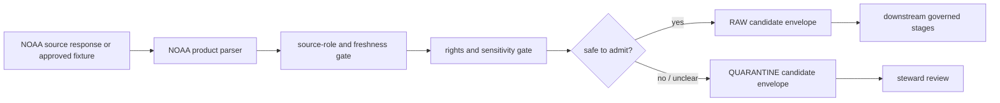

<!-- [KFM_META_BLOCK_V2]
doc_id: kfm://doc/connectors-noaa-src-readme
title: connectors/noaa/src/ — NOAA Connector Source Root
type: readme
version: v0.1
status: draft
owners: OWNER_TBD — Source steward · Connector steward · NOAA steward · Hazards steward · Atmosphere steward · Climate steward · Soil steward · Data steward · Validation steward · Docs steward
created: 2026-06-19
updated: 2026-06-19
policy_label: public-doctrine; multi-role; not-life-safety; import-safe
proposed_path: connectors/noaa/src/README.md
truth_posture: CONFIRMED path exists / PROPOSED source-root contract / UNKNOWN implementation depth
related:
  - ../README.md
  - ../tests/README.md
  - ../uscrn/README.md
  - ../../noaa-uscrn/README.md
  - ../../noaa-hms-smoke/README.md
  - ../../noaa-storm-events/README.md
  - ../../../docs/doctrine/directory-rules.md
  - ../../../docs/sources/catalog/noaa/README.md
  - ../../../docs/sources/catalog/noaa/storm-events.md
  - ../../../docs/sources/catalog/noaa/nws-api.md
  - ../../../docs/sources/catalog/noaa/hms-fire-smoke.md
  - ../../../docs/sources/catalog/noaa/hrrr-smoke.md
  - ../../../docs/sources/catalog/noaa/goes-abi-aod.md
  - ../../../docs/sources/catalog/noaa/viirs-hotspot.md
  - ../../../docs/sources/catalog/noaa/noaa-uscrn.md
  - ../../../docs/sources/catalog/noaa/station-climate-products.md
  - ../../../docs/domains/hazards/README.md
  - ../../../docs/domains/atmosphere/README.md
  - ../../../docs/domains/soil/README.md
  - ../../../data/registry/sources/
  - ../../../data/raw/
  - ../../../data/quarantine/
  - ../../../data/receipts/
  - ../../../data/proofs/
  - ../../../fixtures/
  - ../../../schemas/contracts/v1/source/
  - ../../../policy/rights/
  - ../../../policy/sensitivity/
  - ../../../release/
tags: [kfm, connectors, noaa, source-root, python, ncei, nws, hms, hrrr, goes, viirs, uscrn, storm-events, hazards, atmosphere, climate, soil, source-admission, raw, quarantine, governance]
notes:
  - "This README documents the NOAA connector source-code root, not NOAA source truth, product truth, alert authority, policy authority, schema authority, or publication authority."
  - "Code below this root may prepare NOAA source material for RAW or QUARANTINE admission only."
  - "Concrete package metadata, modules, imports, endpoints, parsers, source descriptors, tests, fixtures, and CI wiring remain NEEDS VERIFICATION until inspected in the mounted repo."
  - "NOAA products are multi-role; implementation must preserve product-specific roles, caveats, freshness, units, quality flags, geometry, and source provenance."
  - "Importing source modules must not call live NOAA endpoints, read secrets, write lifecycle stores, publish outputs, or emit public claims."
[/KFM_META_BLOCK_V2] -->

<a id="top"></a>

# NOAA Connector Source Root

> Source-code root for the canonical NOAA connector family under `connectors/noaa/`.

<p>
  
  
  
  
  
  
  
</p>

`connectors/noaa/src/`

## Quick jumps

[Scope](#scope) · [Repository fit](#repository-fit) · [Authority boundary](#authority-boundary) · [Expected contents](#expected-contents) · [Import and packaging posture](#import-and-packaging-posture) · [Product-lane responsibilities](#product-lane-responsibilities) · [Lifecycle handoff](#lifecycle-handoff) · [Testing relationship](#testing-relationship) · [Definition of done](#definition-of-done) · [Verification backlog](#verification-backlog)

---

## Scope

`connectors/noaa/src/` is the implementation source root for the NOAA connector family.

This folder may contain importable connector code that supports NOAA source intake, bounded request helpers, product-specific parsers, source-role checks, freshness checks, rights/citation checks, public-safety guardrails, normalization into source-admission envelopes, and safe handoff toward RAW or QUARANTINE lifecycle states.

It must not contain:

- NOAA source-family truth;
- NOAA product doctrine;
- active SourceDescriptor authority records;
- life-safety alert authority;
- forecast truth;
- smoke or air-quality truth;
- station-as-area truth;
- storm/disaster truth;
- rights, sensitivity, or release policy authority;
- schema or contract authority;
- processed records;
- catalog or triplet records;
- proof packs or release decisions as authority;
- public map tiles or published artifacts;
- public API or public UI behavior;
- credentials, API keys, tokens, cookies, or private session material.

> [!IMPORTANT]
> This root is for connector implementation code. It does not replace `connectors/noaa/README.md`, `connectors/noaa/tests/README.md`, NOAA source catalog documentation, source descriptors, contracts, schemas, rights/sensitivity policy, release records, or downstream pipeline documentation.

---

## Repository fit

```text
connectors/
└── noaa/
    ├── README.md                  # NOAA connector-family overview
    ├── src/
    │   ├── README.md              # this file
    │   └── noaa/                  # PROPOSED import package; NEEDS VERIFICATION
    │       └── README.md          # future implementation-package boundary, if created
    ├── tests/
    │   └── README.md              # connector-local tests
    └── uscrn/
        └── README.md              # nested product-lane boundary
```

Related responsibility roots:

```text
connectors/noaa/                       # NOAA connector-family lane
docs/sources/catalog/noaa/             # NOAA source-family and product-page doctrine
docs/domains/hazards/                  # hazards domain and non-alert posture
docs/domains/atmosphere/               # atmosphere / air / weather / climate context
docs/domains/soil/                     # soil-depth observation context
data/registry/sources/                 # source descriptors and activation state
data/raw/                              # raw staged source outputs by owning domain
data/quarantine/                       # held material requiring source/role/rights/sensitivity review
data/receipts/                         # ingest, checksum, transform, model, aggregation, and review receipts
data/proofs/                           # EvidenceBundles and proof packs
fixtures/                              # shared test fixtures, when promoted out of connector-local scope
schemas/contracts/v1/source/           # source/admission schemas, subject to ADR/schema-home convention
policy/rights/                         # terms, attribution, and source-use review
policy/sensitivity/                    # public-safety, privacy, infrastructure, exact-location, and release rules
release/                               # release decisions, manifests, rollback, correction state
```

---

## Authority boundary

```text
THIS SOURCE ROOT MAY CONTAIN:
  importable connector implementation code
  product-specific parser helpers
  bounded request helpers
  manifest helpers
  freshness and source-role helpers
  rights/citation review helpers
  sensitivity and not-life-safety guard helpers
  source-admission envelope builders
  connector-local error classes
  small package-local constants
  package README files

THIS SOURCE ROOT MUST NOT CONTAIN:
  active source descriptors as authority records
  policy decisions
  schemas as authority records
  release manifests
  publication outputs
  processed/catalog/triplet records
  public tiles or map artifacts
  raw private source dumps
  credentials, tokens, cookies, API keys, or private session material
  generated truth claims
```

The NOAA connector source root participates at the source-admission edge only:

```text
NOAA source material
  -> connectors/noaa/src/
  -> data/raw/ or data/quarantine/
  -> downstream governed processing, validation, evidence closure, rights/sensitivity review, release
```

It must not short-circuit the KFM lifecycle:

```text
RAW -> WORK / QUARANTINE -> PROCESSED -> CATALOG / TRIPLET -> PUBLISHED
```

---

## Expected contents

The exact implementation inventory is **NEEDS VERIFICATION**. A minimal source-root structure may look like this:

```text
connectors/noaa/src/
├── README.md
└── noaa/
    ├── README.md
    ├── __init__.py
    ├── config.py
    ├── client.py
    ├── descriptors.py
    ├── source_roles.py
    ├── freshness.py
    ├── rights.py
    ├── sensitivity.py
    ├── envelope.py
    ├── errors.py
    └── products/
        ├── storm_events.py
        ├── nws_api.py
        ├── hms_smoke.py
        ├── hrrr_smoke.py
        ├── goes_abi_aod.py
        ├── viirs_hotspot.py
        ├── uscrn.py
        └── station_climate.py
```

Recommended separation:

| Area | Responsibility |
|---|---|
| `noaa/config.py` | Configuration parsing, no-network defaults, product-lane feature flags, timeout policy, and live-test opt-in flags. |
| `noaa/client.py` | Bounded request helpers; no live access unless explicitly enabled and reviewed. |
| `noaa/descriptors.py` | SourceDescriptor reference checks and activation gating; not the descriptor authority. |
| `noaa/source_roles.py` | Product-specific source-role preservation and NOAA-wide role-collapse prevention. |
| `noaa/freshness.py` | Observation, issue, valid, expiry, retrieval, file-vintage, and correction-time helpers. |
| `noaa/rights.py` | Citation, attribution, terms, permitted-use, and review-required helpers. |
| `noaa/sensitivity.py` | Not-life-safety, public-safety, infrastructure, casualty, privacy, and exact-location review gates. |
| `noaa/envelope.py` | Source-admission envelope construction with source references, lifecycle target, digest support, and quarantine reasons. |
| `noaa/errors.py` | Finite connector errors safe for logs and review. |
| `noaa/products/*.py` | Product-specific parsers that preserve native fields and caveats. |
| `noaa/__init__.py` | Small import surface that does not trigger network, secret, cache, or filesystem side effects. |

Avoid adding shared utilities here until more than one connector family needs them. Shared connector patterns should move to a governed shared package or tool home after review.

---

## Import and packaging posture

Expected posture:

- importing the package should not make network calls;
- importing the package should not require API keys, tokens, cookies, or account state;
- importing the package should not read environment secrets at import time;
- importing the package should not write raw, quarantine, processed, catalog, triplet, published, proof, receipt, release, API, UI, or tile outputs;
- optional live behavior should be invoked explicitly;
- parser and gate functions should operate on supplied payloads or fixtures;
- connector outputs should be deterministic for the same input payload and connector configuration;
- source descriptors, schema validation, rights checks, sensitivity checks, and release checks should remain explicit dependencies, not hidden side effects.

Likely import shape, subject to repo verification:

```python
from noaa.envelope import build_source_admission_envelope
from noaa.source_roles import evaluate_source_role
from noaa.products.uscrn import parse_uscrn_payload
```

Do not treat this example as implementation proof until the mounted repo confirms module names and packaging configuration.

---

## Product-lane responsibilities

NOAA products are multi-role. Product-specific code must preserve product-native semantics.

| Product lane | Source-root responsibility |
|---|---|
| Storm Events | Preserve event ID, episode ID, table type, file vintage, narrative, geometry, magnitude, damage, casualty fields, and historical-event caveats. |
| NWS API | Preserve forecast/alert/watch/warning/advisory context without emitting KFM-issued alerts or life-safety instructions. |
| HMS Fire and Smoke | Preserve fire detections and smoke polygons separately; smoke density remains qualitative. |
| HRRR-Smoke | Preserve model run, forecast hour, valid time, grid/version metadata, and modeled-source caveats. |
| GOES ABI AOD | Preserve retrieval metadata and aerosol optical depth caveats; do not convert AOD to PM2.5. |
| VIIRS Hotspot | Preserve satellite/detection metadata and uncertainty; do not assert ground-fire truth. |
| USCRN | Preserve station ID, timestamp, variable, units, quality flags, cadence, soil depth, raw/derived status, and station-not-area caveat. |
| Station climate products | Preserve station/product/cadence/aggregate semantics; do not collapse station observations, climate normals, and derived aggregates. |

---

## Lifecycle handoff

Expected handoff sequence:



This root should return handoff envelopes or finite errors. It should not write lifecycle stores directly unless a downstream connector runner owns and records that write with receipts.

---

## Testing relationship

Connector-local tests live under:

```text
connectors/noaa/tests/
```

This source root should be designed so tests can verify:

- import safety;
- no-network defaults;
- no-secret defaults;
- descriptor gate behavior;
- source-role preservation;
- rights/citation/attribution/terms gate behavior;
- public-safety and not-life-safety guardrails;
- product-specific parser behavior;
- time, cadence, issue, valid, expiry, retrieval, file-vintage, and correction metadata preservation;
- geometry, units, station, depth, model-run, quality-flag, detection, and uncertainty metadata preservation;
- RAW or QUARANTINE envelope targeting;
- refusal to write processed/catalog/triplet/published/proof/receipt/release/API/UI/tile/alert outputs.

---

## Definition of done

- [ ] Owners are confirmed and `OWNER_TBD` is replaced.
- [ ] Actual source-root files are inventoried and this README is updated from `PROPOSED` layout to implementation-aware layout.
- [ ] Importing package modules performs no network, secret, cache, or unsafe filesystem side effects.
- [ ] Source descriptors and activation decisions are required before live access.
- [ ] Rights, citation, attribution, source-role, freshness, and sensitivity gates fail closed.
- [ ] NOAA product-lane parsers preserve native fields and caveats.
- [ ] Output is limited to RAW or QUARANTINE admission envelopes.
- [ ] Tests cover DENY, ABSTAIN, ERROR, quarantine, stale, malformed, role-collapsed, and public-safety misuse paths.
- [ ] CI behavior is verified or marked `NEEDS VERIFICATION`.

---

## Verification backlog

| Item | Status | Needed evidence |
|---|---:|---|
| Confirm actual source-root files below this path. | **NEEDS VERIFICATION** | Repo tree or mounted workspace. |
| Confirm package manager and import path. | **NEEDS VERIFICATION** | `pyproject.toml`, workspace config, Makefile, or CI workflow. |
| Confirm source descriptor IDs and activation state. | **NEEDS VERIFICATION** | `data/registry/sources/` entries and accepted source schema. |
| Confirm product-lane inventory and parser ownership. | **NEEDS VERIFICATION** | Source catalog entries, ADRs, connector inventory, and tests. |
| Confirm rights, freshness, source-role, and sensitivity gates. | **NEEDS VERIFICATION** | Policy docs, parser code, tests, and steward review. |
| Confirm no-network test coverage. | **NEEDS VERIFICATION** | `connectors/noaa/tests/`, fixtures, and test logs. |
| Confirm CI wiring. | **NEEDS VERIFICATION** | Workflow files and current CI logs. |

---

## Maintainer note

Keep this source root import-safe, product-specific, fixture-testable, and conservative. If a change makes NOAA claims true, publishes records, issues alerts, chooses release posture, or bypasses source-role, rights, freshness, or sensitivity review, it belongs outside this source root or behind downstream governance.

<p align="right"><a href="#top">Back to top</a></p>
