<!-- [KFM_META_BLOCK_V2]
doc_id: kfm://doc/connectors-noaa-uscrn-nested-readme
title: connectors/noaa/uscrn/ — NOAA USCRN Nested Product-Lane Boundary
type: readme
version: v0.2
status: draft
owners: OWNER_TBD — Source steward · Connector steward · NOAA steward · Atmosphere steward · Soil steward · Agriculture liaison · Rights reviewer · Security steward · Validation steward · Migration steward · Docs steward
created: 2026-06-19
updated: 2026-07-15
policy_label: "public-doctrine; connector-boundary; noaa; uscrn; station-observation; depth-aware; cadence-aware; placement-conflicted; source-inactive; no-network-by-default; raw-quarantine-only; descriptor-gated; rights-aware; sensitivity-aware; provenance-preserving; fixture-first; not-life-safety; no-publication; rollback-aware; no-secrets"
current_path: connectors/noaa/uscrn/README.md
truth_posture: CONFIRMED repository path and prior v0.1 README, connectors responsibility root, NOAA family README, merged NOAA source-root v0.2 README, merged NOAA package-boundary v0.1 README, merged NOAA test-boundary v0.2 README, flat connectors/noaa-uscrn v0.2 sibling, NOAA USCRN product-page v0.2, two domain registry placeholder YAMLs, proposed empty source-authority register, connector-gate TODO-only workflow, and bounded absence of nested initializer/client/parser, central products/uscrn.py, and connector-local test_uscrn.py / PROPOSED nested product-lane responsibility contract, freeze-by-default duplicate-lane posture, central package implementation target, explicit request and admission-candidate interfaces, connector-local outcome and reason-code vocabulary, fixture taxonomy, product-specific tests, placement migration plan, receipt handoff, and correction workflow / CONFLICTED nested connectors/noaa/uscrn versus flat connectors/noaa-uscrn placement, source registry topology across Soil and Agriculture placeholders, source-schema home references, and README-only product doctrine versus current external product details / UNKNOWN complete nested directory inventory, accepted canonical path, package installability, dependencies, active SourceDescriptor, approved endpoints, current product files and formats, station inventory, variables, units, depths, cadences, quality and missing-value vocabularies, rights, executable parser behavior, fixtures, tests, CI enforcement, live retrieval, schedules, receipts, downstream consumers, deployment, and runtime health / NEEDS VERIFICATION accepted owners, placement ADR or migration note, compatibility classification, source activation, source rights and attribution, exact product profile, endpoint allowlist, transport limits, parser contracts, validators, fixture approval, test collection, CI gates, lifecycle routing, correction and supersession, deprecation, and rollback automation
evidence_snapshot:
  repository: bartytime4life/Kansas-Frontier-Matrix
  repository_id: "1059091169"
  visibility: public
  base_ref: main
  base_commit: 9db5069e920614511e828510352a23ed29d14706
  prior_blob: 45f38157f9f430a2b0cfbae6004d8e3a9261fc85
  flat_sibling_blob: 3860f8309b77ffa28a0204827204cc6a2d9d1b52
  noaa_family_blob: 44ff6a50ed2c19e8e46092b714066c7ea3ab06fc
  source_root_blob: 0422134d3d1ac6547b9536cd6e5de5e0dd93d314
  package_readme_blob: 1303a10954d16844557653e871f4c0592e87e2c1
  tests_readme_blob: a156c9149d69884a9327fa1257e55e22347ee2ec
  package_metadata_blob: 851976fa7a808ce8d5ebc93291c3ddde27a9c349
  product_page_blob: 357f6ab8f40b00d752cef449ae0d50a4cdcd28ea
  soil_registry_placeholder_blob: 085d74781c0ab94968edd3d0c96e8ca08530a67a
  agriculture_registry_placeholder_blob: acc9bb94219282534bff01f09bd0aa583755ca22
  source_authority_register_blob: 82c23722520922f5ca0dad7f37ed794d1c2edf81
  connector_gate_workflow_blob: fc36ecced55bb0b4002d551cb28addfff0be918a
  directory_rules_blob: 2affb080e6f0043867c64c7f06c1ca52030fbd55
  bounded_path_checks:
    - connectors/noaa/uscrn/README.md exists at v0.1 before this revision
    - connectors/noaa/uscrn/__init__.py was not found
    - connectors/noaa/uscrn/client.py was not found
    - connectors/noaa/uscrn/parser.py was not found
    - connectors/noaa/src/noaa/products/uscrn.py was not found
    - connectors/noaa/tests/test_uscrn.py was not found
    - data/registry/sources/soil/noaa-uscrn.yaml is a minimal PROPOSED placeholder
    - data/registry/sources/agriculture/noaa-uscrn.yaml is a minimal PROPOSED placeholder
    - control_plane/source_authority_register.yaml is PROPOSED and entries is empty
    - connectors/noaa/pyproject.toml contains only project name and version 0.0.0
    - .github/workflows/connector-gate.yml contains TODO echo steps
related:
  - ../README.md
  - ../src/README.md
  - ../src/noaa/README.md
  - ../tests/README.md
  - ../pyproject.toml
  - ../../noaa-uscrn/README.md
  - ../../README.md
  - ../../../docs/doctrine/directory-rules.md
  - ../../../docs/adr/ADR-0017-source-descriptor-admission-process.md
  - ../../../docs/sources/catalog/noaa/README.md
  - ../../../docs/sources/catalog/noaa/noaa-uscrn.md
  - ../../../docs/sources/catalog/noaa/station-climate-products.md
  - ../../../docs/domains/atmosphere/README.md
  - ../../../docs/domains/soil/README.md
  - ../../../docs/domains/soil/CANONICAL_PATHS.md
  - ../../../docs/domains/agriculture/FILE_SYSTEM_PLAN.md
  - ../../../control_plane/source_authority_register.yaml
  - ../../../data/registry/sources/soil/noaa-uscrn.yaml
  - ../../../data/registry/sources/agriculture/noaa-uscrn.yaml
  - ../../../pipelines/domains/soil/uscrn_ingest/README.md
  - ../../../contracts/domains/soil/soil_moisture_observation.md
  - ../../../data/raw/
  - ../../../data/quarantine/
  - ../../../data/receipts/
  - ../../../data/proofs/
  - ../../../contracts/
  - ../../../schemas/
  - ../../../policy/rights/
  - ../../../policy/sensitivity/
  - ../../../release/
  - ../../../.github/workflows/connector-gate.yml
tags: [kfm, connectors, noaa, uscrn, nested-lane, placement-conflict, compatibility, climate-reference-network, weather-station, observation, atmosphere, soil, agriculture, depth-aware, cadence-aware, quality-flags, source-admission, raw, quarantine, provenance, no-network, fixture-first, anti-collapse, not-life-safety, governance]
notes:
  - "This revision changes only connectors/noaa/uscrn/README.md."
  - "The nested and flat USCRN connector paths are both repository-present and README-only in bounded inspection; this file does not ratify, migrate, deprecate, delete, or supersede either path."
  - "Directory Rules place NOAA under the connectors/noaa family spine, but final duplicate-lane disposition still requires an accepted ADR or migration note with compatibility and rollback."
  - "The central NOAA Python package remains a 0.0.0 empty shell, and the proposed products/uscrn.py module was not found."
  - "The Soil and Agriculture registry YAMLs are inventory placeholders; the source-authority register has no entries. Source activation is not established."
  - "External USCRN product details such as endpoints, station inventory, variables, units, depths, cadences, file formats, quality flags, rights, and attribution are version-sensitive and are not pinned as implementation facts here."
  - "A USCRN station record remains station-, product-, variable-, time-, cadence-, unit-, quality-, and where applicable depth-scoped. It is not area, soil-column, regulatory, forecast, alert, or life-safety truth."
  - "Connector activity is limited to explicit source admission and RAW or QUARANTINE handoff. It does not promote, publish, close evidence, or serve public clients."
[/KFM_META_BLOCK_V2] -->

<a id="top"></a>

# NOAA USCRN Nested Product-Lane Boundary

`connectors/noaa/uscrn/`

> Repository-present but placement-conflicted product-lane boundary for NOAA U.S. Climate Reference Network source admission. This lane preserves USCRN station-observation identity, provenance, quality, cadence, and depth distinctions while preventing connector output from becoming area truth, regulatory meaning, forecasts, alerts, publication, or public guidance.


**Quick links:** [Purpose](#purpose) · [Status](#status-and-evidence) · [Authority](#authority-boundary) · [Directory basis](#repository-fit-and-directory-rules-basis) · [Placement](#duplicate-lane-and-migration-boundary) · [Topology](#repository-topology-and-responsibility-split) · [Scope](#bounded-context) · [Invariants](#keystone-invariants) · [Inputs](#explicit-connector-input) · [Transport](#transport-and-resource-contract) · [Identity](#source-product-station-and-record-identity) · [Time](#time-cadence-and-vintage) · [Parsing](#parsing-and-preservation-contract) · [Quality](#quality-missingness-and-uncertainty) · [Depth](#depth-and-soil-variable-boundary) · [Admission](#source-admission-handoff) · [Outcomes](#connector-outcomes-and-reason-codes) · [Policy](#rights-sensitivity-and-life-safety) · [Security](#security-and-data-minimization) · [Testing](#testing-and-fixtures) · [Implementation](#smallest-sound-implementation-sequence) · [Done](#definition-of-done) · [Open](#open-verification-register) · [Rollback](#rollback-correction-deprecation-and-supersession)

> [!IMPORTANT]
> **This README is a boundary, not an activation decision.** The path exists, but current evidence does not establish a runnable nested connector, an accepted canonical placement, an active SourceDescriptor, approved source endpoints, a product parser, fixtures, tests, receipts, schedules, CI enforcement, or production use.

> [!CAUTION]
> **A USCRN station observation is not an area claim.** A connector may preserve a station record and its metadata. It may not silently interpolate, aggregate, gap-fill, convert one depth or cadence into another, create a climate surface, issue a warning, make a regulatory determination, or publish a public result.

---

<a id="purpose"></a>

## Purpose

This README defines the product-specific source-admission boundary for the repository path `connectors/noaa/uscrn/`.

It exists to keep a future USCRN connector:

- subordinate to the NOAA connector-family boundary;
- subordinate to accepted SourceDescriptor and source-activation state;
- explicit about product, station, object, record, variable, time, cadence, unit, quality, and depth identity;
- no-network by default;
- fixture-first;
- deterministic for captured source bytes and explicit configuration;
- bounded in retries, redirects, payload size, decompression, and resource use;
- rights- and sensitivity-aware without becoming policy authority;
- capable of producing only RAW or QUARANTINE admission candidates;
- unable to publish, promote, close evidence, or serve public clients;
- correctable and replayable;
- honest about duplicate path placement.

This README does not activate USCRN, select current endpoints, certify current product files, define station or variable semantics, establish rights, implement parsing, or prove test coverage.

[Back to top](#top)

---

<a id="status-and-evidence"></a>

## Status and evidence

### Current repository state

| Surface | Status | Safe conclusion |
|---|---:|---|
| `connectors/noaa/uscrn/README.md` | **CONFIRMED v0.1 before this revision** | The nested README existed and described a proposed product lane. |
| Other tested nested files | **NOT FOUND in bounded checks** | No nested `__init__.py`, `client.py`, or `parser.py` was established. |
| `connectors/noaa-uscrn/README.md` | **CONFIRMED v0.2** | A flat sibling README-only boundary also exists. |
| `connectors/noaa/README.md` | **CONFIRMED draft** | The NOAA family spine is documented and permits RAW/QUARANTINE admission only. |
| `connectors/noaa/src/README.md` | **CONFIRMED v0.2** | The central source-root boundary exists and documents an empty package shell. |
| `connectors/noaa/src/noaa/README.md` | **CONFIRMED v0.1** | The central Python package boundary exists but does not prove implementation. |
| `connectors/noaa/src/noaa/products/uscrn.py` | **NOT FOUND in bounded check** | No central USCRN product adapter was established at the proposed package path. |
| `connectors/noaa/tests/README.md` | **CONFIRMED v0.2** | The connector test boundary exists but is README-only. |
| `connectors/noaa/tests/test_uscrn.py` | **NOT FOUND in bounded check** | No product-specific connector test module was established at that path. |
| `connectors/noaa/pyproject.toml` | **CONFIRMED placeholder** | Project name is `kfm-connector-noaa`; version is `0.0.0`. |
| `docs/sources/catalog/noaa/noaa-uscrn.md` | **CONFIRMED draft product page** | Product doctrine exists but labels implementation details and current external facts as proposed or needing verification. |
| Soil registry YAML | **CONFIRMED placeholder** | Status is `PROPOSED`; it does not establish a mature SourceDescriptor or activation. |
| Agriculture registry YAML | **CONFIRMED placeholder** | Status is `PROPOSED`; it does not establish a mature SourceDescriptor or activation. |
| Source-authority register | **CONFIRMED proposed and empty** | `entries: []`; no USCRN activation is established. |
| `connector-gate` workflow | **CONFIRMED TODO-only** | Green workflow execution cannot prove USCRN connector behavior. |
| Soil USCRN pipeline README | **CONFIRMED draft documentation** | A downstream Soil ingest boundary is described; connector implementation and linkage remain unproved. |
| Live endpoints, formats, variables, units, depths, cadences, flags, rights | **UNKNOWN / NEEDS VERIFICATION** | These are version-sensitive source facts and are not implementation facts in this README. |

### Evidence boundary

This README may state:

- the named repository paths and blobs inspected;
- that duplicate nested and flat README lanes exist;
- that the nested lane did not expose the tested implementation files;
- that the central NOAA package is a `0.0.0` empty shell;
- that the two registry YAMLs are placeholders;
- that the source-authority register is empty;
- that connector output is limited by doctrine to RAW or QUARANTINE;
- that USCRN must remain station- and product-scoped.

This README must not claim:

- canonical placement;
- active source status;
- accepted SourceDescriptor IDs;
- approved endpoint or distribution URLs;
- current station counts or station inventory;
- current variable, unit, depth, cadence, quality, missing-value, or format vocabularies;
- package installability;
- working imports, client, parser, or product adapter;
- fixture or test coverage;
- CI enforcement;
- live retrieval;
- receipt emission;
- pipeline linkage;
- deployment or runtime health;
- release or publication safety.

[Back to top](#top)

---

<a id="authority-boundary"></a>

## Authority boundary

### Potential authority after acceptance

If placement and implementation are accepted, this lane may define USCRN-specific connector constraints such as:

- source-object discovery and manifest expectations;
- station metadata preservation requirements;
- observation-file admission requirements;
- product, cadence, quality, missing-value, and depth anti-collapse requirements;
- explicit transport and resource limits;
- product-specific quarantine triggers;
- product-specific fixture and test requirements;
- pointers to the central NOAA package adapter and owning tests.

### No authority in this lane

| Concern | Owning boundary |
|---|---|
| NOAA family and USCRN product meaning | `docs/sources/catalog/noaa/` |
| Canonical connector placement | Accepted Directory Rules amendment, ADR, or migration note |
| SourceDescriptor and activation | Accepted source registry and source-authority decision artifacts |
| Machine shape | `schemas/` under the repository-confirmed schema home |
| Object meaning | `contracts/` and domain contracts |
| Rights and sensitivity decisions | `policy/rights/`, `policy/sensitivity/`, and governed review |
| Python package implementation | `connectors/noaa/src/noaa/` under the accepted package layout |
| Connector-local tests | `connectors/noaa/tests/` under the accepted test layout |
| Downstream normalization | Domain pipelines such as the Soil USCRN ingest lane |
| Evidence closure | `EvidenceBundle` and proof workflows |
| Receipts and proofs | `data/receipts/`, `data/proofs/` |
| Release, correction, rollback | `release/` and governed lifecycle workflows |
| Public API, map, UI, search, AI | Governed applications after release |

A README may constrain future work. It cannot activate the source or make an implementation exist.

[Back to top](#top)

---

<a id="repository-fit-and-directory-rules-basis"></a>

## Repository fit and Directory Rules basis

### Owning root

The responsibility belongs under `connectors/` because it concerns source-specific fetch, parse, integrity, and admission behavior.

Directory Rules state that:

```text
connectors/
├── usgs/    fema/    noaa/    nrcs/    kansas/
└── README per connector with source descriptor reference
```

They also require connector output to go only to RAW or QUARANTINE, with source descriptors, checksums, and ingest receipts, and prohibit connectors from publishing or writing to processed, catalog, or published stores.

### Placement status

The responsibility root is clear. The exact USCRN path is not.

| Candidate | Repository evidence | Current posture |
|---|---|---|
| `connectors/noaa/uscrn/` | Nested README exists under the NOAA family spine. | **CONFLICTED / migration candidate** |
| `connectors/noaa-uscrn/` | Flat sibling README exists. | **CONFLICTED / compatibility candidate** |
| `connectors/noaa/src/noaa/products/uscrn.py` | Tested path was not found. | **PROPOSED implementation target**, not present |
| `connectors/noaa/tests/test_uscrn.py` | Tested path was not found. | **PROPOSED test target**, not present |

Directory Rules favor the NOAA family spine, but repository duplication and the absence of an accepted migration record mean this README must not declare the nested path canonical by itself.

### No parallel authority

Until placement is resolved:

- do not create a second executable Python implementation under this directory;
- do not create duplicate source descriptors for the same source surface;
- do not create conflicting product configurations in nested and flat lanes;
- do not create duplicate fixture or test families with different semantics;
- do not introduce import aliases that hide which implementation is active;
- do not deprecate or delete the flat sibling without migration and rollback;
- do not activate either lane from README text.

[Back to top](#top)

---

<a id="duplicate-lane-and-migration-boundary"></a>

## Duplicate lane and migration boundary

The duplicate paths must be treated as a governed compatibility problem.

### Current posture

```text
connectors/noaa/uscrn/        # nested README-only lane
connectors/noaa-uscrn/        # flat README-only sibling
connectors/noaa/src/noaa/     # central Python package shell
connectors/noaa/tests/        # connector test contract, README-only
```

### Required decision before implementation

An accepted ADR or migration note should decide:

1. Which path is the product-lane documentation home?
2. Where executable Python code lives?
3. Where USCRN tests and fixtures live?
4. Which path, if any, becomes `transitional`, `legacy`, `mirror`, or `deprecated`?
5. Whether imports or configuration references require compatibility aliases.
6. How source registry entries refer to the connector.
7. How pipeline docs and source catalog links are updated.
8. How rollback restores the prior topology.
9. How duplicate edits are frozen during migration.
10. What evidence proves the migration complete.

### Recommended reversible posture

**PROPOSED:** keep executable Python in the central NOAA package, keep connector tests in the central NOAA test lane, and use one product-lane README as the human-facing USCRN boundary. Freeze the noncanonical duplicate after the migration decision. This is a recommendation, not a repository fact.

[Back to top](#top)

---

<a id="repository-topology-and-responsibility-split"></a>

## Repository topology and responsibility split

```mermaid
flowchart LR
    SRC["Approved USCRN source surface"] --> DESC["Active SourceDescriptor + activation decision"]
    DESC --> RUNNER["Governed connector runner"]
    RUNNER --> ADAPTER["Central NOAA package USCRN adapter<br/>PROPOSED"]
    ADAPTER --> CAND{"Admission outcome"}
    CAND -->|admit| RAW["data/raw/<domain>/<source_id>/<run_id>/"]
    CAND -->|hold| QUAR["data/quarantine/<domain>/<source_id>/<run_id>/"]
    RUNNER --> RECEIPT["data/receipts/<accepted-family>/"]
    RAW --> PIPE["Domain pipeline<br/>outside connector"]
    QUAR --> REVIEW["Source / rights / quality / placement review"]
    PIPE --> WORK["WORK"]
    WORK --> PROC["PROCESSED"]
    PROC --> CAT["CATALOG / TRIPLET"]
    CAT --> RELEASE["Release gates"]
    RELEASE --> PUB["PUBLISHED"]
    PUB --> API["apps/governed-api"]

    DOC["This README"] -. constrains .-> ADAPTER
    TEST["connectors/noaa/tests/"] -. tests .-> ADAPTER
    PRODUCT["USCRN product page"] -. defines doctrine .-> DOC
```



This diagram is a target responsibility flow, not proof of implementation.

[Back to top](#top)

---

<a id="bounded-context"></a>

## Bounded context

### In scope

- USCRN product-lane connector constraints;
- source-object identity and integrity;
- explicit source descriptor and activation references;
- bounded retrieval posture;
- station metadata preservation;
- observation record preservation;
- product/cadence distinction;
- quality and missing-value preservation;
- source-exposed depth preservation;
- RAW or QUARANTINE admission-candidate construction;
- product-specific quarantine reasons;
- product-specific no-network fixtures and tests;
- correction, replay, and supersession metadata;
- duplicate-lane migration requirements.

### Out of scope

- current external endpoint research;
- source activation;
- source authority;
- product doctrine;
- station/network scientific interpretation;
- variable conversion authority;
- accepted schema definitions;
- policy decisions;
- downstream normalization;
- interpolation, gap filling, or surface creation;
- climate normal or anomaly derivation;
- regulatory or legal interpretation;
- warnings, alerts, forecasts, or emergency guidance;
- evidence closure;
- release or publication;
- public API, map, UI, search, or AI behavior.

[Back to top](#top)

---

<a id="keystone-invariants"></a>

## Keystone invariants

1. **Station is not area.** A record remains station-scoped unless a separate governed aggregate or model is created.
2. **Depths do not collapse.** Source-exposed soil depths remain distinct; no depth substitutes for another.
3. **Cadences do not collapse.** Native, hourly, daily, monthly, normal, or other product classes remain distinct.
4. **Raw, calculated, corrected, and aggregate products do not collapse.**
5. **Quality state is data.** Quality flags, missing-value codes, and source conditions are preserved or the record is quarantined.
6. **Source metadata has a vintage.** Station location, elevation, status, and metadata may change and must be versioned or time-bounded.
7. **Reference-grade is not regulatory authority.**
8. **Observation is not forecast or alert.**
9. **Connector admission is not evidence closure.**
10. **RAW capture is not promotion.**
11. **A successful fetch is not a successful parse.**
12. **A successful parse is not release approval.**
13. **No active SourceDescriptor means no live activation.**
14. **Unknown rights or sensitivity fails closed.**
15. **Unknown placement blocks duplicate implementation.**
16. **No hidden fetches.** Parsing operates on explicit payloads or approved fixtures.
17. **No secrets in code, fixtures, URLs, logs, snapshots, or receipts.**
18. **Corrections append lineage; they do not rewrite captured source bytes.**
19. **Public clients never read connector outputs directly.**
20. **KFM is not an emergency alerting system.**

[Back to top](#top)

---

<a id="explicit-connector-input"></a>

## Explicit connector input

A future governed invocation should receive an explicit input bundle. The exact machine schema remains `PROPOSED`.

| Input family | Required content | Fail-closed condition |
|---|---|---|
| Source authority | SourceDescriptor ref/revision and activation-decision ref | Missing, inactive, retired, ambiguous, or stale |
| Product identity | NOAA family, USCRN product/profile ID, product class, source vintage | Product not recognized by accepted profile |
| Source locator | Approved scheme, host, path/object key, distribution identifier | Host or scheme not allowlisted |
| Request policy | Timeout, retries, redirect limit, maximum bytes, resume policy | Limits missing or exceed accepted bounds |
| Object identity | Filename/object key, expected content type, period, station/product scope | Identity incomplete or inconsistent |
| Integrity | Expected digest or source fingerprint when available | Digest mismatch or fingerprint conflict |
| Station policy | Station ID and metadata profile/vintage | Station identity missing or unresolved |
| Observation policy | Variable, time basis, cadence, unit, quality, missing-value and depth expectations | Required field family unresolved |
| Rights | Rights/terms/attribution refs and review state | Unknown or denied use |
| Sensitivity | Sensitivity classification and permitted handling | Unresolved handling restriction |
| Routing | Owning domain and RAW/QUARANTINE target class | Target outside allowed admission lanes |
| Evaluation time | Retrieval time and configuration version | Missing time or mutable “latest” config |
| Replay context | Parser/profile version and canonicalization version | Unversioned parser or profile |

The connector must not silently retrieve missing source authority, rights, sensitivity, station metadata, or routing facts from unrelated stores during evaluation.

[Back to top](#top)

---

<a id="transport-and-resource-contract"></a>

## Transport and resource contract

### Default posture

```text
network access: disabled unless explicitly invoked
live source: requires active descriptor and approved locator
schemes: allowlist only
hosts: allowlist only
redirects: finite and revalidated
timeouts: finite
retries: finite and observable
rate limits: respected
payload size: bounded
decompression: bounded
archives: traversal-safe
credentials: external secret provider only
logs: redacted and size-bounded
```

### Required controls

- reject loopback, link-local, private-network, metadata-service, and non-allowlisted destinations unless a separately reviewed internal source profile explicitly permits them;
- revalidate every redirect target;
- disallow credentials embedded in URLs;
- cap response headers, body size, archive member count, expanded bytes, compression ratio, and parsing memory;
- reject path traversal and absolute paths in archives;
- reject content-type and file-extension contradictions unless an accepted detector resolves them;
- never use unsafe deserialization;
- expose retry and rate-limit outcomes rather than spinning;
- preserve source response status and safe header metadata;
- hash captured bytes before downstream mutation;
- keep live retrieval outside module import and fixture parsing;
- record the configuration profile used for each retrieval.

[Back to top](#top)

---

<a id="source-product-station-and-record-identity"></a>

## Source, product, station, and record identity

Identity must be layered rather than collapsed.

| Identity layer | Examples of required semantics | Rule |
|---|---|---|
| Source family | NOAA | Family identity is not product identity. |
| Product/profile | Accepted USCRN product or distribution profile | Must be versioned and explicit. |
| Source object | File/object key, period, distribution artifact | Must be stable enough for replay and correction. |
| Station | Source-native station identifier plus metadata vintage | Do not silently remap or merge. |
| Variable | Source-native variable identifier and accepted mapping profile | Do not infer from column position alone without profile version. |
| Observation | Station + product + variable + source time + cadence + depth where applicable | Deterministic identity should include all scope-significant dimensions. |
| Capture | Retrieval/run identifier and content digest | A new source correction or changed bytes creates new lineage. |
| Candidate | Admission-candidate ID tied to capture and parser/profile version | Candidate is not canonical truth. |

A deterministic observation identity must not erase source-native identifiers. Aliases and mappings are separate reviewed data.

[Back to top](#top)

---

<a id="time-cadence-and-vintage"></a>

## Time, cadence, and vintage

USCRN handling must keep time kinds distinct.

| Time kind | Meaning |
|---|---|
| Observation time | Time represented by the station observation |
| Interval start/end | Source-defined aggregation or reporting interval |
| Product period | Period represented by a file or product artifact |
| File/source vintage | Version or publication context of the source object |
| Retrieval time | Time KFM captured the source object |
| Station-metadata valid time | Time range for station metadata |
| Correction time | Time a source correction or KFM correction was recognized |
| Processing time | Time a parser or downstream pipeline ran |
| Release time | Downstream governed release time, outside connector authority |

Rules:

- never substitute retrieval time for observation time;
- never infer cadence only from filename when the profile requires content confirmation;
- never turn an interval aggregate into an instantaneous observation;
- never merge products of different cadence without a downstream aggregation artifact;
- never overwrite prior capture time or source vintage;
- preserve source timezone or time-basis indicators and record normalization separately;
- ambiguous or contradictory time context routes to QUARANTINE.

[Back to top](#top)

---

<a id="parsing-and-preservation-contract"></a>

## Parsing and preservation contract

### Parser posture

A parser should be:

- deterministic for the same bytes, profile, and parser version;
- pure or side-effect-minimal;
- no-network;
- explicit about accepted product/profile versions;
- able to preserve unknown columns or route drift safely;
- unable to publish or persist outside a caller-provided admission handoff;
- safe on malformed, oversized, truncated, or adversarial payloads;
- capable of returning finite issues rather than silently dropping records.

### Preserve before normalizing

For each accepted source object, preserve when available and permitted:

- source bytes or immutable source reference;
- source URL or distribution identifier;
- source object name and path;
- source content type and encoding;
- source headers and safe retrieval metadata;
- file/product vintage;
- station ID and station metadata reference;
- source-native variable identifier;
- source-native timestamp/time basis;
- cadence/product class;
- source-native value text;
- unit identifier;
- quality flag and quality vocabulary version;
- missing-value code and missingness vocabulary version;
- source-exposed depth value and depth unit where applicable;
- raw/calculated/corrected/aggregate classification;
- source documentation/profile version;
- content digest;
- parser/profile/canonicalization versions.

### Normalization restrictions

- numeric conversion must not erase the original source token;
- unit conversion, if performed downstream, must identify method and preserve the source unit;
- station-coordinate changes must preserve metadata vintage;
- derived values must never be relabeled as native observations;
- unknown fields must not be silently discarded when they could indicate schema drift;
- row-level parse failures must be attributable to source object and record position without logging sensitive bulk payloads.

[Back to top](#top)

---

<a id="quality-missingness-and-uncertainty"></a>

## Quality, missingness, and uncertainty

Quality state is not optional decoration.

A future adapter must distinguish:

- valid native observation;
- source-marked missing value;
- source-marked suspect value;
- source-marked invalid value;
- calculated or derived value;
- corrected or superseded value;
- parser failure;
- profile/schema drift;
- unknown quality vocabulary;
- missing required quality field.

Rules:

- do not convert source missing codes to numeric zero;
- do not drop quality flags;
- do not invent a generic “good” flag;
- do not compare flags across product versions without an accepted mapping;
- do not publish uncertain observations merely because parsing succeeded;
- preserve both source quality code and interpreted candidate status;
- quarantine when the quality vocabulary is unknown or contradictory;
- treat source corrections as new lineage with supersession references.

[Back to top](#top)

---

<a id="depth-and-soil-variable-boundary"></a>

## Depth and soil-variable boundary

Depth is a scope dimension, not a display label.

### Required posture

- preserve the source-exposed depth and unit;
- preserve sensor/variable identity when depth is tied to a sensor position;
- preserve the product/profile version defining the depth field;
- reject or quarantine a soil observation when depth is required but absent;
- do not substitute a nearby depth;
- do not average depths inside the connector;
- do not label one depth as a soil-column value;
- do not silently convert depth units;
- keep station metadata, variable, depth, time, and cadence together in record identity;
- require downstream receipts for interpolation, vertical integration, modeling, or aggregation.

### Unknown applicability

Not every product or variable is depth-bearing. “Depth not applicable” must be established by the accepted product profile; it must not be inferred merely because a column is empty.

[Back to top](#top)

---

<a id="source-admission-handoff"></a>

## Source-admission handoff

### Connector boundary

A product adapter may prepare an admission candidate. A governed runner may persist the candidate and emit receipts.

```text
approved source input
  -> bounded retrieval or approved fixture
  -> integrity verification
  -> profile-specific parsing
  -> identity / time / quality / depth checks
  -> rights / sensitivity / routing context
  -> ADMIT_RAW candidate
     or QUARANTINE candidate
     or SKIP / ERROR result
  -> governed runner persists and receipts
```

### Allowed lifecycle targets

```text
data/raw/<owning-domain>/<source-id>/<run-id>/
data/quarantine/<owning-domain>/<source-id>/<run-id>/
```

Exact path shape must follow the accepted lifecycle contract at implementation time.

### Prohibited direct effects

The connector must not directly write to:

- `data/work/`;
- `data/processed/`;
- `data/catalog/`;
- `data/triplets/`;
- `data/published/`;
- `data/proofs/`;
- release manifests or rollback cards;
- public API caches;
- map tiles or UI bundles;
- alert or notification systems.

A receipt proves that a process occurred. It does not prove source truth or release readiness.

[Back to top](#top)

---

<a id="connector-outcomes-and-reason-codes"></a>

## Connector outcomes and reason codes

The following connector-local vocabulary is **PROPOSED**. It is not the canonical `PolicyDecision` vocabulary.

### Proposed connector outcomes

| Outcome | Meaning |
|---|---|
| `ADMIT_RAW` | Source object and admission context meet the connector's bounded preconditions for RAW handoff. |
| `QUARANTINE` | Material is captured or represented but must be held for review. |
| `SKIP` | No admission action is needed, for example unchanged content or a safely unsupported optional object. |
| `ERROR` | Transport, integrity, parser, configuration, or internal failure prevented a safe result. |

A connector outcome does not authorize promotion or release.

### Proposed reason codes

| Reason code | Typical outcome |
|---|---|
| `USCRN_PLACEMENT_UNRESOLVED` | `QUARANTINE` or implementation stop |
| `USCRN_SOURCE_INACTIVE` | `SKIP` or `ERROR` before live retrieval |
| `USCRN_DESCRIPTOR_MISSING` | `ERROR` |
| `USCRN_RIGHTS_UNRESOLVED` | `QUARANTINE` |
| `USCRN_SENSITIVITY_UNRESOLVED` | `QUARANTINE` |
| `USCRN_LOCATOR_NOT_ALLOWED` | `ERROR` |
| `USCRN_NETWORK_DISABLED` | `SKIP` or explicit dry-run result |
| `USCRN_REDIRECT_NOT_ALLOWED` | `ERROR` |
| `USCRN_RATE_LIMITED` | `SKIP`, retry-later result, or `ERROR` |
| `USCRN_PAYLOAD_TOO_LARGE` | `QUARANTINE` or `ERROR` |
| `USCRN_UNSAFE_ARCHIVE` | `ERROR` |
| `USCRN_DIGEST_MISMATCH` | `QUARANTINE` |
| `USCRN_OBJECT_IDENTITY_MISSING` | `QUARANTINE` |
| `USCRN_PROFILE_UNKNOWN` | `QUARANTINE` |
| `USCRN_SCHEMA_DRIFT` | `QUARANTINE` |
| `USCRN_STATION_ID_MISSING` | `QUARANTINE` |
| `USCRN_OBSERVATION_TIME_MISSING` | `QUARANTINE` |
| `USCRN_CADENCE_UNKNOWN` | `QUARANTINE` |
| `USCRN_VARIABLE_UNKNOWN` | `QUARANTINE` |
| `USCRN_UNIT_UNKNOWN` | `QUARANTINE` |
| `USCRN_QUALITY_UNKNOWN` | `QUARANTINE` |
| `USCRN_MISSINGNESS_UNKNOWN` | `QUARANTINE` |
| `USCRN_DEPTH_REQUIRED_MISSING` | `QUARANTINE` |
| `USCRN_RAW_DERIVED_AMBIGUOUS` | `QUARANTINE` |
| `USCRN_ROUTING_UNRESOLVED` | `QUARANTINE` |
| `USCRN_UNCHANGED_CONTENT` | `SKIP` |
| `USCRN_INTERNAL_FAILURE` | `ERROR` |

Before implementation, names must be reconciled with connector-wide contracts and tests.

[Back to top](#top)

---

<a id="rights-sensitivity-and-life-safety"></a>

## Rights, sensitivity, and life safety

### Rights

The connector may carry rights and attribution references. It does not decide rights.

Unknown or contradictory rights posture must:

- block public-candidate claims;
- route material to QUARANTINE or stop retrieval according to policy;
- preserve the governing rights record reference;
- avoid copying restricted source material into fixtures or logs;
- avoid assuming that government-hosted means unrestricted redistribution.

### Sensitivity

Station location and infrastructure-like metadata may require review even when publicly obtainable. The connector must carry sensitivity classification and permitted precision; it must not downgrade sensitivity.

### Life safety

USCRN is not a KFM alert authority.

The connector must never emit:

- emergency instructions;
- warnings, watches, or advisories authored by KFM;
- current safety determinations;
- regulatory compliance determinations;
- drought, fire, flood, crop, irrigation, or hazard guidance;
- automated notifications framed as official NOAA alerts.

A public UI must not consume connector output directly.

[Back to top](#top)

---

<a id="security-and-data-minimization"></a>

## Security and data minimization

Threats that tests and implementation must cover include:

- SSRF through configurable locators;
- redirect-to-private-network attacks;
- credential leakage in URLs or exceptions;
- environment-secret reads at import time;
- oversized or slow responses;
- decompression bombs;
- archive path traversal;
- content-type confusion;
- malformed numeric fields;
- spreadsheet/formula injection in exported diagnostics;
- log injection through source text;
- unsafe deserialization;
- dependency confusion and unpinned transport libraries;
- stale or compromised cached source objects;
- source object substitution;
- digest downgrade;
- parser differential behavior across platforms/locales;
- unbounded row counts or memory;
- public fixture leakage;
- accidental life-safety wording.

Diagnostics should record identifiers, counts, hashes, bounded snippets, and reason codes rather than bulk source payloads.

[Back to top](#top)

---

<a id="testing-and-fixtures"></a>

## Testing and fixtures

### Current evidence

The connector-wide test README exists, but bounded inspection did not establish `test_uscrn.py`. The workflow named `connector-gate` is TODO-only. Tests below are requirements, not current coverage claims.

### Fixture classes

| Fixture class | Purpose |
|---|---|
| Minimal valid station observation | Prove required identity and preservation |
| Station metadata vintage change | Prove time-bounded metadata and correction lineage |
| Missing station ID | Prove quarantine |
| Missing observation time | Prove quarantine |
| Unknown cadence | Prove no cadence inference |
| Missing/unknown unit | Prove quarantine |
| Missing quality flag where required | Prove quarantine |
| Source missing-value code | Prove missing is not zero |
| Depth required but absent | Prove quarantine |
| Multiple depths | Prove no depth collapse |
| Raw and derived product pair | Prove product class separation |
| Corrected/superseded object | Prove append-only lineage |
| Unknown extra column | Prove schema-drift handling |
| Digest mismatch | Prove integrity quarantine |
| Oversized payload | Prove resource limit |
| Unsafe archive | Prove traversal/decompression defense |
| Redirect to disallowed host | Prove SSRF control |
| Unknown rights | Prove fail-closed routing |
| Station-as-area request | Prove refusal |
| Alert/guidance request | Prove refusal |
| Deterministic replay | Prove identical result for identical bytes/profile/version |

### Minimum test matrix

| Test | Expected proof |
|---|---|
| Import safety | No network, secret read, filesystem write, or scheduling on import |
| Network default | Live access disabled without explicit governed invocation |
| Descriptor gate | Missing/inactive descriptor blocks live retrieval |
| Placement gate | Duplicate unresolved lane does not create two active implementations |
| Host allowlist | Nonapproved host fails |
| Redirect validation | Redirect targets are rechecked |
| Timeout/retry | Finite and observable |
| Rate-limit handling | No uncontrolled retry |
| Payload/decompression limits | Adversarial payload fails safely |
| Object identity | Missing or contradictory identity quarantines |
| Content digest | Mismatch quarantines |
| Product profile | Unknown profile quarantines |
| Station identity | Missing station ID quarantines |
| Time distinction | Observation and retrieval time stay distinct |
| Cadence distinction | Product cadences do not collapse |
| Unit preservation | Native unit is retained |
| Missingness | Missing code is not converted to zero |
| Quality | Source quality state is retained |
| Depth | Required depth remains explicit |
| Raw/derived distinction | Source product classes stay separate |
| Station-as-area | Connector refuses area claim |
| Regulatory claim | Connector refuses |
| Alert/life-safety | Connector refuses |
| Rights/sensitivity | Unknown posture fails closed |
| Admission target | Only RAW or QUARANTINE candidates |
| Downstream write denial | No processed/catalog/triplet/published/release writes |
| Determinism | Same bytes/profile/version produce same result |
| Log redaction | No credentials or unbounded payloads |
| Correction lineage | New capture supersedes without rewriting old capture |

### Proposed command after tests exist

```bash
python -m pytest connectors/noaa/tests -k uscrn
```

This command is not currently established as runnable for USCRN.

[Back to top](#top)

---

<a id="smallest-sound-implementation-sequence"></a>

## Smallest sound implementation sequence

### Phase 0 — placement and ownership

1. Accept an ADR or migration note for nested versus flat USCRN lanes.
2. Classify the noncanonical path as transitional, mirror, legacy, or deprecated.
3. Confirm owners and CODEOWNERS.
4. Confirm the central package and test homes.
5. Record rollback before moving or freezing anything.

**Stop** if placement or ownership remains unresolved.

### Phase 1 — source authority

1. Create or harden the canonical USCRN SourceDescriptor.
2. Resolve registry topology across source family and domain references.
3. Record rights, attribution, sensitivity, allowed roles, denied roles, and re-review date.
4. Add an activation decision.
5. Add the approved source locator/profile without secrets.

**Stop** if source activation, rights, or sensitivity is unresolved.

### Phase 2 — accepted product profile

1. Verify current external product documentation.
2. Define explicit product/profile IDs and versions.
3. Record current formats, object naming, fields, units, time basis, cadence, quality, missingness, depth applicability, station metadata, corrections, and source vintage.
4. Define transport and resource limits.
5. Define source-object identity and digest posture.

**Stop** if current source facts cannot be verified.

### Phase 3 — fixture before live code

1. Create minimal synthetic fixtures.
2. Add negative fixtures for every quarantine and refusal path.
3. Review fixture rights and sensitivity.
4. Add fixture metadata, hashes, and expected results.
5. Prove fixtures contain no secrets or bulk source data.

**Stop** if fixture provenance or safety is unclear.

### Phase 4 — central package adapter

1. Add the accepted USCRN adapter under the central NOAA package.
2. Keep import no-network and side-effect-free.
3. Implement explicit profile selection.
4. Implement integrity, identity, time, quality, missingness, depth, and product-class preservation.
5. Return finite candidate results without persistence.

**Stop** if implementation diverges from accepted contracts.

### Phase 5 — connector tests

1. Add import and no-network tests.
2. Add transport/resource/security tests.
3. Add product preservation and anti-collapse tests.
4. Add admission-target and downstream-write denial tests.
5. Add deterministic replay and correction tests.
6. Require collection and substantive assertions in CI.

**Stop** if CI only checks that files exist or echoes TODO.

### Phase 6 — governed live probe

1. Use the active descriptor and approved locator.
2. Run a bounded, rate-limited probe.
3. Capture bytes or permitted immutable reference.
4. Emit an ingest/probe receipt.
5. Compare live structure to fixture/profile.
6. Quarantine drift.

A probe does not activate publication.

### Phase 7 — downstream integration

1. Hand admitted RAW material to the owning domain pipeline.
2. Preserve source identity and receipt lineage.
3. Keep interpolation, aggregation, and modeling downstream.
4. Require evidence, policy, review, release, correction, and rollback before public use.

[Back to top](#top)

---

<a id="definition-of-done"></a>

## Definition of done

### Placement and governance

- [ ] Owners are accepted and `OWNER_TBD` is removed.
- [ ] Nested versus flat placement is resolved by accepted ADR or migration note.
- [ ] The noncanonical path has an explicit compatibility class.
- [ ] Duplicate implementation is prevented.
- [ ] Migration and rollback steps are tested.
- [ ] CODEOWNERS or equivalent review routing is confirmed.

### Source authority

- [ ] A canonical USCRN SourceDescriptor exists.
- [ ] Source activation state is explicit and reviewed.
- [ ] Rights, attribution, sensitivity, allowed roles, denied roles, and re-review date are recorded.
- [ ] Registry topology is reconciled.
- [ ] Source-authority register contains the accepted entry.
- [ ] Locator/profile configuration contains no secrets.

### Product profile

- [ ] Current source documentation is verified.
- [ ] Product/profile ID and version are explicit.
- [ ] Supported source objects and formats are explicit.
- [ ] Station identity and metadata vintage are explicit.
- [ ] Variable and unit vocabularies are explicit.
- [ ] Time basis and cadence semantics are explicit.
- [ ] Quality and missingness vocabularies are explicit.
- [ ] Depth applicability and units are explicit.
- [ ] Raw/calculated/corrected/aggregate classes are explicit.
- [ ] Correction and supersession behavior is explicit.

### Implementation

- [ ] Central package path is accepted.
- [ ] Import is no-network and side-effect-free.
- [ ] Transport is allowlisted and bounded.
- [ ] Redirects are revalidated.
- [ ] Payload and decompression limits are enforced.
- [ ] Source bytes or permitted immutable references are preserved.
- [ ] Digests are computed and verified where applicable.
- [ ] Parsers are deterministic and profile-versioned.
- [ ] Unknown schema/profile state quarantines.
- [ ] Station, variable, time, cadence, unit, quality, missingness, depth, and product class are preserved.
- [ ] Connector functions return candidates rather than publishing.
- [ ] Only governed runner code persists RAW/QUARANTINE and receipts.

### Tests and CI

- [ ] `test_uscrn.py` or accepted equivalent exists.
- [ ] Synthetic and negative fixtures exist.
- [ ] Import/no-network tests pass.
- [ ] Security/resource tests pass.
- [ ] Product anti-collapse tests pass.
- [ ] Rights/sensitivity refusal tests pass.
- [ ] RAW/QUARANTINE target tests pass.
- [ ] Downstream-write denial tests pass.
- [ ] Deterministic replay tests pass.
- [ ] Correction/supersession tests pass.
- [ ] CI collects substantive tests.
- [ ] CI is not TODO-only.
- [ ] Test artifacts and logs are retained according to policy.

### Operations

- [ ] Governed live probe is reviewed and rate-limited.
- [ ] Probe receipt exists.
- [ ] Drift routes to quarantine.
- [ ] Schedules, if any, are explicit and non-publishing.
- [ ] Runtime health and failure modes are observable.
- [ ] Downstream pipeline linkage is tested.
- [ ] Public clients cannot read connector output directly.
- [ ] Correction and rollback drills are documented.

[Back to top](#top)

---

<a id="open-verification-register"></a>

## Open verification register

| ID | Item | Status | Evidence needed |
|---|---|---:|---|
| USCRN-OPEN-01 | Accepted nested versus flat placement | **NEEDS VERIFICATION** | ADR or migration note |
| USCRN-OPEN-02 | Compatibility classification for losing path | **NEEDS VERIFICATION** | Compatibility README/update |
| USCRN-OPEN-03 | Accepted owners | **NEEDS VERIFICATION** | CODEOWNERS/steward record |
| USCRN-OPEN-04 | Complete nested directory inventory | **UNKNOWN** | Recursive tree or checkout |
| USCRN-OPEN-05 | Central package implementation home | **PROPOSED** | Accepted package design |
| USCRN-OPEN-06 | Product-specific test home | **PROPOSED** | Accepted test layout |
| USCRN-OPEN-07 | Fixture home | **NEEDS VERIFICATION** | Fixture policy and tree |
| USCRN-OPEN-08 | Canonical SourceDescriptor path | **NEEDS VERIFICATION** | Accepted registry/schema convention |
| USCRN-OPEN-09 | Source activation decision | **UNKNOWN** | Authority register entry |
| USCRN-OPEN-10 | Registry topology | **CONFLICTED** | Source-family/domain registry decision |
| USCRN-OPEN-11 | Current approved source locator | **UNKNOWN** | Verified source profile |
| USCRN-OPEN-12 | Current rights and attribution | **UNKNOWN** | Rights assessment |
| USCRN-OPEN-13 | Sensitivity posture for station metadata | **UNKNOWN** | Sensitivity assessment |
| USCRN-OPEN-14 | Product/profile version vocabulary | **UNKNOWN** | Verified product documentation |
| USCRN-OPEN-15 | Supported object/file inventory | **UNKNOWN** | Source manifest/profile |
| USCRN-OPEN-16 | Current station inventory | **UNKNOWN** | Verified source evidence |
| USCRN-OPEN-17 | Station metadata fields and vintage | **UNKNOWN** | Product profile |
| USCRN-OPEN-18 | Variable vocabulary | **UNKNOWN** | Product profile |
| USCRN-OPEN-19 | Unit vocabulary | **UNKNOWN** | Product profile |
| USCRN-OPEN-20 | Time basis and timezone rules | **UNKNOWN** | Product profile |
| USCRN-OPEN-21 | Cadence/product classes | **UNKNOWN** | Product profile |
| USCRN-OPEN-22 | Quality flag vocabulary | **UNKNOWN** | Product profile |
| USCRN-OPEN-23 | Missing-value vocabulary | **UNKNOWN** | Product profile |
| USCRN-OPEN-24 | Depth applicability and units | **UNKNOWN** | Product profile |
| USCRN-OPEN-25 | Raw/calculated/corrected/aggregate classification | **UNKNOWN** | Product profile |
| USCRN-OPEN-26 | Correction and source supersession semantics | **UNKNOWN** | Product change/correction docs |
| USCRN-OPEN-27 | Build backend and package discovery | **UNKNOWN** | Hardened `pyproject.toml` |
| USCRN-OPEN-28 | Python namespace/import consumers | **UNKNOWN** | Import tests and code search |
| USCRN-OPEN-29 | Transport library and dependency policy | **UNKNOWN** | Dependency review |
| USCRN-OPEN-30 | Host/scheme/redirect allowlist | **UNKNOWN** | Accepted request profile |
| USCRN-OPEN-31 | Timeout/retry/rate-limit limits | **UNKNOWN** | Transport policy |
| USCRN-OPEN-32 | Payload/archive/decompression limits | **UNKNOWN** | Security profile and tests |
| USCRN-OPEN-33 | Parser and candidate contracts | **PROPOSED** | Contracts/schemas |
| USCRN-OPEN-34 | Connector outcome vocabulary | **PROPOSED** | Connector-wide contract |
| USCRN-OPEN-35 | Reason-code registry | **PROPOSED** | Reviewed registry and tests |
| USCRN-OPEN-36 | Fixture inventory and approvals | **UNKNOWN** | Fixture manifest |
| USCRN-OPEN-37 | Product-specific tests | **UNKNOWN** | Test files and logs |
| USCRN-OPEN-38 | CI collection and enforcement | **UNKNOWN** | Non-TODO workflow logs |
| USCRN-OPEN-39 | Probe/ingest receipt family | **NEEDS VERIFICATION** | Receipt contract/schema |
| USCRN-OPEN-40 | RAW/QUARANTINE exact path shape | **NEEDS VERIFICATION** | Lifecycle contract |
| USCRN-OPEN-41 | Soil pipeline executable linkage | **UNKNOWN** | Pipeline code/spec/tests |
| USCRN-OPEN-42 | Atmosphere pipeline linkage | **UNKNOWN** | Pipeline code/spec/tests |
| USCRN-OPEN-43 | Agriculture adjacency | **UNKNOWN** | Domain decision and contracts |
| USCRN-OPEN-44 | Runtime schedule and health | **UNKNOWN** | Operations evidence |
| USCRN-OPEN-45 | Correction propagation | **UNKNOWN** | Correction workflow test |
| USCRN-OPEN-46 | Rollback automation | **UNKNOWN** | Rollback drill and artifacts |
| USCRN-OPEN-47 | Branch protection and required reviews | **UNKNOWN** | Repository settings/workflow |
| USCRN-OPEN-48 | Public trust-membrane integration | **UNKNOWN** | Released downstream artifact and API evidence |

[Back to top](#top)

---

<a id="rollback-correction-deprecation-and-supersession"></a>

## Rollback, correction, deprecation, and supersession

### Documentation rollback

This README can be restored to prior blob:

```text
45f38157f9f430a2b0cfbae6004d8e3a9261fc85
```

Rollback of documentation does not roll back source captures, registry state, code, or releases.

### Placement migration rollback

A migration must record:

- source and destination paths;
- commit before migration;
- compatibility class;
- frozen path;
- moved or retained files;
- import/config/registry link updates;
- test and fixture moves;
- redirect or alias behavior;
- deprecation date;
- rollback commit and commands;
- evidence that only one implementation is active.

### Source correction

When source bytes or source metadata change:

1. preserve the prior capture and digest;
2. create a new capture/run identity;
3. record correction/supersession relationship;
4. re-run parser and admission tests under the pinned profile;
5. quarantine incompatible drift;
6. notify downstream pipelines through governed correction workflows;
7. do not silently rewrite prior RAW material;
8. do not infer that prior public releases are corrected until release workflows act.

### Deprecation

Neither duplicate path is deprecated by this README. Deprecation requires an accepted migration decision, updated links, frozen writes, compatibility classification, and rollback support.

[Back to top](#top)

---

## Status summary

**CONFIRMED:** `connectors/noaa/uscrn/` exists as a README-only nested USCRN product lane. The flat sibling, central NOAA source/package/test boundaries, draft USCRN product page, two registry placeholders, proposed empty source-authority register, and TODO-only connector workflow also exist.

**PROPOSED:** use the central NOAA package for executable product adapters, the central NOAA test lane for tests, one human-facing product-lane README, explicit source admission candidates, and a governed migration that freezes the duplicate.

**CONFLICTED:** nested versus flat product-lane placement and source registry topology.

**UNKNOWN:** active source authority, current external product details, implementation, fixtures, tests, CI enforcement, live retrieval, receipts, pipeline integration, deployment, and public release.

<p align="right"><a href="#top">Back to top</a></p>
