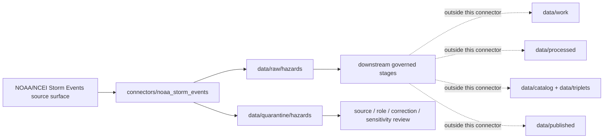

<!-- [KFM_META_BLOCK_V2]
doc_id: kfm://doc/connectors-noaa-storm-events-underscore-readme
title: connectors/noaa_storm_events/ — NOAA Storm Events Underscore Connector Lane
type: readme
version: v0.1
status: draft
owners: OWNER_TBD — Source steward · Connector steward · NOAA steward · Hazards steward · Data steward · Validation steward · Docs steward
created: 2026-06-19
updated: 2026-06-19
policy_label: public; historical-only; not-life-safety; compatibility-lane
related:
  - ../README.md
  - ../noaa/README.md
  - ../noaa/tests/README.md
  - ../noaa-storm-events/README.md
  - ../../docs/doctrine/directory-rules.md
  - ../../docs/sources/catalog/noaa/README.md
  - ../../docs/sources/catalog/noaa/storm-events.md
  - ../../docs/domains/hazards/README.md
  - ../../data/registry/sources/
  - ../../data/raw/
  - ../../data/quarantine/
  - ../../data/receipts/
  - ../../data/proofs/
  - ../../policy/rights/
  - ../../policy/sensitivity/
  - ../../release/
tags: [kfm, connectors, noaa, ncei, storm-events, underscore-lane, compatibility, hazards, severe-weather, historical-event, source-admission, raw, quarantine, governance]
notes:
  - "Compatibility / draft connector lane for NOAA/NCEI Storm Events source intake and admission helpers using an underscore path."
  - "This file does not delete, move, rename, redirect, or supersede connectors/noaa-storm-events/README.md or a future nested connectors/noaa/storm-events/ lane."
  - "Directory Rules §7.3 lists noaa/ as canonical; underscore versus hyphen versus nested placement remains an ADR or migration-note question."
  - "Source-product doctrine belongs under docs/sources/catalog/noaa/storm-events.md and source descriptors, not here."
  - "Connector output may enter raw or quarantine admission lanes only."
  - "Storm Events records are historical event records, not current warnings, alerts, forecasts, flood-inundation maps, or direct measurements of every scalar field."
[/KFM_META_BLOCK_V2] -->

<a id="top"></a>

# NOAA Storm Events Underscore Connector

> Compatibility and source-admission boundary for NOAA/NCEI Storm Events connector work under the underscore path `connectors/noaa_storm_events/`.

<p>
  
  
  
  
  
  
</p>

`connectors/noaa_storm_events/`

## Scope

`connectors/noaa_storm_events/` is a draft compatibility connector lane for NOAA/NCEI Storm Events source intake and admission helpers.

This folder may contain connector-local documentation, compatibility notes, source-admission helpers, bulk CSV manifest builders, table parsers, no-network fixture pointers, checksum/digest helpers, and raw/quarantine output adapters for Storm Events records.

It must not become NOAA source-family truth, Storm Events product doctrine, current alert authority, warning authority, forecast authority, flood-inundation authority, policy authority, schema authority, catalog/triplet authority, proof authority, release authority, pipeline authority, public API behavior, or public UI behavior.

> [!IMPORTANT]
> **Status:** draft / `NEEDS VERIFICATION`  
> **Owner:** `OWNER_TBD`  
> **Path:** `connectors/noaa_storm_events/`  
> **Truth posture:** the path exists in the repository as this README; source activation, endpoint behavior, CSV format handling, tests, fixtures, CI wiring, rights status, parser behavior, correction handling, and final placement remain `NEEDS VERIFICATION`.

---

## Repo fit

```text
connectors/
├── noaa/
│   └── README.md
├── noaa-storm-events/
│   └── README.md
└── noaa_storm_events/
    └── README.md
```

Related responsibility roots:

```text
connectors/noaa/                              # canonical NOAA connector-family lane
connectors/noaa-storm-events/                 # existing draft hyphen sibling lane
connectors/noaa_storm_events/                 # this compatibility/underscore lane
docs/sources/catalog/noaa/storm-events.md     # Storm Events source-product doctrine and product boundary
docs/sources/catalog/noaa/                    # NOAA source-family catalog
docs/domains/hazards/                         # hazards domain context and historical-event posture
data/registry/sources/                        # source descriptors and activation state
data/raw/hazards/                             # possible raw hazard event source outputs
data/quarantine/hazards/                      # held material requiring source/role/correction/sensitivity review
data/receipts/                                # ingest, checksum, transform, correction, and aggregation receipts
data/proofs/                                  # EvidenceBundles and proof packs
policy/rights/                                # terms, attribution, and source-use review
policy/sensitivity/                           # sensitivity and public-safety release rules
release/                                      # release decisions, manifests, rollback, correction state
```

---

## Relationship to other Storm Events lanes

This README is intentionally conservative because multiple Storm Events connector placements may now be referenced.

| Path | Status | Use |
|---|---|---|
| `connectors/noaa/README.md` | `CONFIRMED` parent family README | Canonical NOAA connector-family boundary and product-lane index. |
| `connectors/noaa-storm-events/README.md` | Existing draft hyphen sibling lane | Existing product-specific Storm Events connector boundary. |
| `connectors/noaa_storm_events/README.md` | `CONFIRMED` after this update | Compatibility/underscore Storm Events connector boundary. |
| `connectors/noaa/storm-events/` | `PROPOSED / not asserted here` | Possible future nested placement if ADR/migration consolidates under the NOAA parent. |

No move, delete, rename, redirect, or deprecation is implied by this README. Any consolidation must include an ADR or migration note, compatibility handling, validation, and rollback path.

---

## Lifecycle sketch



> [!CAUTION]
> Connector code admits source material. It does not issue warnings, provide emergency guidance, confirm flood inundation, publish layers, answer public claims, or decide release state. Promotion remains a governed state transition, not a file move.

---

## Authority boundary

```text
OUTPUT LIMIT:
  data/raw/hazards/<source_id>/<run_id>/
  data/quarantine/hazards/<source_id>/<run_id>/

NOT HERE:
  NOAA source-family truth
  Storm Events product doctrine
  current warning or alert authority
  forecast authority
  flood-inundation authority
  source descriptor authority
  rights or sensitivity policy
  processed event derivatives
  catalog records
  triplet records
  public tiles or map artifacts
  receipts/proofs as authority
  release decisions
  published artifacts
  public API behavior
  public UI behavior
```

---

## Inputs

| Accepted item | Required posture |
|---|---|
| Bulk CSV manifest helper | Preserve source URL, year, table type, file creation date, filename, size, compression, checksum, and retrieval time. |
| Details-table parser | Preserve event ID, episode ID, event type, begin/end time, state/county/CZ fields, narrative, magnitude, damage, and geometry fields where present. |
| Location-table parser | Preserve location rows as supporting geometry/detail records tied to event ID and episode ID. |
| Correction/vintage helper | Preserve file creation date and version; treat changed vintages as new source material, not silent overwrite. |
| Geometry helper | Preserve point/line/path/location fields as source geometry candidates; do not infer inundation or full hazard footprint. |
| Source-role helper | Preserve `observation` for finalized event records and `candidate` for preliminary or unresolved records where applicable. |
| Rights/citation helper | Preserve source terms, citation, attribution posture, and review status. |
| Compatibility helper | Preserve the fact that this underscore path is a compatibility lane until placement is resolved. |

---

## Exclusions

| Do not store here | Correct home |
|---|---|
| Storm Events source-product doctrine | `docs/sources/catalog/noaa/storm-events.md` |
| NOAA source-family documentation | `docs/sources/catalog/noaa/` |
| Authoritative `SourceDescriptor` records | `data/registry/sources/` |
| Hazards doctrine | `docs/domains/hazards/` |
| Alerting, public-safety, sensitivity, or release policy | `policy/`, `policy/sensitivity/`, `release/` |
| Processed event derivatives | `data/processed/` |
| Catalog or triplet records | `data/catalog/`, `data/triplets/` |
| Public map artifacts | `data/published/` after governed release |
| Receipts and proof packs as authority | `data/receipts/`, `data/proofs/` |
| Schemas or semantic contracts | `schemas/`, `contracts/` |
| Public UI or API behavior | `apps/governed-api/`, `apps/explorer-web/` |

---

## Admission posture

Storm Events intake should preserve source identity, source descriptor reference, table type, data year, file creation date, format version, filename, checksum, event ID, episode ID, event type, begin/end date-time, geography fields, narrative fields, magnitude fields, source geometry candidates, source-vintage status, rights/citation/attribution posture, public-safety limitation notes, compatibility-path status, and quarantine reason when review is required.

---

## Anti-collapse posture

| Rule | Connector implication |
|---|---|
| Historical record is not current alert. | Do not package connector output as warning, watch, advisory, or emergency guidance. |
| Event record is not a scalar measurement. | Preserve magnitude and ratings as source fields with caveats, not as direct measurement truth. |
| Flash-flood record is not inundation extent. | Do not infer water depth or flood polygon without separate evidence. |
| Rating is not measured wind speed. | Preserve ratings as classification fields; any numeric derivation belongs downstream. |
| Damage estimate is not legal determination. | Preserve damage values as source estimates with source notes and review flags. |
| Absence is not no hazard. | Do not infer that a place had no event just because no record appears in a slice. |
| Public display is downstream. | The connector must not build public tiles, UI layers, alert payloads, or public claims. |

---

## Validation

Before relying on this connector, verify:

- underscore versus hyphen versus nested placement is intentional and documented by ADR, migration note, or updated Directory Rules;
- source descriptors exist and are active for Storm Events source surfaces;
- NOAA/NCEI rights, citation, attribution, endpoint, and distribution posture are captured in source descriptors;
- current bulk CSV directory contents, table names, format documents, cadence, and file naming conventions are re-verified;
- parsers preserve event ID and episode ID as identity anchors;
- details and location tables retain their source roles and linkages;
- file creation dates and changed yearly files are handled as source-vintage changes;
- tests use no-network fixtures where practical;
- output paths are limited to raw/quarantine admission lanes;
- downstream receipts, proofs, catalog/triplet records, public map artifacts, and release records are produced only outside this connector;
- public products are released only through governed publication controls and never as KFM alerts.

---

## Definition of done

- [ ] Owners are confirmed and `OWNER_TBD` is replaced.
- [ ] Underscore, hyphen, and nested placement is resolved or recorded in the drift/open-question register.
- [ ] Actual connector contents are inventoried.
- [ ] NOAA Storm Events `SourceDescriptor` IDs and source-family activation are verified.
- [ ] NOAA/NCEI rights, citation, attribution, source terms, endpoint, and current bulk-file posture are documented.
- [ ] Manifest builders preserve source URL, table type, data year, format version, file creation date, filename, size, compression, and digest.
- [ ] Parsers preserve event ID, episode ID, event type, time fields, geography fields, narrative, magnitude, and source caveats.
- [ ] Tests prevent silent conversion of event records into alerts, flood extents, direct measurements, legal determinations, or no-hazard claims.
- [ ] Outputs are verified to enter only raw or quarantine admission lanes.
- [ ] No source-family, domain, processed, catalog, triplet, published, release, schema, policy, proof, receipt, registry, fixture, report, API, UI, tile, alert, measurement, or legal authority lives here.
- [ ] Tests, fixtures, and CI behavior are verified or marked `NEEDS VERIFICATION`.

---

## Status summary

`connectors/noaa_storm_events/` is a draft compatibility lane for NOAA/NCEI Storm Events source-admission code only. It is not source-family truth, current warning truth, flood-inundation truth, scalar measurement truth, policy authority, schema authority, catalog/triplet authority, proof closure, release authority, public map authority, public API behavior, public UI behavior, or pipeline authority.

<p align="right"><a href="#top">Back to top</a></p>
