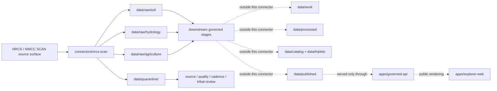

<!-- [KFM_META_BLOCK_V2]
doc_id: kfm://doc/connectors-nrcs-scan-readme
title: connectors/nrcs-scan/ — NRCS SCAN Connector Lane
type: readme
version: v0.1
status: draft
owners: OWNER_TBD — Source steward · Connector steward · NRCS steward · Soil steward · Hydrology steward · Agriculture steward · Climate steward · Data steward · Validation steward · Docs steward
created: 2026-06-19
updated: 2026-06-19
policy_label: public; observation-source; tribal-review; not-life-safety
related:
  - ../README.md
  - ../nrcs/README.md
  - ../../docs/doctrine/directory-rules.md
  - ../../docs/sources/catalog/nrcs.md
  - ../../docs/sources/catalog/nrcs/README.md
  - ../../docs/domains/soil/README.md
  - ../../docs/domains/hydrology/README.md
  - ../../docs/domains/agriculture/README.md
  - ../../docs/domains/atmosphere/README.md
  - ../../data/registry/sources/
  - ../../data/raw/
  - ../../data/quarantine/
  - ../../data/receipts/
  - ../../data/proofs/
  - ../../policy/rights/
  - ../../policy/sensitivity/
  - ../../release/
tags: [kfm, connectors, nrcs, scan, tribal-scan, nwcc, soil-climate, soil-moisture, soil-temperature, station-observation, hydrology, agriculture, climate, source-admission, raw, quarantine, governance]
notes:
  - "Connector lane for NRCS Soil Climate Analysis Network source intake and admission helpers."
  - "Placement is draft / open: Directory Rules §7.3 lists nrcs/ as canonical but does not settle this nrcs-scan sibling versus a nested connectors/nrcs/scan/ lane."
  - "Source-family and source-product doctrine belong under docs/sources/catalog/nrcs.md, docs/sources/catalog/nrcs/, and source descriptors, not here."
  - "Connector output may enter raw or quarantine admission lanes only."
  - "SCAN records are station observations and station-derived values, not county/regional truth, field verification, conservation-compliance proof, water-rights proof, forecasts, or alerts."
  - "Tribal SCAN, near-real-time, station location, depth, quality flag, cadence, source URL, and digest handling require explicit preservation and review."
[/KFM_META_BLOCK_V2] -->

<a id="top"></a>

# NRCS SCAN Connector

> Source-specific intake and admission lane for USDA NRCS Soil Climate Analysis Network station-observation source material used by KFM Soil, Hydrology, Agriculture, Climate, and Focus Mode workflows.

<p>
  
  
  
  
  
  
  
</p>

`connectors/nrcs-scan/`

## Quick jumps

[Scope](#scope) · [Repo fit](#repo-fit) · [Lifecycle sketch](#lifecycle-sketch) · [Authority boundary](#authority-boundary) · [Inputs](#inputs) · [Exclusions](#exclusions) · [Source interface notes](#source-interface-notes) · [Admission posture](#admission-posture) · [Anti-collapse posture](#anti-collapse-posture) · [Placement status](#placement-status) · [Validation](#validation) · [Definition of done](#definition-of-done)

---

## Scope

`connectors/nrcs-scan/` is the connector lane for NRCS SCAN source intake and admission helpers.

This folder may contain connector-local documentation, source-admission helpers, NWCC report-manifest builders, station metadata parsers, observation-table parsers, quality-flag handling helpers, no-network fixture pointers, checksum/digest helpers, and raw/quarantine output adapters for SCAN and Tribal SCAN records.

It must not become NRCS source-family truth, SCAN product doctrine, station-as-area truth, county soil-climate truth, conservation-compliance authority, water-rights authority, regulatory determination authority, forecast authority, alert authority, policy authority, schema authority, catalog/triplet authority, proof authority, release authority, pipeline authority, public API behavior, or public UI behavior.

> [!IMPORTANT]
> **Status:** draft / `NEEDS VERIFICATION`  
> **Owner:** `OWNER_TBD`  
> **Path:** `connectors/nrcs-scan/`  
> **Truth posture:** the path exists in the repository as this README; source activation, endpoint behavior, station inventory, tests, fixtures, CI wiring, rights status, parser behavior, quality-flag handling, Tribal SCAN review, and placement ratification remain `NEEDS VERIFICATION`.

---

## Repo fit

```text
connectors/
├── nrcs/
│   └── README.md
└── nrcs-scan/
    └── README.md
```

Related responsibility roots:

```text
connectors/nrcs/                    # canonical NRCS connector-family lane
connectors/nrcs-scan/               # draft sibling SCAN connector lane
docs/sources/catalog/nrcs.md        # NRCS source-family profile and SCAN access posture
docs/sources/catalog/nrcs/          # NRCS source-family/product docs when present
docs/domains/soil/                  # soil moisture / soil temperature context
docs/domains/hydrology/             # water and climate support context
docs/domains/agriculture/           # agriculture and conservation context
docs/domains/atmosphere/            # weather/climate station context
data/registry/sources/              # source descriptors and activation state
data/raw/                           # raw staged source outputs by owning domain
data/quarantine/                    # held material requiring source/role/rights/sensitivity review
data/receipts/                      # ingest, checksum, station metadata, transform, and aggregation receipts
data/proofs/                        # EvidenceBundles and proof packs
policy/rights/                      # terms, attribution, and source-use review
policy/sensitivity/                 # Tribal, public-safety, station-location, and release rules
release/                            # release decisions, manifests, rollback, correction state
apps/governed-api/                  # downstream public trust membrane, not connector-owned
apps/explorer-web/                  # downstream map UI, never direct RAW/QUARANTINE access
```

---

## Lifecycle sketch



> [!CAUTION]
> Connector code admits source material. It does not interpolate stations into surfaces, turn point observations into county truth, certify conservation compliance, publish layers, answer public claims, or decide release state. Promotion remains a governed state transition, not a file move.

---

## Authority boundary

```text
OUTPUT LIMIT:
  data/raw/<domain>/<source_id>/<run_id>/
  data/quarantine/<domain>/<source_id>/<run_id>/

NOT HERE:
  NRCS source-family truth
  SCAN product doctrine
  station-as-area truth
  field verification
  conservation-compliance authority
  water-rights authority
  forecast or alert authority
  source descriptor authority
  rights or sensitivity policy
  processed station derivatives
  catalog records
  triplet records
  public tiles or map artifacts
  receipts/proofs as authority
  release decisions
  published artifacts
  public API behavior
  public UI behavior
```

---

## Inputs

| Accepted item | Required posture |
|---|---|
| Report manifest helper | Preserve source URL, network, station ID, element, duration, function, value type, time period, output format, checksum, and retrieval time. |
| Station metadata parser | Preserve station ID, name, network, state, county, elevation, latitude, longitude, HUC fields, report timezone, SHEF ID, start date, and end date where available. |
| Observation parser | Preserve timestamp, element, depth, value type, function, value, units, quality flags, and missing-value conventions. |
| Soil-depth helper | Preserve soil moisture or soil temperature depth as a required dimension; never collapse depths. |
| Cadence helper | Preserve daily, monthly, seasonal, annual, or report-duration semantics as source-significant metadata. |
| Network helper | Preserve `SCAN` versus `TRIBAL SCAN` network identity and review posture. |
| Normals helper | Preserve normals period and whether value is median, average, percent of median, percent of average, or observation-count context. |
| Rights/citation helper | Preserve source terms, citation, attribution posture, and review status. |
| Test references | Point to owning fixture/test roots; fixtures do not become source authority. |

---

## Exclusions

| Do not store here | Correct home |
|---|---|
| NRCS source-family doctrine | `docs/sources/catalog/nrcs.md` and `docs/sources/catalog/nrcs/` |
| Authoritative `SourceDescriptor` records | `data/registry/sources/` |
| Soil, Hydrology, Agriculture, or Atmosphere doctrine | `docs/domains/` under owning domain lanes |
| Rights, sensitivity, Tribal review, or release policy | `policy/`, `policy/sensitivity/`, `release/` |
| Processed station derivatives or interpolations | `data/processed/` |
| Catalog or triplet records | `data/catalog/`, `data/triplets/` |
| Public map artifacts | `data/published/` after governed release |
| Receipts and proof packs as authority | `data/receipts/`, `data/proofs/` |
| Schemas or semantic contracts | `schemas/`, `contracts/` |
| Generated reports | `artifacts/` |
| Public UI or API behavior | `apps/governed-api/`, `apps/explorer-web/` |

---

## Source interface notes

These notes describe external source surfaces this connector may support. They are not implementation proof.

NRCS describes the Soil Climate Analysis Network, or SCAN, as a comprehensive nationwide soil moisture and climate information network supporting natural-resource assessments and conservation activities. NRCS NWCC report tools expose SCAN and Tribal SCAN as selectable networks and provide station metadata fields, report time periods, elements such as soil moisture percent and soil temperature, quality flags, normals fields, and CSV output choices.

| Source surface | KFM use | Connector posture |
|---|---|---|
| NWCC Report Generator | Candidate report-building and source retrieval surface. | Preserve network, station, element, depth, duration, function, value type, format, and retrieval metadata. |
| SCAN station metadata | Candidate station/source metadata. | Preserve station identity, location, HUC, timezone, elevation, active period, and network code. |
| SCAN observations | Candidate station observation source material. | Preserve timestamp, element, depth, units, quality flags, and missing values. |
| Tribal SCAN observations | Candidate source material requiring extra review. | Preserve network identity and route through Tribal/sensitivity review before public release. |
| Climatic and hydrologic normals | Candidate context values. | Preserve normals period, statistic type, and observation-count context; do not recast as raw observations. |
| CSV reports | Preferred machine-friendly report output where available. | Preserve source URL/query, file identity, digest, and parser assumptions. |

---

## Admission posture

SCAN intake should preserve:

- source identity and source surface;
- source descriptor reference and source activation state;
- network identity, including `SCAN` versus `TRIBAL SCAN`;
- station ID, station name, location, elevation, HUC, timezone, start/end date, and status fields;
- element, depth, function, value type, value, units, quality flags, missing-value code, and report duration;
- observation time, report period, retrieval time, source URL/query, output format, and content digest;
- raw observation versus normal, average, median, percent-of-normal, or derived value status;
- rights/citation/attribution posture;
- domain-lane routing hint such as soil, hydrology, agriculture, or atmosphere;
- public-safety and sensitivity limitation notes;
- quarantine reason when review is required.

---

## Anti-collapse posture

SCAN has several high-risk interpretation boundaries. Keep them visible at connector admission time.

| Rule | Connector implication |
|---|---|
| Station reading is not area truth. | Do not emit county, watershed, region, or raster values without downstream aggregation or modeling receipts. |
| Depth matters. | Soil moisture and soil temperature depths must stay distinct. |
| Network identity matters. | `TRIBAL SCAN` records require extra review and must not be treated as ordinary public context by default. |
| Cadence matters. | Daily, monthly, seasonal, annual, and report-duration outputs are distinct artifacts. |
| Quality flags matter. | Do not drop QC flags, missing codes, or calculated-value conditions. |
| Normals are aggregates. | Preserve normals period and statistic type; do not recast normals as raw observations. |
| Near-real-time can be stale. | Preserve retrieval time and report period; public products need freshness gates. |
| Public display is downstream. | The connector must not build public tiles, UI layers, climate claims, compliance claims, or alert payloads. |

---

## Placement status

`connectors/nrcs-scan/README.md` is intentionally conservative because connector placement is not yet fully ratified.

| Claim | Status | Notes |
|---|---|---|
| `connectors/nrcs-scan/README.md` contains this connector README | `CONFIRMED` after this update | The file itself now carries the connector-lane boundary. |
| `connectors/nrcs-scan/` is a source-admission lane only | `PROPOSED / draft` | Consistent with connector responsibility, but Directory Rules §7.3 lists `nrcs/` rather than this sibling lane. |
| NRCS source-profile docs recognize SCAN | `CONFIRMED` in repo evidence | Source-family profile mentions SCAN as station-observation source material. |
| A live NRCS SCAN `SourceDescriptor` exists and is active | `NEEDS VERIFICATION` | Must be checked under `data/registry/sources/`. |
| Endpoint behavior, tests, fixtures, and CI are implemented | `UNKNOWN` | Not proven by this README. |
| SCAN outputs are validated, cataloged, tiled, and published | `UNKNOWN` | Connector README does not prove downstream promotion. |

---

## Validation

Before relying on this connector, verify:

- placement is intentional and documented by ADR, migration note, or updated Directory Rules;
- source descriptors exist and are active for SCAN and Tribal SCAN source surfaces;
- NRCS/NWCC rights, citation, attribution, endpoint, and distribution posture are captured in source descriptors;
- current report generator behavior, elements, value types, station metadata fields, output formats, and file/query conventions are re-verified;
- parsers preserve station ID, network, timestamp, element, depth, value, units, quality flags, missing codes, and derived/raw status;
- Tribal SCAN records are routed through explicit sensitivity review;
- product-vintage or report-query changes are handled as source changes requiring receipt and diff handling;
- tests use no-network fixtures where practical;
- output paths are limited to raw/quarantine admission lanes;
- downstream receipts, proofs, catalog/triplet records, public map artifacts, and release records are produced only outside this connector;
- public products are released only through governed publication controls and never as alerts, compliance claims, or area truth without downstream receipts.

---

## Definition of done

- [ ] Owners are confirmed and `OWNER_TBD` is replaced.
- [ ] Directory placement is ratified or the conflict is recorded in the drift/open-question register.
- [ ] Actual connector contents are inventoried.
- [ ] NRCS SCAN and Tribal SCAN `SourceDescriptor` IDs and source-family activation are verified.
- [ ] NRCS/NWCC rights, citation, attribution, source terms, endpoint, and current report posture are documented.
- [ ] Manifest builders preserve source URL/query, network, station ID, element, depth, duration, value type, format, and digest.
- [ ] Parsers preserve station metadata, timestamp, element, value, units, quality flags, missing codes, soil depth, raw/derived status, normals period, and product vintage.
- [ ] Tests prevent silent conversion of station readings into area truth, depth-collapsed soil values, cadence-collapsed values, conservation-compliance determinations, water-rights claims, or alerts.
- [ ] Outputs are verified to enter only raw or quarantine admission lanes.
- [ ] No source-family, domain, processed, catalog, triplet, published, release, schema, policy, proof, receipt, registry, fixture, report, API, UI, tile, alert, area-truth, compliance, or regulatory authority lives here.
- [ ] Tests, fixtures, and CI behavior are verified or marked `NEEDS VERIFICATION`.

---

## Status summary

`connectors/nrcs-scan/` is for NRCS SCAN source-admission code only. It is not source-family truth, regional soil-climate truth, soil-column truth, forecast authority, alert authority, conservation-compliance authority, water-rights authority, policy authority, schema authority, catalog/triplet authority, proof closure, release authority, public map authority, public API behavior, public UI behavior, or pipeline authority.

<p align="right"><a href="#top">Back to top</a></p>
