<!-- [KFM_META_BLOCK_V2]
doc_id: kfm://doc/connectors-nrcs-ssurgo-readme
title: connectors/nrcs-ssurgo/ — NRCS SSURGO Connector Lane
type: readme
version: v0.1
status: draft
owners: OWNER_TBD — Source steward · Connector steward · NRCS steward · Soil steward · Agriculture steward · Hydrology steward · Data steward · Validation steward · Docs steward
created: 2026-06-19
updated: 2026-06-19
policy_label: public; soil-survey-source; not-field-verification
related:
  - ../README.md
  - ../nrcs/README.md
  - ../../docs/doctrine/directory-rules.md
  - ../../docs/sources/catalog/nrcs.md
  - ../../docs/sources/catalog/nrcs/README.md
  - ../../docs/sources/catalog/nrcs/web-soil-survey.md
  - ../../pipelines/domains/soil/ssurgo_ingest/README.md
  - ../../docs/domains/soil/README.md
  - ../../docs/domains/agriculture/README.md
  - ../../docs/domains/hydrology/README.md
  - ../../data/registry/sources/
  - ../../data/raw/
  - ../../data/quarantine/
  - ../../data/receipts/
  - ../../data/proofs/
  - ../../policy/rights/
  - ../../policy/sensitivity/
  - ../../release/
tags: [kfm, connectors, nrcs, ssurgo, gssurgo, soil-survey, web-soil-survey, soil-data-access, soil, agriculture, hydrology, map-unit, component, horizon, mukey, cokey, chkey, source-admission, raw, quarantine, governance]
notes:
  - "Connector lane for NRCS SSURGO source intake and admission helpers."
  - "Placement is draft / open: Directory Rules §7.3 lists nrcs/ as canonical but does not settle this nrcs-ssurgo sibling versus a nested connectors/nrcs/ssurgo/ lane."
  - "Source-family and source-product doctrine belong under docs/sources/catalog/nrcs.md, docs/sources/catalog/nrcs/, and source descriptors, not here."
  - "Executable SSURGO normalization belongs under pipelines/domains/soil/ssurgo_ingest/ or the accepted pipeline home, not here."
  - "Connector output may enter raw or quarantine admission lanes only."
  - "SSURGO records are official soil-survey source material, not parcel truth, field verification, crop/yield truth, engineering design truth, hydrology truth, conservation-compliance proof, or public release by themselves."
  - "Survey area, source vintage, map-unit geometry, MUKEY/COKEY/CHKEY lineage, tabular package identity, scale limits, citation, source URL, and digest must be preserved."
[/KFM_META_BLOCK_V2] -->

<a id="top"></a>

# NRCS SSURGO Connector

> Source-specific intake and admission lane for USDA NRCS Soil Survey Geographic Database source material used by KFM Soil, Agriculture, Hydrology, Ecology-adjacent, and Focus Mode workflows.

<p>
  
  
  
  
  
  
  
</p>

`connectors/nrcs-ssurgo/`

## Quick jumps

[Scope](#scope) · [Repo fit](#repo-fit) · [Lifecycle sketch](#lifecycle-sketch) · [Authority boundary](#authority-boundary) · [Inputs](#inputs) · [Exclusions](#exclusions) · [Source interface notes](#source-interface-notes) · [Admission posture](#admission-posture) · [Anti-collapse posture](#anti-collapse-posture) · [Placement status](#placement-status) · [Validation](#validation) · [Definition of done](#definition-of-done)

---

## Scope

`connectors/nrcs-ssurgo/` is the connector lane for NRCS SSURGO source intake and admission helpers.

This folder may contain connector-local documentation, source-admission helpers, survey-area manifest builders, package download helpers, package metadata parsers, checksum/digest helpers, no-network fixture pointers, and raw/quarantine output adapters for SSURGO survey-area packages and related source material.

It must not become NRCS source-family truth, SSURGO product doctrine, Soil domain doctrine, executable SSURGO normalization, parcel truth, field verification, crop/yield truth, hydrology truth, conservation-compliance authority, engineering design authority, regulatory determination authority, policy authority, schema authority, catalog/triplet authority, proof authority, release authority, pipeline authority, public API behavior, or public UI behavior.

> [!IMPORTANT]
> **Status:** draft / `NEEDS VERIFICATION`  
> **Owner:** `OWNER_TBD`  
> **Path:** `connectors/nrcs-ssurgo/`  
> **Truth posture:** the path exists in the repository as this README; source activation, endpoint behavior, survey-area package handling, tests, fixtures, CI wiring, rights status, parser behavior, checksum handling, and placement ratification remain `NEEDS VERIFICATION`.

---

## Repo fit

```text
connectors/
├── nrcs/
│   └── README.md
└── nrcs-ssurgo/
    └── README.md
```

Related responsibility roots:

```text
connectors/nrcs/                         # canonical NRCS connector-family lane
connectors/nrcs-ssurgo/                  # draft sibling SSURGO connector lane
docs/sources/catalog/nrcs.md             # NRCS source-family profile
docs/sources/catalog/nrcs/               # NRCS source-family/product docs when present
docs/sources/catalog/nrcs/web-soil-survey.md  # WSS disposition and SSURGO/SDA relationship
pipelines/domains/soil/ssurgo_ingest/    # executable SSURGO normalization after admission
docs/domains/soil/                       # soil domain meaning and lifecycle context
docs/domains/agriculture/                # agricultural suitability context
docs/domains/hydrology/                  # drainage, runoff, hydric soils, and water-context interpretation
data/registry/sources/                   # source descriptors and activation state
data/raw/soil/                           # raw staged SSURGO source package outputs
data/quarantine/soil/                    # held material requiring source/role/rights/lineage review
data/receipts/                           # ingest, checksum, package, transform, and aggregation receipts
data/proofs/                             # EvidenceBundles and proof packs
policy/rights/                           # terms, attribution, and source-use review
policy/sensitivity/                      # parcel-like, ecology, cultural, and release rules
release/                                 # release decisions, manifests, rollback, correction state
apps/governed-api/                       # downstream public trust membrane, not connector-owned
apps/explorer-web/                       # downstream map UI, never direct RAW/QUARANTINE access
```

---

## Lifecycle sketch

```mermaid
flowchart LR
  SRC[NRCS SSURGO source surface] --> CONN[connectors/nrcs-ssurgo]
  CONN --> RAW[data/raw/soil]
  CONN --> QUAR[data/quarantine/soil]

  RAW --> PIPE[pipelines/domains/soil/ssurgo_ingest]
  QUAR --> REVIEW[source / package / lineage / rights review]

  PIPE -. outside this connector .-> WORK[data/work/soil]
  WORK -. outside this connector .-> PROC[data/processed/soil]
  PROC -. outside this connector .-> CAT[data/catalog + data/triplets]
  CAT -. outside this connector .-> PUB[data/published]

  PUB -. served only through .-> API[apps/governed-api]
  API -. public rendering .-> UI[apps/explorer-web]
```



> [!CAUTION]
> Connector code admits source packages. It does not normalize MUKEY/COKEY/CHKEY records into domain truth, publish map layers, answer public claims, decide policy, or decide release state. Promotion remains a governed state transition, not a file move.

---

## Authority boundary

```text
OUTPUT LIMIT:
  data/raw/soil/<source_id>/<run_id>/
  data/quarantine/soil/<source_id>/<run_id>/

NOT HERE:
  NRCS source-family truth
  SSURGO product doctrine
  Soil domain object meaning
  executable normalization pipeline
  parcel ownership or tax truth
  field verification
  crop/yield truth
  hydrology truth
  engineering design truth
  conservation-compliance authority
  regulatory determination authority
  source descriptor authority
  rights or sensitivity policy
  processed soil records
  catalog records
  triplet records
  public tiles or map artifacts
  receipts/proofs as authority
  release decisions
  published artifacts
  public API behavior
  public UI behavior
```

---

## Inputs

| Accepted item | Required posture |
|---|---|
| Survey-area manifest helper | Preserve survey area symbol/name, state, package source, package date, package URL, file names, size, and retrieval time. |
| Package download helper | Preserve source URL, response status, file identity, compression, and content digest. |
| Spatial package helper | Preserve shapefile/geodatabase identity, coordinate system, geometry layer names, map-unit keys, and source package metadata. |
| Tabular package helper | Preserve table names, relationship files, import assumptions, encoding, field names, and source package metadata. |
| Metadata parser | Preserve SSURGO/STATSGO metadata linkages, survey area, source vintage, and package documentation references. |
| Lineage helper | Preserve MUKEY, COKEY, CHKEY, component-horizon relationships, and source-table relationship context. |
| Web Soil Survey helper | Use only as a download/discovery/citation surface when accepted by source descriptors; do not treat WSS session output as a silent canonical source. |
| Soil Data Access helper | Preserve query text, parameters, endpoint, timestamp, result metadata, and receipt needs if SDA is used for cross-checking. |
| Rights/citation helper | Preserve source terms, citation, attribution posture, and review status. |
| Test references | Point to owning fixture/test roots; fixtures do not become source authority. |

---

## Exclusions

| Do not store here | Correct home |
|---|---|
| NRCS source-family doctrine | `docs/sources/catalog/nrcs.md` and `docs/sources/catalog/nrcs/` |
| SSURGO normalization logic | `pipelines/domains/soil/ssurgo_ingest/` or accepted pipeline home |
| Authoritative `SourceDescriptor` records | `data/registry/sources/` |
| Soil, Agriculture, or Hydrology doctrine | `docs/domains/` under owning domain lanes |
| Rights, sensitivity, or release policy | `policy/`, `policy/sensitivity/`, `release/` |
| Processed soil records or derived rollups | `data/processed/` |
| Catalog or triplet records | `data/catalog/`, `data/triplets/` |
| Public map artifacts | `data/published/` after governed release |
| Receipts and proof packs as authority | `data/receipts/`, `data/proofs/` |
| Schemas or semantic contracts | `schemas/`, `contracts/` |
| Generated reports | `artifacts/` |
| Public UI or API behavior | `apps/governed-api/`, `apps/explorer-web/` |

---

## Source interface notes

These notes describe external source surfaces this connector may support. They are not implementation proof.

NRCS describes SSURGO as soil information collected by the National Cooperative Soil Survey over more than a century, gathered from field observation and laboratory analysis. NRCS also states that SSURGO map units describe soils and components with properties, interpretations, and productivity, and that map scales range from 1:12,000 to 1:63,360, so scale knowledge is needed to avoid misunderstandings.

NRCS says SSURGO datasets consist of map data, tabular data, and information about how maps and tables were created; the dataset extent is a soil survey area; SSURGO map data can be viewed in Web Soil Survey or downloaded in shapefile form, and attribute data can be downloaded in text form. NRCS also points to Web Soil Survey, Soil Data Access, and gSSURGO tools for obtaining or working with SSURGO data.

| Source surface | KFM use | Connector posture |
|---|---|---|
| SSURGO survey-area packages | Candidate authoritative static soil-survey source packages. | Preserve survey area, package date, source URL, package identity, digest, and native structure. |
| Web Soil Survey downloads | Candidate download/citation surface for SSURGO data. | Preserve citation, AOI/session caveats, package identity, and source URL. |
| Soil Data Access | Candidate query/cross-check surface. | Preserve query, parameters, result metadata, timestamp, and receipt requirements. |
| gSSURGO tools/products | Candidate derived statewide product context. | Preserve derivative lineage and do not collapse gSSURGO into SSURGO bulk truth. |
| SSURGO/STATSGO metadata | Parser and package-structure reference. | Preserve metadata version, structural docs, table names, and relationship assumptions. |

---

## Admission posture

SSURGO intake should preserve:

- source identity and source surface;
- source descriptor reference and source activation state;
- survey area symbol, survey area name, state/territory, package date, package vintage, and source URL;
- package files, compression, file identity, size, checksum, and retrieval time;
- spatial layer names, coordinate system, geometry type, map-unit keys, and map-unit geometry scope;
- tabular table names, relationship files, field names, encoding, import assumptions, and row counts when available;
- MUKEY, COKEY, CHKEY, component-horizon relationship context, and source-table lineage;
- map scale, survey-area extent, intended-use caveats, and source documentation references;
- rights/citation/attribution posture;
- domain-lane routing hint such as soil, agriculture, or hydrology;
- sensitivity limitation notes for parcel-like, ecology, cultural, or precise-location use cases;
- quarantine reason when review is required.

---

## Anti-collapse posture

SSURGO has several high-risk interpretation boundaries. Keep them visible at connector admission time.

| Rule | Connector implication |
|---|---|
| Survey area package is not processed soil truth. | Admit source packages only; domain normalization belongs downstream. |
| Map unit is not a parcel. | Do not imply ownership, tax, access, zoning, or legal boundary truth. |
| Map unit is not a single soil component. | Preserve component proportions and minor components; do not collapse MUKEY directly to one soil series. |
| Component is not horizon. | Preserve COKEY/CHKEY hierarchy and component-horizon relationships. |
| Scale matters. | Preserve source scale and intended-use caveats; do not overstate precision. |
| SSURGO is not field verification. | Do not treat survey data as proof of current observed field condition at a point. |
| Soil interpretation is not regulatory determination. | Hydric, farmland, limitation, flooding-frequency, or engineering ratings need proper context and downstream gates. |
| gSSURGO is not raw SSURGO. | Preserve derivative lineage and product identity. |
| Public display is downstream. | The connector must not build public tiles, UI layers, soil claims, compliance claims, or release payloads. |

---

## Placement status

`connectors/nrcs-ssurgo/README.md` is intentionally conservative because connector placement is not yet fully ratified.

| Claim | Status | Notes |
|---|---|---|
| `connectors/nrcs-ssurgo/README.md` contains this connector README | `CONFIRMED` after this update | The file itself now carries the connector-lane boundary. |
| `connectors/nrcs-ssurgo/` is a source-admission lane only | `PROPOSED / draft` | Consistent with connector responsibility, but Directory Rules §7.3 lists `nrcs/` rather than this sibling lane. |
| NRCS source-profile docs recognize SSURGO | `CONFIRMED` in repo evidence | Source-family profile lists SSURGO as a primary NRCS soil-survey source. |
| Soil SSURGO ingest pipeline exists as separate downstream lane | `CONFIRMED` in repo evidence | Pipeline logic is not owned by this connector. |
| A live NRCS SSURGO `SourceDescriptor` exists and is active | `NEEDS VERIFICATION` | Must be checked under `data/registry/sources/`. |
| Endpoint behavior, tests, fixtures, and CI are implemented | `UNKNOWN` | Not proven by this README. |
| SSURGO outputs are validated, cataloged, tiled, and published | `UNKNOWN` | Connector README does not prove downstream promotion. |

---

## Validation

Before relying on this connector, verify:

- placement is intentional and documented by ADR, migration note, or updated Directory Rules;
- source descriptors exist and are active for SSURGO, WSS download, SDA cross-check, and gSSURGO surfaces as applicable;
- NRCS rights, citation, attribution, endpoint, and distribution posture are captured in source descriptors;
- current package download behavior, survey-area inventory, file formats, metadata links, table names, and relationship files are re-verified;
- package digests and source-vintage handling are implemented;
- parsers preserve MUKEY, COKEY, CHKEY, geometry/table relationships, row counts, scale caveats, and source vintage;
- WSS session outputs are not silently promoted as canonical SSURGO unless disposition is resolved;
- output paths are limited to raw/quarantine admission lanes;
- downstream receipts, proofs, catalog/triplet records, public map artifacts, and release records are produced only outside this connector;
- public products are released only through governed publication controls and never as field verification, parcel truth, compliance truth, or regulatory truth without separate evidence.

---

## Definition of done

- [ ] Owners are confirmed and `OWNER_TBD` is replaced.
- [ ] Directory placement is ratified or the conflict is recorded in the drift/open-question register.
- [ ] Actual connector contents are inventoried.
- [ ] NRCS SSURGO `SourceDescriptor` IDs and source-family activation are verified.
- [ ] NRCS rights, citation, attribution, source terms, endpoint, package, and survey-area posture are documented.
- [ ] Manifest builders preserve survey area, source URL, package date, package vintage, file identity, size, compression, and digest.
- [ ] Parsers preserve geometry layers, table names, relationship files, MUKEY, COKEY, CHKEY, map scale, row counts, and source documentation references.
- [ ] Tests prevent silent conversion of SSURGO packages into parcel truth, field verification, crop/yield truth, hydrology truth, compliance determinations, engineering design truth, or public release.
- [ ] Outputs are verified to enter only raw or quarantine admission lanes.
- [ ] No source-family, domain, processed, catalog, triplet, published, release, schema, policy, proof, receipt, registry, fixture, report, API, UI, tile, parcel, compliance, or regulatory authority lives here.
- [ ] Tests, fixtures, and CI behavior are verified or marked `NEEDS VERIFICATION`.

---

## Status summary

`connectors/nrcs-ssurgo/` is for NRCS SSURGO source-admission code only. It is not source-family truth, Soil domain truth, parcel truth, field verification, crop/yield truth, hydrology truth, engineering design truth, conservation-compliance authority, regulatory authority, policy authority, schema authority, catalog/triplet authority, proof closure, release authority, public map authority, public API behavior, public UI behavior, or pipeline authority.

<p align="right"><a href="#top">Back to top</a></p>
