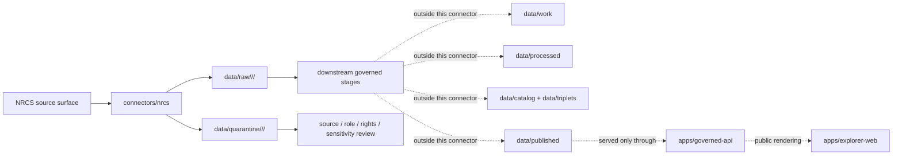

<!-- [KFM_META_BLOCK_V2]
doc_id: kfm://doc/connectors-nrcs-readme
title: connectors/nrcs/ — NRCS Connector Family Lane
type: readme
version: v0.1
status: draft
owners: OWNER_TBD — Source steward · Connector steward · NRCS steward · Soil steward · Agriculture steward · Hydrology steward · Ecology steward · Climate steward · Data steward · Validation steward · Docs steward
created: 2026-06-19
updated: 2026-06-19
policy_label: public; multi-product; source-admission-only
related:
  - ../README.md
  - ../../docs/doctrine/directory-rules.md
  - ../../docs/sources/catalog/nrcs.md
  - ../../docs/sources/catalog/nrcs/README.md
  - ../../docs/sources/catalog/nrcs/web-soil-survey.md
  - ../nrcs-ssurgo/README.md
  - ../nrcs-scan/README.md
  - ../../pipelines/domains/soil/ssurgo_ingest/README.md
  - ../../pipelines/domains/soil/scan_awdb_ingest/README.md
  - ../../docs/domains/soil/README.md
  - ../../docs/domains/agriculture/README.md
  - ../../docs/domains/hydrology/README.md
  - ../../docs/domains/atmosphere/README.md
  - ../../data/registry/sources/
  - ../../data/raw/
  - ../../data/quarantine/
  - ../../data/receipts/
  - ../../data/proofs/
  - ../../policy/rights/
  - ../../policy/sensitivity/
  - ../../release/
tags: [kfm, connectors, nrcs, usda, ssurgo, gssurgo, statsgo, soil-data-access, web-soil-survey, scan, snotel, nwcc, ecological-sites, conservation, soil, agriculture, hydrology, climate, source-admission, raw, quarantine, governance]
notes:
  - "Parent connector-family lane for NRCS source intake and admission helpers."
  - "Directory Rules §7.3 lists nrcs/ in the canonical connector spine; this README defines the connector-family boundary, not source or product truth."
  - "NRCS products are multi-product and role-specific; do not admit all NRCS material under one source role, cadence, scale, or release posture."
  - "Source-family and source-product doctrine belong under docs/sources/catalog/nrcs.md, docs/sources/catalog/nrcs/, and source descriptors, not here."
  - "Connector output may enter raw or quarantine admission lanes only."
  - "NRCS material must not become parcel ownership truth, private landowner truth, conservation-compliance truth, legal access truth, water-rights truth, field verification, policy authority, or public release by itself."
[/KFM_META_BLOCK_V2] -->

<a id="top"></a>

# NRCS Connector Family

> Parent source-specific fetch and admission lane for USDA Natural Resources Conservation Service source material used by KFM Soil, Agriculture, Hydrology, Ecology, Climate, Conservation, and Focus Mode workflows.

<p>
  
  
  
  
  
  
  
</p>

`connectors/nrcs/`

## Quick jumps

[Scope](#scope) · [Repo fit](#repo-fit) · [NRCS product lanes](#nrcs-product-lanes) · [Lifecycle sketch](#lifecycle-sketch) · [Authority boundary](#authority-boundary) · [Inputs](#inputs) · [Exclusions](#exclusions) · [Admission posture](#admission-posture) · [Anti-collapse posture](#anti-collapse-posture) · [Sibling placement posture](#sibling-placement-posture) · [Validation](#validation) · [Definition of done](#definition-of-done)

---

## Scope

`connectors/nrcs/` is the canonical connector-family lane for NRCS source intake and admission helpers.

This folder may contain connector-family documentation, shared NRCS request helpers, source-admission conventions, product-lane indexes, fixture pointers, no-network test guidance, and raw/quarantine output adapters for NRCS products. It may also host nested product-specific connector lanes if Directory Rules, ADRs, or a migration note consolidate sibling NRCS connectors under this family.

It must not become NRCS source-family truth, product doctrine, Soil domain doctrine, conservation policy, private landowner truth, parcel truth, water-rights truth, regulatory determination authority, field verification, source descriptor authority, schema authority, catalog/triplet authority, proof authority, release authority, pipeline authority, public API behavior, or public UI behavior.

> [!IMPORTANT]
> **Status:** draft / `NEEDS VERIFICATION`  
> **Owner:** `OWNER_TBD`  
> **Path:** `connectors/nrcs/`  
> **Truth posture:** the path exists in the repository as this README; actual modules, endpoints, tests, fixtures, source descriptors, credentials, CI wiring, product-lane inventory, parser behavior, and release behavior remain `NEEDS VERIFICATION`.

---

## Repo fit

```text
connectors/
└── nrcs/
    └── README.md
```

Related responsibility roots:

```text
connectors/                                  # source-specific fetch and admission code
docs/sources/catalog/nrcs.md                # NRCS source-family profile
docs/sources/catalog/nrcs/                  # NRCS source-family and product-page doctrine
docs/domains/soil/                          # soil domain context
docs/domains/agriculture/                   # agriculture and conservation context
docs/domains/hydrology/                     # hydrology and water-context interpretation
docs/domains/atmosphere/                    # climate and station-observation context
pipelines/domains/soil/                     # downstream executable soil pipelines, not connector-owned
data/registry/sources/                      # source descriptors and activation state
data/raw/                                   # raw staged source outputs by owning domain
data/quarantine/                            # held material requiring source/role/rights/sensitivity review
data/receipts/                              # ingest, checksum, transform, aggregation, and review receipts
data/proofs/                                # EvidenceBundles and proof packs
policy/rights/                              # terms, attribution, and source-use review
policy/sensitivity/                         # tribal, private-land, ecology, cultural, exact-location, and release rules
release/                                    # release decisions, manifests, rollback, correction state
apps/governed-api/                          # downstream public trust membrane, not connector-owned
apps/explorer-web/                          # downstream map UI, never direct RAW/QUARANTINE access
```

---

## NRCS product lanes

NRCS is a multi-product source family. Do not create a single NRCS-wide source role, cadence, scale, schema, or release posture.

| Product or sub-source | Product doctrine | Default posture | Connector placement status |
|---|---|---|---|
| SSURGO | `docs/sources/catalog/nrcs.md`; `docs/sources/catalog/nrcs/` | Primary for official soil-survey spatial/tabular source material within intended scale and coverage. | Parent family is `connectors/nrcs/`; sibling `connectors/nrcs-ssurgo/` exists as draft and may need ADR/migration. |
| gSSURGO | `docs/sources/catalog/nrcs.md`; product doc if present | Derived gridded/statewide soil product; preserve derivative lineage and generalization notes. | `NEEDS VERIFICATION`. |
| STATSGO2 | `docs/sources/catalog/nrcs.md` | Broad regional context only; too coarse for parcel or detailed county-feature claims. | `NEEDS VERIFICATION`. |
| Soil Data Access | `docs/sources/catalog/nrcs.md`; product doc if present | Query-backed soil attributes; query and response must be receipted. | `NEEDS VERIFICATION`. |
| Web Soil Survey | `docs/sources/catalog/nrcs/web-soil-survey.md` | Disposition open for WSS as ingest surface; WSS may be link-out, candidate-evidence, or full ingest only after ADR. | `UNRESOLVED / ADR-needed`. |
| SCAN | `docs/sources/catalog/nrcs.md` | Primary for station observations; station is not area truth; Tribal SCAN requires extra review. | Parent family is `connectors/nrcs/`; sibling `connectors/nrcs-scan/` exists as draft and may need ADR/migration. |
| SNOTEL / snow survey | `docs/sources/catalog/nrcs.md` | Station/product records for snowpack and water-supply context; freshness matters. | `NEEDS VERIFICATION`. |
| Ecological Site Descriptions | `docs/sources/catalog/nrcs.md`; product doc if present | Public ecological-site records with sensitive ecology review. | `NEEDS VERIFICATION`. |
| Conservation practice standards | `docs/sources/catalog/nrcs.md`; product doc if present | Public technical standards/guidance; does not prove local implementation. | `NEEDS VERIFICATION`. |

> [!CAUTION]
> An NRCS product mentioned here is not admitted just because it appears in this table. Admission requires an active SourceDescriptor, rights and sensitivity posture, source-role assignment, fixture/test coverage, and governed raw/quarantine handoff.

---

## Lifecycle sketch



> [!CAUTION]
> Connector code admits source material. It does not normalize soil records, publish soil layers, decide public release, prove parcel or ownership claims, certify conservation compliance, or answer public claims. Promotion remains a governed state transition, not a file move.

---

## Authority boundary

```text
OUTPUT LIMIT:
  data/raw/<domain>/<source_id>/<run_id>/
  data/quarantine/<domain>/<source_id>/<run_id>/

NOT HERE:
  NRCS source-family truth
  product-page doctrine
  Soil or Agriculture domain truth
  private landowner, parcel, access, or ownership truth
  conservation-compliance authority
  farm-program authority
  water-rights authority
  field verification
  source descriptor authority
  rights or sensitivity policy
  processed derivatives
  catalog records
  triplet records
  public tiles or map artifacts
  receipts/proofs as authority
  release decisions
  published artifacts
  public API behavior
  public UI behavior
```

---

## Inputs

| Accepted item | Required posture |
|---|---|
| Family README and index | Orient NRCS connector work without claiming source activation, rights, release, or publication state. |
| Shared request helper | Preserve endpoint family, product lane, request path, parameters, retrieval time, response status, and source descriptor reference. |
| Product manifest helper | Preserve product, cadence, scale, survey area, station, issue/update time, file name, file vintage, size, digest, and source URL where applicable. |
| Parser helper | Preserve product-specific fields and source-role distinctions; do not collapse NRCS-wide semantics. |
| Freshness helper | Preserve source date, package date, observation time, report period, retrieval time, file vintage, and correction/update markers where applicable. |
| Rights/citation helper | Preserve USDA/NRCS terms, citation, attribution posture, and review status. |
| Sensitivity helper | Route tribal, private-land, ecology, cultural, exact-location, compliance, producer, or program-participation material to review. |
| Test references | Point to owning fixture/test roots; fixtures do not become source authority. |
| Migration notes | Explain if sibling product connectors move under `connectors/nrcs/`; preserve redirects and rollback path. |

---

## Exclusions

| Do not store here | Correct home |
|---|---|
| NRCS source-family doctrine | `docs/sources/catalog/nrcs.md`, `docs/sources/catalog/nrcs/` |
| Authoritative `SourceDescriptor` records | `data/registry/sources/` |
| Soil, Agriculture, Hydrology, Ecology, or Atmosphere doctrine | `docs/domains/` under owning domain lanes |
| Executable soil normalization pipelines | `pipelines/domains/soil/` or accepted pipeline home |
| Rights, sensitivity, or release policy | `policy/`, `policy/sensitivity/`, `release/` |
| Processed NRCS derivatives | `data/processed/` |
| Catalog or triplet records | `data/catalog/`, `data/triplets/` |
| Public map artifacts | `data/published/` after governed release |
| Receipts and proof packs as authority | `data/receipts/`, `data/proofs/` |
| Schemas or semantic contracts | `schemas/`, `contracts/` |
| Generated reports | `artifacts/` |
| Public UI or API behavior | `apps/governed-api/`, `apps/explorer-web/` |
| Credentials, tokens, cookies, or account/session material | Nowhere in the repo unless a separate secrets policy explicitly allows an encrypted external secret reference. |

---

## Admission posture

NRCS intake should preserve:

- source identity and source surface;
- active source descriptor reference;
- product lane and source-role candidate;
- request URL/path, query/body parameters, and redacted request metadata;
- retrieval timestamp, response status, content digest, and source file identity;
- source date, package date, observation time, report period, file vintage, and correction/update markers where applicable;
- native product fields, units, geometry, coordinate system, scale, quality flags, station metadata, map-unit/component/horizon lineage, and product version metadata;
- product-specific caveats and anti-collapse rules;
- rights/citation/attribution posture;
- domain-lane routing hint such as soil, agriculture, hydrology, ecology, atmosphere, or conservation;
- sensitivity limitation notes;
- quarantine reason when review is required.

---

## Anti-collapse posture

NRCS products carry different epistemic roles. The connector family must preserve those differences.

| Risk | Connector implication |
|---|---|
| NRCS-wide role collapse | Do not admit all NRCS material under one source role. Use product-specific SourceDescriptors. |
| Source package as processed truth | SSURGO and related products are admitted source material; domain normalization and release happen downstream. |
| Map unit as parcel | Do not imply ownership, tax, legal access, zoning, public-road status, or parcel boundary truth. |
| Soil interpretation as legal determination | Hydric, farmland, limitation, flooding-frequency, and engineering ratings need context and downstream gates. |
| Station as area truth | SCAN/SNOTEL station readings must not become county, watershed, or raster truth without downstream receipts. |
| Tribal or private-land context as public by default | Tribal SCAN, producer, program, compliance, and conservation-plan contexts require fail-closed review. |
| Conservation standard as local implementation proof | Practice standards do not prove a practice exists on private land. |
| WSS session output as canonical source | WSS disposition remains unresolved unless an ADR/source descriptor accepts a narrow posture. |
| Public display as publication | Public map/API/UI products require governed release outside this connector family. |

---

## Sibling placement posture

`connectors/nrcs/` is the canonical NRCS connector family lane. Several product-specific sibling connector lanes may exist or may be requested as draft scaffolds. Treat them as temporary or product-lane-specific homes until Directory Rules, ADRs, or a migration note decides whether they remain siblings or move under this parent.

| Sibling connector lane | Status | Recommended posture |
|---|---|---|
| `connectors/nrcs-ssurgo/` | Draft sibling lane if present. | Preserve product-specific README; consider migration to `connectors/nrcs/ssurgo/` only with ADR/migration note. |
| `connectors/nrcs-scan/` | Draft sibling lane if present. | Preserve product-specific README; consider migration to `connectors/nrcs/scan/` only with ADR/migration note. |
| `connectors/nrcs/*` nested lanes | `PROPOSED`. | Preferred for new NRCS sub-lanes if a future migration consolidates under the canonical family. |

No move, delete, or rename is implied by this README.

---

## Validation

Before relying on this connector family, verify:

- actual files, modules, tests, fixtures, and CI wiring below `connectors/nrcs/`;
- whether product-specific sibling lanes should remain siblings or be migrated under `connectors/nrcs/`;
- source descriptors exist and are active for each admitted NRCS product;
- rights, citation, attribution, terms, and sensitivity posture are captured per product;
- source-role, freshness, cadence, geometry, scale, quality flags, units, station metadata, and product/version fields survive parsing;
- no-network tests exist for each product parser;
- outputs are limited to raw/quarantine admission lanes;
- downstream receipts, proofs, catalog/triplet records, public map artifacts, release records, public API responses, and UI layers are produced only outside this connector family;
- public products are released only through governed publication controls and never as parcel, compliance, program-participation, field-verification, water-rights, or legal-access truth without separate authority.

---

## Definition of done

- [ ] Owners are confirmed and `OWNER_TBD` is replaced.
- [ ] Actual connector-family contents are inventoried.
- [ ] Sibling NRCS connector placement is recorded in an ADR, migration note, or drift/open-question register.
- [ ] Active `SourceDescriptor` IDs are verified for each admitted NRCS product lane.
- [ ] NRCS rights, citation, attribution, terms, source-role, endpoint, cadence, freshness, scale, and sensitivity posture are documented per product lane.
- [ ] Request/download/service helpers preserve source URL, product lane, source role, cadence, scale, time fields, file identity, and digest.
- [ ] Parsers preserve product-native fields and do not collapse official soil survey data, query responses, station readings, snow products, ecological site records, conservation standards, and human-facing portal exports into one role.
- [ ] Outputs are verified to enter only raw or quarantine admission lanes.
- [ ] No source-family, domain, processed, catalog, triplet, published, release, schema, policy, proof, receipt, registry, fixture, report, API, UI, tile, parcel, ownership, access, compliance, program-participation, water-rights, field-verification, or regulatory authority lives here.
- [ ] Tests, fixtures, and CI behavior are verified or marked `NEEDS VERIFICATION`.

---

## Status summary

`connectors/nrcs/` is for NRCS source-admission code and connector-family coordination only. It is not NRCS source-family truth, product doctrine, Soil domain truth, private land truth, parcel truth, field verification, conservation-compliance authority, water-rights authority, legal access authority, policy authority, schema authority, catalog/triplet authority, proof closure, release authority, public map authority, public API behavior, public UI behavior, or pipeline authority.

<p align="right"><a href="#top">Back to top</a></p>
